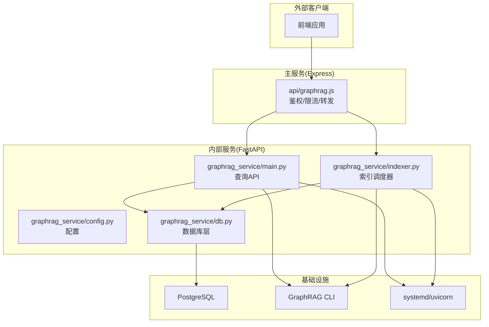
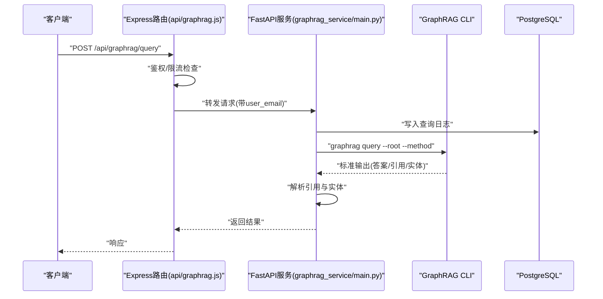
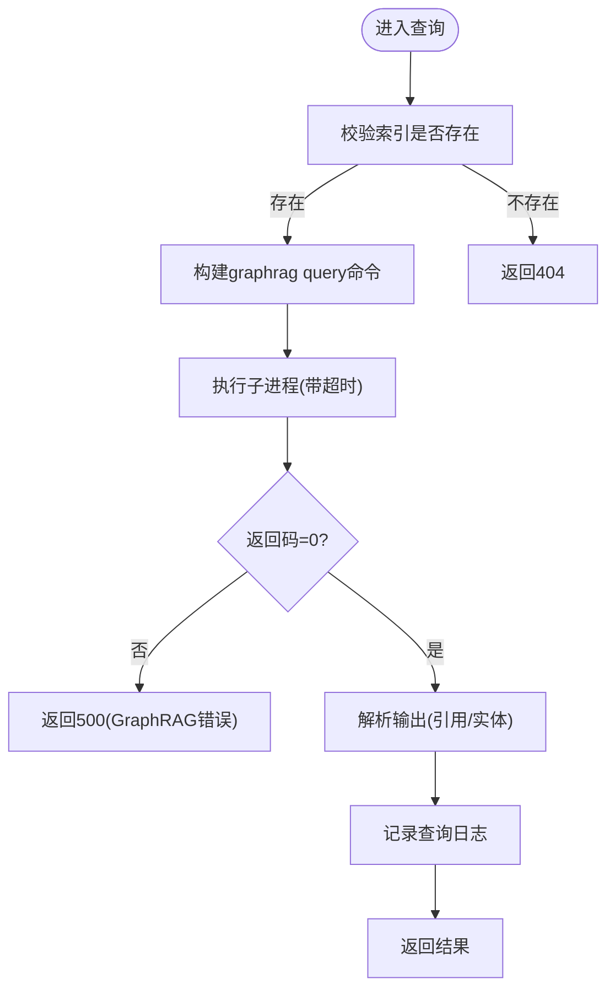
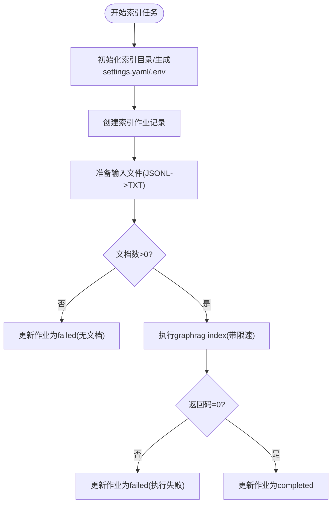
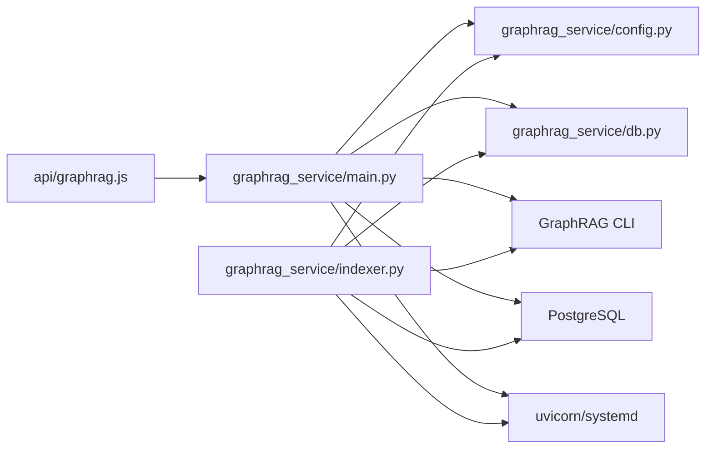
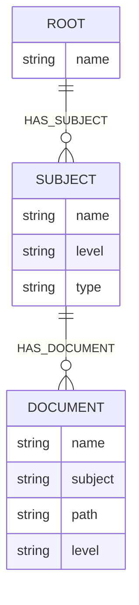

# AI知识图谱服务

<cite>
**本文档引用的文件**
- [graphrag_service/main.py](file://graphrag_service/main.py)
- [graphrag_service/config.py](file://graphrag_service/config.py)
- [graphrag_service/db.py](file://graphrag_service/db.py)
- [graphrag_service/indexer.py](file://graphrag_service/indexer.py)
- [api/graphrag.js](file://api/graphrag.js)
- [scripts/run_graphrag_index.py](file://scripts/run_graphrag_index.py)
- [scripts/setup_graphrag.sh](file://scripts/setup_graphrag.sh)
- [scripts/init_graphrag_service.sh](file://scripts/init_graphrag_service.sh)
- [deploy/uibe-graphrag.service](file://deploy/uibe-graphrag.service)
- [Dockerfile](file://Dockerfile)
- [docker-compose.yml](file://docker-compose.yml)
- [database/graphify-gaokao-knowledge/graph.cypher](file://database/graphify-gaokao-knowledge/graph.cypher)
- [database/graphify-gaokao-knowledge/metadata.jsonl](file://database/graphify-gaokao-knowledge/metadata.jsonl)
</cite>

## 目录
1. [简介](#简介)
2. [项目结构](#项目结构)
3. [核心组件](#核心组件)
4. [架构总览](#架构总览)
5. [详细组件分析](#详细组件分析)
6. [依赖关系分析](#依赖关系分析)
7. [性能考虑](#性能考虑)
8. [故障排除指南](#故障排除指南)
9. [结论](#结论)
10. [附录](#附录)

## 简介
本项目为AI知识图谱服务，基于GraphRAG技术栈构建，提供高考/中考真题与知识点的智能检索、相似题推荐、知识图谱关系分析与试卷溯源能力。系统采用双层架构：前端通过Express路由进行鉴权与限流后，将请求转发至内部FastAPI服务；内部服务负责调用GraphRAG CLI执行查询与索引任务，并通过PostgreSQL持久化文档、索引作业与查询日志。

## 项目结构
- 后端服务
  - graphrag_service：FastAPI内部查询服务与索引调度器
  - api：对外Express路由，负责鉴权、限流与请求转发
  - scripts：部署与索引辅助脚本
  - database：知识图谱Cypher样例与元数据
- 前端与容器化
  - Dockerfile与docker-compose.yml：应用容器化与健康检查
  - deploy：systemd服务配置，用于生产部署

**图表来源**
- [graphrag_service/main.py:1-462](file://graphrag_service/main.py#L1-L462)
- [graphrag_service/indexer.py:1-359](file://graphrag_service/indexer.py#L1-L359)
- [api/graphrag.js:1-224](file://api/graphrag.js#L1-L224)
- [graphrag_service/db.py:1-215](file://graphrag_service/db.py#L1-L215)
- [graphrag_service/config.py:1-59](file://graphrag_service/config.py#L1-L59)

**章节来源**
- [graphrag_service/main.py:1-462](file://graphrag_service/main.py#L1-L462)
- [api/graphrag.js:1-224](file://api/graphrag.js#L1-L224)

## 核心组件
- FastAPI查询服务：提供健康检查、通用查询、题目讲解、相似题推荐、知识图谱关系图、试卷溯源等接口；内置CORS白名单与查询日志记录。
- 索引调度器：支持限速、断点续跑、失败重试；自动生成settings.yaml与.env；将JSONL转换为GraphRAG可读的文本格式并执行索引。
- 数据库层：维护文档、分片、索引作业与查询日志四张表，提供作业状态、文档统计与查询日志写入。
- Express路由：对外统一入口，进行用户鉴权、每用户每分钟限流、错误透传与内部服务URL配置。
- 配置管理：集中管理LLM API密钥、基础地址、模型名、服务主机端口、索引过滤规则与速率限制。
- 部署与容器化：systemd服务、Dockerfile与docker-compose，支持健康检查与资源限制。

**章节来源**
- [graphrag_service/main.py:178-420](file://graphrag_service/main.py#L178-L420)
- [graphrag_service/indexer.py:29-316](file://graphrag_service/indexer.py#L29-L316)
- [graphrag_service/db.py:26-215](file://graphrag_service/db.py#L26-L215)
- [api/graphrag.js:15-80](file://api/graphrag.js#L15-L80)
- [graphrag_service/config.py:8-59](file://graphrag_service/config.py#L8-L59)

## 架构总览
系统采用“前端路由 -> 内部FastAPI服务 -> GraphRAG CLI -> PostgreSQL”的链路。查询请求经Express路由鉴权与限流后转发到内部服务，内部服务调用GraphRAG CLI执行查询，解析结果并记录日志；索引任务由独立调度器执行，支持并发限速与重试。

**图表来源**
- [api/graphrag.js:38-59](file://api/graphrag.js#L38-L59)
- [graphrag_service/main.py:98-157](file://graphrag_service/main.py#L98-L157)
- [graphrag_service/db.py:169-181](file://graphrag_service/db.py#L169-L181)

**章节来源**
- [api/graphrag.js:88-112](file://api/graphrag.js#L88-L112)
- [graphrag_service/main.py:191-224](file://graphrag_service/main.py#L191-L224)

## 详细组件分析

### FastAPI查询服务
- 生命周期与健康检查：服务启动时初始化数据库表，提供健康检查接口返回可用索引与文档统计。
- 查询接口：
  - 通用查询：支持指定索引、查询方法(local/global/drift/basic)与top_k。
  - 题目讲解：自动构造提示词，调用GraphRAG提取知识点与真题参考。
  - 相似题推荐：支持按学科、省份、年份范围筛选，返回相似题目列表。
  - 知识图谱关系图：按学科/考试级别/省份选择索引，执行全局搜索。
  - 试卷溯源：按省份、年份、学科查询真题信息。
- 结果解析：从标准输出中提取引用[^N^]与加粗实体，限制实体数量。
- 错误处理：捕获子进程超时、GraphRAG返回码非零与通用异常，返回HTTP错误。

**图表来源**
- [graphrag_service/main.py:98-157](file://graphrag_service/main.py#L98-L157)
- [graphrag_service/db.py:169-181](file://graphrag_service/db.py#L169-L181)

**章节来源**
- [graphrag_service/main.py:178-394](file://graphrag_service/main.py#L178-L394)

### 索引调度器
- 限速器：基于令牌桶算法，控制每分钟最大请求数，避免LLM API限流。
- 设置生成：为每个索引生成settings.yaml与.env，配置LLM与嵌入模型、缓存、向量存储等。
- 输入准备：从数据库筛选待索引文档，生成JSONL并转换为GraphRAG可读文本，统计文档数量。
- 索引执行：调用GraphRAG CLI执行index，失败自动重试，更新作业状态。
- 作业管理：创建、更新索引作业，查询待处理任务与统计信息。

**图表来源**
- [graphrag_service/indexer.py:155-316](file://graphrag_service/indexer.py#L155-L316)

**章节来源**
- [graphrag_service/indexer.py:29-316](file://graphrag_service/indexer.py#L29-L316)

### 数据库层
- 表结构：
  - graphrag_documents：文档元数据与状态，含多维索引。
  - graphrag_chunks：文档分片与嵌入ID。
  - graphrag_index_jobs：索引作业状态与进度。
  - graphrag_query_logs：查询日志与引用。
  - exam_source_files：试卷源文件关联。
- 功能：
  - 初始化表与索引。
  - 查询待处理文档与统计。
  - 记录查询日志与作业状态更新。

**章节来源**
- [graphrag_service/db.py:26-215](file://graphrag_service/db.py#L26-L215)

### Express路由与转发
- 鉴权中间件：确保请求来自已登录用户。
- 限流策略：基于用户邮箱的简单内存限流，每用户每分钟上限。
- 转发逻辑：将请求体附加user_email后转发至内部FastAPI服务，GET请求拼接查询字符串。
- 管理接口：仅管理员可访问作业状态、统计与重新索引触发。

**章节来源**
- [api/graphrag.js:15-80](file://api/graphrag.js#L15-L80)
- [api/graphrag.js:180-221](file://api/graphrag.js#L180-L221)

### 配置管理
- 环境变量：LLM API密钥、基础地址、模型名、速率限制、服务主机端口、数据库URL。
- 索引配置：定义多个索引的过滤条件与描述，用于按学科/省份/考试类型选择索引。
- 速率限制：默认每分钟7次，保证与LLM服务的配额兼容。

**章节来源**
- [graphrag_service/config.py:8-59](file://graphrag_service/config.py#L8-L59)

### 部署与容器化
- systemd服务：uibe-graphrag.service，设置工作目录、执行命令、环境变量与资源限制。
- Dockerfile：基于node镜像，安装Python与编译工具，设置健康检查。
- docker-compose：挂载数据库卷，暴露3000端口，配置健康检查。
- 一键部署脚本：setup_graphrag.sh安装依赖、初始化数据库、安装systemd服务并启动。

**章节来源**
- [deploy/uibe-graphrag.service:1-19](file://deploy/uibe-graphrag.service#L1-L19)
- [Dockerfile:1-26](file://Dockerfile#L1-L26)
- [docker-compose.yml:1-26](file://docker-compose.yml#L1-L26)
- [scripts/setup_graphrag.sh:1-94](file://scripts/setup_graphrag.sh#L1-L94)

## 依赖关系分析
- 组件耦合
  - FastAPI服务依赖配置模块与数据库层，调用GraphRAG CLI执行查询。
  - 索引调度器依赖配置模块与数据库层，负责索引准备与执行。
  - Express路由依赖FastAPI服务，提供鉴权与限流。
- 外部依赖
  - GraphRAG CLI：执行查询与索引。
  - PostgreSQL：持久化文档、索引作业与查询日志。
  - uvicorn/systemd：服务运行与守护。
- 循环依赖
  - 未发现循环依赖，模块职责清晰。

**图表来源**
- [api/graphrag.js:1-224](file://api/graphrag.js#L1-L224)
- [graphrag_service/main.py:1-462](file://graphrag_service/main.py#L1-L462)
- [graphrag_service/indexer.py:1-359](file://graphrag_service/indexer.py#L1-L359)
- [graphrag_service/db.py:1-215](file://graphrag_service/db.py#L1-L215)
- [graphrag_service/config.py:1-59](file://graphrag_service/config.py#L1-L59)

**章节来源**
- [graphrag_service/main.py:1-462](file://graphrag_service/main.py#L1-L462)
- [graphrag_service/indexer.py:1-359](file://graphrag_service/indexer.py#L1-L359)

## 性能考虑
- 限速与退避
  - 内部服务：基于令牌桶的限速器，避免LLM API限流。
  - 索引调度器：指数回退重试，减少瞬时压力。
- 子进程超时
  - 查询超时控制在合理范围内，防止阻塞。
- 数据库索引
  - 在文档表上建立多维索引，提升筛选与统计效率。
- 缓存与向量存储
  - GraphRAG settings.yaml启用JSON缓存与LanceDB向量存储，降低重复计算成本。
- 并发与资源
  - systemd设置CPU与内存限制，避免资源争用。

**章节来源**
- [graphrag_service/indexer.py:29-52](file://graphrag_service/indexer.py#L29-L52)
- [graphrag_service/main.py:117-131](file://graphrag_service/main.py#L117-L131)
- [graphrag_service/db.py:30-107](file://graphrag_service/db.py#L30-L107)
- [graphrag_service/indexer.py:59-152](file://graphrag_service/indexer.py#L59-L152)

## 故障排除指南
- 常见错误
  - 404 索引不存在：确认索引名称与构建状态。
  - 504 查询超时：检查GraphRAG CLI是否卡住或LLM服务不稳定。
  - 500 GraphRAG查询失败：查看子进程stderr，确认API密钥与基础地址正确。
  - 429 请求过于频繁：调整客户端频率或提高限流阈值。
- 日志与监控
  - systemd日志：journalctl -u uibe-graphrag -f。
  - 查询日志：通过管理接口查看graphrag_query_logs。
- 索引问题
  - 无可用文档：检查graphrag_documents状态与过滤条件。
  - 索引失败：查看graphrag_index_jobs错误信息与GraphRAG日志。
- 部署问题
  - 依赖缺失：执行一键部署脚本或手动安装依赖。
  - 环境变量：确保.env中包含LLM API配置。

**章节来源**
- [graphrag_service/main.py:102-131](file://graphrag_service/main.py#L102-L131)
- [api/graphrag.js:41-58](file://api/graphrag.js#L41-L58)
- [graphrag_service/db.py:112-166](file://graphrag_service/db.py#L112-L166)
- [scripts/setup_graphrag.sh:60-70](file://scripts/setup_graphrag.sh#L60-L70)

## 结论
本项目通过清晰的分层设计与完善的基础设施，实现了从文档入库、索引构建到智能查询的完整闭环。FastAPI服务提供稳定的查询接口，索引调度器保障大规模数据的可靠处理，Express路由确保对外访问的安全与可控。配合systemd与容器化部署，系统具备良好的可运维性与扩展性。

## 附录

### 图谱数据模型
- 节点与关系
  - Root：根节点，聚合所有主题。
  - Subject：学科节点，如物理、数学等。
  - Document：文档节点，指向具体PDF或文本。
  - 关系：HAS_SUBJECT、HAS_DOCUMENT等。
- 元数据
  - metadata.jsonl提供学科、文件名、路径与类型等字段，便于筛选与可视化。

**图表来源**
- [database/graphify-gaokao-knowledge/graph.cypher:1-50](file://database/graphify-gaokao-knowledge/graph.cypher#L1-L50)
- [database/graphify-gaokao-knowledge/metadata.jsonl:1-10](file://database/graphify-gaokao-knowledge/metadata.jsonl#L1-L10)

**章节来源**
- [database/graphify-gaokao-knowledge/graph.cypher:1-50](file://database/graphify-gaokao-knowledge/graph.cypher#L1-L50)
- [database/graphify-gaokao-knowledge/metadata.jsonl:1-10](file://database/graphify-gaokao-knowledge/metadata.jsonl#L1-L10)

### 查询优化策略
- 索引选择：根据学科、省份、考试级别动态选择最优索引，减少无关数据扫描。
- 查询方法：local/global/drift/basic按场景切换，平衡速度与准确性。
- 结果截断：实体列表限制数量，避免响应过大。
- 缓存：GraphRAG内置缓存与向量存储，复用中间结果。

**章节来源**
- [graphrag_service/main.py:160-173](file://graphrag_service/main.py#L160-L173)
- [graphrag_service/main.py:147-157](file://graphrag_service/main.py#L147-L157)
- [graphrag_service/indexer.py:101-146](file://graphrag_service/indexer.py#L101-L146)

### 嵌入向量处理
- 模型配置：settings.yaml中配置嵌入模型为text-embedding-3-small，使用OpenAI Provider。
- 向量存储：LanceDB作为向量数据库，加速相似检索。
- 文本切分：基于token的切分策略，兼顾上下文与长度。

**章节来源**
- [graphrag_service/indexer.py:72-114](file://graphrag_service/indexer.py#L72-L114)
- [graphrag_service/indexer.py:108-111](file://graphrag_service/indexer.py#L108-L111)

### 服务启动流程
- 初始化：安装依赖、创建虚拟环境、初始化数据库表。
- 文档转换：扫描、转换、生成JSONL。
- 索引准备：初始化索引目录、生成settings.yaml与.env。
- 索引执行：按顺序运行索引，间隔避免API限流。
- 查询服务：启动FastAPI服务，监听本地端口。
- 部署：systemd守护，健康检查与资源限制。

**章节来源**
- [scripts/init_graphrag_service.sh:15-71](file://scripts/init_graphrag_service.sh#L15-L71)
- [scripts/setup_graphrag.sh:21-70](file://scripts/setup_graphrag.sh#L21-L70)
- [graphrag_service/indexer.py:155-176](file://graphrag_service/indexer.py#L155-L176)
- [graphrag_service/main.py:453-461](file://graphrag_service/main.py#L453-L461)

### 配置管理
- 环境变量：GRAPHRAG_API_KEY、GRAPHRAG_API_BASE、GRAPHRAG_MODEL、GRAPHRAG_RATE_LIMIT_PER_HOUR、GRAPHRAG_SERVICE_HOST、GRAPHRAG_SERVICE_PORT、DATABASE_URL。
- 索引映射：INDEXES字典定义索引名称、过滤条件与描述。
- 速率限制：MAX_REQUESTS_PER_MINUTE与MAX_REQUESTS_PER_HOUR。

**章节来源**
- [graphrag_service/config.py:8-59](file://graphrag_service/config.py#L8-L59)

### LLM API集成与缓存机制
- API集成：通过环境变量注入API Key与基础地址，GraphRAG CLI读取。
- 缓存：settings.yaml启用JSON缓存，减少重复请求。
- 回退策略：索引执行使用指数回退重试，提升稳定性。

**章节来源**
- [graphrag_service/indexer.py:62-70](file://graphrag_service/indexer.py#L62-L70)
- [graphrag_service/indexer.py:101-107](file://graphrag_service/indexer.py#L101-L107)
- [graphrag_service/indexer.py:253-288](file://graphrag_service/indexer.py#L253-L288)

### 错误处理策略
- 子进程异常：超时与非零返回码统一转化为HTTP错误。
- 数据库异常：连接与事务管理由上下文管理器保证。
- 路由层：统一错误响应封装，区分业务错误与服务不可用。

**章节来源**
- [graphrag_service/main.py:117-131](file://graphrag_service/main.py#L117-L131)
- [graphrag_service/db.py:12-19](file://graphrag_service/db.py#L12-L19)
- [api/graphrag.js:53-58](file://api/graphrag.js#L53-L58)

### 部署指南
- 本地开发：初始化服务、转换文档、生成JSONL、初始化索引、运行索引、启动查询服务。
- 生产部署：一键部署脚本安装依赖、初始化数据库、安装systemd服务并启动。
- 容器化：Dockerfile与docker-compose配置健康检查与卷挂载。

**章节来源**
- [scripts/init_graphrag_service.sh:44-71](file://scripts/init_graphrag_service.sh#L44-L71)
- [scripts/setup_graphrag.sh:60-93](file://scripts/setup_graphrag.sh#L60-L93)
- [Dockerfile:22-25](file://Dockerfile#L22-L25)
- [docker-compose.yml:17-22](file://docker-compose.yml#L17-L22)

### 监控方案
- systemd日志：journalctl -u uibe-graphrag -f。
- 健康检查：systemd与Docker健康检查，定期探测/health端点。
- 查询日志：通过管理接口graphrag_query_logs分析查询行为与耗时。

**章节来源**
- [deploy/uibe-graphrag.service:13-15](file://deploy/uibe-graphrag.service#L13-L15)
- [Dockerfile:22-25](file://Dockerfile#L22-L25)
- [docker-compose.yml:17-22](file://docker-compose.yml#L17-L22)
- [graphrag_service/db.py:169-181](file://graphrag_service/db.py#L169-L181)

### 故障排除方法
- 索引失败：检查作业状态与错误信息，确认API配置与磁盘空间。
- 查询异常：查看内部服务日志与GraphRAG输出，验证索引存在性。
- 部署问题：核对依赖安装、环境变量与systemd状态。

**章节来源**
- [graphrag_service/db.py:142-166](file://graphrag_service/db.py#L142-L166)
- [graphrag_service/main.py:102-131](file://graphrag_service/main.py#L102-L131)
- [scripts/setup_graphrag.sh:60-70](file://scripts/setup_graphrag.sh#L60-L70)

### 与主系统的集成模式与数据同步机制
- 集成模式：Express路由作为对外统一入口，内部FastAPI服务提供查询能力；管理接口仅管理员可见。
- 数据同步：文档状态驱动索引作业，数据库记录文档、分片、作业与日志，支持增量转换与批量索引。
- 一致性：通过作业状态与错误信息反馈，确保索引与查询的一致性。

**章节来源**
- [api/graphrag.js:180-221](file://api/graphrag.js#L180-L221)
- [graphrag_service/db.py:200-214](file://graphrag_service/db.py#L200-L214)