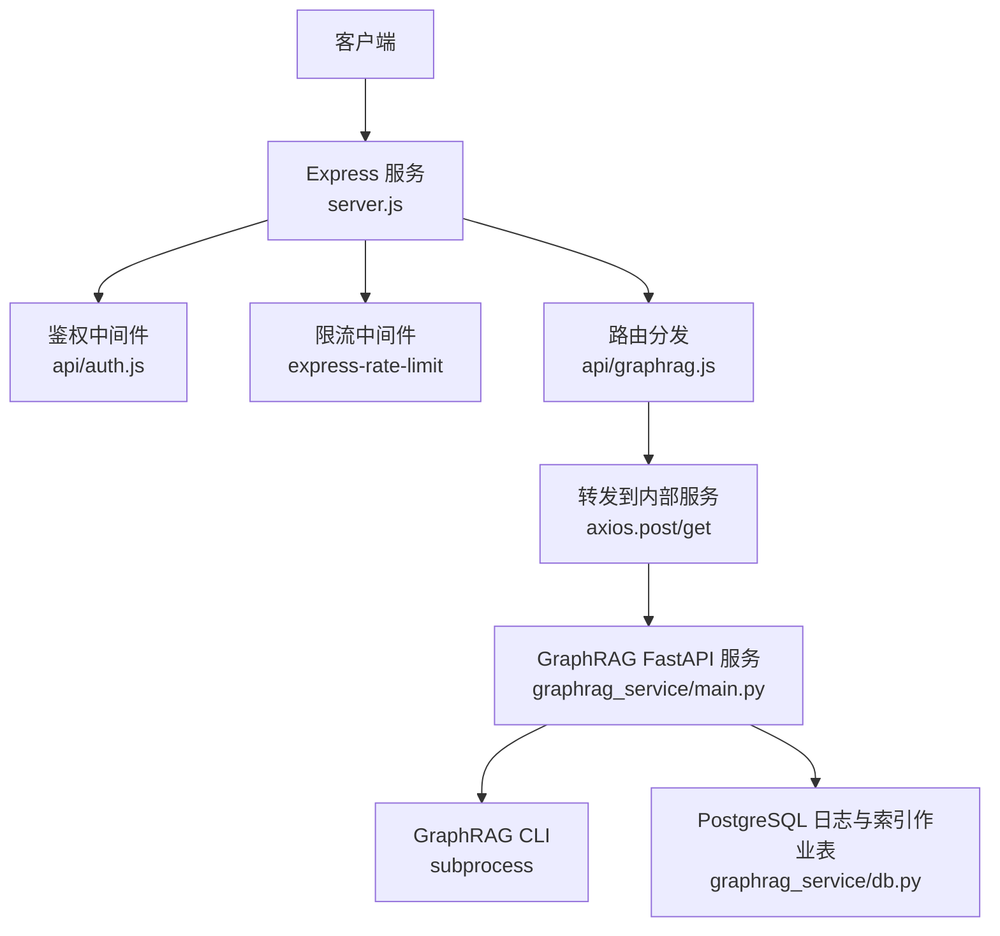
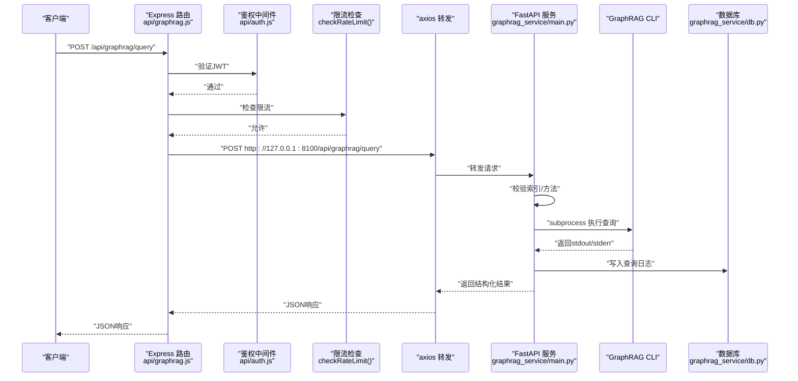
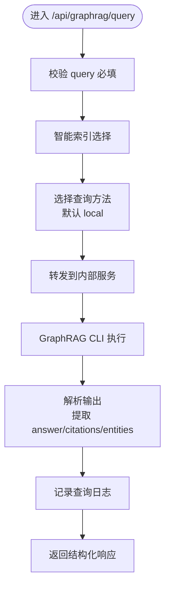
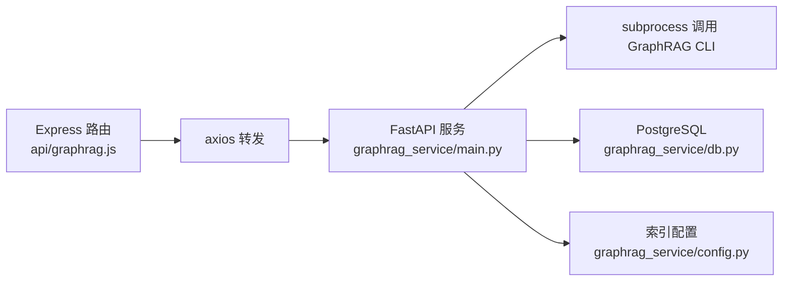

# API接口实现

<cite>
**本文档引用的文件**
- [api/graphrag.js](file://api/graphrag.js)
- [graphrag_service/main.py](file://graphrag_service/main.py)
- [graphrag_service/config.py](file://graphrag_service/config.py)
- [graphrag_service/db.py](file://graphrag_service/db.py)
- [graphrag_service/indexer.py](file://graphrag_service/indexer.py)
- [api/utils/response.js](file://api/utils/response.js)
- [api/auth.js](file://api/auth.js)
- [server.js](file://server.js)
</cite>

## 目录
1. [简介](#简介)
2. [项目结构](#项目结构)
3. [核心组件](#核心组件)
4. [架构总览](#架构总览)
5. [详细组件分析](#详细组件分析)
6. [依赖分析](#依赖分析)
7. [性能考虑](#性能考虑)
8. [故障排查指南](#故障排查指南)
9. [结论](#结论)
10. [附录](#附录)

## 简介
本文件面向GraphRAG服务的API接口实现，系统性梳理后端Express路由与内部FastAPI服务之间的交互，覆盖以下端点：
- 查询接口：/api/graphrag/query
- 题目讲解接口：/api/graphrag/explain
- 相似题目查找接口：/api/graphrag/similar-questions
- 知识图谱接口：/api/graphrag/knowledge-map
- 试卷溯源接口：/api/graphrag/paper-source（扩展能力）

并深入说明查询方法（local/global/drift/basic）的选择逻辑、性能影响、请求与响应格式、错误处理策略，以及API版本管理与兼容性说明。

## 项目结构
后端采用双层架构：
- 外层Express服务（server.js）负责鉴权、限流、CORS、静态资源与路由分发；
- 内层GraphRAG服务（graphrag_service/main.py）通过FastAPI提供知识检索与图谱分析能力，并调用GraphRAG CLI执行查询与索引。

图表来源
- [server.js:199](file://server.js#L199)
- [api/graphrag.js:38](file://api/graphrag.js#L38)
- [graphrag_service/main.py:178](file://graphrag_service/main.py#L178)

章节来源
- [server.js:199](file://server.js#L199)
- [api/graphrag.js:12](file://api/graphrag.js#L12)

## 核心组件
- Express路由与转发
  - 在外层路由中实现统一鉴权、简单内存限流、请求体校验与向内部服务转发。
  - GET端点通过URL查询参数拼接，POST端点通过请求体传递参数。
- 内部FastAPI服务
  - 提供标准的查询、讲解、相似题、知识图谱等端点，内置索引选择逻辑与查询方法选择。
  - 通过subprocess调用GraphRAG CLI，解析输出并返回结构化结果。
- 数据库与日志
  - 使用PostgreSQL记录文档、分块、索引作业与查询日志，便于审计与统计。

章节来源
- [api/graphrag.js:88](file://api/graphrag.js#L88)
- [graphrag_service/main.py:191](file://graphrag_service/main.py#L191)
- [graphrag_service/db.py:26](file://graphrag_service/db.py#L26)

## 架构总览
下图展示从客户端到内部服务的完整调用链路与错误处理路径：

图表来源
- [api/graphrag.js:38](file://api/graphrag.js#L38)
- [api/auth.js:29](file://api/auth.js#L29)
- [graphrag_service/main.py:191](file://graphrag_service/main.py#L191)
- [graphrag_service/db.py:169](file://graphrag_service/db.py#L169)

## 详细组件分析

### 查询接口 /api/graphrag/query
- 功能
  - 通用GraphRAG问答，支持自动索引选择与查询方法选择。
- 请求参数（POST）
  - query: string，必填，去除首尾空白。
  - index_name: string，可选，未提供时按规则自动选择。
  - method: string，可选，取值local/global/drift/basic，默认local。
  - subject, province, exam_level: string，用于智能索引选择。
  - top_k: number，可选，用于后续扩展。
- 智能索引选择逻辑
  - 若考试级别为“中考”且省份为“北京”，优先使用“北京中考”索引。
  - 若学科为“数学/语文”，使用对应学科深度索引。
  - 默认回退到“全国高考真题综合索引”。
- 查询方法选择
  - 默认使用local；如需全局视角可显式传入其他方法。
- 响应格式
  - success: boolean
  - query: string
  - answer: string（包含答案与引用标记）
  - citations: string[]（引用编号列表）
  - entities: string[]（抽取的实体，前若干项）
  - relations: any[]（预留）
  - method: string
  - index_name: string
  - duration_ms: number
- 错误处理
  - 参数缺失：400
  - 索引不存在：404
  - 查询超时：504
  - 其他内部错误：500
  - 转发失败：503 或上游状态码映射
- 性能影响
  - local：更快，适合常规问答。
  - global：更全面但耗时较长，适合知识图谱分析场景。
  - drift/basic：取决于具体实现，通常用于特定探索模式。

图表来源
- [api/graphrag.js:88](file://api/graphrag.js#L88)
- [graphrag_service/main.py:160](file://graphrag_service/main.py#L160)
- [graphrag_service/main.py:98](file://graphrag_service/main.py#L98)

章节来源
- [api/graphrag.js:88](file://api/graphrag.js#L88)
- [graphrag_service/main.py:191](file://graphrag_service/main.py#L191)
- [graphrag_service/main.py:160](file://graphrag_service/main.py#L160)

### 题目讲解接口 /api/graphrag/explain
- 功能
  - 对指定题目进行详细讲解，结合知识点与真题参考。
- 请求参数（POST）
  - question: string，必填。
  - subject: string，可选，默认“数学”。
  - index_name: string，可选，若不存在则按subject自动选择。
- 响应格式
  - success: boolean
  - question: string
  - subject: string
  - answer: string
  - citations: string[]
  - entities: string[]
  - method: "explain"
  - index_name: string
  - duration_ms: number
- 错误处理
  - 参数缺失：400
  - 索引不存在：404
  - 查询超时：504
  - 其他内部错误：500
- 性能与方法
  - 固定使用local方法，确保响应速度与稳定性。

章节来源
- [api/graphrag.js:118](file://api/graphrag.js#L118)
- [graphrag_service/main.py:227](file://graphrag_service/main.py#L227)

### 相似题目查找接口 /api/graphrag/similar-questions
- 功能
  - 基于题目文本查找相似真题，支持学科、省份、年份范围过滤。
- 请求参数（POST）
  - question_text: string，必填。
  - subject: string，可选。
  - province: string，可选。
  - year_range: number[2]，可选。
  - top_k: number，默认5。
- 响应格式
  - success: boolean
  - question: string（原文）
  - filters: string[]（过滤条件描述）
  - answer: string
  - citations: string[]
  - entities: string[]
  - method: "similar"
  - index_name: string
  - duration_ms: number
- 错误处理
  - 参数缺失：400
  - 索引不存在：404
  - 查询超时：504
  - 其他内部错误：500

章节来源
- [api/graphrag.js:136](file://api/graphrag.js#L136)
- [graphrag_service/main.py:276](file://graphrag_service/main.py#L276)

### 知识图谱接口 /api/graphrag/knowledge-map
- 功能
  - 获取指定学科/考试级别的知识图谱关系图，适合全局视角分析。
- 请求参数（GET）
  - subject: string，必填。
  - exam_level: string，默认“gaokao”。
  - province: string，可选。
- 响应格式
  - success: boolean
  - subject: string
  - exam_level: string
  - answer: string
  - citations: string[]
  - entities: string[]
  - method: "global"
  - index_name: string
- 错误处理
  - 参数缺失：400
  - 索引不存在：404
  - 查询超时：504
  - 其他内部错误：500
- 方法选择
  - 固定使用global方法，强调全局关系抽取与报告生成。

章节来源
- [api/graphrag.js:156](file://api/graphrag.js#L156)
- [graphrag_service/main.py:331](file://graphrag_service/main.py#L331)

### 试卷溯源接口 /api/graphrag/paper-source（扩展能力）
- 功能
  - 根据省份、年份、学科查找原始试卷信息，辅助溯源与趋势分析。
- 请求参数（GET）
  - province: string，必填。
  - year: number，必填。
  - subject: string，必填。
- 响应格式
  - success: boolean
  - province: string
  - year: number
  - subject: string
  - answer: string
  - citations: string[]
  - entities: string[]
  - method: "local"
  - index_name: string
- 错误处理
  - 参数缺失：400
  - 索引不存在：404
  - 查询超时：504
  - 其他内部错误：500

章节来源
- [api/graphrag.js:170](file://api/graphrag.js#L170)
- [graphrag_service/main.py:363](file://graphrag_service/main.py#L363)

## 依赖分析
- 外层Express依赖
  - 鉴权中间件：校验JWT，拒绝未登录与过期令牌。
  - 限流：内存级简单限流（每用户每分钟上限），防止滥用。
  - 转发：axios.post/axios.get，超时控制，错误映射。
- 内层FastAPI依赖
  - GraphRAG CLI：通过subprocess调用，环境变量注入LLM配置。
  - 数据库：PostgreSQL，记录文档、分块、索引作业与查询日志。
  - 索引配置：多索引集合，按学科、地区、考试类型划分。

图表来源
- [api/graphrag.js:38](file://api/graphrag.js#L38)
- [graphrag_service/main.py:113](file://graphrag_service/main.py#L113)
- [graphrag_service/db.py:26](file://graphrag_service/db.py#L26)
- [graphrag_service/config.py:23](file://graphrag_service/config.py#L23)

章节来源
- [api/graphrag.js:38](file://api/graphrag.js#L38)
- [graphrag_service/main.py:113](file://graphrag_service/main.py#L113)
- [graphrag_service/db.py:26](file://graphrag_service/db.py#L26)
- [graphrag_service/config.py:23](file://graphrag_service/config.py#L23)

## 性能考虑
- 查询方法选择
  - local：低延迟，适合日常问答与相似题检索。
  - global：高成本，适合知识图谱分析与宏观趋势。
  - drift/basic：按实现而定，通常用于探索性查询。
- 限流策略
  - 外层Express提供每用户每分钟上限，避免突发流量冲击。
  - 内层GraphRAG服务通过令牌桶限速器控制LLM调用频率。
- 超时与重试
  - 外层转发设置较短超时，快速失败并返回503。
  - 内层查询设置超时保护，避免长时间占用资源。
- 索引选择
  - 通过智能选择减少无关文档扫描，提升命中率与速度。

章节来源
- [api/graphrag.js:20](file://api/graphrag.js#L20)
- [graphrag_service/indexer.py:29](file://graphrag_service/indexer.py#L29)
- [graphrag_service/main.py:126](file://graphrag_service/main.py#L126)

## 故障排查指南
- 常见错误与定位
  - 400 参数错误：检查必填字段与格式（如query、question、subject等）。
  - 401 认证失败：确认Authorization头与JWT密钥配置。
  - 403 权限不足：管理员端点仅允许特定邮箱访问。
  - 404 索引不存在：确认索引名称是否在配置中定义且已完成构建。
  - 429 请求过于频繁：降低调用频率或调整限流阈值。
  - 503 服务不可用：内部服务未启动或网络不通。
  - 504 查询超时：增大超时时间或切换为local方法。
- 日志与监控
  - 查询日志记录在数据库表中，可用于审计与性能分析。
  - 健康检查端点返回可用索引与文档统计，便于运维巡检。

章节来源
- [api/graphrag.js:45](file://api/graphrag.js#L45)
- [graphrag_service/main.py:178](file://graphrag_service/main.py#L178)
- [graphrag_service/db.py:169](file://graphrag_service/db.py#L169)

## 结论
该API体系通过外层Express路由与内层FastAPI服务的清晰分工，实现了从鉴权、限流、参数校验到内部查询与日志记录的完整闭环。查询方法与索引选择逻辑兼顾性能与准确性，适用于日常问答、题目讲解、相似题检索与知识图谱分析等多种场景。建议在生产环境中完善令牌桶限速、超时与重试策略，并持续优化索引结构与提示词工程以提升效果与稳定性。

## 附录

### API版本管理与兼容性
- 版本号
  - 内部服务版本号在FastAPI应用中声明，当前版本为1.0.0。
- 兼容性
  - 新增端点与参数时，保持现有字段不变，新增字段设为可选，避免破坏既有客户端。
  - 索引配置以枚举形式维护，新增索引需同步更新配置字典。

章节来源
- [graphrag_service/main.py:50](file://graphrag_service/main.py#L50)
- [graphrag_service/config.py:23](file://graphrag_service/config.py#L23)

### 请求与响应示例（路径指引）
- 查询接口
  - 请求：POST /api/graphrag/query
  - 示例请求体：包含query、index_name、method等字段
  - 响应：success、query、answer、citations、entities、method、index_name、duration_ms
  - 参考路径：[api/graphrag.js:88](file://api/graphrag.js#L88)，[graphrag_service/main.py:191](file://graphrag_service/main.py#L191)
- 题目讲解
  - 请求：POST /api/graphrag/explain
  - 示例请求体：包含question、subject、index_name
  - 响应：success、question、subject、answer、citations、entities、method、index_name、duration_ms
  - 参考路径：[api/graphrag.js:118](file://api/graphrag.js#L118)，[graphrag_service/main.py:227](file://graphrag_service/main.py#L227)
- 相似题目
  - 请求：POST /api/graphrag/similar-questions
  - 示例请求体：包含question_text、subject、province、year_range、top_k
  - 响应：success、question、filters、answer、citations、entities、method、index_name、duration_ms
  - 参考路径：[api/graphrag.js:136](file://api/graphrag.js#L136)，[graphrag_service/main.py:276](file://graphrag_service/main.py#L276)
- 知识图谱
  - 请求：GET /api/graphrag/knowledge-map?subject=...&exam_level=...&province=...
  - 响应：success、subject、exam_level、answer、citations、entities、method、index_name
  - 参考路径：[api/graphrag.js:156](file://api/graphrag.js#L156)，[graphrag_service/main.py:331](file://graphrag_service/main.py#L331)
- 试卷溯源
  - 请求：GET /api/graphrag/paper-source?province=...&year=...&subject=...
  - 响应：success、province、year、subject、answer、citations、entities、method、index_name
  - 参考路径：[api/graphrag.js:170](file://api/graphrag.js#L170)，[graphrag_service/main.py:363](file://graphrag_service/main.py#L363)