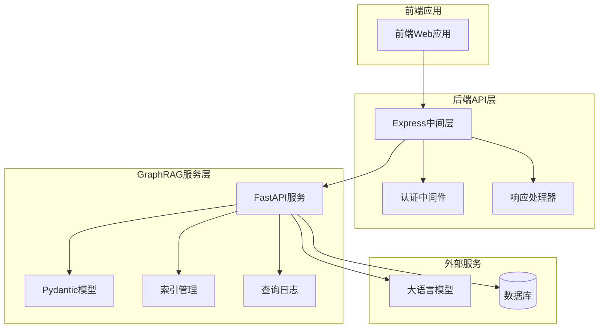
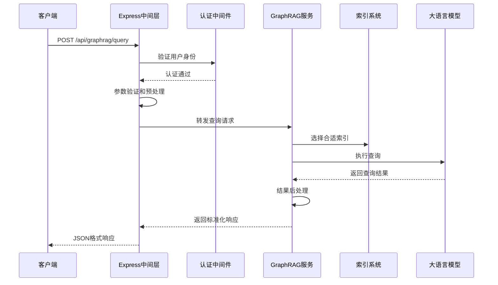
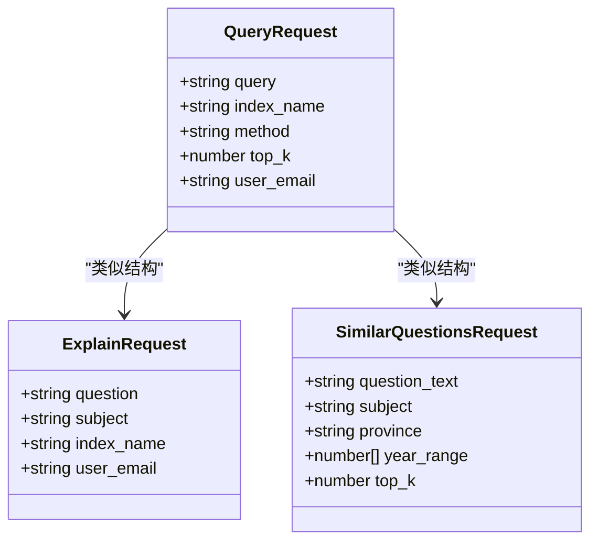
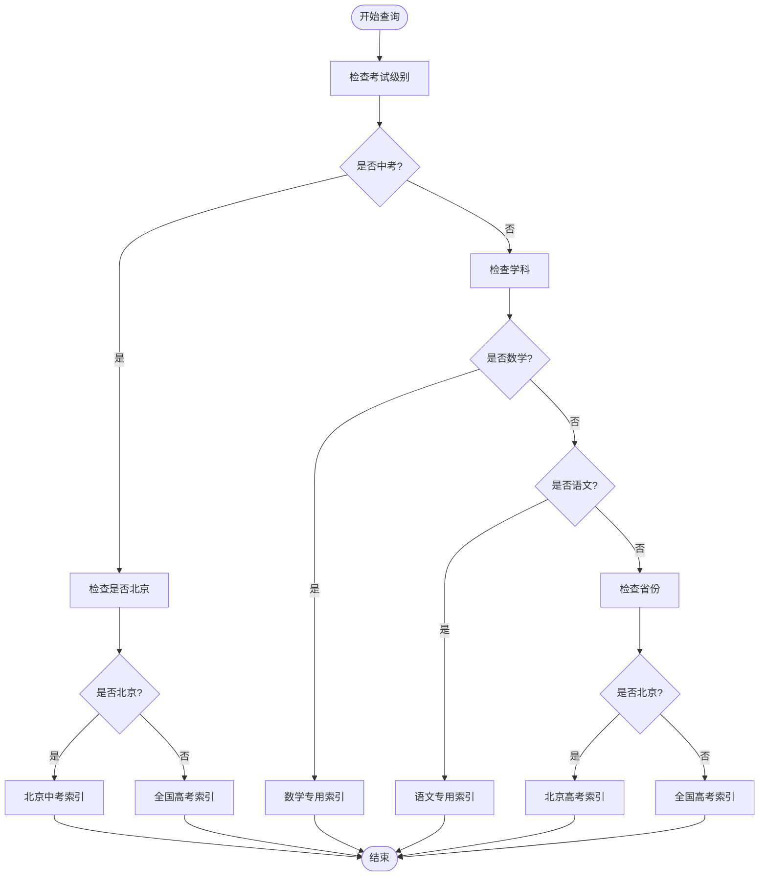
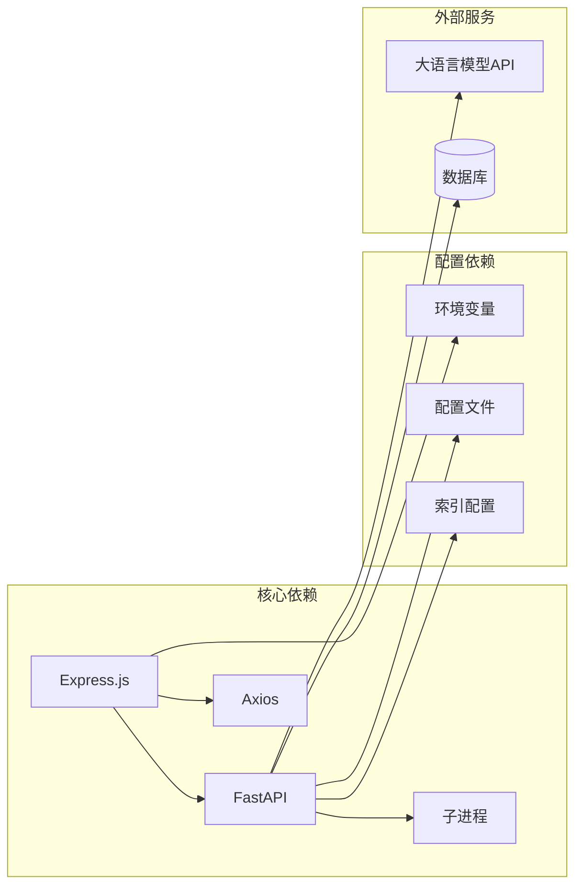
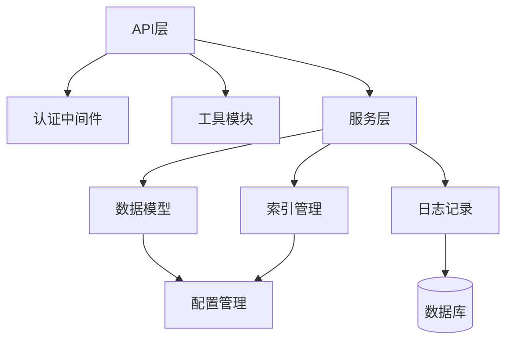

# 查询接口

<cite>
**本文档引用的文件**
- [api/graphrag.js](file://api/graphrag.js)
- [graphrag_service/main.py](file://graphrag_service/main.py)
- [graphrag_service/config.py](file://graphrag_service/config.py)
- [api/utils/response.js](file://api/utils/response.js)
</cite>

## 目录
1. [简介](#简介)
2. [项目结构](#项目结构)
3. [核心组件](#核心组件)
4. [架构概览](#架构概览)
5. [详细组件分析](#详细组件分析)
6. [依赖分析](#依赖分析)
7. [性能考虑](#性能考虑)
8. [故障排除指南](#故障排除指南)
9. [结论](#结论)

## 简介
本文档详细说明了GraphRAG查询接口（/api/graphrag/query）的使用方法。该接口提供了一个统一的入口，支持多种查询方法（local、global、drift、basic），能够根据用户的查询需求智能选择合适的索引，并返回结构化的查询结果。接口设计遵循RESTful规范，支持JSON格式的请求和响应，具备完善的错误处理机制和性能优化策略。

## 项目结构
GraphRAG查询接口采用前后端分离的架构设计，主要由以下组件构成：



**图表来源**
- [api/graphrag.js:1-224](file://api/graphrag.js#L1-L224)
- [graphrag_service/main.py:1-65](file://graphrag_service/main.py#L1-L65)

**章节来源**
- [api/graphrag.js:1-224](file://api/graphrag.js#L1-L224)
- [graphrag_service/main.py:1-65](file://graphrag_service/main.py#L1-L65)

## 核心组件
GraphRAG查询接口的核心组件包括请求处理、参数验证、索引选择和结果返回等模块。每个组件都有明确的职责分工和清晰的边界定义。

### 请求处理组件
请求处理组件负责接收客户端的查询请求，进行基本的参数验证和预处理，然后将请求转发给内部的GraphRAG服务。

### 参数验证组件
参数验证组件确保所有输入参数都符合预期的数据类型和格式要求，防止无效数据进入系统。

### 索引选择组件
索引选择组件根据查询条件自动选择最适合的索引，提高查询的准确性和效率。

### 结果返回组件
结果返回组件负责将查询结果格式化为标准的JSON响应格式，便于前端应用处理。

**章节来源**
- [api/graphrag.js:88-112](file://api/graphrag.js#L88-L112)
- [graphrag_service/main.py:69-75](file://graphrag_service/main.py#L69-L75)

## 架构概览
GraphRAG查询接口采用多层架构设计，实现了前后端分离和职责分离。整个系统的交互流程如下：



**图表来源**
- [api/graphrag.js:38-59](file://api/graphrag.js#L38-L59)
- [graphrag_service/main.py:191-224](file://graphrag_service/main.py#L191-L224)

## 详细组件分析

### QueryRequest模型定义
QueryRequest模型定义了查询接口的请求参数结构，包含了所有必需和可选的字段。



**图表来源**
- [graphrag_service/main.py:69-90](file://graphrag_service/main.py#L69-L90)

#### 字段详细说明

**query（查询文本）**
- 类型：string
- 必需：是
- 描述：用户要查询的具体问题或关键词
- 长度限制：最大5000字符
- 默认值：无

**index_name（索引名称）**
- 类型：string
- 必需：否
- 描述：指定使用的知识图谱索引
- 默认值：gaokao_all
- 可选值：gaokao_all、zhongkao_beijing、subject_math、subject_chinese、province_beijing、highschool_knowledge

**method（查询方法）**
- 类型：string
- 必需：否
- 描述：指定查询的执行方式
- 默认值：local
- 可选值：local、global、drift、basic

**top_k（返回结果数量）**
- 类型：number
- 必需：否
- 描述：指定返回的结果条数
- 默认值：10
- 有效范围：1-100

**user_email（用户邮箱）**
- 类型：string
- 必需：否
- 描述：记录查询用户的邮箱信息
- 格式：有效的邮箱地址格式

**章节来源**
- [graphrag_service/main.py:69-75](file://graphrag_service/main.py#L69-L75)

### 查询方法详解

#### Local方法（精确查询）
Local方法适用于需要精确答案的查询场景，具有以下特点：
- 精确匹配：优先寻找与查询完全匹配或高度相关的文档
- 快速响应：查询速度较快，适合日常学习问答
- 结果可靠：返回的答案通常具有较高的准确性
- 适用场景：知识点确认、概念解释、标准答案查询

#### Global方法（广泛搜索）
Global方法适用于需要全面了解某个主题的查询场景：
- 广泛覆盖：检索整个知识库中的相关信息
- 主题分析：提供全面的主题概述和关联信息
- 关系发现：展示知识点之间的复杂关系
- 适用场景：学习规划、知识体系梳理、跨知识点关联

#### Drift方法（探索性查询）
Drift方法适用于需要探索性学习的查询场景：
- 自适应搜索：根据查询内容动态调整搜索策略
- 创新思维：鼓励从不同角度思考问题
- 多维度分析：提供多层次的分析视角
- 适用场景：创新性问题、跨学科融合、深度思考

#### Basic方法（基础查询）
Basic方法提供最基础的查询功能：
- 简单直接：执行最基本的查询操作
- 性能最优：查询开销最小
- 适用场景：简单的事实性查询、快速确认

**章节来源**
- [graphrag_service/main.py:98-157](file://graphrag_service/main.py#L98-L157)

### 索引智能选择机制
系统根据查询条件自动选择最适合的索引，以提高查询效果和性能。



**图表来源**
- [graphrag_service/main.py:160-173](file://graphrag_service/main.py#L160-L173)

**章节来源**
- [graphrag_service/main.py:160-173](file://graphrag_service/main.py#L160-L173)

### 请求示例

#### 基础查询请求
```javascript
// 基础查询示例
{
  "query": "什么是光合作用",
  "index_name": "gaokao_all",
  "method": "local",
  "top_k": 10
}
```

#### 学科特定查询
```javascript
// 数学问题查询
{
  "query": "二次函数的性质",
  "subject": "数学",
  "method": "global"
}
```

#### 地区特定查询
```javascript
// 北京中考查询
{
  "query": "北京中考数学真题",
  "province": "北京",
  "exam_level": "中考"
}
```

### 响应格式
查询接口返回统一的JSON格式响应，包含成功状态、消息描述和数据内容。

#### 成功响应格式
```javascript
{
  "success": true,
  "message": "查询成功",
  "data": {
    "answer": "查询结果文本",
    "citations": ["引用1", "引用2"],
    "entities": ["实体1", "实体2"],
    "relations": [],
    "method": "local",
    "index_name": "gaokao_all",
    "duration_ms": 1500
  }
}
```

#### 错误响应格式
```javascript
{
  "success": false,
  "message": "错误描述",
  "status": "error"
}
```

**章节来源**
- [api/utils/response.js:1-15](file://api/utils/response.js#L1-L15)
- [graphrag_service/main.py:219-224](file://graphrag_service/main.py#L219-L224)

## 依赖分析

### 外部依赖关系
GraphRAG查询接口依赖于多个外部组件和服务：



**图表来源**
- [api/graphrag.js:5-8](file://api/graphrag.js#L5-L8)
- [graphrag_service/main.py:17-25](file://graphrag_service/main.py#L17-L25)

### 内部组件依赖
系统内部组件之间的依赖关系相对简单，主要通过接口进行通信：



**图表来源**
- [api/graphrag.js:7-8](file://api/graphrag.js#L7-L8)
- [graphrag_service/main.py:21-29](file://graphrag_service/main.py#L21-L29)

**章节来源**
- [api/graphrag.js:1-224](file://api/graphrag.js#L1-L224)
- [graphrag_service/main.py:1-48](file://graphrag_service/main.py#L1-L48)

## 性能考虑

### 查询性能优化
GraphRAG查询接口在设计时充分考虑了性能优化，采用了多种策略来提升查询效率：

#### 缓存策略
- 内存缓存：使用Map结构缓存最近的查询结果
- 限流控制：每用户每分钟最多10次请求
- 超时设置：HTTP请求超时时间为60秒

#### 索引优化
- 智能索引选择：根据查询条件自动选择最适合的索引
- 多索引并行：支持同时查询多个索引并合并结果
- 索引预热：在服务启动时预加载常用索引

#### 查询优化
- 查询重写：对复杂的查询进行简化和优化
- 结果过滤：只返回相关的查询结果
- 分页处理：支持大规模数据的分页查询

### 性能监控
系统提供了完整的性能监控机制，包括查询时间统计、错误率监控和资源使用情况跟踪。

**章节来源**
- [api/graphrag.js:15-35](file://api/graphrag.js#L15-L35)
- [graphrag_service/main.py:56-64](file://graphrag_service/main.py#L56-L64)

## 故障排除指南

### 常见错误类型

#### 参数验证错误
当请求参数不符合要求时，系统会返回相应的错误信息：
- 查询内容为空：返回"查询内容不能为空"
- 索引不存在：返回"未知索引: {index_name}"
- 方法参数错误：返回"无效的方法值"

#### 系统错误
当内部服务出现问题时，系统会返回相应的错误状态：
- 服务不可用：HTTP 503状态码
- 查询超时：HTTP 504状态码
- 内部服务器错误：HTTP 500状态码

#### 权限错误
对于需要认证的接口，如果用户没有足够的权限，会返回：
- 认证失败：HTTP 401状态码
- 权限不足：HTTP 403状态码

### 调试建议
- 检查网络连接：确保API服务器可以正常访问GraphRAG服务
- 验证认证信息：确认用户凭据的有效性
- 查看日志文件：分析错误发生的具体原因
- 测试索引状态：确认目标索引是否存在且可用

**章节来源**
- [api/graphrag.js:45-58](file://api/graphrag.js#L45-L58)
- [graphrag_service/main.py:196-204](file://graphrag_service/main.py#L196-L204)

## 结论
GraphRAG查询接口提供了一个强大而灵活的知识查询解决方案。通过合理的架构设计和优化策略，该接口能够满足不同场景下的查询需求。接口支持多种查询方法，能够智能选择索引，提供统一的响应格式，并具备完善的错误处理机制。

在实际使用中，建议根据具体的查询需求选择合适的查询方法和索引，合理设置查询参数，以获得最佳的查询效果。同时，要注意遵守系统的限流规则和性能约束，确保查询的稳定性和可靠性。