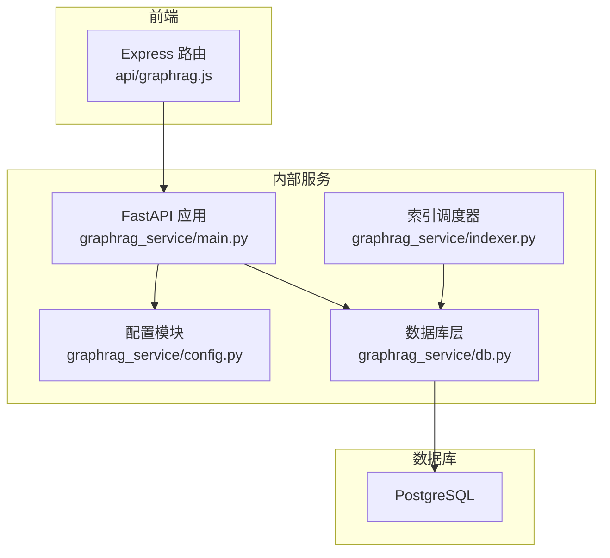
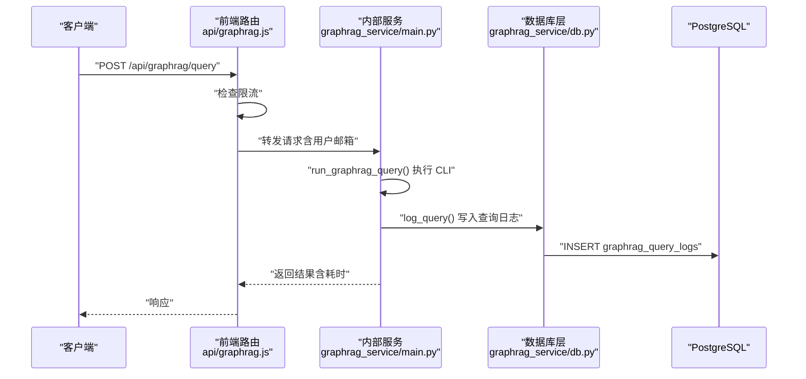
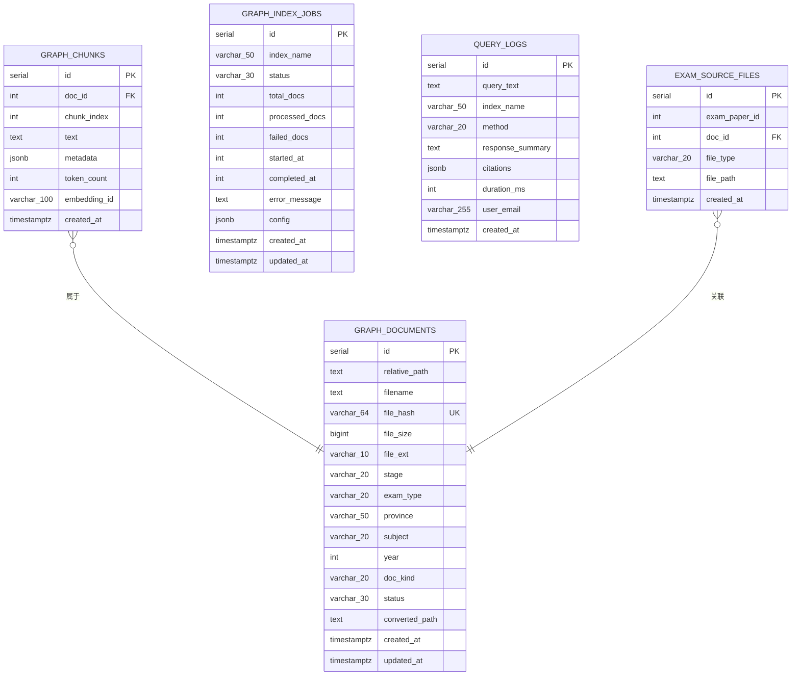
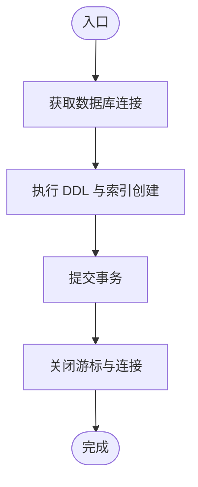
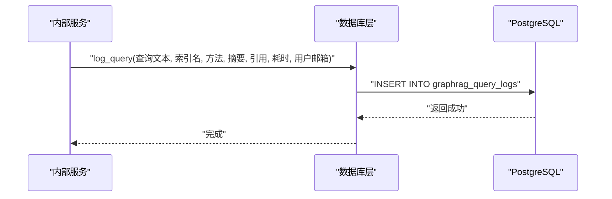
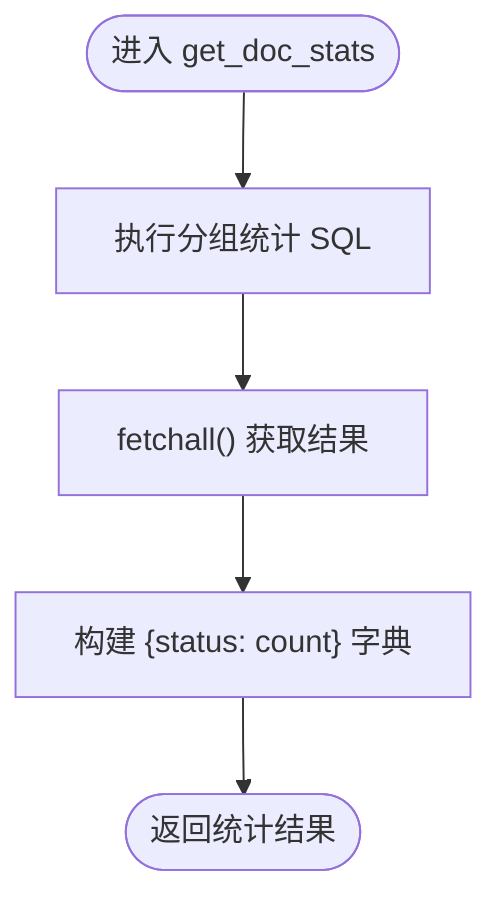
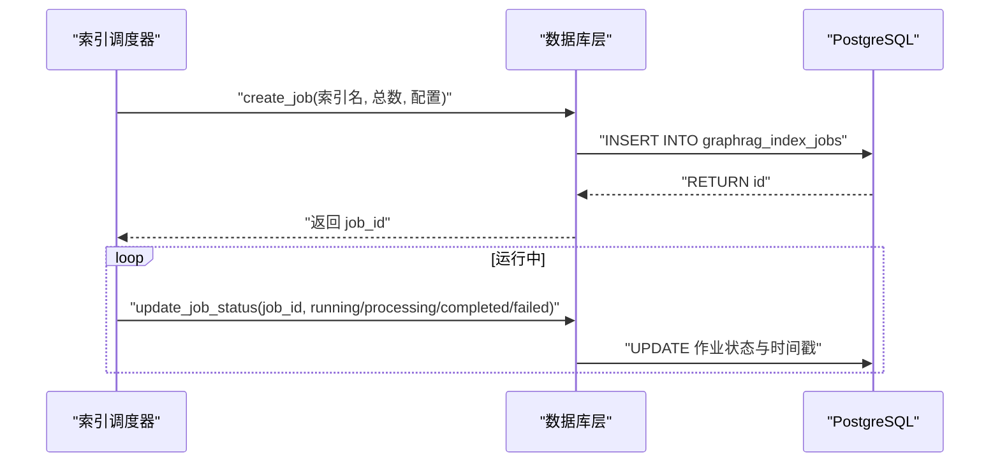
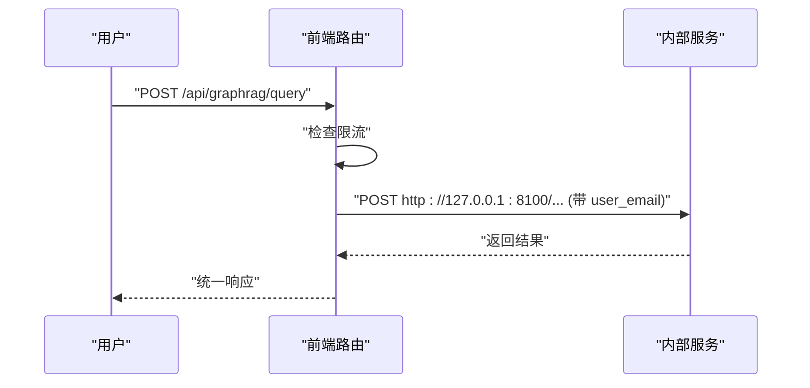
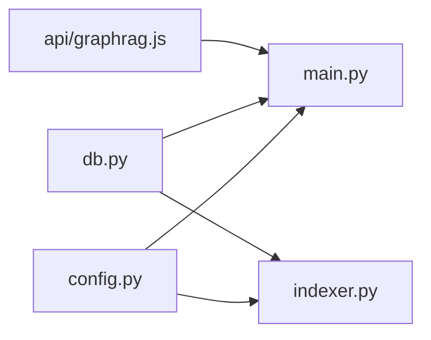

# 数据库集成

<cite>
**本文档引用的文件**
- [graphrag_service/db.py](file://graphrag_service/db.py)
- [graphrag_service/main.py](file://graphrag_service/main.py)
- [graphrag_service/config.py](file://graphrag_service/config.py)
- [graphrag_service/indexer.py](file://graphrag_service/indexer.py)
- [api/graphrag.js](file://api/graphrag.js)
- [scripts/init_graphrag_service.sh](file://scripts/init_graphrag_service.sh)
- [scripts/setup_graphrag.sh](file://scripts/setup_graphrag.sh)
</cite>

## 目录
1. [简介](#简介)
2. [项目结构](#项目结构)
3. [核心组件](#核心组件)
4. [架构总览](#架构总览)
5. [详细组件分析](#详细组件分析)
6. [依赖分析](#依赖分析)
7. [性能考虑](#性能考虑)
8. [故障排查指南](#故障排查指南)
9. [结论](#结论)
10. [附录](#附录)

## 简介
本文件面向 GraphRAG 数据库集成，系统化阐述数据库表结构设计、查询日志记录与统计信息管理，详解 init_graphrag_tables 初始化流程、log_query 查询记录机制与 get_doc_stats 文档统计功能，并说明数据库连接管理、事务处理与并发控制策略。同时给出数据模型定义、索引策略与查询优化方案，以及数据库维护、备份与性能监控建议，确保数据持久化可靠性与查询效率。

## 项目结构
GraphRAG 数据库集成位于 Python 服务侧，采用 PostgreSQL 作为持久化存储，通过专用数据库层模块统一管理连接、DDL 初始化、查询日志与统计等能力；前端通过 API 路由将请求转发至内部 GraphRAG 服务，内部服务负责实际查询与日志落库。

图表来源
- [api/graphrag.js:1-224](file://api/graphrag.js#L1-L224)
- [graphrag_service/main.py:1-462](file://graphrag_service/main.py#L1-L462)
- [graphrag_service/config.py:1-59](file://graphrag_service/config.py#L1-L59)
- [graphrag_service/db.py:1-215](file://graphrag_service/db.py#L1-L215)
- [graphrag_service/indexer.py:1-359](file://graphrag_service/indexer.py#L1-L359)

章节来源
- [api/graphrag.js:1-224](file://api/graphrag.js#L1-L224)
- [graphrag_service/main.py:1-462](file://graphrag_service/main.py#L1-L462)
- [graphrag_service/config.py:1-59](file://graphrag_service/config.py#L1-L59)
- [graphrag_service/db.py:1-215](file://graphrag_service/db.py#L1-L215)
- [graphrag_service/indexer.py:1-359](file://graphrag_service/indexer.py#L1-L359)

## 核心组件
- 数据库层模块：提供连接上下文、游标工厂、DDL 初始化、查询日志写入、统计查询、索引作业管理等能力。
- 内部服务：基于 FastAPI 的查询服务，负责接收请求、执行 GraphRAG CLI、记录查询日志、提供管理接口。
- 配置模块：集中管理索引过滤规则、服务与数据库连接参数。
- 索引调度器：负责限速、断点续跑、失败重试、任务状态管理与索引准备。
- 前端路由：对外提供认证后的查询接口，进行简单限流并转发到内部服务。

章节来源
- [graphrag_service/db.py:1-215](file://graphrag_service/db.py#L1-L215)
- [graphrag_service/main.py:1-462](file://graphrag_service/main.py#L1-L462)
- [graphrag_service/config.py:1-59](file://graphrag_service/config.py#L1-L59)
- [graphrag_service/indexer.py:1-359](file://graphrag_service/indexer.py#L1-L359)
- [api/graphrag.js:1-224](file://api/graphrag.js#L1-L224)

## 架构总览
下图展示从 API 路由到内部服务、数据库层与 PostgreSQL 的交互关系，以及查询日志记录与统计信息的流向。

图表来源
- [api/graphrag.js:37-80](file://api/graphrag.js#L37-L80)
- [graphrag_service/main.py:191-224](file://graphrag_service/main.py#L191-L224)
- [graphrag_service/db.py:169-182](file://graphrag_service/db.py#L169-L182)

## 详细组件分析

### 数据库表结构设计
- graphrag_documents：文档元数据表，包含相对路径、文件名、哈希、大小、扩展名、阶段、考试类型、省份、学科、年份、文档类型、状态、转换路径与时间戳。
- graphrag_chunks：文档分块表，外键关联文档，包含分块索引、文本、JSONB 元数据、token 数量、向量化标识与创建时间。
- graphrag_index_jobs：索引作业表，记录索引名称、状态、总数/已处理/失败数量、起止时间、错误信息、配置与时间戳。
- graphrag_query_logs：查询日志表，记录查询文本、索引名、方法、摘要、引用列表、耗时、用户邮箱与时间戳。
- exam_source_files：试卷源文件映射表，关联试卷 ID、文档 ID、文件类型与路径。

图表来源
- [graphrag_service/db.py:30-106](file://graphrag_service/db.py#L30-L106)

章节来源
- [graphrag_service/db.py:30-106](file://graphrag_service/db.py#L30-L106)

### 初始化流程：init_graphrag_tables
- 功能：在首次启动或手动执行时创建上述表与必要索引。
- 关键点：
  - 使用上下文管理器获取连接，确保异常时连接正确关闭。
  - 批量执行 DDL，包含唯一约束、索引与默认值。
  - 打印完成提示，便于运维确认。

图表来源
- [graphrag_service/db.py:26-110](file://graphrag_service/db.py#L26-L110)

章节来源
- [graphrag_service/db.py:26-110](file://graphrag_service/db.py#L26-L110)
- [scripts/init_graphrag_service.sh:35-42](file://scripts/init_graphrag_service.sh#L35-L42)
- [scripts/setup_graphrag.sh:51-58](file://scripts/setup_graphrag.sh#L51-L58)

### 查询日志记录：log_query
- 功能：将每次查询的关键信息写入 graphrag_query_logs，包括查询文本、索引名、方法、摘要、引用、耗时与用户邮箱。
- 关键点：
  - 使用上下文管理器保证连接生命周期。
  - JSONB 字段序列化，时间戳自动填充。
  - 在内部服务查询完成后调用，确保记录与响应一致。

图表来源
- [graphrag_service/main.py:208-217](file://graphrag_service/main.py#L208-L217)
- [graphrag_service/db.py:169-182](file://graphrag_service/db.py#L169-L182)

章节来源
- [graphrag_service/main.py:208-217](file://graphrag_service/main.py#L208-L217)
- [graphrag_service/db.py:169-182](file://graphrag_service/db.py#L169-L182)

### 文档统计：get_doc_stats
- 功能：按文档状态分组统计数量，用于健康检查与管理界面展示。
- 关键点：
  - 使用游标工厂返回字典形式结果，便于上层直接消费。
  - 返回字典结构，键为状态，值为计数。

图表来源
- [graphrag_service/db.py:184-196](file://graphrag_service/db.py#L184-L196)

章节来源
- [graphrag_service/db.py:184-196](file://graphrag_service/db.py#L184-L196)
- [graphrag_service/main.py:178-188](file://graphrag_service/main.py#L178-L188)

### 索引作业管理与文档筛选
- create_job/update_job_status：创建索引作业并更新状态（含时间戳），支持运行中、完成、失败等状态迁移。
- get_pending_jobs：查询作业列表，支持按索引名筛选。
- get_docs_for_indexing：根据索引配置的过滤条件筛选待索引文档，支持限制数量。

图表来源
- [graphrag_service/indexer.py:291-316](file://graphrag_service/indexer.py#L291-L316)
- [graphrag_service/db.py:127-167](file://graphrag_service/db.py#L127-L167)

章节来源
- [graphrag_service/indexer.py:291-316](file://graphrag_service/indexer.py#L291-L316)
- [graphrag_service/db.py:127-167](file://graphrag_service/db.py#L127-L167)

### 前端路由与转发
- 对外提供查询接口，内置简单内存限流（按用户邮箱与时间窗口计数）。
- 将请求转发到内部 GraphRAG 服务，携带用户邮箱以便审计与统计。
- 对内部服务错误进行分类处理与统一响应。

图表来源
- [api/graphrag.js:37-80](file://api/graphrag.js#L37-L80)
- [api/graphrag.js:88-112](file://api/graphrag.js#L88-L112)

章节来源
- [api/graphrag.js:1-224](file://api/graphrag.js#L1-L224)

## 依赖分析
- 内部服务依赖数据库层模块提供的初始化、日志与统计能力。
- 索引调度器同样依赖数据库层进行作业管理与文档筛选。
- 配置模块集中定义索引过滤规则与服务参数，被内部服务与索引调度器共同使用。
- 前端路由依赖内部服务，内部服务依赖数据库层。

图表来源
- [graphrag_service/main.py:21-29](file://graphrag_service/main.py#L21-L29)
- [graphrag_service/indexer.py:20-26](file://graphrag_service/indexer.py#L20-L26)
- [graphrag_service/config.py:23-54](file://graphrag_service/config.py#L23-L54)
- [api/graphrag.js:1-224](file://api/graphrag.js#L1-L224)

章节来源
- [graphrag_service/main.py:21-29](file://graphrag_service/main.py#L21-L29)
- [graphrag_service/indexer.py:20-26](file://graphrag_service/indexer.py#L20-L26)
- [graphrag_service/config.py:23-54](file://graphrag_service/config.py#L23-L54)
- [api/graphrag.js:1-224](file://api/graphrag.js#L1-L224)

## 性能考虑
- 连接管理
  - 使用上下文管理器确保连接及时释放，避免连接泄漏。
  - 建议在生产环境引入连接池（如 psycopg2.pool 或 pgBouncer）以提升并发与稳定性。
- 事务处理
  - 当前实现为自动提交模式；对于批量写入（如日志、作业状态更新）可显式开启事务，减少往返与锁竞争。
- 并发控制
  - 前端路由采用内存限流，适合轻量保护；生产建议使用 Redis + 令牌桶或漏桶算法实现分布式限流。
  - 索引调度器内置速率限制器，基于时间令牌桶平滑请求节奏，避免触发外部 LLM 限流。
- 索引策略
  - 已创建多列索引覆盖常用过滤字段（状态、哈希、省份、学科、年份、考试类型、作业状态、索引名、时间）。
  - 建议定期分析表统计与执行计划，结合业务热点调整索引组合。
- 查询优化
  - 使用 EXPLAIN/ANALYZE 分析慢查询，关注索引命中与排序/聚合成本。
  - 对高频统计查询（如 get_doc_stats）可考虑物化视图或缓存中间结果。
- 存储与归档
  - 历史查询日志可按月分区或归档，降低热数据规模。
  - 控制 JSONB 字段大小，避免单行过大影响 IO。

## 故障排查指南
- 初始化失败
  - 确认 DATABASE_URL 环境变量正确，且数据库可达。
  - 手动执行初始化脚本验证 DDL 是否成功。
- 查询无日志
  - 检查内部服务是否调用 log_query，确认异常未中断日志写入路径。
  - 核对 graphrag_query_logs 表是否存在、权限是否足够。
- 统计为空
  - 确认 graphrag_documents 表中存在状态为 converted 的文档。
  - 检查过滤条件与索引配置是否匹配。
- 索引作业停滞
  - 使用管理接口查看作业状态与错误信息。
  - 检查外部 LLM API 密钥、网络连通性与配额。
- 前端限流误伤
  - 调整限流阈值或改为基于 IP 的宽松策略，避免正常用户受限。

章节来源
- [graphrag_service/db.py:26-110](file://graphrag_service/db.py#L26-L110)
- [graphrag_service/db.py:169-196](file://graphrag_service/db.py#L169-L196)
- [graphrag_service/indexer.py:253-288](file://graphrag_service/indexer.py#L253-L288)
- [api/graphrag.js:20-35](file://api/graphrag.js#L20-L35)

## 结论
该数据库集成为 GraphRAG 提供了完善的表结构、日志与统计能力，配合内部服务与索引调度器实现了从文档到查询的完整链路。通过合理的索引策略与并发控制，可在保证数据一致性的同时提升查询效率。建议在生产环境中引入连接池、分布式限流与缓存策略，并建立定期的性能分析与维护流程，持续保障系统的可靠性与可扩展性。

## 附录

### 数据库维护与备份
- 备份策略
  - 使用数据库自带逻辑备份工具定期导出，保留多版本历史。
  - 对历史查询日志进行周期性归档与压缩，减少在线库体积。
- 维护任务
  - 定期清理过期日志与临时索引，保持磁盘空间健康。
  - 分析表统计与索引使用率，按需重建或合并索引。
- 监控指标
  - 连接数、查询延迟、慢查询比例、日志写入吞吐。
  - 作业队列长度与平均处理时长，识别瓶颈环节。

### 环境初始化与部署
- 初始化脚本会安装依赖、创建数据库表并引导后续文档转换与索引流程。
- 部署脚本负责安装 Python 依赖、初始化数据库、安装 systemd 服务并启动。

章节来源
- [scripts/init_graphrag_service.sh:35-67](file://scripts/init_graphrag_service.sh#L35-L67)
- [scripts/setup_graphrag.sh:51-93](file://scripts/setup_graphrag.sh#L51-L93)