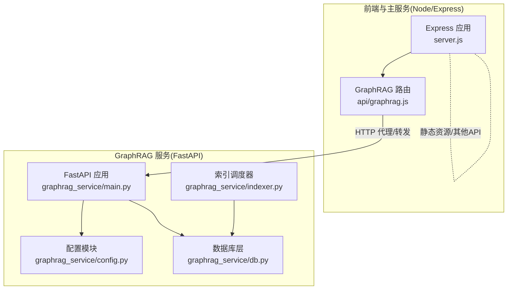
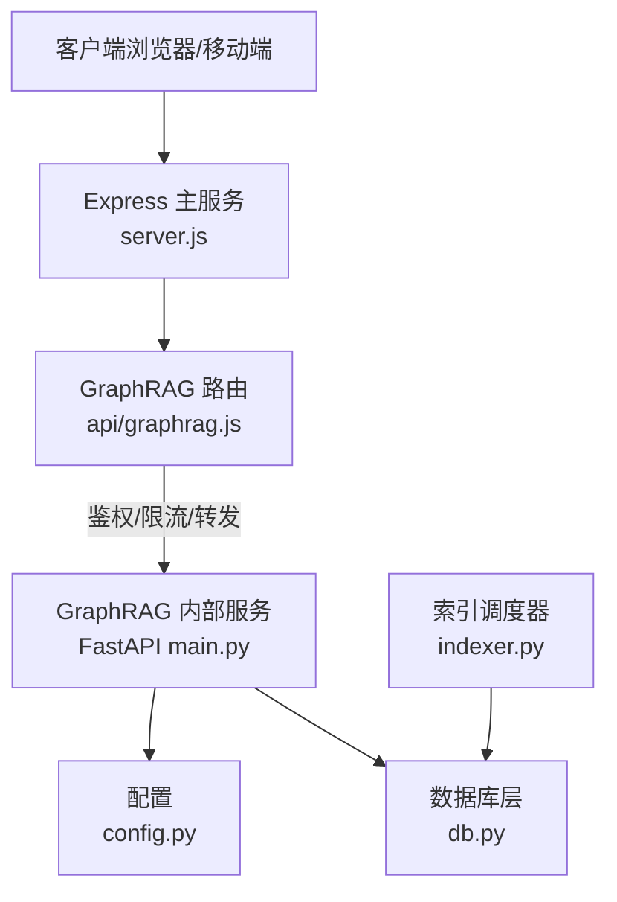
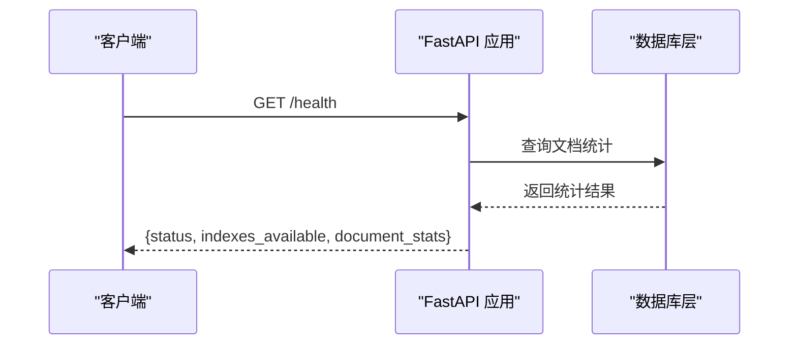
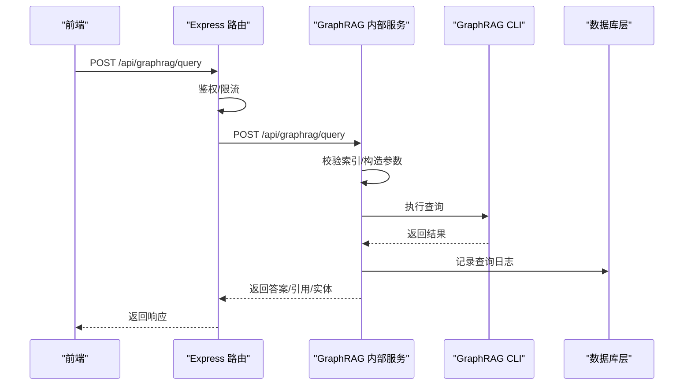
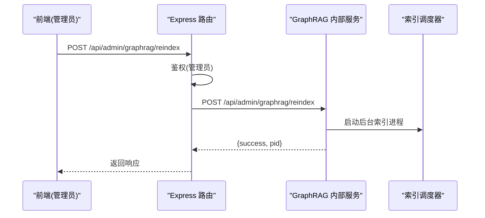
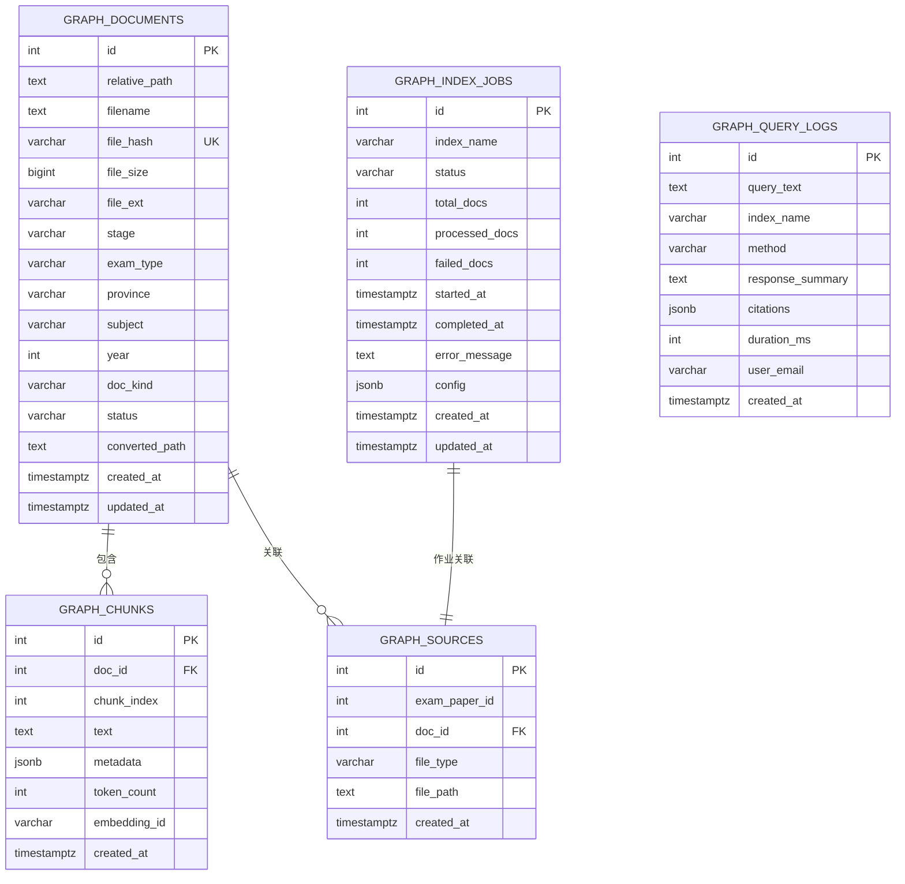
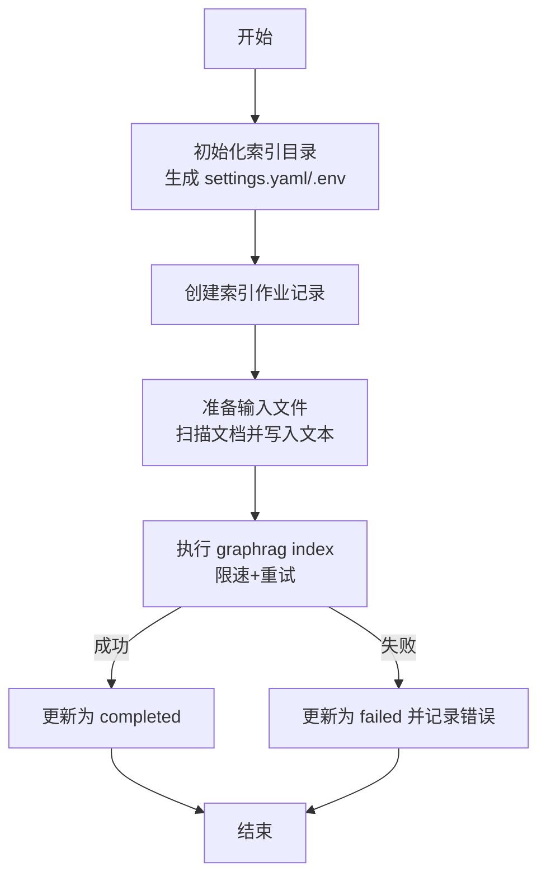
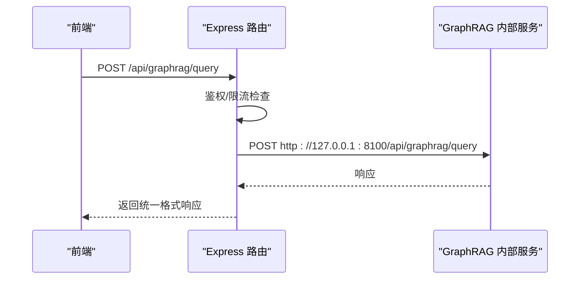
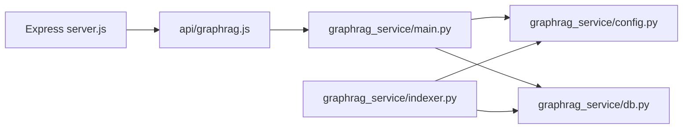

# 服务架构设计

<cite>
**本文档引用的文件**
- [graphrag_service/main.py](file://graphrag_service/main.py)
- [graphrag_service/config.py](file://graphrag_service/config.py)
- [graphrag_service/db.py](file://graphrag_service/db.py)
- [graphrag_service/indexer.py](file://graphrag_service/indexer.py)
- [api/graphrag.js](file://api/graphrag.js)
- [server.js](file://server.js)
- [deploy/uibe-graphrag.service](file://deploy/uibe-graphrag.service)
- [Dockerfile](file://Dockerfile)
- [scripts/init_graphrag_service.sh](file://scripts/init_graphrag_service.sh)
</cite>

## 目录
1. [简介](#简介)
2. [项目结构](#项目结构)
3. [核心组件](#核心组件)
4. [架构总览](#架构总览)
5. [组件详细分析](#组件详细分析)
6. [依赖关系分析](#依赖关系分析)
7. [性能考量](#性能考量)
8. [故障排查指南](#故障排查指南)
9. [结论](#结论)
10. [附录](#附录)

## 简介
本文件面向 GraphRAG 服务架构，系统化梳理 FastAPI 应用的整体设计、生命周期管理、中间件配置与启动流程；详述 CORS 策略、健康检查机制、异步上下文管理器、服务初始化与优雅关闭；同时覆盖配置管理、环境变量处理与运行时参数设置，并给出架构图与组件关系说明，阐述该服务与主系统的集成模式。

## 项目结构
- 服务采用前后端分离架构：
  - 前端与主业务逻辑由 Node/Express 提供，监听本地端口并提供统一 API 网关。
  - GraphRAG 查询服务独立为 FastAPI 应用，监听内网地址，供前端通过代理路由访问。
- 关键目录与文件：
  - graphrag_service：GraphRAG 查询与索引服务（FastAPI + PostgreSQL）
  - api/graphrag.js：Express 层对外 GraphRAG 路由，负责鉴权、限流与转发至内网 FastAPI。
  - server.js：主服务入口，聚合所有业务路由与静态资源。
  - deploy/uibe-graphrag.service：systemd 服务单元，托管 FastAPI 查询服务。
  - Dockerfile：容器化定义，包含健康检查。
  - scripts/init_graphrag_service.sh：服务初始化脚本，含依赖安装与索引引导。

**图表来源**
- [server.js:1-221](file://server.js#L1-L221)
- [api/graphrag.js:1-224](file://api/graphrag.js#L1-L224)
- [graphrag_service/main.py:1-462](file://graphrag_service/main.py#L1-L462)
- [graphrag_service/config.py:1-59](file://graphrag_service/config.py#L1-L59)
- [graphrag_service/db.py:1-215](file://graphrag_service/db.py#L1-L215)
- [graphrag_service/indexer.py:1-359](file://graphrag_service/indexer.py#L1-L359)

**章节来源**
- [server.js:1-221](file://server.js#L1-L221)
- [api/graphrag.js:1-224](file://api/graphrag.js#L1-L224)
- [graphrag_service/main.py:1-462](file://graphrag_service/main.py#L1-L462)

## 核心组件
- FastAPI 应用与生命周期
  - 使用异步上下文管理器定义 lifespan，在启动时初始化数据库表，关闭时打印结束日志。
  - 应用实例配置标题、描述、版本与 lifespan。
- 中间件与 CORS
  - 配置 CORSMiddleware，允许本地开发端口与 127.0.0.1 的特定端口，启用凭据与通配方法/头。
- 配置管理
  - 从环境变量读取 LLM 与服务参数，定义索引映射与限速阈值。
- 数据库层
  - 使用上下文管理器获取连接，集中初始化多张表（文档、块、索引作业、查询日志等），并提供查询统计、作业状态与文档检索等能力。
- 索引调度器
  - 实现令牌桶限速器，准备输入文件，调用 GraphRAG CLI 执行索引，支持重试与断点续跑。
- Express 对外路由
  - 在主服务中挂载 GraphRAG 路由，进行鉴权、限流与转发至内网 FastAPI。
- 部署与健康检查
  - systemd 单元托管 FastAPI，容器健康检查通过 GET /api/health 校验数据库连通性。

**章节来源**
- [graphrag_service/main.py:41-48](file://graphrag_service/main.py#L41-L48)
- [graphrag_service/main.py:50-55](file://graphrag_service/main.py#L50-L55)
- [graphrag_service/main.py:57-64](file://graphrag_service/main.py#L57-L64)
- [graphrag_service/config.py:1-59](file://graphrag_service/config.py#L1-L59)
- [graphrag_service/db.py:12-109](file://graphrag_service/db.py#L12-L109)
- [graphrag_service/indexer.py:29-52](file://graphrag_service/indexer.py#L29-L52)
- [api/graphrag.js:12-80](file://api/graphrag.js#L12-L80)
- [deploy/uibe-graphrag.service:1-19](file://deploy/uibe-graphrag.service#L1-L19)
- [Dockerfile:22-23](file://Dockerfile#L22-L23)

## 架构总览
下图展示服务与主系统的集成模式：前端通过 Express 路由访问 GraphRAG 查询服务，后者以 FastAPI 提供内部 API，数据库层统一管理。

**图表来源**
- [server.js:199](file://server.js#L199)
- [api/graphrag.js:199](file://api/graphrag.js#L199)
- [graphrag_service/main.py:178-462](file://graphrag_service/main.py#L178-L462)
- [graphrag_service/config.py:1-59](file://graphrag_service/config.py#L1-L59)
- [graphrag_service/db.py:1-215](file://graphrag_service/db.py#L1-L215)
- [graphrag_service/indexer.py:1-359](file://graphrag_service/indexer.py#L1-L359)

## 组件详细分析

### FastAPI 应用与生命周期
- 生命周期管理
  - 使用 asynccontextmanager 定义 lifespan，启动时调用数据库初始化，关闭时输出提示。
- CORS 配置
  - 允许本地开发域名与端口，启用凭据与通配方法/头，满足前端跨域访问需求。
- 健康检查
  - 提供 /health 端点，返回索引可用情况与文档统计，便于运维监控与容器健康检查。

**图表来源**
- [graphrag_service/main.py:178-188](file://graphrag_service/main.py#L178-L188)
- [graphrag_service/db.py:184-196](file://graphrag_service/db.py#L184-L196)

**章节来源**
- [graphrag_service/main.py:41-48](file://graphrag_service/main.py#L41-L48)
- [graphrag_service/main.py:57-64](file://graphrag_service/main.py#L57-L64)
- [graphrag_service/main.py:178-188](file://graphrag_service/main.py#L178-L188)

### 查询与解释接口
- 通用查询 /api/graphrag/query
  - 参数包括 query、index_name、method、top_k、user_email。
  - 校验索引存在性，调用 GraphRAG CLI 执行查询，解析输出中的引用与实体，记录查询日志。
- 题目讲解 /api/graphrag/explain
  - 自动选择索引，构造讲解式提示词，调用 GraphRAG 并记录日志。
- 相似真题 /api/graphrag/similar-questions
  - 根据学科/省份/年份范围过滤，返回相似题目列表，记录查询日志。
- 知识图谱 /api/graphrag/knowledge-map
  - 按学科/考试级别/省份选择索引，执行全局搜索。
- 试卷溯源 /api/graphrag/paper-source
  - 按省份/年份/学科查询试卷信息。

**图表来源**
- [api/graphrag.js:88-112](file://api/graphrag.js#L88-L112)
- [graphrag_service/main.py:191-224](file://graphrag_service/main.py#L191-L224)
- [graphrag_service/db.py:169-181](file://graphrag_service/db.py#L169-L181)

**章节来源**
- [graphrag_service/main.py:191-394](file://graphrag_service/main.py#L191-L394)
- [api/graphrag.js:88-178](file://api/graphrag.js#L88-L178)

### 管理接口与重新索引
- 索引任务状态 /api/admin/graphrag/jobs
  - 仅管理员可访问，转发至内部 /api/admin/graphrag/jobs。
- 统计信息 /api/admin/graphrag/stats
  - 返回文档统计与索引可用情况。
- 触发重新索引 /api/admin/graphrag/reindex
  - 启动后台进程执行 indexer.py 的 index 子命令，返回 PID。

**图表来源**
- [api/graphrag.js:210-221](file://api/graphrag.js#L210-L221)
- [graphrag_service/main.py:422-451](file://graphrag_service/main.py#L422-L451)
- [graphrag_service/indexer.py:291-316](file://graphrag_service/indexer.py#L291-L316)

**章节来源**
- [graphrag_service/main.py:396-451](file://graphrag_service/main.py#L396-L451)
- [api/graphrag.js:186-221](file://api/graphrag.js#L186-L221)

### 配置管理与环境变量
- LLM 配置
  - 从环境变量读取 API Key、Base URL、模型名、速率限制等。
- 服务配置
  - 主机与端口默认 127.0.0.1:8100，仅对内网暴露。
- 数据库连接
  - 通过 DATABASE_URL 连接 PostgreSQL。
- 索引映射
  - 定义多个索引及其过滤条件与描述。
- 限速配置
  - 定义每分钟最大请求数与每小时上限。

**章节来源**
- [graphrag_service/config.py:8-59](file://graphrag_service/config.py#L8-L59)

### 数据库层设计
- 表结构概览
  - graphrag_documents：文档元数据与状态。
  - graphrag_chunks：文档切片与嵌入信息。
  - graphrag_index_jobs：索引作业状态与进度。
  - graphrag_query_logs：查询日志与引用。
  - exam_source_files：试卷与文档关联。
- 关键操作
  - 初始化表与索引。
  - 获取待处理作业、创建作业、更新作业状态。
  - 记录查询日志、统计文档状态、按过滤条件检索文档。

**图表来源**
- [graphrag_service/db.py:30-106](file://graphrag_service/db.py#L30-L106)

**章节来源**
- [graphrag_service/db.py:12-215](file://graphrag_service/db.py#L12-L215)

### 索引调度器与限速
- 限速器
  - 基于令牌桶算法实现，支持并发安全与动态令牌补充。
- 设置生成
  - 为每个索引生成 settings.yaml 与 .env，确保 GraphRAG CLI 正确加载模型与 API 配置。
- 输入准备
  - 从数据库筛选符合条件的已转换文档，生成文本输入文件。
- 索引执行
  - 调用 graphrag index，带指数退避重试，失败时记录错误并更新作业状态。
- 顺序调度
  - 支持逐个索引执行并在索引间短暂休眠，避免外部 API 限流。

**图表来源**
- [graphrag_service/indexer.py:155-176](file://graphrag_service/indexer.py#L155-L176)
- [graphrag_service/indexer.py:291-316](file://graphrag_service/indexer.py#L291-L316)
- [graphrag_service/indexer.py:253-288](file://graphrag_service/indexer.py#L253-L288)

**章节来源**
- [graphrag_service/indexer.py:29-52](file://graphrag_service/indexer.py#L29-L52)
- [graphrag_service/indexer.py:59-152](file://graphrag_service/indexer.py#L59-L152)
- [graphrag_service/indexer.py:179-250](file://graphrag_service/indexer.py#L179-L250)
- [graphrag_service/indexer.py:253-288](file://graphrag_service/indexer.py#L253-L288)
- [graphrag_service/indexer.py:319-326](file://graphrag_service/indexer.py#L319-L326)

### Express 对外路由与转发
- 鉴权与限流
  - 使用 authMiddleware 与内存级简单限流，控制每用户每分钟请求次数。
- 转发策略
  - 通过 axios 将请求转发到内网 FastAPI 地址，设置合理超时，捕获错误并返回统一格式。
- 管理员权限
  - 仅允许特定邮箱访问管理接口。

**图表来源**
- [api/graphrag.js:88-112](file://api/graphrag.js#L88-L112)
- [api/graphrag.js:38-59](file://api/graphrag.js#L38-L59)

**章节来源**
- [api/graphrag.js:12-80](file://api/graphrag.js#L12-L80)
- [api/graphrag.js:88-178](file://api/graphrag.js#L88-L178)
- [api/graphrag.js:186-221](file://api/graphrag.js#L186-L221)

### 部署与健康检查
- systemd 单元
  - 以 uvicorn 启动 FastAPI 应用，监听 127.0.0.1:8100，设置重启策略与资源限制。
- 容器健康检查
  - 通过 node fetch 调用 /api/health，判断服务可用性。
- 初始化脚本
  - 安装依赖、初始化数据库表、扫描与转换文档、生成 JSONL、初始化与运行索引、启动服务。

**章节来源**
- [deploy/uibe-graphrag.service:5-11](file://deploy/uibe-graphrag.service#L5-L11)
- [Dockerfile:22-23](file://Dockerfile#L22-L23)
- [scripts/init_graphrag_service.sh:15-71](file://scripts/init_graphrag_service.sh#L15-L71)

## 依赖关系分析
- 组件耦合
  - FastAPI 应用依赖配置模块与数据库层；索引调度器同样依赖数据库层与配置模块。
  - Express 路由依赖 FastAPI 内部服务，形成“网关-内部服务”两级架构。
- 外部依赖
  - GraphRAG CLI、PostgreSQL、uvicorn、axios、tenacity 等。
- 潜在循环依赖
  - 当前模块间为单向依赖，未见循环。

**图表来源**
- [server.js:199](file://server.js#L199)
- [api/graphrag.js:199](file://api/graphrag.js#L199)
- [graphrag_service/main.py:21-29](file://graphrag_service/main.py#L21-L29)
- [graphrag_service/indexer.py:20-26](file://graphrag_service/indexer.py#L20-L26)

**章节来源**
- [server.js:1-221](file://server.js#L1-L221)
- [api/graphrag.js:1-224](file://api/graphrag.js#L1-L224)
- [graphrag_service/main.py:1-462](file://graphrag_service/main.py#L1-L462)
- [graphrag_service/indexer.py:1-359](file://graphrag_service/indexer.py#L1-L359)

## 性能考量
- 限速与重试
  - 索引阶段采用指数退避重试与令牌桶限速，降低外部 API 压力。
- I/O 与解析
  - 查询结果解析包含正则提取引用与实体，注意大文本场景下的时间复杂度。
- 数据库索引
  - 文档与作业表建立多处索引，提升统计与查询效率。
- 超时控制
  - 内部查询与外部转发均设置超时，避免阻塞与资源泄露。

[本节为通用性能讨论，无需具体文件分析]

## 故障排查指南
- 健康检查失败
  - 检查 /health 是否返回可用索引与文档统计；若异常，查看数据库连接与表初始化状态。
- 查询超时或失败
  - 检查 GraphRAG CLI 返回码与错误输出；确认 API Key、Base URL、模型配置正确。
- 管理接口权限不足
  - 确认请求用户邮箱为管理员邮箱。
- 索引任务卡住
  - 查看 /api/admin/graphrag/jobs 的状态与错误信息，必要时手动清理或重试。
- 容器健康检查失败
  - 检查 /api/health 可达性与数据库连通性。

**章节来源**
- [graphrag_service/main.py:178-188](file://graphrag_service/main.py#L178-L188)
- [graphrag_service/main.py:126-131](file://graphrag_service/main.py#L126-L131)
- [api/graphrag.js:187-189](file://api/graphrag.js#L187-L189)
- [graphrag_service/db.py:112-124](file://graphrag_service/db.py#L112-L124)
- [Dockerfile:22-23](file://Dockerfile#L22-L23)

## 结论
本架构通过“Express 网关 + FastAPI 内部服务 + PostgreSQL + GraphRAG CLI”的组合，实现了对教育领域知识图谱的高效查询与管理。FastAPI 的生命周期与中间件配置保证了服务的稳定与可观测性；限速与重试策略有效降低了外部依赖风险；清晰的模块划分与部署方式便于维护与扩展。建议在生产环境中结合负载均衡与缓存策略进一步优化吞吐与延迟。

[本节为总结性内容，无需具体文件分析]

## 附录
- 环境变量清单
  - GRAPHRAG_API_KEY、GRAPHRAG_API_BASE、GRAPHRAG_MODEL、GRAPHRAG_CODING_MODEL、GRAPHRAG_RATE_LIMIT_PER_HOUR、GRAPHRAG_SERVICE_HOST、GRAPHRAG_SERVICE_PORT、DATABASE_URL、ALLOWED_ORIGINS、PORT、GRAPHRAG_SERVICE_URL
- 关键端点
  - /api/health、/api/graphrag/query、/api/graphrag/explain、/api/graphrag/similar-questions、/api/graphrag/knowledge-map、/api/graphrag/paper-source、/api/admin/graphrag/jobs、/api/admin/graphrag/stats、/api/admin/graphrag/reindex

[本节为概览性内容，无需具体文件分析]