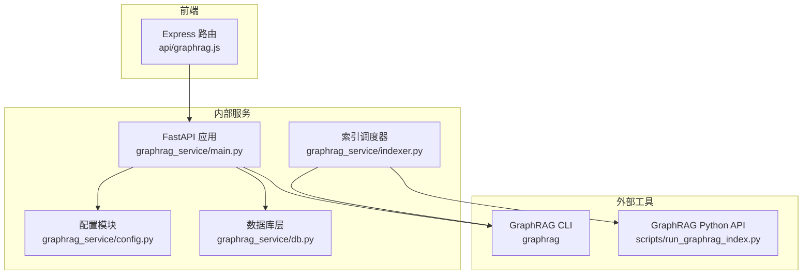
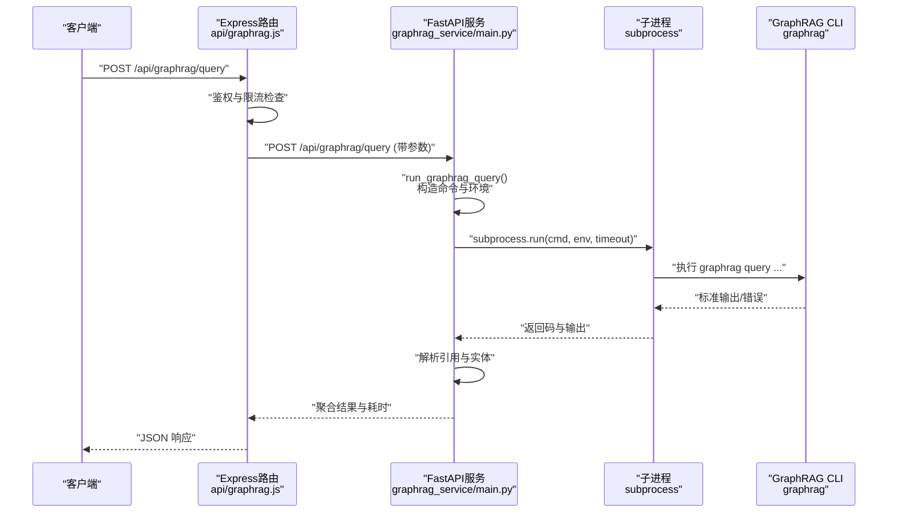
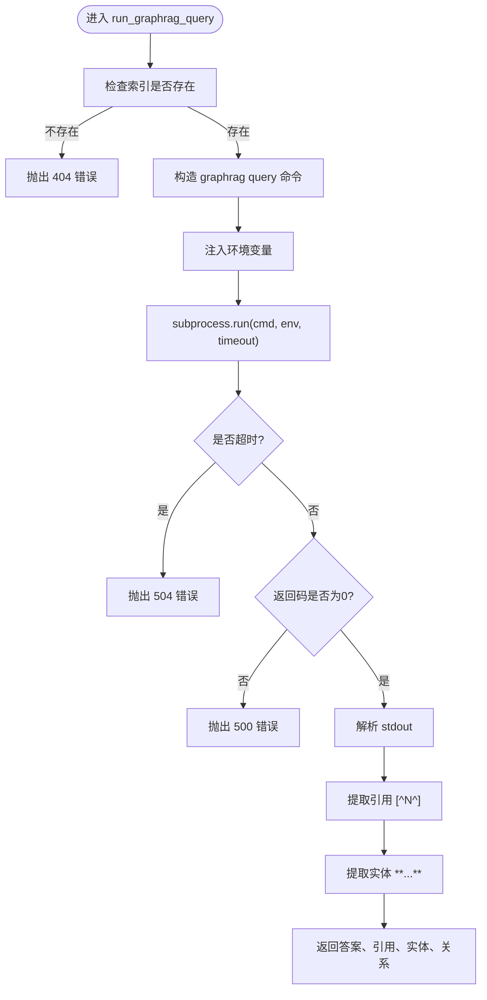
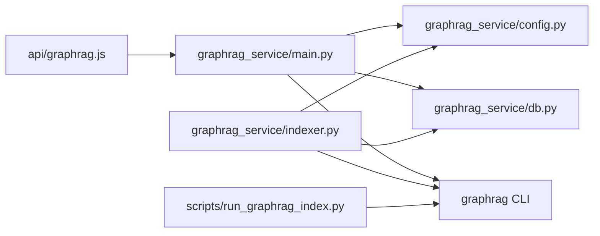

# 查询执行引擎

<cite>
**本文档引用的文件**
- [api/graphrag.js](file://api/graphrag.js)
- [graphrag_service/main.py](file://graphrag_service/main.py)
- [graphrag_service/config.py](file://graphrag_service/config.py)
- [graphrag_service/db.py](file://graphrag_service/db.py)
- [graphrag_service/indexer.py](file://graphrag_service/indexer.py)
- [scripts/run_graphrag_index.py](file://scripts/run_graphrag_index.py)
- [scripts/init_graphrag_service.sh](file://scripts/init_graphrag_service.sh)
- [scripts/setup_graphrag.sh](file://scripts/setup_graphrag.sh)
</cite>

## 目录
1. [简介](#简介)
2. [项目结构](#项目结构)
3. [核心组件](#核心组件)
4. [架构总览](#架构总览)
5. [详细组件分析](#详细组件分析)
6. [依赖分析](#依赖分析)
7. [性能考虑](#性能考虑)
8. [故障排查指南](#故障排查指南)
9. [结论](#结论)
10. [附录](#附录)

## 简介
本文件面向GraphRAG查询执行引擎，围绕run_graphrag_query函数的实现原理、命令行调用机制与参数传递策略进行深入解析；同时覆盖GraphRAG CLI工具的集成方式、环境变量配置、超时处理机制；解释查询结果解析、引用提取与实体识别算法；并提供错误处理策略、超时管理与异常恢复机制，以及查询性能优化建议与调试技巧，确保查询执行的稳定性与效率。

## 项目结构
该工程采用前后端分离架构：
- 前端通过Express路由转发至内部GraphRAG服务（FastAPI），并内置简单限流与错误处理。
- 内部服务负责调用GraphRAG CLI执行查询、解析输出、记录日志，并提供管理接口。
- 索引构建通过独立的Python脚本与调度器完成，支持限速、断点续跑与失败重试。

**图表来源**
- [api/graphrag.js:1-224](file://api/graphrag.js#L1-L224)
- [graphrag_service/main.py:1-462](file://graphrag_service/main.py#L1-L462)
- [graphrag_service/config.py:1-59](file://graphrag_service/config.py#L1-L59)
- [graphrag_service/db.py:1-215](file://graphrag_service/db.py#L1-L215)
- [graphrag_service/indexer.py:1-359](file://graphrag_service/indexer.py#L1-L359)
- [scripts/run_graphrag_index.py:1-69](file://scripts/run_graphrag_index.py#L1-L69)

**章节来源**
- [api/graphrag.js:1-224](file://api/graphrag.js#L1-L224)
- [graphrag_service/main.py:1-462](file://graphrag_service/main.py#L1-L462)
- [graphrag_service/config.py:1-59](file://graphrag_service/config.py#L1-L59)
- [graphrag_service/db.py:1-215](file://graphrag_service/db.py#L1-L215)
- [graphrag_service/indexer.py:1-359](file://graphrag_service/indexer.py#L1-L359)
- [scripts/run_graphrag_index.py:1-69](file://scripts/run_graphrag_index.py#L1-L69)

## 核心组件
- Express路由层：负责鉴权、限流、参数校验与HTTP转发，统一错误响应格式。
- FastAPI查询服务：封装run_graphrag_query，调用GraphRAG CLI，解析输出并记录查询日志。
- 配置模块：集中管理LLM与服务配置、索引映射与限速策略。
- 数据库层：维护文档、索引作业与查询日志等持久化数据。
- 索引调度器：基于令牌桶限速，断点续跑与失败重试，支持多索引串行构建。
- 初始化与部署脚本：一键安装依赖、初始化数据库、安装systemd服务并启动。

**章节来源**
- [api/graphrag.js:88-112](file://api/graphrag.js#L88-L112)
- [graphrag_service/main.py:98-157](file://graphrag_service/main.py#L98-L157)
- [graphrag_service/config.py:23-59](file://graphrag_service/config.py#L23-L59)
- [graphrag_service/db.py:26-181](file://graphrag_service/db.py#L26-L181)
- [graphrag_service/indexer.py:29-52](file://graphrag_service/indexer.py#L29-L52)
- [scripts/init_graphrag_service.sh:1-72](file://scripts/init_graphrag_service.sh#L1-L72)
- [scripts/setup_graphrag.sh:1-94](file://scripts/setup_graphrag.sh#L1-L94)

## 架构总览
下图展示从客户端到GraphRAG CLI的完整调用链路，包括参数传递、环境变量注入、超时控制与结果解析。

**图表来源**
- [api/graphrag.js:38-59](file://api/graphrag.js#L38-L59)
- [graphrag_service/main.py:98-157](file://graphrag_service/main.py#L98-L157)

## 详细组件分析

### run_graphrag_query函数实现原理
- 命令构造：根据索引名定位工作区，拼接graphrag query命令，包含根目录、查询方法、社区层级与查询文本。
- 环境变量注入：复制当前进程环境，注入LLM密钥与基础URL，确保CLI可访问模型服务。
- 超时控制：设置120秒超时，超时抛出504错误，避免长时间阻塞。
- 错误处理：非零返回码抛出500错误，包含最近错误片段；stdout作为答案文本。
- 结果解析：使用正则提取引用标记[^N^]与加粗实体，限定实体数量上限，便于前端渲染与溯源。

**图表来源**
- [graphrag_service/main.py:98-157](file://graphrag_service/main.py#L98-L157)

**章节来源**
- [graphrag_service/main.py:98-157](file://graphrag_service/main.py#L98-L157)

### 命令行调用机制与参数传递策略
- 参数来源：前端路由将查询文本、索引名、查询方法等打包转发；服务端在请求体中接收并校验。
- 方法选择：默认local，支持local/global/drift/basic等；不同方法影响GraphRAG CLI的检索策略与性能。
- 社区层级：固定为2，平衡全局与局部检索的粒度。
- 环境变量：通过env字典传入，确保CLI读取正确的模型与密钥。
- 超时策略：服务端设置120秒，前端POST查询超时60秒，GET查询30秒，避免网络层阻塞。

**章节来源**
- [api/graphrag.js:88-112](file://api/graphrag.js#L88-L112)
- [api/graphrag.js:61-80](file://api/graphrag.js#L61-L80)
- [graphrag_service/main.py:105-125](file://graphrag_service/main.py#L105-L125)

### GraphRAG CLI工具集成与环境变量配置
- 集成方式：通过subprocess直接调用graphrag命令，工作目录设为项目根，确保相对路径正确。
- 环境变量：从配置模块读取GRAPHRAG_API_KEY、GRAPHRAG_API_BASE、GRAPHRAG_MODEL等，注入到子进程环境。
- 初始化脚本：一键安装依赖、初始化数据库表、生成systemd服务并启动；部署脚本自动写入必要环境变量。
- 索引构建：提供Python API入口与CLI入口，支持批量与单索引构建，配合限速与重试。

**章节来源**
- [graphrag_service/main.py:113-116](file://graphrag_service/main.py#L113-L116)
- [graphrag_service/config.py:8-17](file://graphrag_service/config.py#L8-L17)
- [scripts/init_graphrag_service.sh:26-42](file://scripts/init_graphrag_service.sh#L26-L42)
- [scripts/setup_graphrag.sh:29-49](file://scripts/setup_graphrag.sh#L29-L49)
- [scripts/run_graphrag_index.py:16-61](file://scripts/run_graphrag_index.py#L16-L61)

### 查询结果解析、引用提取与实体识别算法
- 引用提取：使用正则匹配[^N^]模式，去重后返回引用编号列表，便于点击跳转到参考文献。
- 实体识别：使用正则匹配**实体**模式，去重并限制前20个实体，避免冗长输出。
- 关系抽取：预留字段，当前未启用；可在后续版本扩展为基于图谱的三元组抽取。
- 输出结构：包含答案文本、引用、实体、关系、方法与索引名，以及服务端统计的耗时。

**章节来源**
- [graphrag_service/main.py:133-157](file://graphrag_service/main.py#L133-L157)

### 错误处理策略、超时管理与异常恢复机制
- 前端限流：基于用户邮箱的内存限流，窗口1分钟，最大10次，防止滥用。
- 服务端超时：子进程120秒超时，返回504；HTTP转发分别设置60秒与30秒超时，避免级联阻塞。
- 错误分类：CLI返回码非零抛500；网络错误区分响应式错误与服务不可用，统一包装为错误响应。
- 异常恢复：索引构建使用指数退避重试（最多3次），失败记录错误信息；查询日志记录耗时与引用，便于追踪问题。

**章节来源**
- [api/graphrag.js:20-35](file://api/graphrag.js#L20-L35)
- [api/graphrag.js:45-59](file://api/graphrag.js#L45-L59)
- [graphrag_service/main.py:117-131](file://graphrag_service/main.py#L117-L131)
- [graphrag_service/indexer.py:253-288](file://graphrag_service/indexer.py#L253-L288)

### 查询性能优化建议与调试技巧
- 选择合适索引：根据学科、地区与考试类型智能选择索引，减少无关文档检索。
- 控制查询复杂度：避免过长提示词，合理使用过滤条件（如年份范围、省份）。
- 调整查询方法：local适合精确检索，global适合广泛关联；按场景选择。
- 监控与日志：通过查询日志表查看耗时与引用，定位慢查询与异常。
- 稳定性保障：开启服务端超时与前端超时，避免长时间占用资源；必要时增加硬件资源与并发限制。

**章节来源**
- [graphrag_service/main.py:160-173](file://graphrag_service/main.py#L160-L173)
- [graphrag_service/db.py:169-181](file://graphrag_service/db.py#L169-L181)

## 依赖分析
- 组件耦合：Express路由仅负责转发与限流；查询服务独立于前端，降低耦合度。
- 外部依赖：GraphRAG CLI、PostgreSQL、uvicorn、psycopg2、tenacity等。
- 依赖关系可视化：

**图表来源**
- [api/graphrag.js:1-224](file://api/graphrag.js#L1-L224)
- [graphrag_service/main.py:17-30](file://graphrag_service/main.py#L17-L30)
- [graphrag_service/indexer.py:20-26](file://graphrag_service/indexer.py#L20-L26)

**章节来源**
- [api/graphrag.js:1-224](file://api/graphrag.js#L1-L224)
- [graphrag_service/main.py:17-30](file://graphrag_service/main.py#L17-L30)
- [graphrag_service/indexer.py:20-26](file://graphrag_service/indexer.py#L20-L26)

## 性能考虑
- 子进程超时：120秒，避免长时间阻塞；可根据实际负载调整。
- 限速策略：令牌桶限速与内存限流双重保护，防止突发流量压垮LLM服务。
- 索引选择：优先选择更小、更聚焦的索引，提升检索速度与准确性。
- 日志与监控：记录耗时与引用，便于定位热点与异常；结合数据库统计信息优化索引结构。

## 故障排查指南
- 服务不可用：检查服务端日志与systemd状态，确认端口与主机绑定正确。
- 查询超时：检查LLM服务连通性与配额，适当提高超时阈值或优化查询。
- 未知错误：查看CLI返回的stderr片段，定位具体失败原因。
- 索引构建失败：查看索引作业状态与错误信息，确认输入文件与配置正确。

**章节来源**
- [scripts/setup_graphrag.sh:60-71](file://scripts/setup_graphrag.sh#L60-L71)
- [graphrag_service/db.py:112-167](file://graphrag_service/db.py#L112-L167)
- [graphrag_service/indexer.py:253-288](file://graphrag_service/indexer.py#L253-L288)

## 结论
本查询执行引擎通过清晰的分层设计与严格的超时与限流策略，实现了稳定高效的GraphRAG查询能力。run_graphrag_query函数作为核心执行单元，承担命令构造、环境注入、超时控制与结果解析职责；配合智能索引选择与日志记录，能够有效支撑教学场景下的知识问答与真题检索需求。建议在生产环境中持续监控查询耗时与引用命中率，逐步优化索引与提示词，以获得更佳的用户体验。

## 附录
- 环境变量清单
  - GRAPHRAG_API_KEY：模型服务密钥
  - GRAPHRAG_API_BASE：模型服务基础URL
  - GRAPHRAG_MODEL：默认模型名称
  - GRAPHRAG_CODING_MODEL：代码模型名称
  - GRAPHRAG_RATE_LIMIT_PER_HOUR：每小时速率限制
  - GRAPHRAG_SERVICE_HOST：服务监听地址
  - GRAPHRAG_SERVICE_PORT：服务监听端口
  - DATABASE_URL：PostgreSQL连接字符串

**章节来源**
- [graphrag_service/config.py:8-21](file://graphrag_service/config.py#L8-L21)