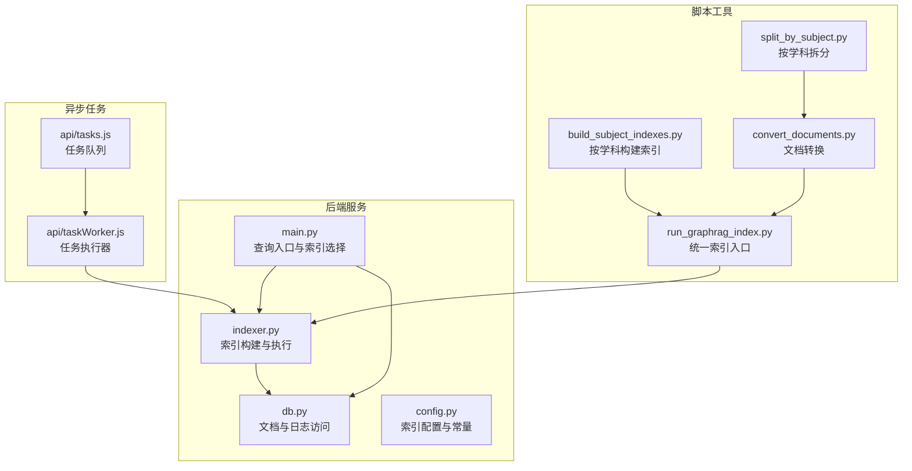
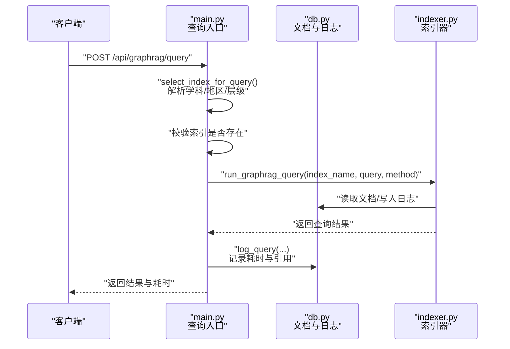
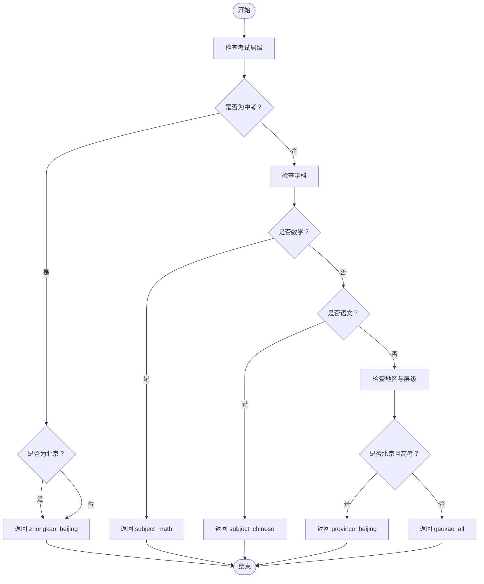
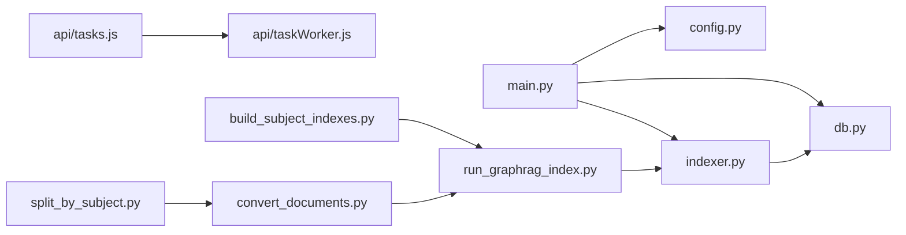

# 索引管理与调度

<cite>
**本文引用的文件**
- [graphrag_service/main.py](file://graphrag_service/main.py)
- [graphrag_service/indexer.py](file://graphrag_service/indexer.py)
- [graphrag_service/db.py](file://graphrag_service/db.py)
- [graphrag_service/config.py](file://graphrag_service/config.py)
- [scripts/run_graphrag_index.py](file://scripts/run_graphrag_index.py)
- [scripts/build_subject_indexes.py](file://scripts/build_subject_indexes.py)
- [scripts/convert_documents.py](file://scripts/convert_documents.py)
- [scripts/split_by_subject.py](file://scripts/split_by_subject.py)
- [api/tasks.js](file://api/tasks.js)
- [api/taskWorker.js](file://api/taskWorker.js)
</cite>

## 目录
1. [简介](#简介)
2. [项目结构](#项目结构)
3. [核心组件](#核心组件)
4. [架构总览](#架构总览)
5. [详细组件分析](#详细组件分析)
6. [依赖关系分析](#依赖关系分析)
7. [性能考虑](#性能考虑)
8. [故障排除指南](#故障排除指南)
9. [结论](#结论)
10. [附录](#附录)

## 简介
本技术文档围绕GraphRAG索引管理系统展开，重点覆盖以下方面：
- 索引选择策略（select_index_for_query）：基于学科、地区、考试层级的智能路由逻辑
- 索引存在性检查与动态索引切换机制：在查询前进行索引可用性校验
- 重新索引触发机制、异步任务调度与进程管理：通过后端任务队列与脚本化流程实现
- 索引状态监控、作业队列管理与进度跟踪：数据库日志与统计接口
- 索引构建配置、性能调优与资源管理策略：索引配置、过滤器与批处理参数
- 索引维护最佳实践与故障排除指南：常见问题定位与修复建议

## 项目结构
GraphRAG索引管理相关代码主要分布在以下模块：
- 后端服务：graphrag_service（主服务、索引器、数据库访问、配置）
- 脚本工具：scripts（索引构建、文档转换、按学科拆分等）
- 异步任务：api（任务队列与工作进程）

**图表来源**
- [graphrag_service/main.py](file://graphrag_service/main.py)
- [graphrag_service/indexer.py](file://graphrag_service/indexer.py)
- [graphrag_service/db.py](file://graphrag_service/db.py)
- [graphrag_service/config.py](file://graphrag_service/config.py)
- [scripts/run_graphrag_index.py](file://scripts/run_graphrag_index.py)
- [scripts/build_subject_indexes.py](file://scripts/build_subject_indexes.py)
- [scripts/convert_documents.py](file://scripts/convert_documents.py)
- [scripts/split_by_subject.py](file://scripts/split_by_subject.py)
- [api/tasks.js](file://api/tasks.js)
- [api/taskWorker.js](file://api/taskWorker.js)

**章节来源**
- [graphrag_service/main.py](file://graphrag_service/main.py)
- [graphrag_service/indexer.py](file://graphrag_service/indexer.py)
- [graphrag_service/db.py](file://graphrag_service/db.py)
- [graphrag_service/config.py](file://graphrag_service/config.py)
- [scripts/run_graphrag_index.py](file://scripts/run_graphrag_index.py)
- [scripts/build_subject_indexes.py](file://scripts/build_subject_indexes.py)
- [scripts/convert_documents.py](file://scripts/convert_documents.py)
- [scripts/split_by_subject.py](file://scripts/split_by_subject.py)
- [api/tasks.js](file://api/tasks.js)
- [api/taskWorker.js](file://api/taskWorker.js)

## 核心组件
- 索引选择策略：根据学科、地区、考试层级返回目标索引名称，支持动态路由与默认回退
- 查询入口：校验索引存在性，执行查询并记录日志与耗时
- 文档与日志：提供文档统计、查询日志写入、待索引文档检索
- 索引器：封装索引构建流程，支持过滤条件与批量处理
- 配置中心：集中定义索引映射、过滤规则与构建参数
- 异步任务：任务队列与工作进程，用于后台索引构建与维护

**章节来源**
- [graphrag_service/main.py](file://graphrag_service/main.py)
- [graphrag_service/db.py](file://graphrag_service/db.py)
- [graphrag_service/indexer.py](file://graphrag_service/indexer.py)
- [graphrag_service/config.py](file://graphrag_service/config.py)

## 架构总览
下图展示了从查询请求到索引构建的整体流程，包括索引选择、存在性检查、查询执行与日志记录。

**图表来源**
- [graphrag_service/main.py](file://graphrag_service/main.py)
- [graphrag_service/db.py](file://graphrag_service/db.py)
- [graphrag_service/indexer.py](file://graphrag_service/indexer.py)

## 详细组件分析

### 索引选择策略（select_index_for_query）
- 功能概述：根据学科、地区、考试层级智能选择目标索引，支持默认回退策略
- 关键逻辑：
  - 中考且北京：优先选择“zhongkao_beijing”
  - 数学/语文：分别路由到“subject_math”、“subject_chinese”
  - 北京且高考：路由到“province_beijing”
  - 中考：回退到“zhongkao_beijing”
  - 其他：默认返回“gaokao_all”

**图表来源**
- [graphrag_service/main.py](file://graphrag_service/main.py)

**章节来源**
- [graphrag_service/main.py](file://graphrag_service/main.py)

### 索引存在性检查与动态索引切换
- 存在性检查：查询前校验索引名是否存在于配置中，避免无效索引
- 动态切换：结合选择策略与配置，允许在不同索引间动态切换
- 健康检查：提供可用索引列表与文档状态统计，便于运维监控

**章节来源**
- [graphrag_service/main.py](file://graphrag_service/main.py)
- [graphrag_service/db.py](file://graphrag_service/db.py)

### 查询执行与日志记录
- 执行流程：校验索引 → 调用索引器执行查询 → 记录耗时与引用
- 日志字段：查询文本、索引名、方法、摘要、引用列表、耗时、用户邮箱
- 统计接口：按状态统计文档数量，辅助容量规划与异常排查

**章节来源**
- [graphrag_service/main.py](file://graphrag_service/main.py)
- [graphrag_service/db.py](file://graphrag_service/db.py)

### 索引器与构建流程
- 索引器职责：封装查询执行、文档读取、日志写入等操作
- 过滤与批处理：根据索引配置的过滤条件筛选待处理文档，支持限制数量
- 失败处理：捕获异常并返回标准化错误信息

**章节来源**
- [graphrag_service/indexer.py](file://graphrag_service/indexer.py)
- [graphrag_service/db.py](file://graphrag_service/db.py)

### 配置与索引映射
- 配置中心：集中定义索引映射、过滤规则与构建参数
- 过滤器：每个索引可配置SQL过滤表达式，仅处理符合条件的文档
- 批处理参数：控制每次处理的文档数量，平衡吞吐与内存占用

**章节来源**
- [graphrag_service/config.py](file://graphrag_service/config.py)
- [graphrag_service/db.py](file://graphrag_service/db.py)

### 异步任务调度与进程管理
- 任务队列：api/tasks.js定义任务注册与状态管理
- 工作进程：api/taskWorker.js负责拉取任务、执行索引构建脚本
- 触发机制：通过API或定时任务触发，支持批量索引构建与增量更新

**章节来源**
- [api/tasks.js](file://api/tasks.js)
- [api/taskWorker.js](file://api/taskWorker.js)

### 脚本化索引构建
- 统一入口：scripts/run_graphrag_index.py作为索引构建的统一入口
- 按学科构建：scripts/build_subject_indexes.py按学科维度生成索引
- 文档转换：scripts/convert_documents.py负责文档格式转换
- 拆分策略：scripts/split_by_subject.py按学科拆分数据源

**章节来源**
- [scripts/run_graphrag_index.py](file://scripts/run_graphrag_index.py)
- [scripts/build_subject_indexes.py](file://scripts/build_subject_indexes.py)
- [scripts/convert_documents.py](file://scripts/convert_documents.py)
- [scripts/split_by_subject.py](file://scripts/split_by_subject.py)

## 依赖关系分析
- 组件耦合：
  - main.py依赖config.py中的索引映射与indexer.py的查询执行
  - db.py为main.py与indexer.py提供文档与日志访问能力
  - 任务系统通过api层与脚本化流程解耦
- 外部依赖：
  - 数据库：PostgreSQL/兼容数据库，存储文档与查询日志
  - 文件系统：脚本读写文档与中间产物
  - 异步队列：任务系统依赖消息队列或本地队列实现

**图表来源**
- [graphrag_service/main.py](file://graphrag_service/main.py)
- [graphrag_service/indexer.py](file://graphrag_service/indexer.py)
- [graphrag_service/db.py](file://graphrag_service/db.py)
- [graphrag_service/config.py](file://graphrag_service/config.py)
- [scripts/run_graphrag_index.py](file://scripts/run_graphrag_index.py)
- [scripts/build_subject_indexes.py](file://scripts/build_subject_indexes.py)
- [scripts/convert_documents.py](file://scripts/convert_documents.py)
- [scripts/split_by_subject.py](file://scripts/split_by_subject.py)
- [api/tasks.js](file://api/tasks.js)
- [api/taskWorker.js](file://api/taskWorker.js)

## 性能考虑
- 索引选择策略优化：减少不必要的索引扫描，优先命中高命中率索引
- 过滤器与批处理：合理设置过滤条件与批大小，避免单次任务过长
- 并发与资源：异步任务并发度应与数据库连接池与磁盘I/O能力匹配
- 缓存与预热：对热点索引进行预热，降低首次查询延迟
- 监控与告警：通过健康检查与日志统计建立性能基线与阈值告警

## 故障排除指南
- 索引不存在：确认索引名是否在配置中，检查拼写与大小写
- 查询失败：查看日志表中的异常信息与耗时，定位具体环节
- 文档未索引：检查文档状态是否为“已转换”，核对过滤条件
- 任务堆积：检查任务队列与工作进程状态，调整并发度与批大小
- 性能下降：分析健康检查与日志统计，识别瓶颈（CPU/IO/网络）

**章节来源**
- [graphrag_service/main.py](file://graphrag_service/main.py)
- [graphrag_service/db.py](file://graphrag_service/db.py)

## 结论
本索引管理系统通过明确的索引选择策略、严格的索引存在性检查、完善的日志与统计接口，以及脚本化与异步化的构建流程，实现了可扩展、可观测、可维护的GraphRAG索引体系。结合合理的性能调优与资源管理策略，能够满足多学科、多地区、多层次的查询需求，并为后续迭代提供清晰的演进路径。

## 附录
- 最佳实践：
  - 定期清理与归档日志表，避免膨胀
  - 对高频索引进行预热与缓存
  - 在任务高峰期限制并发度，避免资源争用
  - 使用过滤器精准定位文档，减少无关计算
- 常见问题：
  - 索引名不一致导致查询失败
  - 过滤条件过于严格导致无文档可索引
  - 任务长时间挂起：检查工作进程与数据库连接