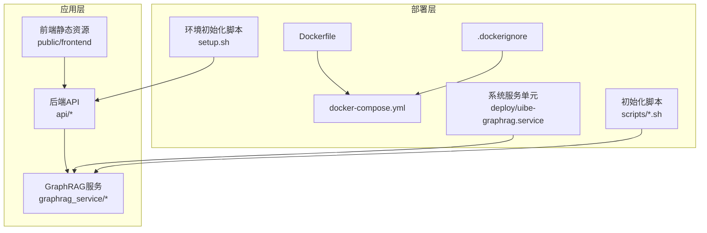
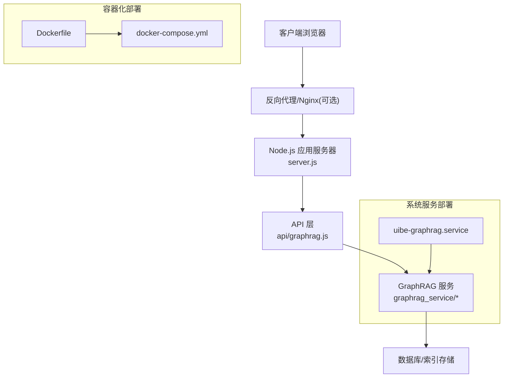
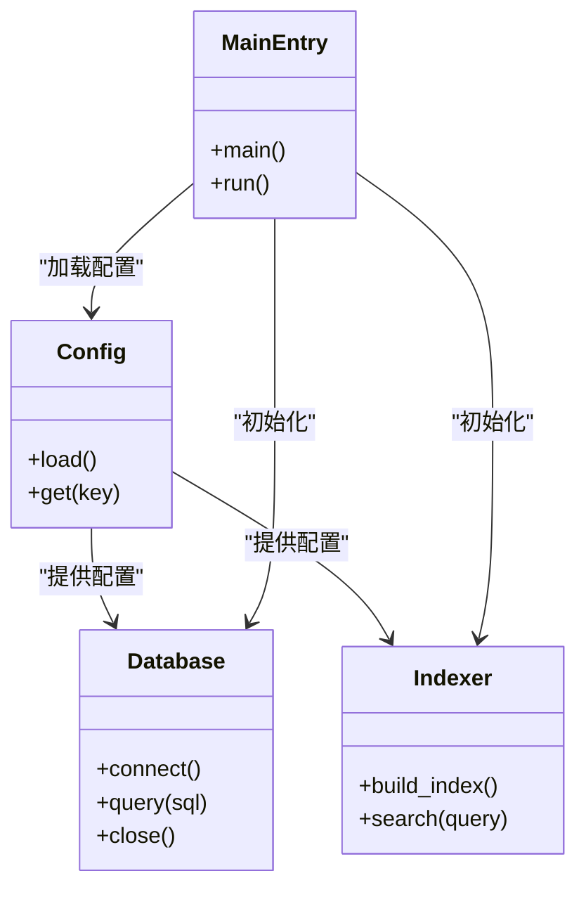
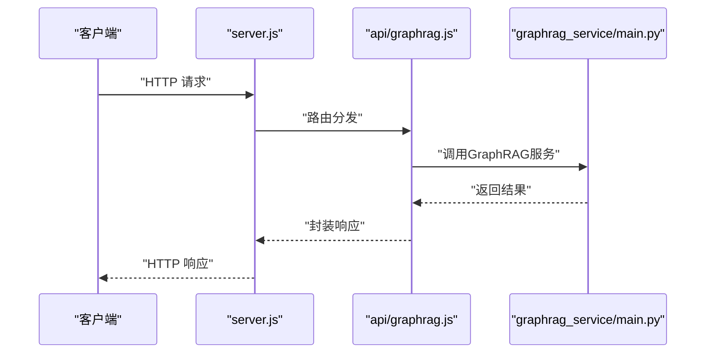
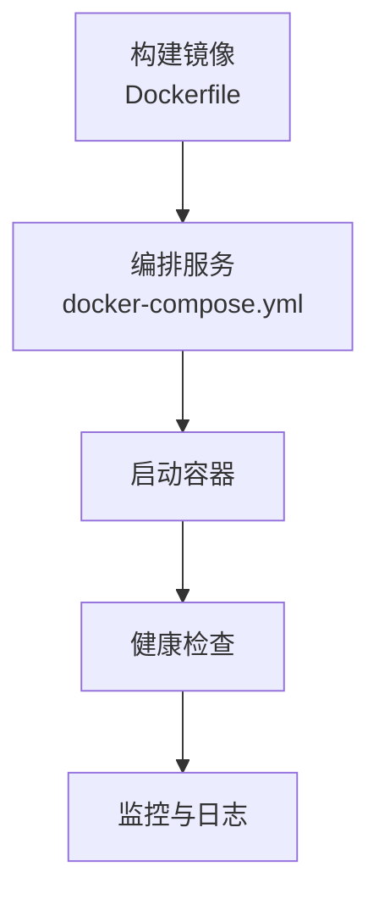
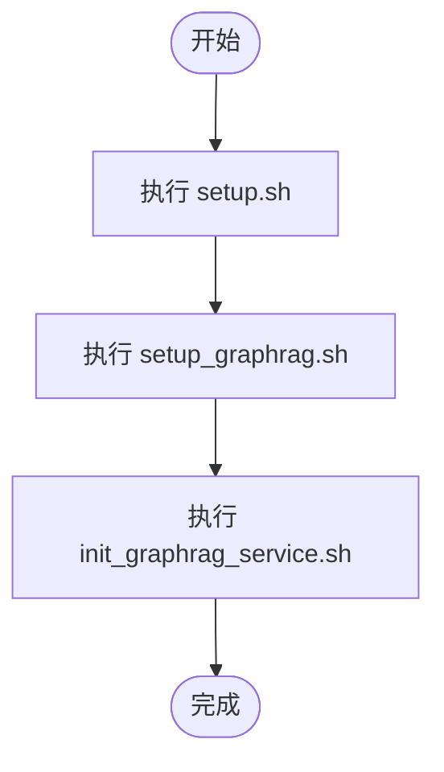
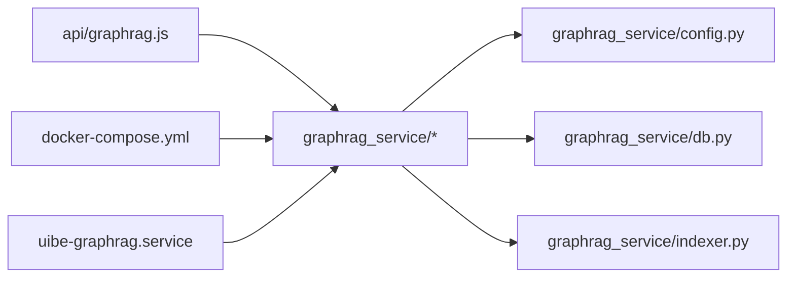

# 部署配置

<cite>
**本文引用的文件**
- [Dockerfile](file://Dockerfile)
- [docker-compose.yml](file://docker-compose.yml)
- [deploy/uibe-graphrag.service](file://deploy/uibe-graphrag.service)
- [scripts/init_graphrag_service.sh](file://scripts/init_graphrag_service.sh)
- [scripts/setup_graphrag.sh](file://scripts/setup_graphrag.sh)
- [setup.sh](file://setup.sh)
- [graphrag_service/config.py](file://graphrag_service/config.py)
- [graphrag_service/main.py](file://graphrag_service/main.py)
- [graphrag_service/db.py](file://graphrag_service/db.py)
- [graphrag_service/indexer.py](file://graphrag_service/indexer.py)
- [api/graphrag.js](file://api/graphrag.js)
- [server.js](file://server.js)
- [.dockerignore](file://.dockerignore)
</cite>

## 目录
1. [简介](#简介)
2. [项目结构](#项目结构)
3. [核心组件](#核心组件)
4. [架构总览](#架构总览)
5. [详细组件分析](#详细组件分析)
6. [依赖关系分析](#依赖关系分析)
7. [性能考虑](#性能考虑)
8. [故障排除指南](#故障排除指南)
9. [结论](#结论)
10. [附录](#附录)

## 简介
本技术文档面向GraphRAG服务的部署与运维，覆盖服务启动配置、环境变量、网络配置、Docker容器化部署、进程管理与健康检查、脚本部署流程、依赖安装与环境准备、性能调优参数、资源限制与监控配置等。目标是帮助运维与开发团队实现服务的稳定运行与高效性能。

## 项目结构
该仓库采用前后端分离与后端微服务结合的组织方式：前端静态资源位于public与frontend目录；后端API在api目录；GraphRAG服务以Python子项目graphrag_service存在；部署相关文件集中在根目录（Dockerfile、docker-compose.yml、.dockerignore）与deploy目录；脚本部署位于scripts目录。

**图表来源**
- [Dockerfile](file://Dockerfile)
- [docker-compose.yml](file://docker-compose.yml)
- [.dockerignore](file://.dockerignore)
- [deploy/uibe-graphrag.service](file://deploy/uibe-graphrag.service)
- [scripts/init_graphrag_service.sh](file://scripts/init_graphrag_service.sh)
- [scripts/setup_graphrag.sh](file://scripts/setup_graphrag.sh)
- [setup.sh](file://setup.sh)
- [graphrag_service/main.py](file://graphrag_service/main.py)
- [api/graphrag.js](file://api/graphrag.js)

**章节来源**
- [Dockerfile](file://Dockerfile)
- [docker-compose.yml](file://docker-compose.yml)
- [.dockerignore](file://.dockerignore)
- [deploy/uibe-graphrag.service](file://deploy/uibe-graphrag.service)
- [scripts/init_graphrag_service.sh](file://scripts/init_graphrag_service.sh)
- [scripts/setup_graphrag.sh](file://scripts/setup_graphrag.sh)
- [setup.sh](file://setup.sh)

## 核心组件
- GraphRAG服务子项目：包含配置、数据库连接、索引器与主入口，负责知识图谱检索增强生成的核心逻辑。
- 后端API：对外提供HTTP接口，其中graphrag.js处理GraphRAG相关请求。
- 前端静态资源：提供用户界面与交互。
- 部署与编排：Dockerfile与docker-compose.yml用于容器化与编排；.dockerignore控制构建上下文；系统服务单元用于Linux服务托管。
- 脚本部署：setup_graphrag.sh与init_graphrag_service.sh用于GraphRAG服务的初始化与启动；setup.sh用于整体环境准备。

**章节来源**
- [graphrag_service/config.py](file://graphrag_service/config.py)
- [graphrag_service/main.py](file://graphrag_service/main.py)
- [graphrag_service/db.py](file://graphrag_service/db.py)
- [graphrag_service/indexer.py](file://graphrag_service/indexer.py)
- [api/graphrag.js](file://api/graphrag.js)
- [server.js](file://server.js)

## 架构总览
下图展示从客户端到GraphRAG服务的典型请求路径，以及容器化与系统服务两种部署形态：

**图表来源**
- [server.js](file://server.js)
- [api/graphrag.js](file://api/graphrag.js)
- [graphrag_service/main.py](file://graphrag_service/main.py)
- [Dockerfile](file://Dockerfile)
- [docker-compose.yml](file://docker-compose.yml)
- [deploy/uibe-graphrag.service](file://deploy/uibe-graphrag.service)

## 详细组件分析

### GraphRAG服务配置与启动
- 配置模块：负责加载GraphRAG服务所需的参数（如数据路径、索引路径、LLM参数等），并提供统一访问接口。
- 主入口：解析命令行或环境变量，初始化数据库连接与索引器，启动服务监听。
- 数据库与索引：封装数据库连接与索引构建/查询逻辑，支持外部知识图谱数据的接入与检索。
- API集成：后端API通过graphrag.js调用GraphRAG服务，实现问答、检索等功能。

**图表来源**
- [graphrag_service/config.py](file://graphrag_service/config.py)
- [graphrag_service/db.py](file://graphrag_service/db.py)
- [graphrag_service/indexer.py](file://graphrag_service/indexer.py)
- [graphrag_service/main.py](file://graphrag_service/main.py)

**章节来源**
- [graphrag_service/config.py](file://graphrag_service/config.py)
- [graphrag_service/main.py](file://graphrag_service/main.py)
- [graphrag_service/db.py](file://graphrag_service/db.py)
- [graphrag_service/indexer.py](file://graphrag_service/indexer.py)

### API到GraphRAG服务的调用序列
以下序列图展示客户端请求经由API层转发至GraphRAG服务的完整流程。

**图表来源**
- [server.js](file://server.js)
- [api/graphrag.js](file://api/graphrag.js)
- [graphrag_service/main.py](file://graphrag_service/main.py)

**章节来源**
- [server.js](file://server.js)
- [api/graphrag.js](file://api/graphrag.js)
- [graphrag_service/main.py](file://graphrag_service/main.py)

### 容器化部署与编排
- Dockerfile：定义镜像基础、工作目录、依赖安装、复制应用代码、暴露端口与启动命令。
- docker-compose.yml：定义服务、网络、卷与环境变量，支持多容器编排（应用、数据库、缓存等）。
- .dockerignore：排除不必要的构建上下文文件，减少镜像体积与构建时间。
- 系统服务单元：uibe-graphrag.service用于systemd托管，便于开机自启与进程管理。

**图表来源**
- [Dockerfile](file://Dockerfile)
- [docker-compose.yml](file://docker-compose.yml)
- [.dockerignore](file://.dockerignore)
- [deploy/uibe-graphrag.service](file://deploy/uibe-graphrag.service)

**章节来源**
- [Dockerfile](file://Dockerfile)
- [docker-compose.yml](file://docker-compose.yml)
- [.dockerignore](file://.dockerignore)
- [deploy/uibe-graphrag.service](file://deploy/uibe-graphrag.service)

### 脚本部署流程
- setup.sh：整体环境准备脚本，可能执行依赖安装、数据库初始化、权限设置等。
- setup_graphrag.sh：GraphRAG服务专用初始化脚本，负责索引构建、数据导入、服务配置等。
- init_graphrag_service.sh：GraphRAG服务启动脚本，负责服务进程的启动与守护。

**图表来源**
- [setup.sh](file://setup.sh)
- [scripts/setup_graphrag.sh](file://scripts/setup_graphrag.sh)
- [scripts/init_graphrag_service.sh](file://scripts/init_graphrag_service.sh)

**章节来源**
- [setup.sh](file://setup.sh)
- [scripts/setup_graphrag.sh](file://scripts/setup_graphrag.sh)
- [scripts/init_graphrag_service.sh](file://scripts/init_graphrag_service.sh)

## 依赖关系分析
- 组件耦合：API层依赖GraphRAG服务；GraphRAG服务依赖配置、数据库与索引器；容器化与系统服务单元分别提供运行时环境。
- 外部依赖：数据库、缓存、搜索引擎（如Neo4j/Cypher）、LLM服务等。
- 编排依赖：docker-compose定义服务间网络与共享卷；systemd服务单元定义进程生命周期。

**图表来源**
- [api/graphrag.js](file://api/graphrag.js)
- [graphrag_service/main.py](file://graphrag_service/main.py)
- [graphrag_service/config.py](file://graphrag_service/config.py)
- [graphrag_service/db.py](file://graphrag_service/db.py)
- [graphrag_service/indexer.py](file://graphrag_service/indexer.py)
- [docker-compose.yml](file://docker-compose.yml)
- [deploy/uibe-graphrag.service](file://deploy/uibe-graphrag.service)

**章节来源**
- [api/graphrag.js](file://api/graphrag.js)
- [graphrag_service/main.py](file://graphrag_service/main.py)
- [graphrag_service/config.py](file://graphrag_service/config.py)
- [graphrag_service/db.py](file://graphrag_service/db.py)
- [graphrag_service/indexer.py](file://graphrag_service/indexer.py)
- [docker-compose.yml](file://docker-compose.yml)
- [deploy/uibe-graphrag.service](file://deploy/uibe-graphrag.service)

## 性能考虑
- 索引优化：合理设置索引策略与批量写入参数，避免频繁I/O；对大规模知识图谱进行分区与增量更新。
- 并发与线程：根据CPU核数与内存上限设置并发度，避免过度竞争导致上下文切换开销增大。
- 缓存策略：对热点查询结果进行缓存，降低重复计算与数据库压力；设置合理的TTL与失效策略。
- 数据库连接池：限制最大连接数与空闲超时，防止连接泄漏与资源耗尽。
- LLM推理：控制上下文长度与生成长度，启用流式输出与分页响应，提升用户体验。
- 资源限制：在容器编排中设置CPU/内存限制与请求，保障服务稳定性与公平调度。
- 监控指标：采集QPS、P95/P99延迟、错误率、数据库慢查询、缓存命中率等关键指标。

[本节为通用性能建议，不直接分析具体文件]

## 故障排除指南
- 服务无法启动
  - 检查容器日志与systemd状态，确认端口占用与权限问题。
  - 验证环境变量与配置文件是否正确加载。
- API调用失败
  - 查看API层错误处理中间件输出，定位上游服务异常。
  - 检查GraphRAG服务的健康状态与依赖服务（数据库、缓存）连通性。
- 图谱检索异常
  - 确认索引是否已构建完成，数据是否导入成功。
  - 检查查询语句与参数格式，关注大小写与特殊字符转义。
- 容器构建失败
  - 清理.dockerignore中误排除的必要文件，检查网络代理与镜像源。
  - 减少一次性安装包数量，拆分安装步骤以缩短构建时间。

**章节来源**
- [api/middleware/errorHandler.js](file://api/middleware/errorHandler.js)
- [scripts/init_graphrag_service.sh](file://scripts/init_graphrag_service.sh)
- [deploy/uibe-graphrag.service](file://deploy/uibe-graphrag.service)

## 结论
通过容器化与系统服务双轨部署，结合完善的脚本化初始化与监控告警，GraphRAG服务可在生产环境中实现高可用与高性能。建议在上线前完成压测与容量规划，并持续优化索引与缓存策略，确保服务稳定运行。

## 附录

### 环境变量与网络配置要点
- 环境变量
  - 数据库连接字符串与凭据
  - LLM服务地址与鉴权令牌
  - 日志级别与输出位置
  - 端口与跨域配置
- 网络配置
  - 反向代理与SSL终止
  - 内部服务间通信（容器网络）
  - 防火墙与安全组规则

**章节来源**
- [graphrag_service/config.py](file://graphrag_service/config.py)
- [docker-compose.yml](file://docker-compose.yml)

### 进程管理与健康检查
- systemd服务单元：定义ExecStart/Restart策略、日志重定向与资源限制。
- 健康检查：提供HTTP探针或TCP探针，定期检测服务可用性与响应时间。
- 自动重启：在异常退出后自动恢复，避免人工干预。

**章节来源**
- [deploy/uibe-graphrag.service](file://deploy/uibe-graphrag.service)

### 脚本部署与依赖安装
- setup.sh：执行全局环境准备，包括系统依赖、Node.js与Python环境。
- setup_graphrag.sh：执行GraphRAG专属初始化，包括索引构建与数据导入。
- init_graphrag_service.sh：启动GraphRAG服务进程，支持守护模式与日志输出。

**章节来源**
- [setup.sh](file://setup.sh)
- [scripts/setup_graphrag.sh](file://scripts/setup_graphrag.sh)
- [scripts/init_graphrag_service.sh](file://scripts/init_graphrag_service.sh)

### 监控与运维建议
- 指标采集：QPS、延迟、错误率、数据库慢查询、缓存命中率、容器资源使用。
- 告警策略：阈值触发、趋势异常检测、SLA达成率。
- 日志管理：结构化日志、日志轮转、集中收集与检索。
- 容量规划：基于峰值流量与增长趋势设定资源上限与弹性策略。

[本节为通用运维建议，不直接分析具体文件]