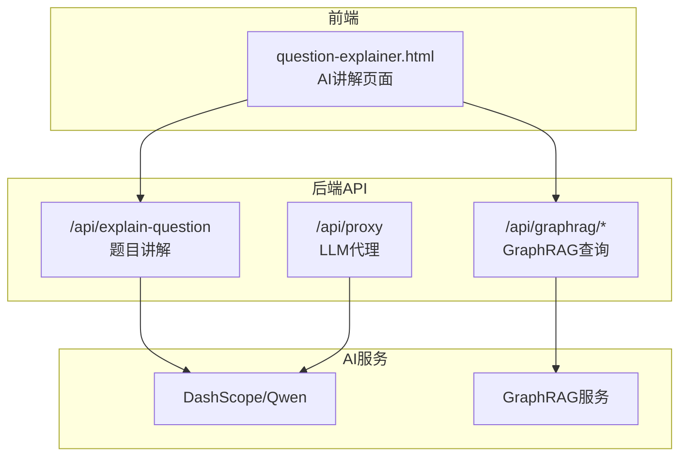
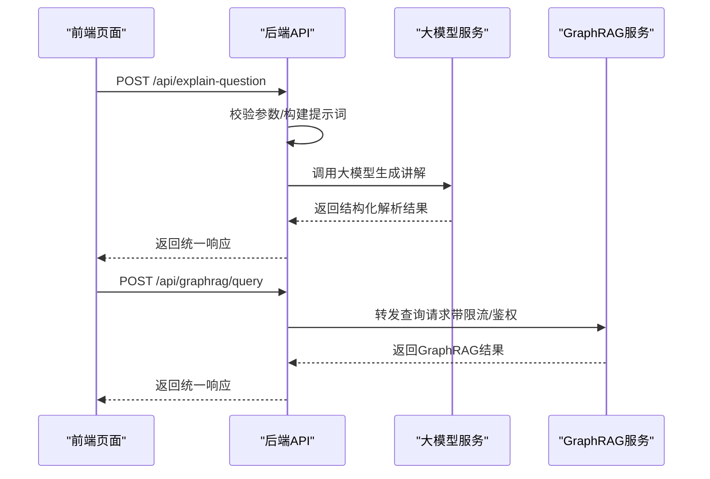
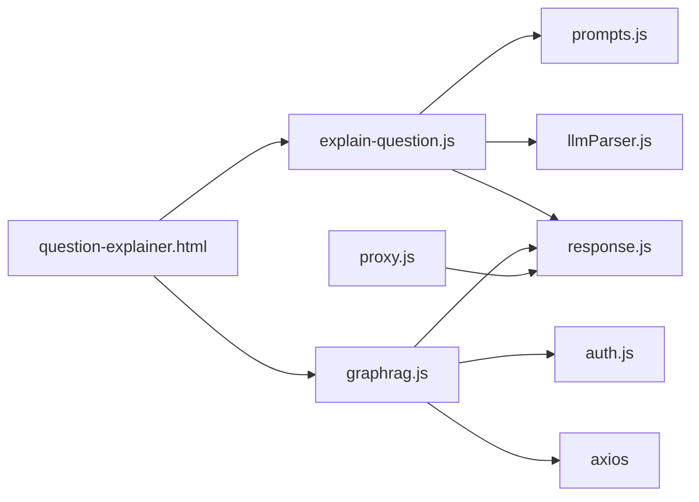

# AI题目讲解API

<cite>
**本文档引用的文件**
- [api/explain-question.js](file://api/explain-question.js)
- [api/graphrag.js](file://api/graphrag.js)
- [api/proxy.js](file://api/proxy.js)
- [api/utils/prompts.js](file://api/utils/prompts.js)
- [api/utils/llmParser.js](file://api/utils/llmParser.js)
- [api/utils/response.js](file://api/utils/response.js)
- [api/db.js](file://api/db.js)
- [frontend/question-explainer.html](file://frontend/question-explainer.html)
</cite>

## 目录
1. [简介](#简介)
2. [项目结构](#项目结构)
3. [核心组件](#核心组件)
4. [架构总览](#架构总览)
5. [详细组件分析](#详细组件分析)
6. [依赖关系分析](#依赖关系分析)
7. [性能考量](#性能考量)
8. [故障排查指南](#故障排查指南)
9. [结论](#结论)
10. [附录](#附录)

## 简介
本文件为AI家教项目的“AI题目讲解API”提供完整接口文档，覆盖以下能力：
- 图数据库检索增强生成（GraphRAG）：面向知识图谱的查询、相似题推荐、试卷溯源、知识图谱可视化等
- 智能解题讲解：基于大模型的题目解析、关键点提炼、变式题与同类题推荐
- 代理转发机制：统一接入多种大模型供应商，提供安全、可控的调用通道

文档同时阐述AI讲解的实现原理、知识图谱查询优化策略、LLM集成方案，并给出完整的API接口规范、请求参数与响应格式、性能与扩展建议。

## 项目结构
后端采用Express路由组织，前端通过静态页面调用后端接口；AI讲解与GraphRAG查询通过统一的代理层进行转发与封装。

图表来源
- [api/explain-question.js:1-82](file://api/explain-question.js#L1-L82)
- [api/graphrag.js:1-224](file://api/graphrag.js#L1-L224)
- [api/proxy.js:1-106](file://api/proxy.js#L1-L106)
- [frontend/question-explainer.html:129-182](file://frontend/question-explainer.html#L129-L182)

章节来源
- [api/explain-question.js:1-82](file://api/explain-question.js#L1-L82)
- [api/graphrag.js:1-224](file://api/graphrag.js#L1-L224)
- [api/proxy.js:1-106](file://api/proxy.js#L1-L106)
- [frontend/question-explainer.html:129-182](file://frontend/question-explainer.html#L129-L182)

## 核心组件
- 题目讲解接口：接收题目文本、学科与知识点，构建讲解提示词，调用大模型生成结构化讲解结果
- GraphRAG查询接口：提供统一入口，对内部GraphRAG服务进行鉴权与限流后的转发
- LLM代理接口：统一大模型供应商接入，支持限流、超时控制、参数安全校验
- 提示词模板与解析器：定义高质量提示词模板，解析LLM输出并评估质量
- 响应与错误处理：统一的成功/失败响应格式与错误码

章节来源
- [api/explain-question.js:7-81](file://api/explain-question.js#L7-L81)
- [api/graphrag.js:8-223](file://api/graphrag.js#L8-L223)
- [api/proxy.js:33-105](file://api/proxy.js#L33-L105)
- [api/utils/prompts.js:1-131](file://api/utils/prompts.js#L1-L131)
- [api/utils/llmParser.js:110-133](file://api/utils/llmParser.js#L110-L133)
- [api/utils/response.js:1-69](file://api/utils/response.js#L1-L69)

## 架构总览
AI讲解与GraphRAG查询的端到端流程如下：

图表来源
- [api/explain-question.js:32-80](file://api/explain-question.js#L32-L80)
- [api/graphrag.js:88-112](file://api/graphrag.js#L88-L112)
- [frontend/question-explainer.html:149-173](file://frontend/question-explainer.html#L149-L173)

## 详细组件分析

### 题目讲解接口（/api/explain-question）
- 方法与鉴权：POST，需登录态
- 功能：根据题目、学科与知识点生成结构化讲解，包含讲解正文、关键点、变式题与同类题
- 输入参数
  - question: 题目文本（必填，字符串）
  - subject: 学科代码（可选，默认数学）
  - knowledgePoint: 知识点（可选）
- 输出字段
  - success: 布尔
  - question: 原始题目
  - subject: 学科名称
  - knowledgePoint: 知识点
  - explanation: 讲解正文
  - keyPoints: 关键点数组
  - variantProblems: 变式题数组
  - similarProblems: 同类题数组
- 实现要点
  - 使用提示词模板构建讲解提示
  - 调用大模型服务（DashScope/Qwen），解析并评估输出质量
  - 对低质量/回退结果进行告警记录

章节来源
- [api/explain-question.js:7-81](file://api/explain-question.js#L7-L81)
- [api/utils/prompts.js:16-25](file://api/utils/prompts.js#L16-L25)
- [api/utils/llmParser.js:110-133](file://api/utils/llmParser.js#L110-L133)
- [api/utils/response.js:1-15](file://api/utils/response.js#L1-L15)

### GraphRAG查询接口（/api/graphrag/*）
- 方法与鉴权：除公开GET外均需登录；管理接口需管理员权限
- 查询接口
  - POST /api/graphrag/query：通用查询，自动选择索引
  - POST /api/graphrag/explain：题目讲解（转发至GraphRAG）
  - POST /api/graphrag/similar-questions：相似真题查找
  - GET /api/graphrag/knowledge-map：知识图谱
  - GET /api/graphrag/paper-source：试卷溯源
- 管理接口
  - GET /api/admin/graphrag/jobs：索引任务状态
  - GET /api/admin/graphrag/stats：统计信息
  - POST /api/admin/graphrag/reindex：触发重新索引
- 限流与错误处理
  - 每用户每分钟最多10次（内存限流）
  - 超时控制与错误映射

章节来源
- [api/graphrag.js:88-223](file://api/graphrag.js#L88-L223)

### LLM代理接口（/api/proxy）
- 方法与鉴权：POST，需登录
- 功能：统一接入多家大模型供应商，提供安全、可控的调用通道
- 支持供应商与模型
  - Qwen系列：qwen3-vl-plus、qwen-plus、qwen-max、qwen-turbo
  - DeepSeek系列：deepseek-v4-pro、deepseek-chat、deepseek-coder
- 输入参数
  - model: 模型名（必填）
  - messages: 消息数组（必填）
  - temperature: 温度（可选，范围0~2）
  - max_tokens: 最大生成长度（可选，上限4000）
- 输出
  - 直接透传大模型返回，包含usage统计

章节来源
- [api/proxy.js:33-105](file://api/proxy.js#L33-L105)

### 提示词模板与解析器
- 提示词模板
  - QUESTION_EXPLAIN：面向题目讲解，要求输出结构化JSON，包含讲解正文、关键点、变式题与同类题
- 解析器
  - parseExplainResponse：清理标签与代码块，提取JSON，评估质量并决定是否回退
  - assessExplainResultQuality：基于字段完整性与结构质量打分

章节来源
- [api/utils/prompts.js:16-25](file://api/utils/prompts.js#L16-L25)
- [api/utils/prompts.js:97-129](file://api/utils/prompts.js#L97-L129)
- [api/utils/llmParser.js:110-181](file://api/utils/llmParser.js#L110-L181)

### 响应与错误处理
- 统一响应结构
  - 成功：success=true，data或pagination
  - 失败：success=false，message，status
- 错误码
  - 400：参数缺失/非法
  - 401：未登录
  例：前端页面在401时跳转登录页

章节来源
- [api/utils/response.js:1-69](file://api/utils/response.js#L1-L69)
- [frontend/question-explainer.html:160-165](file://frontend/question-explainer.html#L160-L165)

## 依赖关系分析

图表来源
- [api/explain-question.js:1-5](file://api/explain-question.js#L1-L5)
- [api/graphrag.js:5-8](file://api/graphrag.js#L5-L8)
- [frontend/question-explainer.html:151-158](file://frontend/question-explainer.html#L151-L158)

章节来源
- [api/explain-question.js:1-5](file://api/explain-question.js#L1-L5)
- [api/graphrag.js:5-8](file://api/graphrag.js#L5-L8)
- [frontend/question-explainer.html:151-158](file://frontend/question-explainer.html#L151-L158)

## 性能考量
- 限流与超时
  - GraphRAG接口：每用户每分钟最多10次，避免突发流量冲击
  - LLM代理：请求超时30秒，防止阻塞
- 参数安全
  - 限制messages长度与max_tokens范围，避免资源滥用
- 输出质量评估
  - 对低质量/回退结果进行日志告警，便于持续优化提示词与模型选择
- 扩展策略
  - 引入Redis缓存热点查询
  - 多实例部署与负载均衡
  - 分离计算与存储，使用消息队列异步处理长耗时任务

## 故障排查指南
- 常见错误与定位
  - 400参数错误：检查必填字段与格式
  - 401未登录：确认鉴权头与登录状态
  - 5xx服务错误：查看后端日志与上游服务状态
- 日志与监控
  - LLM代理会记录token用量与超时事件
  - GraphRAG接口对错误进行状态码映射与统一返回
- 前端交互
  - 登录失效时自动跳转登录页
  - 加载态与错误态UI提示

章节来源
- [api/proxy.js:95-104](file://api/proxy.js#L95-L104)
- [api/graphrag.js:52-58](file://api/graphrag.js#L52-L58)
- [frontend/question-explainer.html:160-165](file://frontend/question-explainer.html#L160-L165)

## 结论
本接口体系通过统一的代理层与提示词模板，实现了稳定的AI题目讲解能力，并以GraphRAG为知识支撑，提供相似题推荐与知识图谱可视化。通过限流、超时与质量评估等机制保障稳定性与可维护性。建议在生产环境中引入缓存、异步队列与多实例部署，进一步提升吞吐与可用性。

## 附录

### API接口规范

- 题目讲解（/api/explain-question）
  - 方法：POST
  - 鉴权：必需
  - 请求体
    - question: 字符串，必填
    - subject: 字符串，可选（默认数学）
    - knowledgePoint: 字符串，可选
  - 响应
    - success: 布尔
    - question: 字符串
    - subject: 字符串
    - knowledgePoint: 字符串
    - explanation: 字符串
    - keyPoints: 字符串数组
    - variantProblems: 对象数组（question, answer）
    - similarProblems: 对象数组（question, answer）

- GraphRAG查询（/api/graphrag/*）
  - 方法：POST/GET
  - 鉴权：除公开GET外均需登录
  - 查询接口
    - POST /api/graphrag/query
      - 请求体：query（必填）、index_name（可选）、method（可选，默认local）
      - 自动索引选择：根据exam_level与province选择
    - POST /api/graphrag/explain
      - 请求体：question（必填）、subject（可选，默认数学）、index_name（可选）
    - POST /api/graphrag/similar-questions
      - 请求体：question_text（必填）、subject（可选）、province（可选）、year_range（可选）、top_k（可选，默认5）
    - GET /api/graphrag/knowledge-map
      - 查询参数：subject（必填）、exam_level（可选）、province（可选）
    - GET /api/graphrag/paper-source
      - 查询参数：province（必填）、year（必填）、subject（必填）
  - 管理接口（管理员）
    - GET /api/admin/graphrag/jobs
    - GET /api/admin/graphrag/stats
    - POST /api/admin/graphrag/reindex（请求体：index_name）

- LLM代理（/api/proxy）
  - 方法：POST
  - 鉴权：必需
  - 请求体
    - model: 字符串，必填（支持Qwen/DeepSeek系列）
    - messages: 数组，必填
    - temperature: 数字，0~2（可选）
    - max_tokens: 数字，100~4000（可选）
  - 响应：透传大模型返回

章节来源
- [api/explain-question.js:12-16](file://api/explain-question.js#L12-L16)
- [api/graphrag.js:88-178](file://api/graphrag.js#L88-L178)
- [api/proxy.js:42-50](file://api/proxy.js#L42-L50)