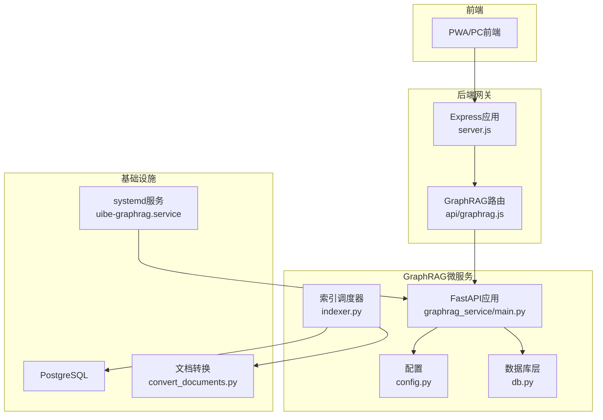
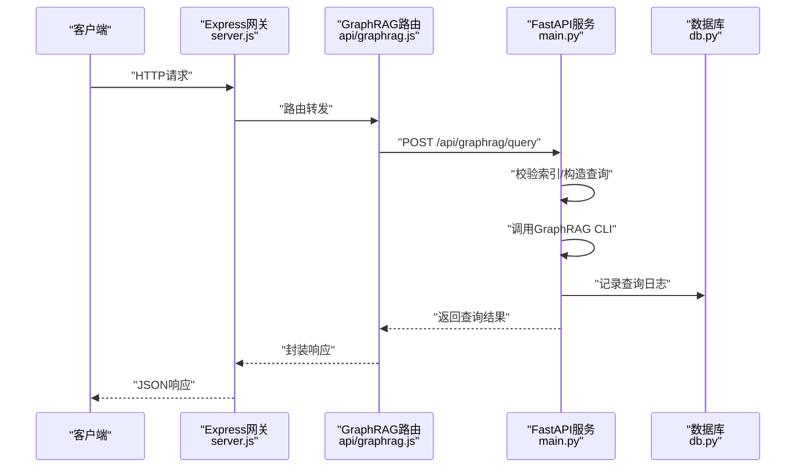
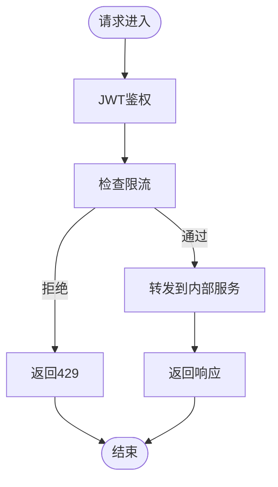
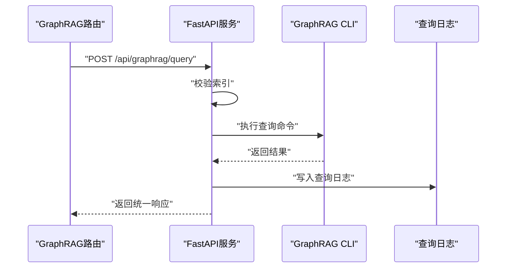
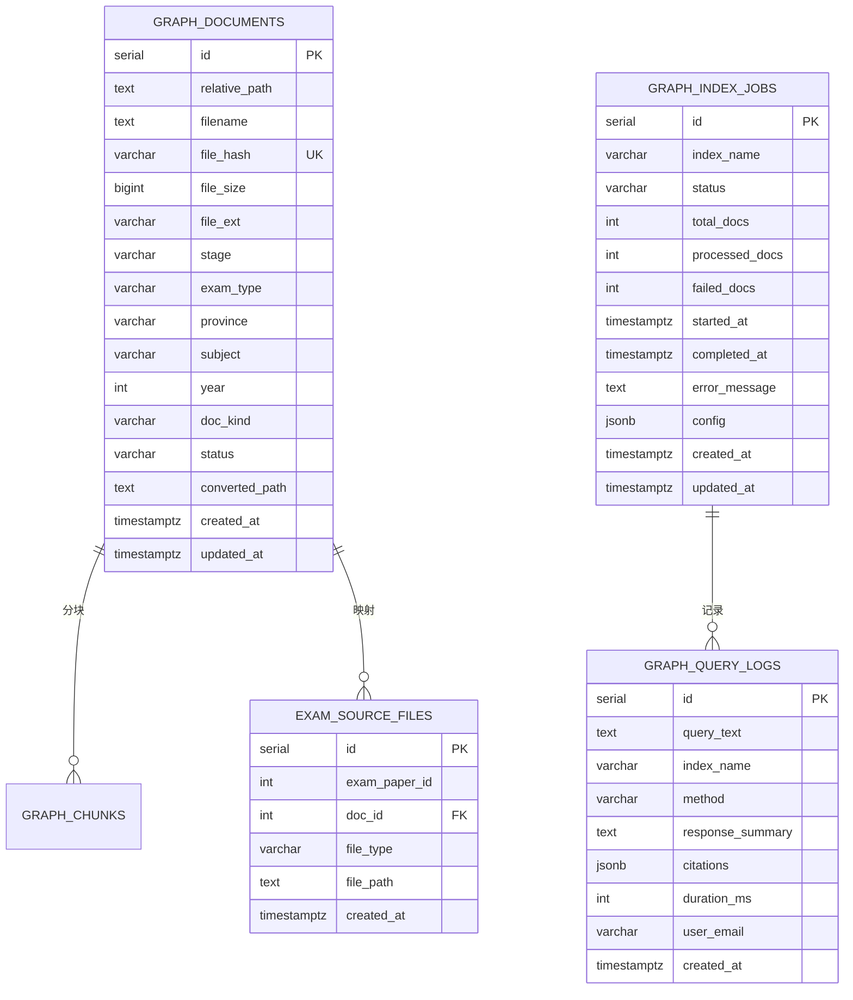
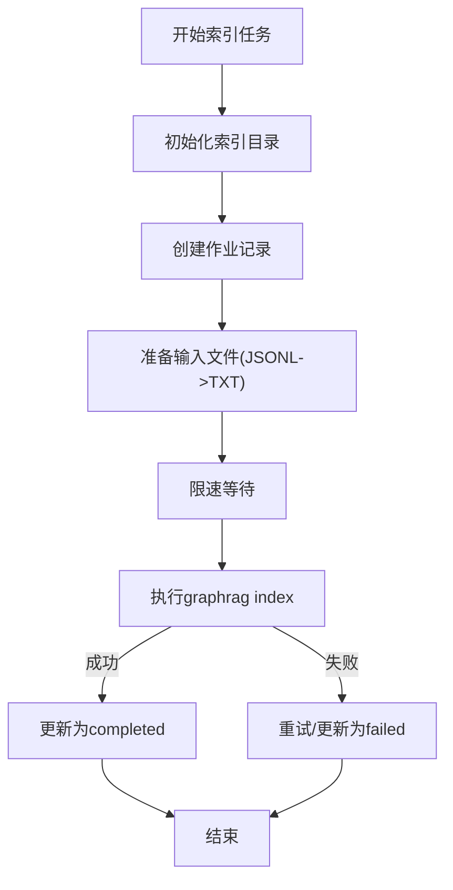
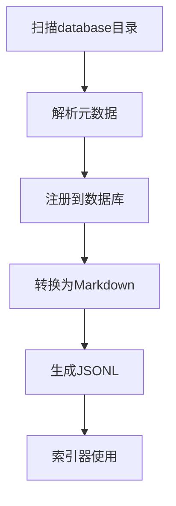
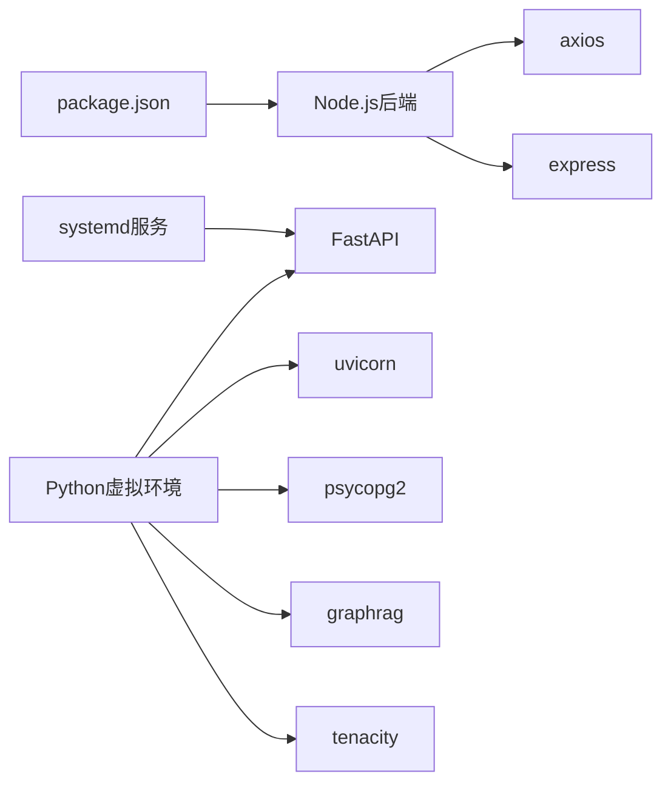

# GraphRAG知识图谱集成

<cite>
**本文档引用的文件**
- [server.js](file://server.js)
- [api/graphrag.js](file://api/graphrag.js)
- [graphrag_service/main.py](file://graphrag_service/main.py)
- [graphrag_service/config.py](file://graphrag_service/config.py)
- [graphrag_service/db.py](file://graphrag_service/db.py)
- [graphrag_service/indexer.py](file://graphrag_service/indexer.py)
- [scripts/setup_graphrag.sh](file://scripts/setup_graphrag.sh)
- [scripts/init_graphrag_service.sh](file://scripts/init_graphrag_service.sh)
- [deploy/uibe-graphrag.service](file://deploy/uibe-graphrag.service)
- [scripts/convert_documents.py](file://scripts/convert_documents.py)
- [README.md](file://README.md)
- [package.json](file://package.json)
</cite>

## 目录
1. [简介](#简介)
2. [项目结构](#项目结构)
3. [核心组件](#核心组件)
4. [架构总览](#架构总览)
5. [详细组件分析](#详细组件分析)
6. [依赖关系分析](#依赖关系分析)
7. [性能考虑](#性能考虑)
8. [故障排除指南](#故障排除指南)
9. [结论](#结论)
10. [附录](#附录)

## 简介
本项目为一个基于AI的高中/中考智能辅导系统，集成了GraphRAG知识图谱服务，提供智能问答、题目讲解、相似真题检索、知识图谱可视化与试卷溯源等能力。后端采用Node.js + Express提供API网关与鉴权限流，内部通过Python FastAPI微服务承载GraphRAG查询与索引任务，使用PostgreSQL存储文档、索引作业与查询日志，结合systemd进行服务化部署。

## 项目结构
项目采用前后端分离与微服务化的组织方式：
- 后端API网关：Express应用，负责鉴权、限流、CORS与路由转发
- GraphRAG微服务：FastAPI应用，监听本地端口，提供查询与管理接口
- 文档转换与索引：Python脚本负责扫描、转换、生成JSONL并驱动GraphRAG索引
- 部署：systemd服务单元管理GraphRAG微服务，Express应用独立部署

**图表来源**
- [server.js:1-221](file://server.js#L1-L221)
- [api/graphrag.js:1-224](file://api/graphrag.js#L1-L224)
- [graphrag_service/main.py:1-462](file://graphrag_service/main.py#L1-L462)
- [graphrag_service/config.py:1-59](file://graphrag_service/config.py#L1-L59)
- [graphrag_service/db.py:1-215](file://graphrag_service/db.py#L1-L215)
- [graphrag_service/indexer.py:1-359](file://graphrag_service/indexer.py#L1-L359)
- [deploy/uibe-graphrag.service:1-19](file://deploy/uibe-graphrag.service#L1-L19)
- [scripts/convert_documents.py:1-200](file://scripts/convert_documents.py#L1-L200)

**章节来源**
- [README.md:12-45](file://README.md#L12-L45)
- [server.js:199-205](file://server.js#L199-L205)

## 核心组件
- Express网关与路由
  - 提供JWT鉴权中间件与全局限流策略
  - 将GraphRAG相关请求转发至内部FastAPI服务
  - 实现公开查询接口与管理员管理接口
- FastAPI微服务
  - 提供健康检查、查询、题目讲解、相似题检索、知识图谱与试卷溯源等接口
  - 智能索引选择与查询结果解析
  - 查询日志与统计信息记录
- 数据库层
  - 初始化文档、分块、索引作业与查询日志表
  - 提供作业状态、文档统计与查询日志查询
- 索引调度器
  - 限速、断点续跑、失败重试
  - 自动生成settings.yaml与.env，准备输入文件并调用GraphRAG CLI
- 文档转换流水线
  - 扫描database目录，使用MarkItDown转换为Markdown，生成带元数据的JSONL
  - 基于PostgreSQL实现去重与状态持久化
- 部署与运维
  - systemd服务单元管理GraphRAG微服务
  - 一键部署与初始化脚本

**章节来源**
- [api/graphrag.js:82-224](file://api/graphrag.js#L82-L224)
- [graphrag_service/main.py:178-462](file://graphrag_service/main.py#L178-L462)
- [graphrag_service/db.py:26-215](file://graphrag_service/db.py#L26-L215)
- [graphrag_service/indexer.py:29-359](file://graphrag_service/indexer.py#L29-L359)
- [scripts/convert_documents.py:1-200](file://scripts/convert_documents.py#L1-L200)
- [scripts/setup_graphrag.sh:1-94](file://scripts/setup_graphrag.sh#L1-L94)
- [deploy/uibe-graphrag.service:1-19](file://deploy/uibe-graphrag.service#L1-L19)

## 架构总览
系统采用“网关 + 微服务 + 数据库 + 部署”的分层架构：
- 网关层：Express应用统一接入，提供鉴权、限流与CORS
- 服务层：FastAPI微服务承载GraphRAG查询与管理
- 数据层：PostgreSQL存储文档、索引作业与查询日志
- 索引层：Python脚本负责文档转换与GraphRAG索引
- 部署层：systemd服务单元管理微服务进程

**图表来源**
- [server.js:199-205](file://server.js#L199-L205)
- [api/graphrag.js:38-59](file://api/graphrag.js#L38-L59)
- [graphrag_service/main.py:191-224](file://graphrag_service/main.py#L191-L224)
- [graphrag_service/db.py:169-182](file://graphrag_service/db.py#L169-L182)

**章节来源**
- [server.js:41-75](file://server.js#L41-L75)
- [api/graphrag.js:12-18](file://api/graphrag.js#L12-L18)
- [graphrag_service/main.py:50-64](file://graphrag_service/main.py#L50-L64)

## 详细组件分析

### Express网关与路由组件
- 鉴权与限流
  - 使用JWT中间件保护GraphRAG接口
  - 内存级简单限流，按用户邮箱维度控制每分钟请求次数
- 转发机制
  - POST接口通过axios转发至内部GraphRAG服务，携带用户邮箱
  - GET接口拼接查询参数后转发
- 接口定义
  - 公开查询：通用查询、题目讲解、相似真题检索
  - 知识图谱与试卷溯源：GET接口
  - 管理接口：管理员专用，包括任务状态、统计信息与触发重新索引

**图表来源**
- [api/graphrag.js:20-35](file://api/graphrag.js#L20-L35)
- [api/graphrag.js:38-59](file://api/graphrag.js#L38-L59)

**章节来源**
- [api/graphrag.js:82-224](file://api/graphrag.js#L82-L224)

### FastAPI微服务组件
- 生命周期与CORS
  - 应用启动时初始化数据库表，关闭时清理
  - 仅允许本地与内网访问
- 数据模型
  - 查询请求、题目讲解请求、相似题请求、重新索引请求
- 查询流程
  - 校验索引存在性，调用GraphRAG CLI执行查询
  - 解析输出中的引用与实体，记录查询日志
  - 返回统一结构，包含成功标志、查询参数、结果与耗时
- 管理接口
  - 任务状态查询、统计信息、触发重新索引（异步）

**图表来源**
- [graphrag_service/main.py:191-224](file://graphrag_service/main.py#L191-L224)
- [graphrag_service/main.py:98-157](file://graphrag_service/main.py#L98-L157)
- [graphrag_service/db.py:169-182](file://graphrag_service/db.py#L169-L182)

**章节来源**
- [graphrag_service/main.py:178-462](file://graphrag_service/main.py#L178-L462)

### 数据库层组件
- 表结构
  - graphrag_documents：文档元数据与状态
  - graphrag_chunks：文档分块与嵌入
  - graphrag_index_jobs：索引作业状态与进度
  - graphrag_query_logs：查询日志
  - exam_source_files：试卷源文件映射
- 功能
  - 初始化表与索引
  - 查询作业状态、创建与更新作业
  - 记录查询日志与统计文档状态
  - 获取待索引文档列表

**图表来源**
- [graphrag_service/db.py:30-106](file://graphrag_service/db.py#L30-L106)

**章节来源**
- [graphrag_service/db.py:26-215](file://graphrag_service/db.py#L26-L215)

### 索引调度器组件
- 限速器
  - 基于令牌桶算法，按分钟控制最大请求数
- 设置生成
  - 为每个索引生成settings.yaml与.env，确保GraphRAG CLI正确运行
- 输入准备
  - 清空旧输入，复制JSONL为GraphRAG所需的纯文本格式
- 索引执行
  - 调用graphrag index命令，失败自动重试，记录作业状态
- 作业管理
  - 创建、更新作业状态，支持批量运行与状态查询

**图表来源**
- [graphrag_service/indexer.py:29-52](file://graphrag_service/indexer.py#L29-L52)
- [graphrag_service/indexer.py:155-176](file://graphrag_service/indexer.py#L155-L176)
- [graphrag_service/indexer.py:179-250](file://graphrag_service/indexer.py#L179-L250)
- [graphrag_service/indexer.py:253-288](file://graphrag_service/indexer.py#L253-L288)

**章节来源**
- [graphrag_service/indexer.py:29-359](file://graphrag_service/indexer.py#L29-L359)

### 文档转换流水线组件
- 扫描与注册
  - 遍历database目录，提取元数据并注册到graphrag_documents表
- 转换
  - 使用MarkItDown将多种格式文档转换为Markdown，保存并更新状态
- JSONL生成
  - 生成带元数据的JSONL文件，供索引器使用
- 去重与断点续跑
  - 基于文件哈希去重，支持失败重试与状态持久化

**图表来源**
- [scripts/convert_documents.py:191-200](file://scripts/convert_documents.py#L191-L200)
- [scripts/convert_documents.py:144-189](file://scripts/convert_documents.py#L144-L189)
- [scripts/convert_documents.py:200-415](file://scripts/convert_documents.py#L200-L415)

**章节来源**
- [scripts/convert_documents.py:1-200](file://scripts/convert_documents.py#L1-L200)

## 依赖关系分析
- 运行时依赖
  - Node.js后端依赖Express、axios、jsonwebtoken、express-rate-limit等
  - Python微服务依赖FastAPI、uvicorn、psycopg2、graphrag、tenacity等
- 配置与环境
  - 通过.env文件注入LLM API密钥、基础URL、模型、服务主机与端口
  - systemd服务单元确保微服务随系统启动并受控重启
- 路由与转发
  - Express将/api/graphrag前缀路由转发至GraphRAG微服务

**图表来源**
- [package.json:17-30](file://package.json#L17-L30)
- [scripts/setup_graphrag.sh:27](file://scripts/setup_graphrag.sh#L27)
- [deploy/uibe-graphrag.service:7](file://deploy/uibe-graphrag.service#L7)

**章节来源**
- [package.json:17-43](file://package.json#L17-L43)
- [scripts/setup_graphrag.sh:14-28](file://scripts/setup_graphrag.sh#L14-L28)
- [deploy/uibe-graphrag.service:1-19](file://deploy/uibe-graphrag.service#L1-19)

## 性能考虑
- 查询性能
  - GraphRAG CLI查询超时控制与错误处理，避免阻塞请求
  - 查询结果解析仅提取必要字段，减少前端渲染压力
- 索引性能
  - 限速器控制LLM请求频率，避免API配额耗尽
  - 断点续跑与失败重试提升稳定性
  - 索引之间增加间隔，降低外部服务压力
- 存储与并发
  - 数据库表建立复合索引，加速查询统计与日志检索
  - 网关层内存限流防止突发流量冲击微服务
- 资源限制
  - systemd服务设置内存上限与CPU配额，保障系统稳定性

**章节来源**
- [graphrag_service/main.py:117-131](file://graphrag_service/main.py#L117-L131)
- [graphrag_service/indexer.py:29-52](file://graphrag_service/indexer.py#L29-L52)
- [graphrag_service/db.py:48-106](file://graphrag_service/db.py#L48-L106)
- [deploy/uibe-graphrag.service:13-15](file://deploy/uibe-graphrag.service#L13-L15)

## 故障排除指南
- 服务启动失败
  - 检查systemd服务状态与日志：journalctl -u uibe-graphrag -f
  - 确认环境变量与数据库连接字符串正确
- 查询超时或失败
  - 检查GraphRAG CLI是否正常，确认API密钥与基础URL有效
  - 查看查询日志表定位具体错误
- 索引任务异常
  - 查看索引作业状态与错误信息，确认输入文件准备是否成功
  - 检查限速器配置与外部API配额
- 网关转发错误
  - 确认内部服务地址与端口配置
  - 检查CORS与鉴权中间件是否正确设置

**章节来源**
- [scripts/setup_graphrag.sh:81-86](file://scripts/setup_graphrag.sh#L81-L86)
- [graphrag_service/db.py:112-124](file://graphrag_service/db.py#L112-L124)
- [graphrag_service/indexer.py:280-287](file://graphrag_service/indexer.py#L280-L287)
- [api/graphrag.js:52-58](file://api/graphrag.js#L52-L58)

## 结论
本项目通过“网关 + 微服务 + 数据库 + 索引流水线”的架构，实现了GraphRAG知识图谱的高效集成与稳定运行。Express网关提供统一入口与安全控制，FastAPI微服务承载核心查询与管理能力，PostgreSQL支撑数据持久化与统计分析，Python脚本完成文档转换与索引调度。配合systemd服务化部署与限速策略，系统具备良好的可维护性与可扩展性。

## 附录

### 服务启动配置
- 环境变量
  - GRAPHRAG_API_KEY、GRAPHRAG_API_BASE、GRAPHRAG_MODEL、GRAPHRAG_SERVICE_HOST、GRAPHRAG_SERVICE_PORT、DATABASE_URL
- 启动方式
  - systemd服务：sudo systemctl start uibe-graphrag
  - 直接运行：python3 -m uvicorn graphrag_service.main:app --host 127.0.0.1 --port 8100

**章节来源**
- [scripts/setup_graphrag.sh:36-49](file://scripts/setup_graphrag.sh#L36-L49)
- [deploy/uibe-graphrag.service:7](file://deploy/uibe-graphrag.service#L7)

### API接口规范
- 公开查询接口
  - POST /api/graphrag/query：通用查询，支持索引选择与方法切换
  - POST /api/graphrag/explain：题目讲解
  - POST /api/graphrag/similar-questions：相似真题检索
  - GET /api/graphrag/knowledge-map：知识图谱
  - GET /api/graphrag/paper-source：试卷溯源
- 管理接口
  - GET /api/admin/graphrag/jobs：索引任务状态
  - GET /api/admin/graphrag/stats：统计信息
  - POST /api/admin/graphrag/reindex：触发重新索引

**章节来源**
- [api/graphrag.js:82-224](file://api/graphrag.js#L82-L224)

### 错误处理机制
- 网关层
  - 429限流、503服务不可用、错误响应封装
- 微服务层
  - 404索引不存在、504查询超时、500内部错误
  - 查询日志记录便于追踪

**章节来源**
- [api/graphrag.js:41-58](file://api/graphrag.js#L41-L58)
- [graphrag_service/main.py:102-131](file://graphrag_service/main.py#L102-L131)

### 集成示例与最佳实践
- 集成步骤
  - 安装依赖与初始化数据库
  - 扫描与转换文档，生成JSONL
  - 初始化并运行索引
  - 启动GraphRAG微服务与主服务
- 最佳实践
  - 合理设置限速参数，避免API配额耗尽
  - 使用systemd管理服务，开启自动重启与资源限制
  - 定期清理与备份数据库，监控查询日志

**章节来源**
- [scripts/init_graphrag_service.sh:44-67](file://scripts/init_graphrag_service.sh#L44-L67)
- [scripts/setup_graphrag.sh:66-74](file://scripts/setup_graphrag.sh#L66-L74)