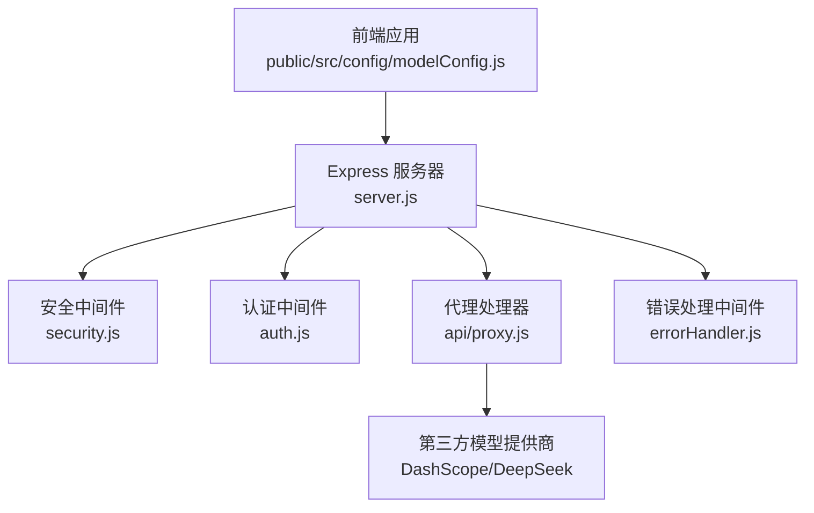
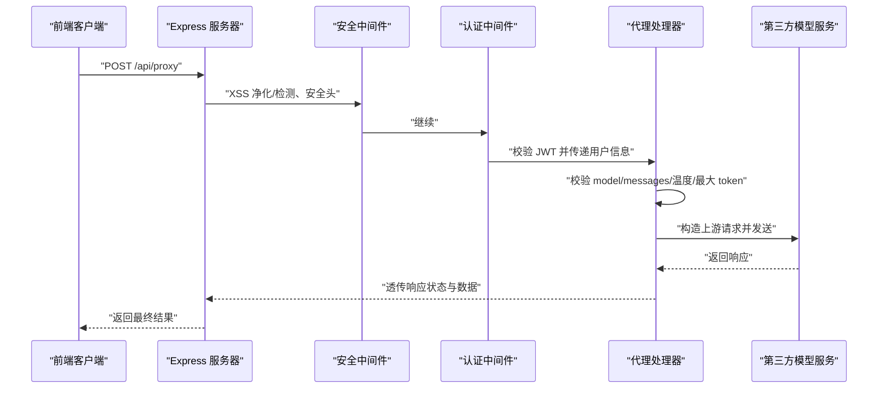
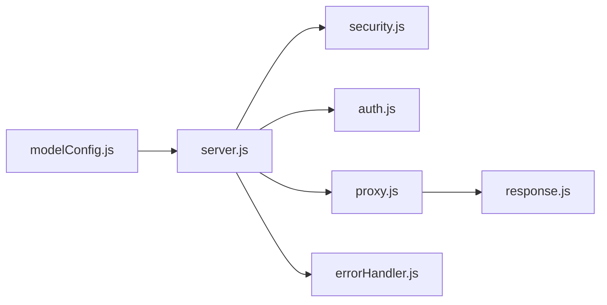

# 代理转发机制

<cite>
**本文档引用的文件**
- [server.js](file://server.js)
- [api/proxy.js](file://api/proxy.js)
- [api/middleware/security.js](file://api/middleware/security.js)
- [api/middleware/errorHandler.js](file://api/middleware/errorHandler.js)
- [api/utils/response.js](file://api/utils/response.js)
- [api/auth.js](file://api/auth.js)
- [tests/api/proxy.test.js](file://tests/api/proxy.test.js)
- [public/src/config/modelConfig.js](file://public/src/config/modelConfig.js)
- [package.json](file://package.json)
</cite>

## 目录
1. [简介](#简介)
2. [项目结构](#项目结构)
3. [核心组件](#核心组件)
4. [架构总览](#架构总览)
5. [详细组件分析](#详细组件分析)
6. [依赖关系分析](#依赖关系分析)
7. [性能考虑](#性能考虑)
8. [故障排除指南](#故障排除指南)
9. [结论](#结论)
10. [附录](#附录)

## 简介
本文件系统性阐述后端代理转发机制的设计与实现，涵盖代理服务的请求转发流程、响应处理、跨域与安全策略、配置选项、性能优化与错误处理，并提供使用示例与调试指南。该代理服务通过统一入口将前端请求转发至第三方大模型服务（如通义千问、DeepSeek），并在转发过程中执行鉴权、输入净化、速率限制与超时控制等保障措施。

## 项目结构
代理转发功能位于后端 Express 应用中，核心文件包括：
- 服务入口与路由注册：server.js
- 代理处理器：api/proxy.js
- 安全中间件：api/middleware/security.js
- 错误处理中间件：api/middleware/errorHandler.js
- 统一响应格式工具：api/utils/response.js
- 认证中间件：api/auth.js
- 前端模型配置：public/src/config/modelConfig.js
- 单元测试：tests/api/proxy.test.js
- 依赖声明：package.json

图表来源
- [server.js:115-168](file://server.js#L115-L168)
- [api/proxy.js:33-105](file://api/proxy.js#L33-L105)
- [api/middleware/security.js:23-113](file://api/middleware/security.js#L23-L113)
- [api/auth.js:29-46](file://api/auth.js#L29-L46)
- [api/middleware/errorHandler.js:13-72](file://api/middleware/errorHandler.js#L13-L72)

章节来源
- [server.js:115-168](file://server.js#L115-L168)
- [package.json:17-29](file://package.json#L17-L29)

## 核心组件
- 代理处理器（api/proxy.js）：负责校验请求、选择模型提供商、构造上游请求、转发并回传响应，同时进行超时控制与日志记录。
- 安全中间件（api/middleware/security.js）：提供 XSS 净化、XSS 检测、CORS 与 CSRF 保护、安全响应头设置。
- 认证中间件（api/auth.js）：基于 JWT 的用户身份验证，确保仅授权用户可访问代理接口。
- 错误处理中间件（api/middleware/errorHandler.js）：统一捕获异常并返回标准化错误响应。
- 统一响应工具（api/utils/response.js）：提供成功/错误响应模板与响应格式校验。
- 路由与限流（server.js）：注册 /api/proxy 路由，应用认证与速率限制；配置 CORS、静态资源与健康检查。

章节来源
- [api/proxy.js:33-105](file://api/proxy.js#L33-L105)
- [api/middleware/security.js:23-113](file://api/middleware/security.js#L23-L113)
- [api/auth.js:29-46](file://api/auth.js#L29-L46)
- [api/middleware/errorHandler.js:13-72](file://api/middleware/errorHandler.js#L13-L72)
- [api/utils/response.js:1-69](file://api/utils/response.js#L1-L69)
- [server.js:44-46](file://server.js#L44-L46)

## 架构总览
代理转发的整体流程如下：
- 前端通过 /api/proxy 发起 POST 请求，携带 model、messages 等参数。
- 服务器应用安全中间件（XSS 净化/检测）、CSRF 保护与安全响应头。
- 认证中间件校验 JWT，确保用户已登录。
- 代理处理器解析请求体，校验模型与消息长度，选择对应提供商配置，构造上游请求并发送。
- 上游返回响应后，代理处理器记录用量并原样回传给客户端。
- 若发生超时或上游错误，代理处理器返回相应错误码与提示。

图表来源
- [server.js:115-168](file://server.js#L115-L168)
- [api/middleware/security.js:23-113](file://api/middleware/security.js#L23-L113)
- [api/auth.js:29-46](file://api/auth.js#L29-L46)
- [api/proxy.js:33-105](file://api/proxy.js#L33-L105)

## 详细组件分析

### 代理处理器（api/proxy.js）
- 功能职责
  - 方法限制：仅接受 POST 请求。
  - 用户鉴权：要求 req.user 存在且包含邮箱。
  - 参数校验：model 必填且为字符串；messages 必填且为非空数组，长度不超过上限。
  - 模型匹配：根据 model 选择对应的提供商配置（含端点与密钥环境变量）。
  - 安全参数：对 max_tokens 与 temperature 进行边界裁剪。
  - 超时控制：使用 AbortController 控制 30 秒超时。
  - 上游转发：以 JSON 形式向第三方端点发起 POST 请求，携带 Authorization 头。
  - 日志与用量：若上游返回 usage 字段，记录用户、模型与 token 使用量。
  - 错误处理：区分超时与网络错误，返回相应状态码与错误信息。

- 关键常量与配置
  - 最大消息长度：20
  - 最大 token 上限：4000
  - 默认 max_tokens：2000，最小 100
  - 默认 temperature：0.7，范围 [0, 2]
  - 超时时间：30 秒

- 数据结构与复杂度
  - 模型配置映射为对象字面量，查找复杂度 O(n)（n 为提供商数量）。
  - 参数裁剪与校验均为 O(1)。
  - 上游请求为一次网络 IO，受第三方服务延迟影响。

- 依赖关系
  - 使用环境变量中的 API Key。
  - 依赖统一错误响应工具。
  - 与安全中间件、认证中间件共同构成前置保障。

章节来源
- [api/proxy.js:3-18](file://api/proxy.js#L3-L18)
- [api/proxy.js:20-31](file://api/proxy.js#L20-L31)
- [api/proxy.js:33-105](file://api/proxy.js#L33-L105)
- [api/utils/response.js:9-15](file://api/utils/response.js#L9-L15)

### 安全中间件（api/middleware/security.js）
- XSS 防护
  - 输入净化：递归遍历请求体/查询/路径参数，对字符串进行净化，移除标签。
  - XSS 检测：正则匹配常见脚本模式，发现不安全内容直接拒绝。
- 跨域与 CSRF
  - CORS：基于 ALLOWED_ORIGINS 环境变量配置允许来源，默认包含本地开发端口。
  - CSRF：对非 GET/HEAD/OPTIONS 方法校验请求来源是否在白名单内，否则拒绝。
- 安全响应头
  - 设置 X-Content-Type-Options、X-Frame-Options、X-XSS-Protection、Referrer-Policy、Permissions-Policy 等。
  - 移除易泄露的 X-Powered-By 头。

章节来源
- [api/middleware/security.js:23-113](file://api/middleware/security.js#L23-L113)

### 认证中间件（api/auth.js）
- JWT 校验：要求 Authorization 头以 Bearer 开头，使用 JWT_SECRET 解析并注入 req.user。
- 异常处理：区分过期与无效 token，返回相应状态码与错误信息。
- 启动校验：validateJWTSecret 在服务启动时强制要求设置强随机密钥。

章节来源
- [api/auth.js:12-27](file://api/auth.js#L12-L27)
- [api/auth.js:29-46](file://api/auth.js#L29-L46)

### 错误处理中间件（api/middleware/errorHandler.js）
- 统一异常捕获：识别 JWT 错误、数据库错误、端口占用等特定错误类型并转换为标准响应。
- 标准化输出：包含 success、message、status 等字段，开发模式下可附加 stack 信息。

章节来源
- [api/middleware/errorHandler.js:13-72](file://api/middleware/errorHandler.js#L13-L72)

### 统一响应工具（api/utils/response.js）
- 成功/错误响应模板：提供 successResponse、errorResponse、分页响应等。
- 响应格式校验：validateResponseFormat 用于校验后端响应结构一致性。

章节来源
- [api/utils/response.js:1-69](file://api/utils/response.js#L1-L69)

### 路由与限流（server.js）
- 路由注册：/api/proxy 使用 authMiddleware 与 proxyLimiter。
- 限流策略：认证接口 20 次/15 分钟，代理接口 10 次/60 秒，通用接口 60 次/60 秒。
- CORS：允许来自 ALLOWED_ORIGINS 或默认本地开发端口的跨域请求。
- 全局包装器：wrapHandler 捕获路由处理函数抛出的异常并返回 500。

章节来源
- [server.js:44-46](file://server.js#L44-L46)
- [server.js:50](file://server.js#L50)
- [server.js:115-124](file://server.js#L115-L124)
- [server.js:168](file://server.js#L168)

### 前端模型配置（public/src/config/modelConfig.js）
- 模型切换：通过 MODEL_CONFIG.currentModel 与 availableModels 管理可用模型。
- 代理地址：baseURL 指向 /api/proxy，前端无需关心上游提供商细节。
- 参数默认值：temperature 与 maxTokens 作为全局默认参数。

章节来源
- [public/src/config/modelConfig.js:1-19](file://public/src/config/modelConfig.js#L1-L19)

## 依赖关系分析
- 组件耦合
  - 代理处理器依赖安全中间件与认证中间件提供的前置保障。
  - 路由层通过 wrapHandler 将异常上抛至统一错误处理中间件。
  - 前端仅依赖 /api/proxy 接口，不直接接触第三方密钥。
- 外部依赖
  - Express 提供 Web 服务器能力。
  - CORS、Rate Limit、DOMPurify 等第三方库增强跨域、限流与安全防护。
- 潜在循环依赖
  - 当前模块间采用单向依赖，无明显循环。

图表来源
- [server.js:35-35](file://server.js#L35-L35)
- [api/proxy.js:1-1](file://api/proxy.js#L1-L1)
- [api/middleware/security.js:1-2](file://api/middleware/security.js#L1-L2)
- [api/auth.js:1-2](file://api/auth.js#L1-L2)
- [api/middleware/errorHandler.js:1-1](file://api/middleware/errorHandler.js#L1-L1)
- [api/utils/response.js:1-1](file://api/utils/response.js#L1-L1)
- [public/src/config/modelConfig.js:14-14](file://public/src/config/modelConfig.js#L14-L14)

## 性能考虑
- 限流策略
  - 对 /api/proxy 应用 10 次/分钟的速率限制，避免滥用导致上游服务压力过大。
  - 认证与通用接口分别设置独立限流，保证系统整体稳定性。
- 超时控制
  - 代理请求设置 30 秒超时，防止阻塞线程与内存泄漏。
- 参数裁剪
  - 对 max_tokens 与 temperature 进行边界裁剪，减少无效请求与上游错误。
- 响应头与缓存
  - 静态 JS 文件设置 no-cache，确保前端资源更新及时。
- 建议优化
  - 引入上游缓存（如按 messages 哈希）以降低重复请求成本。
  - 对高并发场景增加连接池与异步队列管理。
  - 将 AbortController 与超时逻辑封装为可复用工具。

章节来源
- [server.js:44-46](file://server.js#L44-L46)
- [api/proxy.js:6-6](file://api/proxy.js#L6-L6)
- [api/proxy.js:66-67](file://api/proxy.js#L66-L67)
- [server.js:106-112](file://server.js#L106-L112)

## 故障排除指南
- 常见错误与排查
  - 405 Method Not Allowed：确认使用 POST 方法调用 /api/proxy。
  - 401 Unauthorized：检查 Authorization 头是否为 Bearer Token，以及 JWT_SECRET 是否正确配置。
  - 400 Bad Request：检查 model、messages 是否符合要求；messages 长度不得超过 20；max_tokens 与 temperature 是否在允许范围内。
  - 403 Forbidden：检查 ALLOWED_ORIGINS 是否包含当前前端来源。
  - 503 Service Unavailable：检查 DASHSCOPE_API_KEY 或 DEEPSEEK_API_KEY 是否设置。
  - 504 Gateway Timeout：上游响应超时，检查网络与第三方服务状态。
  - 500 Internal Server Error：查看服务器日志定位具体异常。
- 单元测试参考
  - 测试覆盖了方法限制、用户缺失、不支持模型、空 messages、消息长度超限、缺少 API Key、参数裁剪等场景。
- 调试步骤
  - 打开后端日志，观察代理处理器中的日志输出（包含用户邮箱、模型与 token 使用量）。
  - 使用浏览器开发者工具 Network 面板检查请求头与响应状态。
  - 在开发环境设置 NODE_ENV=development 查看堆栈信息。

章节来源
- [tests/api/proxy.test.js:25-98](file://tests/api/proxy.test.js#L25-L98)
- [api/proxy.js:95-104](file://api/proxy.js#L95-L104)
- [api/middleware/security.js:89-113](file://api/middleware/security.js#L89-L113)
- [api/auth.js:29-46](file://api/auth.js#L29-L46)

## 结论
该代理转发机制通过统一入口、严格的参数校验与安全中间件、完善的错误处理与限流策略，实现了对第三方大模型服务的安全、稳定与可控接入。前端仅需关注 /api/proxy 接口与模型配置，无需直接暴露上游密钥，提升了安全性与可维护性。后续可在缓存、队列与连接池等方面进一步优化性能与可靠性。

## 附录

### 使用示例
- 前端调用
  - 将 baseURL 设为 /api/proxy，调用 POST /api/proxy，请求体包含 model、messages、temperature、max_tokens。
- 后端启动
  - 设置 JWT_SECRET、ALLOWED_ORIGINS、DASHSCOPE_API_KEY/DEEPSEEK_API_KEY 等环境变量后启动服务。
- 响应格式
  - 成功与错误响应遵循统一模板，便于前端一致化处理。

章节来源
- [public/src/config/modelConfig.js:14-18](file://public/src/config/modelConfig.js#L14-L18)
- [server.js:168](file://server.js#L168)
- [api/utils/response.js:1-15](file://api/utils/response.js#L1-L15)