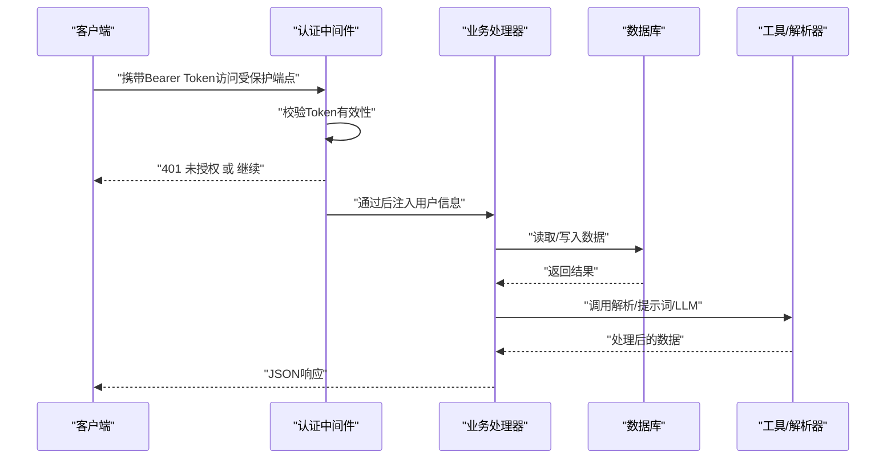
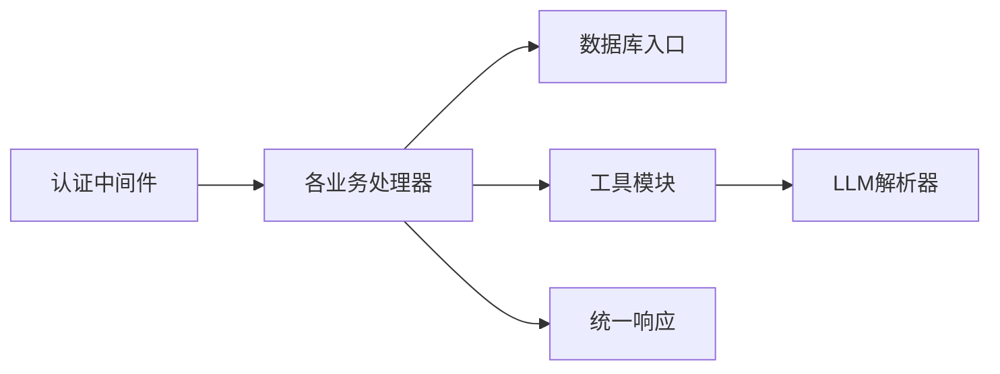

# API接口文档

<cite>
**本文引用的文件**
- [api/auth.js](file://api/auth.js)
- [api/login.js](file://api/login.js)
- [api/register.js](file://api/register.js)
- [api/guest-login.js](file://api/guest-login.js)
- [api/reset-password.js](file://api/reset-password.js)
- [api/exam-session.js](file://api/exam-session.js)
- [api/exam-papers.js](file://api/exam-papers.js)
- [api/exam-questions.js](file://api/exam-questions.js)
- [api/questions.js](file://api/questions.js)
- [api/knowledge-points.js](file://api/knowledge-points.js)
- [api/generate-paper.js](file://api/generate-paper.js)
- [api/explain-question.js](file://api/explain-question.js)
- [api/learning-dashboard.js](file://api/learning-dashboard.js)
- [api/reports.js](file://api/reports.js)
- [api/provinces.js](file://api/provinces.js)
- [api/db.js](file://api/db.js)
- [api/utils/response.js](file://api/utils/response.js)
- [api/utils/validator.js](file://api/utils/validator.js)
- [api/utils/subjectMap.js](file://api/utils/subjectMap.js)
- [api/utils/prompts.js](file://api/utils/prompts.js)
- [api/utils/llmParser.js](file://api/utils/llmParser.js)
- [api/middleware/security.js](file://api/middleware/security.js)
- [api/middleware/errorHandler.js](file://api/middleware/errorHandler.js)
</cite>

## 目录
1. [简介](#简介)
2. [项目结构](#项目结构)
3. [核心组件](#核心组件)
4. [架构总览](#架构总览)
5. [详细组件分析](#详细组件分析)
6. [依赖关系分析](#依赖关系分析)
7. [性能考量](#性能考量)
8. [故障排查指南](#故障排查指南)
9. [结论](#结论)
10. [附录](#附录)

## 简介
本文件为“AI家教”项目的全面API接口文档，覆盖认证系统、用户管理、学习诊断、预测卷生成、AI服务、教学辅助等核心功能模块。文档提供RESTful端点定义、请求参数、响应格式、错误码、认证机制、输入校验规则、错误处理策略、性能限制、速率限制与安全考虑，并给出客户端集成要点与使用场景说明。

## 项目结构
后端采用模块化组织，按功能域划分API文件，通用工具与中间件位于独立目录，数据库访问封装在统一入口中，便于维护与扩展。

```mermaid
graph TB
subgraph "认证与安全"
AUTH["api/auth.js"]
SECURITY["api/middleware/security.js"]
ERRORH["api/middleware/errorHandler.js"]
end
subgraph "用户管理"
LOGIN["api/login.js"]
REGISTER["api/register.js"]
GUEST["api/guest-login.js"]
RESET["api/reset-password.js"]
end
subgraph "考试与练习"
EXAM_SESSION["api/exam-session.js"]
EXAM_PAPERS["api/exam-papers.js"]
EXAM_QUESTIONS["api/exam-questions.js"]
QUESTIONS["api/questions.js"]
end
subgraph "学习与报告"
KNOWLEDGE["api/knowledge-points.js"]
LEARNING_DASH["api/learning-dashboard.js"]
REPORTS["api/reports.js"]
GENPAPER["api/generate-paper.js"]
end
subgraph "AI与教学辅助"
EXPLAIN["api/explain-question.js"]
PROV["api/provinces.js"]
end
DB["api/db.js"]
RESP["api/utils/response.js"]
VALID["api/utils/validator.js"]
MAP["api/utils/subjectMap.js"]
PROMPT["api/utils/prompts.js"]
LLM["api/utils/llmParser.js"]
AUTH --> DB
LOGIN --> DB
REGISTER --> DB
GUEST --> DB
RESET --> DB
EXAM_SESSION --> DB
EXAM_PAPERS --> DB
EXAM_QUESTIONS --> DB
QUESTIONS --> DB
KNOWLEDGE --> DB
LEARNING_DASH --> DB
REPORTS --> DB
GENPAPER --> DB
EXPLAIN --> PROMPT
EXPLAIN --> LLM
GENPAPER --> MAP
KNOWLEDGE --> MAP
EXAM_SESSION --> RESP
EXAM_PAPERS --> RESP
EXAM_QUESTIONS --> RESP
QUESTIONS --> RESP
LOGIN --> VALID
REGISTER --> VALID
```

图表来源
- [api/auth.js:1-47](file://api/auth.js#L1-L47)
- [api/login.js:1-41](file://api/login.js#L1-L41)
- [api/register.js:1-51](file://api/register.js#L1-L51)
- [api/guest-login.js:1-55](file://api/guest-login.js#L1-L55)
- [api/reset-password.js:1-101](file://api/reset-password.js#L1-L101)
- [api/exam-session.js:1-313](file://api/exam-session.js#L1-L313)
- [api/exam-papers.js:1-143](file://api/exam-papers.js#L1-L143)
- [api/exam-questions.js:1-246](file://api/exam-questions.js#L1-L246)
- [api/questions.js:1-114](file://api/questions.js#L1-L114)
- [api/knowledge-points.js:1-146](file://api/knowledge-points.js#L1-L146)
- [api/generate-paper.js:1-430](file://api/generate-paper.js#L1-L430)
- [api/explain-question.js:1-82](file://api/explain-question.js#L1-L82)
- [api/learning-dashboard.js:1-186](file://api/learning-dashboard.js#L1-L186)
- [api/reports.js:1-67](file://api/reports.js#L1-L67)
- [api/provinces.js:1-166](file://api/provinces.js#L1-L166)
- [api/db.js](file://api/db.js)
- [api/utils/response.js](file://api/utils/response.js)
- [api/utils/validator.js](file://api/utils/validator.js)
- [api/utils/subjectMap.js](file://api/utils/subjectMap.js)
- [api/utils/prompts.js](file://api/utils/prompts.js)
- [api/utils/llmParser.js](file://api/utils/llmParser.js)

章节来源
- [api/auth.js:1-47](file://api/auth.js#L1-L47)
- [api/db.js](file://api/db.js)
- [api/utils/response.js](file://api/utils/response.js)
- [api/utils/validator.js](file://api/utils/validator.js)
- [api/utils/subjectMap.js](file://api/utils/subjectMap.js)
- [api/utils/prompts.js](file://api/utils/prompts.js)
- [api/utils/llmParser.js](file://api/utils/llmParser.js)
- [api/middleware/security.js](file://api/middleware/security.js)
- [api/middleware/errorHandler.js](file://api/middleware/errorHandler.js)

## 核心组件
- 认证与授权：基于JWT的Bearer Token认证，支持登录、注册、访客登录、重置密码与中间件校验。
- 用户管理：邮箱/密码注册、登录校验、访客身份持久化与Cookie策略。
- 学习诊断：错题收集、知识点匹配、弱项识别、学习仪表盘聚合。
- 预测卷生成：自适应难度、知识点覆盖、题型分布与模板化生成。
- AI服务：基于DashScope的题目讲解生成与解析。
- 教学辅助：省份/地区数据、试卷与题目管理、练习记录与错题本。

章节来源
- [api/auth.js:29-46](file://api/auth.js#L29-L46)
- [api/login.js:7-40](file://api/login.js#L7-L40)
- [api/register.js:9-50](file://api/register.js#L9-L50)
- [api/guest-login.js:7-54](file://api/guest-login.js#L7-L54)
- [api/reset-password.js:14-100](file://api/reset-password.js#L14-L100)
- [api/exam-session.js:17-94](file://api/exam-session.js#L17-L94)
- [api/exam-session.js:96-278](file://api/exam-session.js#L96-L278)
- [api/exam-session.js:280-313](file://api/exam-session.js#L280-L313)
- [api/exam-papers.js:4-70](file://api/exam-papers.js#L4-L70)
- [api/exam-papers.js:72-104](file://api/exam-papers.js#L72-L104)
- [api/exam-papers.js:106-143](file://api/exam-papers.js#L106-L143)
- [api/exam-questions.js:4-71](file://api/exam-questions.js#L4-L71)
- [api/exam-questions.js:73-165](file://api/exam-questions.js#L73-L165)
- [api/exam-questions.js:167-246](file://api/exam-questions.js#L167-L246)
- [api/questions.js:12-114](file://api/questions.js#L12-L114)
- [api/knowledge-points.js:7-95](file://api/knowledge-points.js#L7-L95)
- [api/knowledge-points.js:97-146](file://api/knowledge-points.js#L97-L146)
- [api/generate-paper.js:6-153](file://api/generate-paper.js#L6-L153)
- [api/explain-question.js:7-82](file://api/explain-question.js#L7-L82)
- [api/learning-dashboard.js:5-136](file://api/learning-dashboard.js#L5-L136)
- [api/reports.js:4-67](file://api/reports.js#L4-L67)
- [api/provinces.js:4-40](file://api/provinces.js#L4-L40)
- [api/provinces.js:42-84](file://api/provinces.js#L42-L84)
- [api/provinces.js:86-166](file://api/provinces.js#L86-L166)

## 架构总览
系统采用“路由处理器 + 数据库访问 + 工具与中间件”的分层设计。认证中间件拦截受保护端点，统一错误响应与安全策略，业务逻辑集中在各API模块内，数据持久化通过统一数据库入口实现。

图表来源
- [api/auth.js:29-46](file://api/auth.js#L29-L46)
- [api/login.js:33-39](file://api/login.js#L33-L39)
- [api/explain-question.js:32-81](file://api/explain-question.js#L32-L81)
- [api/utils/llmParser.js](file://api/utils/llmParser.js)
- [api/utils/prompts.js](file://api/utils/prompts.js)

## 详细组件分析

### 认证系统API
- 端点与方法
  - POST /api/login 登录
  - POST /api/register 注册
  - POST /api/guest-login 访客登录
  - POST /api/reset-password/send-reset-code 发送验证码
  - POST /api/reset-password 重置密码
- 请求参数与校验
  - 登录/注册/访客登录：遵循输入校验规则，包含邮箱格式、密码强度、年级范围等。
  - 重置密码：包含邮箱、新密码、验证码，具备频率限制与过期控制。
- 响应格式
  - 成功：返回success与token及用户信息；失败：统一错误响应。
- 错误码
  - 400：参数缺失/非法；401：认证失败/过期；404：资源不存在；429：请求过于频繁；500：服务器内部错误。
- 安全与性能
  - JWT密钥必须在生产环境设置为强随机密钥（≥32字符），否则拒绝启动。
  - 密码使用哈希存储；验证码缓存与尝试次数限制；Cookie设置HttpOnly与SameSite策略。

章节来源
- [api/auth.js:12-27](file://api/auth.js#L12-L27)
- [api/auth.js:29-46](file://api/auth.js#L29-L46)
- [api/login.js:7-40](file://api/login.js#L7-L40)
- [api/register.js:9-50](file://api/register.js#L9-L50)
- [api/guest-login.js:7-54](file://api/guest-login.js#L7-L54)
- [api/reset-password.js:14-100](file://api/reset-password.js#L14-L100)
- [api/utils/validator.js](file://api/utils/validator.js)
- [api/utils/response.js](file://api/utils/response.js)

### 用户管理API
- 端点与方法
  - GET /api/questions 获取错题列表
  - POST /api/questions 新增错题
  - DELETE /api/questions 删除错题
- 请求参数与校验
  - 列表：支持学科、难度、知识点过滤，分页参数限制。
  - 新增：题目内容与学科为必填，单条数据大小限制。
  - 删除：需提供错题ID与用户权限校验。
- 响应格式
  - 分页响应包含总数与页码；新增返回ID；删除返回成功消息。
- 错误码
  - 400：参数缺失/非法；404：资源不存在/无权限；413：数据过大；500：服务器内部错误。

章节来源
- [api/questions.js:12-114](file://api/questions.js#L12-L114)
- [api/utils/response.js](file://api/utils/response.js)

### 学习诊断API
- 端点与方法
  - GET /api/knowledge-points 获取知识点列表
  - POST /api/knowledge-points 初始化/导入知识点
  - GET /api/knowledge-points/weak 获取弱项诊断
  - GET /api/dashboard 获取学习仪表盘
- 请求参数与校验
  - 知识点：支持学科与层级过滤；支持批量导入。
  - 弱项：基于错题与知识点匹配，计算弱项指数与样例题目。
  - 仪表盘：聚合错题、练习、月度趋势与建议。
- 响应格式
  - 知识点：返回结构化数据，subtopics字段兼容JSON解析。
  - 弱项：返回弱项列表与样本题目。
  - 仪表盘：返回用户概览、学科分布、每日/月度趋势与建议。
- 错误码
  - 400：参数非法；500：服务器内部错误。

章节来源
- [api/knowledge-points.js:7-95](file://api/knowledge-points.js#L7-L95)
- [api/knowledge-points.js:97-146](file://api/knowledge-points.js#L97-L146)
- [api/learning-dashboard.js:5-136](file://api/learning-dashboard.js#L5-L136)
- [api/utils/subjectMap.js](file://api/utils/subjectMap.js)

### 预测卷生成API
- 端点与方法
  - POST /api/generate-paper 生成个性化预测卷
- 请求参数与校验
  - subject：学科；difficulty：目标难度；timeLimit：时长；focusWeakPoints/adaptive：策略开关。
  - 自适应难度：根据用户能力动态调整。
- 响应格式
  - 返回包含标题、学科、元数据、分节与题目列表的预测卷结构。
- 错误码
  - 400：无知识点数据；500：服务器内部错误。

章节来源
- [api/generate-paper.js:6-153](file://api/generate-paper.js#L6-L153)

### AI服务API
- 端点与方法
  - POST /api/explain-question 题目讲解生成
- 请求参数与校验
  - question：题目内容；subject：学科；knowledgePoint：知识点。
- 响应格式
  - 返回解析后的讲解内容与质量评估。
- 错误码
  - 400：参数缺失；500：AI服务未配置或生成失败。

章节来源
- [api/explain-question.js:7-82](file://api/explain-question.js#L7-L82)
- [api/utils/prompts.js](file://api/utils/prompts.js)
- [api/utils/llmParser.js](file://api/utils/llmParser.js)

### 教学辅助API
- 端点与方法
  - GET /api/papers 获取试卷列表
  - GET /api/papers/:id 获取试卷详情
  - POST /api/papers 创建试卷
  - GET /api/questions/:paperId 获取试卷题目
  - POST /api/questions 创建题目
  - POST /api/questions/batch 批量创建题目
  - GET /api/provinces 获取省份列表
  - GET /api/provinces/:code 获取省份详情
  - GET /api/provinces/:code/stats 获取省份统计
- 请求参数与校验
  - 列表：支持多条件过滤与分页；详情：ID存在性校验。
  - 题目：必填字段校验；批量创建支持数组。
  - 省份：支持按考试类型与区域过滤。
- 响应格式
  - 列表：返回数据、总数、分页信息；详情：返回完整信息与附加统计。
- 错误码
  - 400：参数缺失/非法；404：资源不存在；500：服务器内部错误。

章节来源
- [api/exam-papers.js:4-70](file://api/exam-papers.js#L4-L70)
- [api/exam-papers.js:72-104](file://api/exam-papers.js#L72-L104)
- [api/exam-papers.js:106-143](file://api/exam-papers.js#L106-L143)
- [api/exam-questions.js:4-71](file://api/exam-questions.js#L4-L71)
- [api/exam-questions.js:73-165](file://api/exam-questions.js#L73-L165)
- [api/exam-questions.js:167-246](file://api/exam-questions.js#L167-L246)
- [api/provinces.js:4-40](file://api/provinces.js#L4-L40)
- [api/provinces.js:42-84](file://api/provinces.js#L42-L84)
- [api/provinces.js:86-166](file://api/provinces.js#L86-L166)

### 考试会话API
- 端点与方法
  - POST /api/exam-session/start 开始考试会话
  - POST /api/exam-session/submit 提交会话并评分
  - GET /api/exam-session/history 获取历史
- 请求参数与校验
  - 开始：学科、省份、年份、时长、题量；参数范围限制。
  - 提交：会话ID与答案数组；答案完整性校验。
  - 历史：分页参数校验。
- 响应格式
  - 开始：返回会话ID、题目清单与限制。
  - 提交：返回得分、准确率、结果明细与记录。
  - 历史：返回会话列表与总数。
- 错误码
  - 400：参数缺失/非法；404：资源不存在；500：服务器内部错误。

章节来源
- [api/exam-session.js:17-94](file://api/exam-session.js#L17-L94)
- [api/exam-session.js:96-278](file://api/exam-session.js#L96-L278)
- [api/exam-session.js:280-313](file://api/exam-session.js#L280-L313)

### 报告与记录API
- 端点与方法
  - GET /api/reports 获取报告列表
  - POST /api/reports 新建报告
  - DELETE /api/reports 删除报告
- 请求参数与校验
  - 新建：支持嵌套相似题目；数据JSON序列化。
  - 删除：需提供报告ID与用户权限校验。
- 响应格式
  - 列表：返回报告与相似题目；新建返回ID；删除返回成功消息。
- 错误码
  - 400：参数缺失/非法；404：资源不存在；500：服务器内部错误。

章节来源
- [api/reports.js:4-67](file://api/reports.js#L4-L67)

## 依赖关系分析
- 组件耦合
  - 认证中间件与所有受保护端点强耦合，确保统一鉴权。
  - 业务模块依赖数据库入口与工具模块，保持低耦合高内聚。
- 外部依赖
  - DashScope AI服务用于题目讲解；数据库驱动用于数据持久化。
- 可能的循环依赖
  - 当前结构清晰，未见循环依赖迹象。

图表来源
- [api/auth.js:29-46](file://api/auth.js#L29-L46)
- [api/db.js](file://api/db.js)
- [api/utils/response.js](file://api/utils/response.js)
- [api/utils/llmParser.js](file://api/utils/llmParser.js)

## 性能考量
- 缓存策略
  - 学习仪表盘使用短时缓存提升查询性能。
- 并发与事务
  - 关键路径采用Promise并发查询减少等待时间。
- 数据库优化
  - 查询参数绑定与LIMIT/OFFSET分页避免全表扫描。
- AI服务
  - 仅在配置有效时启用，避免不必要的网络开销。

章节来源
- [api/learning-dashboard.js:10-130](file://api/learning-dashboard.js#L10-L130)
- [api/explain-question.js:32-60](file://api/explain-question.js#L32-L60)

## 故障排查指南
- 认证失败
  - 检查Authorization头是否为Bearer Token；确认JWT_SECRET配置与长度；核对Token是否过期。
- 输入校验失败
  - 核对邮箱格式、密码强度、年级范围；检查必填字段是否缺失。
- 速率限制
  - 重置密码验证码发送存在频率限制与过期控制，注意等待冷却时间。
- 数据库异常
  - 查看具体SQL执行与参数绑定；确认表结构与索引是否存在。
- AI服务异常
  - 确认DashScope API Key配置；关注网络连通性与服务可用性。

章节来源
- [api/auth.js:12-27](file://api/auth.js#L12-L27)
- [api/reset-password.js:30-46](file://api/reset-password.js#L30-L46)
- [api/explain-question.js:32-60](file://api/explain-question.js#L32-L60)
- [api/middleware/errorHandler.js](file://api/middleware/errorHandler.js)

## 结论
本API体系以模块化与中间件为核心，实现了从认证到教学辅助的完整闭环。通过统一的响应格式、严格的输入校验与安全策略，以及可扩展的AI服务集成，为前端提供了稳定可靠的后端支撑。建议在生产环境中强化密钥管理、接入限流与监控，并持续优化数据库索引与缓存策略。

## 附录

### 统一响应与错误处理
- 成功响应：包含success标志与数据主体。
- 错误响应：包含错误描述，状态码对应业务语义。
- 中间件：全局错误捕获与标准化输出。

章节来源
- [api/utils/response.js](file://api/utils/response.js)
- [api/middleware/errorHandler.js](file://api/middleware/errorHandler.js)

### 客户端集成要点
- 认证流程
  - 先调用登录/注册/访客登录获取token，后续请求在Authorization头中携带Bearer Token。
- 速率限制
  - 遵守验证码发送与重试间隔；避免高频重复请求。
- 数据校验
  - 严格遵循参数类型与长度限制；注意分页参数边界。
- 错误处理
  - 根据状态码与错误信息进行用户提示与重试策略。

章节来源
- [api/auth.js:29-46](file://api/auth.js#L29-L46)
- [api/reset-password.js:30-46](file://api/reset-password.js#L30-L46)