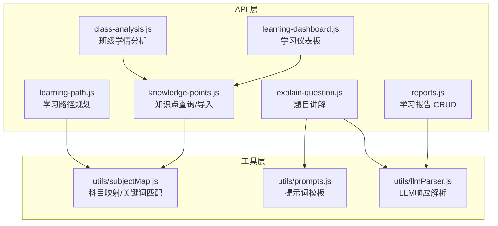
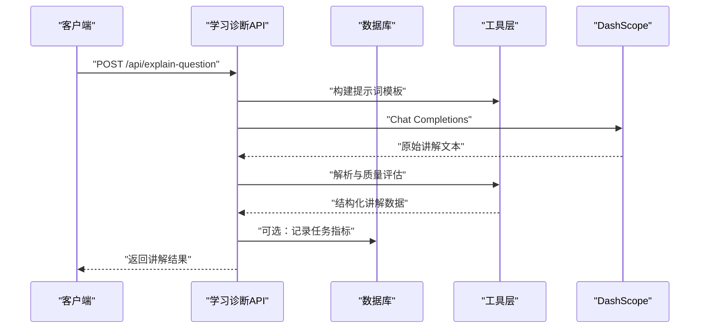
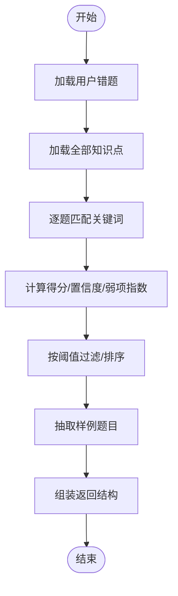
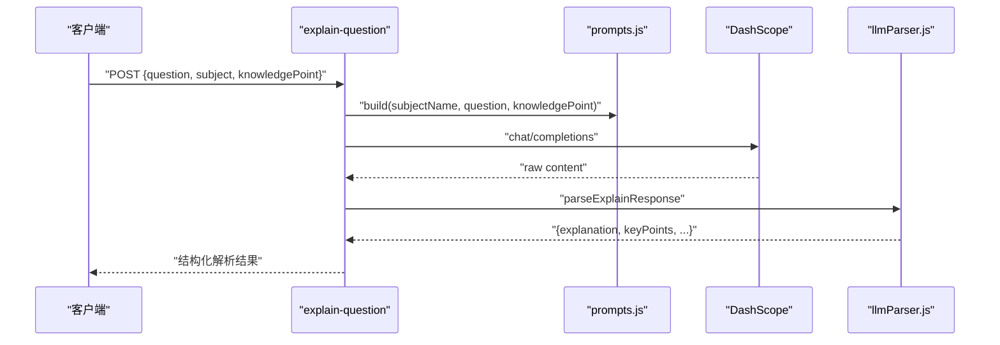
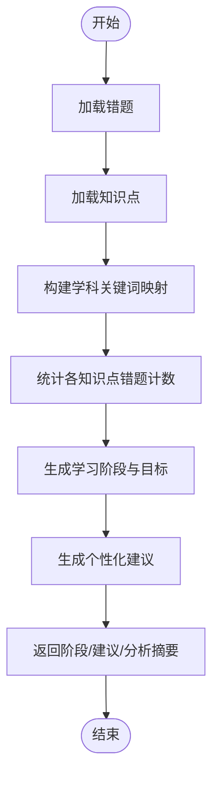
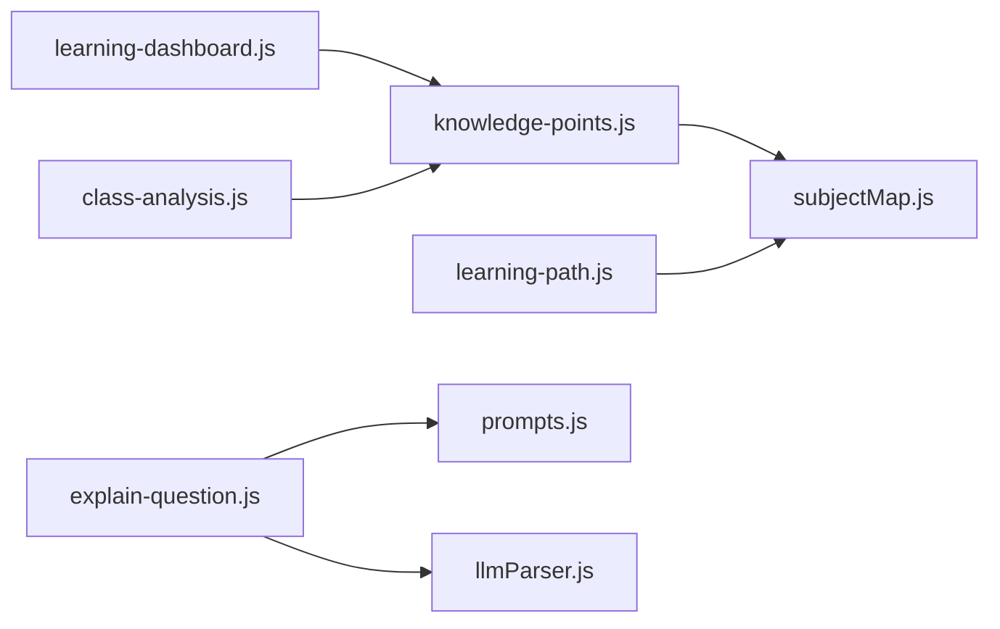

# 学习诊断API

<cite>
**本文档引用的文件**
- [api/reports.js](file://api/reports.js)
- [api/knowledge-points.js](file://api/knowledge-points.js)
- [api/learning-dashboard.js](file://api/learning-dashboard.js)
- [api/class-analysis.js](file://api/class-analysis.js)
- [api/explain-question.js](file://api/explain-question.js)
- [api/learning-path.js](file://api/learning-path.js)
- [api/utils/subjectMap.js](file://api/utils/subjectMap.js)
- [api/utils/prompts.js](file://api/utils/prompts.js)
- [api/utils/llmParser.js](file://api/utils/llmParser.js)
</cite>

## 目录
1. [简介](#简介)
2. [项目结构](#项目结构)
3. [核心组件](#核心组件)
4. [架构总览](#架构总览)
5. [详细组件分析](#详细组件分析)
6. [依赖分析](#依赖分析)
7. [性能考虑](#性能考虑)
8. [故障排查指南](#故障排查指南)
9. [结论](#结论)
10. [附录](#附录)

## 简介
本文件为“AI家教项目”的学习诊断API提供权威、可操作的技术文档。围绕错题管理、学习报告生成、知识点分析与学习仪表板等核心能力，系统阐述接口定义、数据流程、算法逻辑与结果呈现，并给出完整的调用示例、数据格式说明与集成方案。同时解释学习路径规划与个性化推荐的实现机制，帮助开发者与产品人员快速落地。

## 项目结构
学习诊断相关后端接口主要位于 api 目录下，前端展示页面位于 frontend 目录。核心模块包括：
- 错题与知识点：错题采集、知识点映射与弱项识别
- 报告与讲解：学习报告的增删查与AI讲解
- 仪表板与分析：个人学习仪表板、班级学情分析
- 路径与推荐：基于错题与知识点的学习路径规划与建议

图表来源
- [api/reports.js:1-67](file://api/reports.js#L1-L67)
- [api/knowledge-points.js:1-146](file://api/knowledge-points.js#L1-L146)
- [api/learning-dashboard.js:1-204](file://api/learning-dashboard.js#L1-L204)
- [api/class-analysis.js:1-298](file://api/class-analysis.js#L1-L298)
- [api/explain-question.js:1-82](file://api/explain-question.js#L1-L82)
- [api/learning-path.js:1-291](file://api/learning-path.js#L1-L291)
- [api/utils/subjectMap.js:1-378](file://api/utils/subjectMap.js#L1-L378)
- [api/utils/prompts.js:1-131](file://api/utils/prompts.js#L1-L131)
- [api/utils/llmParser.js:1-204](file://api/utils/llmParser.js#L1-L204)

章节来源
- [api/reports.js:1-67](file://api/reports.js#L1-L67)
- [api/knowledge-points.js:1-146](file://api/knowledge-points.js#L1-L146)
- [api/learning-dashboard.js:1-204](file://api/learning-dashboard.js#L1-L204)
- [api/class-analysis.js:1-298](file://api/class-analysis.js#L1-L298)
- [api/explain-question.js:1-82](file://api/explain-question.js#L1-L82)
- [api/learning-path.js:1-291](file://api/learning-path.js#L1-L291)
- [api/utils/subjectMap.js:1-378](file://api/utils/subjectMap.js#L1-L378)
- [api/utils/prompts.js:1-131](file://api/utils/prompts.js#L1-L131)
- [api/utils/llmParser.js:1-204](file://api/utils/llmParser.js#L1-L204)

## 核心组件
- 错题与知识点
  - 错题采集与弱项识别：通过关键词匹配与难度/频率权重计算，定位薄弱知识点并生成弱项清单。
  - 知识点查询与导入：支持按学科/层级筛选，支持种子数据导入（高考/中考）。
- 学习报告
  - 报告的增删查：保存报告主体与相似题，查询历史报告。
- 题目讲解
  - AI讲解：基于提示词模板与LLM解析，输出讲解、关键点与变式/同类题。
- 学习仪表板
  - 多维指标：错题分布、日练习趋势、月度趋势、薄弱知识点、学习建议。
- 班级学情分析
  - 科目预警、知识点分布、近期活动、进度趋势、考试历史、教师仪表盘。
- 学习路径规划
  - 基于错题与知识点难度分层，生成阶段性学习计划与每日目标，给出个性化建议。

章节来源
- [api/knowledge-points.js:97-146](file://api/knowledge-points.js#L97-L146)
- [api/reports.js:4-66](file://api/reports.js#L4-L66)
- [api/explain-question.js:7-82](file://api/explain-question.js#L7-L82)
- [api/learning-dashboard.js:5-149](file://api/learning-dashboard.js#L5-L149)
- [api/class-analysis.js:5-129](file://api/class-analysis.js#L5-L129)
- [api/learning-path.js:4-73](file://api/learning-path.js#L4-L73)

## 架构总览
学习诊断API采用“控制器-工具层-外部服务”三层结构：
- 控制器：各业务接口处理请求、组装SQL、调用缓存与工具层。
- 工具层：科目映射、关键词匹配、提示词模板、LLM响应解析。
- 外部服务：DashScope（通义千问）用于AI讲解。

图表来源
- [api/explain-question.js:7-82](file://api/explain-question.js#L7-L82)
- [api/utils/prompts.js:16-25](file://api/utils/prompts.js#L16-L25)
- [api/utils/llmParser.js:110-133](file://api/utils/llmParser.js#L110-L133)

## 详细组件分析

### 错题管理与知识点分析
- 接口职责
  - 获取用户错题与知识点，计算薄弱知识点并返回样本题目。
  - 提供知识点查询与种子数据导入（高考/中考）。
- 关键算法
  - 关键词匹配：遍历错题数据的关键字段，统计与知识点关键词的匹配次数与置信度。
  - 弱项指数：综合匹配得分、知识点难度与出现频率，排序输出薄弱点。
- 数据流程

图表来源
- [api/knowledge-points.js:97-146](file://api/knowledge-points.js#L97-L146)
- [api/utils/subjectMap.js:268-364](file://api/utils/subjectMap.js#L268-L364)

章节来源
- [api/knowledge-points.js:97-146](file://api/knowledge-points.js#L97-L146)
- [api/utils/subjectMap.js:268-364](file://api/utils/subjectMap.js#L268-L364)

### 学习报告生成
- 接口职责
  - GET：查询用户所有报告及关联的相似题。
  - POST：保存报告主体与相似题，返回新建ID。
  - DELETE：删除指定报告。
- 数据结构
  - 报告主体：包含报告元数据与正文。
  - 相似题：与报告相关的题目集合，便于后续复习与对比。

章节来源
- [api/reports.js:4-66](file://api/reports.js#L4-L66)

### 题目讲解（AI讲解）
- 接口职责
  - POST：接收题目、学科、知识点，调用DashScope生成讲解。
- 提示词与解析
  - 提示词模板：统一的讲解结构，确保输出字段完备。
  - LLM解析：提取JSON、清洗标签、质量评估与回退策略。
- 输出字段
  - 讲解正文、关键点、变式题、同类题等。

图表来源
- [api/explain-question.js:7-82](file://api/explain-question.js#L7-L82)
- [api/utils/prompts.js:97-129](file://api/utils/prompts.js#L97-L129)
- [api/utils/llmParser.js:110-133](file://api/utils/llmParser.js#L110-L133)

章节来源
- [api/explain-question.js:7-82](file://api/explain-question.js#L7-L82)
- [api/utils/prompts.js:97-129](file://api/utils/prompts.js#L97-L129)
- [api/utils/llmParser.js:110-133](file://api/utils/llmParser.js#L110-L133)

### 学习仪表板
- 接口职责
  - GET：聚合错题、练习、知识点表现与月度趋势，生成弱项与建议。
- 指标说明
  - 总错题数、总练习数、平均正确率、学科错题占比、日练习趋势、月度趋势、薄弱知识点等级与建议。
- 建议生成
  - 基于错题数量、学科占比、知识点正确率自动给出建议。

章节来源
- [api/learning-dashboard.js:5-149](file://api/learning-dashboard.js#L5-L149)

### 班级学情分析
- 接口职责
  - 学生分析：学科平均分、错题分布、近期活动、知识点分布、进度趋势、考试历史。
  - 教师仪表盘：总用户、当日活跃、题库/试卷规模、学科分布、难度分布。
  - 班级详情：按时间段统计学生表现、班级薄弱点、周趋势、分数段分布。
- 查询要点
  - 使用日期区间、学科过滤、分组聚合与排序，保证结果可读性与时效性。

章节来源
- [api/class-analysis.js:5-129](file://api/class-analysis.js#L5-L129)
- [api/class-analysis.js:131-183](file://api/class-analysis.js#L131-L183)
- [api/class-analysis.js:185-298](file://api/class-analysis.js#L185-L298)

### 学习路径规划与个性化推荐
- 接口职责
  - GET：按学科生成学习阶段、每日目标、难度与总体周数，并给出个性化建议。
- 关键逻辑
  - 基于错题与知识点难度分层，生成“基础巩固—核心强化—难点突破—综合训练”等阶段。
  - 根据薄弱点数量与错题总量，动态调整每日学习时长与侧重点。
- 关键字映射
  - 不同学科与知识点ID对应关键词集合，用于错题与知识点的匹配。

图表来源
- [api/learning-path.js:4-73](file://api/learning-path.js#L4-L73)
- [api/learning-path.js:75-110](file://api/learning-path.js#L75-L110)
- [api/learning-path.js:112-176](file://api/learning-path.js#L112-L176)
- [api/learning-path.js:178-201](file://api/learning-path.js#L178-L201)
- [api/utils/subjectMap.js:203-290](file://api/utils/subjectMap.js#L203-L290)

章节来源
- [api/learning-path.js:4-73](file://api/learning-path.js#L4-L73)
- [api/learning-path.js:75-110](file://api/learning-path.js#L75-L110)
- [api/learning-path.js:112-176](file://api/learning-path.js#L112-L176)
- [api/learning-path.js:178-201](file://api/learning-path.js#L178-L201)
- [api/utils/subjectMap.js:203-290](file://api/utils/subjectMap.js#L203-L290)

## 依赖分析
- 组件耦合
  - 错题与知识点分析依赖科目映射与关键词权重。
  - 题目讲解依赖提示词模板与LLM解析。
  - 学习仪表板与班级分析依赖数据库聚合查询。
  - 学习路径规划依赖错题与知识点分析结果。
- 外部依赖
  - DashScope：用于题目讲解的模型推理。
  - SQLite：本地数据库，存储用户错题、报告、知识点等。

图表来源
- [api/knowledge-points.js:1-146](file://api/knowledge-points.js#L1-L146)
- [api/learning-path.js:1-291](file://api/learning-path.js#L1-L291)
- [api/explain-question.js:1-82](file://api/explain-question.js#L1-L82)
- [api/utils/subjectMap.js:1-378](file://api/utils/subjectMap.js#L1-L378)
- [api/utils/prompts.js:1-131](file://api/utils/prompts.js#L1-L131)
- [api/utils/llmParser.js:1-204](file://api/utils/llmParser.js#L1-L204)
- [api/learning-dashboard.js:1-204](file://api/learning-dashboard.js#L1-L204)
- [api/class-analysis.js:1-298](file://api/class-analysis.js#L1-L298)

章节来源
- [api/knowledge-points.js:1-146](file://api/knowledge-points.js#L1-L146)
- [api/learning-path.js:1-291](file://api/learning-path.js#L1-L291)
- [api/explain-question.js:1-82](file://api/explain-question.js#L1-L82)
- [api/utils/subjectMap.js:1-378](file://api/utils/subjectMap.js#L1-L378)
- [api/utils/prompts.js:1-131](file://api/utils/prompts.js#L1-L131)
- [api/utils/llmParser.js:1-204](file://api/utils/llmParser.js#L1-L204)
- [api/learning-dashboard.js:1-204](file://api/learning-dashboard.js#L1-L204)
- [api/class-analysis.js:1-298](file://api/class-analysis.js#L1-L298)

## 性能考虑
- 缓存策略
  - 学习仪表板使用短期缓存，降低重复聚合查询压力。
- 并发查询
  - 仪表板与班级分析采用并发查询多个聚合SQL，缩短响应时间。
- 解析与质量控制
  - LLM解析包含回退策略与质量评分，避免无效输出影响用户体验。
- 数据库索引
  - 建议在用户邮箱、时间戳、学科代码等字段建立索引，提升查询效率。

## 故障排查指南
- AI讲解失败
  - 检查 DashScope API Key 是否配置；确认网络连通性；查看错误码与消息。
- LLM响应解析异常
  - 检查返回内容是否包含JSON片段；确认解析器清洗逻辑是否生效；关注质量评分与回退标志。
- 报告接口报错
  - 确认请求方法与参数（如删除接口需提供ID）；检查数据库连接与事务。
- 知识点导入失败
  - 检查种子文件格式与字段完整性；确认数据库权限与约束。

章节来源
- [api/explain-question.js:33-43](file://api/explain-question.js#L33-L43)
- [api/utils/llmParser.js:110-133](file://api/utils/llmParser.js#L110-L133)
- [api/reports.js:58-63](file://api/reports.js#L58-L63)
- [api/knowledge-points.js:47-67](file://api/knowledge-points.js#L47-L67)

## 结论
学习诊断API通过“错题-知识点-报告-讲解-仪表板-路径规划”的闭环设计，实现了从数据采集到个性化建议的全流程能力。配合缓存、并发查询与LLM解析机制，既保证了性能，又提升了智能化水平。建议在生产环境中完善监控与告警，持续优化提示词与解析策略，以获得更稳定、更高质量的诊断体验。

## 附录

### API 定义与调用示例

- 获取学习报告列表
  - 方法与路径：GET /api/reports
  - 成功响应：数组，元素包含报告ID、数据、相似题、时间戳
  - 示例：[api/reports.js:8-35](file://api/reports.js#L8-L35)

- 创建学习报告
  - 方法与路径：POST /api/reports
  - 请求体：报告主体 + 可选相似题数组
  - 成功响应：{ id }
  - 示例：[api/reports.js:37-56](file://api/reports.js#L37-L56)

- 删除学习报告
  - 方法与路径：DELETE /api/reports
  - 请求体：{ id }
  - 成功响应：{ message: "删除成功" }
  - 示例：[api/reports.js:58-63](file://api/reports.js#L58-L63)

- 获取知识点（可按学科/层级过滤）
  - 方法与路径：GET /api/knowledge-points?subject=...&level=...
  - 成功响应：知识点数组（含子主题）
  - 示例：[api/knowledge-points.js:11-42](file://api/knowledge-points.js#L11-L42)

- 导入知识点（高考/中考）
  - 方法与路径：POST /api/knowledge-points
  - 请求体：{ action: "seed"|"seed_zhongkao" }
  - 成功响应：{ success, count, message }
  - 示例：[api/knowledge-points.js:44-92](file://api/knowledge-points.js#L44-L92)

- 获取薄弱知识点（按错题与关键词匹配）
  - 方法与路径：GET /api/knowledge-points/weak
  - 成功响应：{ total_wrong_questions, weak_points_count, weak_points[] }
  - 示例：[api/knowledge-points.js:97-146](file://api/knowledge-points.js#L97-L146)

- 获取学习仪表板
  - 方法与路径：GET /api/learning-dashboard
  - 成功响应：仪表板聚合指标与建议
  - 示例：[api/learning-dashboard.js:5-149](file://api/learning-dashboard.js#L5-L149)

- 获取班级学情分析
  - 方法与路径：GET /api/class-analysis
  - 成功响应：科目预警、知识点分布、进度趋势、考试历史等
  - 示例：[api/class-analysis.js:5-129](file://api/class-analysis.js#L5-L129)

- 获取教师仪表盘
  - 方法与路径：GET /api/class-analysis/teacher
  - 成功响应：总用户、当日活跃、题库/试卷规模、学科分布、难度分布
  - 示例：[api/class-analysis.js:131-183](file://api/class-analysis.js#L131-L183)

- 获取班级详情分析
  - 方法与路径：GET /api/class-analysis/detail?subject=...&period=...
  - 成功响应：学生表现、班级薄弱点、周趋势、分数段分布
  - 示例：[api/class-analysis.js:185-298](file://api/class-analysis.js#L185-L298)

- 获取学习路径（按学科）
  - 方法与路径：GET /api/learning-path?subject=...
  - 成功响应：学科、阶段、周数、建议与分析摘要
  - 示例：[api/learning-path.js:4-73](file://api/learning-path.js#L4-L73)

- 题目讲解（AI）
  - 方法与路径：POST /api/explain-question
  - 请求体：{ question, subject, knowledgePoint }
  - 成功响应：讲解正文、关键点、变式/同类题
  - 示例：[api/explain-question.js:7-82](file://api/explain-question.js#L7-L82)

### 数据格式说明
- 报告主体
  - 字段：标题、内容、学科、时间范围等（由前端/客户端填充）
  - 关联：相似题数组（与报告相关的题目集合）

- 薄弱点结果
  - 字段：知识点ID/名称/学科、错题计数、练习计数、正确率、弱项等级、匹配关键词、样例题目等

- 仪表板结果
  - 字段：用户信息、总错题数、总练习数、平均正确率、学科错题分布、日练习趋势、月度趋势、薄弱知识点列表、学习建议

- 班级分析结果
  - 字段：科目预警、知识点分布、近期活动、进度趋势、考试历史、汇总统计

- 学习路径结果
  - 字段：学科、阶段列表（含周序、重点、主题、每日目标、难度）、总周数、个性化建议、分析摘要

### 集成方案
- 前端集成
  - 在登录后携带认证头访问上述接口，按需渲染报告、仪表板、路径与讲解卡片。
- 后端集成
  - 将错题与知识点数据接入统一数据源，确保subject_code与kpId一致；在生成报告时同步写入相似题。
- 监控与日志
  - 记录LLM任务指标（耗时、模型、Token用量、质量评分、是否回退），用于性能与成本分析。