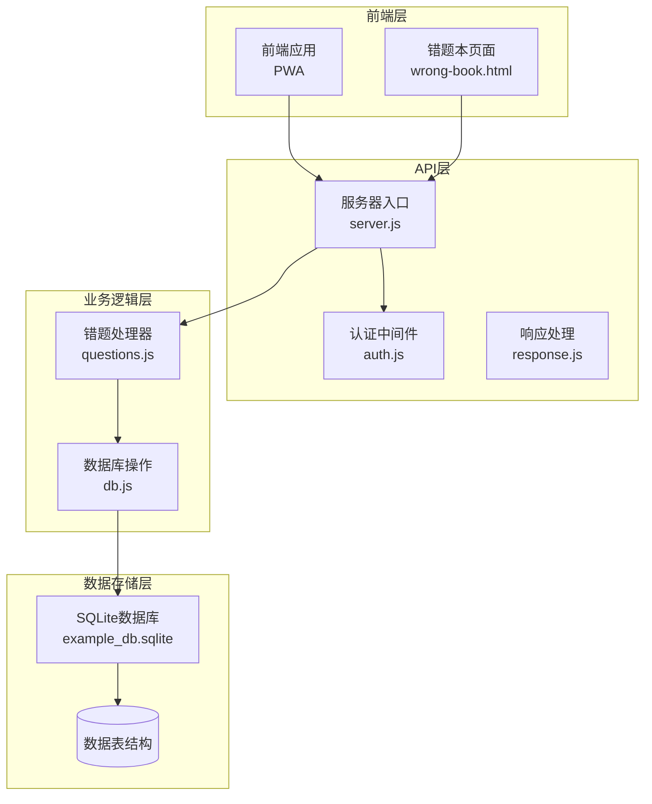
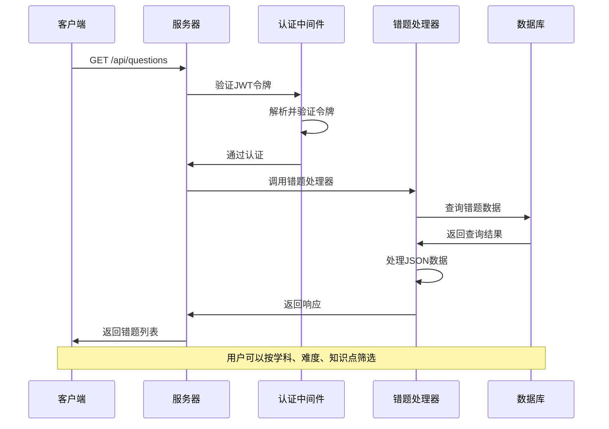
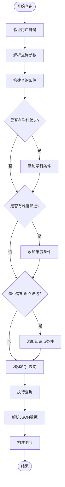
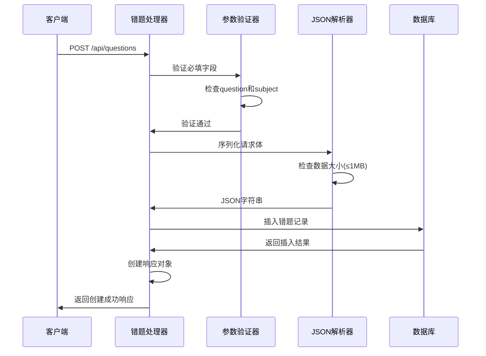
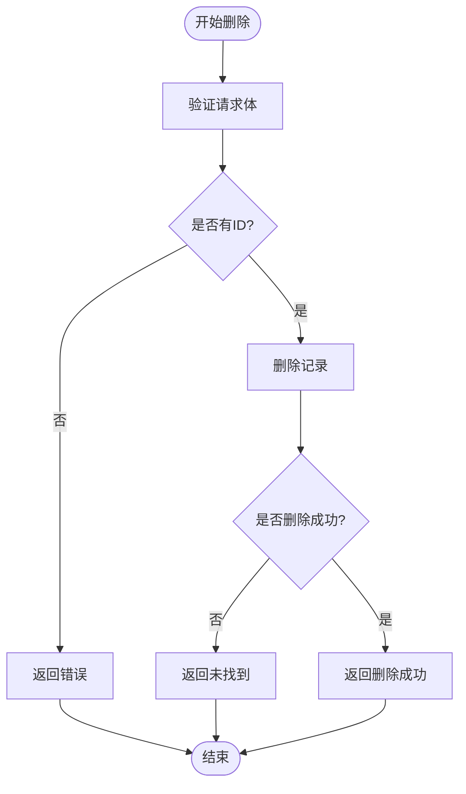
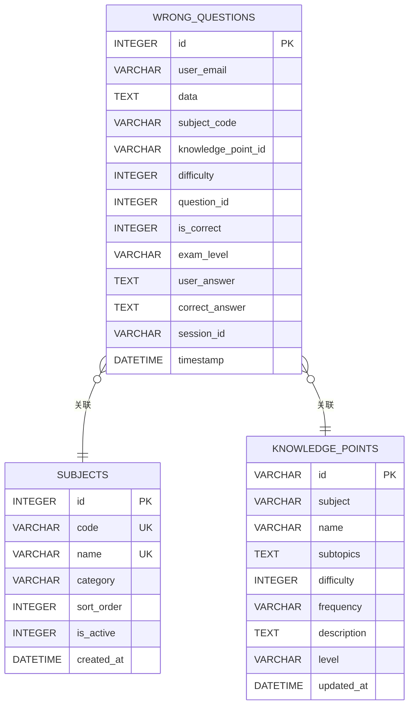
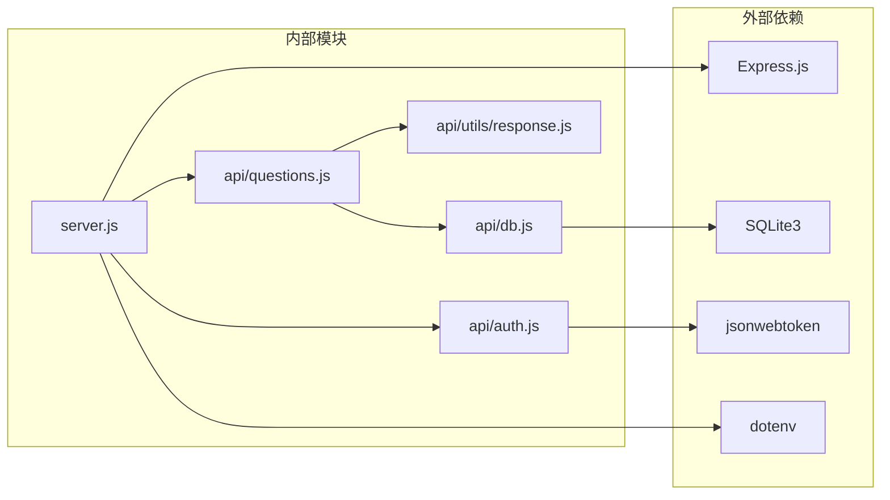

# 错题管理API

<cite>
**本文档引用的文件**
- [api/questions.js](file://api/questions.js)
- [api/db.js](file://api/db.js)
- [server.js](file://server.js)
- [api/utils/response.js](file://api/utils/response.js)
- [api/auth.js](file://api/auth.js)
- [frontend/wrong-book.html](file://frontend/wrong-book.html)
- [api/data/wrongQuestions.json](file://api/data/wrongQuestions.json)
</cite>

## 目录
1. [简介](#简介)
2. [项目结构](#项目结构)
3. [核心组件](#核心组件)
4. [架构概览](#架构概览)
5. [详细组件分析](#详细组件分析)
6. [依赖分析](#依赖分析)
7. [性能考虑](#性能考虑)
8. [故障排除指南](#故障排除指南)
9. [结论](#结论)

## 简介

AI家教项目的错题管理API是一个基于Express.js构建的RESTful服务，专门用于管理用户的错题记录。该API支持错题的增删改查操作，包括按学科、难度、知识点进行筛选查询，以及完整的分页查询功能。

该项目采用SQLite作为数据库存储，支持JSON格式的数据存储，并提供了完整的权限验证和安全防护机制。前端通过PWA应用提供错题本功能，用户可以通过拍照上传错题并进行智能讲解。

## 项目结构

AI家教项目采用模块化架构设计，主要分为以下几个核心部分：

**图表来源**
- [server.js:1-221](file://server.js#L1-L221)
- [api/questions.js:1-114](file://api/questions.js#L1-L114)
- [api/db.js:79-93](file://api/db.js#L79-L93)

**章节来源**
- [server.js:165](file://server.js#L165)
- [api/db.js:79-93](file://api/db.js#L79-L93)

## 核心组件

### 错题管理API核心功能

错题管理API提供以下核心功能：

1. **查询功能**：支持按学科、难度、知识点进行筛选查询
2. **添加功能**：支持新增错题记录
3. **删除功能**：支持删除指定错题
4. **分页查询**：支持分页和条件过滤
5. **JSON存储**：支持复杂数据结构的存储和解析

### 数据模型

错题数据采用JSON格式存储，支持以下字段结构：

| 字段名 | 类型 | 描述 | 约束条件 |
|--------|------|------|----------|
| question | Object/String | 题目内容 | 必填 |
| subject | String | 学科名称 | 必填，支持中文 |
| answer | Object/String | 用户答案 | 可选 |
| analysis | String | 题目分析 | 可选 |
| knowledge_point_id | String | 知识点ID | 可选 |
| difficulty | Integer | 难度等级 | 1-5 |
| question_id | Integer | 题目ID | 可选 |
| is_correct | Boolean | 是否正确 | 0/1 |
| exam_level | String | 考试级别 | 可选 |
| user_answer | String | 用户答案文本 | 可选 |
| correct_answer | String | 正确答案文本 | 可选 |
| session_id | String | 会话ID | 可选 |

**章节来源**
- [api/questions.js:75-94](file://api/questions.js#L75-L94)
- [api/db.js:79-93](file://api/db.js#L79-L93)

## 架构概览

错题管理API采用分层架构设计，确保了良好的可维护性和扩展性：

**图表来源**
- [server.js:165](file://server.js#L165)
- [api/auth.js:29-46](file://api/auth.js#L29-L46)
- [api/questions.js:16-73](file://api/questions.js#L16-L73)

### 权限验证机制

系统采用JWT（JSON Web Token）进行权限验证：

1. **令牌格式**：Bearer Token
2. **验证流程**：每次请求都需要在Authorization头中包含有效的JWT令牌
3. **过期处理**：支持令牌过期检测和错误处理
4. **安全措施**：包含XSS防护、CSRF保护等安全机制

**章节来源**
- [api/auth.js:29-46](file://api/auth.js#L29-L46)
- [server.js:49-54](file://server.js#L49-L54)

## 详细组件分析

### 错题处理器（questions.js）

错题处理器是API的核心组件，负责处理所有错题相关的操作：

#### GET查询接口

支持多种筛选条件的查询功能：

**图表来源**
- [api/questions.js:16-73](file://api/questions.js#L16-L73)

#### POST添加接口

支持错题的创建和存储：

**图表来源**
- [api/questions.js:75-94](file://api/questions.js#L75-L94)

#### DELETE删除接口

支持错题的删除操作：

**图表来源**
- [api/questions.js:96-110](file://api/questions.js#L96-L110)

**章节来源**
- [api/questions.js:12-114](file://api/questions.js#L12-L114)

### 数据库设计

系统使用SQLite作为数据存储，错题表结构设计如下：

**图表来源**
- [api/db.js:79-93](file://api/db.js#L79-L93)
- [api/db.js:128-138](file://api/db.js#L128-L138)

### 前端集成

前端错题本页面提供了完整的用户界面：

| 功能特性 | 实现方式 | 用户体验 |
|----------|----------|----------|
| 错题列表展示 | AJAX异步加载 | 实时更新错题列表 |
| 学科筛选 | 过滤按钮切换 | 一键切换学科视图 |
| 错题删除 | 确认对话框 | 安全删除操作 |
| AI讲解功能 | 重定向到讲解页面 | 智能题目解析 |
| 图片预览 | Lazy loading优化 | 流畅的图片加载 |

**章节来源**
- [frontend/wrong-book.html:70-140](file://frontend/wrong-book.html#L70-L140)

## 依赖分析

### 核心依赖关系

**图表来源**
- [server.js:1-35](file://server.js#L1-L35)
- [api/questions.js:1-3](file://api/questions.js#L1-L3)

### 数据流分析

错题管理API的数据流遵循标准的MVC模式：

1. **请求接收**：Express服务器接收HTTP请求
2. **中间件处理**：认证中间件验证用户身份
3. **业务逻辑**：错题处理器执行具体的业务操作
4. **数据访问**：数据库模块进行数据持久化
5. **响应生成**：统一的响应格式化工具生成标准响应

**章节来源**
- [server.js:115-124](file://server.js#L115-L124)
- [api/utils/response.js:17-32](file://api/utils/response.js#L17-L32)

## 性能考虑

### 查询优化

系统采用了多项性能优化策略：

1. **索引优化**：为常用查询字段建立数据库索引
2. **分页机制**：默认每页50条记录，最大200条
3. **条件过滤**：支持多维度条件筛选减少数据传输
4. **JSON解析缓存**：避免重复解析相同的JSON数据

### 内存管理

1. **连接池管理**：使用SQLite WAL模式提高并发性能
2. **内存限制**：单条错题数据大小限制为1MB
3. **垃圾回收**：及时释放不再使用的数据库连接

### 缓存策略

虽然当前版本没有实现应用层缓存，但系统具备良好的缓存扩展基础：

1. **数据库缓存**：SQLite内置缓存机制
2. **静态资源缓存**：前端资源文件缓存优化
3. **响应缓存**：可扩展的响应缓存机制

## 故障排除指南

### 常见错误及解决方案

| 错误类型 | 错误码 | 可能原因 | 解决方案 |
|----------|--------|----------|----------|
| 认证失败 | 401 | JWT令牌无效或过期 | 重新登录获取新令牌 |
| 请求参数错误 | 400 | 缺少必要参数 | 检查请求体格式和必填字段 |
| 数据过大 | 413 | 单条数据超过1MB | 分割大对象或优化数据结构 |
| 资源不存在 | 404 | 错题ID不存在或无权限 | 验证错题ID和用户权限 |
| 方法不允许 | 405 | 使用了不支持的HTTP方法 | 使用正确的HTTP方法 |

### 调试技巧

1. **日志记录**：启用详细的错误日志记录
2. **参数验证**：在开发环境中启用严格参数验证
3. **数据库监控**：监控慢查询和高负载情况
4. **性能分析**：定期分析API响应时间和数据库查询性能

**章节来源**
- [api/questions.js:77-84](file://api/questions.js#L77-L84)
- [api/auth.js:40-45](file://api/auth.js#L40-L45)

## 结论

AI家教项目的错题管理API是一个设计良好、功能完整的RESTful服务。它采用了现代化的架构设计，提供了完整的错题管理功能，包括增删改查、条件筛选、分页查询等核心功能。

### 主要优势

1. **架构清晰**：采用分层架构，职责分离明确
2. **安全性强**：完善的JWT认证和安全防护机制
3. **扩展性强**：模块化设计便于功能扩展
4. **用户体验好**：前后端分离，提供流畅的用户界面

### 技术特点

1. **数据存储**：采用SQLite + JSON的混合存储方案
2. **权限控制**：基于JWT的细粒度权限管理
3. **性能优化**：合理的索引设计和查询优化
4. **错误处理**：完善的错误处理和异常恢复机制

该API为AI家教项目提供了坚实的技术基础，能够有效支撑错题管理的各项业务需求，为用户提供优质的智能学习体验。