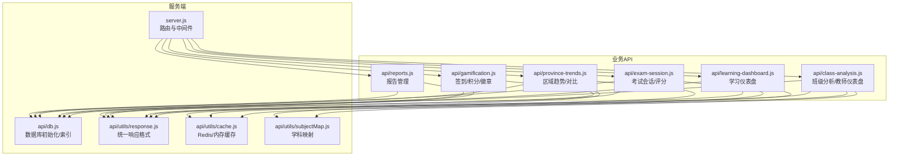
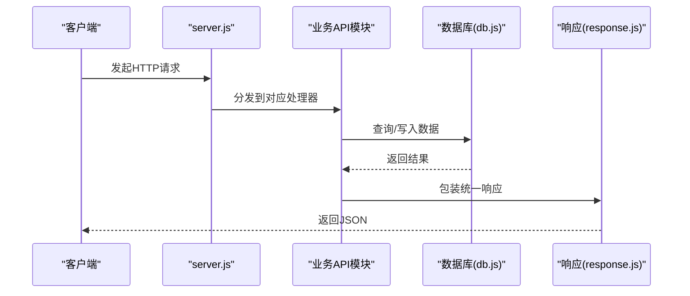
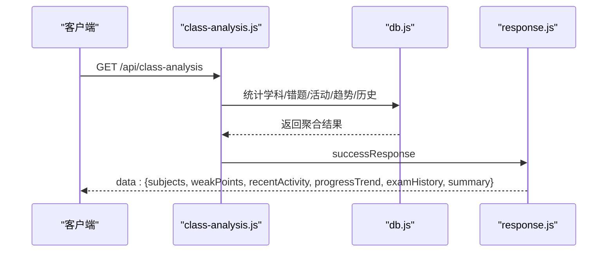
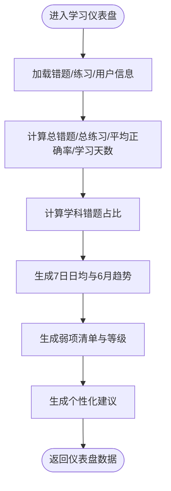
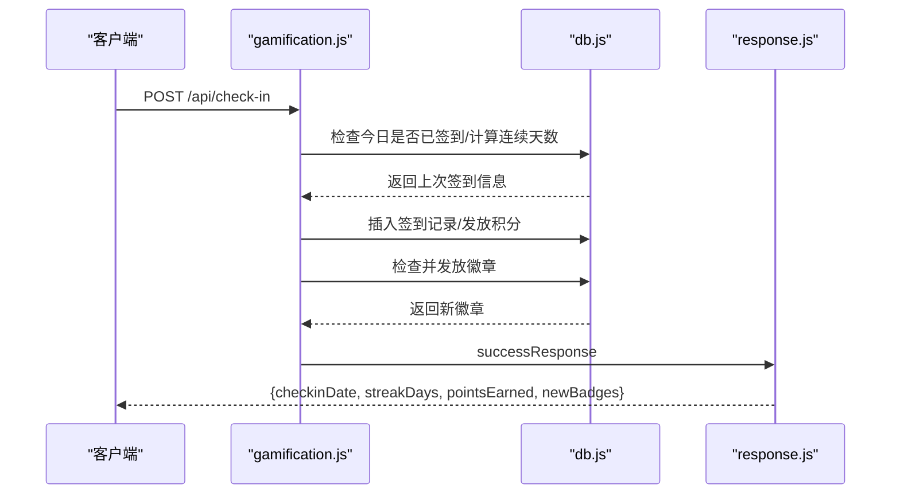
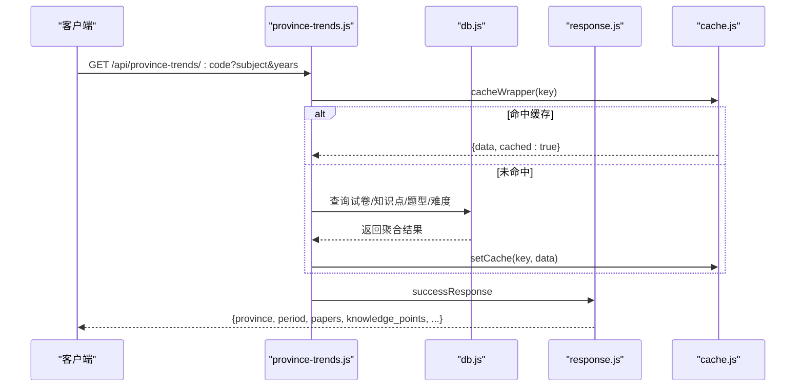
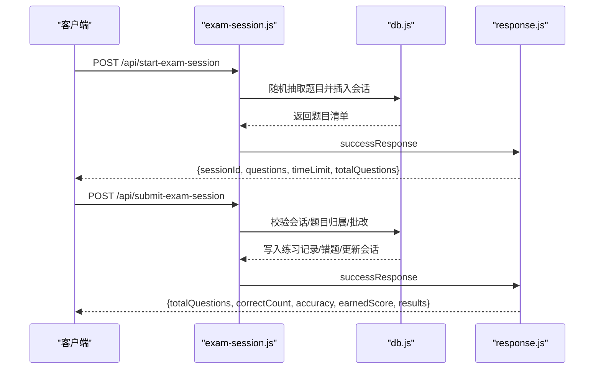
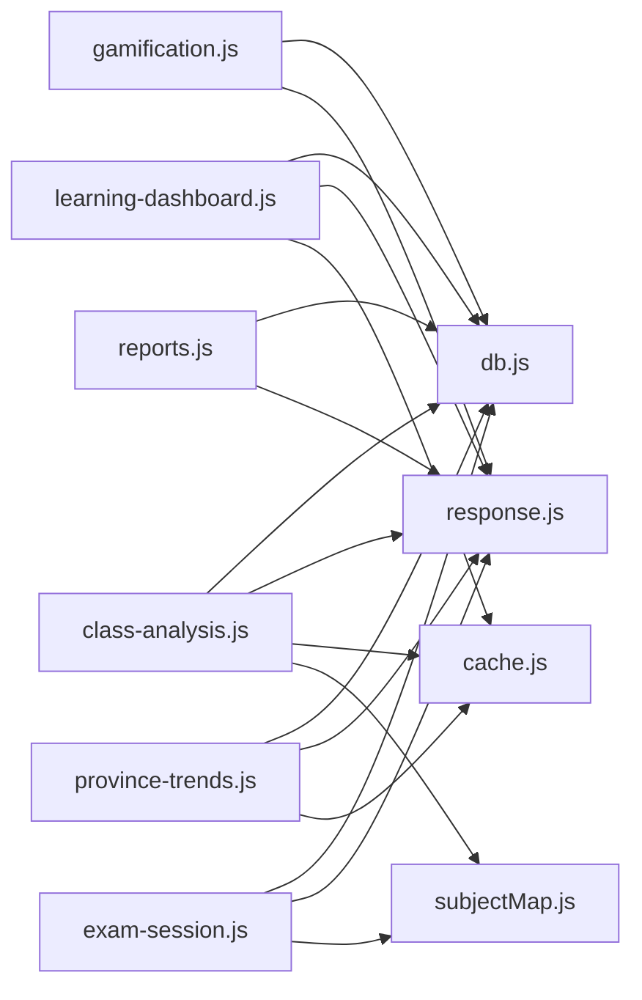

# 教学辅助API

<cite>
**本文引用的文件**
- [api/class-analysis.js](file://api/class-analysis.js)
- [api/gamification.js](file://api/gamification.js)
- [api/province-trends.js](file://api/province-trends.js)
- [api/learning-dashboard.js](file://api/learning-dashboard.js)
- [api/reports.js](file://api/reports.js)
- [api/db.js](file://api/db.js)
- [api/utils/response.js](file://api/utils/response.js)
- [api/utils/cache.js](file://api/utils/cache.js)
- [api/utils/subjectMap.js](file://api/utils/subjectMap.js)
- [api/exam-session.js](file://api/exam-session.js)
- [server.js](file://server.js)
</cite>

## 目录
1. [简介](#简介)
2. [项目结构](#项目结构)
3. [核心组件](#核心组件)
4. [架构总览](#架构总览)
5. [详细组件分析](#详细组件分析)
6. [依赖分析](#依赖分析)
7. [性能考虑](#性能考虑)
8. [故障排查指南](#故障排查指南)
9. [结论](#结论)
10. [附录](#附录)

## 简介
本文件为“AI家教”项目的教学辅助API提供系统化接口文档，覆盖班级分析、游戏化学习、区域趋势分析、教师仪表盘、学生成绩追踪、积分系统、教学策略分析、数据分析算法、可视化展示与个性化教学建议等核心能力。文档同时给出API接口规范、数据格式、集成方案与设计理念说明，帮助开发者与产品人员快速理解并高效集成。

## 项目结构
后端采用模块化API设计，围绕用户行为数据（错题、练习、考试）、知识图谱与区域数据，提供统一的REST接口。数据库采用SQLite，配合索引与缓存提升查询性能；响应格式统一，便于前端消费。

图表来源
- [server.js:115-159](file://server.js#L115-L159)
- [api/db.js:15-365](file://api/db.js#L15-L365)
- [api/utils/response.js:1-69](file://api/utils/response.js#L1-L69)
- [api/utils/cache.js:1-137](file://api/utils/cache.js#L1-L137)
- [api/utils/subjectMap.js:1-378](file://api/utils/subjectMap.js#L1-L378)
- [api/class-analysis.js:1-249](file://api/class-analysis.js#L1-L249)
- [api/learning-dashboard.js:1-186](file://api/learning-dashboard.js#L1-L186)
- [api/gamification.js:1-296](file://api/gamification.js#L1-L296)
- [api/province-trends.js:1-217](file://api/province-trends.js#L1-L217)
- [api/exam-session.js:1-313](file://api/exam-session.js#L1-L313)
- [api/reports.js:1-67](file://api/reports.js#L1-L67)

章节来源
- [server.js:115-159](file://server.js#L115-L159)
- [api/db.js:15-365](file://api/db.js#L15-L365)

## 核心组件
- 数据库与索引：统一初始化、外键启用、WAL模式、批量索引，确保查询性能与一致性。
- 统一响应：success/error/paginated/created/deleted统一格式，便于前后端一致处理。
- 缓存策略：Redis优先，降级内存缓存；支持TTL与批量清理。
- 学科映射：中英对照与关键词匹配，支撑弱项识别与教学建议。
- 业务模块：班级分析、学习仪表盘、游戏化、区域趋势、考试会话、报告管理。

章节来源
- [api/db.js:15-365](file://api/db.js#L15-L365)
- [api/utils/response.js:1-69](file://api/utils/response.js#L1-L69)
- [api/utils/cache.js:1-137](file://api/utils/cache.js#L1-L137)
- [api/utils/subjectMap.js:1-378](file://api/utils/subjectMap.js#L1-L378)

## 架构总览
系统通过server.js注册路由，各API模块负责具体业务逻辑，共享数据库连接与工具模块。关键流程包括：请求进入 -> 身份校验（由中间件保障）-> 业务处理 -> 数据库读写/聚合 -> 缓存命中/回源 -> 统一响应返回。

图表来源
- [server.js:115-159](file://server.js#L115-L159)
- [api/db.js:15-365](file://api/db.js#L15-L365)
- [api/utils/response.js:1-69](file://api/utils/response.js#L1-L69)

## 详细组件分析

### 班级分析与教师仪表盘
- 功能要点
  - 学生维度：按学科统计平均分、错题数、近期活动、知识点薄弱分布、30日错误趋势、最近10次考试历史。
  - 教师维度：全校/班级概览（总用户、当日活跃、题库/卷库总量）、学科分布、题目难度分布。
  - 班级详情：按学科/周期聚合学生表现、班级薄弱知识点、周趋势、分数段分布。
- 关键算法
  - 弱项识别：基于错题知识点频次排序，结合学科映射与难度权重。
  - 趋势分析：按日/周聚合错误数与参与人数，支持滚动窗口。
- 可视化建议
  - 折线图：30日错误趋势、周趋势。
  - 柱状图：学科平均分、分数段分布。
  - 饼图：学科错题占比、知识点分布。
- 接口清单
  - GET /api/class-analysis：学生学情分析
  - GET /api/teacher-dashboard：教师仪表盘
  - GET /api/class-detail：班级详情分析（支持subject、period参数）
- 数据模型与复杂度
  - 复杂查询涉及多表连接与GROUP BY，建议在学科、时间戳、知识点ID建立索引。
  - 聚合查询复杂度与数据量呈线性关系，缓存可显著降低重复查询成本。

图表来源
- [api/class-analysis.js:5-111](file://api/class-analysis.js#L5-L111)
- [api/db.js:15-365](file://api/db.js#L15-L365)
- [api/utils/response.js:1-69](file://api/utils/response.js#L1-L69)

章节来源
- [api/class-analysis.js:1-249](file://api/class-analysis.js#L1-L249)

### 学习仪表盘
- 功能要点
  - 用户画像：年级、加入日期。
  - 学习概览：总错题数、总练习数、平均正确率、学习天数。
  - 错题分布：按学科占比。
  - 日/月趋势：7日日均练习与正确率、近6月练习与正确题数。
  - 弱项清单：按错题数与正确率生成等级，输出个性化建议。
- 建议生成规则
  - 严重：错题≥5；高：错题≥3；中：错题≥1；预警：练习≥3且正确率<60%。
  - 输出针对性建议，如“集中复习薄弱知识点”、“加强某学科练习”等。
- 接口清单
  - GET /api/learning-dashboard：学习仪表盘数据

图表来源
- [api/learning-dashboard.js:5-186](file://api/learning-dashboard.js#L5-L186)

章节来源
- [api/learning-dashboard.js:1-186](file://api/learning-dashboard.js#L1-L186)

### 游戏化学习（签到/积分/徽章）
- 功能要点
  - 签到：每日打卡、连续天数奖励、防止重复签到。
  - 积分：签到、练习等行为产生积分，支持历史查询与累计统计。
  - 徽章：基于用户统计指标自动发放，支持进度展示。
- 规则与阈值
  - 连续签到奖励：每日+基础积分，连续天数叠加上限。
  - 徽章条件：登录天数、连续天数、错题数、练习次数、最高正确率、累计积分、覆盖学科数等。
- 接口清单
  - POST /api/check-in：每日签到
  - GET /api/check-in-status：当前签到状态
  - GET /api/points-history：积分历史与累计
  - GET /api/badges：徽章列表与进度

图表来源
- [api/gamification.js:21-81](file://api/gamification.js#L21-L81)
- [api/db.js:15-365](file://api/db.js#L15-L365)
- [api/utils/response.js:1-69](file://api/utils/response.js#L1-L69)

章节来源
- [api/gamification.js:1-296](file://api/gamification.js#L1-L296)

### 区域趋势分析
- 功能要点
  - 单省趋势：按年份聚合试卷、知识点、题型、难度分布，生成总结与建议。
  - 省份对比：多省横向对比（试卷数、题目数、平均难度等）。
  - 缓存：基于参数构建缓存键，避免重复计算。
- 接口清单
  - GET /api/province-trends/:code：单省趋势
  - GET /api/province-compare：多省对比

图表来源
- [api/province-trends.js:5-123](file://api/province-trends.js#L5-L123)
- [api/utils/cache.js:122-134](file://api/utils/cache.js#L122-L134)
- [api/db.js:15-365](file://api/db.js#L15-L365)
- [api/utils/response.js:1-69](file://api/utils/response.js#L1-L69)

章节来源
- [api/province-trends.js:1-217](file://api/province-trends.js#L1-L217)

### 考试会话与成绩追踪
- 功能要点
  - 创建会话：按学科/地区/年份随机抽取题目，生成sessionId。
  - 提交答案：校验题目归属、批改、写入练习记录与错题表、更新会话状态与积分。
  - 历史查询：分页获取用户考试历史。
- 数据流
  - 会话创建 → 题目装载 → 答案提交 → 批改与记录 → 结果返回。
- 接口清单
  - POST /api/start-exam-session：开始考试
  - POST /api/submit-exam-session：提交答案
  - GET /api/exam-history：考试历史

图表来源
- [api/exam-session.js:17-94](file://api/exam-session.js#L17-L94)
- [api/exam-session.js:96-278](file://api/exam-session.js#L96-L278)
- [api/db.js:15-365](file://api/db.js#L15-L365)
- [api/utils/response.js:1-69](file://api/utils/response.js#L1-L69)

章节来源
- [api/exam-session.js:1-313](file://api/exam-session.js#L1-L313)

### 报告管理
- 功能要点
  - 列表：获取用户报告，合并相似题目。
  - 新增：保存报告与相似题目。
  - 删除：删除指定报告。
- 接口清单
  - GET/POST/DELETE /api/reports：报告管理

章节来源
- [api/reports.js:1-67](file://api/reports.js#L1-L67)

## 依赖分析
- 组件耦合
  - 各API模块强依赖db.js提供的连接与表结构；弱依赖utils模块（response、cache、subjectMap）。
  - 缓存与数据库查询存在直接耦合，需关注缓存失效策略。
- 外部依赖
  - Redis（可选）：用于高性能缓存；不可用时自动降级至内存缓存。
  - SQLite：本地轻量数据库，适合中小规模部署。
- 潜在风险
  - 大查询未命中索引可能导致慢查询；应持续监控并补充索引。
  - 缓存穿透：对不存在数据应设置空值缓存或短TTL。

图表来源
- [api/class-analysis.js:1-249](file://api/class-analysis.js#L1-L249)
- [api/learning-dashboard.js:1-186](file://api/learning-dashboard.js#L1-L186)
- [api/gamification.js:1-296](file://api/gamification.js#L1-L296)
- [api/province-trends.js:1-217](file://api/province-trends.js#L1-L217)
- [api/exam-session.js:1-313](file://api/exam-session.js#L1-L313)
- [api/reports.js:1-67](file://api/reports.js#L1-L67)
- [api/db.js:15-365](file://api/db.js#L15-L365)
- [api/utils/response.js:1-69](file://api/utils/response.js#L1-L69)
- [api/utils/cache.js:1-137](file://api/utils/cache.js#L1-L137)
- [api/utils/subjectMap.js:1-378](file://api/utils/subjectMap.js#L1-L378)

## 性能考虑
- 索引优化
  - 已建立大量复合与单列索引，建议持续观察慢查询日志，针对高频过滤字段（学科、时间、用户邮箱、知识点ID）评估是否需要额外索引。
- 缓存策略
  - 使用cacheWrapper封装缓存，合理设置TTL；对热点数据（趋势、仪表盘）采用长TTL，对动态数据（实时签到、最新报告）采用短TTL。
  - 缓存键包含关键参数，避免误命中。
- 数据库配置
  - WAL模式与busy_timeout提升并发与稳定性；foreign_keys开启保证参照完整性。
- 前端集成建议
  - 对高频接口开启浏览器缓存与CDN加速；对大数据量接口采用分页与懒加载。

## 故障排查指南
- 常见错误与定位
  - 数据库连接失败：检查db.js初始化与路径配置。
  - 缓存不可用：确认Redis连接参数与网络可达性，系统会自动降级。
  - 响应格式异常：统一使用response.js提供的success/error包装，避免手动拼装。
  - 权限不足：确保请求携带有效身份信息（由中间件保障）。
- 排查步骤
  - 查看服务端日志中的错误堆栈与SQL执行情况。
  - 使用缓存工具清理特定键，验证缓存一致性。
  - 对慢查询接口添加LIMIT与索引，评估是否需要分页或预聚合。

章节来源
- [api/utils/response.js:1-69](file://api/utils/response.js#L1-L69)
- [api/utils/cache.js:1-137](file://api/utils/cache.js#L1-L137)
- [api/db.js:15-365](file://api/db.js#L15-L365)

## 结论
本教学辅助API以统一的数据模型与响应格式为基础，围绕“学情分析—个性化建议—游戏化激励—区域洞察”的闭环，提供可扩展的教学辅助能力。通过合理的索引、缓存与分页策略，可在中小规模场景下实现稳定高效的运行。建议在生产环境中持续监控性能与缓存命中率，并根据业务增长逐步引入更完善的缓存与分库策略。

## 附录
- API接口规范（示例）
  - GET /api/class-analysis
    - 请求参数：无
    - 返回字段：subjects、weakPoints、recentActivity、progressTrend、examHistory、summary
  - GET /api/teacher-dashboard
    - 请求参数：无
    - 返回字段：overview、subjectStats、difficultyDistribution
  - GET /api/class-detail?subject=&period=
    - 请求参数：subject（可选）、period（7-365，默认30）
    - 返回字段：studentPerformance、classWeakPoints、weeklyTrend、scoreDistribution、period、subject
  - GET /api/learning-dashboard
    - 请求参数：无
    - 返回字段：user、overview、subject_distribution、daily_practice、monthly_trend、weak_points、suggestions
  - POST /api/check-in
    - 请求参数：无
    - 返回字段：checkinDate、streakDays、pointsEarned、newBadges
  - GET /api/check-in-status
    - 请求参数：无
    - 返回字段：todayCheckedIn、currentStreak、totalCheckins、recentCheckins
  - GET /api/points-history?limit=&offset=
    - 请求参数：limit（默认30）、offset（默认0）
    - 返回字段：totalPoints、history
  - GET /api/badges
    - 请求参数：无
    - 返回字段：totalBadges、earnedCount、badges
  - GET /api/province-trends/:code?subject=&years=&start_year=&end_year=
    - 请求参数：subject（可选）、years（默认5）、start_year/end_year（可选）
    - 返回字段：province、period、papers、knowledge_points、question_types、difficulty_distribution、top_knowledge_points、summary、cached
  - GET /api/province-compare?codes=&subject=&years=
    - 请求参数：codes（逗号分隔）、subject（可选）、years（默认5）
    - 返回字段：多省对比聚合结果
  - POST /api/start-exam-session
    - 请求参数：subject、province_code（可选）、year（可选）、time_limit（10-300，默认120）、question_count（1-100，默认20）
    - 返回字段：sessionId、questions、timeLimit、totalQuestions、subject、province_code
  - POST /api/submit-exam-session
    - 请求参数：sessionId、answers（数组，每项含questionId与answer）
    - 返回字段：totalQuestions、correctCount、accuracy、earnedScore、totalScore、results
  - GET /api/exam-history?limit=&offset=
    - 请求参数：limit（1-100，默认20）、offset（≥0，默认0）
    - 返回字段：sessions、total
  - GET/POST/DELETE /api/reports
    - 请求参数：GET无、POST含report数据与similarQuestions、DELETE含id
    - 返回字段：列表/创建/删除统一响应