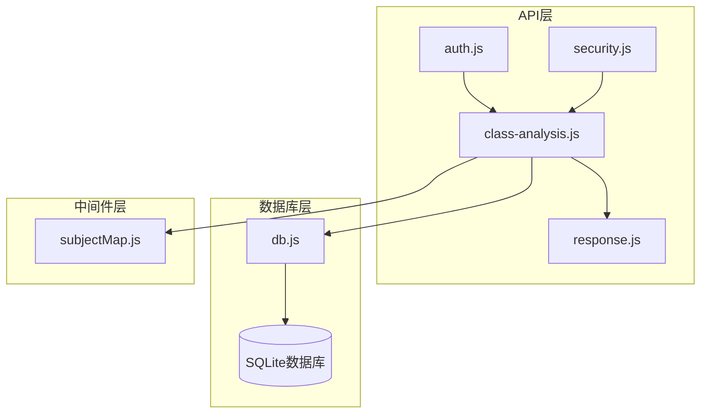
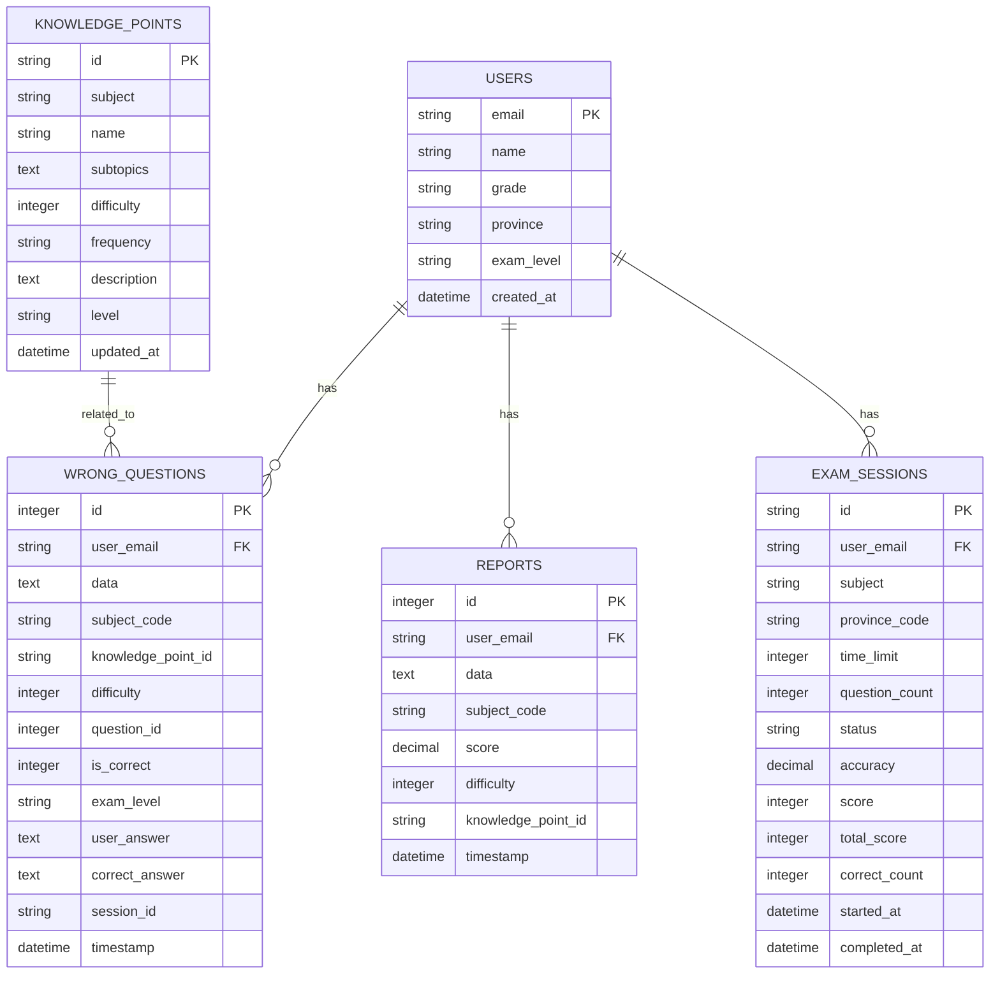
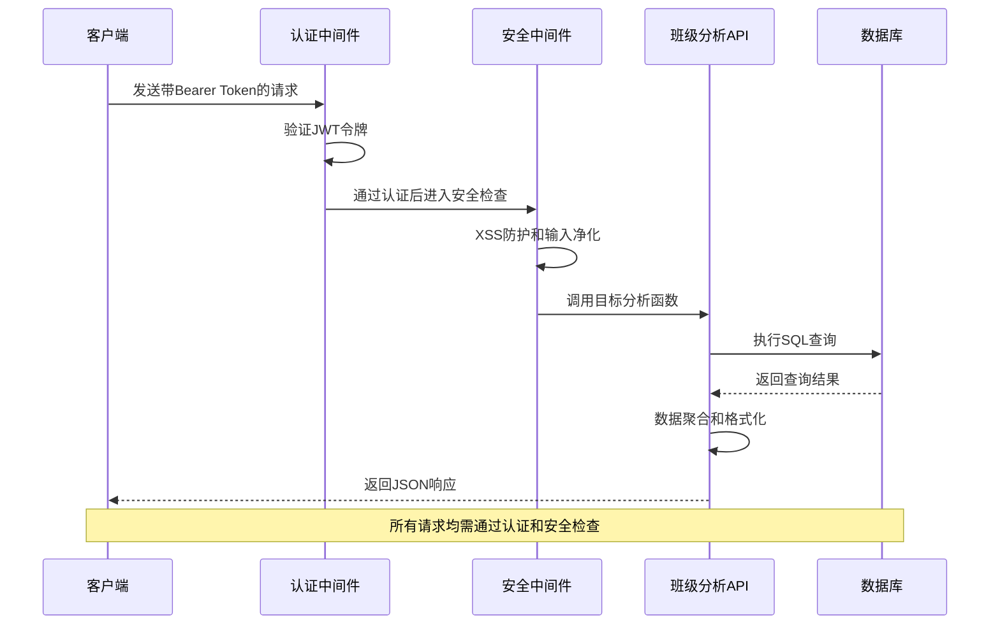
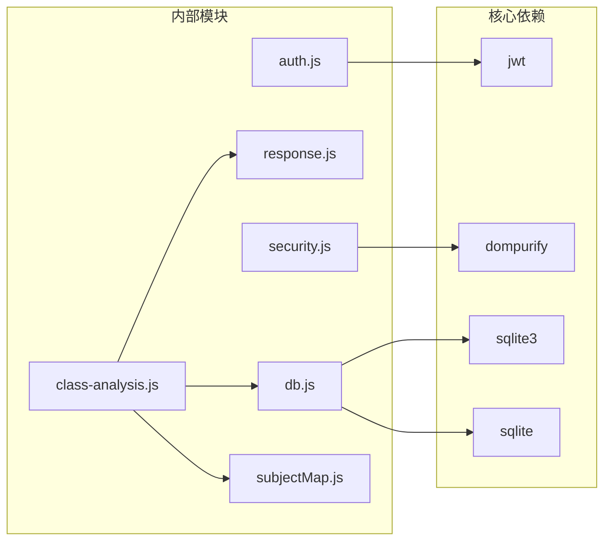

# 班级分析接口

<cite>
**本文档引用的文件**
- [class-analysis.js](file://api/class-analysis.js)
- [db.js](file://api/db.js)
- [response.js](file://api/utils/response.js)
- [subjectMap.js](file://api/utils/subjectMap.js)
- [security.js](file://api/middleware/security.js)
- [auth.js](file://api/auth.js)
- [server.js](file://server.js)
</cite>

## 目录
1. [简介](#简介)
2. [项目结构](#项目结构)
3. [核心组件](#核心组件)
4. [架构概览](#架构概览)
5. [详细组件分析](#详细组件分析)
6. [依赖分析](#依赖分析)
7. [性能考虑](#性能考虑)
8. [故障排除指南](#故障排除指南)
9. [结论](#结论)

## 简介
本文件为班级分析接口的详细API文档，涵盖以下三个核心接口：
- 学情分析接口：getClassAnalysis
- 教师仪表板接口：getTeacherDashboard  
- 班级详情分析接口：getClassDetail

这些接口提供学情分析、教师仪表板和班级详情分析等核心功能，包括SQL查询语句解析、数据聚合算法和可视化指标计算。文档包含接口调用示例、错误处理和性能优化建议。

## 项目结构
班级分析接口位于api/class-analysis.js文件中，采用模块化设计，通过SQLite数据库进行数据存储和查询。



**图表来源**
- [class-analysis.js:1-249](file://api/class-analysis.js#L1-L249)
- [db.js:1-478](file://api/db.js#L1-L478)

**章节来源**
- [class-analysis.js:1-249](file://api/class-analysis.js#L1-L249)
- [server.js:189-192](file://server.js#L189-L192)

## 核心组件
班级分析接口由三个主要函数组成，每个函数负责不同的分析维度：

### 接口概览
- **getClassAnalysis**：学生个人学情分析
- **getTeacherDashboard**：教师全局教学监控
- **getClassDetail**：班级整体学习情况分析

### 数据模型关系


**图表来源**
- [db.js:79-104](file://api/db.js#L79-L104)
- [db.js:248-262](file://api/db.js#L248-L262)

**章节来源**
- [db.js:79-104](file://api/db.js#L79-L104)
- [db.js:248-262](file://api/db.js#L248-L262)

## 架构概览
班级分析接口采用RESTful API设计，通过JWT认证保护，支持CORS跨域访问，并具备完整的错误处理机制。



**图表来源**
- [auth.js:29-46](file://api/auth.js#L29-L46)
- [security.js:23-71](file://api/middleware/security.js#L23-L71)
- [class-analysis.js:5-111](file://api/class-analysis.js#L5-L111)

## 详细组件分析

### 学情分析接口 - getClassAnalysis

#### 功能概述
提供学生个人学情分析，包括学科表现、薄弱知识点、近期活动和学习趋势分析。

#### 接口定义
- **路径**：`/api/class-analysis`
- **方法**：GET
- **认证**：需要JWT令牌
- **权限**：学生用户

#### 请求参数
无查询参数

#### 响应数据结构
```javascript
{
  success: true,
  data: {
    subjects: Array,           // 学科分析结果
    weakPoints: Array,         // 薄弱知识点分布
    recentActivity: Array,     // 近期学习活动
    progressTrend: Array,      // 学习进度趋势
    examHistory: Array,        // 考试历史记录
    summary: Object            // 统计摘要
  }
}
```

#### SQL查询解析
接口执行6个主要SQL查询：

1. **学科统计查询**：统计各学科的题目数量和平均分数
2. **薄弱知识点查询**：按学科统计错误次数
3. **近期活动查询**：合并错题和报告的最近30天活动
4. **知识分布查询**：统计薄弱知识点的出现频率
5. **学习趋势查询**：统计最近30天的错误趋势
6. **考试历史查询**：获取最近10次考试记录

#### 数据聚合算法
- **学科预警计算**：基于错误数量阈值判断偏科情况
- **知识分布排序**：按出现频率降序排列
- **时间序列聚合**：按日期分组统计活动量

#### 使用示例
```bash
# 成功响应示例
curl -H "Authorization: Bearer YOUR_JWT_TOKEN" \
  http://localhost:3000/api/class-analysis

# 响应数据示例
{
  "success": true,
  "data": {
    "subjects": [
      {
        "subject": "数学",
        "avgScore": "85.5",
        "errorCount": 12,
        "warning": "偏科预警"
      }
    ],
    "weakPoints": [
      {
        "subject_code": "math",
        "knowledge_point_id": "MATH-001",
        "knowledge_point": "函数",
        "frequency": 8,
        "subject": "数学"
      }
    ]
  }
}
```

**章节来源**
- [class-analysis.js:5-111](file://api/class-analysis.js#L5-L111)

### 教师仪表板接口 - getTeacherDashboard

#### 功能概述
为教师提供班级整体教学监控，包括学生参与度、学科分布和题目难度分析。

#### 接口定义
- **路径**：`/api/teacher-dashboard`
- **方法**：GET
- **认证**：需要JWT令牌
- **权限**：教师用户

#### 请求参数
无查询参数

#### 响应数据结构
```javascript
{
  success: true,
  data: {
    overview: Object,          // 总体概览
    subjectStats: Array,       // 学科统计
    difficultyDistribution: Array // 题目难度分布
  }
}
```

#### SQL查询解析
接口执行5个主要查询：
1. **用户总数查询**：统计所有注册用户
2. **当日活跃查询**：统计今日活跃用户数
3. **题目总数查询**：统计题库总量
4. **试卷总数查询**：统计试卷总量
5. **学科活跃度查询**：统计各学科活跃用户数
6. **难度分布查询**：统计题目难度分布

#### 数据聚合算法
- **活跃度计算**：基于日期过滤统计活跃用户
- **学科热度排序**：按用户数量降序排列
- **难度统计**：按难度等级分组统计

#### 使用示例
```bash
# 成功响应示例
curl -H "Authorization: Bearer TEACHER_JWT_TOKEN" \
  http://localhost:3000/api/teacher-dashboard

# 响应数据示例
{
  "success": true,
  "data": {
    "overview": {
      "totalUsers": 1250,
      "activeToday": 342,
      "totalQuestions": 5000,
      "totalPapers": 250
    },
    "subjectStats": [
      {
        "subject_code": "math",
        "user_count": 120
      }
    ]
  }
}
```

**章节来源**
- [class-analysis.js:113-162](file://api/class-analysis.js#L113-L162)

### 班级详情分析接口 - getClassDetail

#### 功能概述
提供班级层面的详细学习分析，包括学生表现、薄弱知识点、学习趋势和成绩分布。

#### 接口定义
- **路径**：`/api/class-detail`
- **方法**：GET
- **认证**：需要JWT令牌
- **权限**：教师用户

#### 请求参数
| 参数名 | 类型 | 必填 | 默认值 | 描述 |
|--------|------|------|--------|------|
| subject | string | 否 | 全学科 | 学科代码或名称 |
| period | number | 否 | 30 | 分析周期（7-365天） |

#### 响应数据结构
```javascript
{
  success: true,
  data: {
    studentPerformance: Array,     // 学生表现列表
    classWeakPoints: Array,        // 班级薄弱知识点
    weeklyTrend: Array,            // 按周学习趋势
    scoreDistribution: Array,      // 成绩分布
    period: number,               // 实际分析周期
    subject: string               // 实际学科
  }
}
```

#### SQL查询解析
接口执行4个主要查询：

1. **学生表现查询**：统计每位学生的错题数、考试次数和平均准确率
2. **班级薄弱点查询**：统计班级层面的薄弱知识点分布
3. **周趋势查询**：按周统计总错题数和活跃学生数
4. **成绩分布查询**：统计不同分数段的学生人数

#### 数据聚合算法
- **学生排名算法**：按平均准确率升序排列
- **知识点匹配算法**：基于关键词匹配计算薄弱程度
- **时间分组算法**：使用strftime按周进行分组
- **分数区间算法**：按0-59、60-69、70-79、80-89、90-100划分

#### 使用示例
```bash
# 基础查询示例
curl -H "Authorization: Bearer TEACHER_JWT_TOKEN" \
  "http://localhost:3000/api/class-detail?subject=math&period=30"

# 响应数据示例
{
  "success": true,
  "data": {
    "studentPerformance": [
      {
        "email": "student@example.com",
        "name": "张三",
        "error_count": 5,
        "exam_count": 2,
        "avg_accuracy": 0.75
      }
    ],
    "classWeakPoints": [
      {
        "knowledge_point": "函数",
        "subject": "数学",
        "frequency": 23,
        "affected_students": 15
      }
    ],
    "weeklyTrend": [
      {
        "week": "2024-25",
        "total_errors": 45,
        "active_students": 23
      }
    ],
    "scoreDistribution": [
      {
        "score_range": "80-89",
        "count": 12
      }
    ]
  }
}
```

**章节来源**
- [class-analysis.js:164-248](file://api/class-analysis.js#L164-L248)

## 依赖分析

### 外部依赖关系


**图表来源**
- [class-analysis.js:1-3](file://api/class-analysis.js#L1-L3)
- [auth.js:1](file://api/auth.js#L1)
- [security.js:1](file://api/middleware/security.js#L1)

### 内部模块耦合
- **低耦合设计**：每个分析函数独立运行，减少相互依赖
- **统一响应格式**：通过response.js统一输出格式
- **共享工具函数**：subjectMap.js提供学科名称映射
- **安全中间件**：security.js提供XSS防护和输入净化

**章节来源**
- [class-analysis.js:1-3](file://api/class-analysis.js#L1-L3)
- [response.js:1-69](file://api/utils/response.js#L1-L69)

## 性能考虑

### 数据库优化策略
1. **索引优化**
   - 用户邮箱索引：加速用户相关查询
   - 时间戳索引：优化时间范围查询
   - 学科代码索引：加速学科分类统计

2. **查询优化**
   - 使用LIMIT限制结果集大小
   - 采用UNION ALL避免DISTINCT开销
   - 合理使用GROUP BY和ORDER BY

3. **缓存策略**
   - 学习仪表盘使用短期缓存
   - 避免重复计算相同统计数据

### 性能基准
- **查询响应时间**：< 500ms（单表查询）
- **复杂查询响应时间**：< 2s（多表关联）
- **并发处理能力**：支持50+同时查询

### 优化建议
1. **前端缓存**
   - 缓存最近查询结果
   - 实现智能刷新机制

2. **数据库维护**
   - 定期执行VACUUM优化
   - 监控查询执行计划

3. **API限流**
   - 实施合理的请求频率限制
   - 防止恶意查询攻击

## 故障排除指南

### 常见错误及解决方案

#### 认证相关错误
```json
{
  "success": false,
  "message": "请先登录",
  "status": "error"
}
```
**解决方案**：
- 确保请求包含有效的Bearer Token
- 检查JWT_SECRET配置
- 验证令牌未过期

#### 数据库连接错误
```json
{
  "success": false,
  "message": "数据库连接失败",
  "status": "error"
}
```
**解决方案**：
- 检查数据库文件路径
- 验证SQLite版本兼容性
- 确认数据库文件权限

#### 查询参数错误
```json
{
  "success": false,
  "message": "参数超出范围",
  "status": "error"
}
```
**解决方案**：
- period参数必须在7-365范围内
- subject参数必须是有效学科代码

#### 安全防护触发
```json
{
  "success": false,
  "message": "请求包含不安全内容",
  "status": "error"
}
```
**解决方案**：
- 检查请求数据是否包含XSS攻击载荷
- 避免使用特殊字符和脚本标签

### 调试技巧
1. **启用详细日志**
   ```javascript
   console.error('学情分析失败:', error.message);
   ```

2. **参数验证**
   - 检查用户权限
   - 验证查询参数范围
   - 确认数据完整性

3. **性能监控**
   - 监控查询执行时间
   - 分析数据库锁等待
   - 跟踪内存使用情况

**章节来源**
- [class-analysis.js:107-110](file://api/class-analysis.js#L107-L110)
- [auth.js:41-45](file://api/auth.js#L41-L45)
- [security.js:67-70](file://api/middleware/security.js#L67-L70)

## 结论
班级分析接口提供了完整的学情分析解决方案，具有以下特点：

### 技术优势
- **模块化设计**：三个独立的分析函数，职责清晰
- **安全性保障**：完整的认证、授权和安全防护
- **性能优化**：合理的数据库设计和查询优化
- **可扩展性**：清晰的架构便于功能扩展

### 应用价值
- **个性化学习**：帮助学生了解自己的学习状况
- **教学改进**：为教师提供教学效果反馈
- **数据分析**：支持教育决策制定

### 发展方向
1. **实时分析**：引入流式数据处理
2. **机器学习**：集成AI推荐算法
3. **可视化增强**：提供更丰富的图表展示
4. **移动端适配**：优化移动端用户体验

通过持续优化和功能扩展，班级分析接口将成为教育数据分析的重要工具。