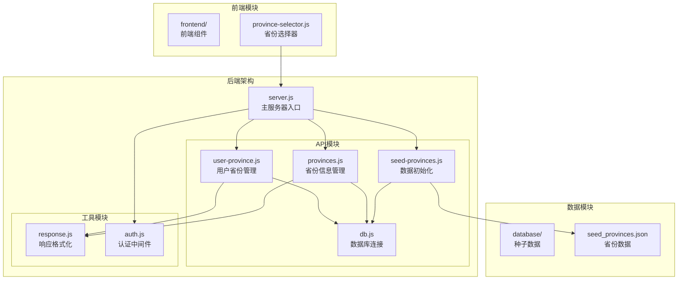
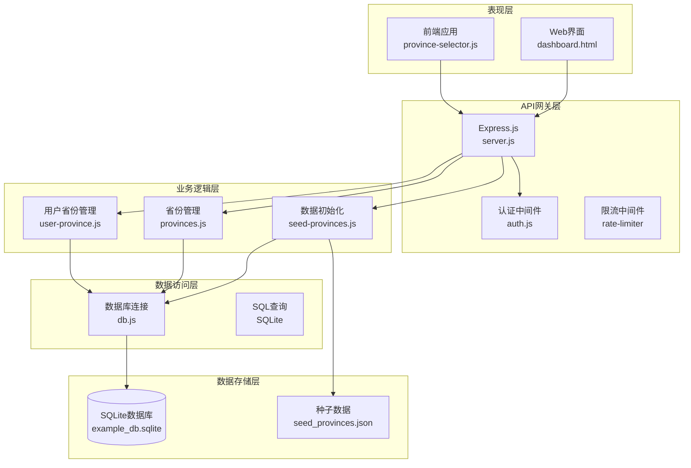
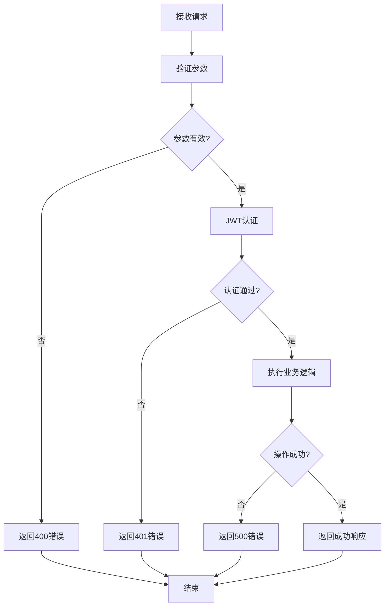
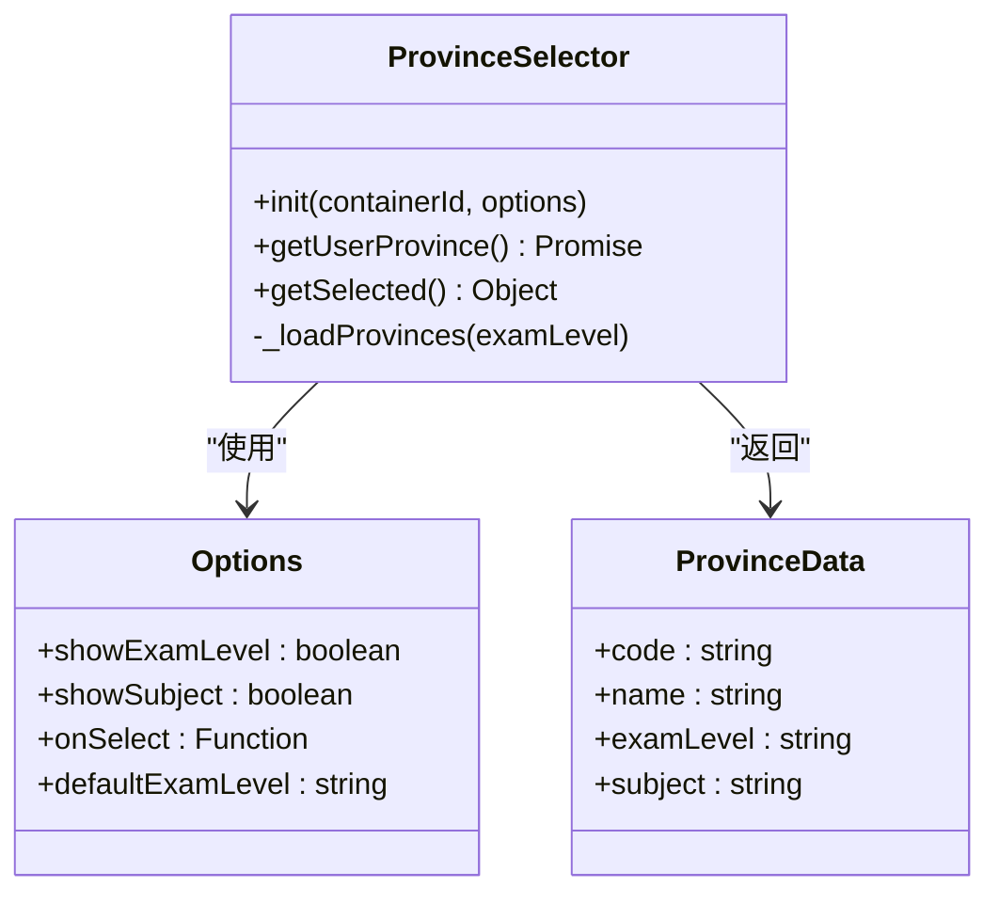
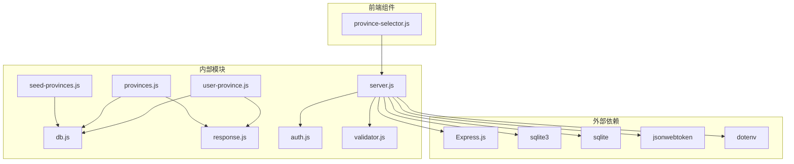
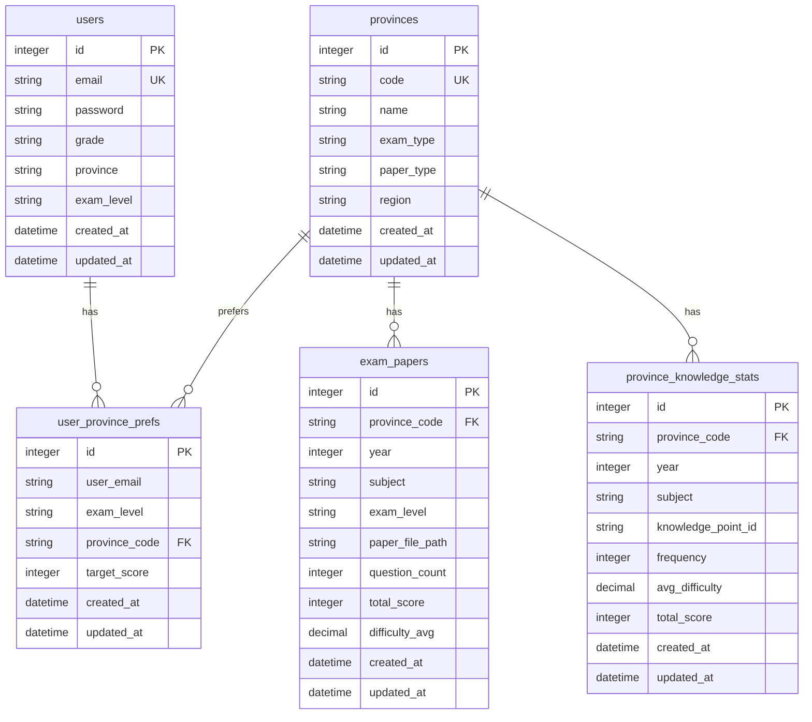

# 用户管理API

<cite>
**本文档引用的文件**
- [server.js](file://server.js)
- [user-province.js](file://api/user-province.js)
- [provinces.js](file://api/provinces.js)
- [seed-provinces.js](file://api/seed-provinces.js)
- [db.js](file://api/db.js)
- [response.js](file://api/utils/response.js)
- [province-selector.js](file://frontend/province-selector.js)
- [seed_provinces.json](file://database/seed_provinces.json)
</cite>

## 目录
1. [简介](#简介)
2. [项目结构](#项目结构)
3. [核心组件](#核心组件)
4. [架构概览](#架构概览)
5. [详细组件分析](#详细组件分析)
6. [依赖关系分析](#依赖关系分析)
7. [性能考虑](#性能考虑)
8. [故障排除指南](#故障排除指南)
9. [结论](#结论)

## 简介

AI家教项目的用户管理API提供了完整的用户地区偏好管理功能，包括用户省份设置、地区信息管理和数据初始化等核心功能。该系统支持高考和中考两种考试类型的地区选择，实现了用户偏好设置、地区差异化配置和数据同步机制。

系统采用Express.js框架构建，使用SQLite数据库存储用户信息和省份数据，通过JWT进行身份认证，提供RESTful API接口供前端应用调用。

## 项目结构

AI家教项目采用模块化架构设计，用户管理API位于`api/`目录下，包含以下关键文件：



**图表来源**
- [server.js:1-221](file://server.js#L1-L221)
- [user-province.js:1-120](file://api/user-province.js#L1-L120)
- [provinces.js:1-166](file://api/provinces.js#L1-L166)

**章节来源**
- [server.js:1-221](file://server.js#L1-L221)
- [user-province.js:1-120](file://api/user-province.js#L1-L120)
- [provinces.js:1-166](file://api/provinces.js#L1-L166)

## 核心组件

### 用户省份管理模块

用户省份管理模块是整个用户管理API的核心，负责处理用户的地区偏好设置和查询。该模块提供了三个主要接口：

1. **获取用户省份偏好** - 查询用户当前设置的地区偏好
2. **设置用户省份偏好** - 更新用户的地区偏好设置
3. **删除用户省份偏好** - 移除用户的特定考试类型的地区偏好

### 省份信息管理模块

省份信息管理模块提供省份数据的查询和统计功能，支持按考试类型和地区过滤，以及详细的省份统计数据查询。

### 数据初始化模块

数据初始化模块负责将种子数据导入到数据库中，确保系统启动时具备完整的省份数据。

**章节来源**
- [user-province.js:1-120](file://api/user-province.js#L1-L120)
- [provinces.js:1-166](file://api/provinces.js#L1-L166)
- [seed-provinces.js:1-40](file://api/seed-provinces.js#L1-L40)

## 架构概览

系统采用分层架构设计，从上到下分为表现层、业务逻辑层、数据访问层和数据存储层：



**图表来源**
- [server.js:141-179](file://server.js#L141-L179)
- [user-province.js:8-93](file://api/user-province.js#L8-L93)
- [provinces.js:4-40](file://api/provinces.js#L4-L40)

## 详细组件分析

### 用户省份管理API

#### 接口定义

系统提供三个核心的用户省份管理接口：

##### 1. 获取用户省份偏好

**HTTP方法**: GET  
**端点**: `/api/user-province`  
**认证**: 需要JWT令牌  
**功能**: 返回当前用户的所有地区偏好设置

**请求参数**:
- 无查询参数

**响应格式**:
```javascript
{
  "success": true,
  "data": [
    {
      "id": 1,
      "user_email": "user@example.com",
      "exam_level": "gaokao",
      "province_code": "beijing",
      "target_score": 650,
      "created_at": "2024-01-01T00:00:00Z",
      "updated_at": "2024-01-01T00:00:00Z",
      "province_name": "北京",
      "paper_type": "independent",
      "region": "north"
    }
  ]
}
```

**业务逻辑**:
1. 验证用户身份（JWT认证）
2. 查询用户在所有考试类型下的省份偏好
3. 左连接省份表获取省份详细信息
4. 按考试类型排序返回结果

##### 2. 设置用户省份偏好

**HTTP方法**: POST  
**端点**: `/api/user-province`  
**认证**: 需要JWT令牌  
**功能**: 创建或更新用户的地区偏好设置

**请求参数**:
```javascript
{
  "exam_level": "gaokao",      // 必需：考试类型（gaokao或zhongkao）
  "province_code": "beijing",   // 必需：省份代码
  "target_score": 650         // 可选：目标分数
}
```

**响应格式**:
```javascript
{
  "success": true,
  "data": {
    "id": 1,
    "user_email": "user@example.com",
    "exam_level": "gaokao",
    "province_code": "beijing",
    "target_score": 650,
    "created_at": "2024-01-01T00:00:00Z",
    "updated_at": "2024-01-01T00:00:00Z"
  }
}
```

**业务逻辑**:
1. 验证用户身份和必需参数
2. 验证省份是否存在
3. 使用UPSERT操作插入或更新偏好设置
4. 同步更新用户表中的省份和考试类型信息
5. 返回更新后的偏好设置

##### 3. 删除用户省份偏好

**HTTP方法**: DELETE  
**端点**: `/api/user-province/:exam_level`  
**认证**: 需要JWT令牌  
**功能**: 删除用户指定考试类型的省份偏好

**路径参数**:
- `exam_level`: 考试类型（gaokao或zhongkao）

**响应格式**:
```javascript
{
  "success": true,
  "message": "已删除"
}
```

**业务逻辑**:
1. 验证用户身份
2. 删除指定考试类型的用户省份偏好
3. 返回删除成功消息

#### 错误处理机制

系统采用统一的错误响应格式，所有API接口都遵循相同的错误处理模式：



**图表来源**
- [user-province.js:12-36](file://api/user-province.js#L12-L36)
- [user-province.js:48-92](file://api/user-province.js#L48-L92)

**章节来源**
- [user-province.js:8-119](file://api/user-province.js#L8-L119)

### 省份信息管理API

#### 接口定义

##### 1. 获取省份列表

**HTTP方法**: GET  
**端点**: `/api/provinces`  
**认证**: 无需认证  
**功能**: 获取所有省份信息，支持按条件过滤

**查询参数**:
- `exam_level`: 考试类型（gaokao或zhongkao）
- `region`: 地区（north、east、central、south、west、national）

**响应格式**:
```javascript
{
  "success": true,
  "data": [
    {
      "id": 1,
      "code": "beijing",
      "name": "北京",
      "exam_type": "gaokao",
      "paper_type": "independent",
      "region": "north",
      "created_at": "2024-01-01T00:00:00Z",
      "updated_at": "2024-01-01T00:00:00Z"
    }
  ],
  "total": 34
}
```

##### 2. 获取省份详情

**HTTP方法**: GET  
**端点**: `/api/provinces/:code`  
**认证**: 无需认证  
**功能**: 获取指定省份的详细信息，包含统计数据

**路径参数**:
- `code`: 省份代码

**响应格式**:
```javascript
{
  "success": true,
  "data": {
    "id": 1,
    "code": "beijing",
    "name": "北京",
    "exam_type": "gaokao",
    "paper_type": "independent",
    "region": "north",
    "stats": {
      "year_count": 10,
      "subject_count": 6,
      "paper_count": 60,
      "min_year": 2015,
      "max_year": 2024
    }
  }
}
```

##### 3. 获取省份统计信息

**HTTP方法**: GET  
**端点**: `/api/province-stats/:code`  
**认证**: 无需认证  
**功能**: 获取省份的详细统计数据，包括试卷和知识点分布

**路径参数**:
- `code`: 省份代码

**查询参数**:
- `subject`: 学科代码（可选）
- `years`: 统计年数，默认5年

**响应格式**:
```javascript
{
  "success": true,
  "data": {
    "province": {
      "id": 1,
      "code": "beijing",
      "name": "北京",
      "exam_type": "gaokao",
      "paper_type": "independent",
      "region": "north"
    },
    "papers": [
      {
        "year": 2024,
        "subject": "math",
        "question_count": 23,
        "total_score": 150,
        "difficulty_avg": 3.2
      }
    ],
    "knowledge_points": [
      {
        "knowledge_point_id": "kp001",
        "knowledge_point_name": "函数概念",
        "total_frequency": 15,
        "avg_difficulty": 3.1,
        "total_score": 45
      }
    ],
    "period": "近5年"
  }
}
```

**章节来源**
- [provinces.js:4-166](file://api/provinces.js#L4-L166)

### 数据初始化模块

#### 种子数据导入

系统提供两种方式导入种子数据：

##### 1. 通过API端点导入

**HTTP方法**: POST  
**端点**: `/api/provinces/seed`  
**认证**: 需要认证  
**功能**: 手动触发种子数据导入

##### 2. 通过命令行导入

```bash
node api/seed-provinces.js
```

#### 种子数据结构

种子数据包含34个省份的详细信息，每条记录包含以下字段：

| 字段名 | 类型 | 描述 | 示例 |
|--------|------|------|------|
| code | string | 省份代码 | beijing |
| name | string | 省份名称 | 北京 |
| exam_type | string | 考试类型 | gaokao |
| paper_type | string | 试卷类型 | independent |
| region | string | 地区 | north |
| description | string | 省份描述 | 自主命题... |

**章节来源**
- [seed-provinces.js:9-33](file://api/seed-provinces.js#L9-L33)
- [seed_provinces.json:1-187](file://database/seed_provinces.json#L1-L187)

### 前端集成组件

#### 省份选择器组件

前端提供了一个可复用的省份选择器组件，支持多种配置选项：



**图表来源**
- [province-selector.js:6-137](file://frontend/province-selector.js#L6-L137)

**章节来源**
- [province-selector.js:12-137](file://frontend/province-selector.js#L12-L137)

## 依赖关系分析

系统采用模块化设计，各组件之间的依赖关系清晰明确：



**图表来源**
- [server.js:1-40](file://server.js#L1-L40)
- [user-province.js:1-3](file://api/user-province.js#L1-L3)

### 数据库关系图



**图表来源**
- [db.js:148-246](file://api/db.js#L148-L246)

**章节来源**
- [db.js:1-478](file://api/db.js#L1-L478)

## 性能考虑

### 数据库优化策略

1. **索引优化**: 系统为常用查询字段建立了复合索引，包括省份代码、考试类型、地区等字段
2. **查询优化**: 使用LEFT JOIN避免数据丢失，合理使用LIMIT限制结果集大小
3. **缓存策略**: 前端组件实现本地缓存，减少重复请求

### API性能特性

1. **限流机制**: 对不同类型的API请求设置了不同的限流策略
2. **错误处理**: 统一的错误响应格式，便于前端处理
3. **异步处理**: 所有数据库操作都采用异步模式，避免阻塞

### 前端性能优化

1. **组件复用**: 省份选择器组件支持多种配置，提高代码复用率
2. **懒加载**: 大数据量的统计信息按需加载
3. **状态管理**: 使用localStorage存储用户偏好，提升用户体验

## 故障排除指南

### 常见问题及解决方案

#### 1. 认证失败

**症状**: 返回401未授权错误  
**原因**: 
- JWT令牌缺失或格式不正确
- 令牌已过期
- JWT_SECRET配置错误

**解决方案**:
1. 检查Authorization头是否以"Bearer "开头
2. 验证JWT令牌的有效性
3. 确认JWT_SECRET环境变量配置正确

#### 2. 数据库连接问题

**症状**: 数据库操作失败  
**原因**:
- 数据库文件损坏
- 权限不足
- 连接池耗尽

**解决方案**:
1. 检查数据库文件权限
2. 重启数据库连接
3. 查看数据库日志

#### 3. 省份数据缺失

**症状**: 省份列表为空  
**原因**:
- 种子数据未导入
- 数据库初始化失败

**解决方案**:
1. 执行种子数据导入
2. 检查数据库表结构
3. 重新初始化数据库

**章节来源**
- [auth.js:29-46](file://api/auth.js#L29-L46)
- [db.js:15-365](file://api/db.js#L15-L365)

## 结论

AI家教项目的用户管理API提供了完整而高效的用户地区偏好管理解决方案。系统具有以下特点：

1. **模块化设计**: 清晰的模块划分和职责分离
2. **完整的功能覆盖**: 支持用户偏好设置、查询、删除等完整生命周期
3. **良好的扩展性**: 易于添加新的考试类型和地区
4. **健壮的错误处理**: 统一的错误响应格式和完善的异常处理
5. **前后端协作**: 前端组件与后端API的良好配合

该系统为AI家教平台的个性化学习提供了坚实的基础，能够根据用户的地区和考试类型提供差异化的学习内容和服务。