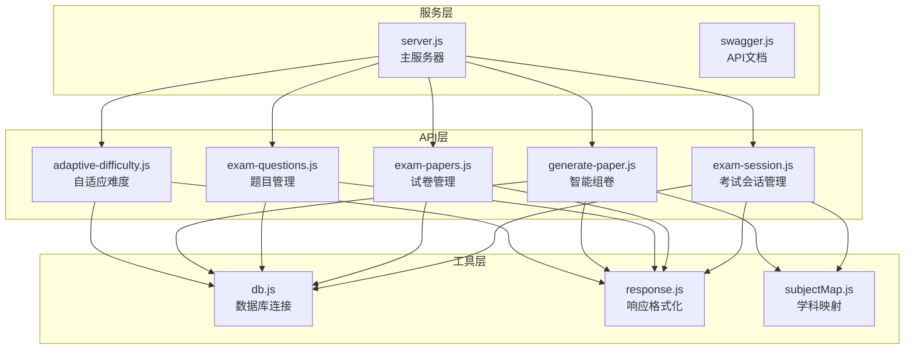
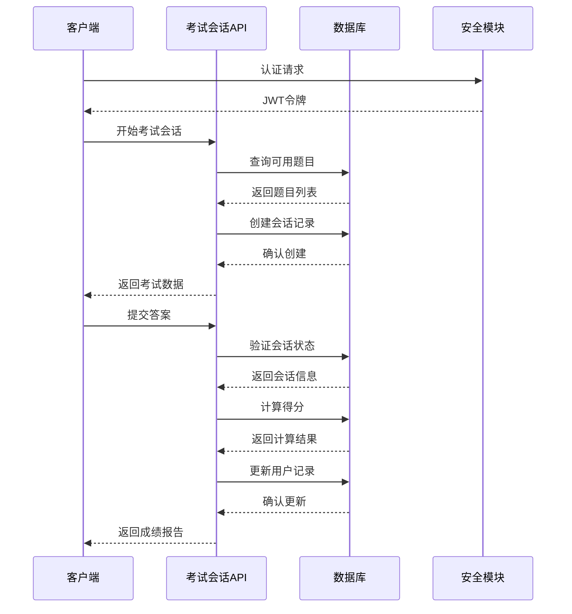
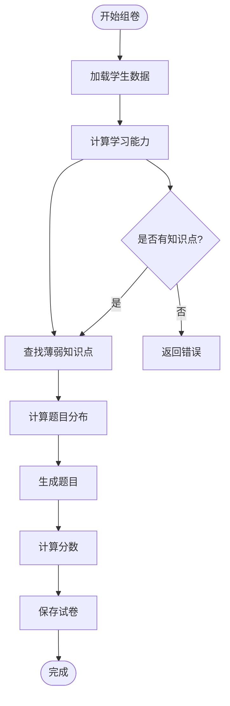
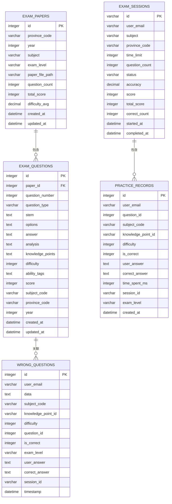
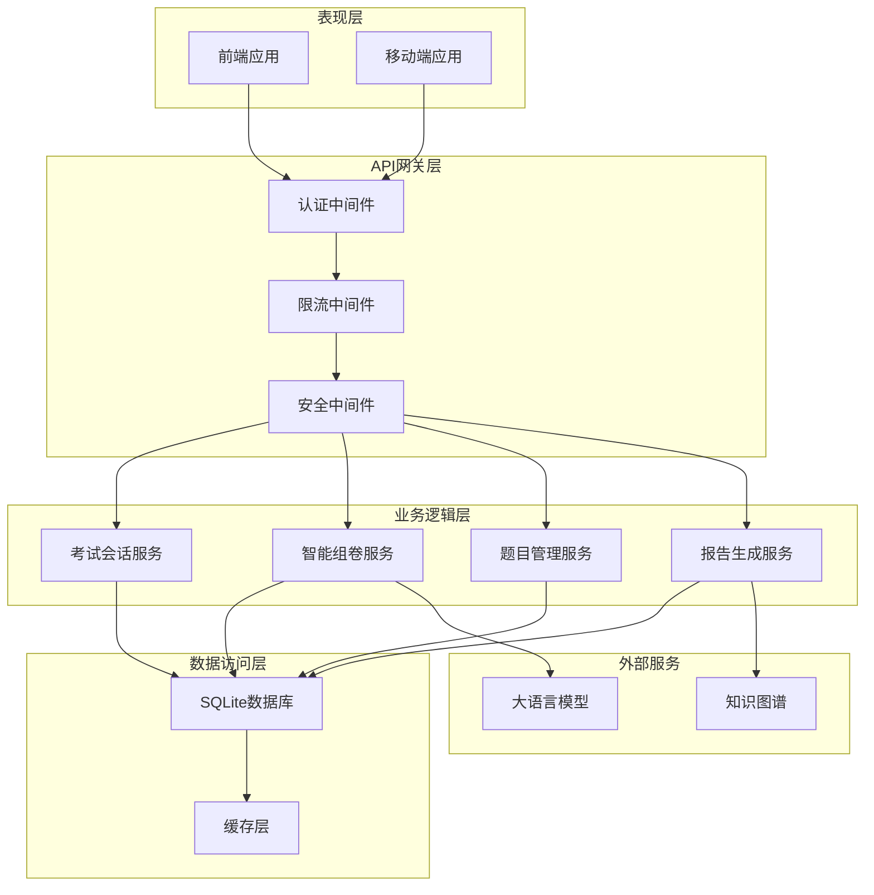
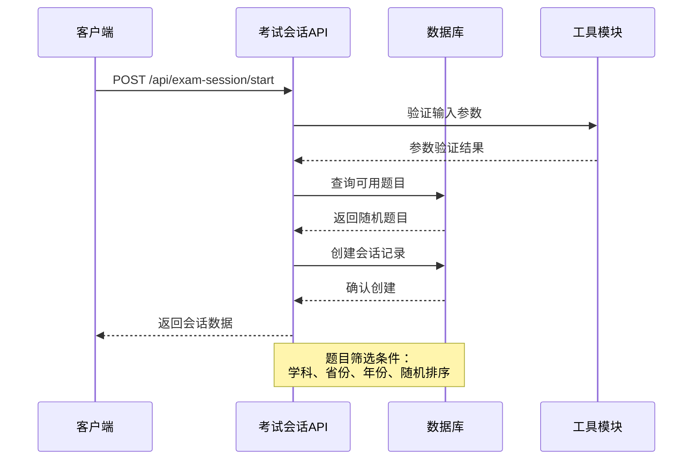
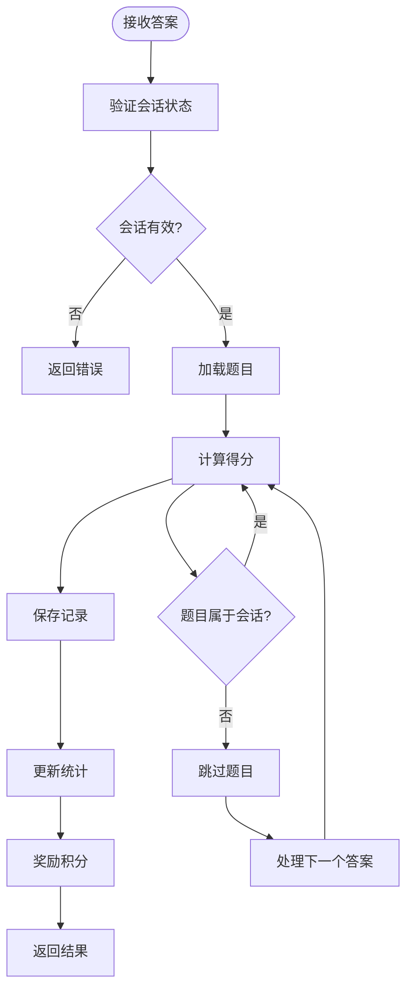
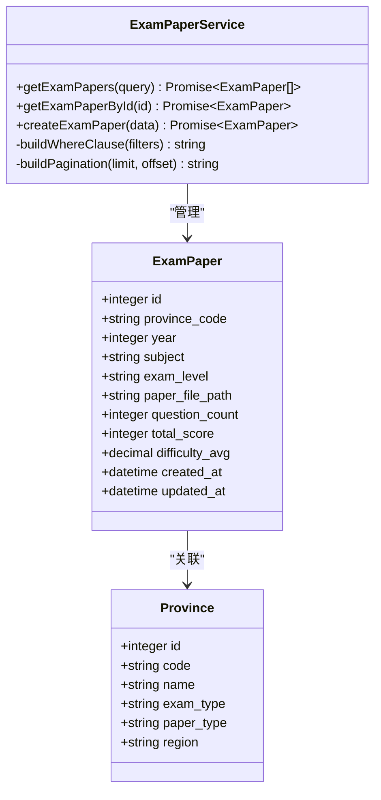
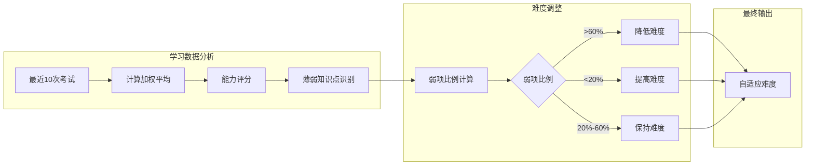
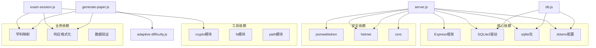

# 考试模拟系统API

<cite>
**本文档引用的文件**
- [server.js](file://server.js)
- [exam-session.js](file://api/exam-session.js)
- [exam-papers.js](file://api/exam-papers.js)
- [exam-questions.js](file://api/exam-questions.js)
- [generate-paper.js](file://api/generate-paper.js)
- [db.js](file://api/db.js)
- [response.js](file://api/utils/response.js)
- [subjectMap.js](file://api/utils/subjectMap.js)
- [adaptive-difficulty.js](file://api/adaptive-difficulty.js)
- [swagger.js](file://api/swagger.js)
</cite>

## 目录
1. [简介](#简介)
2. [项目结构](#项目结构)
3. [核心组件](#核心组件)
4. [架构概览](#架构概览)
5. [详细组件分析](#详细组件分析)
6. [依赖关系分析](#依赖关系分析)
7. [性能考虑](#性能考虑)
8. [故障排除指南](#故障排除指南)
9. [结论](#结论)

## 简介

AI家教项目的考试模拟系统API是一个基于Node.js和SQLite的完整在线考试解决方案。该系统提供了智能组卷、实时答题、自动评分、错题管理、学习分析等核心功能，支持高考和中考两个教育阶段，涵盖数学、语文、英语、物理、化学、生物、历史、地理、政治等九个学科。

系统采用现代化的架构设计，具备以下特点：
- **智能化组卷**：基于学生能力水平和薄弱知识点的个性化试卷生成
- **实时考试管理**：完整的考试会话生命周期管理
- **自动评分系统**：准确的答案匹配和分数计算
- **学习分析**：详细的错题分析和学习进度跟踪
- **安全防护**：完善的认证授权和安全防护机制

## 项目结构

考试模拟系统采用模块化的文件组织结构，主要分为以下几个层次：

**图表来源**
- [server.js:1-221](file://server.js#L1-L221)
- [exam-session.js:1-313](file://api/exam-session.js#L1-L313)
- [db.js:1-478](file://api/db.js#L1-L478)

**章节来源**
- [server.js:1-221](file://server.js#L1-L221)
- [db.js:1-478](file://api/db.js#L1-L478)

## 核心组件

### 考试会话管理系统

考试会话系统是整个考试模拟的核心组件，负责管理用户的考试生命周期：

**图表来源**
- [exam-session.js:17-94](file://api/exam-session.js#L17-L94)
- [exam-session.js:96-278](file://api/exam-session.js#L96-L278)

### 智能组卷引擎

智能组卷系统根据学生的知识掌握情况和能力水平生成个性化的试卷：

**图表来源**
- [generate-paper.js:6-153](file://api/generate-paper.js#L6-L153)
- [adaptive-difficulty.js:44-75](file://api/adaptive-difficulty.js#L44-L75)

### 数据库架构

系统使用SQLite作为主要数据存储，建立了完整的数据模型：

**图表来源**
- [db.js:248-262](file://api/db.js#L248-L262)
- [db.js:159-172](file://api/db.js#L159-L172)
- [db.js:174-193](file://api/db.js#L174-L193)
- [db.js:79-93](file://api/db.js#L79-L93)
- [db.js:206-222](file://api/db.js#L206-L222)

**章节来源**
- [exam-session.js:1-313](file://api/exam-session.js#L1-L313)
- [generate-paper.js:1-430](file://api/generate-paper.js#L1-L430)
- [db.js:1-478](file://api/db.js#L1-L478)

## 架构概览

系统采用分层架构设计，确保了良好的可维护性和扩展性：

**图表来源**
- [server.js:34-36](file://server.js#L34-L36)
- [server.js:185-188](file://server.js#L185-L188)
- [generate-paper.js:1-10](file://api/generate-paper.js#L1-L10)

系统的核心特性包括：

### 安全架构
- **JWT认证**：所有API端点都需要有效的认证令牌
- **CSRF防护**：防止跨站请求伪造攻击
- **XSS防护**：内置XSS清理和检测机制
- **速率限制**：防止API滥用和DDoS攻击

### 性能优化
- **数据库索引**：为常用查询字段建立索引
- **连接池管理**：优化数据库连接使用
- **缓存策略**：减少重复查询开销
- **异步处理**：后台任务队列处理耗时操作

### 扩展性设计
- **模块化架构**：每个功能模块独立封装
- **中间件模式**：可插拔的安全和处理中间件
- **配置驱动**：通过环境变量控制行为
- **API版本化**：支持API演进和向后兼容

**章节来源**
- [server.js:44-54](file://server.js#L44-L54)
- [db.js:23-25](file://api/db.js#L23-L25)

## 详细组件分析

### 考试会话管理

考试会话管理是系统的核心功能，提供了完整的在线考试体验：

#### 开始考试会话

**图表来源**
- [exam-session.js:17-94](file://api/exam-session.js#L17-L94)

#### 提交考试答案

**图表来源**
- [exam-session.js:96-278](file://api/exam-session.js#L96-L278)

#### 考试历史查询

系统提供完整的考试历史记录功能，支持分页查询和条件筛选。

**章节来源**
- [exam-session.js:1-313](file://api/exam-session.js#L1-L313)

### 试卷管理系统

试卷管理系统提供了完整的试卷生命周期管理：

#### 试卷查询

**图表来源**
- [exam-papers.js:4-70](file://api/exam-papers.js#L4-L70)
- [exam-papers.js:72-104](file://api/exam-papers.js#L72-L104)
- [exam-papers.js:106-143](file://api/exam-papers.js#L106-L143)

#### 题目管理

题目管理功能支持单题创建和批量导入：

**章节来源**
- [exam-papers.js:1-143](file://api/exam-papers.js#L1-L143)
- [exam-questions.js:1-246](file://api/exam-questions.js#L1-L246)

### 智能组卷引擎

智能组卷系统是系统的AI核心，能够根据学生的学习情况生成个性化的试卷：

#### 自适应难度计算

**图表来源**
- [adaptive-difficulty.js:5-24](file://api/adaptive-difficulty.js#L5-L24)
- [adaptive-difficulty.js:26-42](file://api/adaptive-difficulty.js#L26-L42)

#### 个性化试卷生成

智能组卷系统的核心算法：

1. **学习能力评估**：基于最近10次考试的加权平均计算
2. **薄弱知识点识别**：通过关键词匹配算法识别学生薄弱环节
3. **题目分布优化**：根据目标难度和时间限制计算各类题目的数量
4. **个性化定制**：优先选择与薄弱知识点相关的题目

**章节来源**
- [generate-paper.js:1-430](file://api/generate-paper.js#L1-L430)
- [adaptive-difficulty.js:1-88](file://api/adaptive-difficulty.js#L1-L88)

### 数据一致性保证

系统通过多种机制确保数据的一致性和完整性：

#### 事务处理
- 关键操作使用数据库事务确保原子性
- 错误回滚机制防止部分更新
- 并发控制避免数据竞争

#### 约束检查
- 外键约束确保引用完整性
- 检查约束验证数据有效性
- 唯一约束防止重复数据

#### 数据验证
- 输入参数严格验证
- 格式化和清理用户输入
- 默认值和边界值处理

**章节来源**
- [db.js:23-25](file://api/db.js#L23-L25)
- [db.js:460-472](file://api/db.js#L460-L472)

## 依赖关系分析

系统采用模块化设计，各组件之间通过清晰的接口进行交互：

**图表来源**
- [server.js:1-10](file://server.js#L1-L10)
- [db.js:1-12](file://api/db.js#L1-L12)

系统的主要依赖包括：

### 核心框架
- **Express.js**：Web应用框架，提供路由和中间件支持
- **SQLite**：轻量级数据库，支持ACID事务和SQL查询

### 安全组件
- **JWT**：JSON Web Token认证机制
- **Rate Limit**：请求频率限制，防止滥用
- **Helmet**：HTTP头部安全配置

### 工具库
- **Crypto**：加密和哈希功能
- **Dotenv**：环境变量管理
- **Path**：文件路径处理

**章节来源**
- [server.js:1-36](file://server.js#L1-L36)
- [db.js:1-12](file://api/db.js#L1-L12)

## 性能考虑

系统在设计时充分考虑了性能优化，采用了多种策略来提升响应速度和吞吐量：

### 数据库优化

#### 索引策略
- 为常用查询字段建立复合索引
- 优化WHERE子句和JOIN操作
- 使用覆盖索引减少表扫描

#### 连接管理
- WAL模式提升并发性能
- 适当的busy_timeout配置
- 外键约束启用确保数据完整性

#### 查询优化
- 使用LIMIT和OFFSET实现分页
- 避免SELECT *使用具体字段
- 合理使用预编译语句

### 缓存策略

#### 内存缓存
- 频繁访问的数据缓存
- 缓存失效策略
- 缓存更新机制

#### 数据库缓存
- 查询结果缓存
- 结构化数据缓存
- 临时表使用

### 异步处理

#### 后台任务
- 耗时操作异步执行
- 任务队列管理
- 错误重试机制

#### 流处理
- 大数据量分批处理
- 流式数据传输
- 内存使用优化

### 网络优化

#### 请求优化
- 请求体大小限制
- 压缩传输
- 连接复用

#### 响应优化
- 缓存头设置
- 增量更新
- 条件请求

**章节来源**
- [db.js:23-25](file://api/db.js#L23-L25)
- [server.js:44-47](file://server.js#L44-L47)

## 故障排除指南

### 常见问题及解决方案

#### 数据库连接问题

**症状**：API调用时出现数据库连接错误

**可能原因**：
- 数据库文件路径配置错误
- 权限不足访问数据库文件
- 数据库文件损坏

**解决步骤**：
1. 检查数据库文件路径配置
2. 验证文件权限设置
3. 运行数据库完整性检查
4. 重新初始化数据库结构

#### 认证失败

**症状**：用户无法登录或API调用返回401错误

**可能原因**：
- JWT密钥配置错误
- 令牌过期
- 用户凭据错误

**解决步骤**：
1. 验证JWT_SECRET环境变量
2. 检查令牌有效期设置
3. 确认用户账户状态
4. 重新生成认证令牌

#### 性能问题

**症状**：API响应缓慢或超时

**可能原因**：
- 缺少必要的数据库索引
- 查询语句效率低下
- 并发连接过多

**解决步骤**：
1. 分析慢查询日志
2. 添加缺失的索引
3. 优化复杂查询
4. 调整连接池配置

### 调试工具和方法

#### 日志分析
- 启用详细的错误日志
- 监控关键指标
- 分析异常模式

#### 性能监控
- 数据库查询性能
- API响应时间
- 内存使用情况

#### 调试模式
- 开发环境调试
- 错误堆栈追踪
- 状态信息检查

**章节来源**
- [server.js:115-124](file://server.js#L115-L124)
- [db.js:363](file://api/db.js#L363)

## 结论

AI家教项目的考试模拟系统API是一个功能完整、架构合理的在线考试解决方案。系统通过智能化的组卷算法、完善的考试管理功能和强大的数据分析能力，为学生提供了个性化的学习体验。

### 主要优势

1. **智能化程度高**：基于学生能力水平的自适应组卷
2. **功能完整性**：覆盖考试全流程的完整功能
3. **安全性保障**：多层次的安全防护机制
4. **性能优化**：针对教育场景的性能优化
5. **扩展性强**：模块化设计便于功能扩展

### 技术特色

- **AI驱动的个性化学习**：通过机器学习算法提供定制化学习路径
- **实时反馈机制**：即时的成绩分析和学习建议
- **多维度数据分析**：从多个角度分析学生的学习状况
- **跨平台支持**：同时支持Web和移动端应用

### 发展建议

1. **增强AI能力**：引入更先进的机器学习算法
2. **扩展学科覆盖**：增加更多学科和题型
3. **优化用户体验**：改进界面设计和交互体验
4. **强化数据分析**：提供更深入的学习洞察
5. **提升系统性能**：支持更大规模的并发访问

该系统为AI家教项目提供了坚实的技术基础，通过持续的优化和扩展，有望成为领先的智能教育平台。