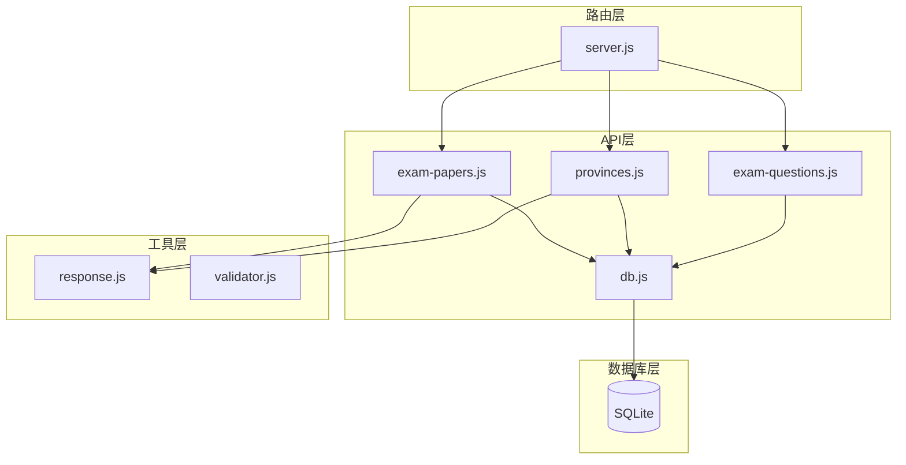
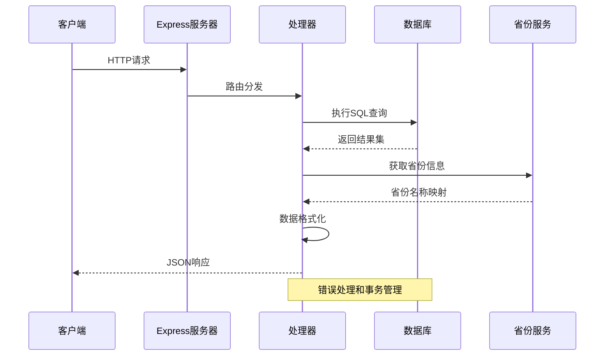
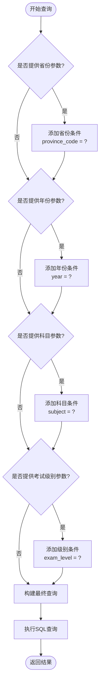
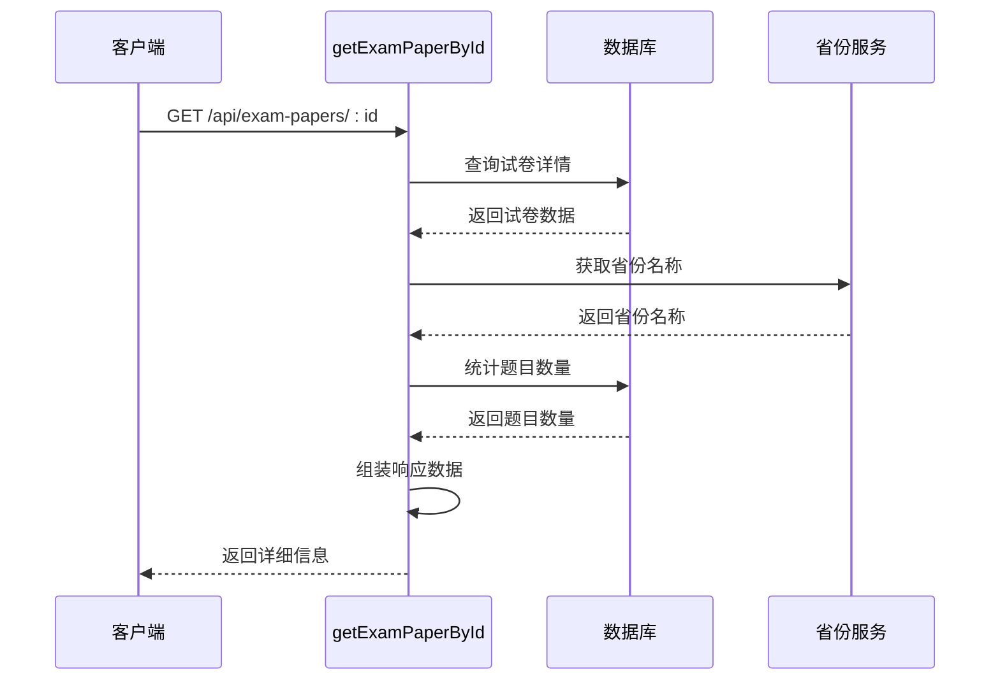
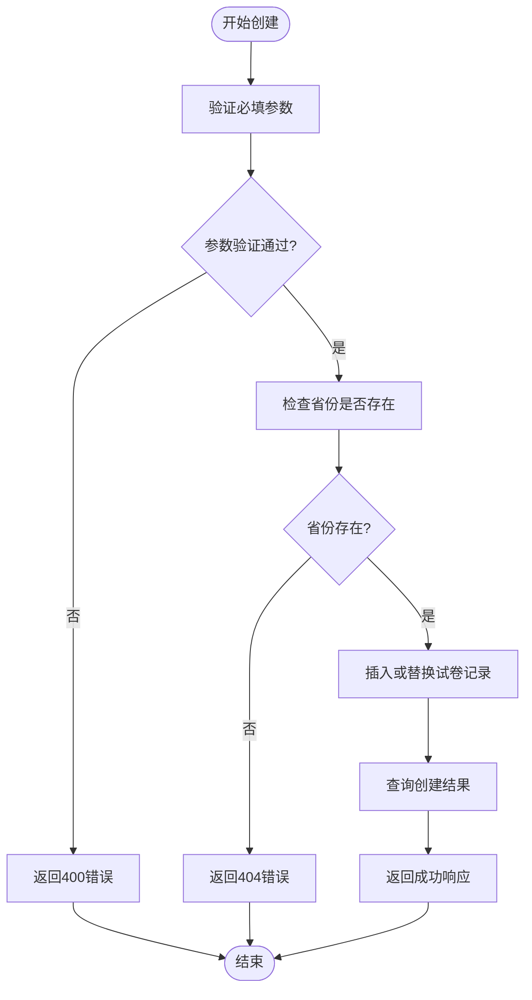
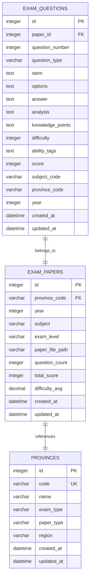

# 试卷管理API

<cite>
**本文档引用的文件**
- [server.js](file://server.js)
- [exam-papers.js](file://api/exam-papers.js)
- [db.js](file://api/db.js)
- [response.js](file://api/utils/response.js)
- [provinces.js](file://api/provinces.js)
</cite>

## 目录
1. [简介](#简介)
2. [项目结构](#项目结构)
3. [核心组件](#核心组件)
4. [架构概览](#架构概览)
5. [详细组件分析](#详细组件分析)
6. [依赖关系分析](#依赖关系分析)
7. [性能考虑](#性能考虑)
8. [故障排除指南](#故障排除指南)
9. [结论](#结论)

## 简介

AI家教项目的试卷管理API提供了完整的试卷生命周期管理功能，包括试卷查询、详情获取、创建和管理。该API基于Express.js构建，采用SQLite数据库存储，支持多维度筛选和分页查询，为AI家教系统的智能化教学提供了坚实的数据基础。

## 项目结构

试卷管理API位于项目的API层，与数据库层和工具层紧密协作：



**图表来源**
- [server.js:161-182](file://server.js#L161-L182)
- [exam-papers.js:1-143](file://api/exam-papers.js#L1-L143)
- [db.js:158-172](file://api/db.js#L158-L172)

**章节来源**
- [server.js:161-182](file://server.js#L161-L182)
- [exam-papers.js:1-143](file://api/exam-papers.js#L1-L143)

## 核心组件

### 路由配置

系统通过Express.js路由配置试卷管理相关的API端点：

- GET `/api/exam-papers` - 查询试卷列表
- GET `/api/exam-papers/:id` - 获取试卷详情
- POST `/api/exam-papers` - 创建新试卷

### 数据模型

试卷表结构包含以下关键字段：
- `id`: 主键标识符
- `province_code`: 省份代码（外键关联provinces表）
- `year`: 考试年份
- `subject`: 学科名称
- `exam_level`: 考试级别（中考/高考）
- `paper_file_path`: 试卷文件路径
- `question_count`: 题目数量
- `total_score`: 总分
- `difficulty_avg`: 难度平均值

**章节来源**
- [db.js:158-172](file://api/db.js#L158-L172)
- [server.js:161-182](file://server.js#L161-L182)

## 架构概览

试卷管理API采用分层架构设计，确保了良好的可维护性和扩展性：



**图表来源**
- [server.js:161-182](file://server.js#L161-L182)
- [exam-papers.js:4-104](file://api/exam-papers.js#L4-L104)
- [db.js:158-172](file://api/db.js#L158-L172)

## 详细组件分析

### GET /api/exam-papers 接口

#### 功能概述
该接口提供试卷的分页查询功能，支持多维度筛选条件，包括省份、年份、科目和考试级别。

#### 请求参数

| 参数名 | 类型 | 必需 | 描述 | 示例 |
|--------|------|------|------|------|
| province | string | 否 | 省份代码 | `GD` |
| year | number | 否 | 考试年份 | `2024` |
| subject | string | 否 | 学科名称 | `math` |
| exam_level | string | 否 | 考试级别 | `gaokao` |
| limit | number | 否 | 每页条数，默认50 | `20` |
| offset | number | 否 | 偏移量，默认0 | `0` |

#### 过滤机制

接口实现了动态SQL构建，根据提供的筛选条件生成相应的WHERE子句：



**图表来源**
- [exam-papers.js:8-40](file://api/exam-papers.js#L8-L40)

#### 返回格式

成功响应包含以下结构：

```javascript
{
  "success": true,
  "data": [
    {
      "id": 1,
      "province_code": "GD",
      "year": 2024,
      "subject": "math",
      "exam_level": "gaokao",
      "question_count": 23,
      "total_score": 150,
      "difficulty_avg": 3.20,
      "created_at": "2024-01-15T10:30:00Z",
      "province_name": "广东省"
    }
  ],
  "total": 150,
  "limit": 50,
  "offset": 0
}
```

#### 省份名称映射

接口自动从provinces表获取省份名称，如果找不到对应省份，则显示为"全国"。

**章节来源**
- [exam-papers.js:4-70](file://api/exam-papers.js#L4-L70)
- [provinces.js:4-40](file://api/provinces.js#L4-L40)

### GET /api/exam-papers/:id 接口

#### 功能概述
该接口提供指定试卷的详细信息查询，包括试卷基本信息和题目统计。

#### 请求参数

| 参数名 | 类型 | 必需 | 描述 |
|--------|------|------|------|
| id | number/string | 是 | 试卷唯一标识符 |

#### 查询逻辑



**图表来源**
- [exam-papers.js:72-104](file://api/exam-papers.js#L72-L104)

#### 返回格式

```javascript
{
  "success": true,
  "data": {
    "id": 1,
    "province_code": "GD",
    "year": 2024,
    "subject": "math",
    "exam_level": "gaokao",
    "paper_file_path": "/papers/math_gaokao_2024.pdf",
    "question_count": 23,
    "total_score": 150,
    "difficulty_avg": 3.20,
    "created_at": "2024-01-15T10:30:00Z",
    "province_name": "广东省",
    "paper_type": "全国卷",
    "region": "华南地区"
  }
}
```

**章节来源**
- [exam-papers.js:72-104](file://api/exam-papers.js#L72-L104)

### POST /api/exam-papers 接口

#### 功能概述
该接口用于创建新的试卷记录，包含参数验证、省份存在性检查和重复数据处理。

#### 请求参数

| 参数名 | 类型 | 必需 | 描述 | 示例 |
|--------|------|------|------|------|
| province_code | string | 是 | 省份代码 | `GD` |
| year | number | 是 | 考试年份 | `2024` |
| subject | string | 是 | 学科名称 | `math` |
| exam_level | string | 是 | 考试级别 | `gaokao` |
| paper_file_path | string | 否 | 试卷文件路径 | `/papers/math_2024.pdf` |
| total_score | number | 否 | 总分 | `150` |

#### 创建流程



**图表来源**
- [exam-papers.js:106-142](file://api/exam-papers.js#L106-L142)

#### 响应格式

成功创建后的响应：

```javascript
{
  "success": true,
  "data": {
    "id": 1,
    "province_code": "GD",
    "year": 2024,
    "subject": "math",
    "exam_level": "gaokao",
    "paper_file_path": null,
    "question_count": 0,
    "total_score": null,
    "difficulty_avg": null,
    "created_at": "2024-01-15T10:30:00Z",
    "updated_at": "2024-01-15T10:30:00Z"
  }
}
```

**章节来源**
- [exam-papers.js:106-142](file://api/exam-papers.js#L106-L142)

## 依赖关系分析

### 数据库依赖

试卷管理API依赖于以下数据库表结构：



**图表来源**
- [db.js:158-193](file://api/db.js#L158-L193)

### 索引优化

数据库为提高查询性能建立了多个索引：

- `idx_exam_papers_province`: 按省份查询优化
- `idx_exam_papers_year`: 按年份查询优化  
- `idx_exam_papers_subject`: 按学科查询优化
- `idx_exam_papers_exam_level`: 按考试级别查询优化
- `idx_exam_papers_composite`: 复合查询优化

**章节来源**
- [db.js:308-325](file://api/db.js#L308-L325)

## 性能考虑

### 查询优化策略

1. **索引利用**: 基于常用查询模式建立复合索引
2. **分页处理**: 默认每页50条记录，避免大数据量传输
3. **条件筛选**: 动态构建WHERE子句，只包含必要的筛选条件
4. **批量查询**: 省份名称映射使用IN子句批量获取

### 缓存策略

虽然当前实现未包含缓存层，但可以考虑：
- 省份信息缓存（静态数据）
- 热门试卷查询结果缓存
- 统计数据定期更新缓存

### 扩展建议

1. **分页优化**: 对于大量数据，考虑使用游标分页
2. **查询限制**: 添加最大查询范围限制防止资源耗尽
3. **并发控制**: 实现更精细的并发访问控制
4. **监控指标**: 添加查询性能监控和慢查询日志

## 故障排除指南

### 常见错误类型

| 错误码 | 错误类型 | 可能原因 | 解决方案 |
|--------|----------|----------|----------|
| 400 | 参数错误 | 缺少必填参数 | 检查请求参数完整性 |
| 404 | 资源不存在 | 试卷ID不存在 | 验证试卷ID有效性 |
| 404 | 省份不存在 | 省份代码错误 | 检查省份代码是否正确 |
| 500 | 服务器错误 | 数据库查询异常 | 查看服务器日志 |

### 错误响应格式

所有API错误都遵循统一的响应格式：

```javascript
{
  "success": false,
  "message": "错误描述",
  "status": "error"
}
```

### 调试建议

1. **启用详细日志**: 在开发环境中启用详细的数据库查询日志
2. **参数验证**: 确保客户端发送的参数符合API规范
3. **网络监控**: 使用浏览器开发者工具监控API调用
4. **数据库状态**: 定期检查数据库连接和索引状态

**章节来源**
- [response.js:9-15](file://api/utils/response.js#L9-L15)
- [exam-papers.js:66-103](file://api/exam-papers.js#L66-L103)

## 结论

AI家教项目的试卷管理API设计合理，功能完整，能够满足智能教育平台对试卷数据管理的需求。通过多维度筛选、分页查询和自动省份映射等功能，为用户提供了便捷的试卷查询体验。

主要优势包括：
- 清晰的API设计和一致的响应格式
- 完善的错误处理机制
- 良好的数据库性能优化
- 可扩展的架构设计

未来可以考虑的功能增强包括：缓存机制、更精细的权限控制、实时统计数据更新等，以进一步提升系统的性能和用户体验。