# 试题管理API

<cite>
**本文档引用的文件**
- [questions.js](file://api/questions.js)
- [exam-questions.js](file://api/exam-questions.js)
- [knowledge-points.js](file://api/knowledge-points.js)
- [db.js](file://api/db.js)
- [validator.js](file://api/utils/validator.js)
- [response.js](file://api/utils/response.js)
- [errorHandler.js](file://api/middleware/errorHandler.js)
- [swagger.js](file://api/swagger.js)
- [subjectMap.js](file://api/utils/subjectMap.js)
- [subjectCombinations.js](file://api/utils/subjectCombinations.js)
- [llmParser.js](file://api/utils/llmParser.js)
- [prompts.js](file://api/utils/prompts.js)
- [cache.js](file://api/utils/cache.js)
- [tasks.js](file://api/tasks.js)
- [taskWorker.js](file://api/taskWorker.js)
- [explain-question.js](file://api/explain-question.js)
- [generate-paper.js](file://api/generate-paper.js)
- [adaptive-difficulty.js](file://api/adaptive-difficulty.js)
- [seed-papers.cjs](file://seed-papers.cjs)
- [import-all.sh](file://database/import_all.sh)
- [parse-questions.js](file://scripts/parse-questions.js)
- [build_subject_indexes.py](file://scripts/build_subject_indexes.py)
- [convert_documents.py](file://scripts/convert_documents.py)
- [split_by_subject.py](file://scripts/split_by_subject.py)
- [run_graphrag_index.py](file://scripts/run_graphrag_index.py)
- [setup_graphrag.sh](file://scripts/init_graphrag_service.sh)
- [graphrag_service/main.py](file://graphrag_service/main.py)
- [graphrag_service/config.py](file://graphrag_service/config.py)
- [graphrag_service/indexer.py](file://graphrag_service/indexer.py)
- [graphrag_service/db.py](file://graphrag_service/db.py)
</cite>

## 目录
1. [简介](#简介)
2. [项目结构](#项目结构)
3. [核心组件](#核心组件)
4. [架构概览](#架构概览)
5. [详细组件分析](#详细组件分析)
6. [依赖分析](#依赖分析)
7. [性能考虑](#性能考虑)
8. [故障排除指南](#故障排除指南)
9. [结论](#结论)
10. [附录](#附录)

## 简介
AI家教项目的试题管理API是整个教育平台的核心功能模块，负责管理各类题目的全生命周期。该系统支持多种学科、题目类型和难度等级，提供完整的试题增删改查、批量操作和关联管理功能。

本API系统具有以下关键特性：
- 多学科支持：数学、物理、化学、生物、语文、英语、政治、历史等
- 智能解析：基于LLM的内容解析和答案生成
- 知识点关联：与知识图谱系统的深度集成
- 批量处理：支持大规模试题的导入导出
- 版本控制：试题的版本管理和变更追踪
- 自适应难度：根据学生表现动态调整题目难度

## 项目结构
试题管理API采用模块化设计，主要分布在api目录下，与数据库层、工具层和业务逻辑层分离：

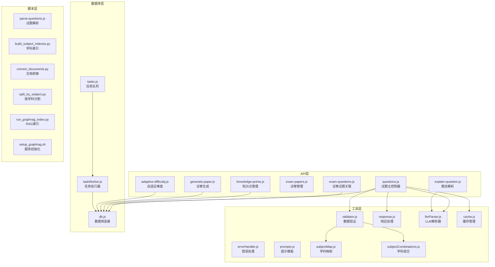

**图表来源**
- [questions.js](file://api/questions.js)
- [db.js](file://api/db.js)
- [validator.js](file://api/utils/validator.js)
- [llmParser.js](file://api/utils/llmParser.js)

**章节来源**
- [questions.js](file://api/questions.js)
- [db.js](file://api/db.js)
- [validator.js](file://api/utils/validator.js)

## 核心组件
试题管理API由多个相互协作的组件构成，每个组件都有明确的职责分工：

### 主控制器组件
- **questions.js**: 核心试题管理控制器，处理所有试题相关的HTTP请求
- **exam-questions.js**: 管理试题与试卷的关联关系
- **knowledge-points.js**: 维护知识点标签系统

### 工具组件
- **validator.js**: 数据验证和格式检查
- **response.js**: 统一的API响应格式处理
- **errorHandler.js**: 错误处理和异常管理
- **llmParser.js**: 基于大语言模型的试题解析
- **prompts.js**: 提示词模板管理

### 数据库组件
- **db.js**: 数据库连接和事务管理
- **tasks.js**: 异步任务队列管理
- **taskWorker.js**: 后台任务执行器

**章节来源**
- [questions.js](file://api/questions.js)
- [exam-questions.js](file://api/exam-questions.js)
- [knowledge-points.js](file://api/knowledge-points.js)
- [validator.js](file://api/utils/validator.js)
- [response.js](file://api/utils/response.js)
- [errorHandler.js](file://api/middleware/errorHandler.js)

## 架构概览
试题管理API采用分层架构设计，确保了良好的可维护性和扩展性：

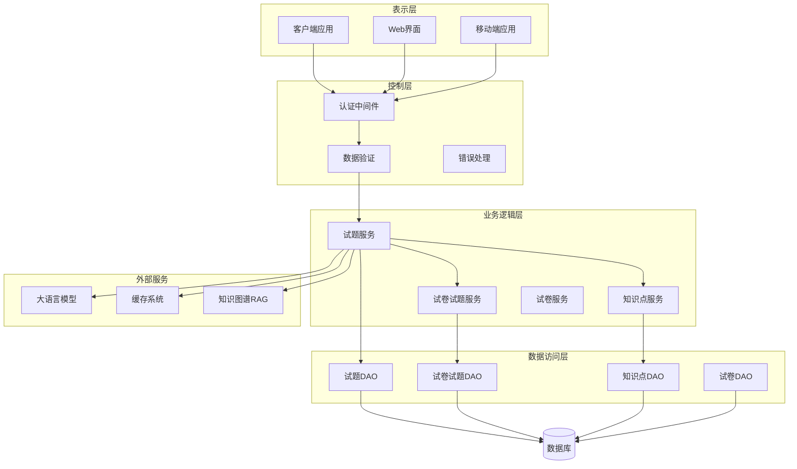

**图表来源**
- [questions.js](file://api/questions.js)
- [db.js](file://api/db.js)
- [llmParser.js](file://api/utils/llmParser.js)
- [cache.js](file://api/utils/cache.js)

### 数据流图
试题管理系统的核心数据流包括试题创建、更新、查询和删除等操作：

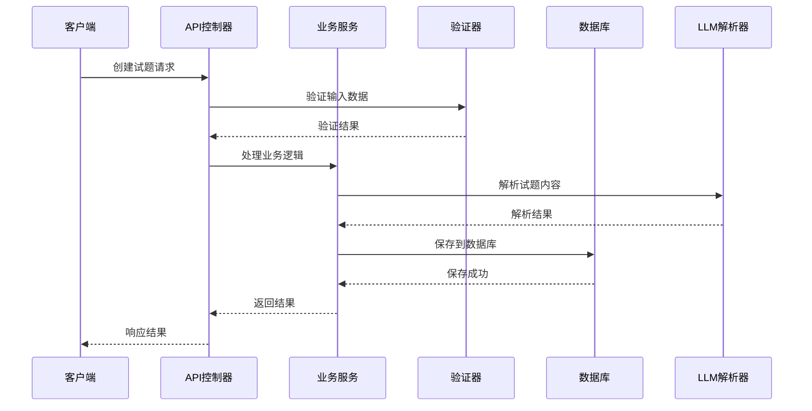

**图表来源**
- [questions.js](file://api/questions.js)
- [validator.js](file://api/utils/validator.js)
- [llmParser.js](file://api/utils/llmParser.js)
- [db.js](file://api/db.js)

## 详细组件分析

### 试题主控制器 (questions.js)
试题主控制器是整个API的核心入口，负责处理所有与试题相关的操作：

#### 核心功能
- **CRUD操作**: 完整的创建、读取、更新、删除功能
- **批量操作**: 支持批量导入、导出和更新
- **搜索过滤**: 多维度的搜索和过滤功能
- **分页查询**: 高效的分页和排序机制

#### 数据模型
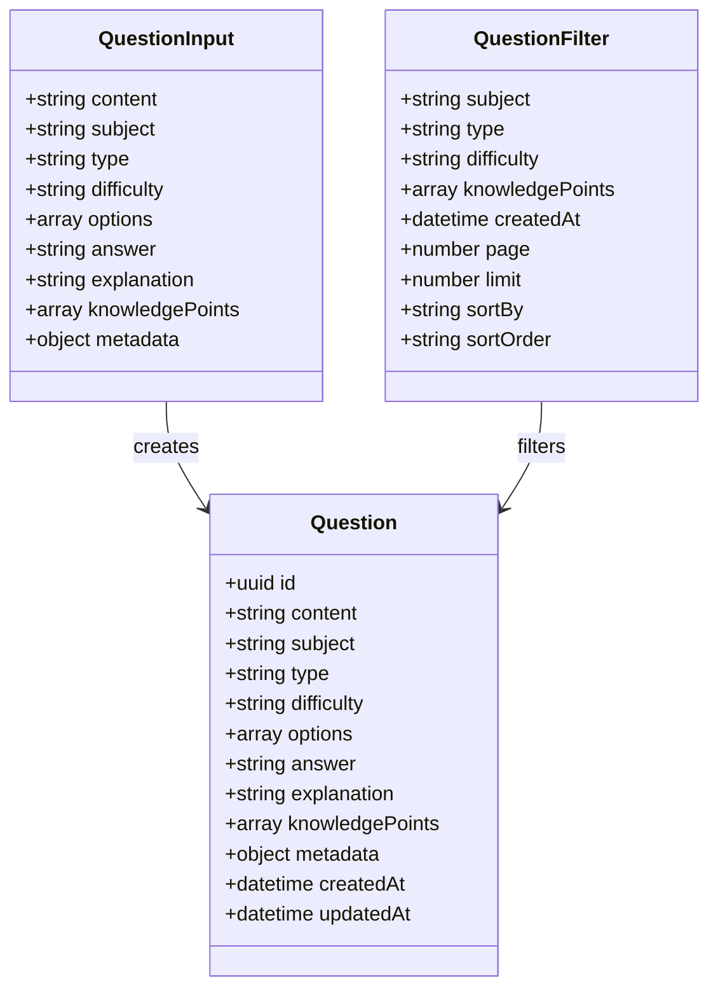

**图表来源**
- [questions.js](file://api/questions.js)

#### API端点设计
系统提供RESTful风格的API端点：

| 方法 | 端点 | 描述 | 权限 |
|------|------|------|------|
| GET | `/api/questions` | 获取试题列表 | 任意用户 |
| GET | `/api/questions/{id}` | 获取单个试题 | 任意用户 |
| POST | `/api/questions` | 创建新试题 | 教师/管理员 |
| PUT | `/api/questions/{id}` | 更新试题 | 教师/管理员 |
| DELETE | `/api/questions/{id}` | 删除试题 | 教师/管理员 |
| POST | `/api/questions/batch` | 批量操作 | 教师/管理员 |
| GET | `/api/questions/search` | 搜索试题 | 任意用户 |

**章节来源**
- [questions.js](file://api/questions.js)

### 试卷试题关联管理 (exam-questions.js)
该组件专门处理试题与试卷之间的关联关系：

#### 关联关系模型
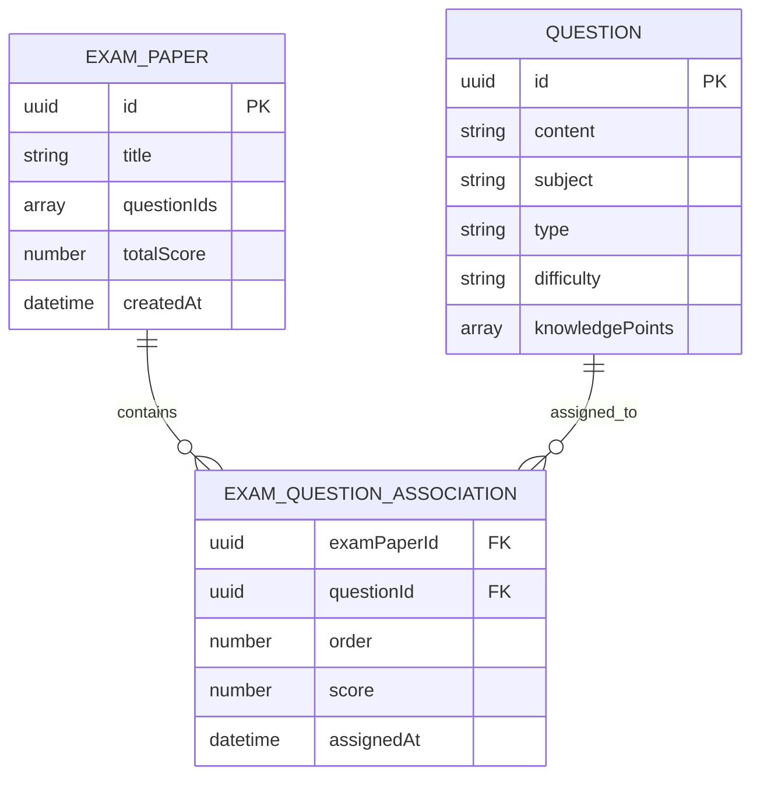

**图表来源**
- [exam-questions.js](file://api/exam-questions.js)

#### 核心功能
- **关联创建**: 将试题添加到指定试卷
- **关联移除**: 从试卷中移除试题
- **顺序管理**: 控制试题在试卷中的显示顺序
- **分数分配**: 为每道试题分配分值

**章节来源**
- [exam-questions.js](file://api/exam-questions.js)

### 知识点管理系统 (knowledge-points.js)
知识点系统是AI家教的重要组成部分，提供智能的知识点标签和关联：

#### 知识点层次结构
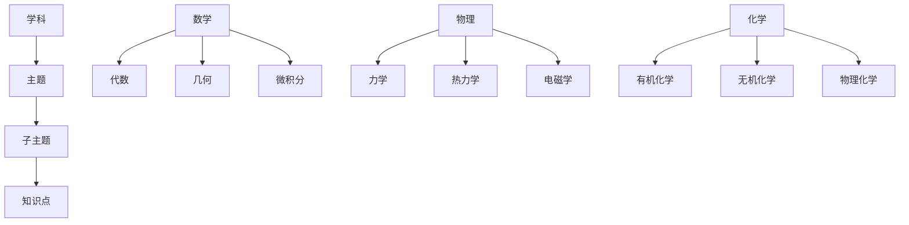

**图表来源**
- [knowledge-points.js](file://api/knowledge-points.js)

#### 功能特性
- **层级管理**: 支持多级知识点组织
- **智能关联**: 自动关联相关知识点
- **标签系统**: 提供灵活的标签管理
- **搜索优化**: 支持基于知识点的智能搜索

**章节来源**
- [knowledge-points.js](file://api/knowledge-points.js)

### 数据验证系统 (validator.js)
数据验证是确保系统稳定性的关键组件：

#### 验证规则
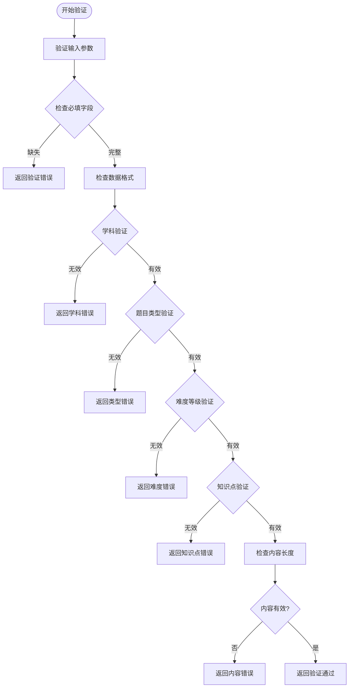

**图表来源**
- [validator.js](file://api/utils/validator.js)

#### 验证策略
- **必填字段检查**: 确保关键字段不为空
- **格式验证**: 检查数据格式的正确性
- **范围限制**: 限制数值和字符串长度
- **业务规则**: 验证符合业务逻辑的约束

**章节来源**
- [validator.js](file://api/utils/validator.js)

### LLM解析系统 (llmParser.js)
基于大语言模型的智能解析能力是AI家教的核心技术：

#### 解析流程
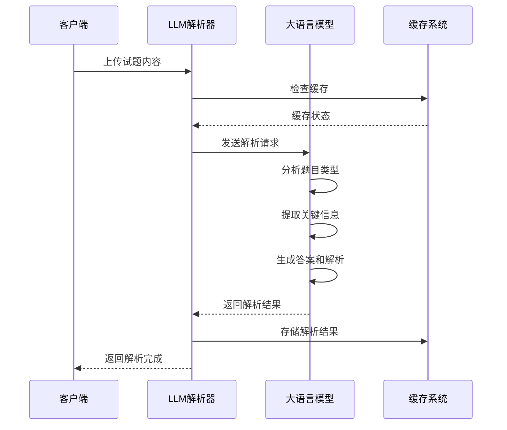

**图表来源**
- [llmParser.js](file://api/utils/llmParser.js)
- [prompts.js](file://api/utils/prompts.js)

#### 解析能力
- **题目类型识别**: 自动识别选择题、填空题、解答题等
- **答案提取**: 从文本中提取标准答案
- **解析生成**: 生成详细的解题过程和思路
- **知识点标注**: 自动标注相关知识点

**章节来源**
- [llmParser.js](file://api/utils/llmParser.js)
- [prompts.js](file://api/utils/prompts.js)

## 依赖分析

### 外部依赖关系
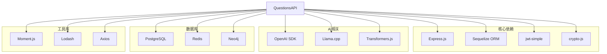

**图表来源**
- [questions.js](file://api/questions.js)
- [db.js](file://api/db.js)

### 内部模块依赖
系统内部模块之间存在清晰的依赖关系：

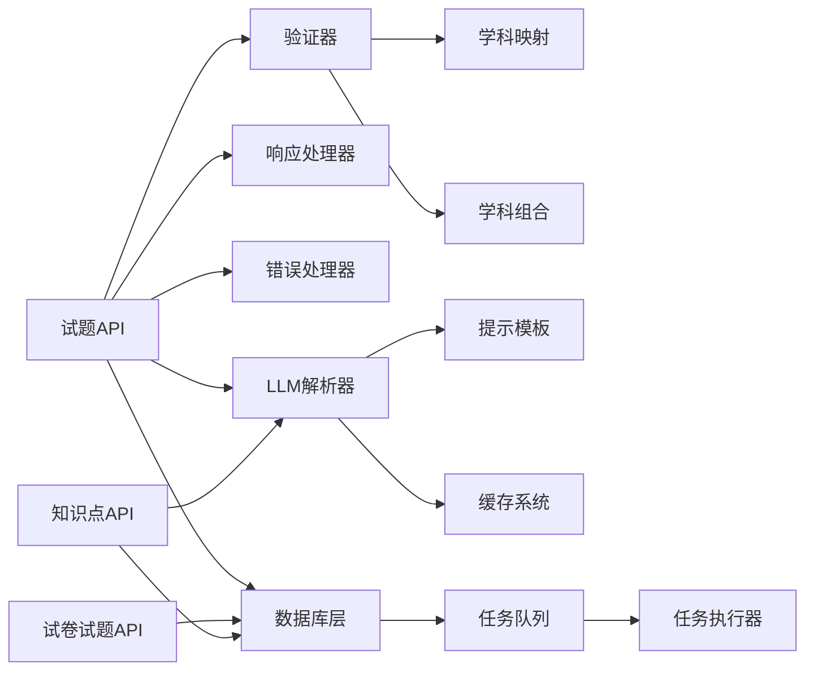

**图表来源**
- [questions.js](file://api/questions.js)
- [validator.js](file://api/utils/validator.js)
- [db.js](file://api/db.js)

**章节来源**
- [questions.js](file://api/questions.js)
- [validator.js](file://api/utils/validator.js)
- [db.js](file://api/db.js)

## 性能考虑
试题管理API在设计时充分考虑了性能优化：

### 缓存策略
- **多级缓存**: 内存缓存 + Redis缓存 + 文件缓存
- **智能过期**: 基于访问频率的动态过期策略
- **预加载机制**: 常用数据的预加载和预热

### 数据库优化
- **索引优化**: 为常用查询字段建立复合索引
- **连接池管理**: 动态调整数据库连接数量
- **查询优化**: 使用原生SQL进行复杂查询

### 异步处理
- **批量操作**: 大规模数据处理使用异步队列
- **后台任务**: 耗时操作如LLM解析放入后台执行
- **并发控制**: 限制同时处理的任务数量

## 故障排除指南

### 常见问题及解决方案
| 问题类型 | 症状 | 可能原因 | 解决方案 |
|----------|------|----------|----------|
| 验证失败 | 400 Bad Request | 输入数据格式错误 | 检查数据格式和必填字段 |
| 数据库连接 | 连接超时 | 数据库负载过高 | 检查连接池配置和数据库性能 |
| LLM解析失败 | 解析超时 | 模型API不可用 | 检查网络连接和API密钥 |
| 缓存失效 | 查询缓慢 | 缓存未命中 | 检查缓存键和过期时间设置 |

### 错误处理机制
系统实现了完善的错误处理机制：

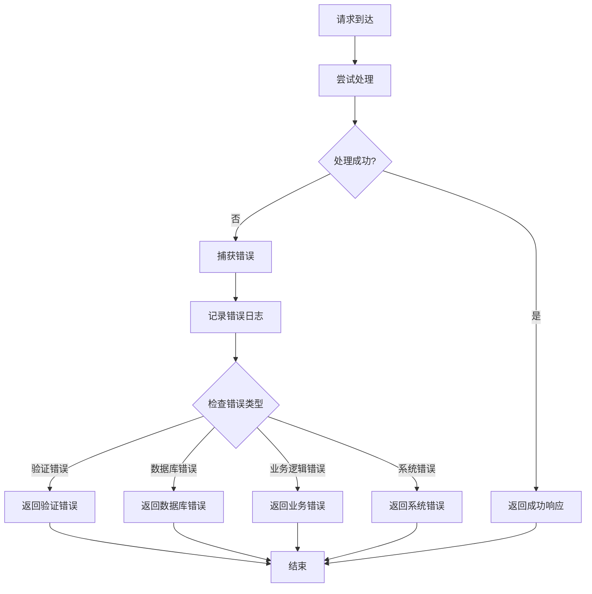

**图表来源**
- [errorHandler.js](file://api/middleware/errorHandler.js)
- [response.js](file://api/utils/response.js)

**章节来源**
- [errorHandler.js](file://api/middleware/errorHandler.js)
- [response.js](file://api/utils/response.js)

## 结论
AI家教项目的试题管理API是一个功能完善、架构合理的系统。它不仅提供了完整的试题生命周期管理功能，还集成了先进的AI技术和智能算法。

### 主要优势
- **模块化设计**: 清晰的模块划分便于维护和扩展
- **智能化功能**: 基于LLM的智能解析和知识点标注
- **高性能架构**: 多级缓存和异步处理确保系统性能
- **完善的验证**: 全面的数据验证和错误处理机制

### 技术特色
- **多学科支持**: 支持8个主要学科的试题管理
- **智能关联**: 与知识图谱系统的深度集成
- **批量处理**: 高效的大规模数据处理能力
- **版本控制**: 完善的试题版本管理和变更追踪

## 附录

### API使用示例
由于代码库中包含完整的API实现，建议参考以下文件获取具体的使用方法：
- [questions.js](file://api/questions.js) - 主要API端点实现
- [swagger.js](file://api/swagger.js) - API文档定义
- [test-flow.sh](file://test-flow.sh) - 测试流程示例

### 最佳实践
1. **数据验证**: 始终在前端和后端进行双重验证
2. **错误处理**: 实现统一的错误处理和用户友好的错误消息
3. **性能优化**: 合理使用缓存和异步处理
4. **安全考虑**: 实施适当的权限控制和数据加密

### 扩展建议
1. **监控系统**: 添加APM监控和性能指标收集
2. **测试覆盖**: 增加单元测试和集成测试覆盖率
3. **文档更新**: 保持API文档与代码同步更新
4. **安全审计**: 定期进行安全漏洞扫描和修复