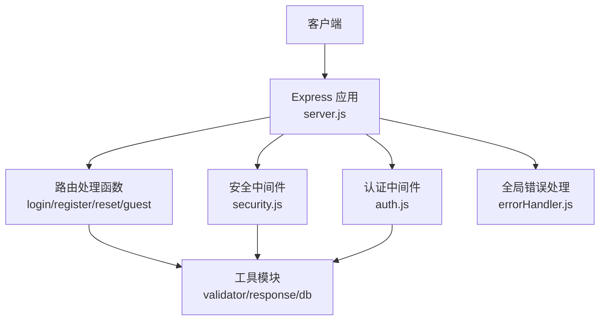
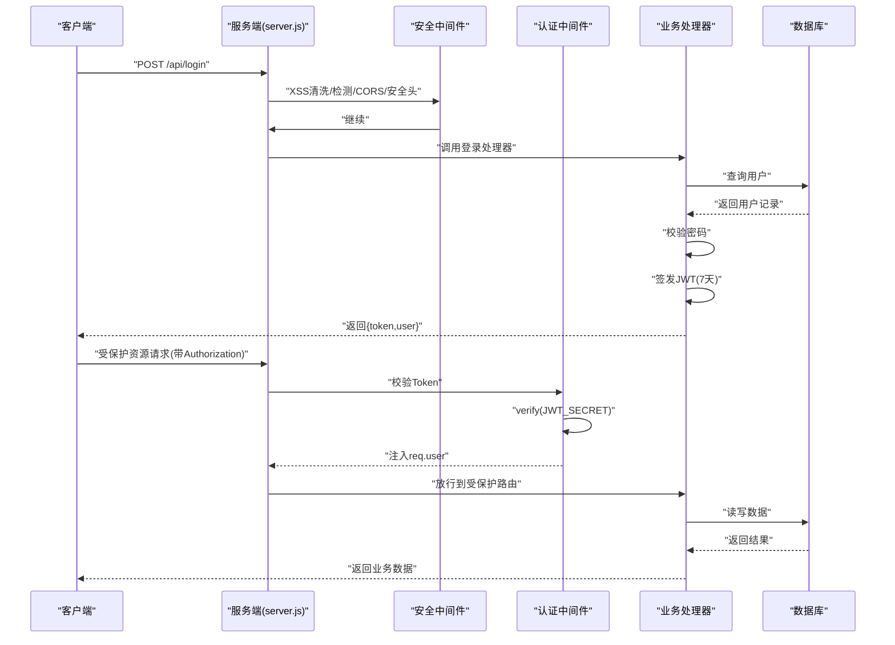
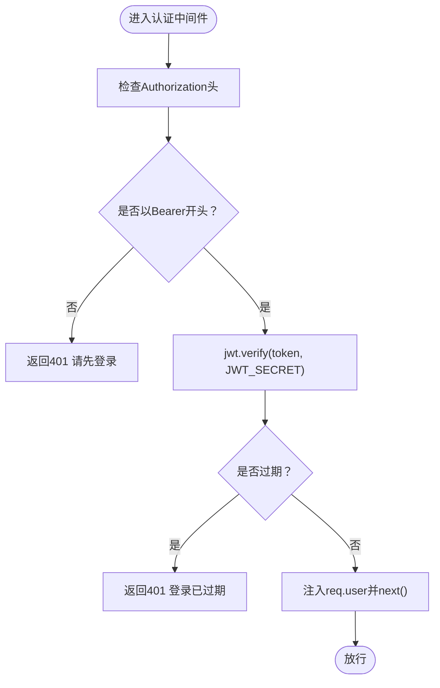
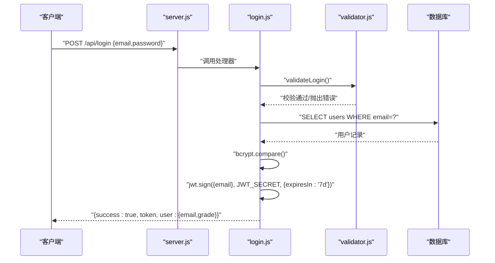
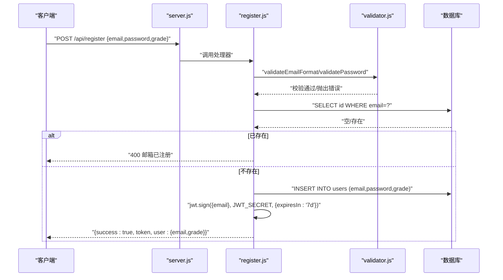
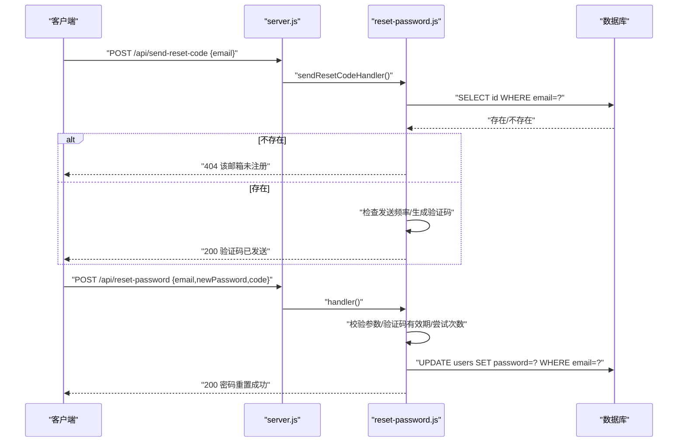
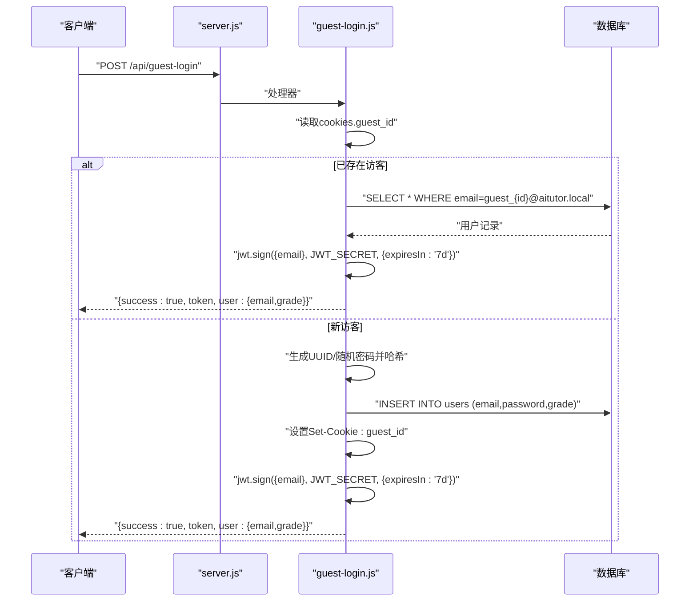
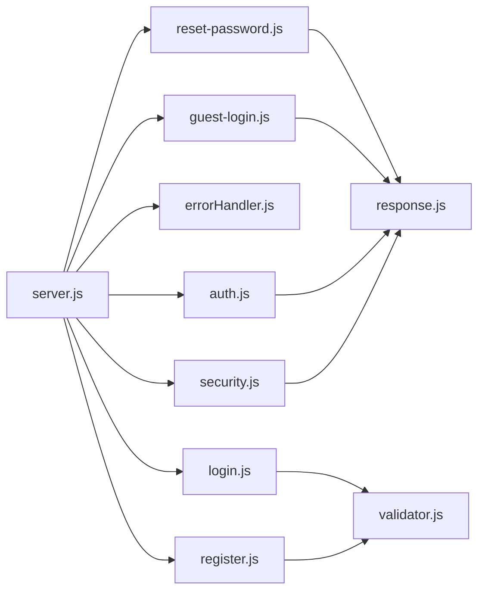

# 认证系统API

<cite>
**本文档引用的文件**
- [server.js](file://server.js)
- [auth.js](file://api/auth.js)
- [login.js](file://api/login.js)
- [register.js](file://api/register.js)
- [reset-password.js](file://api/reset-password.js)
- [guest-login.js](file://api/guest-login.js)
- [security.js](file://api/middleware/security.js)
- [errorHandler.js](file://api/middleware/errorHandler.js)
- [response.js](file://api/utils/response.js)
- [validator.js](file://api/utils/validator.js)
- [auth.test.js](file://tests/api/auth.test.js)
</cite>

## 目录
1. [简介](#简介)
2. [项目结构](#项目结构)
3. [核心组件](#核心组件)
4. [架构总览](#架构总览)
5. [详细组件分析](#详细组件分析)
6. [依赖关系分析](#依赖关系分析)
7. [性能考量](#性能考量)
8. [故障排查指南](#故障排查指南)
9. [结论](#结论)

## 简介
本文件为AI家教项目的认证系统API提供完整接口文档，覆盖以下能力：
- JWT认证机制与中间件
- 登录与注册流程
- 密码重置（含验证码）
- 访客登录
- 安全中间件（XSS清洗、CSRF防护、CORS、安全头）
- 错误处理与状态码规范
- 请求/响应示例与常见错误说明

认证相关端点均采用统一的响应格式，错误处理遵循统一的错误处理器。

## 项目结构
认证系统由以下模块协同组成：
- 路由与入口：server.js负责路由挂载、限流、中间件与全局错误处理
- 认证核心：auth.js提供JWT密钥校验与认证中间件
- 认证业务：login.js、register.js、reset-password.js、guest-login.js
- 安全中间件：security.js提供XSS清洗、检测与CSRF防护
- 响应工具：response.js提供统一的成功/错误响应格式
- 校验工具：validator.js提供输入校验
- 全局错误处理：errorHandler.js统一捕获并格式化错误

图表来源
- [server.js:141-205](file://server.js#L141-L205)
- [auth.js:29-46](file://api/auth.js#L29-L46)
- [security.js:23-113](file://api/middleware/security.js#L23-L113)
- [errorHandler.js:13-72](file://api/middleware/errorHandler.js#L13-L72)

章节来源
- [server.js:141-205](file://server.js#L141-L205)

## 核心组件
- JWT认证中间件：校验Authorization头中的Bearer Token，解码后注入req.user
- JWT密钥校验：启动时强制要求设置强密钥，防止默认弱密钥
- 安全中间件：XSS清洗与检测、CSRF来源白名单、安全响应头
- 统一响应格式：success、message、status及分页数据结构
- 输入校验：邮箱、密码、年级等基础校验
- 全局错误处理：对JWT过期、无效、数据库异常等进行分类处理

章节来源
- [auth.js:12-27](file://api/auth.js#L12-L27)
- [auth.js:29-46](file://api/auth.js#L29-L46)
- [security.js:73-113](file://api/middleware/security.js#L73-L113)
- [response.js:1-69](file://api/utils/response.js#L1-L69)
- [validator.js:31-134](file://api/utils/validator.js#L31-L134)
- [errorHandler.js:13-72](file://api/middleware/errorHandler.js#L13-L72)

## 架构总览
认证系统整体交互如下：

图表来源
- [server.js:141-145](file://server.js#L141-L145)
- [login.js:7-40](file://api/login.js#L7-L40)
- [auth.js:29-46](file://api/auth.js#L29-L46)

## 详细组件分析

### 认证中间件与JWT机制
- 启动时校验JWT_SECRET：禁止未设置或默认值；短于32字符给出警告
- 运行时校验Authorization头：缺失或非Bearer前缀返回401
- 验证失败区分处理：TokenExpiredError返回“登录已过期”，其他失败返回“认证失败”
- 成功后将解码后的用户信息注入req.user供后续处理器使用

图表来源
- [auth.js:29-46](file://api/auth.js#L29-L46)
- [auth.test.js:61-115](file://tests/api/auth.test.js#L61-L115)

章节来源
- [auth.js:12-27](file://api/auth.js#L12-L27)
- [auth.js:29-46](file://api/auth.js#L29-L46)
- [auth.test.js:61-115](file://tests/api/auth.test.js#L61-L115)

### 登录接口
- 方法与路径：POST /api/login
- 请求体参数
  - email: 邮箱（需符合邮箱格式）
  - password: 密码（至少6位）
- 成功响应
  - token: JWT，有效期7天
  - user: {email, grade}
- 常见错误
  - 405：仅允许POST
  - 400：邮箱/密码格式不合法
  - 401：邮箱或密码错误
  - 5xx：服务器内部错误

图表来源
- [server.js:141](file://server.js#L141)
- [login.js:7-40](file://api/login.js#L7-L40)
- [validator.js:93-99](file://api/utils/validator.js#L93-L99)

章节来源
- [login.js:7-40](file://api/login.js#L7-L40)
- [validator.js:93-99](file://api/utils/validator.js#L93-L99)

### 注册接口
- 方法与路径：POST /api/register
- 请求体参数
  - email: 邮箱（需符合邮箱格式）
  - password: 密码（至少6位）
  - grade: 年级（小学/初中/高中）
- 成功响应
  - token: JWT，有效期7天
  - user: {email, grade}
- 常见错误
  - 405：仅允许POST
  - 400：缺少字段/邮箱格式不正确/密码不合法/年级非法/邮箱已注册
  - 5xx：服务器内部错误

图表来源
- [server.js:142](file://server.js#L142)
- [register.js:9-50](file://api/register.js#L9-L50)
- [validator.js:31-16](file://api/utils/validator.js#L31-L16)

章节来源
- [register.js:9-50](file://api/register.js#L9-L50)
- [validator.js:31-16](file://api/utils/validator.js#L31-L16)

### 密码重置接口
- 发送验证码
  - 方法与路径：POST /api/send-reset-code
  - 请求体：{email}
  - 速率限制：同一邮箱发送间隔不低于1分钟
  - 过期时间：验证码5分钟有效
  - 开发模式：验证码会输出到服务端日志（实际部署应通过邮件发送）
- 重置密码
  - 方法与路径：POST /api/reset-password
  - 请求体：{email, newPassword, code}
  - 验证码尝试上限：最多5次，超限需重新获取
  - 成功后更新用户密码为新密码的哈希

图表来源
- [server.js:144-145](file://server.js#L144-L145)
- [reset-password.js:14-100](file://api/reset-password.js#L14-L100)

章节来源
- [reset-password.js:14-100](file://api/reset-password.js#L14-L100)

### 访客登录接口
- 方法与路径：POST /api/guest-login
- 流程
  - 若请求携带guest_id，则查找对应访客用户并签发JWT
  - 若无guest_id，则生成新的访客ID与临时密码，插入数据库，设置HttpOnly Cookie，签发JWT
- 响应
  - token: JWT，有效期7天
  - user: {email, grade}

图表来源
- [server.js:143](file://server.js#L143)
- [guest-login.js:7-54](file://api/guest-login.js#L7-L54)

章节来源
- [guest-login.js:7-54](file://api/guest-login.js#L7-L54)

### 受保护资源访问
- 所有受保护路由均需在请求头添加Authorization: Bearer <token>
- server.js中对多条API路径应用了authMiddleware
- 未通过认证的请求将收到401错误

章节来源
- [server.js:165-197](file://server.js#L165-L197)
- [auth.js:29-46](file://api/auth.js#L29-L46)

## 依赖关系分析
- server.js集中挂载路由、限流、中间件与错误处理
- 认证中间件依赖JWT库与环境变量JWT_SECRET
- 安全中间件提供XSS清洗与检测、CSRF来源校验、安全响应头
- 业务处理器依赖数据库连接、bcrypt、validator与response工具
- 全局错误处理器统一处理JWT错误、数据库错误与端口占用等

图表来源
- [server.js:30-35](file://server.js#L30-L35)
- [login.js:1-5](file://api/login.js#L1-L5)
- [register.js:1-5](file://api/register.js#L1-L5)
- [reset-password.js:1-3](file://api/reset-password.js#L1-L3)
- [guest-login.js:1-5](file://api/guest-login.js#L1-L5)

章节来源
- [server.js:30-35](file://server.js#L30-L35)

## 性能考量
- 限流策略
  - 登录/注册：15分钟内最多20次
  - 代理接口：1分钟内最多10次
  - 通用API：1分钟内最多60次
- 建议
  - 前端合理缓存登录态，减少重复登录
  - 对高频接口增加前端节流与后端更严格限流
  - 使用HTTPS与安全Cookie属性（HttpOnly、Secure、SameSite）

## 故障排查指南
- 常见错误与处理
  - 401 未授权
    - 缺少Authorization头或格式不正确
    - Token过期或签名无效
  - 400 参数错误
    - 邮箱格式不正确
    - 密码长度不合法
    - 缺少必填字段
  - 403 禁止访问
    - CSRF来源不在白名单
    - 验证码错误次数过多
  - 404 资源不存在
    - 邮箱未注册
  - 429 请求过于频繁
    - 验证码发送过于频繁
  - 5xx 服务器错误
    - 数据库异常、端口占用等
- 安全建议
  - 强制设置JWT_SECRET且长度≥32字符
  - 生产环境启用HTTPS与安全Cookie标志
  - 严格控制ALLOWED_ORIGINS白名单
  - 对所有输入进行XSS清洗与检测

章节来源
- [auth.js:12-27](file://api/auth.js#L12-L27)
- [security.js:89-113](file://api/middleware/security.js#L89-L113)
- [errorHandler.js:13-72](file://api/middleware/errorHandler.js#L13-L72)
- [reset-password.js:30-86](file://api/reset-password.js#L30-L86)

## 结论
本认证系统通过JWT实现无状态认证，结合安全中间件与严格的输入校验，提供了登录、注册、密码重置与访客登录等核心能力。建议在生产环境中强化密钥管理、启用HTTPS与严格的CORS/CSRF策略，并根据业务流量调整限流阈值以保障稳定性与安全性。