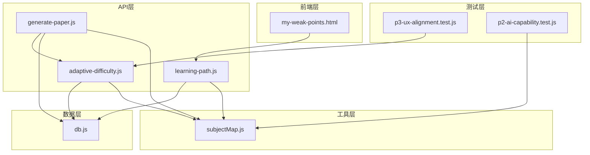
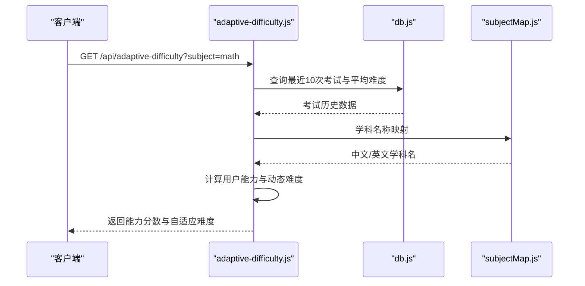
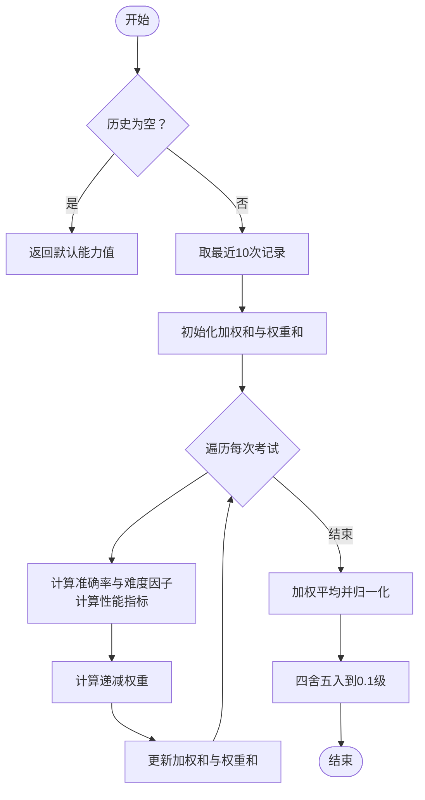
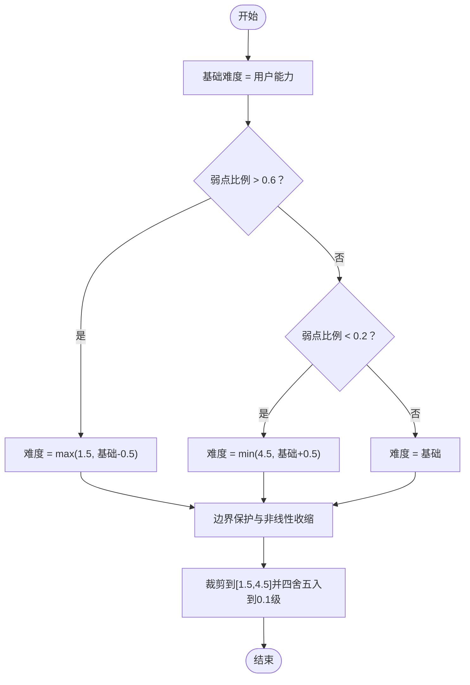
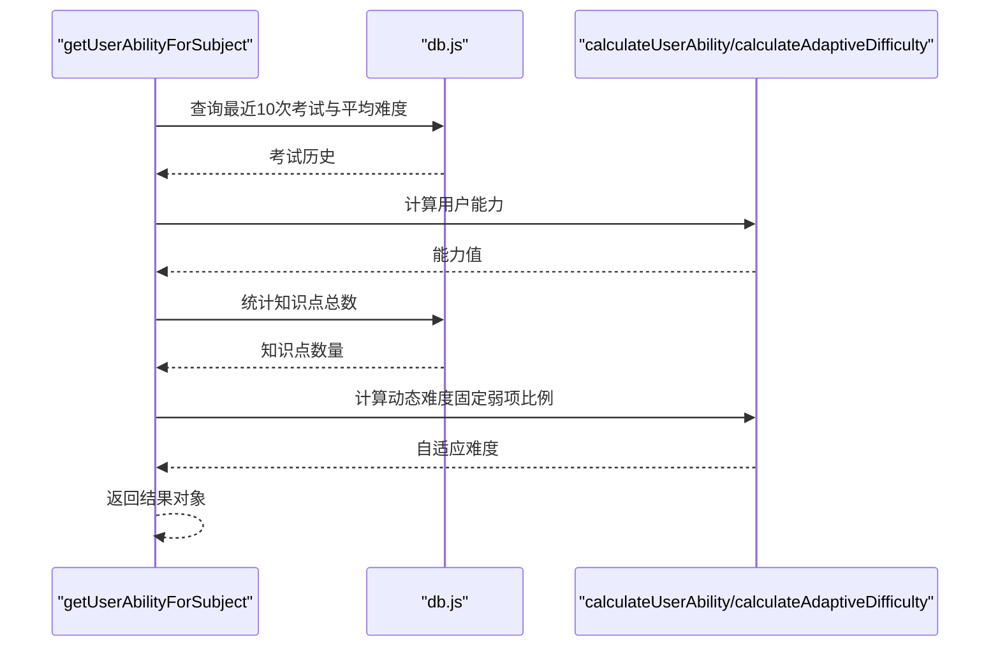
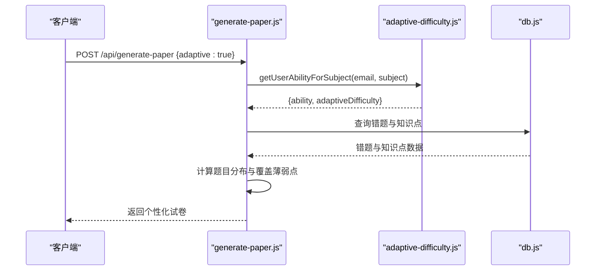
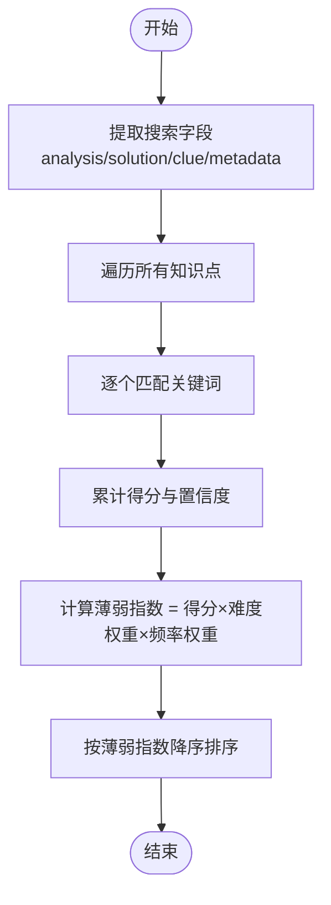
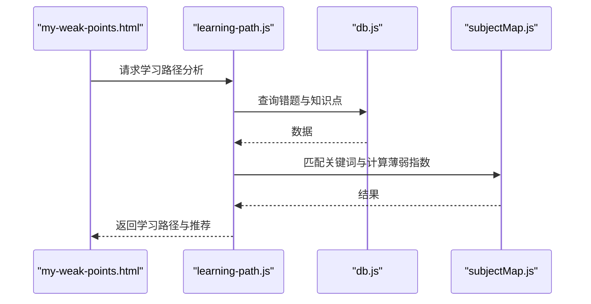
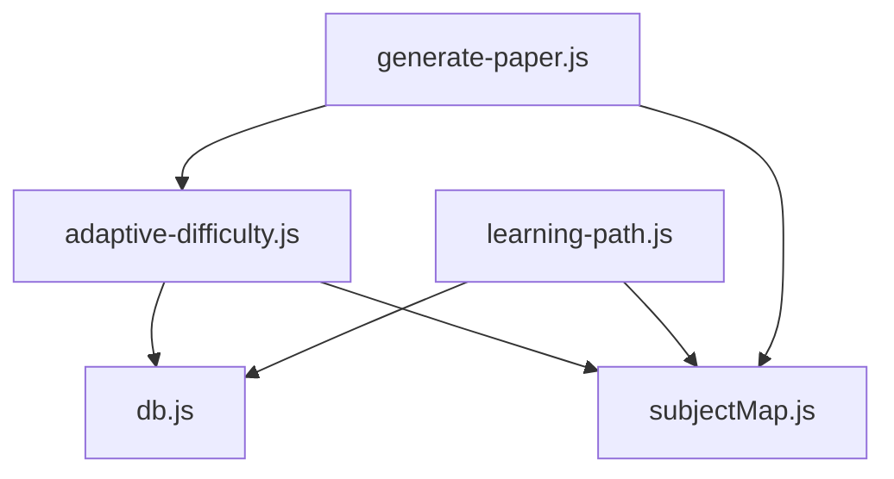

# 自适应难度调节系统

<cite>
**本文档引用的文件**
- [adaptive-difficulty.js](file://api/adaptive-difficulty.js)
- [generate-paper.js](file://api/generate-paper.js)
- [db.js](file://api/db.js)
- [subjectMap.js](file://api/utils/subjectMap.js)
- [p3-ux-alignment.test.js](file://tests/api/p3-ux-alignment.test.js)
- [p2-ai-capability.test.js](file://tests/api/p2-ai-capability.test.js)
- [learning-path.js](file://api/learning-path.js)
- [my-weak-points.html](file://frontend/my-weak-points.html)
</cite>

## 目录
1. [简介](#简介)
2. [项目结构](#项目结构)
3. [核心组件](#核心组件)
4. [架构总览](#架构总览)
5. [详细组件分析](#详细组件分析)
6. [依赖关系分析](#依赖关系分析)
7. [性能考虑](#性能考虑)
8. [故障排除指南](#故障排除指南)
9. [结论](#结论)
10. [附录](#附录)

## 简介
本系统旨在为AI家教平台提供智能化的自适应难度调节能力，通过分析用户的作答历史与错题数据，动态计算用户能力水平，并据此生成个性化的试题与学习路径。核心功能包括：
- 用户能力评估：基于最近考试表现与题目难度的加权评分
- 动态难度调整：结合薄弱知识点比例对目标难度进行修正
- 个性化推荐：在生成试卷与制定学习计划时优先覆盖薄弱知识点
- 参数配置与优化：支持可调的权重因子、难度阈值与分布策略

## 项目结构
自适应难度系统主要分布在以下模块：
- API层：提供难度评估接口与试卷生成接口
- 工具层：提供学科映射与关键词匹配工具
- 数据层：提供数据库连接与查询封装
- 测试层：覆盖算法行为与集成场景
- 前端层：展示薄弱知识点与学习路径

**图表来源**
- [adaptive-difficulty.js:1-89](file://api/adaptive-difficulty.js#L1-L89)
- [generate-paper.js:1-155](file://api/generate-paper.js#L1-L155)
- [learning-path.js:41-116](file://api/learning-path.js#L41-L116)
- [subjectMap.js:1-378](file://api/utils/subjectMap.js#L1-L378)
- [db.js:1-460](file://api/db.js#L1-L460)
- [p3-ux-alignment.test.js:238-337](file://tests/api/p3-ux-alignment.test.js#L238-L337)
- [p2-ai-capability.test.js:328-387](file://tests/api/p2-ai-capability.test.js#L328-L387)
- [my-weak-points.html:102-163](file://frontend/my-weak-points.html#L102-L163)

**章节来源**
- [adaptive-difficulty.js:1-89](file://api/adaptive-difficulty.js#L1-L89)
- [generate-paper.js:1-155](file://api/generate-paper.js#L1-L155)
- [learning-path.js:41-116](file://api/learning-path.js#L41-L116)
- [subjectMap.js:1-378](file://api/utils/subjectMap.js#L1-L378)
- [db.js:1-460](file://api/db.js#L1-L460)
- [p3-ux-alignment.test.js:238-337](file://tests/api/p3-ux-alignment.test.js#L238-L337)
- [p2-ai-capability.test.js:328-387](file://tests/api/p2-ai-capability.test.js#L328-L387)
- [my-weak-points.html:102-163](file://frontend/my-weak-points.html#L102-L163)

## 核心组件
- 用户能力评估函数：计算最近多次考试的加权平均表现，考虑准确率与题目难度因子
- 动态难度调整函数：根据薄弱知识点比例对基础难度进行适度上调或下调
- 用户难度查询接口：整合历史数据与薄弱点分析，返回能力分数与自适应难度
- 试卷生成集成：在未指定难度时，自动调用用户难度查询以确定目标难度
- 关键词匹配与薄弱点识别：基于错题内容与知识点关键词的匹配，计算薄弱指数

**章节来源**
- [adaptive-difficulty.js:5-42](file://api/adaptive-difficulty.js#L5-L42)
- [generate-paper.js:16-19](file://api/generate-paper.js#L16-L19)
- [subjectMap.js:268-377](file://api/utils/subjectMap.js#L268-L377)

## 架构总览
系统采用“API-工具-数据”三层架构，核心流程如下：
- 用户请求难度评估或生成试卷
- API层调用数据库查询用户历史与错题数据
- 工具层进行学科映射与关键词匹配
- 算法层计算用户能力与动态难度
- 结果返回给前端或用于生成个性化内容

**图表来源**
- [adaptive-difficulty.js:44-77](file://api/adaptive-difficulty.js#L44-L77)
- [db.js:455-459](file://api/db.js#L455-L459)
- [subjectMap.js:17-23](file://api/utils/subjectMap.js#L17-L23)

## 详细组件分析

### 用户能力评估算法
- 输入：最近10次考试记录（包含正确数、题目总数、平均难度）
- 权重：按时间递减权重，近期更重
- 性能指标：准确率 × (0.5 + 0.5 × 题目难度因子)
- 归一化：加权和除以权重和，再四舍五入到0.1级
- 异常处理：空历史返回默认能力值

**图表来源**
- [adaptive-difficulty.js:5-24](file://api/adaptive-difficulty.js#L5-L24)

**章节来源**
- [adaptive-difficulty.js:5-24](file://api/adaptive-difficulty.js#L5-L24)
- [p3-ux-alignment.test.js:239-285](file://tests/api/p3-ux-alignment.test.js#L239-L285)

### 动态难度调整机制
- 基础难度：用户能力值
- 薄弱点比例：当前实现固定为0.3（可配置）
- 调整规则：
  - 弱点比例 > 0.6：难度下调0.5
  - 弱点比例 < 0.2：难度上调0.5
  - 边界保护：低于1.5或高于4.5时进行非线性收缩
- 输出：裁剪至[1.5, 4.5]并四舍五入到0.1级

**图表来源**
- [adaptive-difficulty.js:26-42](file://api/adaptive-difficulty.js#L26-L42)

**章节来源**
- [adaptive-difficulty.js:26-42](file://api/adaptive-difficulty.js#L26-L42)
- [p3-ux-alignment.test.js:287-304](file://tests/api/p3-ux-alignment.test.js#L287-L304)

### getUserAbilityForSubject 函数流程
- 数据库查询：最近10次考试，按创建时间倒序，计算每场平均难度
- 能力计算：调用用户能力评估函数
- 薄弱点分析：统计知识点总数（当前实现固定弱项比例）
- 动态难度：调用动态难度调整函数
- 返回：能力值、考试次数、自适应难度

**图表来源**
- [adaptive-difficulty.js:44-77](file://api/adaptive-difficulty.js#L44-L77)
- [db.js:455-459](file://api/db.js#L455-L459)

**章节来源**
- [adaptive-difficulty.js:44-77](file://api/adaptive-difficulty.js#L44-L77)

### 试卷生成中的难度集成
- 当请求未指定难度且启用自适应时，调用用户难度查询接口
- 使用返回的自适应难度作为目标难度
- 根据难度与时间限制计算题目分布（基础/中档/压轴）
- 优先覆盖薄弱知识点，生成个性化试卷

**图表来源**
- [generate-paper.js:6-155](file://api/generate-paper.js#L6-L155)
- [adaptive-difficulty.js:79-89](file://api/adaptive-difficulty.js#L79-L89)
- [db.js:455-459](file://api/db.js#L455-L459)

**章节来源**
- [generate-paper.js:6-155](file://api/generate-paper.js#L6-L155)

### 关键词匹配与薄弱点权重
- 匹配策略：优先搜索分析、答案、线索、元数据关键词
- 核心关键词权重更高，提升薄弱点识别准确性
- 薄弱指数：综合得分 × 知识点难度权重 × 频率权重
- 排序：按薄弱指数降序，优先安排薄弱知识点

**图表来源**
- [subjectMap.js:268-377](file://api/utils/subjectMap.js#L268-L377)

**章节来源**
- [subjectMap.js:268-377](file://api/utils/subjectMap.js#L268-L377)
- [p2-ai-capability.test.js:328-387](file://tests/api/p2-ai-capability.test.js#L328-L387)

### 学习路径与薄弱点展示
- 分析：统计薄弱点与强项点，输出分析摘要
- 规划：基于薄弱点生成学习阶段与建议
- 展示：前端页面展示薄弱知识点卡片与样例题目

**图表来源**
- [learning-path.js:41-116](file://api/learning-path.js#L41-L116)
- [my-weak-points.html:102-163](file://frontend/my-weak-points.html#L102-L163)

**章节来源**
- [learning-path.js:41-116](file://api/learning-path.js#L41-L116)
- [my-weak-points.html:102-163](file://frontend/my-weak-points.html#L102-L163)

## 依赖关系分析
- 模块耦合
  - 生成试卷模块依赖难度评估模块与学科映射模块
  - 学习路径模块依赖学科映射与数据库模块
  - 难度评估模块依赖数据库与学科映射
- 外部依赖
  - 数据库连接池与索引优化
  - 前端页面通过API获取数据并渲染

**图表来源**
- [generate-paper.js:1-4](file://api/generate-paper.js#L1-L4)
- [adaptive-difficulty.js:1-3](file://api/adaptive-difficulty.js#L1-L3)
- [learning-path.js:1-10](file://api/learning-path.js#L1-L10)
- [db.js:1-460](file://api/db.js#L1-L460)
- [subjectMap.js:1-378](file://api/utils/subjectMap.js#L1-L378)

**章节来源**
- [generate-paper.js:1-4](file://api/generate-paper.js#L1-L4)
- [adaptive-difficulty.js:1-3](file://api/adaptive-difficulty.js#L1-L3)
- [learning-path.js:1-10](file://api/learning-path.js#L1-L10)
- [db.js:1-460](file://api/db.js#L1-L460)
- [subjectMap.js:1-378](file://api/utils/subjectMap.js#L1-L378)

## 性能考虑
- 数据访问优化
  - 限制历史记录数量（最近10次），减少聚合成本
  - 使用数据库索引（用户、学科、时间戳）加速查询
- 算法复杂度
  - 能力评估：O(n)，n≤10，常数级别
  - 薄弱点匹配：对每个知识点扫描错题，整体O(k×m)，k为知识点数，m为错题数
- 缓存建议
  - 将用户能力与动态难度结果缓存于Redis，设置合理TTL
  - 对高频学科与知识点关键词建立本地缓存
- 并发与限流
  - 对难度评估接口增加限流，避免突发查询导致数据库压力
  - 使用连接池参数（最大连接数、空闲超时）保障稳定性

[本节为通用性能指导，无需特定文件引用]

## 故障排除指南
- 常见问题
  - 无历史数据：返回默认能力值与自适应难度，确保前端提示
  - 数据库连接异常：检查连接池初始化与错误回调
  - 关键词匹配不准确：确认错题数据结构与元数据字段
- 调试要点
  - 单元测试覆盖边界条件（空输入、极端权重、边界难度）
  - 集成测试验证API路由注册与依赖导入
- 日志与监控
  - 记录查询耗时与命中率
  - 监控难度调整后的分布合理性

**章节来源**
- [p3-ux-alignment.test.js:238-337](file://tests/api/p3-ux-alignment.test.js#L238-L337)
- [p2-ai-capability.test.js:328-387](file://tests/api/p2-ai-capability.test.js#L328-L387)
- [db.js:10-36](file://api/db.js#L10-L36)

## 结论
本系统通过“用户能力评估 + 动态难度调整 + 关键词匹配”的组合，实现了从数据到决策再到内容生成的闭环。当前实现以关键词匹配与固定弱项比例为基础，具备良好的扩展性：可引入真实弱项比例计算、多维度能力画像与在线学习反馈，持续提升个性化效果。

[本节为总结性内容，无需特定文件引用]

## 附录

### 参数配置与优化策略
- 可调参数
  - 最近考试窗口：当前为10次，可根据数据规模调整
  - 时间权重衰减系数：当前为0.3，可依据学习节奏优化
  - 弱点比例阈值：当前固定为0.3，建议改为基于知识点覆盖率的动态值
  - 难度边界与收缩系数：1.5/4.5与非线性收缩系数，需结合教学目标校准
- 算法优化
  - 引入机器学习模型对错题与知识点的关联强度进行训练
  - 增加用户行为序列特征（连续正确/错误、时间间隔、重复练习）
  - 实施A/B测试对比不同权重组合的效果

[本节为通用指导，无需特定文件引用]

### 实际使用示例
- 获取用户难度
  - 请求：GET /api/adaptive-difficulty?subject=math
  - 返回：包含能力分数与自适应难度的对象
- 生成个性化试卷
  - 请求：POST /api/generate-paper {adaptive:true, timeLimit:120}
  - 行为：自动调用难度评估，按难度与时间限制生成题目分布

**章节来源**
- [adaptive-difficulty.js:79-89](file://api/adaptive-difficulty.js#L79-L89)
- [generate-paper.js:6-19](file://api/generate-paper.js#L6-L19)