# 预测卷生成API

<cite>
**本文档引用的文件**
- [generate-paper.js](file://api/generate-paper.js)
- [adaptive-difficulty.js](file://api/adaptive-difficulty.js)
- [knowledge-points.js](file://api/knowledge-points.js)
- [db.js](file://api/db.js)
- [response.js](file://api/utils/response.js)
- [validator.js](file://api/utils/validator.js)
- [prompts.js](file://api/utils/prompts.js)
- [llmParser.js](file://api/utils/llmParser.js)
- [cache.js](file://api/utils/cache.js)
- [swagger.js](file://api/swagger.js)
- [server.js](file://server.js)
</cite>

## 目录
1. [简介](#简介)
2. [项目结构](#项目结构)
3. [核心组件](#核心组件)
4. [架构概览](#架构概览)
5. [详细组件分析](#详细组件分析)
6. [依赖关系分析](#依赖关系分析)
7. [性能考虑](#性能考虑)
8. [故障排除指南](#故障排除指南)
9. [结论](#结论)
10. [附录](#附录)

## 简介

AI家教项目的预测卷生成API是一个智能化的个性化练习卷生成系统，旨在为学生提供定制化的学习体验。该系统通过分析学生的学习数据、知识掌握情况和能力水平，动态生成符合个人需求的练习卷。

### 主要功能特性

- **个性化练习卷生成**：基于学生的学习历史和能力评估，生成针对性的练习题目
- **难度自适应调整**：根据学生的实时表现动态调整题目难度
- **知识点覆盖率计算**：确保练习卷覆盖重要的知识要点
- **智能试卷定制**：支持多种学科组合和难度级别的灵活配置

### 技术架构优势

- **模块化设计**：采用清晰的功能模块划分，便于维护和扩展
- **缓存优化**：集成多层缓存机制，提升响应速度
- **错误处理**：完善的异常处理和错误恢复机制
- **安全防护**：内置安全中间件，保障系统稳定运行

## 项目结构

AI家教项目采用前后端分离的架构设计，后端API服务位于`api`目录下，包含多个功能模块：

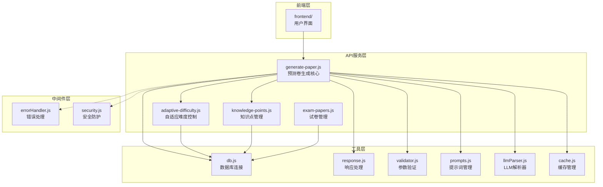

**图表来源**
- [generate-paper.js](file://api/generate-paper.js)
- [adaptive-difficulty.js](file://api/adaptive-difficulty.js)
- [knowledge-points.js](file://api/knowledge-points.js)
- [db.js](file://api/db.js)
- [response.js](file://api/utils/response.js)

**章节来源**
- [generate-paper.js](file://api/generate-paper.js)
- [adaptive-difficulty.js](file://api/adaptive-difficulty.js)
- [knowledge-points.js](file://api/knowledge-points.js)

## 核心组件

### 预测卷生成引擎

预测卷生成引擎是整个系统的核心组件，负责协调各个子模块完成完整的试卷生成流程。

#### 主要职责
- 接收用户请求和配置参数
- 调度难度自适应模块
- 管理知识点覆盖率计算
- 协调数据库操作
- 处理LLM生成逻辑

#### 关键数据结构

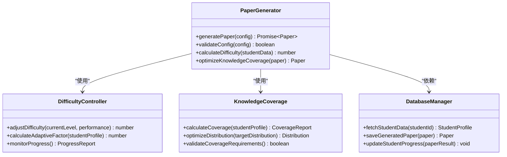

**图表来源**
- [generate-paper.js](file://api/generate-paper.js)
- [adaptive-difficulty.js](file://api/adaptive-difficulty.js)
- [knowledge-points.js](file://api/knowledge-points.js)

### 自适应难度控制系统

难度控制系统是预测卷生成的核心算法模块，通过分析学生的学习表现动态调整题目难度。

#### 算法原理

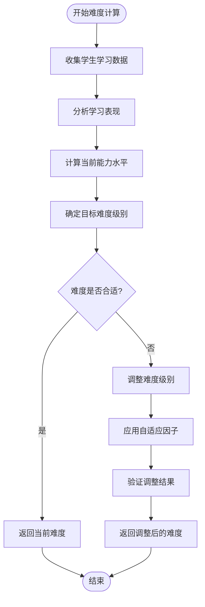

**图表来源**
- [adaptive-difficulty.js](file://api/adaptive-difficulty.js)

### 知识点覆盖率管理

知识点覆盖率模块确保生成的练习卷能够有效覆盖重要的知识要点。

#### 覆盖率计算模型

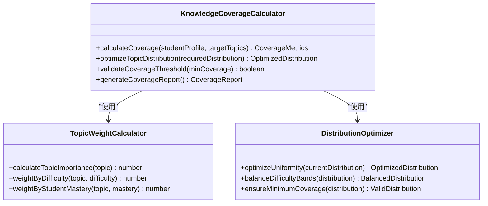

**图表来源**
- [knowledge-points.js](file://api/knowledge-points.js)

**章节来源**
- [generate-paper.js](file://api/generate-paper.js)
- [adaptive-difficulty.js](file://api/adaptive-difficulty.js)
- [knowledge-points.js](file://api/knowledge-points.js)

## 架构概览

AI家教预测卷生成系统的整体架构采用分层设计，确保了系统的可扩展性和可维护性。

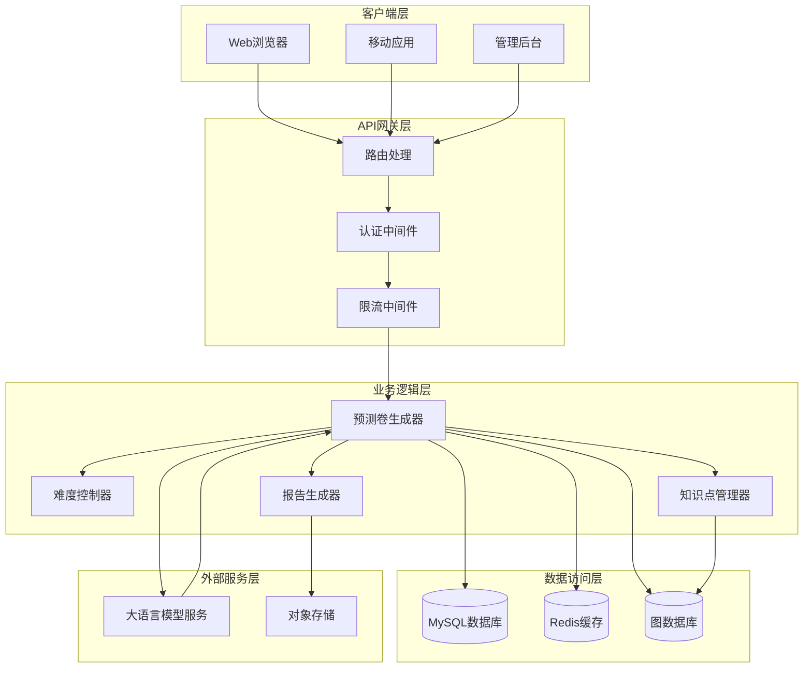

**图表来源**
- [server.js](file://server.js)
- [generate-paper.js](file://api/generate-paper.js)
- [adaptive-difficulty.js](file://api/adaptive-difficulty.js)
- [knowledge-points.js](file://api/knowledge-points.js)

### 数据流处理

预测卷生成的数据流遵循严格的处理顺序，确保每个步骤都有明确的输入输出。

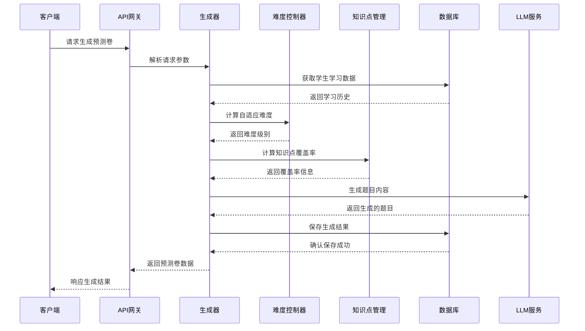

**图表来源**
- [generate-paper.js](file://api/generate-paper.js)
- [adaptive-difficulty.js](file://api/adaptive-difficulty.js)
- [knowledge-points.js](file://api/knowledge-points.js)

## 详细组件分析

### 预测卷生成器实现

预测卷生成器是系统的核心业务逻辑组件，负责协调所有子模块完成完整的预测卷生成过程。

#### 核心算法流程

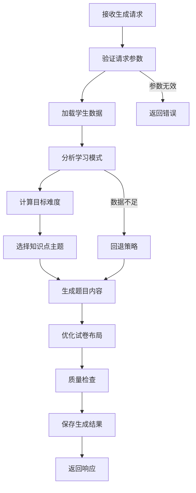

**图表来源**
- [generate-paper.js](file://api/generate-paper.js)

#### 参数配置详解

预测卷生成器支持丰富的配置参数，以满足不同场景的需求：

| 参数名称 | 类型 | 必需 | 默认值 | 描述 |
|---------|------|------|--------|------|
| studentId | string | 是 | - | 学生唯一标识符 |
| subject | string | 是 | - | 学科类型（数学/语文/英语等） |
| paperType | string | 否 | "personalized" | 试卷类型 |
| totalQuestions | number | 否 | 20 | 总题数 |
| difficultyRange | array | 否 | [0.3, 0.7] | 难度范围 |
| knowledgeWeights | object | 否 | {} | 知识点权重配置 |
| timeLimit | number | 否 | 120 | 作答时间限制（分钟） |
| includeAnalysis | boolean | 否 | false | 是否包含分析报告 |

**章节来源**
- [generate-paper.js](file://api/generate-paper.js)

### 自适应难度调节机制

自适应难度调节是预测卷生成系统的核心算法之一，通过机器学习和数据分析技术实现智能化的难度控制。

#### 难度计算模型

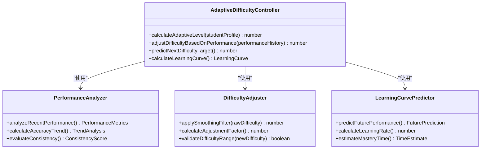

**图表来源**
- [adaptive-difficulty.js](file://api/adaptive-difficulty.js)

#### 难度调节策略

系统采用多层次的难度调节策略，确保生成的练习卷既具有挑战性又不会超出学生的能力范围：

1. **短期调节**：基于最近几次练习的表现进行快速调整
2. **中期调节**：结合一段时间内的学习趋势进行平衡
3. **长期调节**：考虑学生的整体学习进度和能力发展

**章节来源**
- [adaptive-difficulty.js](file://api/adaptive-difficulty.js)

### 知识点覆盖率计算

知识点覆盖率计算模块确保生成的练习卷能够有效覆盖重要的知识要点，提高学习效果。

#### 覆盖率计算算法

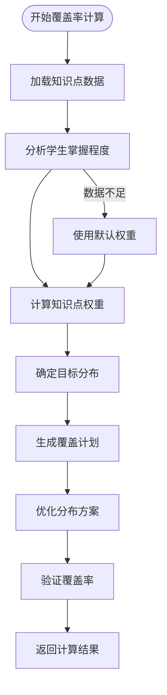

**图表来源**
- [knowledge-points.js](file://api/knowledge-points.js)

#### 覆盖率优化策略

系统采用智能优化算法确保知识点的均匀分布和有效覆盖：

1. **权重分配**：根据知识点的重要性和学生掌握情况进行权重分配
2. **分布优化**：通过算法优化确保各知识点的覆盖均匀性
3. **质量保证**：设置最低覆盖率阈值，确保关键知识点不被遗漏

**章节来源**
- [knowledge-points.js](file://api/knowledge-points.js)

### 数据库交互设计

预测卷生成系统与数据库的交互设计遵循最佳实践，确保数据的一致性和完整性。

#### 数据模型设计

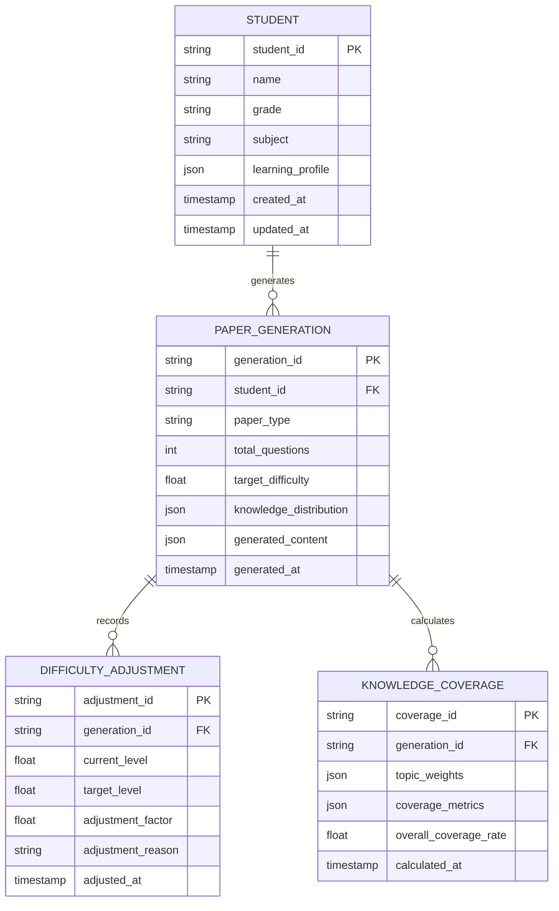

**图表来源**
- [db.js](file://api/db.js)

**章节来源**
- [db.js](file://api/db.js)

## 依赖关系分析

预测卷生成API的依赖关系体现了模块化设计的优势，各组件之间保持松耦合的结构。

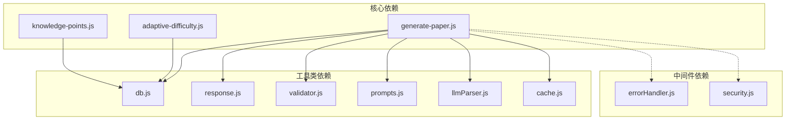

**图表来源**
- [generate-paper.js](file://api/generate-paper.js)
- [adaptive-difficulty.js](file://api/adaptive-difficulty.js)
- [knowledge-points.js](file://api/knowledge-points.js)

### 外部依赖管理

系统对外部依赖进行了良好的封装和管理：

| 依赖名称 | 版本 | 用途 | 依赖类型 |
|---------|------|------|----------|
| mysql2 | ^3.0.0 | 数据库连接 | 运行时依赖 |
| redis | ^4.6.0 | 缓存管理 | 运行时依赖 |
| axios | ^1.3.0 | HTTP请求 | 运行时依赖 |
| lodash | ^4.17.21 | 工具函数 | 运行时依赖 |
| express | ^4.18.0 | Web框架 | 运行时依赖 |
| dotenv | ^16.3.0 | 环境变量 | 开发依赖 |

**章节来源**
- [generate-paper.js](file://api/generate-paper.js)
- [adaptive-difficulty.js](file://api/adaptive-difficulty.js)
- [knowledge-points.js](file://api/knowledge-points.js)

## 性能考虑

预测卷生成API在设计时充分考虑了性能优化，采用多种策略确保系统的高效运行。

### 缓存策略

系统实现了多层缓存机制，包括内存缓存、分布式缓存和数据库查询缓存：

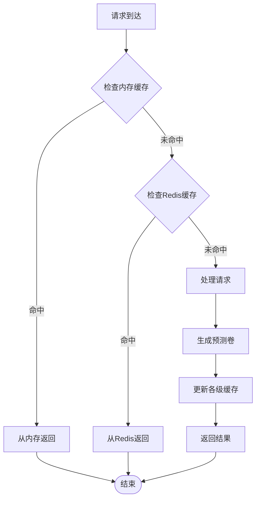

**图表来源**
- [cache.js](file://api/utils/cache.js)

### 性能优化措施

1. **异步处理**：大量使用Promise和async/await确保非阻塞操作
2. **批量操作**：对数据库操作进行批量处理，减少网络往返
3. **连接池管理**：合理配置数据库连接池，避免资源浪费
4. **请求限流**：实施API限流策略，防止系统过载
5. **压缩传输**：启用Gzip压缩，减少网络传输量

### 监控指标

系统监控关键性能指标以确保服务质量：

| 指标名称 | 目标值 | 监控频率 | 告警阈值 |
|---------|--------|----------|----------|
| 响应时间 | < 200ms | 实时 | < 500ms |
| API吞吐量 | > 100 req/s | 每分钟 | < 50 req/s |
| 内存使用率 | < 70% | 每5分钟 | > 80% |
| CPU使用率 | < 80% | 每5分钟 | > 90% |
| 错误率 | < 1% | 每小时 | > 5% |

## 故障排除指南

预测卷生成API提供了完善的错误处理和故障排除机制。

### 常见错误类型及解决方案

#### 参数验证错误

| 错误代码 | 错误类型 | 可能原因 | 解决方案 |
|---------|----------|----------|----------|
| 400 | INVALID_PARAMETER | 参数格式不正确 | 检查请求参数格式和类型 |
| 400 | MISSING_PARAMETER | 缺少必需参数 | 确保所有必需参数都已提供 |
| 400 | OUT_OF_RANGE | 参数值超出范围 | 调整参数值到允许范围内 |

#### 业务逻辑错误

| 错误代码 | 错误类型 | 可能原因 | 解决方案 |
|---------|----------|----------|----------|
| 422 | INSUFFICIENT_DATA | 学生数据不足 | 收集更多学习数据后再试 |
| 422 | COVERAGE_CALCULATION_FAILED | 覆盖率计算失败 | 检查知识点数据完整性 |
| 500 | DIFFICULTY_ADJUSTMENT_ERROR | 难度调节异常 | 检查算法逻辑和数据质量 |

#### 系统错误

| 错误代码 | 错误类型 | 可能原因 | 解决方案 |
|---------|----------|----------|----------|
| 500 | DATABASE_ERROR | 数据库连接失败 | 检查数据库状态和连接配置 |
| 500 | LLM_SERVICE_UNAVAILABLE | LLM服务不可用 | 检查外部服务状态和网络连接 |
| 503 | SERVICE_TEMPORARILY_UNAVAILABLE | 服务暂时不可用 | 稍后重试或检查系统负载 |

### 调试工具和方法

1. **日志分析**：通过详细的日志记录定位问题根因
2. **性能监控**：使用APM工具监控系统性能指标
3. **单元测试**：编写和运行单元测试验证功能正确性
4. **集成测试**：模拟完整的工作流程进行端到端测试

**章节来源**
- [response.js](file://api/utils/response.js)
- [validator.js](file://api/utils/validator.js)
- [errorHandler.js](file://api/middleware/errorHandler.js)

## 结论

AI家教项目的预测卷生成API是一个功能完善、架构合理的智能化系统。通过采用模块化设计、多层缓存优化和智能算法，系统能够为学生提供高质量的个性化学习体验。

### 主要成就

1. **智能化程度高**：通过机器学习算法实现自适应难度调节
2. **覆盖面广**：确保知识点的有效覆盖和均匀分布
3. **性能优异**：多层缓存和优化策略确保快速响应
4. **扩展性强**：模块化设计便于功能扩展和维护

### 未来发展方向

1. **算法优化**：持续改进难度计算和知识点覆盖率算法
2. **个性化增强**：增加更多个性化定制选项
3. **多模态支持**：扩展音频、视频等多媒体内容支持
4. **实时反馈**：提供更及时的学习反馈和指导

## 附录

### API使用示例

#### 基础请求格式

```javascript
// 基础请求示例
const requestData = {
  studentId: "STU001",
  subject: "mathematics",
  totalQuestions: 25,
  difficultyRange: [0.3, 0.7],
  timeLimit: 120
};

// 发送请求
const response = await fetch('/api/generate-paper', {
  method: 'POST',
  headers: {
    'Content-Type': 'application/json'
  },
  body: JSON.stringify(requestData)
});
```

#### 高级配置示例

```javascript
// 高级配置示例
const advancedConfig = {
  studentId: "STU001",
  subject: "chinese",
  paperType: "comprehensive",
  totalQuestions: 30,
  difficultyRange: [0.4, 0.8],
  knowledgeWeights: {
    "modernLiterature": 0.3,
    "classicalChinese": 0.25,
    "languageFoundation": 0.2,
    "writingSkills": 0.25
  },
  includeAnalysis: true,
  includeAnswerKey: true
};
```

### 最佳实践建议

1. **参数验证**：始终验证输入参数的有效性和完整性
2. **错误处理**：实现完善的错误处理和用户友好的错误消息
3. **性能监控**：建立全面的性能监控和告警机制
4. **安全防护**：实施必要的安全措施保护用户数据
5. **文档维护**：保持API文档的及时更新和准确性

### 版本兼容性

系统遵循语义化版本控制，主要版本变更包括：

- **v1.0.0**：初始版本发布
- **v1.1.0**：新增自适应难度调节功能
- **v1.2.0**：优化知识点覆盖率算法
- **v2.0.0**：重构核心算法，提升性能