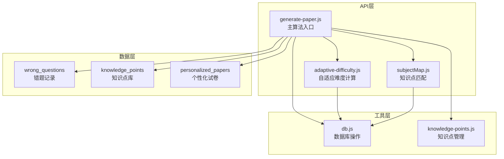
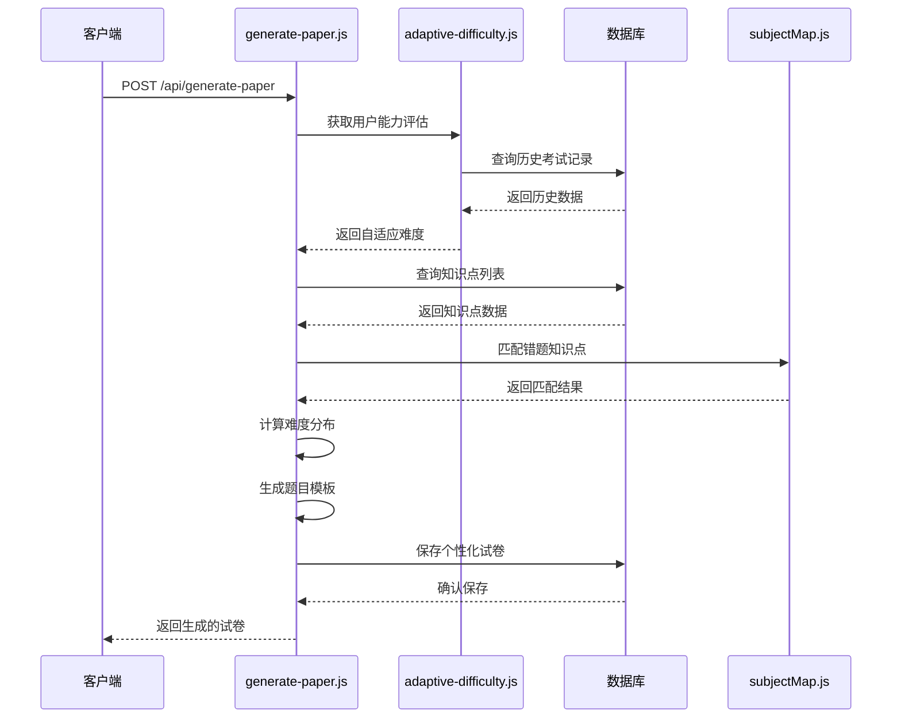
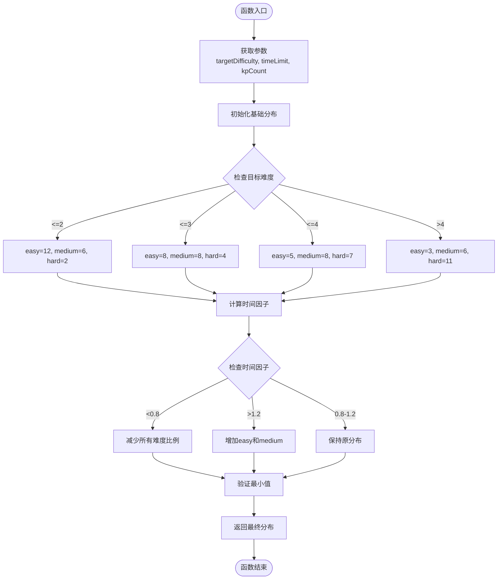
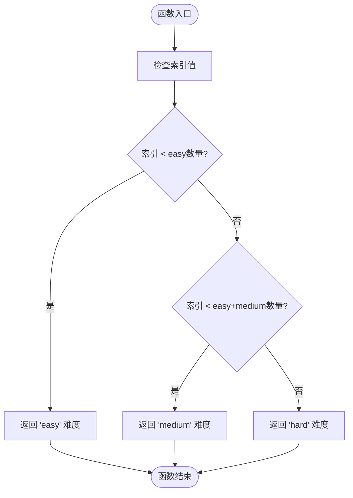
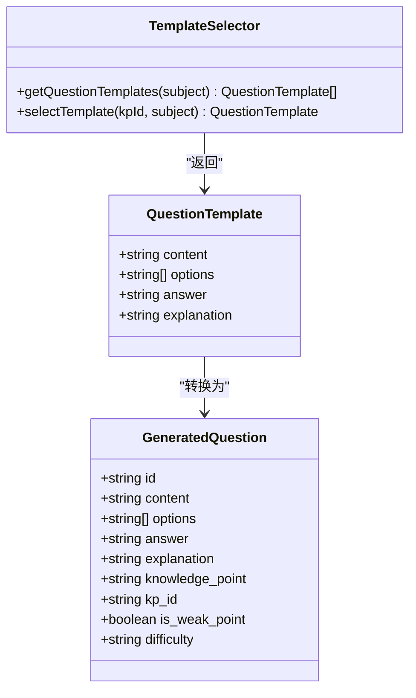
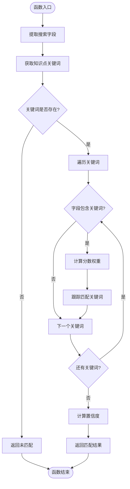
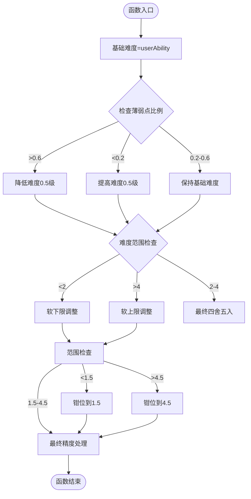
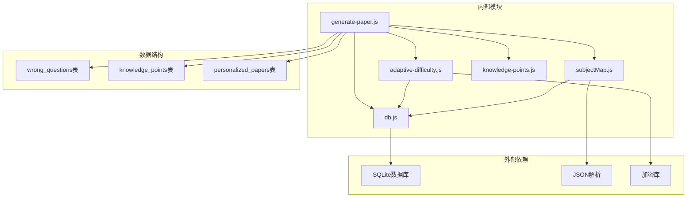

# 预测卷生成核心算法

<cite>
**本文档引用的文件**
- [generate-paper.js](file://api/generate-paper.js)
- [adaptive-difficulty.js](file://api/adaptive-difficulty.js)
- [subjectMap.js](file://api/utils/subjectMap.js)
- [db.js](file://api/db.js)
- [knowledge-points.js](file://api/knowledge-points.js)
</cite>

## 目录
1. [简介](#简介)
2. [项目结构](#项目结构)
3. [核心组件](#核心组件)
4. [架构概览](#架构概览)
5. [详细组件分析](#详细组件分析)
6. [依赖关系分析](#依赖关系分析)
7. [性能考虑](#性能考虑)
8. [故障排除指南](#故障排除指南)
9. [结论](#结论)

## 简介

AI家教项目的预测卷生成核心算法是一个智能化的个性化练习卷生成系统，旨在根据学生的知识掌握情况和学习能力，自动生成符合学生当前水平的个性化练习卷。该系统通过深度分析学生的历史答题记录、知识薄弱点识别、自适应难度计算等核心功能，为每个学生提供量身定制的学习体验。

系统支持九大学科（数学、语文、英语、物理、化学、政治、生物、历史、地理），每个学科都配备了丰富的题目模板和知识点覆盖。算法的核心在于如何将学生的学习数据转化为个性化的题目分布，确保练习既能够巩固基础知识，又能够适度挑战学生的认知边界。

## 项目结构

预测卷生成算法主要分布在以下核心文件中：

**图表来源**
- [generate-paper.js:1-50](file://api/generate-paper.js#L1-L50)
- [adaptive-difficulty.js:1-25](file://api/adaptive-difficulty.js#L1-L25)
- [subjectMap.js:1-25](file://api/utils/subjectMap.js#L1-L25)

**章节来源**
- [generate-paper.js:1-50](file://api/generate-paper.js#L1-L50)
- [db.js:128-146](file://api/db.js#L128-L146)

## 核心组件

预测卷生成系统由以下几个核心组件构成：

### 1. 主算法引擎
负责整个预测卷生成流程的协调和控制，包括参数处理、知识点匹配、难度分布计算、题目生成等核心逻辑。

### 2. 自适应难度计算模块
基于学生历史表现数据，动态计算适合当前学习阶段的题目难度，确保练习的挑战性和有效性。

### 3. 知识点匹配引擎
通过关键词匹配算法，识别学生错题中涉及的知识点，量化薄弱程度，为个性化推荐提供依据。

### 4. 题目模板系统
为各个学科提供丰富的题目模板，支持选择题、填空题、解答题等多种题型的自动生成。

**章节来源**
- [generate-paper.js:6-153](file://api/generate-paper.js#L6-L153)
- [adaptive-difficulty.js:44-75](file://api/adaptive-difficulty.js#L44-L75)
- [subjectMap.js:264-295](file://api/utils/subjectMap.js#L264-L295)

## 架构概览

预测卷生成算法采用分层架构设计，确保各组件职责清晰、耦合度低：

**图表来源**
- [generate-paper.js:11-67](file://api/generate-paper.js#L11-L67)
- [adaptive-difficulty.js:44-75](file://api/adaptive-difficulty.js#L44-L75)
- [subjectMap.js:268-295](file://api/utils/subjectMap.js#L268-L295)

## 详细组件分析

### 算法参数配置

预测卷生成算法支持多种可配置参数：

| 参数名称 | 类型 | 默认值 | 描述 |
|---------|------|--------|------|
| subject | string | 'math' | 学科代码 |
| difficulty | number | null | 目标难度等级（1-5） |
| timeLimit | number | 120 | 作答时间限制（分钟） |
| focusWeakPoints | boolean | true | 是否重点关注薄弱知识点 |
| adaptive | boolean | true | 是否启用自适应难度 |

**章节来源**
- [generate-paper.js:13-20](file://api/generate-paper.js#L13-L20)

### calculateDistribution 函数详解

`calculateDistribution` 函数是难度分布计算的核心算法，负责根据目标难度和时间限制生成合理的题目数量分布：

**图表来源**
- [generate-paper.js:155-184](file://api/generate-paper.js#L155-L184)

算法特点：
1. **难度分级策略**：根据目标难度设置不同的基础分布比例
2. **时间适应性**：根据时间限制调整题目数量，确保在规定时间内完成
3. **最小值保护**：确保每种难度至少有最低数量的题目

**章节来源**
- [generate-paper.js:155-184](file://api/generate-paper.js#L155-L184)

### getDifficultyForIndex 函数分析

`getDifficultyForIndex` 函数实现了难度分配的索引映射逻辑：

**图表来源**
- [generate-paper.js:186-190](file://api/generate-paper.js#L186-L190)

算法实现：
1. **累积分布映射**：基于累积和的难度分配策略
2. **均匀分布**：确保不同难度的题目在序列中均匀分布
3. **简单高效**：O(1) 时间复杂度的难度分配

**章节来源**
- [generate-paper.js:186-190](file://api/generate-paper.js#L186-L190)

### generateSelectionQuestion 函数实现

`generateSelectionQuestion` 函数负责生成选择题：

**图表来源**
- [generate-paper.js:192-219](file://api/generate-paper.js#L192-L219)

函数特性：
1. **模板优先**：优先使用知识点对应的模板题目
2. **默认回退**：当模板不存在时生成通用题目
3. **属性增强**：添加知识点、难度、弱项标识等属性

**章节来源**
- [generate-paper.js:192-219](file://api/generate-paper.js#L192-L219)

### generateFillQuestion 和 generateSolutionQuestion

这两个函数分别处理填空题和解答题的生成：

| 函数名 | 特点 | 难度分配 | 分数设置 |
|-------|------|----------|----------|
| generateFillQuestion | 结构化填空 | 前2题easy，后2题medium | 固定5分 |
| generateSolutionQuestion | 综合解答题 | 压轴题hard，其他medium | [12,12,14]分 |

**章节来源**
- [generate-paper.js:221-246](file://api/generate-paper.js#L221-L246)

### 知识点匹配算法

`matchWeakPoint` 函数实现了核心的知识点匹配逻辑：

**图表来源**
- [subjectMap.js:268-295](file://api/utils/subjectMap.js#L268-L295)

算法特点：
1. **多字段搜索**：支持分析、解题过程、线索、元数据等多个字段
2. **权重计算**：核心关键词权重更高（2分 vs 1分）
3. **置信度评估**：基于匹配关键词占总关键词的比例

**章节来源**
- [subjectMap.js:268-295](file://api/utils/subjectMap.js#L268-L295)

### 自适应难度计算

`calculateAdaptiveDifficulty` 函数实现了智能难度调整：

**图表来源**
- [adaptive-difficulty.js:26-42](file://api/adaptive-difficulty.js#L26-L42)

**章节来源**
- [adaptive-difficulty.js:26-42](file://api/adaptive-difficulty.js#L26-L42)

## 依赖关系分析

预测卷生成算法的依赖关系如下：

**图表来源**
- [generate-paper.js:1-5](file://api/generate-paper.js#L1-L5)
- [adaptive-difficulty.js:1-4](file://api/adaptive-difficulty.js#L1-L4)

**章节来源**
- [generate-paper.js:1-5](file://api/generate-paper.js#L1-L5)
- [adaptive-difficulty.js:1-4](file://api/adaptive-difficulty.js#L1-L4)

## 性能考虑

### 时间复杂度分析

1. **知识点匹配**：O(K×Q×F)，其中K为关键词数量，Q为错题数量，F为字段数量
2. **难度分布计算**：O(1)，常数时间复杂度
3. **题目生成**：O(T)，T为总题目数量
4. **整体复杂度**：O(K×Q×F + T)

### 空间复杂度分析

1. **缓存结构**：O(K + Q + T)
2. **中间结果**：O(Q + K)
3. **输出结果**：O(T)

### 优化策略

1. **索引优化**：数据库已建立多个复合索引，提升查询性能
2. **模板缓存**：题目模板按学科缓存，避免重复加载
3. **批量操作**：使用批量查询减少数据库往返
4. **内存管理**：及时释放不需要的大对象

## 故障排除指南

### 常见问题及解决方案

| 问题类型 | 症状 | 可能原因 | 解决方案 |
|---------|------|----------|----------|
| 无知识点数据 | 返回400错误 | 知识点表为空 | 检查数据库初始化 |
| 难度计算异常 | 题目数量不正确 | 参数传入错误 | 验证输入参数范围 |
| 知识点匹配失败 | 未识别薄弱点 | 关键词映射缺失 | 检查KEYWORD_MAP配置 |
| 题目模板缺失 | 生成通用题目 | 模板未配置 | 补充学科模板 |

### 调试建议

1. **日志记录**：在关键节点添加详细日志
2. **单元测试**：为每个函数编写独立测试用例
3. **性能监控**：监控数据库查询时间和内存使用
4. **错误处理**：完善异常捕获和错误反馈机制

**章节来源**
- [generate-paper.js:34-36](file://api/generate-paper.js#L34-L36)
- [p1-business-logic.test.js:205-250](file://tests/api/p1-business-logic.test.js#L205-L250)

## 结论

AI家教项目的预测卷生成核心算法通过精心设计的分层架构和高效的算法实现，为学生提供了个性化的学习体验。算法的核心优势包括：

1. **智能化难度控制**：基于学生能力的自适应难度计算
2. **精准知识点定位**：通过关键词匹配识别薄弱环节
3. **灵活的题目生成**：支持多种题型和学科的模板化生成
4. **可扩展的架构设计**：模块化设计便于功能扩展和维护

该算法为AI家教平台提供了坚实的技术基础，能够有效提升学生的学习效果和学习兴趣。通过持续的优化和扩展，该系统有望为更多的教育场景提供智能化的解决方案。