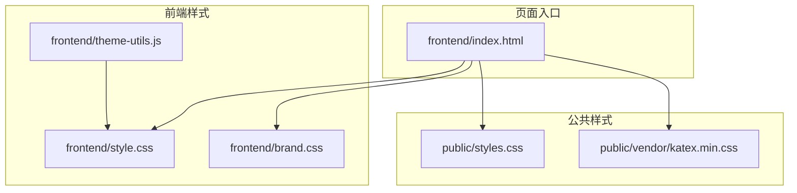
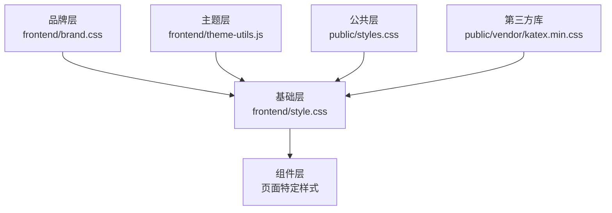
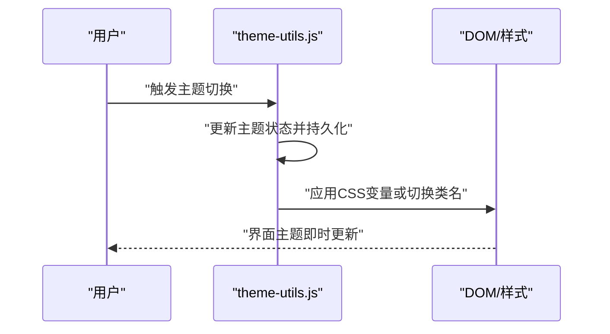
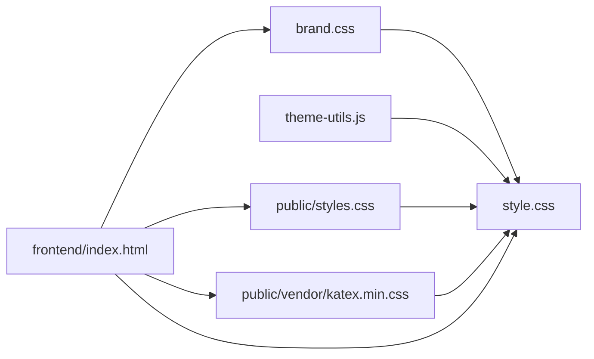

# CSS样式系统

<cite>
**本文引用的文件**
- [frontend/style.css](file://frontend/style.css)
- [frontend/brand.css](file://frontend/brand.css)
- [frontend/theme-utils.js](file://frontend/theme-utils.js)
- [public/styles.css](file://public/styles.css)
- [public/vendor/katex.min.css](file://public/vendor/katex.min.css)
</cite>

## 目录
1. [引言](#引言)
2. [项目结构](#项目结构)
3. [核心组件](#核心组件)
4. [架构总览](#架构总览)
5. [详细组件分析](#详细组件分析)
6. [依赖分析](#依赖分析)
7. [性能考虑](#性能考虑)
8. [故障排查指南](#故障排查指南)
9. [结论](#结论)
10. [附录](#附录)

## 引言
本文件面向AI家教项目的前端样式系统，系统性梳理样式架构设计、CSS变量与主题体系、响应式与跨浏览器策略、模块化与复用实践，并提供调试与优化建议。文档以仓库中现有的样式文件为基础进行分析，结合可复用的工具脚本，帮助开发者在不破坏现有风格的前提下扩展与维护样式系统。

## 项目结构
样式相关资源分布于以下位置：
- 前端页面样式：frontend/style.css、frontend/brand.css
- 主题工具：frontend/theme-utils.js
- 公共样式与第三方库：public/styles.css、public/vendor/katex.min.css
- 页面入口：frontend/index.html 等（用于验证样式加载顺序）

**图表来源**
- [frontend/style.css](file://frontend/style.css)
- [frontend/brand.css](file://frontend/brand.css)
- [frontend/theme-utils.js](file://frontend/theme-utils.js)
- [public/styles.css](file://public/styles.css)
- [public/vendor/katex.min.css](file://public/vendor/katex.min.css)
- [frontend/index.html](file://frontend/index.html)

**章节来源**
- [frontend/style.css](file://frontend/style.css)
- [frontend/brand.css](file://frontend/brand.css)
- [frontend/theme-utils.js](file://frontend/theme-utils.js)
- [public/styles.css](file://public/styles.css)
- [public/vendor/katex.min.css](file://public/vendor/katex.min.css)
- [frontend/index.html](file://frontend/index.html)

## 核心组件
- 品牌与基础样式：frontend/brand.css 提供品牌色彩、字体与基础排版；frontend/style.css 负责通用布局与组件样式。
- 主题工具：frontend/theme-utils.js 提供主题切换与状态管理能力，支撑暗色模式等主题特性。
- 公共样式与第三方库：public/styles.css 作为公共层，public/vendor/katex.min.css 提供公式渲染样式。

关键职责划分：
- 品牌层：定义品牌色板、字体族、字号与行高。
- 基础层：定义全局重置、排版、栅格与通用组件基类。
- 组件层：按页面功能拆分样式，遵循模块化与可复用原则。
- 主题层：通过CSS变量与工具函数实现主题切换与持久化。

**章节来源**
- [frontend/brand.css](file://frontend/brand.css)
- [frontend/style.css](file://frontend/style.css)
- [frontend/theme-utils.js](file://frontend/theme-utils.js)
- [public/styles.css](file://public/styles.css)

## 架构总览
整体采用“品牌层-基础层-组件层-主题层”的分层架构，页面通过入口HTML统一引入各层样式与工具脚本，确保加载顺序与优先级可控。

**图表来源**
- [frontend/brand.css](file://frontend/brand.css)
- [frontend/style.css](file://frontend/style.css)
- [frontend/theme-utils.js](file://frontend/theme-utils.js)
- [public/styles.css](file://public/styles.css)
- [public/vendor/katex.min.css](file://public/vendor/katex.min.css)

## 详细组件分析

### 品牌与色彩系统
- 品牌色板：在品牌样式文件中集中定义主色、辅色与语义色，便于全局替换与一致性维护。
- 字体规范：定义中英文字体族、字号层级与行高，确保阅读体验一致。
- 间距系统：基于统一步进的间距单位，减少硬编码值，提升可维护性。

建议实践：
- 使用CSS自定义属性（变量）承载品牌色与尺寸，避免重复声明。
- 将常用颜色与字体族映射到语义名称（如“成功”、“警告”），降低耦合度。

**章节来源**
- [frontend/brand.css](file://frontend/brand.css)

### 响应式设计与断点
- 断点策略：在基础样式中定义移动端优先的断点，配合媒体查询适配不同屏幕尺寸。
- 布局方式：采用流式布局与弹性网格相结合的方式，保证内容在小屏与大屏均具有良好可读性。
- 触控与交互：针对触摸设备优化按钮与导航元素的尺寸与间距。

**章节来源**
- [frontend/style.css](file://frontend/style.css)

### 主题系统与暗色模式
- CSS变量驱动：通过根节点或主题容器上的CSS变量控制颜色与背景，实现快速切换。
- 切换机制：theme-utils.js 提供主题状态管理与持久化，页面加载时根据状态应用对应变量集。
- 渐进增强：对不支持CSS变量的旧浏览器提供降级方案（如固定浅色主题）。

**图表来源**
- [frontend/theme-utils.js](file://frontend/theme-utils.js)
- [frontend/style.css](file://frontend/style.css)

**章节来源**
- [frontend/theme-utils.js](file://frontend/theme-utils.js)
- [frontend/style.css](file://frontend/style.css)

### 模块化开发与命名约定
- 文件模块化：按页面或功能域拆分样式文件，避免单文件膨胀；通过入口HTML统一引入。
- 组件命名：建议采用BEM或类似前缀体系，明确块、元素与修饰符，提升可读性与可维护性。
- 复用策略：将高频样式抽象为可复用的类，减少重复代码；通过变量与混入（mixins）实现参数化复用。

**章节来源**
- [frontend/style.css](file://frontend/style.css)
- [frontend/brand.css](file://frontend/brand.css)

### 动画与过渡效果
- 进度与反馈：为按钮、模态框与加载状态添加平滑过渡，提升交互体验。
- 性能优化：优先使用transform与opacity等硬件加速属性，避免频繁触发布局与绘制。

**章节来源**
- [frontend/style.css](file://frontend/style.css)

### 跨浏览器兼容性
- 语法降级：对不支持的现代CSS特性提供回退方案；对flexbox与grid使用兼容前缀。
- 第三方库：引入第三方样式（如KaTeX）时，确保版本稳定且与项目主题兼容。

**章节来源**
- [public/vendor/katex.min.css](file://public/vendor/katex.min.css)
- [public/styles.css](file://public/styles.css)

## 依赖分析
样式系统的依赖关系如下：

**图表来源**
- [frontend/brand.css](file://frontend/brand.css)
- [frontend/style.css](file://frontend/style.css)
- [frontend/theme-utils.js](file://frontend/theme-utils.js)
- [public/styles.css](file://public/styles.css)
- [public/vendor/katex.min.css](file://public/vendor/katex.min.css)
- [frontend/index.html](file://frontend/index.html)

**章节来源**
- [frontend/brand.css](file://frontend/brand.css)
- [frontend/style.css](file://frontend/style.css)
- [frontend/theme-utils.js](file://frontend/theme-utils.js)
- [public/styles.css](file://public/styles.css)
- [public/vendor/katex.min.css](file://public/vendor/katex.min.css)
- [frontend/index.html](file://frontend/index.html)

## 性能考虑
- 样式体积控制：合并与压缩样式文件，移除未使用选择器；按需加载页面特定样式。
- 加载顺序：将通用样式置于首屏优先区域，避免阻塞渲染；第三方库独立加载。
- 变量与缓存：利用CSS变量减少重复计算；合理设置HTTP缓存头。
- 动画优化：避免在动画过程中触发布局抖动；使用will-change或transform/opacity。

[本节为通用指导，无需列出具体文件来源]

## 故障排查指南
- 主题不生效：检查主题工具是否正确写入CSS变量或切换类名；确认页面是否在主题变更后重新应用样式。
- 样式覆盖冲突：使用更具体的选择器或调整加载顺序；避免内联样式覆盖外部样式。
- 第三方样式冲突：隔离第三方样式作用域，必要时使用CSS模块或命名空间。
- 响应式异常：核对媒体查询断点与设备宽度；确保移动端优先的断点顺序正确。

**章节来源**
- [frontend/theme-utils.js](file://frontend/theme-utils.js)
- [frontend/style.css](file://frontend/style.css)
- [public/vendor/katex.min.css](file://public/vendor/katex.min.css)

## 结论
AI家教项目的样式系统以品牌层、基础层、组件层与主题层的清晰分层为基础，结合CSS变量与工具脚本实现了可扩展的主题体系与良好的响应式表现。通过模块化与命名约定，样式具备较好的可维护性；配合性能优化与兼容性策略，可在多环境下稳定运行。后续建议进一步完善变量文档与组件规范，持续提升团队协作效率与用户体验。

## 附录
- 实际样式示例与调试技巧可参考以下文件路径：
  - [frontend/brand.css](file://frontend/brand.css)
  - [frontend/style.css](file://frontend/style.css)
  - [frontend/theme-utils.js](file://frontend/theme-utils.js)
  - [public/styles.css](file://public/styles.css)
  - [public/vendor/katex.min.css](file://public/vendor/katex.min.css)