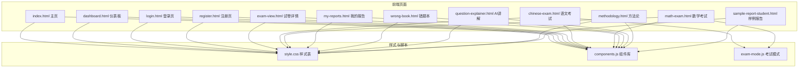
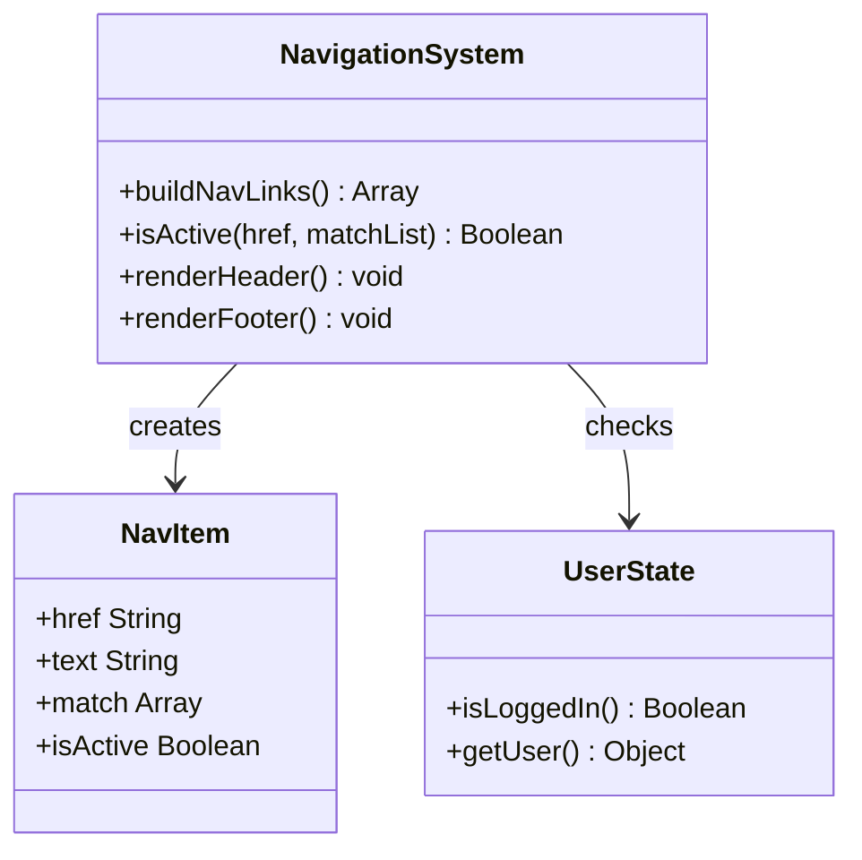
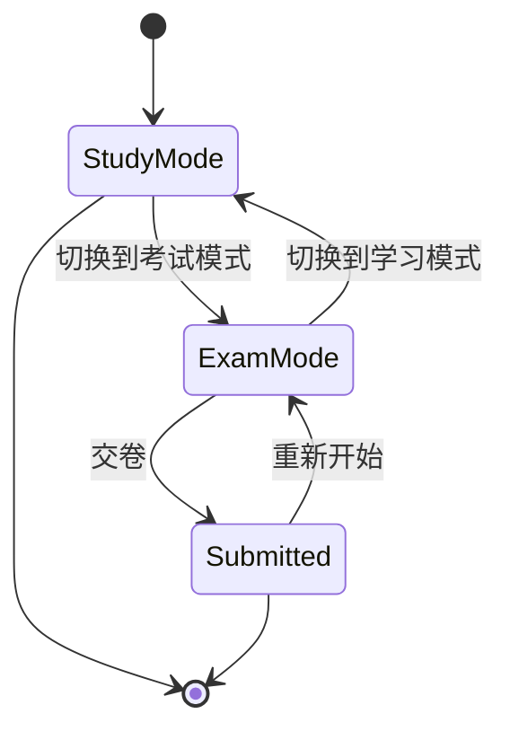
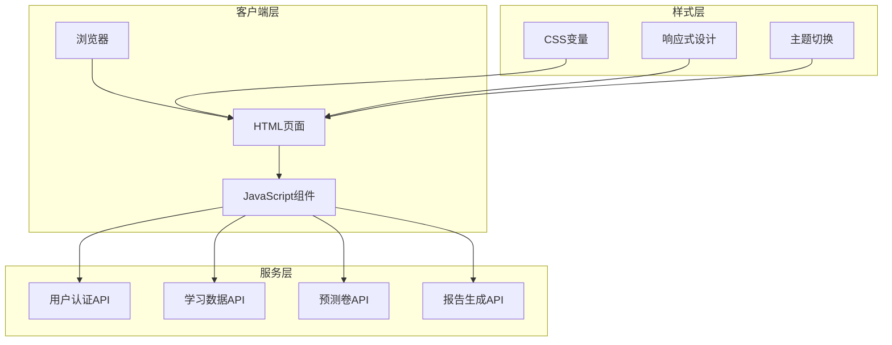
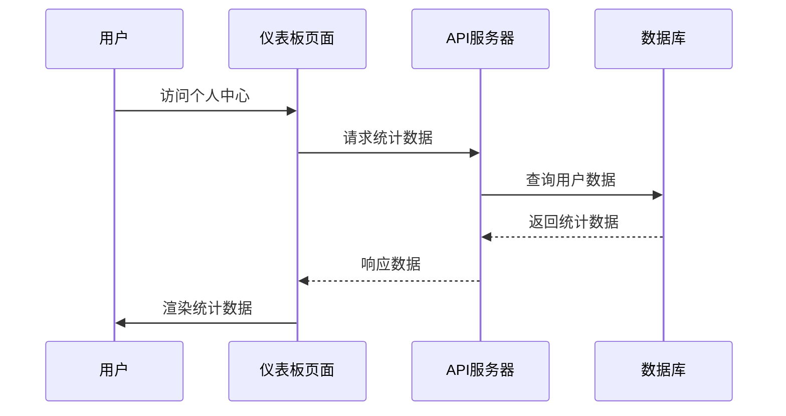
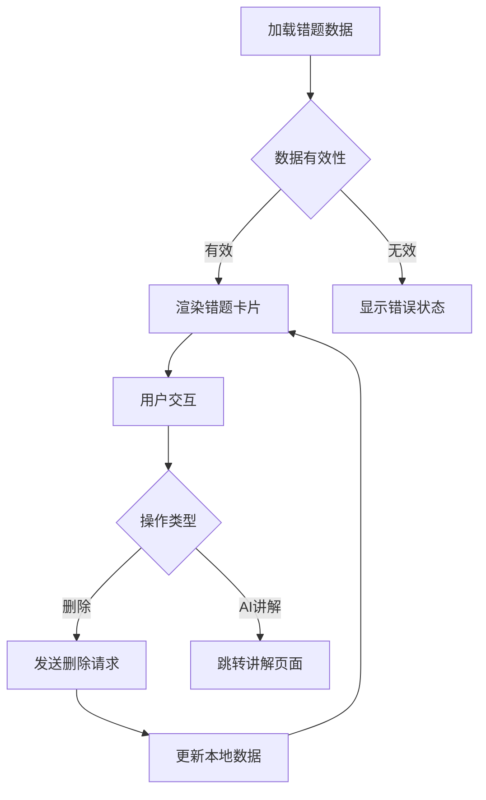
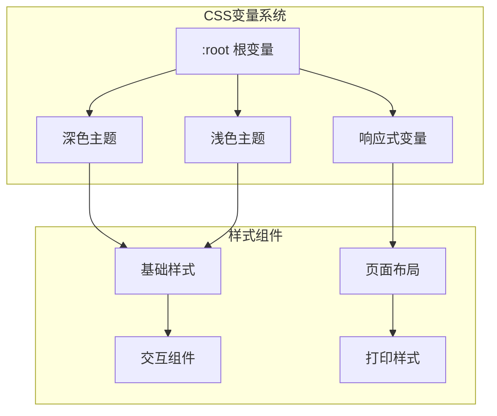
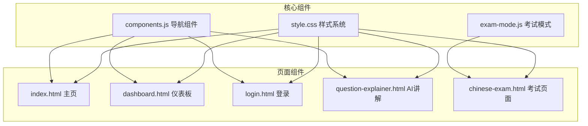

# HTML页面结构

<cite>
**本文档引用的文件**
- [index.html](file://frontend/index.html)
- [dashboard.html](file://frontend/dashboard.html)
- [exam-view.html](file://frontend/exam-view.html)
- [my-reports.html](file://frontend/my-reports.html)
- [wrong-book.html](file://frontend/wrong-book.html)
- [chinese-exam.html](file://frontend/chinese-exam.html)
- [math-exam.html](file://frontend/math-exam.html)
- [login.html](file://frontend/login.html)
- [register.html](file://frontend/register.html)
- [question-explainer.html](file://frontend/question-explainer.html)
- [methodology.html](file://frontend/methodology.html)
- [sample-report-student.html](file://frontend/sample-report-student.html)
- [style.css](file://frontend/style.css)
- [components.js](file://frontend/components.js)
- [exam-mode.js](file://frontend/exam-mode.js)
</cite>

## 目录
1. [引言](#引言)
2. [项目结构](#项目结构)
3. [核心组件](#核心组件)
4. [架构概览](#架构概览)
5. [详细组件分析](#详细组件分析)
6. [依赖分析](#依赖分析)
7. [性能考虑](#性能考虑)
8. [故障排除指南](#故障排除指南)
9. [结论](#结论)
10. [附录](#附录)

## 引言

AI家教项目是一个基于HTML/CSS/JavaScript的前端学习平台，专注于高考和中考的错题诊断与预测学习。该项目采用现代化的响应式设计，提供完整的用户认证、个性化学习路径、智能预测卷等功能。

## 项目结构

项目采用模块化设计，主要文件组织如下：



**图表来源**
- [index.html:1-462](file://frontend/index.html#L1-L462)
- [dashboard.html:1-508](file://frontend/dashboard.html#L1-L508)
- [style.css:1-609](file://frontend/style.css#L1-L609)
- [components.js:1-145](file://frontend/components.js#L1-L145)
- [exam-mode.js:1-288](file://frontend/exam-mode.js#L1-L288)

**章节来源**
- [index.html:1-462](file://frontend/index.html#L1-L462)
- [style.css:1-609](file://frontend/style.css#L1-L609)

## 核心组件

### 导航系统
项目实现了统一的导航组件，支持登录状态检测和动态菜单生成：



**图表来源**
- [components.js:16-34](file://frontend/components.js#L16-L34)
- [components.js:36-39](file://frontend/components.js#L36-L39)

### 考试模式引擎
提供学习模式和考试模式的无缝切换：



**图表来源**
- [exam-mode.js:56-118](file://frontend/exam-mode.js#L56-L118)
- [exam-mode.js:202-269](file://frontend/exam-mode.js#L202-L269)

**章节来源**
- [components.js:1-145](file://frontend/components.js#L1-L145)
- [exam-mode.js:1-288](file://frontend/exam-mode.js#L1-L288)

## 架构概览

项目采用前后端分离架构，前端负责用户界面展示，后端提供API服务：



**图表来源**
- [login.html:152-175](file://frontend/login.html#L152-L175)
- [dashboard.html:214-234](file://frontend/dashboard.html#L214-L234)
- [style.css:12-33](file://frontend/style.css#L12-L33)

## 详细组件分析

### 主页 (index.html)

主页作为项目的入口页面，采用现代化的设计理念：

#### 结构设计
- **Hero区域**：展示核心价值主张和产品特色
- **证据展示**：可信度证明和数据支撑
- **样例报告**：三种不同角色的报告展示
- **省份选择器**：支持高考和中考地区的切换
- **功能卡片**：核心功能的可视化展示

#### 语义化标记
```html
<section class="hero-new">
  <div class="hero-content">
    <h1>用历年真题和错题数据<br>生成你的 2026 备考路线图</h1>
    <p class="subtitle">AI Tutor 基于全国各省 17+ 年真题、官方政策、知识点图谱和学生错题数据...</p>
  </div>
</section>
```

#### 响应式设计
采用CSS Grid和Flexbox实现自适应布局：
- 大屏幕：双列布局，右侧预览面板
- 中等屏幕：单列布局，预览面板隐藏
- 移动设备：简化布局，优化触摸交互

**章节来源**
- [index.html:105-145](file://frontend/index.html#L105-L145)
- [index.html:227-236](file://frontend/index.html#L227-L236)
- [index.html:394-402](file://frontend/index.html#L394-L402)

### 仪表板 (dashboard.html)

个人中心页面提供用户学习数据的集中管理：

#### 用户界面组件
- **统计卡片**：错题总数、报告数量、薄弱知识点
- **省份设置**：用户地区偏好配置
- **功能导航**：学习工具和练习入口
- **拍照搜题**：集成AI图像识别功能

#### 数据流设计


**图表来源**
- [dashboard.html:213-234](file://frontend/dashboard.html#L213-L234)
- [dashboard.html:427-443](file://frontend/dashboard.html#L427-L443)

**章节来源**
- [dashboard.html:46-56](file://frontend/dashboard.html#L46-L56)
- [dashboard.html:204-267](file://frontend/dashboard.html#L204-L267)

### 考试页面 (exam-view.html)

试卷详情页面提供完整的题目展示和交互功能：

#### 页面结构
- **试卷头部**：科目、年份、地区信息
- **统计栏**：题目数量、总分、平均难度
- **题目列表**：标准化的题目卡片布局
- **答案解析**：可折叠的答案和解析区域

#### 交互功能
- **答案显示**：一键显示/隐藏答案
- **解析查看**：逐步展开解析内容
- **知识点标签**：显示相关知识点信息

**章节来源**
- [exam-view.html:59-67](file://frontend/exam-view.html#L59-L67)
- [exam-view.html:150-206](file://frontend/exam-view.html#L150-L206)

### 报告页面 (my-reports.html)

学习报告管理页面：

#### 数据展示
- **报告列表**：按学科分类的学习报告
- **状态指示**：报告生成状态和分数显示
- **操作功能**：跳转到具体报告页面

#### 用户体验
- **加载状态**：异步数据加载的视觉反馈
- **空状态**：无报告数据时的友好提示
- **错误处理**：网络异常时的错误信息展示

**章节来源**
- [my-reports.html:38-41](file://frontend/my-reports.html#L38-L41)
- [my-reports.html:89-115](file://frontend/my-reports.html#L89-L115)

### 错题本 (wrong-book.html)

错题管理系统：

#### 功能特性
- **学科过滤**：按数学、语文、英语等学科筛选
- **图片展示**：错题图片的缩略图显示
- **删除功能**：支持删除不需要的错题记录
- **AI讲解**：跳转到AI题目讲解页面

#### 数据处理


**图表来源**
- [wrong-book.html:70-80](file://frontend/wrong-book.html#L70-L80)
- [wrong-book.html:117-128](file://frontend/wrong-book.html#L117-L128)

**章节来源**
- [wrong-book.html:36-58](file://frontend/wrong-book.html#L36-L58)
- [wrong-book.html:82-113](file://frontend/wrong-book.html#L82-L113)

### 考试页面模板 (chinese-exam.html, math-exam.html)

标准化的考试页面模板：

#### 页面布局
- **打印友好**：完整的打印样式支持
- **计时器**：可选的考试计时功能
- **侧栏功能**：试卷分析、作答提示、设置选项
- **答案解析**：可折叠的答案和解析区域

#### 技术特性
- **KaTeX支持**：数学公式的渲染
- **主题适配**：深色和浅色主题的兼容
- **响应式设计**：移动端优化的布局

**章节来源**
- [chinese-exam.html:13-22](file://frontend/chinese-exam.html#L13-L22)
- [math-exam.html:19-29](file://frontend/math-exam.html#L19-L29)
- [chinese-exam.html:271-277](file://frontend/chinese-exam.html#L271-L277)

### 认证页面 (login.html, register.html)

用户认证系统：

#### 登录页面
- **表单验证**：邮箱和密码的客户端验证
- **游客模式**：无需注册的体验功能
- **错误处理**：清晰的错误信息展示

#### 注册页面
- **年级选择**：直观的年级选项选择
- **表单提交**：异步注册流程
- **状态反馈**：加载状态和错误提示

**章节来源**
- [login.html:101-122](file://frontend/login.html#L101-L122)
- [register.html:32-68](file://frontend/register.html#L32-L68)

### AI讲解页面 (question-explainer.html)

智能题目讲解功能：

#### 输入组件
- **学科选择**：支持多学科的题目讲解
- **知识点输入**：可选的知识点标签
- **题目输入**：富文本的题目描述区域

#### 输出展示
- **详细解析**：AI生成的解题思路
- **关键知识点**：相关知识点标签
- **变式题目**：同类题目的推荐

**章节来源**
- [question-explainer.html:55-71](file://frontend/question-explainer.html#L55-L71)
- [question-explainer.html:184-239](file://frontend/question-explainer.html#L184-L239)

### 方法论页面 (methodology.html)

透明度和可信度展示：

#### 内容结构
- **数据来源**：详细的原始数据说明
- **分析维度**：六个维度的分析方法
- **预测逻辑**：预测卷生成的完整流程
- **局限说明**：明确的预测边界和限制

#### 信息架构


**图表来源**
- [methodology.html:19-28](file://frontend/methodology.html#L19-L28)
- [methodology.html:31-42](file://frontend/methodology.html#L31-L42)

**章节来源**
- [methodology.html:11-93](file://frontend/methodology.html#L11-L93)

### 样例报告 (sample-report-student.html)

学习成果的可视化展示：

#### 报告组件
- **能力雷达图**：多维度能力水平展示
- **知识点热力图**：薄弱知识点的可视化
- **学习路径**：个性化的学习计划
- **进度统计**：学习时间的跟踪

#### 视觉设计
- **颜色编码**：不同严重程度的颜色标识
- **图表组件**：Canvas绘制的雷达图
- **响应式布局**：适配不同设备的显示

**章节来源**
- [sample-report-student.html:126-135](file://frontend/sample-report-student.html#L126-L135)
- [sample-report-student.html:283-377](file://frontend/sample-report-student.html#L283-L377)

## 依赖分析

### 样式系统
项目采用CSS变量驱动的主题系统：



**图表来源**
- [style.css:12-33](file://frontend/style.css#L12-L33)
- [style.css:486-502](file://frontend/style.css#L486-L502)

### JavaScript组件依赖



**图表来源**
- [components.js:1-145](file://frontend/components.js#L1-L145)
- [style.css:1-609](file://frontend/style.css#L1-L609)

**章节来源**
- [components.js:1-145](file://frontend/components.js#L1-L145)
- [style.css:1-609](file://frontend/style.css#L1-L609)

## 性能考虑

### 加载优化
- **懒加载**：图片和Canvas组件的延迟加载
- **缓存策略**：本地存储用户偏好和认证信息
- **资源压缩**：CSS和JavaScript的最小化处理

### 交互性能
- **事件委托**：统一的事件处理机制
- **防抖节流**：输入验证和搜索功能的性能优化
- **虚拟滚动**：大数据量列表的渲染优化

### 移动端优化
- **触摸友好的交互**：适合移动设备的操作设计
- **响应式字体**：自适应不同屏幕尺寸的字体大小
- **手势支持**：支持滑动和缩放等移动设备特性

## 故障排除指南

### 常见问题
1. **页面加载失败**
   - 检查网络连接和API服务状态
   - 清除浏览器缓存和本地存储
   - 验证用户认证状态

2. **功能异常**
   - 检查浏览器控制台的JavaScript错误
   - 验证API响应格式和状态码
   - 确认用户权限和数据访问

3. **样式显示问题**
   - 检查CSS文件的加载状态
   - 验证主题切换功能
   - 确认响应式媒体查询

**章节来源**
- [login.html:136-149](file://frontend/login.html#L136-L149)
- [dashboard.html:204-267](file://frontend/dashboard.html#L204-L267)

## 结论

AI家教项目的HTML页面结构展现了现代Web应用的最佳实践：

### 设计优势
- **模块化架构**：清晰的组件分离和职责划分
- **响应式设计**：适配多种设备和屏幕尺寸
- **用户体验**：直观的交互设计和反馈机制
- **可维护性**：统一的代码风格和结构规范

### 技术特点
- **语义化标记**：正确的HTML语义和可访问性支持
- **性能优化**：合理的资源管理和加载策略
- **安全性**：客户端和服务器端的安全防护
- **可扩展性**：模块化的架构便于功能扩展

该项目为教育技术领域的Web应用开发提供了优秀的参考模板。

## 附录

### URL设计规范
- **页面路由**：语义化的URL结构
- **参数传递**：查询参数的标准化处理
- **状态保持**：本地存储和会话管理

### SEO优化建议
- **元数据**：完善的页面标题和描述
- **结构化数据**：学习内容的Schema标记
- **性能指标**：Core Web Vitals的优化
- **可访问性**：WCAG标准的合规性

### 最佳实践
- **代码组织**：模块化的文件结构和命名约定
- **版本控制**：Git工作流程和分支管理
- **测试策略**：单元测试和端到端测试
- **部署流程**：CI/CD自动化部署