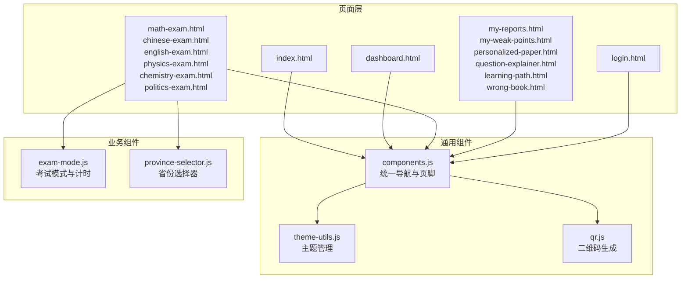
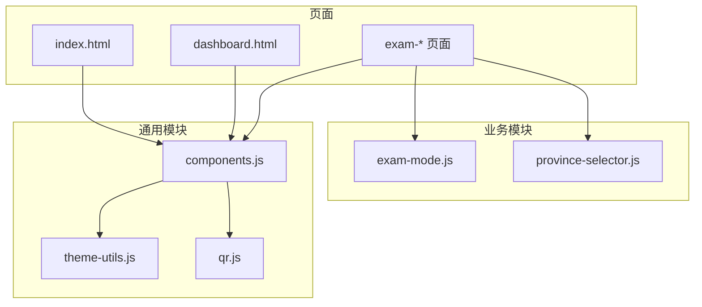
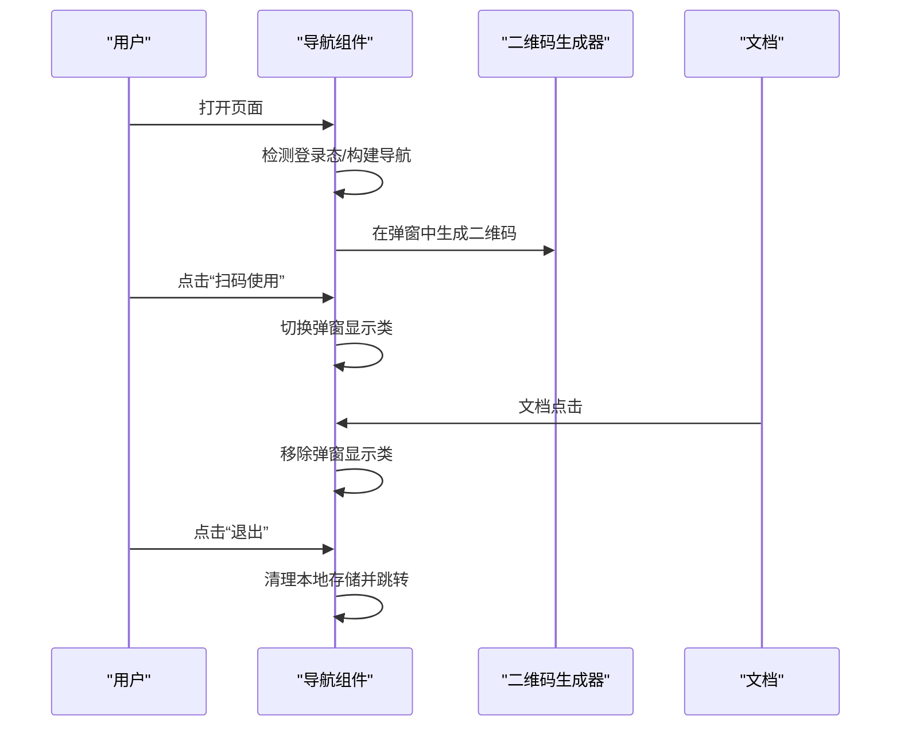
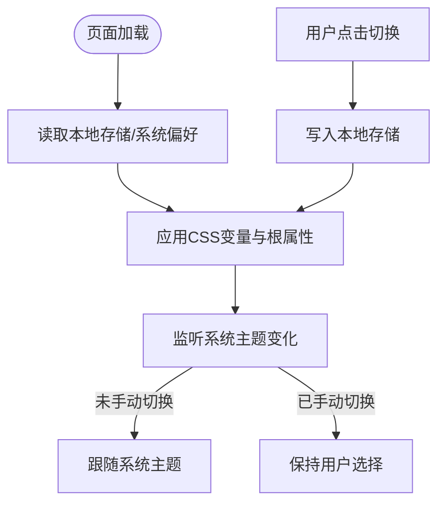
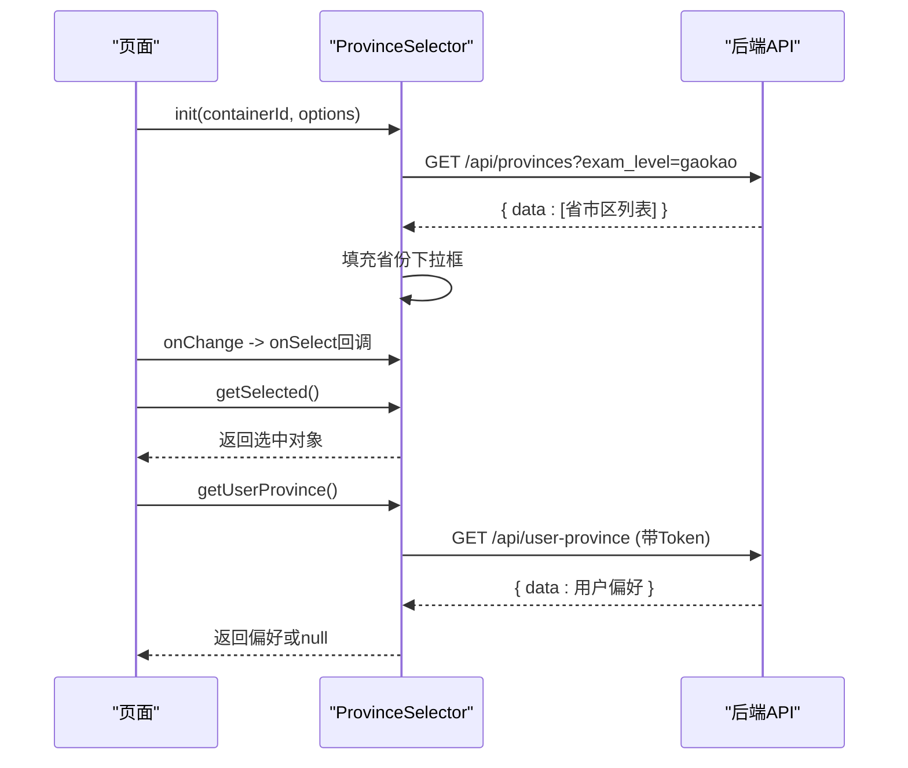
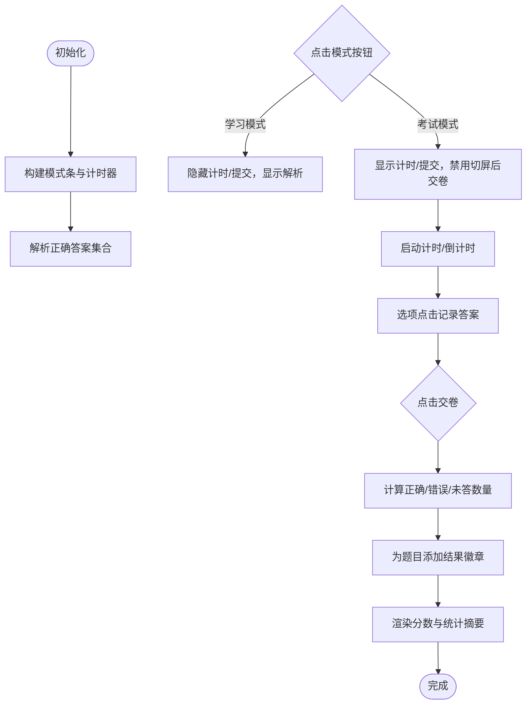
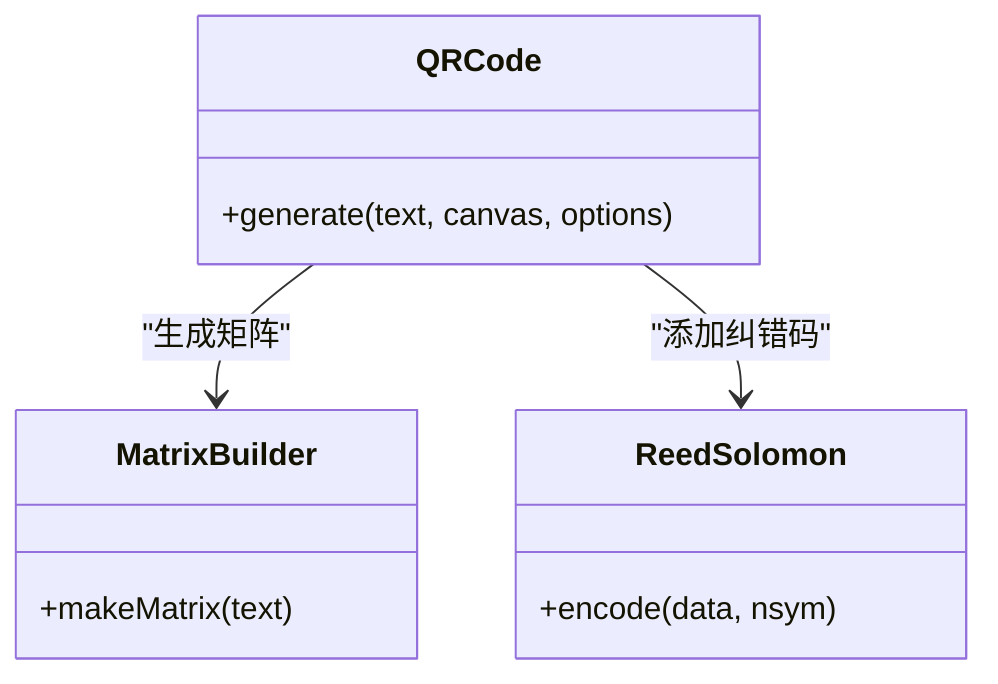
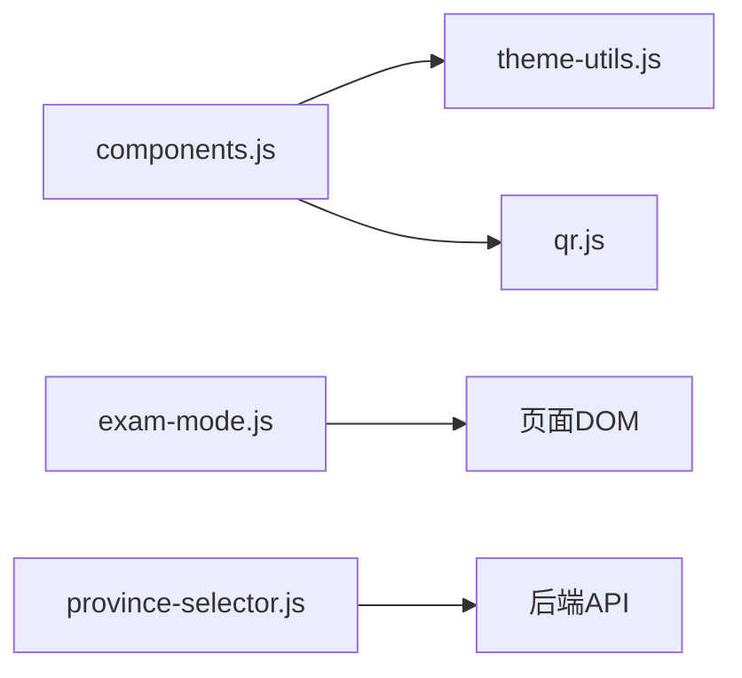

# JavaScript组件开发

<cite>
**本文引用的文件**
- [components.js](file://frontend/components.js)
- [exam-mode.js](file://frontend/exam-mode.js)
- [province-selector.js](file://frontend/province-selector.js)
- [qr.js](file://frontend/qr.js)
- [theme-utils.js](file://frontend/theme-utils.js)
- [index.html](file://frontend/index.html)
- [login.html](file://frontend/login.html)
- [dashboard.html](file://frontend/dashboard.html)
- [math-exam.html](file://frontend/math-exam.html)
- [chinese-exam.html](file://frontend/chinese-exam.html)
- [english-exam.html](file://frontend/english-exam.html)
- [physics-exam.html](file://frontend/physics-exam.html)
- [chemistry-exam.html](file://frontend/chemistry-exam.html)
- [politics-exam.html](file://frontend/politics-exam.html)
- [my-reports.html](file://frontend/my-reports.html)
- [my-weak-points.html](file://frontend/my-weak-points.html)
- [personalized-paper.html](file://frontend/personalized-paper.html)
- [question-explainer.html](file://frontend/question-explainer.html)
- [learning-path.html](file://frontend/learning-path.html)
- [wrong-book.html](file://frontend/wrong-book.html)
</cite>

## 目录
1. [引言](#引言)
2. [项目结构](#项目结构)
3. [核心组件](#核心组件)
4. [架构总览](#架构总览)
5. [详细组件分析](#详细组件分析)
6. [依赖分析](#依赖分析)
7. [性能考虑](#性能考虑)
8. [故障排查指南](#故障排查指南)
9. [结论](#结论)
10. [附录](#附录)

## 引言
本指南面向AI家教项目的前端JavaScript组件开发，聚焦于组件化架构、模块化设计模式与状态管理实践。文档围绕以下核心主题展开：
- 主题切换组件：纯CSS变量驱动的主题系统与系统偏好监听
- 省份选择器：可复用的选择组件与异步数据加载
- 考试模式：答题交互、计时与防切屏保护
- 二维码生成：无依赖Canvas实现的QR码编码与渲染
- 组件生命周期、事件处理与数据绑定策略
- 组件通信、依赖注入与模块加载优化
- 前端状态管理、本地存储与异步数据处理
- 测试策略、性能监控与错误处理机制
- 实际开发示例与调试工具使用

## 项目结构
前端采用“页面即入口”的单页应用风格，通过统一的导航栏与页脚组件在多页面间共享通用UI；核心功能以独立脚本模块形式按需加载，配合主题与二维码工具实现轻量级组件化。

图表来源
- [components.js:1-145](file://frontend/components.js#L1-L145)
- [theme-utils.js:1-107](file://frontend/theme-utils.js#L1-L107)
- [qr.js:1-264](file://frontend/qr.js#L1-L264)
- [exam-mode.js:1-288](file://frontend/exam-mode.js#L1-L288)
- [province-selector.js:1-137](file://frontend/province-selector.js#L1-L137)

章节来源
- [components.js:1-145](file://frontend/components.js#L1-L145)
- [theme-utils.js:1-107](file://frontend/theme-utils.js#L1-L107)
- [qr.js:1-264](file://frontend/qr.js#L1-L264)
- [exam-mode.js:1-288](file://frontend/exam-mode.js#L1-L288)
- [province-selector.js:1-137](file://frontend/province-selector.js#L1-L137)

## 核心组件
本节概述四大核心组件及其职责边界与协作方式：
- 统一导航与页脚组件：负责页面头部导航、登录态切换、二维码弹窗与页脚渲染
- 主题管理组件：基于CSS自定义属性的主题切换与系统偏好同步
- 省份选择器组件：跨页面复用的省市区选择与用户偏好读取
- 考试模式组件：答题交互、计时与防切屏保护
- 二维码生成器：纯Canvas实现的QR码绘制

章节来源
- [components.js:1-145](file://frontend/components.js#L1-L145)
- [theme-utils.js:1-107](file://frontend/theme-utils.js#L1-L107)
- [province-selector.js:1-137](file://frontend/province-selector.js#L1-L137)
- [exam-mode.js:1-288](file://frontend/exam-mode.js#L1-L288)
- [qr.js:1-264](file://frontend/qr.js#L1-L264)

## 架构总览
整体采用“页面脚本 + 通用工具库”的模块化架构。页面通过引入对应脚本实现功能扩展，通用组件以IIFE或命名空间暴露API，避免全局污染。主题与二维码作为底层能力被导航组件复用。

图表来源
- [components.js:1-145](file://frontend/components.js#L1-L145)
- [theme-utils.js:1-107](file://frontend/theme-utils.js#L1-L107)
- [qr.js:1-264](file://frontend/qr.js#L1-L264)
- [exam-mode.js:1-288](file://frontend/exam-mode.js#L1-L288)
- [province-selector.js:1-137](file://frontend/province-selector.js#L1-L137)

## 详细组件分析

### 统一导航与页脚组件（components.js）
职责与特性
- 登录态感知：根据本地存储token决定导航链接与登出按钮显示
- 动态高亮：依据当前路径匹配规则设置导航激活态
- 二维码弹窗：点击触发弹窗，使用全局QRCode生成站点URL
- 页脚渲染：在目标容器不存在时插入，存在时替换
- 事件绑定：注册登出、二维码弹窗、文档点击收起等事件

生命周期与事件处理
- DOM就绪后初始化：DOMContentLoaded或立即执行
- 事件委托与阻止冒泡：弹窗点击阻止传播，文档点击收起
- 登出清理：移除token与用户信息并跳转首页

数据绑定策略
- 内联模板字符串拼接，动态更新类名与样式
- 使用dataset或内联样式控制可见性与高亮

图表来源
- [components.js:1-145](file://frontend/components.js#L1-L145)
- [qr.js:1-264](file://frontend/qr.js#L1-L264)

章节来源
- [components.js:1-145](file://frontend/components.js#L1-L145)

### 主题管理组件（theme-utils.js）
职责与特性
- 双主题变量集：深色与浅色CSS变量映射
- 系统偏好监听：当用户未手动切换时跟随系统主题
- 主题切换：写入本地存储并应用到根元素属性与CSS变量
- 状态持久化：主题状态保存在本地存储中

生命周期与事件处理
- 初始化应用：页面加载时应用保存的主题或系统偏好
- 监听系统变化：matchMedia变更时自动切换
- 切换回调：暴露全局切换与查询函数

图表来源
- [theme-utils.js:1-107](file://frontend/theme-utils.js#L1-L107)

章节来源
- [theme-utils.js:1-107](file://frontend/theme-utils.js#L1-L107)

### 省份选择器组件（province-selector.js）
职责与特性
- 可配置渲染：支持是否显示考试类型、学科选择
- 异步加载：通过API拉取省份列表并填充下拉框
- 用户偏好：登录态下读取用户省份偏好
- 事件回调：选择变更时回调上层传入的onSelect

生命周期与事件处理
- 初始化：渲染容器、绑定事件、加载数据
- 变更联动：考试类型切换时重新加载省份
- 回调通知：选择变更时传递选中对象

图表来源
- [province-selector.js:1-137](file://frontend/province-selector.js#L1-L137)

章节来源
- [province-selector.js:1-137](file://frontend/province-selector.js#L1-L137)

### 考试模式组件（exam-mode.js）
职责与特性
- 模式切换：学习/考试双模式，动态渲染计时与提交按钮
- 计时系统：支持正计时与倒计时，颜色随剩余时间变化
- 答题交互：选项点击标记，交卷后展示结果徽章与错题标注
- 防切屏保护：监听visibilitychange，累计切屏次数并提示
- 状态管理：内部维护当前模式、计时状态、答案与统计

生命周期与事件处理
- DOMReady初始化：构建UI、解析正确答案
- 事件绑定：模式切换、计时切换、选项点击、可见性变化
- 提交流程：计算得分、渲染统计、滚动至顶部

图表来源
- [exam-mode.js:1-288](file://frontend/exam-mode.js#L1-L288)

章节来源
- [exam-mode.js:1-288](file://frontend/exam-mode.js#L1-L288)

### 二维码生成器（qr.js）
职责与特性
- 纯Canvas实现：不依赖外部库，自行实现Reed-Solomon纠错与模块布局
- 参数化渲染：支持模块大小、边距、前景/背景色
- 自适应版本：根据数据长度选择QR版本与纠错等级

图表来源
- [qr.js:1-264](file://frontend/qr.js#L1-L264)

章节来源
- [qr.js:1-264](file://frontend/qr.js#L1-L264)

## 依赖分析
- 组件耦合度
  - components.js依赖全局QRCode与本地存储，耦合度中等
  - exam-mode.js与页面DOM强耦合，但通过window._examMode弱暴露接口
  - province-selector.js仅依赖fetch与DOM，低耦合
  - theme-utils.js仅依赖matchMedia与本地存储，低耦合
- 外部依赖
  - QRCode由qr.js提供，components.js按需调用
  - 后端API：/api/provinces、/api/user-province
- 循环依赖
  - 未发现循环依赖

图表来源
- [components.js:1-145](file://frontend/components.js#L1-L145)
- [theme-utils.js:1-107](file://frontend/theme-utils.js#L1-L107)
- [qr.js:1-264](file://frontend/qr.js#L1-L264)
- [exam-mode.js:1-288](file://frontend/exam-mode.js#L1-L288)
- [province-selector.js:1-137](file://frontend/province-selector.js#L1-L137)

章节来源
- [components.js:1-145](file://frontend/components.js#L1-L145)
- [theme-utils.js:1-107](file://frontend/theme-utils.js#L1-L107)
- [qr.js:1-264](file://frontend/qr.js#L1-L264)
- [exam-mode.js:1-288](file://frontend/exam-mode.js#L1-L288)
- [province-selector.js:1-137](file://frontend/province-selector.js#L1-L137)

## 性能考虑
- 模块按需加载：页面仅加载自身所需脚本，减少首屏负担
- 事件委托与去抖：统一在document上处理弹窗关闭，避免重复绑定
- 计时器管理：进入/退出考试模式时显式启停，防止内存泄漏
- Canvas重绘：QR生成器一次性绘制，避免频繁重绘
- 本地存储：主题与用户偏好缓存，减少网络请求
- 异步加载：省份列表与用户偏好使用Promise，避免阻塞主线程

## 故障排查指南
常见问题与定位建议
- 二维码不显示
  - 检查全局QRCode是否可用与canvas尺寸是否设置
  - 参考路径：[components.js:77-81](file://frontend/components.js#L77-L81)，[qr.js:236-260](file://frontend/qr.js#L236-L260)
- 登录后导航不更新
  - 确认本地存储token是否存在且页面在DOMReady阶段初始化
  - 参考路径：[components.js:8-10](file://frontend/components.js#L8-L10)，[components.js:138-143](file://frontend/components.js#L138-L143)
- 考试模式无法交卷
  - 检查是否处于考试模式、计时器是否运行、答案是否收集
  - 参考路径：[exam-mode.js:202-269](file://frontend/exam-mode.js#L202-L269)
- 切屏警告过多自动交卷
  - 检查visibilitychange事件与计数阈值
  - 参考路径：[exam-mode.js:179-200](file://frontend/exam-mode.js#L179-L200)
- 省份选择器不加载
  - 检查API返回格式与网络权限
  - 参考路径：[province-selector.js:88-103](file://frontend/province-selector.js#L88-L103)
- 主题切换无效
  - 检查CSS变量覆盖与data-theme属性
  - 参考路径：[theme-utils.js:63-82](file://frontend/theme-utils.js#L63-L82)，[theme-utils.js:95-101](file://frontend/theme-utils.js#L95-L101)

章节来源
- [components.js:77-81](file://frontend/components.js#L77-L81)
- [components.js:138-143](file://frontend/components.js#L138-L143)
- [exam-mode.js:179-200](file://frontend/exam-mode.js#L179-L200)
- [exam-mode.js:202-269](file://frontend/exam-mode.js#L202-L269)
- [province-selector.js:88-103](file://frontend/province-selector.js#L88-L103)
- [theme-utils.js:63-82](file://frontend/theme-utils.js#L63-L82)
- [theme-utils.js:95-101](file://frontend/theme-utils.js#L95-L101)

## 结论
本项目通过IIFE与命名空间实现了轻量级组件化，结合本地存储与matchMedia达成主题一致性，利用纯Canvas实现的QR码与按需加载的业务脚本，兼顾了可维护性与性能。建议后续在大型页面引入更严格的模块化与单元测试框架，以进一步提升可测试性与可扩展性。

## 附录
- 开发示例
  - 在新页面集成导航与页脚：参考 [index.html](file://frontend/index.html) 中引入components.js
  - 在考试页启用考试模式：参考 [math-exam.html](file://frontend/math-exam.html) 中引入exam-mode.js
  - 在任意页面使用省份选择器：参考 [province-selector.js:12-83](file://frontend/province-selector.js#L12-L83)
  - 在登录页使用主题切换：参考 [login.html](file://frontend/login.html) 中引入theme-utils.js
- 调试工具
  - 控制台日志：检查主题切换、切屏警告与API错误
  - 网络面板：验证省份列表与用户偏好的请求
  - 应用面板：查看本地存储中的token与主题键值
- 测试策略
  - 单元测试：对QR码生成、主题切换、答案解析进行断言
  - 集成测试：模拟登录态、切屏行为与交卷流程
  - 性能测试：测量模块加载时间与Canvas绘制耗时