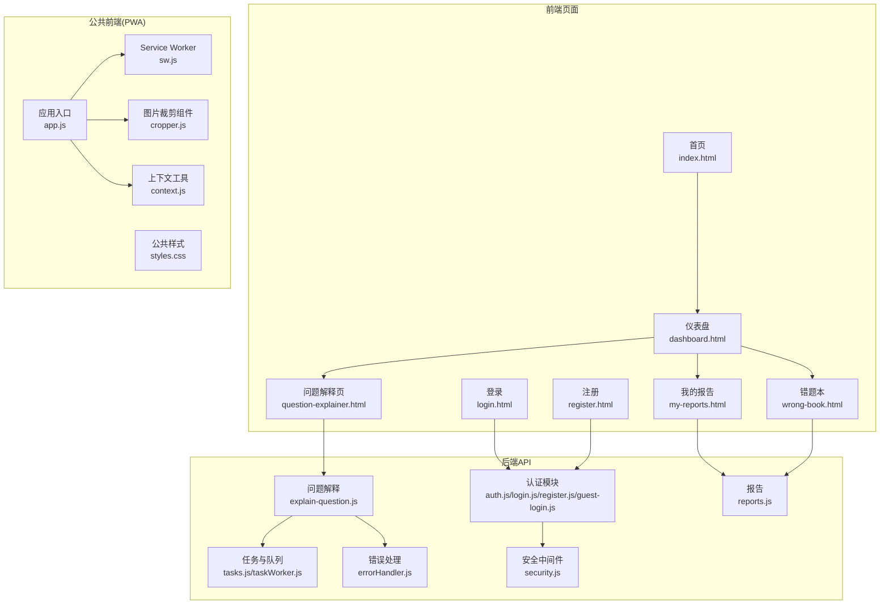
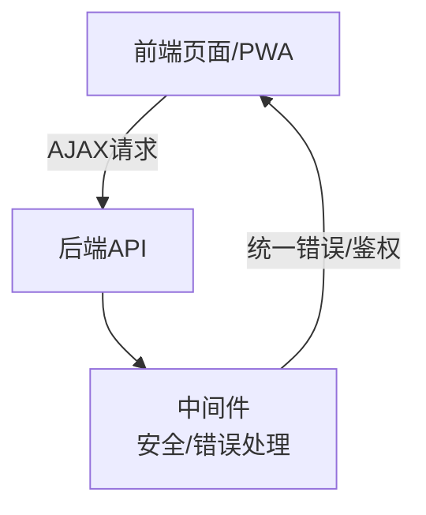
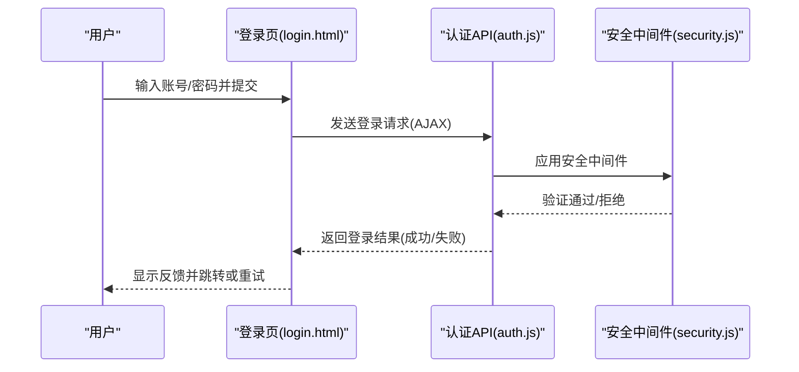
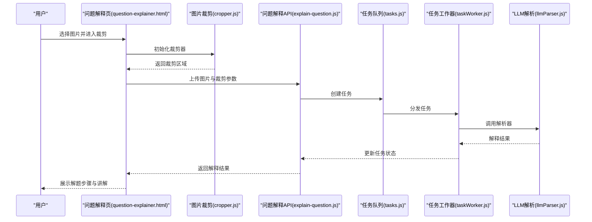
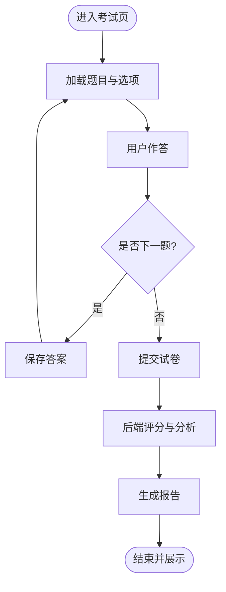
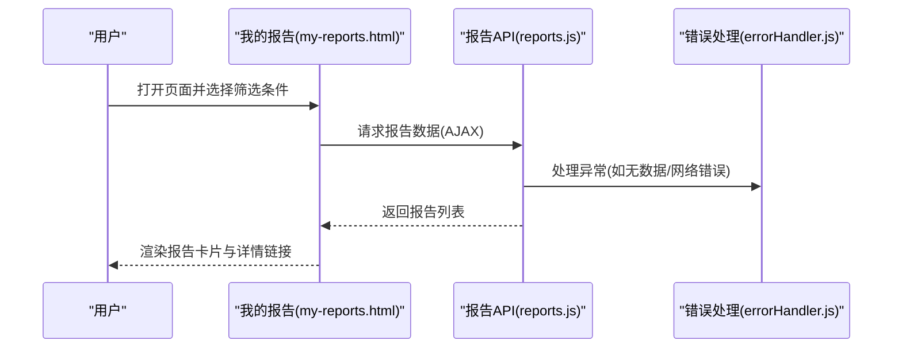
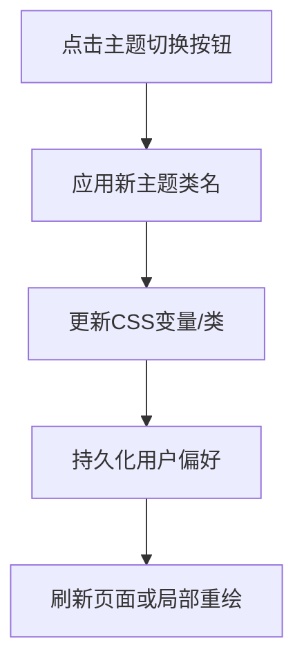
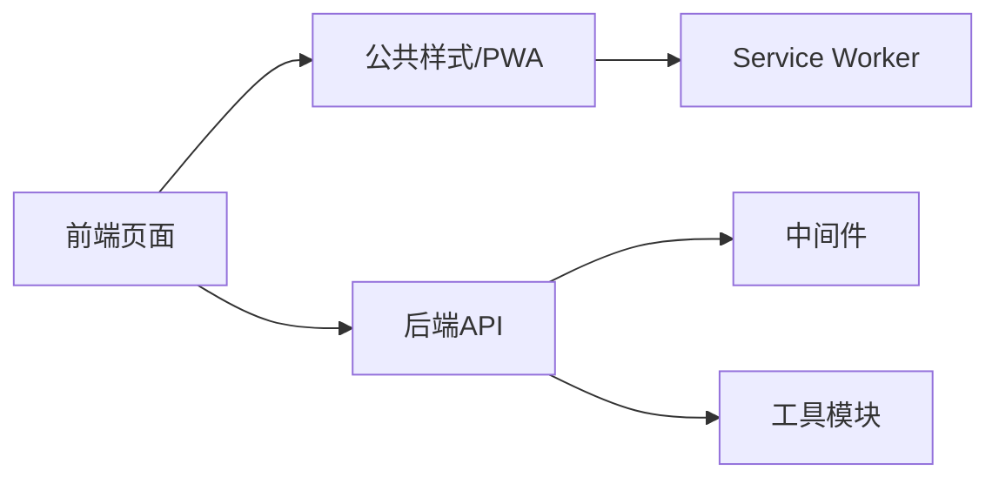

# 交互功能实现

<cite>
**本文引用的文件**
- [index.html](file://frontend/index.html)
- [dashboard.html](file://frontend/dashboard.html)
- [question-explainer.html](file://frontend/question-explainer.html)
- [my-reports.html](file://frontend/my-reports.html)
- [wrong-book.html](file://frontend/wrong-book.html)
- [components.js](file://frontend/components.js)
- [theme-utils.js](file://frontend/theme-utils.js)
- [province-selector.js](file://frontend/province-selector.js)
- [qr.js](file://frontend/qr.js)
- [exam-mode.js](file://frontend/exam-mode.js)
- [style.css](file://frontend/style.css)
- [brand.css](file://frontend/brand.css)
- [login.html](file://frontend/login.html)
- [register.html](file://frontend/register.html)
- [auth.js](file://api/auth.js)
- [login.js](file://api/login.js)
- [register.js](file://api/register.js)
- [guest-login.js](file://api/guest-login.js)
- [explain-question.js](file://api/explain-question.js)
- [tasks.js](file://api/tasks.js)
- [taskWorker.js](file://api/taskWorker.js)
- [reports.js](file://api/reports.js)
- [errorHandler.js](file://api/middleware/errorHandler.js)
- [security.js](file://api/middleware/security.js)
- [sw.js](file://public/sw.js)
- [styles.css](file://public/styles.css)
- [app.js](file://public/src/app.js)
- [cropper.js](file://public/src/components/cropper.js)
- [context.js](file://public/src/utils/context.js)
- [llmParser.js](file://api/utils/llmParser.js)
- [validator.js](file://api/utils/validator.js)
- [response.js](file://api/utils/response.js)
- [prompts.js](file://api/utils/prompts.js)
- [subjectMap.js](file://api/utils/subjectMap.js)
- [subjectCombinations.js](file://api/utils/subjectCombinations.js)
- [p3-ux-alignment.test.js](file://tests/api/p3-ux-alignment.test.js)
</cite>

## 目录
1. [引言](#引言)
2. [项目结构](#项目结构)
3. [核心组件](#核心组件)
4. [架构总览](#架构总览)
5. [详细组件分析](#详细组件分析)
6. [依赖关系分析](#依赖关系分析)
7. [性能考虑](#性能考虑)
8. [故障排查指南](#故障排查指南)
9. [结论](#结论)
10. [附录](#附录)

## 引言
本文件聚焦于AI家教项目的交互功能实现，围绕用户界面与后端服务之间的交互流程进行系统化梳理。重点覆盖以下方面：
- 用户交互设计：登录注册、主面板导航、报表查看、错题本等页面的交互逻辑
- 动态内容加载与实时更新：基于AJAX的异步请求、缓存与离线策略、主题切换与样式更新
- 核心交互功能：拍照搜题（问题解释）、在线考试系统、学习报告展示
- 表单验证、输入处理、文件上传与图像处理：前后端校验、裁剪与上传流程
- 动画与过渡效果、用户体验优化：主题切换、页面过渡、响应式布局
- 移动端触摸交互与手势识别：移动端适配与交互体验
- AJAX请求处理、错误状态管理与用户反馈：统一错误处理、安全中间件、提示信息
- 测试方法与UX评估：前端与后端测试用例对交互质量的验证

## 项目结构
前端采用多页面结构，配合公共样式与主题工具；后端通过REST接口提供认证、任务、报告等功能；公共前端应用（PWA）提供可复用组件与上下文。

**图表来源**
- [index.html](file://frontend/index.html)
- [dashboard.html](file://frontend/dashboard.html)
- [question-explainer.html](file://frontend/question-explainer.html)
- [my-reports.html](file://frontend/my-reports.html)
- [wrong-book.html](file://frontend/wrong-book.html)
- [login.html](file://frontend/login.html)
- [register.html](file://frontend/register.html)
- [auth.js](file://api/auth.js)
- [login.js](file://api/login.js)
- [register.js](file://api/register.js)
- [guest-login.js](file://api/guest-login.js)
- [explain-question.js](file://api/explain-question.js)
- [tasks.js](file://api/tasks.js)
- [taskWorker.js](file://api/taskWorker.js)
- [reports.js](file://api/reports.js)
- [errorHandler.js](file://api/middleware/errorHandler.js)
- [security.js](file://api/middleware/security.js)
- [sw.js](file://public/sw.js)
- [styles.css](file://public/styles.css)
- [app.js](file://public/src/app.js)
- [cropper.js](file://public/src/components/cropper.js)
- [context.js](file://public/src/utils/context.js)

**章节来源**
- [index.html](file://frontend/index.html)
- [dashboard.html](file://frontend/dashboard.html)
- [question-explainer.html](file://frontend/question-explainer.html)
- [my-reports.html](file://frontend/my-reports.html)
- [wrong-book.html](file://frontend/wrong-book.html)
- [login.html](file://frontend/login.html)
- [register.html](file://frontend/register.html)
- [auth.js](file://api/auth.js)
- [login.js](file://api/login.js)
- [register.js](file://api/register.js)
- [guest-login.js](file://api/guest-login.js)
- [explain-question.js](file://api/explain-question.js)
- [tasks.js](file://api/tasks.js)
- [taskWorker.js](file://api/taskWorker.js)
- [reports.js](file://api/reports.js)
- [errorHandler.js](file://api/middleware/errorHandler.js)
- [security.js](file://api/middleware/security.js)
- [sw.js](file://public/sw.js)
- [styles.css](file://public/styles.css)
- [app.js](file://public/src/app.js)
- [cropper.js](file://public/src/components/cropper.js)
- [context.js](file://public/src/utils/context.js)

## 核心组件
- 登录/注册/游客登录：负责用户身份建立与会话维护，结合安全中间件与错误处理
- 问题解释（拍照搜题）：从前端上传图片到后端，触发任务队列与LLM解析，返回解释结果
- 报告与错题本：动态加载学习报告与错题列表，支持筛选与分页
- 主题与样式：主题切换工具与公共样式，确保一致的视觉与交互体验
- PWA与离线能力：Service Worker与公共样式，提升加载速度与离线可用性
- 组件与上下文：可复用组件与全局上下文，支撑跨页面交互一致性

**章节来源**
- [auth.js](file://api/auth.js)
- [login.js](file://api/login.js)
- [register.js](file://api/register.js)
- [guest-login.js](file://api/guest-login.js)
- [explain-question.js](file://api/explain-question.js)
- [tasks.js](file://api/tasks.js)
- [taskWorker.js](file://api/taskWorker.js)
- [reports.js](file://api/reports.js)
- [theme-utils.js](file://frontend/theme-utils.js)
- [style.css](file://frontend/style.css)
- [sw.js](file://public/sw.js)
- [app.js](file://public/src/app.js)
- [cropper.js](file://public/src/components/cropper.js)
- [context.js](file://public/src/utils/context.js)

## 架构总览
整体交互架构由“前端页面/PWA + 后端API + 中间件”三层组成。前端负责用户交互与动态内容渲染；后端提供业务能力与数据；中间件保障安全与错误处理。

**图表来源**
- [errorHandler.js](file://api/middleware/errorHandler.js)
- [security.js](file://api/middleware/security.js)
- [auth.js](file://api/auth.js)
- [explain-question.js](file://api/explain-question.js)
- [reports.js](file://api/reports.js)

## 详细组件分析

### 登录与注册交互
- 页面：登录页与注册页提供表单输入与提交
- 前端：表单字段校验（用户名、邮箱、密码长度与格式），避免空值与非法字符
- 后端：认证路由接收凭据，执行安全检查与错误处理
- 会话：成功后建立会话，后续页面可读取用户状态

**图表来源**
- [login.html](file://frontend/login.html)
- [auth.js](file://api/auth.js)
- [security.js](file://api/middleware/security.js)

**章节来源**
- [login.html](file://frontend/login.html)
- [register.html](file://frontend/register.html)
- [auth.js](file://api/auth.js)
- [login.js](file://api/login.js)
- [register.js](file://api/register.js)
- [guest-login.js](file://api/guest-login.js)
- [security.js](file://api/middleware/security.js)

### 拍照搜题（问题解释）交互
- 页面：问题解释页提供拍照/上传入口与结果展示
- 前端：调用图片裁剪组件，完成区域选择与预览，随后上传至后端
- 后端：接收图片，创建任务并交由任务工作器处理；解析器将结果返回给前端
- 实时更新：轮询或事件推送（根据具体实现）更新解释结果

**图表来源**
- [question-explainer.html](file://frontend/question-explainer.html)
- [cropper.js](file://public/src/components/cropper.js)
- [explain-question.js](file://api/explain-question.js)
- [tasks.js](file://api/tasks.js)
- [taskWorker.js](file://api/taskWorker.js)
- [llmParser.js](file://api/utils/llmParser.js)

**章节来源**
- [question-explainer.html](file://frontend/question-explainer.html)
- [cropper.js](file://public/src/components/cropper.js)
- [explain-question.js](file://api/explain-question.js)
- [tasks.js](file://api/tasks.js)
- [taskWorker.js](file://api/taskWorker.js)
- [llmParser.js](file://api/utils/llmParser.js)

### 在线考试系统交互
- 页面：各学科考试页（数学、物理、化学、语文、英语、政治）
- 考试模式：计时、题目切换、答案保存与提交
- 数据流：前端收集答题信息，后端持久化并计算得分与分析

**图表来源**
- [math-exam.html](file://frontend/math-exam.html)
- [physics-exam.html](file://frontend/physics-exam.html)
- [chemistry-exam.html](file://frontend/chemistry-exam.html)
- [chinese-exam.html](file://frontend/chinese-exam.html)
- [english-exam.html](file://frontend/english-exam.html)
- [politics-exam.html](file://frontend/politics-exam.html)
- [exam-mode.js](file://frontend/exam-mode.js)

**章节来源**
- [math-exam.html](file://frontend/math-exam.html)
- [physics-exam.html](file://frontend/physics-exam.html)
- [chemistry-exam.html](file://frontend/chemistry-exam.html)
- [chinese-exam.html](file://frontend/chinese-exam.html)
- [english-exam.html](file://frontend/english-exam.html)
- [politics-exam.html](file://frontend/politics-exam.html)
- [exam-mode.js](file://frontend/exam-mode.js)

### 学习报告与错题本交互
- 页面：我的报告、错题本
- 功能：按科目/时间筛选、分页加载、详情查看
- 数据：后端提供报告与错题数据接口，前端动态渲染

**图表来源**
- [my-reports.html](file://frontend/my-reports.html)
- [reports.js](file://api/reports.js)
- [errorHandler.js](file://api/middleware/errorHandler.js)

**章节来源**
- [my-reports.html](file://frontend/my-reports.html)
- [wrong-book.html](file://frontend/wrong-book.html)
- [reports.js](file://api/reports.js)
- [errorHandler.js](file://api/middleware/errorHandler.js)

### 主题切换与样式更新
- 工具：主题工具函数与公共样式文件
- 效果：一键切换明暗主题，更新页面与组件样式

**图表来源**
- [theme-utils.js](file://frontend/theme-utils.js)
- [style.css](file://frontend/style.css)
- [brand.css](file://frontend/brand.css)

**章节来源**
- [theme-utils.js](file://frontend/theme-utils.js)
- [style.css](file://frontend/style.css)
- [brand.css](file://frontend/brand.css)

### PWA与离线能力
- Service Worker：缓存静态资源与关键接口，提升加载速度与离线可用性
- 公共样式：统一UI风格，减少重复样式定义

**章节来源**
- [sw.js](file://public/sw.js)
- [styles.css](file://public/styles.css)

### 组件与上下文
- 可复用组件：如图片裁剪器，封装复杂交互逻辑
- 上下文工具：提供全局状态与配置，便于跨页面共享

**章节来源**
- [cropper.js](file://public/src/components/cropper.js)
- [context.js](file://public/src/utils/context.js)
- [app.js](file://public/src/app.js)

## 依赖关系分析
- 前端页面依赖公共样式与主题工具；问题解释页依赖裁剪组件与任务相关API
- 后端API依赖中间件（安全与错误处理）；任务模块依赖解析器与工作器
- PWA层提供离线与缓存能力，增强前端交互性能

**图表来源**
- [style.css](file://frontend/style.css)
- [brand.css](file://frontend/brand.css)
- [sw.js](file://public/sw.js)
- [errorHandler.js](file://api/middleware/errorHandler.js)
- [security.js](file://api/middleware/security.js)
- [llmParser.js](file://api/utils/llmParser.js)

**章节来源**
- [style.css](file://frontend/style.css)
- [brand.css](file://frontend/brand.css)
- [sw.js](file://public/sw.js)
- [errorHandler.js](file://api/middleware/errorHandler.js)
- [security.js](file://api/middleware/security.js)
- [llmParser.js](file://api/utils/llmParser.js)

## 性能考虑
- 异步加载：通过AJAX按需加载数据，避免全量渲染
- 缓存策略：利用Service Worker缓存静态资源与关键接口，降低二次访问延迟
- 图片处理：前端裁剪减少上传体积，后端任务异步处理避免阻塞
- 样式复用：公共样式与主题工具减少重复计算与渲染成本

## 故障排查指南
- 错误处理：统一错误中间件捕获异常，提供标准化错误响应
- 安全中间件：鉴权与权限控制，防止未授权访问
- 日志与回溯：在任务工作器与解析器中记录关键节点，便于定位问题
- 用户反馈：在前端显示错误提示与重试按钮，提升可恢复性

**章节来源**
- [errorHandler.js](file://api/middleware/errorHandler.js)
- [security.js](file://api/middleware/security.js)
- [taskWorker.js](file://api/taskWorker.js)
- [llmParser.js](file://api/utils/llmParser.js)

## 结论
本项目通过清晰的前端页面与PWA架构、完善的后端API与中间件体系，实现了从登录注册到拍照搜题、在线考试与报告展示的完整交互闭环。通过异步加载、缓存与主题切换等手段优化用户体验，并以统一的错误处理与安全中间件保障稳定性。建议持续完善移动端手势与响应式交互细节，加强交互测试与UX评估，进一步提升产品易用性与可靠性。

## 附录
- 交互测试方法与UX评估
  - 前端测试：覆盖登录/注册表单、拍照搜题流程、考试答题与报告查看
  - 后端测试：验证认证、任务队列、报告生成与错误处理
  - UX评估：以任务完成率、页面加载时间、错误率与用户满意度为指标

**章节来源**
- [p3-ux-alignment.test.js](file://tests/api/p3-ux-alignment.test.js)