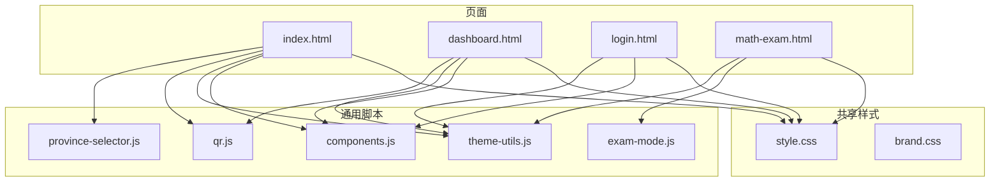
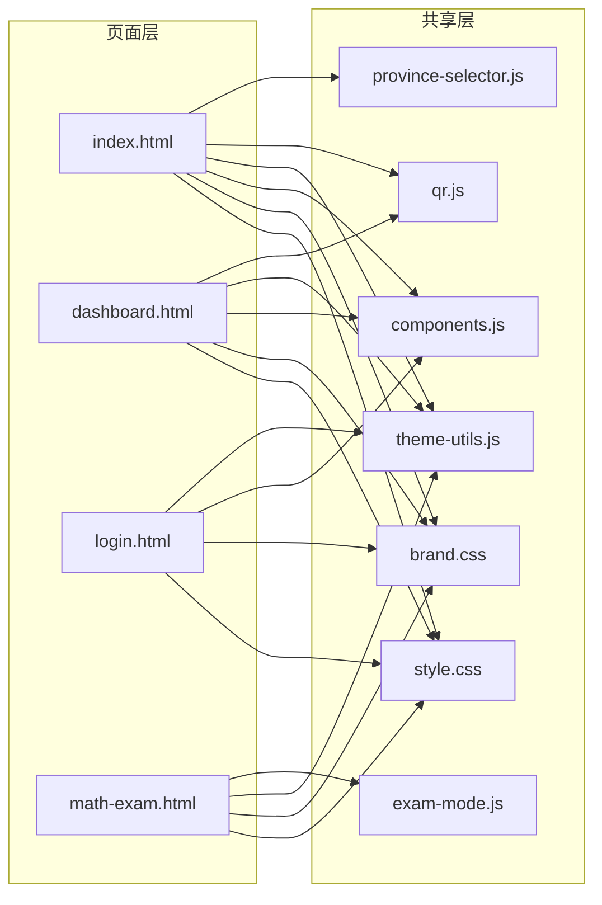
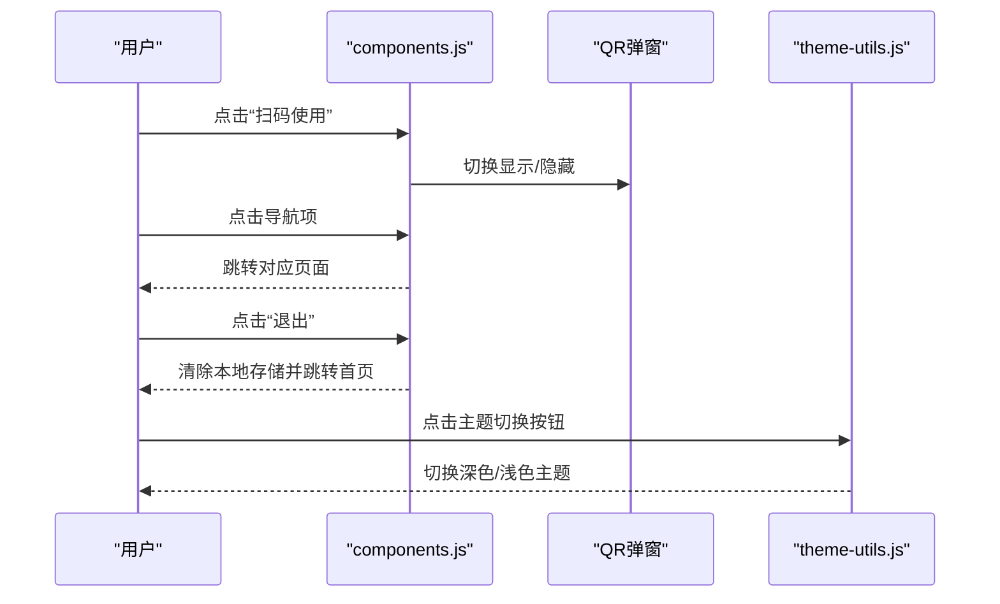
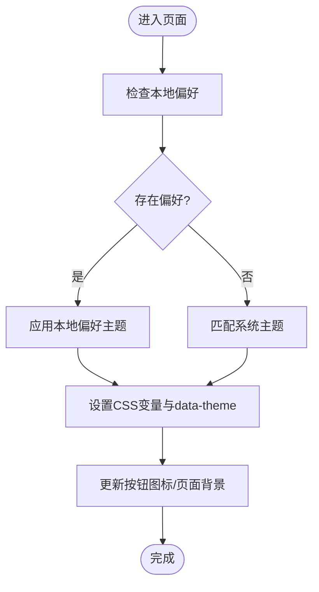
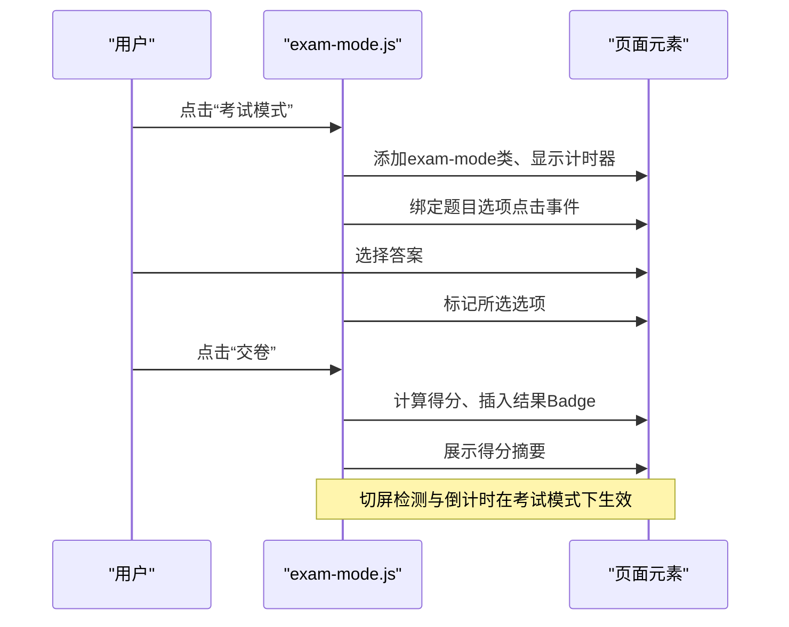
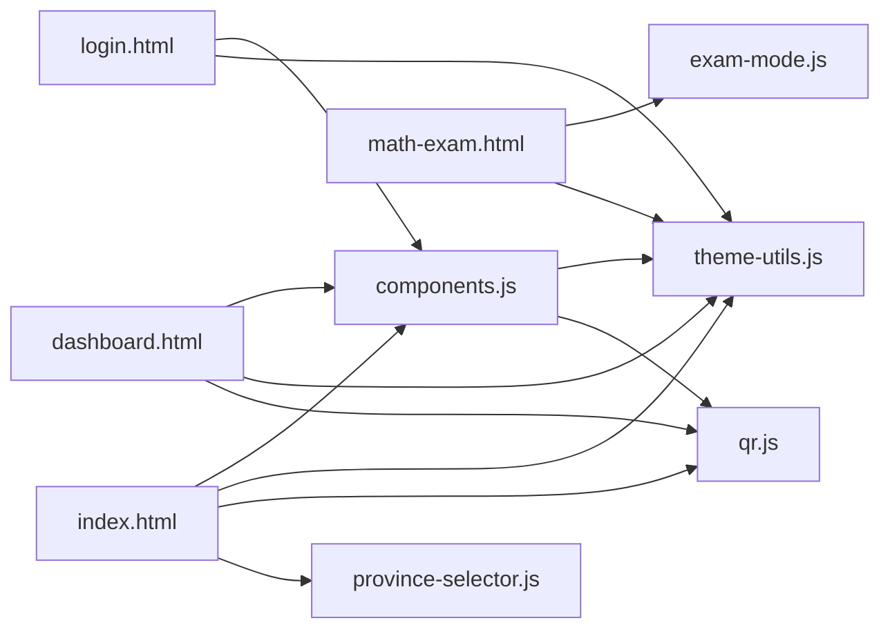

# 前端开发

<cite>
**本文档引用的文件**
- [index.html](file://frontend/index.html)
- [style.css](file://frontend/style.css)
- [brand.css](file://frontend/brand.css)
- [components.js](file://frontend/components.js)
- [theme-utils.js](file://frontend/theme-utils.js)
- [qr.js](file://frontend/qr.js)
- [exam-mode.js](file://frontend/exam-mode.js)
- [province-selector.js](file://frontend/province-selector.js)
- [dashboard.html](file://frontend/dashboard.html)
- [login.html](file://frontend/login.html)
- [math-exam.html](file://frontend/math-exam.html)
</cite>

## 目录
1. [引言](#引言)
2. [项目结构](#项目结构)
3. [核心组件](#核心组件)
4. [架构总览](#架构总览)
5. [详细组件分析](#详细组件分析)
6. [依赖分析](#依赖分析)
7. [性能考虑](#性能考虑)
8. [故障排查指南](#故障排查指南)
9. [结论](#结论)
10. [附录](#附录)

## 引言
本指南面向AI家教项目的前端开发者，系统阐述HTML页面结构、CSS样式体系与JavaScript组件开发规范。文档覆盖页面布局设计、主题系统实现、交互逻辑开发、响应式设计原则、组件化开发模式、状态管理与用户界面最佳实践，并提供样式定制指南、主题切换实现、跨浏览器兼容性处理、前端性能优化、资源加载策略以及用户体验改进方案。文中所有技术细节均来自仓库现有源码，确保可落地与可验证。

## 项目结构
前端代码位于frontend目录，采用“页面即组件”的轻量组织方式：每个HTML页面独立承载自身业务与交互，通过共享样式与工具脚本实现一致体验与复用能力。核心资产包括：
- 全站样式：style.css（含深色/浅色主题变量与响应式规则）
- 品牌变量：brand.css（品牌主色与语义色）
- 通用组件：components.js（导航、二维码弹窗、页脚）
- 主题工具：theme-utils.js（主题持久化与切换）
- 二维码生成：qr.js（纯Canvas实现）
- 考试模式：exam-mode.js（学习/考试双模式、计时与防切屏）
- 省份选择器：province-selector.js（可复用的省市区选择组件）
- 示例页面：index.html、dashboard.html、login.html、math-exam.html等

图表来源
- [index.html:1-462](file://frontend/index.html#L1-L462)
- [style.css:1-609](file://frontend/style.css#L1-L609)
- [brand.css:1-12](file://frontend/brand.css#L1-L12)
- [components.js:1-145](file://frontend/components.js#L1-L145)
- [theme-utils.js:1-107](file://frontend/theme-utils.js#L1-L107)
- [qr.js:1-264](file://frontend/qr.js#L1-L264)
- [exam-mode.js:1-288](file://frontend/exam-mode.js#L1-L288)
- [province-selector.js:1-137](file://frontend/province-selector.js#L1-L137)
- [dashboard.html:1-508](file://frontend/dashboard.html#L1-L508)
- [login.html:1-200](file://frontend/login.html#L1-L200)
- [math-exam.html:1-244](file://frontend/math-exam.html#L1-L244)

章节来源
- [index.html:1-462](file://frontend/index.html#L1-L462)
- [style.css:1-609](file://frontend/style.css#L1-L609)
- [brand.css:1-12](file://frontend/brand.css#L1-L12)
- [components.js:1-145](file://frontend/components.js#L1-L145)
- [theme-utils.js:1-107](file://frontend/theme-utils.js#L1-L107)
- [qr.js:1-264](file://frontend/qr.js#L1-L264)
- [exam-mode.js:1-288](file://frontend/exam-mode.js#L1-L288)
- [province-selector.js:1-137](file://frontend/province-selector.js#L1-L137)
- [dashboard.html:1-508](file://frontend/dashboard.html#L1-L508)
- [login.html:1-200](file://frontend/login.html#L1-L200)
- [math-exam.html:1-244](file://frontend/math-exam.html#L1-L244)

## 核心组件
- 统一导航与页脚：components.js负责根据登录状态动态渲染导航、登出、二维码弹窗与页脚，支持移动端汉堡菜单与主题切换按钮联动。
- 主题系统：theme-utils.js通过data-theme属性与CSS变量实现深色/浅色主题无缝切换，并持久化用户偏好，同时监听系统主题变化。
- 二维码生成：qr.js提供纯Canvas实现的二维码绘制，避免外部依赖，用于移动端扫码入口。
- 考试模式：exam-mode.js提供学习/考试双模式切换、计时/倒计时、答案交互、切屏检测与自动交卷、结果展示等。
- 省份选择器：province-selector.js封装省市区选择逻辑，支持异步加载、回调与用户偏好读取。
- 页面样式：style.css集中管理全站样式、主题变量、打印样式与响应式断点；brand.css提供品牌语义色。

章节来源
- [components.js:1-145](file://frontend/components.js#L1-L145)
- [theme-utils.js:1-107](file://frontend/theme-utils.js#L1-L107)
- [qr.js:1-264](file://frontend/qr.js#L1-L264)
- [exam-mode.js:1-288](file://frontend/exam-mode.js#L1-L288)
- [province-selector.js:1-137](file://frontend/province-selector.js#L1-L137)
- [style.css:1-609](file://frontend/style.css#L1-L609)
- [brand.css:1-12](file://frontend/brand.css#L1-L12)

## 架构总览
前端采用“页面级组件 + 共享样式/脚本”的轻量架构。页面通过<link>/<script>引入共享资源，组件脚本在DOMReady时执行初始化，主题与导航等横切关注点在多个页面复用。

图表来源
- [index.html:1-462](file://frontend/index.html#L1-L462)
- [dashboard.html:1-508](file://frontend/dashboard.html#L1-L508)
- [login.html:1-200](file://frontend/login.html#L1-L200)
- [math-exam.html:1-244](file://frontend/math-exam.html#L1-L244)
- [style.css:1-609](file://frontend/style.css#L1-L609)
- [brand.css:1-12](file://frontend/brand.css#L1-L12)
- [components.js:1-145](file://frontend/components.js#L1-L145)
- [theme-utils.js:1-107](file://frontend/theme-utils.js#L1-L107)
- [qr.js:1-264](file://frontend/qr.js#L1-L264)
- [exam-mode.js:1-288](file://frontend/exam-mode.js#L1-L288)
- [province-selector.js:1-137](file://frontend/province-selector.js#L1-L137)

## 详细组件分析

### 组件A：统一导航与页脚（components.js）
- 功能要点
  - 根据登录状态动态构建导航链接，支持首页、专区、个人中心、登录/注册、政策解读等路由。
  - 渲染主题切换按钮与二维码弹窗，点击触发弹窗显示，点击外部区域收起。
  - 提供登出逻辑，清除本地token与用户信息并跳转首页。
  - DOMReady时插入或替换现有header/footer，保证页面一致性。
- 交互流程
  - 用户点击“扫码使用”触发QR弹窗；
  - 点击导航项或“退出”触发相应行为；
  - 主题切换按钮调用全局window.themeToggle。

图表来源
- [components.js:1-145](file://frontend/components.js#L1-L145)
- [theme-utils.js:1-107](file://frontend/theme-utils.js#L1-L107)

章节来源
- [components.js:1-145](file://frontend/components.js#L1-L145)

### 组件B：主题系统（theme-utils.js）
- 功能要点
  - 使用data-theme属性与CSS变量实现主题切换；
  - 本地持久化用户偏好，未设置时跟随系统主题；
  - 为独立页面覆盖内联CSS变量，保证样式一致性；
  - 提供window.themeToggle与window.getTheme接口。
- 切换流程
  - 读取本地偏好或系统主题；
  - 设置data-theme并注入CSS变量；
  - 更新主题按钮图标与body背景（针对部分页面）。

图表来源
- [theme-utils.js:1-107](file://frontend/theme-utils.js#L1-L107)

章节来源
- [theme-utils.js:1-107](file://frontend/theme-utils.js#L1-L107)

### 组件C：二维码生成（qr.js）
- 功能要点
  - 纯Canvas实现，包含Reed-Solomon纠错、模块布局、掩膜与数据编码；
  - 支持自定义模块大小、边距、前景/背景色；
  - 作为全局对象QRCode暴露generate方法。
- 使用场景
  - 在components.js与dashboard.html中生成扫码入口。

章节来源
- [qr.js:1-264](file://frontend/qr.js#L1-L264)

### 组件D：考试模式（exam-mode.js）
- 功能要点
  - 学习/考试双模式切换，考试模式下隐藏解析、禁用点击、启用计时/倒计时；
  - 切屏检测：最多3次警告，超过阈值自动交卷；
  - 评分统计：统计对错未答数量，展示得分摘要；
  - 结果Badge：对题打勾、错题打叉、未答打横线并标注颜色。
- 交互流程

图表来源
- [exam-mode.js:1-288](file://frontend/exam-mode.js#L1-L288)

章节来源
- [exam-mode.js:1-288](file://frontend/exam-mode.js#L1-L288)

### 组件E：省份选择器（province-selector.js）
- 功能要点
  - 支持配置是否显示“考试类型/学科”；
  - 异步加载省份列表，支持选择回调；
  - 提供getUserProvince读取用户偏好；
  - 返回全局对象供页面调用。
- 使用场景
  - dashboard.html与index.html等页面复用。

章节来源
- [province-selector.js:1-137](file://frontend/province-selector.js#L1-L137)

### 页面示例：首页（index.html）
- 页面结构
  - 顶部Hero区域、可信证据、样例报告入口、预测声明、统计条、省份选择器、学科卡片网格、趋势轮播、方法论入口、政策横幅等。
- 交互特性
  - 省份选择器：切换高考/中考，异步加载省份并生成入口卡片；
  - 响应式布局：在不同断点下网格与卡片自适应。
- 样式与主题
  - 使用style.css与brand.css，主题通过data-theme切换。

章节来源
- [index.html:1-462](file://frontend/index.html#L1-L462)
- [style.css:1-609](file://frontend/style.css#L1-L609)
- [brand.css:1-12](file://frontend/brand.css#L1-L12)

### 页面示例：个人中心（dashboard.html）
- 页面结构
  - 用户欢迎语、统计数据、省份偏好设置、学习工具入口、拍照搜题入口、模态框与相机控制。
- 交互特性
  - 登录态校验与重定向；
  - 拍照搜题：支持摄像头与文件上传，提交到代理接口，解析返回并展示结果；
  - 省份选择：异步加载、保存用户偏好。
- 样式与主题
  - 使用style.css与brand.css，主题通过data-theme切换。

章节来源
- [dashboard.html:1-508](file://frontend/dashboard.html#L1-L508)
- [style.css:1-609](file://frontend/style.css#L1-L609)
- [brand.css:1-12](file://frontend/brand.css#L1-L12)

### 页面示例：登录页（login.html）
- 页面结构
  - 登录表单、游客登录、样例报告入口、价值说明与权益展示。
- 交互特性
  - 已登录自动跳转个人中心；
  - 表单提交登录或游客登录，成功后写入本地存储并跳转。

章节来源
- [login.html:1-200](file://frontend/login.html#L1-L200)
- [style.css:1-609](file://frontend/style.css#L1-L609)
- [brand.css:1-12](file://frontend/brand.css#L1-L12)

### 页面示例：数学预测卷（math-exam.html）
- 页面结构
  - 试卷容器、侧栏功能（计时开关、答案显示、打印、返回首页）。
- 交互特性
  - 动态加载用户省份信息，修改标题与副标题；
  - 答案折叠/展开；
  - 调用exam-mode.js进入考试模式。

章节来源
- [math-exam.html:1-244](file://frontend/math-exam.html#L1-L244)
- [style.css:1-609](file://frontend/style.css#L1-L609)
- [brand.css:1-12](file://frontend/brand.css#L1-L12)
- [exam-mode.js:1-288](file://frontend/exam-mode.js#L1-L288)

## 依赖分析
- 组件耦合
  - components.js依赖theme-utils.js（主题按钮图标）、qr.js（二维码生成）。
  - exam-mode.js与页面共同维护考试态样式与交互。
  - province-selector.js独立于页面，通过回调与fetch集成。
- 外部依赖
  - 数学公式渲染依赖KaTeX（在数学试卷页面按需引入）。
- 潜在风险
  - 页面间共享脚本需注意命名冲突（如window._examMode、window.themeToggle）；
  - 主题变量覆盖需确保所有页面一致。

图表来源
- [components.js:1-145](file://frontend/components.js#L1-L145)
- [theme-utils.js:1-107](file://frontend/theme-utils.js#L1-L107)
- [qr.js:1-264](file://frontend/qr.js#L1-L264)
- [exam-mode.js:1-288](file://frontend/exam-mode.js#L1-L288)
- [province-selector.js:1-137](file://frontend/province-selector.js#L1-L137)
- [dashboard.html:1-508](file://frontend/dashboard.html#L1-L508)
- [login.html:1-200](file://frontend/login.html#L1-L200)
- [math-exam.html:1-244](file://frontend/math-exam.html#L1-L244)
- [index.html:1-462](file://frontend/index.html#L1-L462)

章节来源
- [components.js:1-145](file://frontend/components.js#L1-L145)
- [theme-utils.js:1-107](file://frontend/theme-utils.js#L1-L107)
- [qr.js:1-264](file://frontend/qr.js#L1-L264)
- [exam-mode.js:1-288](file://frontend/exam-mode.js#L1-L288)
- [province-selector.js:1-137](file://frontend/province-selector.js#L1-L137)
- [dashboard.html:1-508](file://frontend/dashboard.html#L1-L508)
- [login.html:1-200](file://frontend/login.html#L1-L200)
- [math-exam.html:1-244](file://frontend/math-exam.html#L1-L244)
- [index.html:1-462](file://frontend/index.html#L1-L462)

## 性能考虑
- 资源加载
  - 将常用样式与脚本合并为单个<link>/<script>，减少HTTP请求；对大体积脚本（如KaTeX）按需加载。
  - 使用defer与async（如KaTeX）避免阻塞渲染。
- 主题与样式
  - CSS变量与data-theme切换避免重绘与重排；尽量减少内联样式。
- 交互性能
  - exam-mode.js中计时器使用setInterval，页面切换时及时清理；切屏检测仅在考试模式启用。
- 图像与媒体
  - 拍照搜题使用Canvas压缩图片质量，降低网络传输与服务器压力。
- 缓存策略
  - 静态资源建议开启浏览器缓存与CDN加速；API接口使用ETag/Last-Modified。

## 故障排查指南
- 主题切换无效
  - 检查data-theme属性是否正确设置；确认CSS变量覆盖是否生效；查看本地存储偏好。
- 二维码不显示
  - 确认Canvas上下文可用；检查QRCode生成参数与容器尺寸。
- 考试模式异常
  - 确认exam-mode.js已加载；检查window._examMode接口是否存在；查看计时器是否重复启动。
- 省份选择器无数据
  - 检查API返回结构与fetch错误处理；确认回调是否正确绑定。
- 登录后仍跳转登录页
  - 检查本地token与用户信息是否正确写入；确认页面重定向逻辑。

章节来源
- [theme-utils.js:1-107](file://frontend/theme-utils.js#L1-L107)
- [qr.js:1-264](file://frontend/qr.js#L1-L264)
- [exam-mode.js:1-288](file://frontend/exam-mode.js#L1-L288)
- [province-selector.js:1-137](file://frontend/province-selector.js#L1-L137)
- [login.html:1-200](file://frontend/login.html#L1-L200)

## 结论
本项目前端以“页面即组件”为核心，配合共享样式与工具脚本，实现了统一的品牌风格、灵活的主题系统与丰富的交互体验。通过组件化与状态管理（localStorage）的结合，既保证了开发效率，也兼顾了用户体验与性能。建议在后续迭代中进一步规范化命名空间、增强错误边界与监控埋点，以提升可维护性与可观测性。

## 附录

### 样式定制指南
- 品牌色与语义色
  - 通过brand.css定义品牌主色与语义色，供各页面引用。
- 主题变量
  - 在:root与[data-theme="light"]中定义主题变量，确保深色/浅色一致。
- 组件样式
  - 使用CSS变量与相对单位，保证在不同主题下视觉一致性。
- 响应式断点
  - 在style.css中集中管理断点，避免散落的媒体查询。

章节来源
- [brand.css:1-12](file://frontend/brand.css#L1-L12)
- [style.css:1-609](file://frontend/style.css#L1-L609)

### 主题切换实现
- 机制
  - data-theme属性 + CSS变量 + 本地存储偏好 + 系统主题监听。
- 最佳实践
  - 初始加载即应用主题；避免闪烁，可在<head>中预设默认主题；为独立页面补充内联变量覆盖。

章节来源
- [theme-utils.js:1-107](file://frontend/theme-utils.js#L1-L107)

### 跨浏览器兼容性
- 建议
  - 使用autoprefixer处理厂商前缀；
  - 对旧版IE/Edge谨慎使用现代API（如Canvas API已广泛支持）；
  - 对Promise与fetch进行polyfill（如需兼容老浏览器）。

### 用户体验改进
- 交互反馈
  - 按钮与链接hover状态明确；加载状态与错误提示清晰。
- 可访问性
  - 为按钮添加aria-label；确保键盘可操作；对比度满足WCAG要求。
- 移动端优化
  - 触摸目标足够大；避免过小字体；横向滚动与溢出处理。