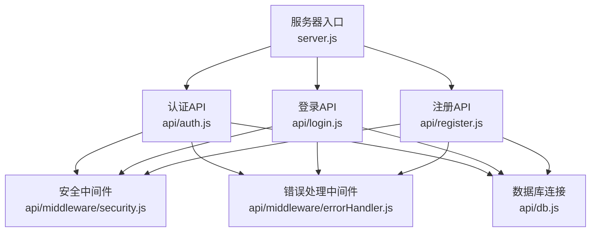
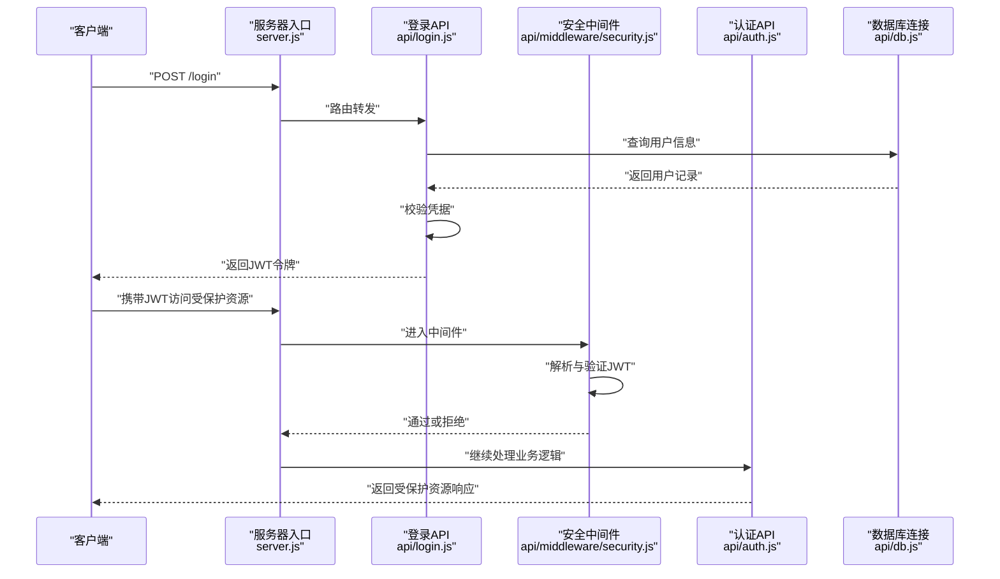
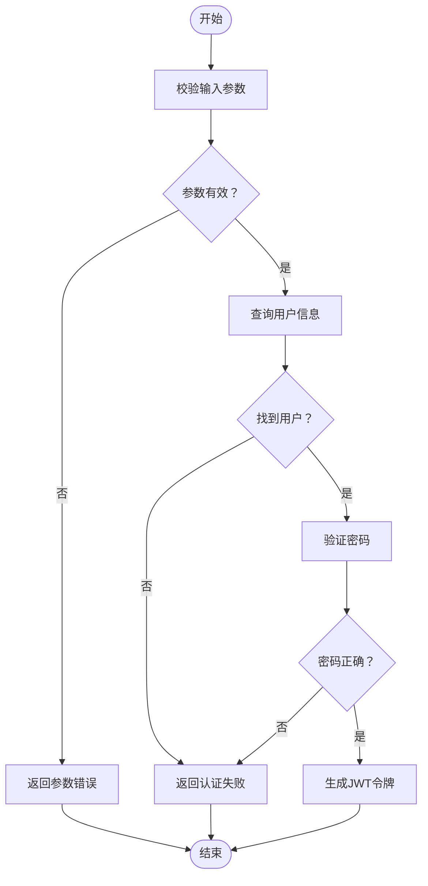
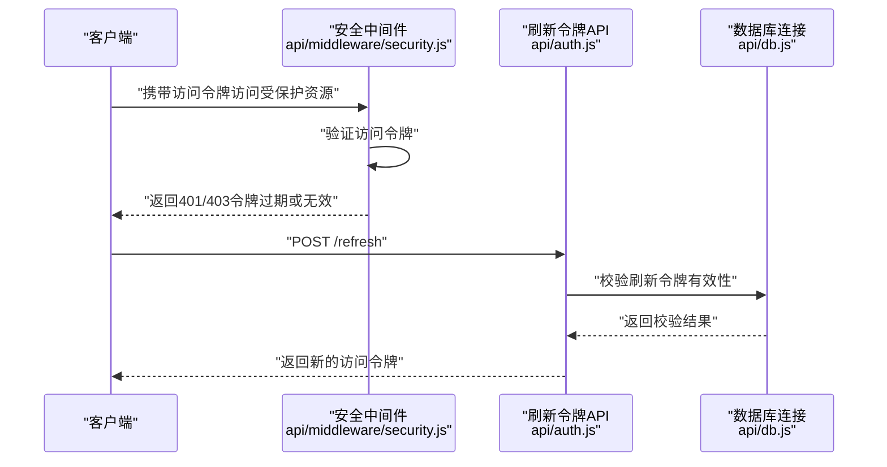
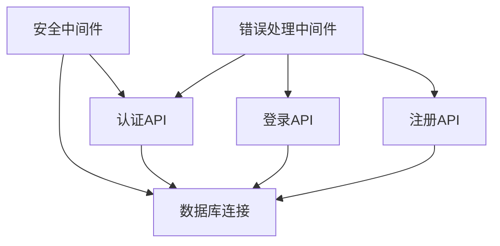

# JWT认证机制

<cite>
**本文档引用的文件**
- [server.js](file://server.js)
- [api/auth.js](file://api/auth.js)
- [api/login.js](file://api/login.js)
- [api/register.js](file://api/register.js)
- [api/middleware/security.js](file://api/middleware/security.js)
- [api/middleware/errorHandler.js](file://api/middleware/errorHandler.js)
- [api/db.js](file://api/db.js)
- [tests/api/auth.test.js](file://tests/api/auth.test.js)
</cite>

## 目录
1. [引言](#引言)
2. [项目结构](#项目结构)
3. [核心组件](#核心组件)
4. [架构总览](#架构总览)
5. [详细组件分析](#详细组件分析)
6. [依赖分析](#依赖分析)
7. [性能考虑](#性能考虑)
8. [故障排除指南](#故障排除指南)
9. [结论](#结论)
10. [附录](#附录)

## 引言
本文件面向AI家教项目的JWT认证机制，系统性阐述令牌生成、验证与刷新流程，覆盖用户登录认证、令牌过期处理与会话管理策略，并给出JWT配置参数、密钥管理与安全存储建议。同时提供令牌使用示例、错误处理机制与最佳实践指南，涵盖密码加密策略（盐值生成与哈希算法选择）、认证中间件实现、权限验证与角色控制机制。

## 项目结构
本项目采用前后端分离架构，后端基于Node.js服务，认证相关逻辑集中在API层与中间件中：
- 服务器入口：server.js
- 认证路由：api/auth.js、api/login.js、api/register.js
- 安全中间件：api/middleware/security.js
- 错误处理：api/middleware/errorHandler.js
- 数据库连接：api/db.js
- 认证测试：tests/api/auth.test.js

**图表来源**
- [server.js](file://server.js)
- [api/auth.js](file://api/auth.js)
- [api/login.js](file://api/login.js)
- [api/register.js](file://api/register.js)
- [api/middleware/security.js](file://api/middleware/security.js)
- [api/middleware/errorHandler.js](file://api/middleware/errorHandler.js)
- [api/db.js](file://api/db.js)

**章节来源**
- [server.js](file://server.js)
- [api/auth.js](file://api/auth.js)
- [api/login.js](file://api/login.js)
- [api/register.js](file://api/register.js)
- [api/middleware/security.js](file://api/middleware/security.js)
- [api/middleware/errorHandler.js](file://api/middleware/errorHandler.js)
- [api/db.js](file://api/db.js)

## 核心组件
- 服务器入口：负责启动HTTP服务并挂载路由。
- 认证API：提供登录、注册、退出等接口。
- 安全中间件：统一拦截请求，执行JWT校验与权限判定。
- 错误处理中间件：标准化异常响应。
- 数据库连接：提供用户数据查询与写入能力。

**章节来源**
- [server.js](file://server.js)
- [api/auth.js](file://api/auth.js)
- [api/middleware/security.js](file://api/middleware/security.js)
- [api/middleware/errorHandler.js](file://api/middleware/errorHandler.js)
- [api/db.js](file://api/db.js)

## 架构总览
下图展示从客户端到后端的典型认证交互流程，包括登录、令牌发放、受保护资源访问与错误处理。

**图表来源**
- [server.js](file://server.js)
- [api/login.js](file://api/login.js)
- [api/middleware/security.js](file://api/middleware/security.js)
- [api/auth.js](file://api/auth.js)
- [api/db.js](file://api/db.js)

## 详细组件分析

### 登录认证流程
- 输入参数：用户名/邮箱与密码。
- 处理步骤：
  - 查询用户信息（用户名/邮箱匹配）。
  - 验证密码（使用安全哈希算法与盐值）。
  - 生成JWT令牌（包含用户标识与必要声明）。
  - 返回令牌给客户端。
- 错误处理：账户不存在、密码错误、系统异常等场景统一由错误处理中间件返回标准格式。

**图表来源**
- [api/login.js](file://api/login.js)
- [api/middleware/errorHandler.js](file://api/middleware/errorHandler.js)
- [api/db.js](file://api/db.js)

**章节来源**
- [api/login.js](file://api/login.js)
- [api/middleware/errorHandler.js](file://api/middleware/errorHandler.js)
- [api/db.js](file://api/db.js)

### JWT令牌生成与配置
- 令牌内容：包含用户标识（如用户ID）、签发时间、过期时间等声明。
- 签发策略：在登录成功后即时签发；可设置短期有效期以降低泄露风险。
- 配置要点（建议）：
  - 过期时间：短期（如1小时），结合刷新令牌机制。
  - 加密算法：对称签名（如HS256）或非对称签名（如RS256）。
  - 密钥管理：使用环境变量存储密钥，定期轮换。
  - 存储策略：客户端仅保存在内存或安全存储中，避免持久化到本地存储。

**章节来源**
- [api/login.js](file://api/login.js)

### JWT验证与刷新机制
- 验证流程：
  - 中间件拦截所有受保护请求。
  - 提取Authorization头中的Bearer令牌。
  - 解析并验证签名、过期时间与声明。
  - 通过后放行，否则返回未授权或令牌无效。
- 刷新策略：
  - 使用独立的刷新令牌（短期有效），用于换取新的访问令牌。
  - 刷新令牌应存储在更安全的位置（如HttpOnly Cookie），并限制其生命周期。
  - 建议在用户登出时使刷新令牌失效。

**图表来源**
- [api/middleware/security.js](file://api/middleware/security.js)
- [api/auth.js](file://api/auth.js)
- [api/db.js](file://api/db.js)

**章节来源**
- [api/middleware/security.js](file://api/middleware/security.js)
- [api/auth.js](file://api/auth.js)
- [api/db.js](file://api/db.js)

### 注册与用户数据管理
- 注册流程：
  - 校验输入参数（用户名、邮箱、密码等）。
  - 对密码进行安全哈希处理与盐值生成。
  - 将用户信息写入数据库。
- 用户数据安全：
  - 不存储明文密码，仅保存哈希后的密码与盐值。
  - 对敏感字段进行最小化暴露。

**章节来源**
- [api/register.js](file://api/register.js)
- [api/db.js](file://api/db.js)

### 权限验证与角色控制
- 角色模型：支持学生、教师、管理员等角色。
- 权限判定：
  - 在中间件中解析用户角色，结合路由或业务逻辑进行授权。
  - 对于不同角色开放不同资源访问权限。
- 最小权限原则：默认拒绝，显式授权。

**章节来源**
- [api/middleware/security.js](file://api/middleware/security.js)
- [api/auth.js](file://api/auth.js)

### 密码加密策略
- 盐值生成：使用安全随机源生成唯一盐值，长度建议至少16字节。
- 哈希算法：推荐使用Argon2、bcrypt或PBKDF2，具备抗暴力破解特性。
- 存储方式：仅存储哈希值与盐值，不保存原始密码。
- 迁移策略：若更换算法，需提供迁移与批量重哈希方案。

**章节来源**
- [api/register.js](file://api/register.js)
- [api/db.js](file://api/db.js)

### 会话管理策略
- 无状态设计：JWT作为无状态令牌，避免服务端会话存储。
- 令牌撤销：通过黑名单或短有效期+刷新令牌组合实现。
- 并发控制：同一账户多设备登录时，建议引入设备指纹与令牌绑定策略。

**章节来源**
- [api/middleware/security.js](file://api/middleware/security.js)
- [api/auth.js](file://api/auth.js)

### 令牌使用示例
- 请求头携带：Authorization: Bearer <JWT_TOKEN>
- 响应处理：成功返回业务数据；认证失败返回401/403；令牌过期提示刷新。

**章节来源**
- [api/middleware/security.js](file://api/middleware/security.js)

## 依赖分析
- 组件耦合：
  - 安全中间件与认证API紧密耦合，共同完成鉴权与授权。
  - 数据库连接被认证与业务API共享，需确保事务一致性与并发安全。
- 外部依赖：
  - JWT库（如jsonwebtoken）用于令牌生成与验证。
  - 加密库（如bcrypt/argon2）用于密码哈希。
  - 错误处理中间件统一输出错误响应。

**图表来源**
- [api/middleware/security.js](file://api/middleware/security.js)
- [api/auth.js](file://api/auth.js)
- [api/login.js](file://api/login.js)
- [api/register.js](file://api/register.js)
- [api/middleware/errorHandler.js](file://api/middleware/errorHandler.js)
- [api/db.js](file://api/db.js)

**章节来源**
- [api/middleware/security.js](file://api/middleware/security.js)
- [api/auth.js](file://api/auth.js)
- [api/login.js](file://api/login.js)
- [api/register.js](file://api/register.js)
- [api/middleware/errorHandler.js](file://api/middleware/errorHandler.js)
- [api/db.js](file://api/db.js)

## 性能考虑
- 令牌大小：尽量精简声明，避免冗余字段。
- 验证开销：在中间件中缓存近期验证过的令牌元数据，减少重复计算。
- 并发与锁：数据库操作使用连接池与事务，避免热点更新导致阻塞。
- 缓存策略：对频繁访问的用户信息进行缓存，缩短鉴权路径。

## 故障排除指南
- 常见问题：
  - 令牌无效：检查签名算法与密钥是否一致。
  - 令牌过期：引导客户端使用刷新令牌获取新令牌。
  - 参数缺失：确认Authorization头格式与内容。
- 调试建议：
  - 开启中间件日志，记录请求ID与用户上下文。
  - 对数据库查询进行超时与重试配置。
  - 使用测试用例覆盖边界条件（空令牌、伪造令牌、过期令牌）。

**章节来源**
- [api/middleware/errorHandler.js](file://api/middleware/errorHandler.js)
- [tests/api/auth.test.js](file://tests/api/auth.test.js)

## 结论
本JWT认证机制以无状态令牌为核心，结合安全中间件与严格的错误处理，实现了高可用的用户认证与授权体系。通过合理的令牌配置、密钥管理与会话策略，可在保障安全性的同时提升用户体验。建议持续完善测试覆盖与监控告警，确保系统稳定运行。

## 附录
- 最佳实践清单：
  - 使用HTTPS传输，防止令牌被窃取。
  - 定期轮换密钥，严格控制密钥访问权限。
  - 启用CORS与安全响应头，降低跨站风险。
  - 对敏感操作增加二次验证（如短信/邮箱验证码）。
  - 实施速率限制与IP白名单策略，抵御暴力破解。