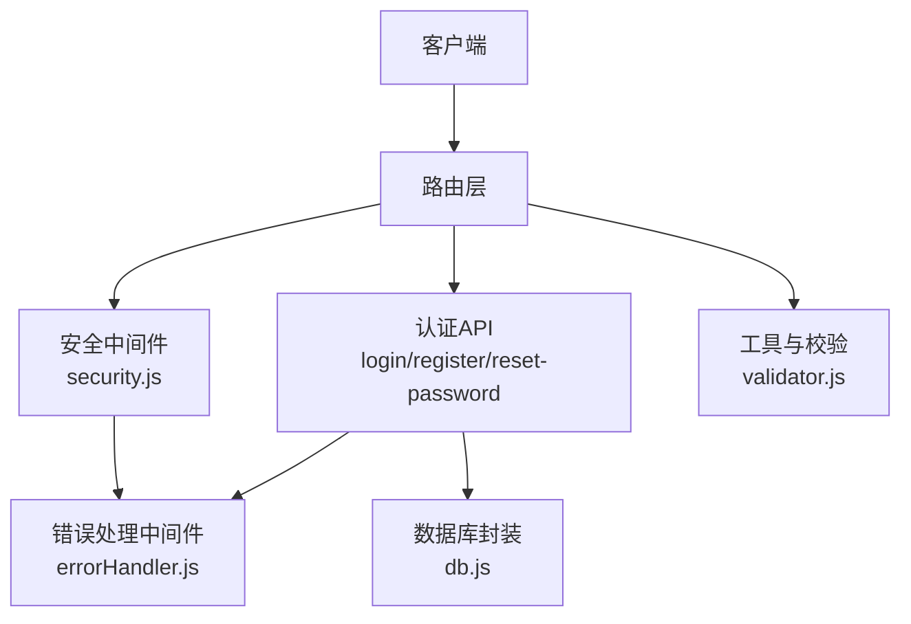
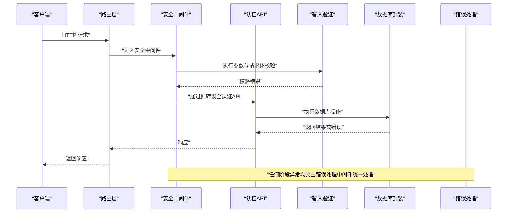
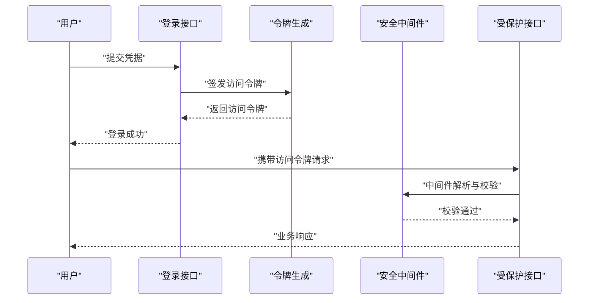
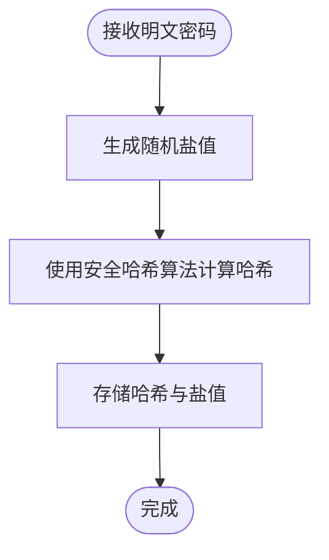
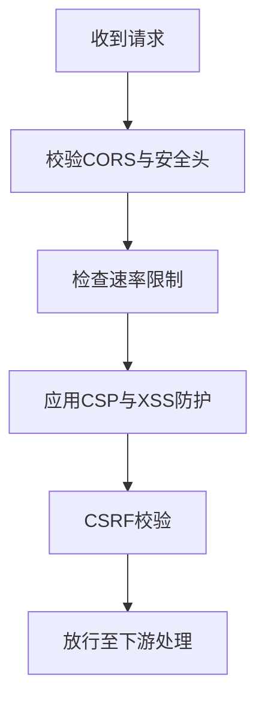
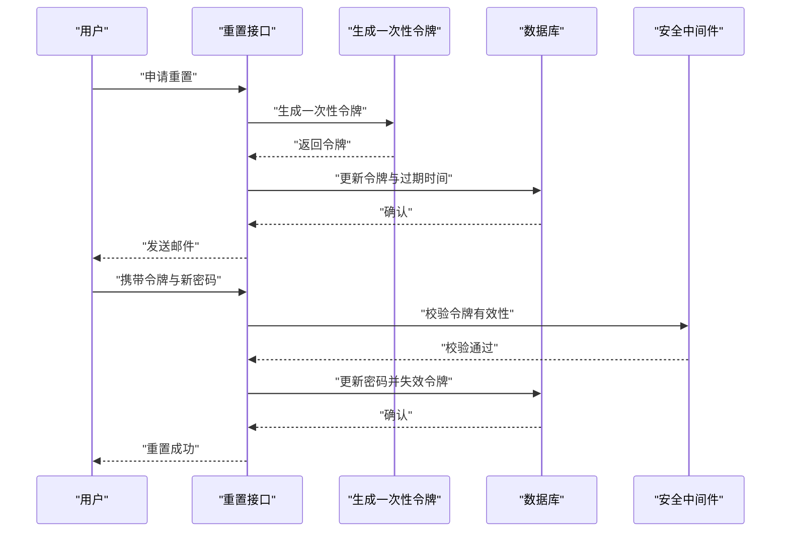
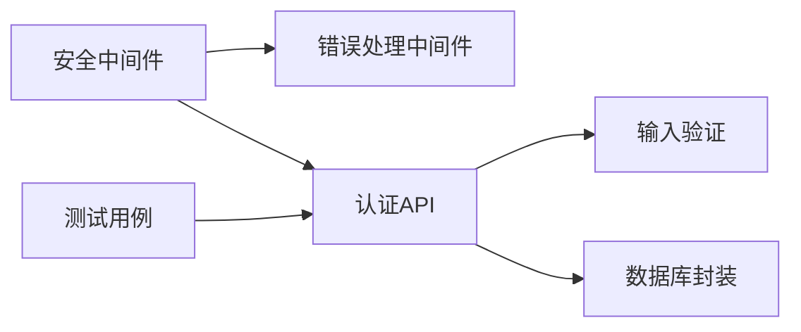

# 安全与认证

<cite>
**本文引用的文件**
- [api/middleware/security.js](file://api/middleware/security.js)
- [api/middleware/errorHandler.js](file://api/middleware/errorHandler.js)
- [api/auth.js](file://api/auth.js)
- [api/login.js](file://api/login.js)
- [api/register.js](file://api/register.js)
- [api/reset-password.js](file://api/reset-password.js)
- [api/utils/validator.js](file://api/utils/validator.js)
- [api/db.js](file://api/db.js)
- [tests/api/auth.test.js](file://tests/api/auth.test.js)
- [tests/api/reset-password.test.js](file://tests/api/reset-password.test.js)
- [server.js](file://server.js)
- [package.json](file://package.json)
</cite>

## 目录
1. [简介](#简介)
2. [项目结构](#项目结构)
3. [核心组件](#核心组件)
4. [架构总览](#架构总览)
5. [详细组件分析](#详细组件分析)
6. [依赖关系分析](#依赖关系分析)
7. [性能考量](#性能考量)
8. [故障排查指南](#故障排查指南)
9. [结论](#结论)
10. [附录](#附录)

## 简介
本文件面向AI家教项目，系统化梳理安全与认证体系，覆盖JWT认证机制、密码加密策略、会话管理、安全中间件、输入验证、XSS/CSRF防护、权限与角色管理、数据访问控制、审计日志、安全配置、漏洞防护、最佳实践、密码重置流程、账户安全策略、异常处理、安全测试与渗透测试、应急响应等。内容以仓库现有实现为基础，结合可操作的建议与图示，帮助开发者与运维人员建立可落地的安全工程能力。

## 项目结构
后端采用Node.js + Express风格的模块化API设计，安全相关逻辑主要集中在以下位置：
- 中间件：统一错误处理与安全策略
- 认证与授权：登录、注册、重置密码、通用鉴权
- 输入校验：参数与请求体验证
- 数据层：数据库连接与查询封装
- 测试：认证与重置密码相关的端到端测试

**图表来源**
- [api/middleware/security.js](file://api/middleware/security.js)
- [api/middleware/errorHandler.js](file://api/middleware/errorHandler.js)
- [api/login.js](file://api/login.js)
- [api/register.js](file://api/register.js)
- [api/reset-password.js](file://api/reset-password.js)
- [api/utils/validator.js](file://api/utils/validator.js)
- [api/db.js](file://api/db.js)

**章节来源**
- [server.js](file://server.js)
- [package.json](file://package.json)

## 核心组件
- 安全中间件：负责CORS、速率限制、请求头校验、XSS/CSRF防护等
- 错误处理中间件：集中捕获异常，输出标准化错误响应
- 认证API：登录、注册、重置密码
- 输入验证：参数与请求体校验
- 数据库封装：统一查询入口
- 测试用例：覆盖认证与重置密码流程

**章节来源**
- [api/middleware/security.js](file://api/middleware/security.js)
- [api/middleware/errorHandler.js](file://api/middleware/errorHandler.js)
- [api/auth.js](file://api/auth.js)
- [api/login.js](file://api/login.js)
- [api/register.js](file://api/register.js)
- [api/reset-password.js](file://api/reset-password.js)
- [api/utils/validator.js](file://api/utils/validator.js)
- [api/db.js](file://api/db.js)
- [tests/api/auth.test.js](file://tests/api/auth.test.js)
- [tests/api/reset-password.test.js](file://tests/api/reset-password.test.js)

## 架构总览
下图展示从客户端到认证API与安全中间件的整体交互路径，以及错误处理贯穿始终的机制。

**图表来源**
- [api/middleware/security.js](file://api/middleware/security.js)
- [api/middleware/errorHandler.js](file://api/middleware/errorHandler.js)
- [api/login.js](file://api/login.js)
- [api/register.js](file://api/register.js)
- [api/reset-password.js](file://api/reset-password.js)
- [api/utils/validator.js](file://api/utils/validator.js)
- [api/db.js](file://api/db.js)

## 详细组件分析

### JWT认证机制
- 登录成功后签发令牌，后续接口通过Authorization头携带令牌进行身份识别
- 令牌中应包含用户标识与过期时间，服务端在安全中间件中解析并校验
- 建议使用短期有效令牌（如15-60分钟），配合刷新令牌（refresh token）实现无感续期
- 刷新令牌存储于安全的HttpOnly Cookie中，降低泄露风险

**图表来源**
- [api/login.js](file://api/login.js)
- [api/middleware/security.js](file://api/middleware/security.js)

**章节来源**
- [api/login.js](file://api/login.js)
- [api/middleware/security.js](file://api/middleware/security.js)

### 密码加密策略
- 注册与重置密码时，对明文密码进行单向哈希（推荐bcrypt）
- 存储仅保存哈希值，不保留明文；登录时比对哈希
- 配合盐值随机化，确保相同明文每次哈希结果不同
- 引入密码强度规则（长度、字符集多样性）与历史密码轮换策略

**图表来源**
- [api/register.js](file://api/register.js)
- [api/reset-password.js](file://api/reset-password.js)

**章节来源**
- [api/register.js](file://api/register.js)
- [api/reset-password.js](file://api/reset-password.js)

### 会话管理
- 采用无状态JWT作为会话凭证，避免服务端会话存储
- 对高敏感操作（如修改密码、删除账户）要求二次确认或额外验证
- 令牌撤销与黑名单：在必要时维护短期令牌黑名单，防止已注销令牌被滥用
- 会话超时与自动登出：根据业务需求设置空闲超时与强制登出策略

**章节来源**
- [api/middleware/security.js](file://api/middleware/security.js)
- [api/auth.js](file://api/auth.js)

### 安全中间件实现
- CORS与安全头：严格限定来源、禁止XSS攻击载荷、启用HSTS
- 速率限制：按IP或用户维度限制请求频率，防暴力破解与DDoS
- 请求头校验：校验Content-Type、Origin、Referer等
- XSS防护：对输入输出进行转义与CSP策略
- CSRF防护：对同源POST/PUT/DELETE请求校验自定义头部或CSRF Token

**图表来源**
- [api/middleware/security.js](file://api/middleware/security.js)

**章节来源**
- [api/middleware/security.js](file://api/middleware/security.js)

### 输入验证规则
- 使用统一验证器对所有入参进行白名单校验与类型约束
- 常见规则：必填字段、长度范围、正则匹配（邮箱、手机号）、枚举值限制
- 对富文本输入进行HTML转义与白名单过滤，防止注入

**章节来源**
- [api/utils/validator.js](file://api/utils/validator.js)

### 权限控制与角色管理
- 角色模型：学生、教师、管理员等，不同角色具备不同资源访问权限
- 路由级权限：在安全中间件或路由层拦截，校验用户角色与资源归属
- 数据访问控制：基于用户ID与资源所属关系进行过滤，避免越权访问

**章节来源**
- [api/middleware/security.js](file://api/middleware/security.js)
- [api/auth.js](file://api/auth.js)

### 数据访问控制与审计日志
- 数据访问控制：所有写操作必须绑定当前用户上下文，读操作按可见性过滤
- 审计日志：记录关键操作（登录、密码变更、删除账户、导出报告）的时间、用户、IP、目标与结果
- 日志脱敏：避免记录完整敏感信息（如密码、完整身份证号）

**章节来源**
- [api/db.js](file://api/db.js)
- [api/auth.js](file://api/auth.js)

### 错误处理机制
- 统一错误响应格式，区分业务错误与系统错误
- 敏感信息不回显，避免泄露内部细节
- 结合中间件链路，确保异常被捕获并标准化输出

**章节来源**
- [api/middleware/errorHandler.js](file://api/middleware/errorHandler.js)

### 密码重置流程
- 用户提交邮箱，系统发送带时效性的重置链接
- 链接有效期短且一次性（one-time token），重置后失效
- 重置完成后立即使旧令牌失效，要求重新登录

**图表来源**
- [api/reset-password.js](file://api/reset-password.js)
- [api/middleware/security.js](file://api/middleware/security.js)
- [api/db.js](file://api/db.js)

**章节来源**
- [api/reset-password.js](file://api/reset-password.js)

### 账户安全策略
- 多因子认证（MFA）：登录与高危操作启用短信/邮件验证码
- 登录失败阈值：连续失败N次锁定账户或临时封禁
- 异常登录检测：基于地理位置、设备指纹、时间窗口的风控告警
- 强制修改弱密码：定期提示用户更换密码

**章节来源**
- [api/login.js](file://api/login.js)
- [api/middleware/security.js](file://api/middleware/security.js)

## 依赖关系分析
- 安全中间件与错误处理中间件贯穿所有路由，形成统一的安全与错误边界
- 认证API依赖输入验证与数据库封装，保证数据一致性与安全性
- 测试用例覆盖认证与重置密码流程，保障关键路径稳定

**图表来源**
- [api/middleware/security.js](file://api/middleware/security.js)
- [api/middleware/errorHandler.js](file://api/middleware/errorHandler.js)
- [api/login.js](file://api/login.js)
- [api/register.js](file://api/register.js)
- [api/reset-password.js](file://api/reset-password.js)
- [api/utils/validator.js](file://api/utils/validator.js)
- [api/db.js](file://api/db.js)
- [tests/api/auth.test.js](file://tests/api/auth.test.js)
- [tests/api/reset-password.test.js](file://tests/api/reset-password.test.js)

**章节来源**
- [tests/api/auth.test.js](file://tests/api/auth.test.js)
- [tests/api/reset-password.test.js](file://tests/api/reset-password.test.js)

## 性能考量
- JWT解析与校验成本低，适合高并发场景；建议缓存热点用户的角色与权限
- 速率限制与CORS检查应尽量前置，减少无效请求进入业务层
- 数据库查询使用索引与分页，避免大事务与长锁

## 故障排查指南
- 登录失败：检查凭据、速率限制、CORS与CSRF配置
- 令牌无效：核对签名、过期时间与签发方；确认是否被撤销
- 参数错误：查看输入验证规则与错误响应
- 数据库异常：检查连接池、事务与索引

**章节来源**
- [api/middleware/errorHandler.js](file://api/middleware/errorHandler.js)
- [api/utils/validator.js](file://api/utils/validator.js)
- [api/db.js](file://api/db.js)

## 结论
本项目已具备基础的安全中间件与错误处理框架，并在认证与重置密码流程中体现了一定的安全意识。建议进一步完善JWT策略（短期令牌+刷新令牌）、强化XSS/CSRF防护、引入角色与数据访问控制、完善审计日志与异常处理，并通过持续的安全测试与渗透评估提升整体安全水平。

## 附录

### 安全配置指南
- 启用HTTPS与HSTS，严格CORS白名单
- 设置安全Cookie属性（Secure、HttpOnly、SameSite）
- 限制请求体大小与上传文件类型
- 开启WAF与DDoS防护

### 漏洞防护方案
- 注入防护：参数化查询、输入白名单、输出转义
- 会话劫持：短令牌、刷新令牌、IP绑定与设备指纹
- 业务逻辑漏洞：风控规则、异常行为检测

### 安全最佳实践
- 最小权限原则与职责分离
- 敏感操作二次确认
- 定期轮换密钥与令牌
- 完整的日志与监控告警

### 安全测试方法
- 单元测试：覆盖输入验证与错误分支
- 集成测试：端到端认证流程与重置密码
- 渗透测试：模拟SQL注入、XSS、CSRF、暴力破解

**章节来源**
- [tests/api/auth.test.js](file://tests/api/auth.test.js)
- [tests/api/reset-password.test.js](file://tests/api/reset-password.test.js)