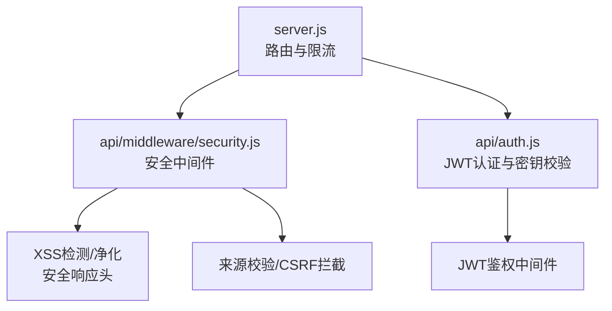
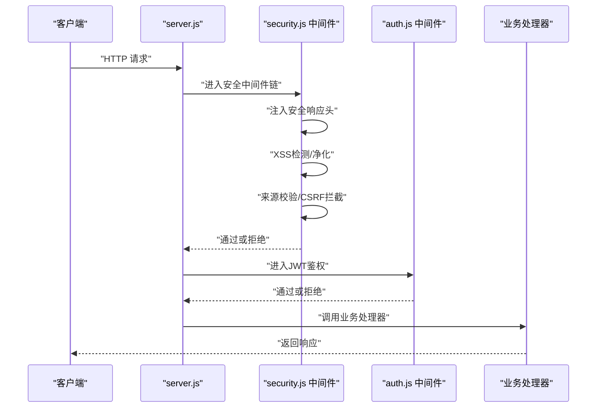
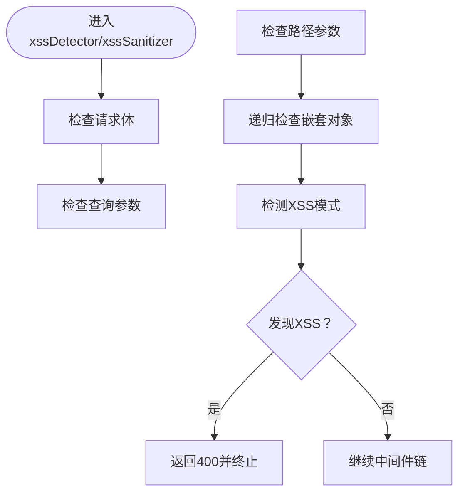
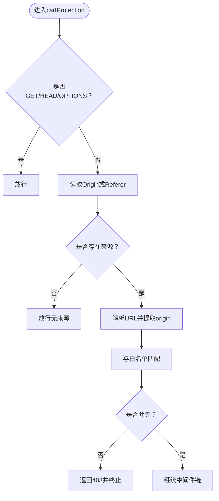
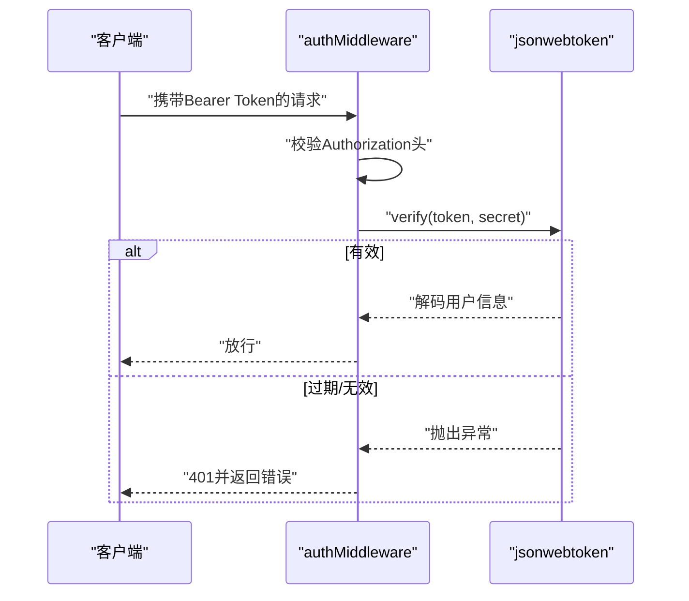
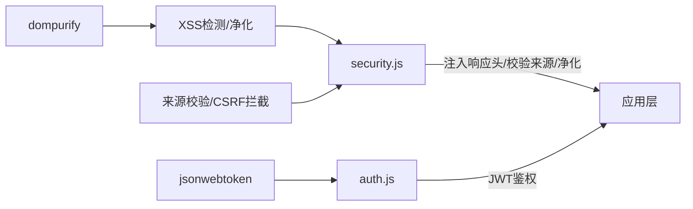

# 跨域与CSRF防护

<cite>
**本文引用的文件**
- [api/middleware/security.js](file://api/middleware/security.js)
- [api/auth.js](file://api/auth.js)
- [tests/api/auth.test.js](file://tests/api/auth.test.js)
- [server.js](file://server.js)
- [tests/api/p5-engineering.test.js](file://tests/api/p5-engineering.test.js)
</cite>

## 目录
1. [简介](#简介)
2. [项目结构](#项目结构)
3. [核心组件](#核心组件)
4. [架构总览](#架构总览)
5. [详细组件分析](#详细组件分析)
6. [依赖关系分析](#依赖关系分析)
7. [性能考量](#性能考量)
8. [故障排查指南](#故障排查指南)
9. [结论](#结论)
10. [附录](#附录)

## 简介
本文件聚焦于AI家教项目的跨域与CSRF防护实现，系统梳理后端中间件中的跨域来源校验、CSRF保护、XSS检测与净化、安全响应头设置等机制，并结合JWT认证流程给出可操作的配置建议、测试方法与排障清单。文档面向开发与运维人员，既提供高层概览也包含代码级定位路径。

## 项目结构
围绕安全主题的关键位置如下：
- 安全中间件：统一注入安全响应头、执行XSS检测与净化、进行来源校验与CSRF拦截
- 认证模块：JWT密钥校验与鉴权中间件
- 服务器入口：路由注册与限流策略
- 测试用例：覆盖JWT密钥强度与认证中间件行为

图表来源
- [server.js:115-159](file://server.js#L115-L159)
- [api/middleware/security.js:1-113](file://api/middleware/security.js#L1-L113)
- [api/auth.js:1-46](file://api/auth.js#L1-L46)

章节来源
- [server.js:115-159](file://server.js#L115-L159)

## 核心组件
- XSS检测与净化中间件：对请求体、查询参数、路径参数进行递归扫描与净化，阻断潜在XSS载荷
- 安全响应头中间件：设置X-Content-Type-Options、X-Frame-Options、X-XSS-Protection、Referrer-Policy、Permissions-Policy等
- CSRF保护中间件：基于白名单来源（Origin或Referer）进行校验，放行GET/HEAD/OPTIONS
- JWT认证与密钥校验：确保JWT密钥强度与有效性，提供鉴权中间件

章节来源
- [api/middleware/security.js:1-113](file://api/middleware/security.js#L1-L113)
- [api/auth.js:1-46](file://api/auth.js#L1-L46)

## 架构总览
下图展示从客户端到后端的典型请求链路，以及各安全组件在其中的职责与调用顺序。

图表来源
- [server.js:115-159](file://server.js#L115-L159)
- [api/middleware/security.js:73-113](file://api/middleware/security.js#L73-L113)
- [api/auth.js:29-46](file://api/auth.js#L29-L46)

## 详细组件分析

### XSS检测与净化中间件
- 功能要点
  - 递归遍历请求对象（body/query/params），识别潜在XSS模式并阻断
  - 对字符串进行DOMPurify净化，移除HTML标签以降低XSS风险
- 复杂度与性能
  - 时间复杂度近似O(n)（n为请求对象键值数量）
  - 建议仅对非幂等请求启用，避免对GET等只读请求造成额外开销
- 错误处理
  - 检测到不安全内容时返回400与统一错误格式

图表来源
- [api/middleware/security.js:23-71](file://api/middleware/security.js#L23-L71)

章节来源
- [api/middleware/security.js:1-71](file://api/middleware/security.js#L1-L71)

### 安全响应头中间件
- 设置项
  - X-Content-Type-Options: nosniff
  - X-Frame-Options: DENY
  - X-XSS-Protection: 1; mode=block
  - Referrer-Policy: strict-origin-when-cross-origin
  - Permissions-Policy: camera=(), microphone=(), geolocation=()
  - 移除X-Powered-By，隐藏技术栈信息
- 影响范围
  - 全站生效，作为中间件链首部插入

章节来源
- [api/middleware/security.js:73-81](file://api/middleware/security.js#L73-L81)

### CSRF保护中间件
- 核心逻辑
  - 放行GET/HEAD/OPTIONS
  - 从Origin或Referer提取来源，与白名单比对
  - 白名单支持本地回环与运行时环境变量扩展
- 预检请求处理
  - OPTIONS请求直接放行，避免影响CORS预检
- 异常处理
  - 来源不在白名单时返回403与统一错误格式

图表来源
- [api/middleware/security.js:89-113](file://api/middleware/security.js#L89-L113)

章节来源
- [api/middleware/security.js:83-113](file://api/middleware/security.js#L83-L113)

### JWT认证与密钥校验
- 密钥校验
  - 必须设置；禁止使用默认值；长度不足32字符发出警告
- 鉴权中间件
  - 校验Authorization头格式；验证JWT签名与有效期
  - 过期与无效令牌分别返回401与统一错误格式

图表来源
- [api/auth.js:12-46](file://api/auth.js#L12-L46)

章节来源
- [api/auth.js:1-46](file://api/auth.js#L1-L46)
- [tests/api/auth.test.js:1-116](file://tests/api/auth.test.js#L1-L116)

## 依赖关系分析
- 中间件链
  - 安全中间件（响应头/XSS/来源校验）通常置于路由之前
  - JWT鉴权中间件在需要认证的路由前执行
- 外部依赖
  - dompurify用于XSS净化
  - jsonwebtoken用于JWT签发与验证
- 内聚与耦合
  - 安全中间件内聚度高，职责清晰
  - 认证模块与密钥管理相互独立，便于测试与替换

图表来源
- [api/middleware/security.js:1-113](file://api/middleware/security.js#L1-L113)
- [api/auth.js:1-46](file://api/auth.js#L1-L46)

章节来源
- [api/middleware/security.js:1-113](file://api/middleware/security.js#L1-L113)
- [api/auth.js:1-46](file://api/auth.js#L1-L46)

## 性能考量
- XSS检测与净化
  - 建议仅对写操作（POST/PUT/DELETE）启用，减少对只读请求的开销
  - 对大体积请求体可考虑分块处理或阈值控制
- CSRF校验
  - 白名单匹配为O(k)（k为白名单数量），通常较小，影响有限
  - 预检请求OPTIONS放行，避免重复校验
- 响应头设置
  - 为常量设置，几乎无性能损耗
- JWT验证
  - 验证成本主要取决于算法与密钥长度，建议使用HS256并保证密钥强度

[本节为通用指导，无需特定文件引用]

## 故障排查指南
- CORS与预检请求
  - 症状：OPTIONS请求被拒绝或跨域失败
  - 排查：确认CSRF中间件对OPTIONS放行；核对Origin或Referer是否在白名单中
  - 参考路径：[api/middleware/security.js:89-113](file://api/middleware/security.js#L89-L113)
- 来源白名单不生效
  - 症状：本地开发无法访问或生产域名被拒
  - 排查：检查ALLOWED_ORIGINS环境变量格式与域名一致性；确认Origin字段存在且可解析
  - 参考路径：[api/middleware/security.js:83-87](file://api/middleware/security.js#L83-L87)
- XSS拦截误报
  - 症状：合法输入被判定为XSS
  - 排查：检查XSS模式正则是否过于严格；必要时放宽规则或调整净化策略
  - 参考路径：[api/middleware/security.js:36-48](file://api/middleware/security.js#L36-L48)
- 安全响应头缺失
  - 症状：浏览器安全扫描报告缺失某些头部
  - 排查：确认安全响应头中间件在路由前注册
  - 参考路径：[api/middleware/security.js:73-81](file://api/middleware/security.js#L73-L81)
- JWT认证失败
  - 症状：401未授权或提示登录过期
  - 排查：检查JWT_SECRET是否设置且非默认值；核对Token签名与有效期
  - 参考路径：[api/auth.js:12-46](file://api/auth.js#L12-L46)，[tests/api/auth.test.js:1-116](file://tests/api/auth.test.js#L1-L116)

章节来源
- [api/middleware/security.js:36-113](file://api/middleware/security.js#L36-L113)
- [api/auth.js:12-46](file://api/auth.js#L12-L46)
- [tests/api/auth.test.js:1-116](file://tests/api/auth.test.js#L1-L116)

## 结论
本项目通过“安全响应头中间件 + XSS检测/净化 + 来源白名单CSRF保护 + JWT认证”的组合，构建了基础而实用的跨域与CSRF防护体系。建议在生产环境中：
- 明确并维护ALLOWED_ORIGINS白名单
- 对敏感接口开启JWT鉴权
- 在网关或反向代理层补充CORS策略，统一处理预检与凭证场景
- 定期审计安全响应头与XSS规则，结合日志与监控评估防护效果

[本节为总结，无需特定文件引用]

## 附录

### 跨域配置示例与最佳实践
- 允许的源列表管理
  - 本地开发：保留http://localhost:3002与http://127.0.0.1:3002
  - 生产环境：通过环境变量ALLOWED_ORIGINS追加域名，逗号分隔
  - 参考路径：[api/middleware/security.js:83-87](file://api/middleware/security.js#L83-L87)
- 预检请求处理
  - 保持OPTIONS放行，避免CORS预检失败
  - 参考路径：[api/middleware/security.js:90-92](file://api/middleware/security.js#L90-L92)
- 自定义头部设置
  - 如需在响应中添加额外头部，可在安全中间件中统一注入
  - 参考路径：[api/middleware/security.js:73-81](file://api/middleware/security.js#L73-L81)
- 浏览器兼容性
  - X-Frame-Options与X-Content-Type-Options广泛支持
  - Referrer-Policy与Permissions-Policy在现代浏览器可用，旧版IE不适用

章节来源
- [api/middleware/security.js:73-87](file://api/middleware/security.js#L73-L87)

### Referer检查与Origin验证
- Origin优先：优先使用Origin字段进行来源校验
- Referer回退：当Origin缺失时回退至Referer
- 白名单匹配：比较协议、主机与端口三元组
- 参考路径：[api/middleware/security.js:94-113](file://api/middleware/security.js#L94-L113)

章节来源
- [api/middleware/security.js:89-113](file://api/middleware/security.js#L89-L113)

### Token验证机制
- 密钥校验：必须设置且非默认值；长度不足32字符发出警告
- 鉴权流程：校验Authorization头格式；验证签名与有效期
- 参考路径：[api/auth.js:12-46](file://api/auth.js#L12-L46)，[tests/api/auth.test.js:1-116](file://tests/api/auth.test.js#L1-L116)

章节来源
- [api/auth.js:12-46](file://api/auth.js#L12-L46)
- [tests/api/auth.test.js:1-116](file://tests/api/auth.test.js#L1-L116)

### 安全测试方法
- 单元测试
  - JWT密钥强度与鉴权中间件行为
  - 参考路径：[tests/api/auth.test.js:1-116](file://tests/api/auth.test.js#L1-L116)
- 工程规范测试
  - 统一错误响应格式与安全中间件使用
  - 参考路径：[tests/api/p5-engineering.test.js:288-297](file://tests/api/p5-engineering.test.js#L288-L297)

章节来源
- [tests/api/auth.test.js:1-116](file://tests/api/auth.test.js#L1-L116)
- [tests/api/p5-engineering.test.js:288-297](file://tests/api/p5-engineering.test.js#L288-L297)