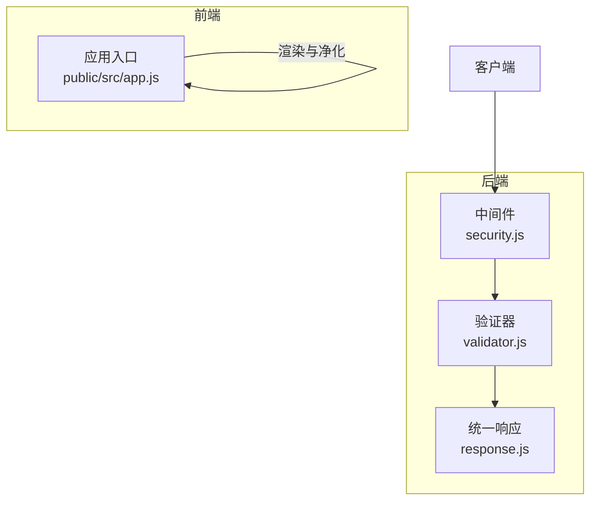
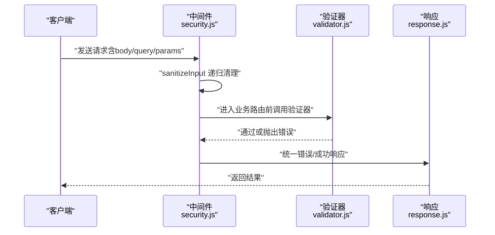
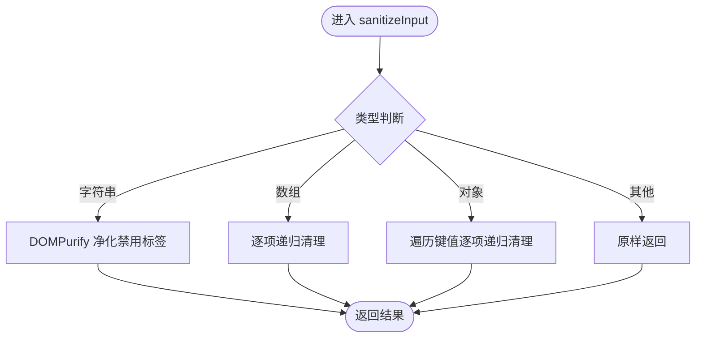
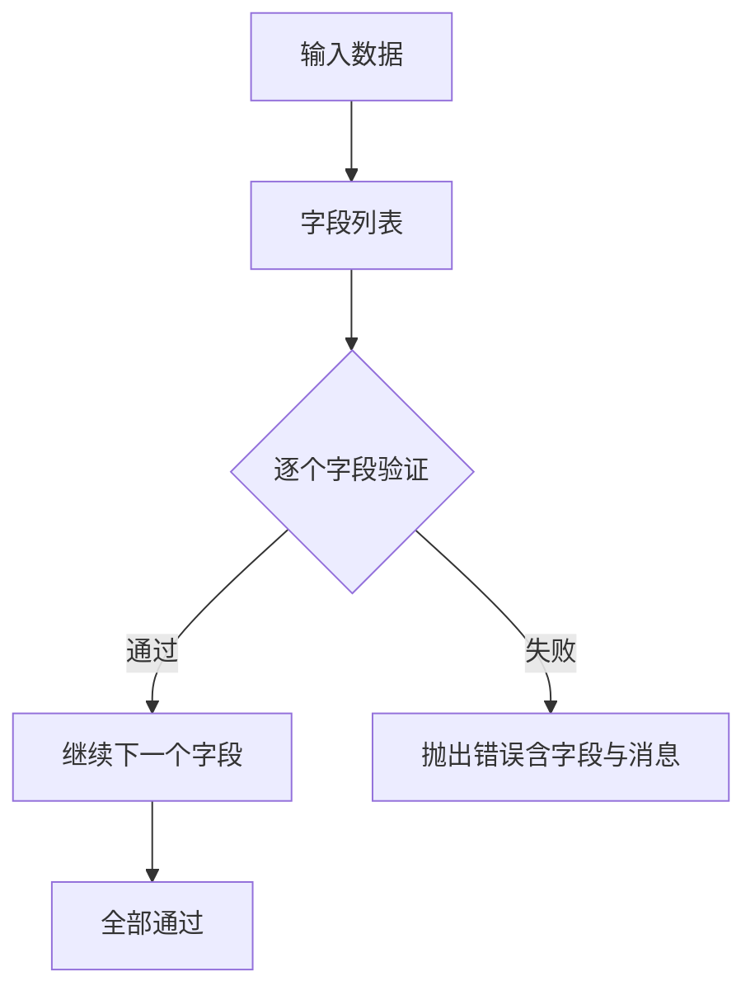
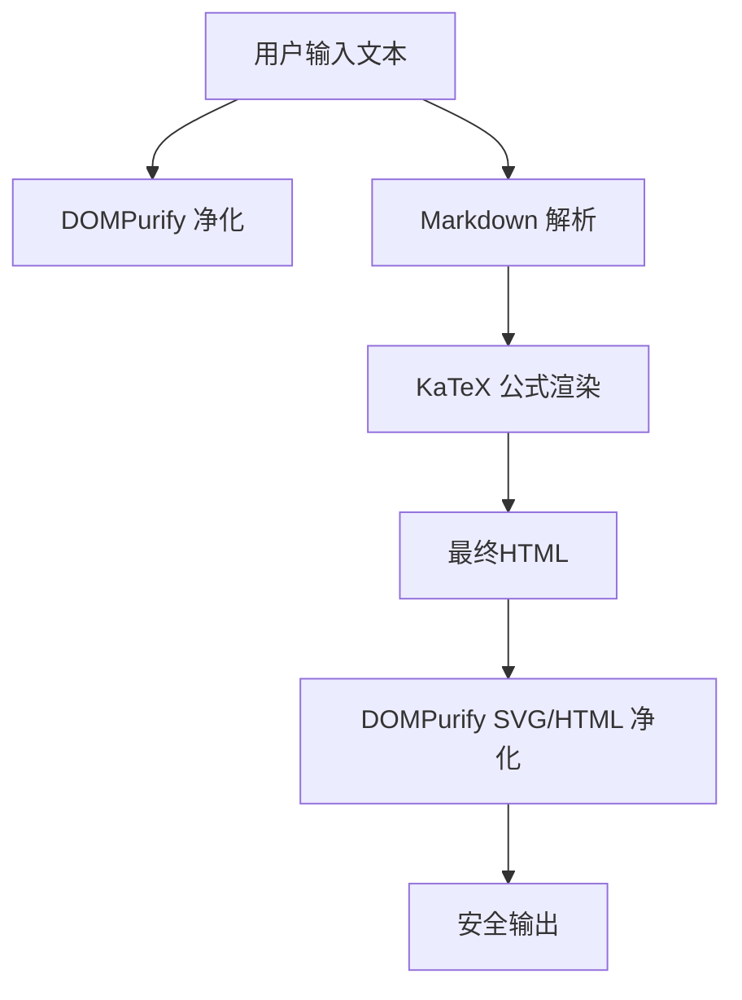
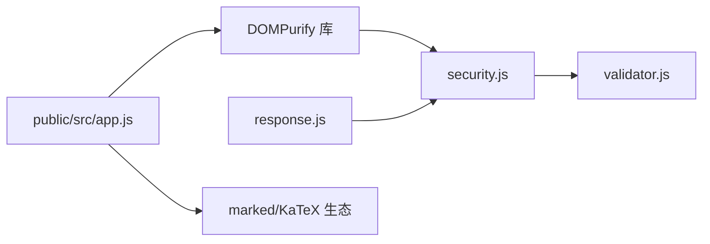

# 输入验证与清理

<cite>
**本文引用的文件**
- [api/middleware/security.js](file://api/middleware/security.js)
- [api/utils/validator.js](file://api/utils/validator.js)
- [public/src/app.js](file://public/src/app.js)
- [api/utils/response.js](file://api/utils/response.js)
- [tests/api/p5-engineering.test.js](file://tests/api/p5-engineering.test.js)
</cite>

## 目录
1. [简介](#简介)
2. [项目结构](#项目结构)
3. [核心组件](#核心组件)
4. [架构总览](#架构总览)
5. [详细组件分析](#详细组件分析)
6. [依赖关系分析](#依赖关系分析)
7. [性能考量](#性能考量)
8. [故障排查指南](#故障排查指南)
9. [结论](#结论)
10. [附录](#附录)

## 简介
本文件聚焦于AI家教项目中的输入验证与清理机制，系统性说明以下内容：
- 基于DOMPurify的XSS防护策略与安全配置
- 正则表达式检测规则与常见攻击模式识别
- 输入过滤与递归清理机制
- 自定义验证器与错误处理
- 数据清洗流程、字符编码与特殊字符过滤
- 安全测试方法、漏洞扫描与防护效果评估

## 项目结构
围绕输入验证与清理的关键位置如下：
- 后端中间件：统一在请求进入时对body/query/params进行DOMPurify清理，并提供XSS检测工具
- 后端业务校验：基于通用验证器组合，确保字段格式与业务约束
- 前端渲染：对富文本与SVG进行有针对性的净化配置
- 统一响应：错误返回遵循统一格式，便于前端与后端一致化处理

**图表来源**
- [api/middleware/security.js:1-48](file://api/middleware/security.js#L1-L48)
- [api/utils/validator.js:81-134](file://api/utils/validator.js#L81-L134)
- [api/utils/response.js](file://api/utils/response.js)
- [public/src/app.js:570-607](file://public/src/app.js#L570-L607)

**章节来源**
- [api/middleware/security.js:1-48](file://api/middleware/security.js#L1-L48)
- [api/utils/validator.js:81-134](file://api/utils/validator.js#L81-L134)
- [public/src/app.js:570-607](file://public/src/app.js#L570-L607)

## 核心组件
- DOMPurify输入清理中间件
  - 对字符串执行净化，对数组与对象进行递归清理
  - 在请求体、查询参数与路由参数上统一应用
- 正则表达式XSS检测
  - 预定义多条模式，覆盖脚本标签、事件处理器、危险协议等
- 业务层验证器
  - 统一的验证组合器，按字段与规则抛出标准化错误
- 前端渲染净化
  - 针对Markdown与SVG的专用配置，限制可接受标签与属性

**章节来源**
- [api/middleware/security.js:4-21](file://api/middleware/security.js#L4-L21)
- [api/middleware/security.js:23-34](file://api/middleware/security.js#L23-L34)
- [api/middleware/security.js:36-48](file://api/middleware/security.js#L36-L48)
- [api/utils/validator.js:81-91](file://api/utils/validator.js#L81-L91)
- [public/src/app.js:572-585](file://public/src/app.js#L572-L585)

## 架构总览
下图展示从客户端到后端中间件、再到业务验证与响应的整体流程。

**图表来源**
- [api/middleware/security.js:23-34](file://api/middleware/security.js#L23-L34)
- [api/utils/validator.js:81-91](file://api/utils/validator.js#L81-L91)
- [api/utils/response.js](file://api/utils/response.js)

## 详细组件分析

### DOMPurify输入清理中间件
- sanitizeInput递归清理
  - 字符串：使用DOMPurify净化，禁用所有标签以阻断XSS
  - 数组：逐项递归清理
  - 对象：遍历键值，逐项递归清理
  - 其他类型：原样返回
- xssSanitizer中间件
  - 在请求进入业务路由前，对body/query/params分别应用sanitizeInput
  - 保证后续业务逻辑接收“已净化”的输入
- detectXSS正则检测
  - 覆盖脚本标签、事件处理器、危险协议与表达式等典型模式
  - 适用于二次检测或日志记录场景

**图表来源**
- [api/middleware/security.js:4-21](file://api/middleware/security.js#L4-L21)

**章节来源**
- [api/middleware/security.js:4-21](file://api/middleware/security.js#L4-L21)
- [api/middleware/security.js:23-34](file://api/middleware/security.js#L23-L34)
- [api/middleware/security.js:36-48](file://api/middleware/security.js#L36-L48)

### 正则表达式检测规则与常见攻击模式
- 检测模式涵盖
  - 脚本标签闭合与嵌套
  - 危险协议（如javascript:）
  - HTML事件处理器（onxxx=）
  - data协议与vbscript
  - CSS表达式
- 使用建议
  - detectXSS用于快速判定风险字符串
  - 结合DOMPurify作为最终防线
  - 记录告警日志以便审计

**章节来源**
- [api/middleware/security.js:36-48](file://api/middleware/security.js#L36-L48)

### 业务层输入验证与错误处理
- 验证器组合器
  - validate函数遍历字段与规则，任一失败即抛出标准化错误
  - login/register/question等场景提供专用验证集合
- 错误处理
  - validate内部在失败时抛出带字段与消息的错误
  - 统一响应模块负责构造错误响应，避免原始错误泄露

**图表来源**
- [api/utils/validator.js:81-91](file://api/utils/validator.js#L81-L91)

**章节来源**
- [api/utils/validator.js:81-91](file://api/utils/validator.js#L81-L91)
- [api/utils/validator.js:93-118](file://api/utils/validator.js#L93-L118)
- [api/utils/response.js](file://api/utils/response.js)

### 前端渲染净化与特殊字符处理
- 文本净化
  - 使用window.DOMPurify.sanitize对用户输入进行净化
- SVG净化
  - 限定SVG/滤镜配置，允许必要属性，禁止脚本与事件属性
- Markdown渲染
  - 公式块与行内公式通过KaTeX渲染
  - 图片URL自动转换为Markdown图片语法
  - 渲染后HTML交由DOMPurify进一步净化

**图表来源**
- [public/src/app.js:572-585](file://public/src/app.js#L572-L585)
- [public/src/app.js:587-607](file://public/src/app.js#L587-L607)

**章节来源**
- [public/src/app.js:572-585](file://public/src/app.js#L572-L585)
- [public/src/app.js:587-607](file://public/src/app.js#L587-L607)

## 依赖关系分析
- 中间件依赖DOMPurify库与统一响应模块
- 验证器依赖统一错误抛出机制
- 前端依赖window.DOMPurify与marked/KaTeX生态

**图表来源**
- [api/middleware/security.js:1-2](file://api/middleware/security.js#L1-L2)
- [api/utils/response.js](file://api/utils/response.js)
- [api/utils/validator.js:81-91](file://api/utils/validator.js#L81-L91)
- [public/src/app.js:572-585](file://public/src/app.js#L572-L585)

**章节来源**
- [api/middleware/security.js:1-2](file://api/middleware/security.js#L1-L2)
- [api/utils/validator.js:81-91](file://api/utils/validator.js#L81-L91)
- [public/src/app.js:572-585](file://public/src/app.js#L572-L585)

## 性能考量
- DOMPurify开销
  - 对大文本或深层嵌套对象的递归清理会带来CPU与内存压力
  - 建议仅对不可信输入启用净化，避免对纯数字、短小字段过度处理
- 正则检测成本
  - XSS_PATTERNS数量有限，匹配成本低；但应避免在高频路径重复编译正则
- 前端渲染
  - KaTeX渲染可能较重，建议对长文本分段或延迟渲染

[本节为通用指导，不直接分析具体文件]

## 故障排查指南
- 请求被拒绝或出现异常响应
  - 检查是否正确引入中间件并应用于目标路由
  - 确认sanitizeInput对body/query/params均生效
- 验证失败
  - 查看抛出的字段与消息，确认客户端提交的数据格式
  - 使用统一错误响应模块核对错误结构
- 前端显示异常
  - 检查DOMPurify配置是否与预期一致
  - 确认Markdown与KaTeX渲染链路无异常

**章节来源**
- [api/middleware/security.js:23-34](file://api/middleware/security.js#L23-L34)
- [api/utils/validator.js:81-91](file://api/utils/validator.js#L81-L91)
- [api/utils/response.js](file://api/utils/response.js)
- [public/src/app.js:572-585](file://public/src/app.js#L572-L585)

## 结论
本项目采用“中间件净化+正则检测+业务验证+前端渲染净化”的多层防护体系：
- DOMPurify确保不可信输入在服务端与前端均被严格净化
- 正则检测提供快速风险识别
- 业务验证器保障数据格式与业务一致性
- 统一响应与测试规范提升整体安全性与可观测性

[本节为总结性内容，不直接分析具体文件]

## 附录

### 输入验证示例与最佳实践
- 示例场景
  - 登录：邮箱格式与密码强度校验
  - 注册：邮箱、密码、必填字段校验
  - 提交题目：题干、学科、难度、分数等字段校验
- 自定义验证器
  - 可在现有验证器基础上扩展字段级规则
  - 使用统一的validate组合器组织多字段校验
- 错误处理
  - 业务层抛出标准化错误，由统一响应模块输出

**章节来源**
- [api/utils/validator.js:93-118](file://api/utils/validator.js#L93-L118)
- [api/utils/validator.js:81-91](file://api/utils/validator.js#L81-L91)
- [api/utils/response.js](file://api/utils/response.js)

### 安全测试方法与防护效果评估
- 测试策略
  - 单元测试：针对中间件与验证器编写用例
  - 集成测试：模拟XSS载荷，验证净化与检测是否生效
  - 规范检查：确保错误返回不泄露原始错误信息
- 漏洞扫描建议
  - 静态扫描：检查是否存在原始错误返回模式
  - 动态扫描：对净化后的输出进行回归测试
- 防护效果评估
  - 对比净化前后的内容差异
  - 记录告警日志，统计触发正则检测的次数与类型

**章节来源**
- [tests/api/p5-engineering.test.js:315-327](file://tests/api/p5-engineering.test.js#L315-L327)
- [api/middleware/security.js:36-48](file://api/middleware/security.js#L36-L48)