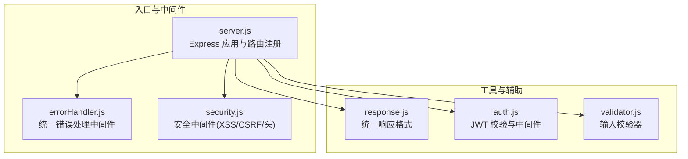
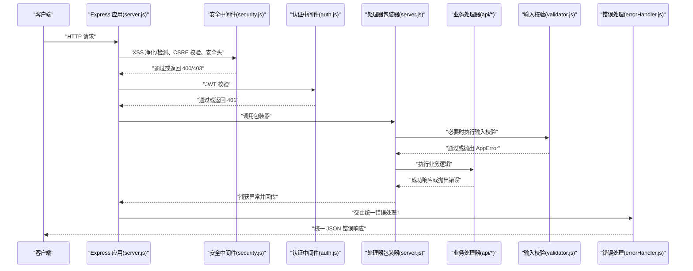
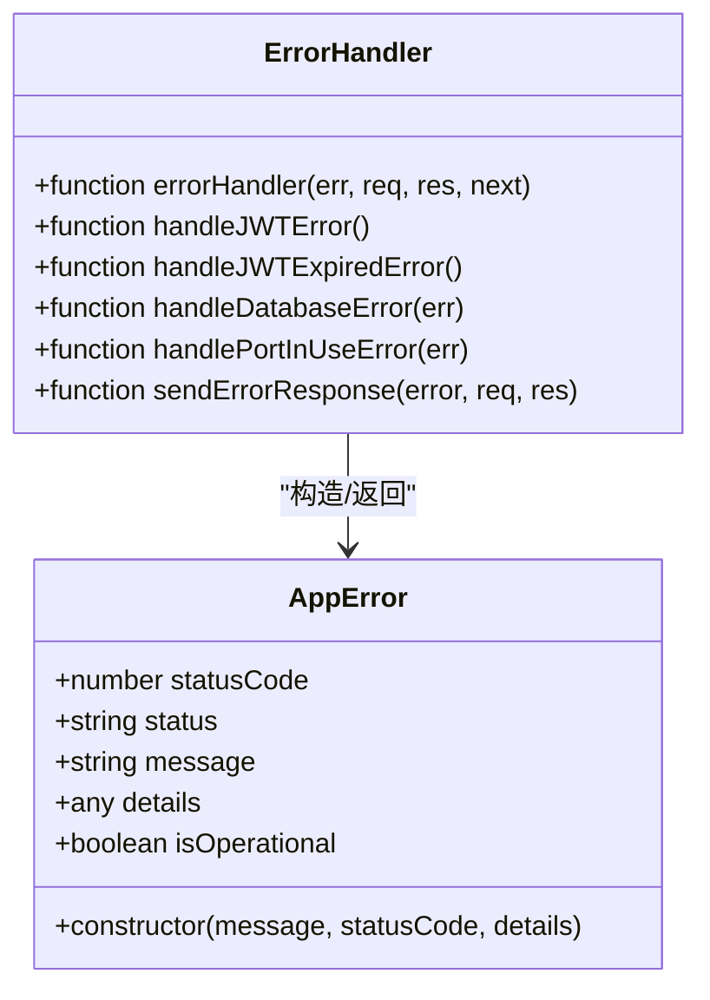
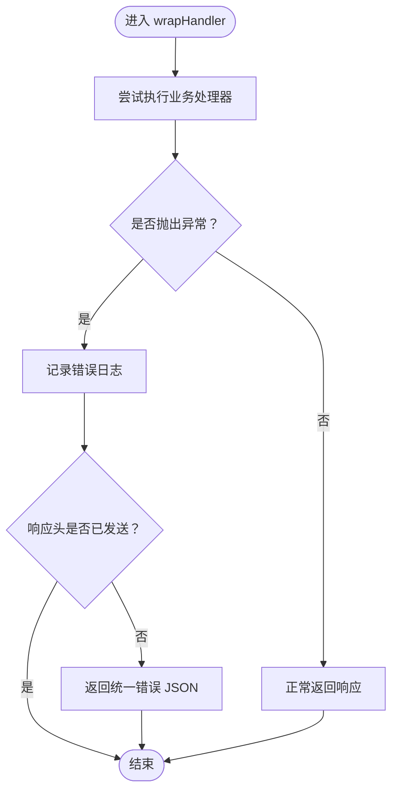
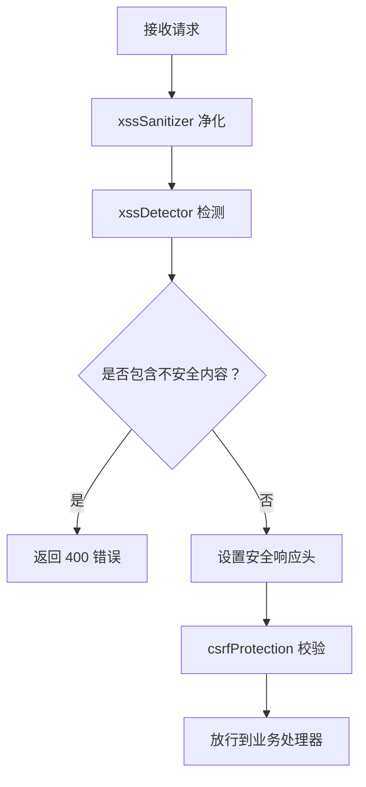
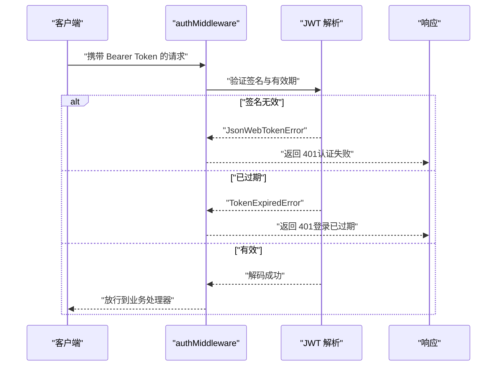
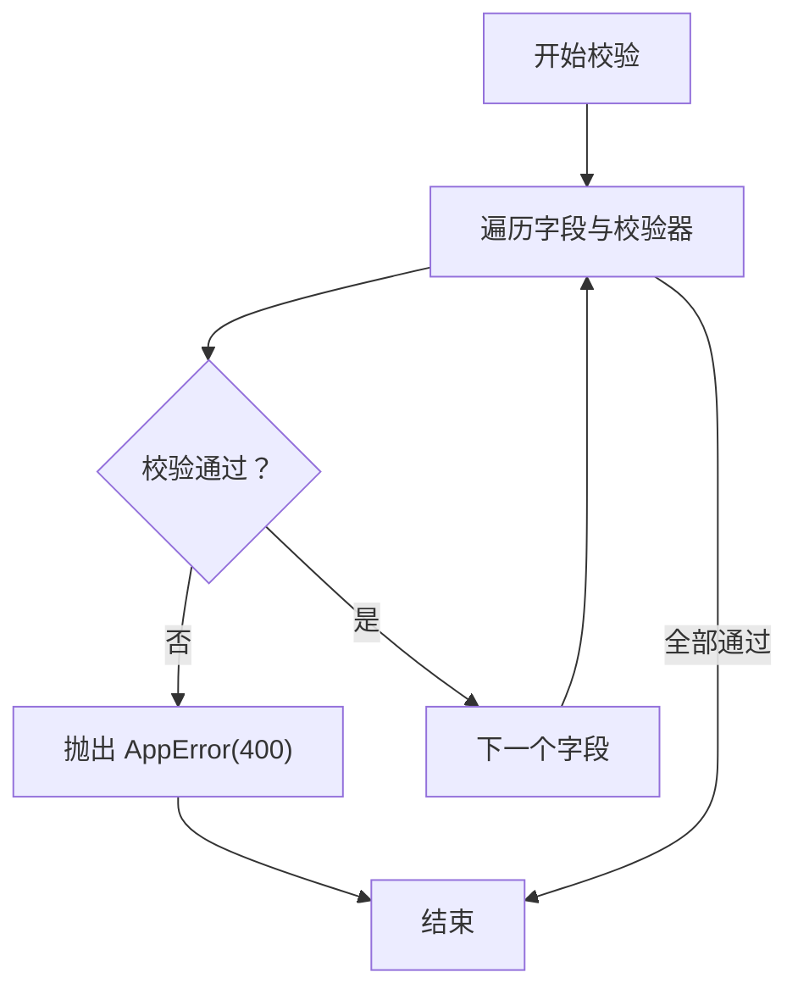
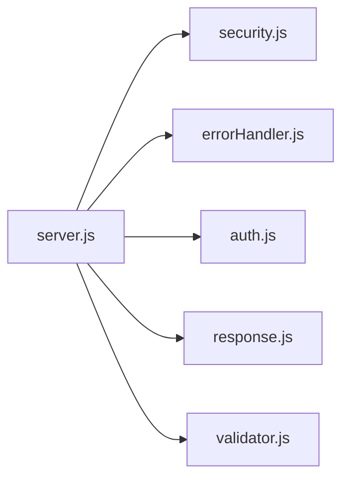

# 错误处理与安全响应

<cite>
**本文引用的文件**
- [server.js](file://server.js)
- [errorHandler.js](file://api/middleware/errorHandler.js)
- [security.js](file://api/middleware/security.js)
- [response.js](file://api/utils/response.js)
- [auth.js](file://api/auth.js)
- [validator.js](file://api/utils/validator.js)
- [ci.yml](file://.github/workflows/ci.yml)
</cite>

## 目录
1. [简介](#简介)
2. [项目结构](#项目结构)
3. [核心组件](#核心组件)
4. [架构总览](#架构总览)
5. [详细组件分析](#详细组件分析)
6. [依赖关系分析](#依赖关系分析)
7. [性能考量](#性能考量)
8. [故障排查指南](#故障排查指南)
9. [结论](#结论)
10. [附录](#附录)

## 简介
本文件面向“AI家教”项目的后端服务，系统性梳理错误处理与安全响应的设计与实现，覆盖统一错误响应格式、错误分类与安全信息处理、敏感信息过滤、错误日志与调试信息控制、HTTP状态码规范、错误消息本地化与客户端友好提示、错误处理中间件与异常捕获机制、恢复策略、安全日志与审计跟踪、违规检测、错误监控方法、性能影响分析以及安全事件响应流程。目标是帮助开发者与运维人员快速理解并正确使用现有机制，同时为后续演进提供参考。

## 项目结构
后端基于 Express 框架，采用“中间件 + 路由处理器”的分层组织方式。错误处理与安全相关的核心模块位于以下位置：
- 中间件：api/middleware/errorHandler.js、api/middleware/security.js
- 响应工具：api/utils/response.js
- 认证与鉴权：api/auth.js
- 输入校验：api/utils/validator.js
- 入口与路由注册：server.js
- CI 安全扫描：.github/workflows/ci.yml

图表来源
- [server.js:1-221](file://server.js#L1-L221)
- [errorHandler.js:1-75](file://api/middleware/errorHandler.js#L1-L75)
- [security.js:1-114](file://api/middleware/security.js#L1-L114)
- [response.js:1-69](file://api/utils/response.js#L1-L69)
- [auth.js:1-47](file://api/auth.js#L1-L47)
- [validator.js:1-135](file://api/utils/validator.js#L1-L135)

章节来源
- [server.js:1-221](file://server.js#L1-L221)

## 核心组件
- 统一错误响应格式与类
  - AppError 类：封装业务错误，自动区分 4xx 与 5xx，并标记为可操作错误；支持携带 details 与堆栈信息。
  - sendErrorResponse：输出统一 JSON 结构，包含 success、message、status、details（可选）、stack（开发环境可选）。
- 错误处理中间件
  - errorHandler：集中捕获异常，识别 JWT 过期/无效、SQLite 错误、端口占用等场景，转换为 AppError 并返回统一格式。
- 安全中间件
  - securityHeaders：设置安全响应头，禁用嗅探、点击劫持防护、严格来源策略等。
  - xssSanitizer/xssDetector：对请求体、查询参数、路径参数进行净化与检测，阻断常见 XSS。
  - csrfProtection：基于白名单 Origin/Referer 的 CSRF 防护。
- 响应工具
  - successResponse/errorResponse/paginatedResponse/createdResponse/deletedResponse：标准化成功/错误/分页/创建/删除响应。
  - validateResponseFormat：用于验证响应格式是否符合约定。
- 认证与鉴权
  - validateJWTSecret：启动时强制校验 JWT 密钥安全性。
  - authMiddleware：Barear Token 验证，处理过期与认证失败场景。
- 输入校验
  - 多种字段校验器（邮箱、密码、题目、学科、难度、分值、年份），统一抛出 AppError，便于前端友好提示。

章节来源
- [errorHandler.js:1-75](file://api/middleware/errorHandler.js#L1-L75)
- [response.js:1-69](file://api/utils/response.js#L1-L69)
- [security.js:1-114](file://api/middleware/security.js#L1-L114)
- [auth.js:1-47](file://api/auth.js#L1-L47)
- [validator.js:1-135](file://api/utils/validator.js#L1-L135)

## 架构总览
下图展示从请求进入至响应返回的关键路径，包括安全中间件、认证中间件、业务处理器包装器、输入校验与统一错误处理的整体流程。

图表来源
- [server.js:115-124](file://server.js#L115-L124)
- [security.js:23-81](file://api/middleware/security.js#L23-L81)
- [auth.js:29-46](file://api/auth.js#L29-L46)
- [validator.js:81-91](file://api/utils/validator.js#L81-L91)
- [errorHandler.js:13-37](file://api/middleware/errorHandler.js#L13-L37)

## 详细组件分析

### 统一错误响应与 AppError 类
- 设计要点
  - 自动根据状态码前缀区分“fail/ error”，便于前端统一处理。
  - details 字段承载底层错误码或上下文，便于定位问题。
  - 开发环境暴露 stack，生产环境隐藏，兼顾调试与安全。
- 适用范围
  - 所有业务异常、数据库异常、认证异常、网络端口冲突等均通过 AppError 规范化输出。

图表来源
- [errorHandler.js:1-75](file://api/middleware/errorHandler.js#L1-L75)

章节来源
- [errorHandler.js:1-75](file://api/middleware/errorHandler.js#L1-L75)

### 错误处理中间件与异常捕获
- 异常捕获机制
  - 全局包装器 wrapHandler：捕获业务处理器抛出的异常，避免未捕获异常导致进程崩溃；在响应头未发送时返回统一错误。
  - errorHandler：Express 错误处理中间件，集中处理 JWT、数据库、端口占用等特定错误类型，最终以统一 JSON 输出。
- 恢复策略
  - 对于可预期的业务错误（如参数缺失、格式不合法）通过 AppError 返回，前端可据此提示用户。
  - 对于系统级错误（如数据库不可用、端口占用）返回 5xx 或 503，并在开发环境保留堆栈以便定位。

图表来源
- [server.js:115-124](file://server.js#L115-L124)

章节来源
- [server.js:115-124](file://server.js#L115-L124)
- [errorHandler.js:13-37](file://api/middleware/errorHandler.js#L13-L37)

### 安全中间件与敏感信息过滤
- XSS 防护
  - xssSanitizer：递归净化请求体、查询参数、路径参数中的潜在危险标签与属性。
  - xssDetector：正则匹配常见 XSS 模式，若命中直接返回 400。
- CSRF 防护
  - csrfProtection：仅对非 GET/HEAD/OPTIONS 方法进行防护；校验 Origin/Referer 是否在白名单中，不在则返回 403。
- 安全响应头
  - securityHeaders：设置 X-Content-Type-Options、X-Frame-Options、X-XSS-Protection、Referrer-Policy、Permissions-Policy 等，移除易泄露的 X-Powered-By。
- 敏感信息过滤
  - 通过 DOMPurify 与自定义正则双重保障，确保输入与查询参数不包含脚本与事件绑定代码。

图表来源
- [security.js:23-114](file://api/middleware/security.js#L23-L114)

章节来源
- [security.js:1-114](file://api/middleware/security.js#L1-L114)

### 认证与鉴权
- JWT 密钥安全
  - validateJWTSecret：启动时强制要求设置 JWT_SECRET，禁止使用默认值与弱密钥，否则拒绝启动。
- 认证中间件
  - authMiddleware：校验 Authorization 头，解析并验证 JWT；对过期与无效 token 分别返回 401。

图表来源
- [auth.js:12-27](file://api/auth.js#L12-L27)
- [auth.js:29-46](file://api/auth.js#L29-L46)
- [errorHandler.js:20-26](file://api/middleware/errorHandler.js#L20-L26)

章节来源
- [auth.js:1-47](file://api/auth.js#L1-L47)
- [errorHandler.js:20-26](file://api/middleware/errorHandler.js#L20-L26)

### 输入校验与错误消息本地化
- 校验器覆盖
  - 邮箱格式、密码长度与复杂度、必填字段、题目内容长度与格式、学科枚举、难度与分值范围、年份范围等。
- 抛错规范
  - 任一校验失败即抛出 AppError，状态码 400，message 包含具体字段与原因，便于前端直接展示。
- 本地化建议
  - 当前 message 为中文；若需国际化，可在业务层按语言映射 message，保持 details 与 status 不变，保证前后端契约稳定。

图表来源
- [validator.js:81-91](file://api/utils/validator.js#L81-L91)
- [validator.js:93-108](file://api/utils/validator.js#L93-L108)

章节来源
- [validator.js:1-135](file://api/utils/validator.js#L1-L135)

### HTTP 状态码规范与客户端友好提示
- 状态码使用
  - 400：参数校验失败、请求包含不安全内容、CSRF 拦截。
  - 401：未认证、Token 无效、Token 过期。
  - 403：来源不在白名单。
  - 404：API 端点不存在。
  - 500：服务器内部错误（业务异常未被捕获时）。
  - 503：端口占用等临时不可用。
- 响应结构
  - 成功：success=true，message（可选），data 或 pagination。
  - 失败：success=false，message，status，details（可选），stack（开发环境）。
- 客户端提示
  - 建议前端依据 status 与 message 展示对应提示；对于 401/403/400 场景，优先引导用户重试或修正输入。

章节来源
- [response.js:1-69](file://api/utils/response.js#L1-L69)
- [errorHandler.js:56-72](file://api/middleware/errorHandler.js#L56-L72)
- [server.js:201-203](file://server.js#L201-L203)

### 错误日志记录与调试信息控制
- 日志策略
  - 业务处理器内部异常通过 wrapHandler 记录错误日志；统一错误中间件负责输出标准化响应。
  - 开发环境可显示 stack，生产环境隐藏，避免敏感信息泄露。
- 调试信息控制
  - 仅在 NODE_ENV=development 时附加 stack；生产环境仅输出 message 与 status。

章节来源
- [server.js:119-121](file://server.js#L119-L121)
- [errorHandler.js:67-69](file://api/middleware/errorHandler.js#L67-L69)

### 安全日志记录、审计跟踪与违规检测
- 安全日志
  - 可在安全中间件中增加访问日志（Origin、Method、Path、时间戳、结果），结合日志系统进行审计。
- 审计跟踪
  - 对关键操作（登录、注册、答题、生成报告等）记录用户标识、IP、UA、时间与结果，便于追踪。
- 违规检测
  - XSS 检测与 CSRF 校验作为前置防线；可扩展黑名单规则与速率限制策略。

章节来源
- [security.js:23-114](file://api/middleware/security.js#L23-L114)
- [server.js:44-46](file://server.js#L44-L46)

### 错误监控方法与性能影响分析
- 监控指标
  - 错误率（4xx/5xx 占比）、Top 失败端点、Top 失败原因、响应时间 P50/P95、速率限制触发次数。
- 性能影响
  - 安全中间件开销极低；速率限制与输入校验带来一定 CPU 开销，但换取更高的稳定性与安全性。
- 建议
  - 将错误统计接入监控平台；对高频失败端点进行优化；对速率限制阈值进行 A/B 测试调整。

章节来源
- [server.js:44-46](file://server.js#L44-L46)

### 安全事件响应流程
- 快速处置
  - 发现异常：立即检查日志与告警；必要时降级接口或临时关闭风险端点。
  - 隔离与修复：修复漏洞后灰度发布，观察监控指标；确认无误后全量上线。
- 回溯与改进
  - 归档日志与审计记录；更新安全策略与测试用例；加强 CI 安全扫描。

章节来源
- [ci.yml:49-65](file://.github/workflows/ci.yml#L49-L65)

## 依赖关系分析
- server.js 依赖
  - 安全中间件：securityHeaders、xssSanitizer、xssDetector、csrfProtection
  - 错误处理：errorHandler
  - 认证：authMiddleware、validateJWTSecret
  - 响应工具：response.js
  - 输入校验：validator.js
- 耦合与内聚
  - 中间件职责单一，耦合度低；统一错误与响应格式提升内聚性。
- 循环依赖
  - 未发现循环依赖迹象；各模块通过导出函数/类相互协作。

图表来源
- [server.js:34-35](file://server.js#L34-L35)
- [server.js:49-54](file://server.js#L49-L54)

章节来源
- [server.js:1-221](file://server.js#L1-L221)

## 性能考量
- 中间件顺序
  - 安全中间件置于最前，尽早拦截恶意请求，减少后续处理成本。
- 速率限制
  - 登录、代理、通用 API 分别设置不同窗口与上限，平衡用户体验与抗压能力。
- 响应体积
  - 统一响应结构简洁；仅在开发环境返回 stack，避免生产环境额外带宽消耗。

章节来源
- [server.js:44-46](file://server.js#L44-L46)
- [errorHandler.js:67-69](file://api/middleware/errorHandler.js#L67-L69)

## 故障排查指南
- 常见问题与定位
  - 401 未认证/过期：检查 Authorization 头与 JWT_SECRET 设置；确认 token 未过期。
  - 400 参数错误：检查 validator.js 抛出的具体字段与原因；前端展示 message。
  - 403 来源受限：检查 ALLOWED_ORIGINS 环境变量与请求 Origin/Referer。
  - 500 服务器错误：查看 wrapHandler 记录的日志；确认是否遗漏 try/catch。
  - 503 端口占用：检查端口占用情况并释放。
- 排查步骤
  - 启用开发模式查看 stack；核对响应 details；结合日志定位根因；必要时降低速率限制进行复现。

章节来源
- [auth.js:12-27](file://api/auth.js#L12-L27)
- [errorHandler.js:20-34](file://api/middleware/errorHandler.js#L20-L34)
- [server.js:119-121](file://server.js#L119-L121)

## 结论
本项目在错误处理与安全响应方面形成了“统一格式 + 多层防护 + 明确规范”的体系：通过 AppError 与统一响应格式确保前后端契约清晰；通过安全中间件与速率限制构建基础防线；通过启动校验与包装器增强健壮性。建议在现有基础上完善安全日志与审计、国际化错误消息、更细粒度的监控与告警，持续提升系统的可观测性与安全性。

## 附录
- CI 安全扫描
  - 在 CI 中执行 npm audit，将安全风险纳入质量门禁，降低供应链风险。

章节来源
- [ci.yml:49-65](file://.github/workflows/ci.yml#L49-L65)