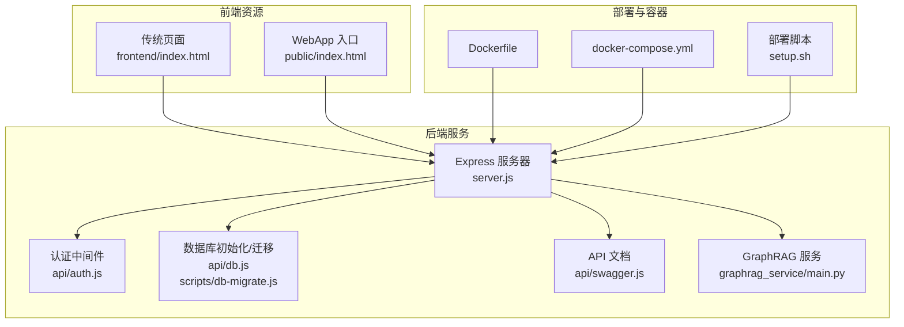
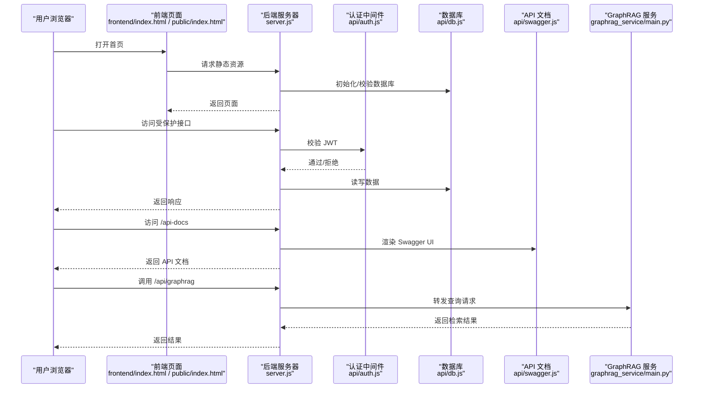
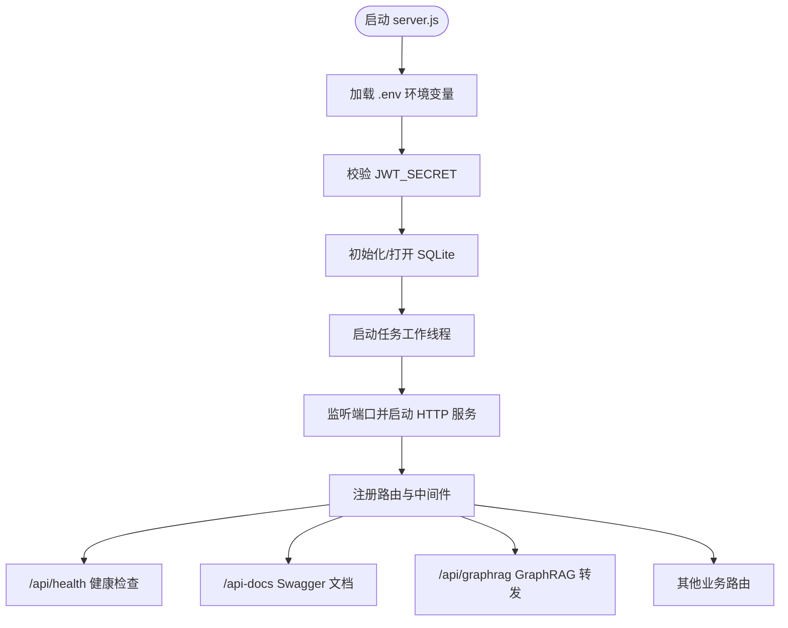
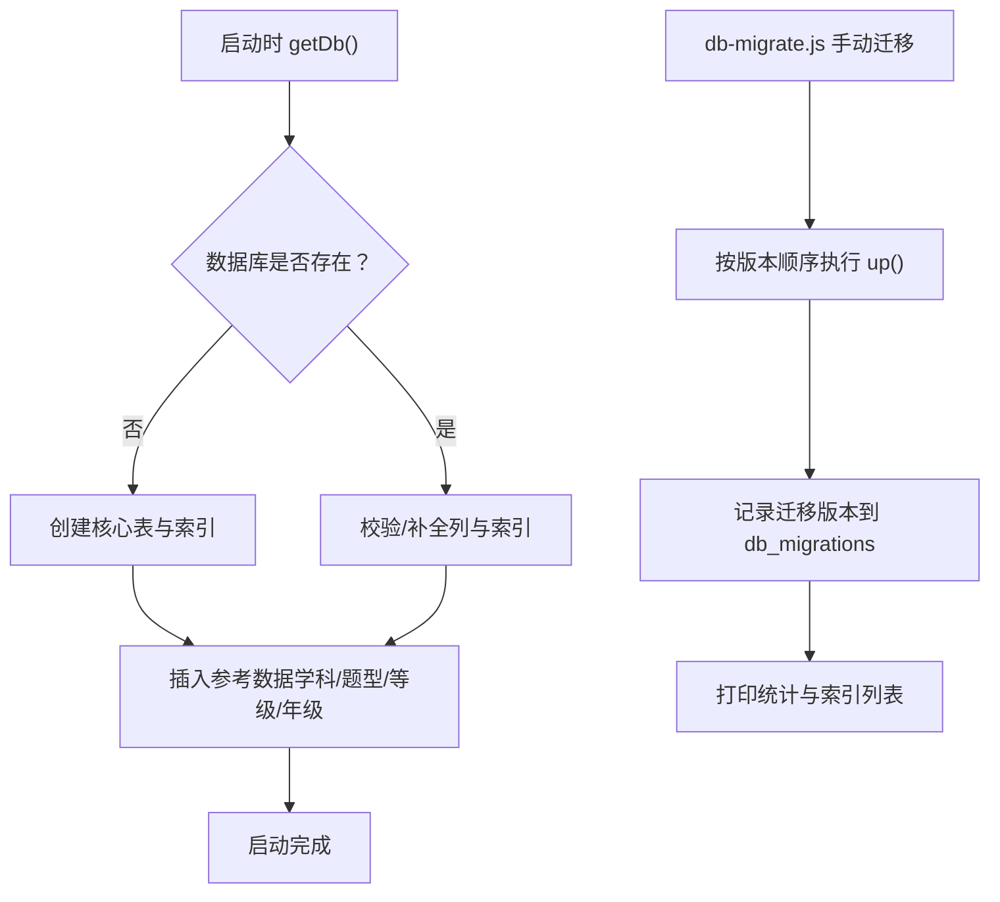
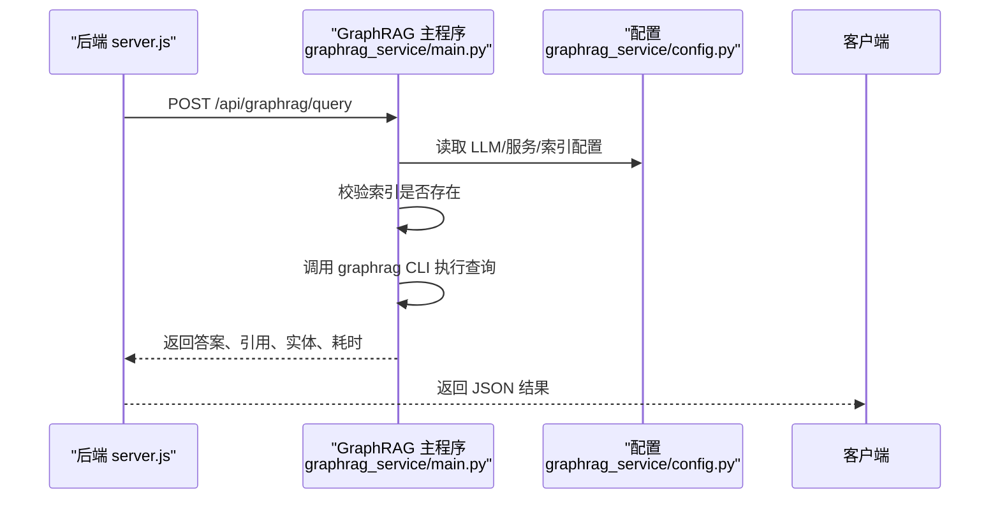
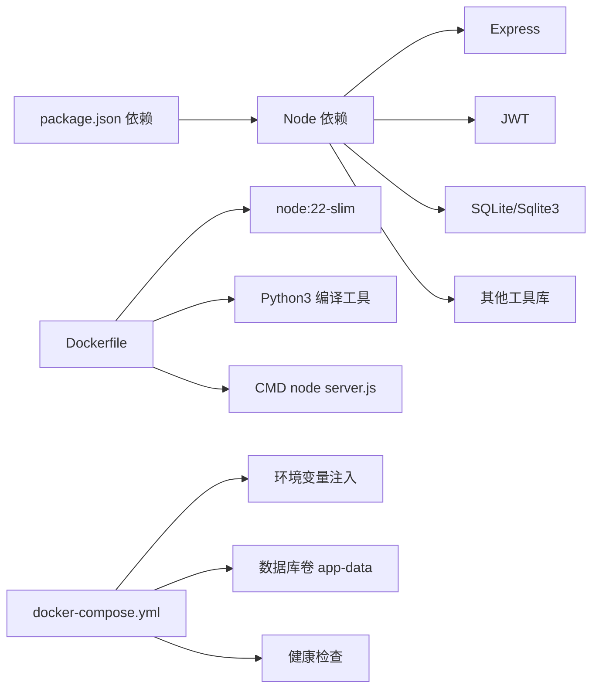

# 快速开始

<cite>
**本文引用的文件**
- [package.json](file://package.json)
- [server.js](file://server.js)
- [Dockerfile](file://Dockerfile)
- [docker-compose.yml](file://docker-compose.yml)
- [setup.sh](file://setup.sh)
- [scripts/setup_graphrag.sh](file://scripts/setup_graphrag.sh)
- [graphrag_service/config.py](file://graphrag_service/config.py)
- [graphrag_service/main.py](file://graphrag_service/main.py)
- [api/db.js](file://api/db.js)
- [scripts/db-migrate.js](file://scripts/db-migrate.js)
- [check-db.js](file://check-db.js)
- [start.bat](file://start.bat)
- [frontend/index.html](file://frontend/index.html)
- [public/index.html](file://public/index.html)
- [api/auth.js](file://api/auth.js)
- [api/swagger.js](file://api/swagger.js)
</cite>

## 目录
1. [简介](#简介)
2. [项目结构](#项目结构)
3. [核心组件](#核心组件)
4. [架构总览](#架构总览)
5. [详细组件分析](#详细组件分析)
6. [依赖分析](#依赖分析)
7. [性能考虑](#性能考虑)
8. [故障排查指南](#故障排查指南)
9. [结论](#结论)
10. [附录](#附录)

## 简介
本指南面向首次接触 AI 家教项目的开发者，提供从环境准备、依赖安装、数据库初始化到项目启动与验证的全流程操作说明。同时涵盖本地开发、Docker 一键部署与生产环境部署方案，并给出常见问题的解决方案与基本使用示例，帮助你快速上手并成功运行项目。

## 项目结构
项目采用前后端同源的单体架构，后端基于 Node.js + Express，SQLite 作为本地数据库，GraphRAG 服务通过独立的 Python/FastAPI 服务提供知识检索能力。前端包含传统 HTML/CSS/JS 的静态页面与现代 WebApp（PWA）入口。

图表来源
- [server.js:1-221](file://server.js#L1-L221)
- [api/db.js:1-478](file://api/db.js#L1-L478)
- [scripts/db-migrate.js:1-616](file://scripts/db-migrate.js#L1-L616)
- [api/swagger.js:1-250](file://api/swagger.js#L1-L250)
- [graphrag_service/main.py:1-462](file://graphrag_service/main.py#L1-L462)
- [frontend/index.html:1-462](file://frontend/index.html#L1-L462)
- [public/index.html:1-43](file://public/index.html#L1-L43)
- [Dockerfile:1-26](file://Dockerfile#L1-L26)
- [docker-compose.yml:1-26](file://docker-compose.yml#L1-L26)
- [setup.sh:1-37](file://setup.sh#L1-L37)

章节来源
- [server.js:1-221](file://server.js#L1-L221)
- [package.json:1-43](file://package.json#L1-L43)

## 核心组件
- 后端服务器：负责路由、鉴权、业务接口、静态资源托管与健康检查。
- 数据库：SQLite，自动初始化与迁移，内置参考数据与索引。
- GraphRAG 服务：独立 FastAPI 服务，提供知识检索、相似题推荐、知识点图谱等能力。
- 前端：传统页面与 WebApp 入口，分别适配桌面与移动端。
- 部署工具：Dockerfile、docker-compose.yml、部署脚本与 Windows 启动脚本。

章节来源
- [server.js:126-221](file://server.js#L126-L221)
- [api/db.js:15-365](file://api/db.js#L15-L365)
- [graphrag_service/main.py:178-462](file://graphrag_service/main.py#L178-L462)
- [frontend/index.html:1-462](file://frontend/index.html#L1-L462)
- [public/index.html:1-43](file://public/index.html#L1-L43)
- [Dockerfile:1-26](file://Dockerfile#L1-L26)
- [docker-compose.yml:1-26](file://docker-compose.yml#L1-L26)
- [setup.sh:1-37](file://setup.sh#L1-L37)
- [start.bat:1-39](file://start.bat#L1-L39)

## 架构总览
后端通过 Express 提供 REST 接口，前端通过静态文件与 SPA 资源访问。GraphRAG 服务独立运行并通过 /api/graphrag 路由与后端交互。数据库初始化与迁移在服务启动时自动执行。

图表来源
- [server.js:141-205](file://server.js#L141-L205)
- [api/auth.js:29-47](file://api/auth.js#L29-L47)
- [api/db.js:15-365](file://api/db.js#L15-L365)
- [api/swagger.js:1-250](file://api/swagger.js#L1-L250)
- [graphrag_service/main.py:191-274](file://graphrag_service/main.py#L191-L274)

## 详细组件分析

### 后端服务器与路由
- 路由组织：认证、省份、试卷、错题、报告、学习、激励、GraphRAG 等模块化路由。
- 安全：CORS、速率限制、安全头、XSS 过滤、CSRF 保护、JWT 验证。
- 静态资源：public 与 frontend 目录分别提供 WebApp 与传统页面。
- 健康检查：/api/health 检查数据库可用性。

图表来源
- [server.js:37-221](file://server.js#L37-L221)
- [api/auth.js:12-27](file://api/auth.js#L12-L27)
- [api/db.js:15-365](file://api/db.js#L15-L365)

章节来源
- [server.js:126-221](file://server.js#L126-L221)
- [api/auth.js:12-47](file://api/auth.js#L12-L47)

### 数据库初始化与迁移
- 自动初始化：首次访问时创建核心表、索引与参考数据。
- 迁移脚本：提供结构化迁移与统计输出，支持增量升级。
- 校验工具：检查表清单与示例数据，便于验证。

图表来源
- [api/db.js:15-365](file://api/db.js#L15-L365)
- [scripts/db-migrate.js:525-616](file://scripts/db-migrate.js#L525-L616)
- [check-db.js:1-34](file://check-db.js#L1-L34)

章节来源
- [api/db.js:15-365](file://api/db.js#L15-L365)
- [scripts/db-migrate.js:1-616](file://scripts/db-migrate.js#L1-L616)
- [check-db.js:1-34](file://check-db.js#L1-L34)

### GraphRAG 服务
- 独立服务：监听 127.0.0.1:8100，仅内网访问。
- 索引管理：支持多索引（高考/中考/学科/区域），自动检查索引是否存在。
- 查询接口：通用问答、题目讲解、相似题推荐、知识点图谱、试卷溯源等。
- 配置：通过环境变量控制 LLM、服务主机与端口、数据库连接等。

图表来源
- [graphrag_service/main.py:178-274](file://graphrag_service/main.py#L178-L274)
- [graphrag_service/config.py:1-59](file://graphrag_service/config.py#L1-L59)

章节来源
- [graphrag_service/main.py:1-462](file://graphrag_service/main.py#L1-L462)
- [graphrag_service/config.py:1-59](file://graphrag_service/config.py#L1-L59)

### 前端页面与入口
- 传统页面：frontend/index.html 提供功能导航与样例入口。
- WebApp 入口：public/index.html 提供 PWA 应用壳与资源加载。
- 移动端适配：根据 UA 选择不同入口文件。

章节来源
- [frontend/index.html:1-462](file://frontend/index.html#L1-L462)
- [public/index.html:1-43](file://public/index.html#L1-L43)
- [server.js:77-105](file://server.js#L77-L105)

### 部署与容器化
- Dockerfile：基于 node:22-slim，安装 Python3 与编译工具，仅生产依赖，暴露 3000 端口，健康检查。
- docker-compose：映射端口、挂载数据库卷、注入环境变量（JWT_SECRET、API 密钥等），健康检查。
- 生产部署脚本：setup.sh 将 Nginx 配置复制到 sites-available 并启用，安装 systemd 服务，重启服务。
- GraphRAG 一键部署：scripts/setup_graphrag.sh 安装 Python 依赖、初始化数据库表、安装并启动 GraphRAG 服务。

章节来源
- [Dockerfile:1-26](file://Dockerfile#L1-L26)
- [docker-compose.yml:1-26](file://docker-compose.yml#L1-L26)
- [setup.sh:1-37](file://setup.sh#L1-L37)
- [scripts/setup_graphrag.sh:1-94](file://scripts/setup_graphrag.sh#L1-L94)

## 依赖分析
- Node.js 与包管理：使用 npm，提供 start/dev/test/lint/format 等脚本。
- 后端依赖：Express、JWT、SQLite、速率限制、CORS、marked、KaTeX、DOMPurify 等。
- 开发依赖：ESLint、Prettier、Vitest 等。
- Docker 与 Compose：镜像构建、端口映射、卷挂载、健康检查。
- GraphRAG 服务：Python 依赖（fastapi、uvicorn、graphrag、psycopg2、aiohttp 等）。

图表来源
- [package.json:17-41](file://package.json#L17-L41)
- [Dockerfile:1-26](file://Dockerfile#L1-26)
- [docker-compose.yml:8-22](file://docker-compose.yml#L8-L22)

章节来源
- [package.json:1-43](file://package.json#L1-L43)
- [Dockerfile:1-26](file://Dockerfile#L1-L26)
- [docker-compose.yml:1-26](file://docker-compose.yml#L1-L26)

## 性能考虑
- 数据库优化：SQLite WAL 模式、busy_timeout、外键约束开启；大量索引覆盖高频查询字段。
- 查询性能：针对 exam_papers、exam_questions、wrong_questions、reports、knowledge_points 等表建立复合索引。
- 服务并发：Express 默认并发模型，建议在生产环境配合反向代理与进程管理工具。
- GraphRAG：CLI 查询超时控制与限流配置，避免阻塞请求。

章节来源
- [api/db.js:23-361](file://api/db.js#L23-L361)
- [scripts/db-migrate.js:418-477](file://scripts/db-migrate.js#L418-L477)
- [graphrag_service/main.py:117-131](file://graphrag_service/main.py#L117-L131)

## 故障排查指南
- JWT_SECRET 未设置或使用默认值
  - 现象：启动即退出并提示未设置或默认密钥。
  - 处理：设置强随机密钥（≥32 字符），避免默认值。
  - 参考：[api/auth.js:12-27](file://api/auth.js#L12-L27)
- 数据库无法初始化
  - 现象：启动时报错或 /api/health 返回 dbReady=false。
  - 处理：确认数据库文件路径与权限，运行迁移脚本，使用检查脚本验证表结构。
  - 参考：[api/db.js:15-365](file://api/db.js#L15-L365)、[scripts/db-migrate.js:525-616](file://scripts/db-migrate.js#L525-L616)、[check-db.js:1-34](file://check-db.js#L1-L34)
- GraphRAG 服务不可用
  - 现象：/api/graphrag 路由返回错误或超时。
  - 处理：确认 GraphRAG 服务已启动（systemd），LLM 配置正确，索引已构建。
  - 参考：[graphrag_service/main.py:178-274](file://graphrag_service/main.py#L178-L274)、[scripts/setup_graphrag.sh:60-75](file://scripts/setup_graphrag.sh#L60-L75)
- 端口占用或访问异常
  - 现象：端口冲突或健康检查失败。
  - 处理：修改 PORT 或宿主映射，检查防火墙与反向代理配置。
  - 参考：[server.js:42](file://server.js#L42)、[docker-compose.yml:6-16](file://docker-compose.yml#L6-L16)
- Windows 启动失败
  - 现象：未检测到 Node.js 或依赖安装失败。
  - 处理：安装 Node.js，执行 start.bat，确保网络可访问 npm。
  - 参考：[start.bat:8-26](file://start.bat#L8-L26)

章节来源
- [api/auth.js:12-27](file://api/auth.js#L12-L27)
- [api/db.js:15-365](file://api/db.js#L15-L365)
- [scripts/db-migrate.js:525-616](file://scripts/db-migrate.js#L525-L616)
- [check-db.js:1-34](file://check-db.js#L1-L34)
- [graphrag_service/main.py:178-274](file://graphrag_service/main.py#L178-L274)
- [scripts/setup_graphrag.sh:60-75](file://scripts/setup_graphrag.sh#L60-L75)
- [server.js:42](file://server.js#L42)
- [docker-compose.yml:6-16](file://docker-compose.yml#L6-L16)
- [start.bat:8-26](file://start.bat#L8-L26)

## 结论
通过本指南，你可以完成从环境准备、依赖安装、数据库初始化到服务启动与验证的全流程。建议优先使用 Docker 一键部署以降低环境差异带来的问题；生产环境可结合 Nginx 与 systemd 进行稳定发布。遇到问题时，优先检查 JWT_SECRET、数据库初始化与 GraphRAG 服务状态。

## 附录

### 环境要求与安装步骤
- Node.js 版本：使用 Node.js 22（Dockerfile 指定 node:22-slim）。
- Python 环境：GraphRAG 服务需要 Python 3 与 pip 依赖（见部署脚本）。
- 数据库：SQLite（无需额外安装），首次启动自动初始化。
- 依赖安装：使用 npm 安装 Node 依赖；GraphRAG 依赖通过部署脚本自动安装。

章节来源
- [Dockerfile:1](file://Dockerfile#L1)
- [scripts/setup_graphrag.sh:21-28](file://scripts/setup_graphrag.sh#L21-L28)
- [package.json:17-41](file://package.json#L17-L41)

### 项目启动流程
- 本地开发
  - 安装依赖：npm install
  - 设置环境变量：JWT_SECRET（至少 32 字符）
  - 启动服务：npm start 或使用 start.bat
  - 访问：http://localhost:3002
- Docker 一键部署
  - 构建镜像：docker build -t ai-tutor .
  - 启动容器：docker compose up -d
  - 访问：http://localhost:3000
- 生产环境部署
  - 安装 Nginx 配置与 systemd 服务：sudo bash setup.sh
  - 启动服务：sudo systemctl start uibe-tutor
  - 访问：https://aitutor.uibe.online/

章节来源
- [package.json:5-16](file://package.json#L5-L16)
- [start.bat:17-36](file://start.bat#L17-L36)
- [Dockerfile:12-25](file://Dockerfile#L12-L25)
- [docker-compose.yml:4-22](file://docker-compose.yml#L4-L22)
- [setup.sh:23-36](file://setup.sh#L23-L36)

### 数据库初始化与验证
- 自动初始化：首次访问触发 getDb() 创建表与索引。
- 迁移脚本：node scripts/db-migrate.js 执行结构化迁移。
- 验证命令：node check-db.js 输出表清单与示例数据。

章节来源
- [api/db.js:15-365](file://api/db.js#L15-L365)
- [scripts/db-migrate.js:525-616](file://scripts/db-migrate.js#L525-L616)
- [check-db.js:1-34](file://check-db.js#L1-L34)

### 多种部署方式选择建议
- 本地开发：直接 npm start，便于调试与热更新。
- Docker 一键部署：适合快速复现与测试，统一环境。
- 生产部署：结合 Nginx、systemd、健康检查与反向代理，确保稳定性与可观测性。

章节来源
- [Dockerfile:12-25](file://Dockerfile#L12-L25)
- [docker-compose.yml:4-22](file://docker-compose.yml#L4-L22)
- [setup.sh:13-36](file://setup.sh#L13-L36)

### 常见安装问题与解决方案
- 未设置 JWT_SECRET：启动前必须设置强随机密钥。
- 默认密钥风险：使用默认值会导致启动失败。
- 依赖安装失败：检查网络与 npm 缓存，必要时清理缓存重试。
- GraphRAG 依赖缺失：运行部署脚本自动安装 Python 依赖。
- 端口冲突：修改 PORT 或宿主映射，确保 3000/8100 可用。

章节来源
- [api/auth.js:12-27](file://api/auth.js#L12-L27)
- [start.bat:18-26](file://start.bat#L18-L26)
- [scripts/setup_graphrag.sh:21-28](file://scripts/setup_graphrag.sh#L21-L28)
- [docker-compose.yml:6-16](file://docker-compose.yml#L6-L16)

### 验证步骤
- 健康检查：GET /api/health，确认 dbReady=true。
- API 文档：访问 /api-docs，确认接口列表与认证说明。
- 前端页面：打开 frontend/index.html 或 public/index.html，确认资源加载正常。
- GraphRAG：调用 /api/graphrag/query，确认返回答案与引用。

章节来源
- [server.js:126-139](file://server.js#L126-L139)
- [api/swagger.js:1-250](file://api/swagger.js#L1-L250)
- [frontend/index.html:414-459](file://frontend/index.html#L414-L459)
- [public/index.html:36-40](file://public/index.html#L36-L40)
- [graphrag_service/main.py:191-205](file://graphrag_service/main.py#L191-L205)

### 基本使用示例与功能演示
- 登录与注册：POST /api/login、POST /api/register，获取 JWT Token。
- 获取省份与趋势：GET /api/provinces、GET /api/province-trends/{code}。
- 试卷与题目：GET /api/exam-papers、GET /api/exam-questions/{paperId}。
- 学习与练习：POST /api/exam-session/start、POST /api/exam-session/submit。
- 错题与报告：GET/POST /api/questions、GET /api/learning-dashboard。
- GraphRAG 查询：POST /api/graphrag/query、POST /api/graphrag/explain。

章节来源
- [server.js:141-199](file://server.js#L141-L199)
- [api/swagger.js:49-202](file://api/swagger.js#L49-L202)