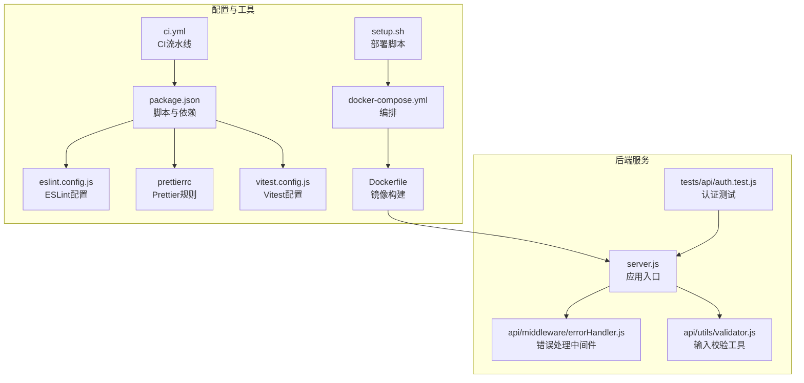
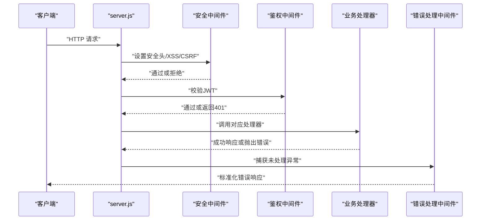
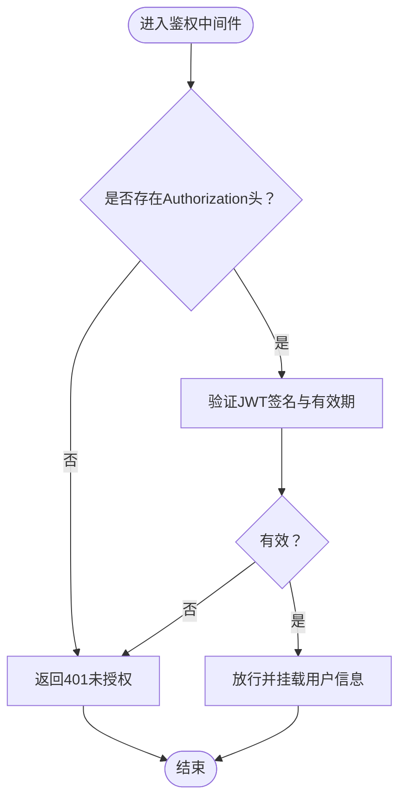
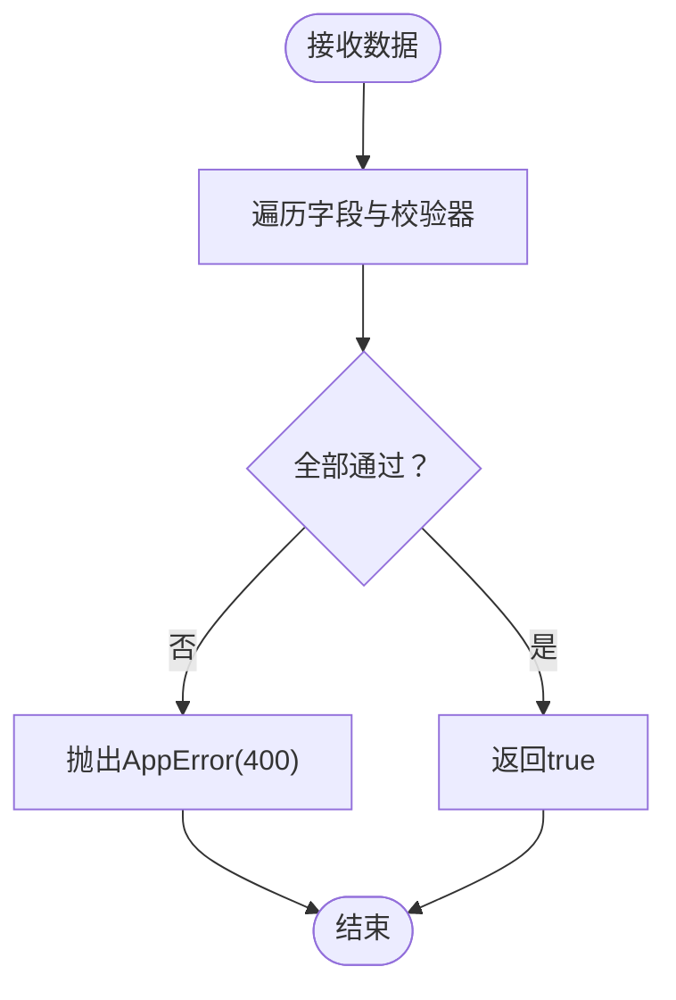
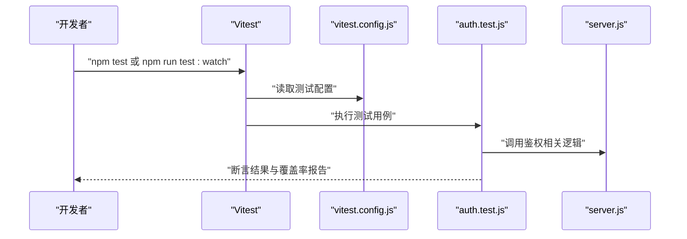
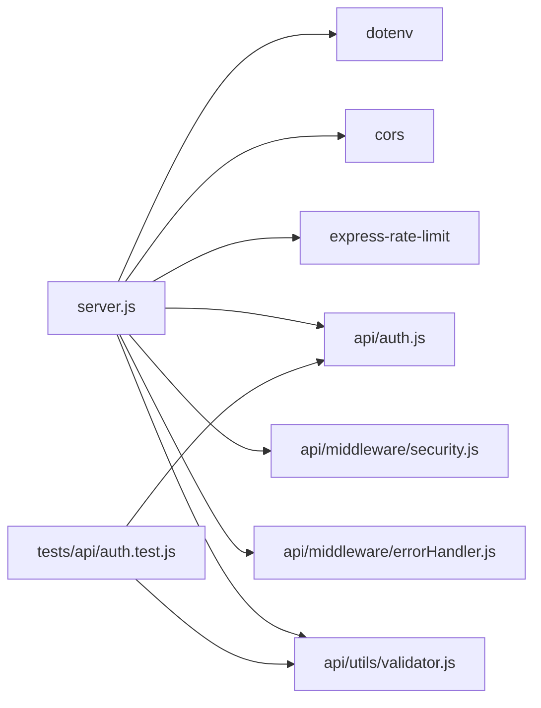

# 代码贡献指南

<cite>
**本文引用的文件**
- [package.json](file://package.json)
- [eslint.config.js](file://eslint.config.js)
- [.prettierrc](file://.prettierrc)
- [vitest.config.js](file://vitest.config.js)
- [.gitignore](file://.gitignore)
- [.github/workflows/ci.yml](file://.github/workflows/ci.yml)
- [server.js](file://server.js)
- [api/middleware/errorHandler.js](file://api/middleware/errorHandler.js)
- [api/utils/validator.js](file://api/utils/validator.js)
- [tests/api/auth.test.js](file://tests/api/auth.test.js)
- [Dockerfile](file://Dockerfile)
- [docker-compose.yml](file://docker-compose.yml)
- [setup.sh](file://setup.sh)
- [AGENTS.md](file://AGENTS.md)
</cite>

## 目录
1. [简介](#简介)
2. [项目结构](#项目结构)
3. [核心组件](#核心组件)
4. [架构总览](#架构总览)
5. [详细组件分析](#详细组件分析)
6. [依赖关系分析](#依赖关系分析)
7. [性能与质量考量](#性能与质量考量)
8. [故障排查指南](#故障排查指南)
9. [结论](#结论)
10. [附录](#附录)

## 简介
本指南面向AI家教项目的贡献者，系统阐述代码规范、提交与审查流程、ESLint与Prettier配置、测试框架使用、Git工作流与分支策略、合并请求规范、代码质量检查、单元与集成测试实践、文档与版本发布流程，以及社区参与方式与常见问题。目标是帮助新贡献者快速上手，同时确保代码一致性、安全性与可维护性。

## 项目结构
项目采用前后端同库的组织方式：后端API位于api目录，前端静态资源位于frontend与public；服务入口为server.js；测试集中在tests/api；CI通过GitHub Actions执行；容器化支持Docker与docker-compose；部署脚本用于生产环境。

**图表来源**
- [server.js:1-221](file://server.js#L1-L221)
- [api/middleware/errorHandler.js:1-75](file://api/middleware/errorHandler.js#L1-L75)
- [api/utils/validator.js:1-135](file://api/utils/validator.js#L1-L135)
- [tests/api/auth.test.js:1-117](file://tests/api/auth.test.js#L1-L117)
- [package.json:1-43](file://package.json#L1-L43)
- [eslint.config.js:1-61](file://eslint.config.js#L1-L61)
- [.prettierrc:1-11](file://.prettierrc#L1-L11)
- [vitest.config.js:1-15](file://vitest.config.js#L1-L15)
- [.github/workflows/ci.yml:1-85](file://.github/workflows/ci.yml#L1-L85)
- [Dockerfile:1-26](file://Dockerfile#L1-L26)
- [docker-compose.yml:1-26](file://docker-compose.yml#L1-L26)
- [setup.sh:1-37](file://setup.sh#L1-L37)

**章节来源**
- [server.js:1-221](file://server.js#L1-L221)
- [package.json:1-43](file://package.json#L1-L43)
- [.github/workflows/ci.yml:1-85](file://.github/workflows/ci.yml#L1-L85)
- [Dockerfile:1-26](file://Dockerfile#L1-L26)
- [docker-compose.yml:1-26](file://docker-compose.yml#L1-L26)
- [setup.sh:1-37](file://setup.sh#L1-L37)

## 核心组件
- 应用入口与路由：server.js集中注册中间件、静态资源、健康检查、Swagger文档、鉴权与业务路由，并统一错误处理。
- 错误处理：自定义AppError与全局errorHandler中间件，对JWT、数据库、端口占用等异常进行分类处理与标准化响应。
- 输入校验：validator模块提供邮箱、密码、必填字段、题目、学科、难度、分值、年份等校验器，统一抛出AppError。
- 测试：Vitest配置覆盖API测试范围与覆盖率统计；示例测试覆盖JWT密钥校验与鉴权中间件行为。
- 质量工具：ESLint推荐规则+Prettier插件，配合Prettier配置；CI中执行lint与测试，保证质量门禁。
- 部署与容器化：Dockerfile与docker-compose提供生产级镜像构建与健康检查；setup.sh辅助系统服务部署。

**章节来源**
- [server.js:1-221](file://server.js#L1-L221)
- [api/middleware/errorHandler.js:1-75](file://api/middleware/errorHandler.js#L1-L75)
- [api/utils/validator.js:1-135](file://api/utils/validator.js#L1-L135)
- [tests/api/auth.test.js:1-117](file://tests/api/auth.test.js#L1-L117)
- [eslint.config.js:1-61](file://eslint.config.js#L1-L61)
- [.prettierrc:1-11](file://.prettierrc#L1-L11)
- [vitest.config.js:1-15](file://vitest.config.js#L1-L15)
- [package.json:1-43](file://package.json#L1-L43)

## 架构总览
下图展示从客户端到后端API、数据库与外部服务的典型调用链路，以及安全中间件与错误处理的贯穿。

**图表来源**
- [server.js:1-221](file://server.js#L1-L221)
- [api/middleware/errorHandler.js:1-75](file://api/middleware/errorHandler.js#L1-L75)

## 详细组件分析

### 组件A：认证与安全中间件
- 鉴权中间件负责校验Authorization头中的JWT，支持过期与无效token的特定提示。
- JWT密钥校验在启动时执行，若未设置或为默认值则退出进程，短密钥发出警告。
- 安全中间件包括安全头、XSS净化与检测、CSRF防护，统一注入到应用中。

**图表来源**
- [tests/api/auth.test.js:1-117](file://tests/api/auth.test.js#L1-L117)

**章节来源**
- [tests/api/auth.test.js:1-117](file://tests/api/auth.test.js#L1-L117)
- [server.js:1-221](file://server.js#L1-L221)

### 组件B：输入校验与错误处理
- validator模块提供多字段校验器，统一返回{valid,message}结构，失败时抛出AppError。
- errorHandler中间件根据错误类型映射为标准HTTP状态码与消息，开发模式下附加stack。

**图表来源**
- [api/utils/validator.js:1-135](file://api/utils/validator.js#L1-L135)
- [api/middleware/errorHandler.js:1-75](file://api/middleware/errorHandler.js#L1-L75)

**章节来源**
- [api/utils/validator.js:1-135](file://api/utils/validator.js#L1-L135)
- [api/middleware/errorHandler.js:1-75](file://api/middleware/errorHandler.js#L1-L75)

### 组件C：测试框架与覆盖率
- Vitest配置启用globals与node环境，按tests/api/**/*.test.js匹配测试文件；覆盖率仅统计api/**/*.js且排除部分文件。
- 示例测试覆盖JWT密钥校验与鉴权中间件的关键分支。

**图表来源**
- [vitest.config.js:1-15](file://vitest.config.js#L1-L15)
- [tests/api/auth.test.js:1-117](file://tests/api/auth.test.js#L1-L117)

**章节来源**
- [vitest.config.js:1-15](file://vitest.config.js#L1-L15)
- [tests/api/auth.test.js:1-117](file://tests/api/auth.test.js#L1-L117)

### 组件D：ESLint与Prettier
- ESLint采用推荐配置并启用eslint-plugin-prettier，规则强调格式一致性与常见问题规避。
- Prettier配置统一半角分号、单引号、尾随逗号、行长、缩进、箭头括号与换行符。
- package.json脚本提供lint、lint:fix、format、format:check，建议在提交前执行。

**章节来源**
- [eslint.config.js:1-61](file://eslint.config.js#L1-L61)
- [.prettierrc:1-11](file://.prettierrc#L1-L11)
- [package.json:1-43](file://package.json#L1-L43)

### 组件E：CI与质量门禁
- CI在ubuntu-latest矩阵式Node版本运行，安装依赖后执行lint与测试；上传覆盖率（Node 22）；执行npm audit；主分支触发Docker镜像构建。
- 建议本地先执行npm run lint与npm run test:coverage，确保通过后再推送。

**章节来源**
- [.github/workflows/ci.yml:1-85](file://.github/workflows/ci.yml#L1-L85)
- [package.json:1-43](file://package.json#L1-L43)

### 组件F：容器化与部署
- Dockerfile基于node:22-slim，安装Python3与构建工具，使用npm ci --omit=dev，暴露3000端口并配置健康检查。
- docker-compose提供生产环境变量与卷挂载，健康检查与重启策略。
- setup.sh用于部署到生产环境，创建数据库、应用Nginx配置并启动systemd服务。

**章节来源**
- [Dockerfile:1-26](file://Dockerfile#L1-L26)
- [docker-compose.yml:1-26](file://docker-compose.yml#L1-L26)
- [setup.sh:1-37](file://setup.sh#L1-L37)

## 依赖关系分析
- server.js依赖dotenv、cors、rateLimit、各业务路由与中间件；引入errorHandler作为兜底。
- 中间件层与工具层解耦，validator独立于业务路由，便于复用与测试。
- 测试通过Vitest直接调用业务函数与中间件，无需启动完整服务，提升效率。

**图表来源**
- [server.js:1-221](file://server.js#L1-L221)
- [api/middleware/errorHandler.js:1-75](file://api/middleware/errorHandler.js#L1-L75)
- [api/utils/validator.js:1-135](file://api/utils/validator.js#L1-L135)
- [tests/api/auth.test.js:1-117](file://tests/api/auth.test.js#L1-L117)

**章节来源**
- [server.js:1-221](file://server.js#L1-L221)

## 性能与质量考量
- 性能：路由层使用限流中间件控制高频请求；静态资源缓存策略在server.js中针对JS文件设置no-cache；数据库连接与任务队列在启动阶段初始化。
- 安全：统一的安全头、XSS净化与检测、CSRF保护；JWT密钥强度校验与过期处理；错误响应不泄露敏感堆栈（开发模式除外）。
- 可维护性：ESLint+Prettier统一风格；Vitest覆盖关键路径；CI强制lint与测试；Dockerfile最小化依赖与健康检查。

**章节来源**
- [server.js:1-221](file://server.js#L1-L221)
- [api/middleware/errorHandler.js:1-75](file://api/middleware/errorHandler.js#L1-L75)
- [eslint.config.js:1-61](file://eslint.config.js#L1-L61)
- [.prettierrc:1-11](file://.prettierrc#L1-L11)
- [vitest.config.js:1-15](file://vitest.config.js#L1-L15)
- [.github/workflows/ci.yml:1-85](file://.github/workflows/ci.yml#L1-L85)

## 故障排查指南
- 启动失败：检查JWT_SECRET是否设置且符合强度要求；查看server.js启动日志与错误处理输出。
- 认证失败：确认Authorization头格式为Bearer Token；核对JWT是否过期；查看鉴权中间件测试用例以定位问题。
- 数据库问题：查看errorHandler对SQLite错误的映射与响应；确认数据库文件权限与路径。
- CI失败：在本地执行npm run lint与npm run test:coverage；核对ci.yml中的环境变量与Node版本矩阵。

**章节来源**
- [server.js:1-221](file://server.js#L1-L221)
- [tests/api/auth.test.js:1-117](file://tests/api/auth.test.js#L1-L117)
- [api/middleware/errorHandler.js:1-75](file://api/middleware/errorHandler.js#L1-L75)
- [.github/workflows/ci.yml:1-85](file://.github/workflows/ci.yml#L1-L85)

## 结论
本指南提供了从开发环境搭建、代码规范、测试实践到CI与部署的全流程指引。遵循ESLint与Prettier规则、在本地先行质量检查、按测试用例覆盖关键路径、结合CI与容器化部署，可显著提升代码质量与交付效率。

## 附录

### 代码规范与提交规范
- 编码风格：统一使用ESLint与Prettier；提交前执行npm run format与npm run lint:fix。
- 提交信息：建议采用“类型(scope): 概述”格式，如feat(auth): 添加JWT校验；fix(server): 修复端口占用错误。
- 分支策略：主分支(main)用于稳定发布；开发分支(dev)用于集成；特性分支(feature/xxx)从dev切出，完成后合并回dev并进行审查。

**章节来源**
- [eslint.config.js:1-61](file://eslint.config.js#L1-L61)
- [.prettierrc:1-11](file://.prettierrc#L1-L11)
- [package.json:1-43](file://package.json#L1-L43)

### 审查流程
- 提交前：本地执行npm run lint、npm run test、npm run test:coverage；确保无格式与语法错误。
- 提交后：发起合并请求，关联相关issue；CI自动运行测试与安全扫描；至少一名维护者审查并通过。
- 合并策略：优先squash合并，保持提交历史整洁；避免含默认密钥或敏感信息的提交。

**章节来源**
- [.github/workflows/ci.yml:1-85](file://.github/workflows/ci.yml#L1-L85)

### 测试框架使用
- 单元测试：在tests/api下新增*.test.js，参考auth.test.js的断言与Mock方式。
- 集成测试：通过Vitest模拟请求与中间件，覆盖鉴权、校验与错误处理路径。
- 覆盖率：关注api目录覆盖率，避免将swagger与种子脚本纳入统计。

**章节来源**
- [tests/api/auth.test.js:1-117](file://tests/api/auth.test.js#L1-L117)
- [vitest.config.js:1-15](file://vitest.config.js#L1-L15)

### 文档与版本发布
- 文档：README与相关技术文档由维护者更新；变更日志记录重大改动与破坏性变更。
- 版本：遵循语义化版本；每次发布更新package.json中的version并打标签。

**章节来源**
- [package.json:1-43](file://package.json#L1-L43)

### 社区参与与问题报告
- 新贡献者：阅读本指南与AGENTS.md中的代码智能工具使用建议；从简单issue入手。
- 问题报告：提供环境信息、复现步骤、期望与实际结果；附带测试用例或最小可复现代码片段。
- 功能请求：描述场景、收益与可能的实现方案；必要时附带原型或草图。

**章节来源**
- [AGENTS.md:1-44](file://AGENTS.md#L1-L44)

### 常见问题解答
- Q: 为什么CI在某些Node版本失败？
  A: 检查ESLint/Prettier与Vitest在该版本的行为差异，尽量在本地先用相同版本验证。
- Q: 如何在本地运行测试并生成覆盖率？
  A: 使用npm run test:coverage，查看coverage/index.html。
- Q: 如何在Docker中调试？
  A: 使用docker-compose logs查看容器日志；进入容器bash进行交互式调试。

**章节来源**
- [.github/workflows/ci.yml:1-85](file://.github/workflows/ci.yml#L1-L85)
- [docker-compose.yml:1-26](file://docker-compose.yml#L1-L26)