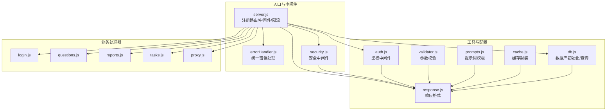
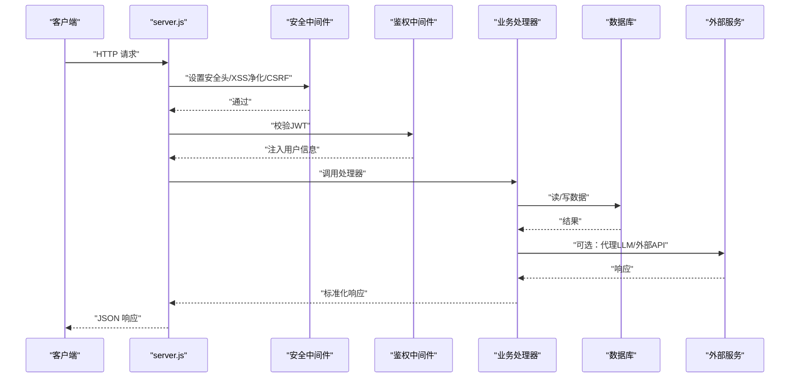
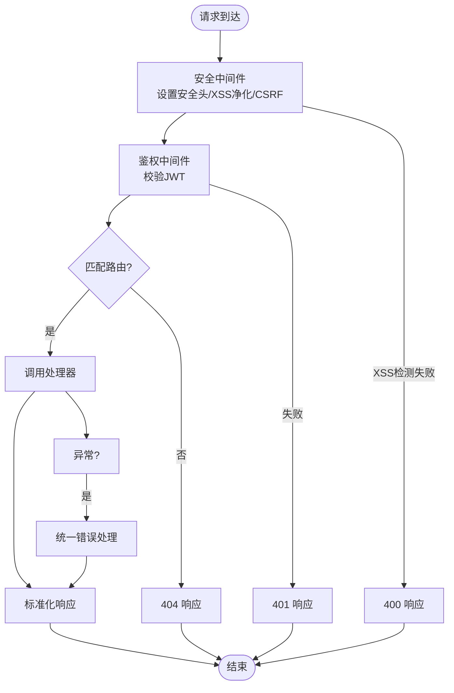
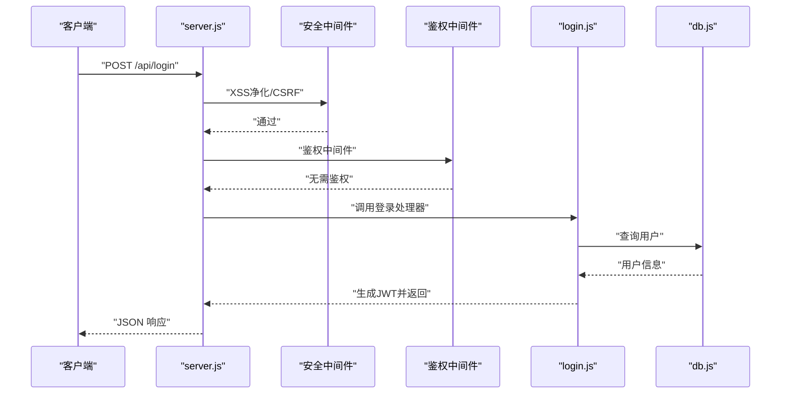
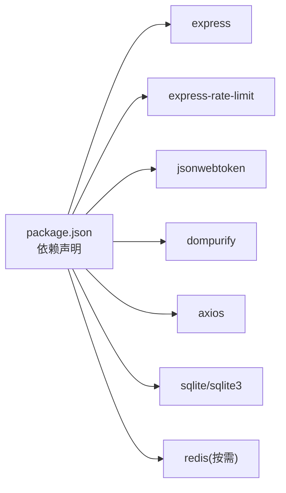

# 功能模块扩展

<cite>
**本文引用的文件**
- [server.js](file://server.js)
- [api/db.js](file://api/db.js)
- [api/middleware/errorHandler.js](file://api/middleware/errorHandler.js)
- [api/middleware/security.js](file://api/middleware/security.js)
- [api/utils/response.js](file://api/utils/response.js)
- [api/utils/validator.js](file://api/utils/validator.js)
- [api/auth.js](file://api/auth.js)
- [api/utils/prompts.js](file://api/utils/prompts.js)
- [api/utils/cache.js](file://api/utils/cache.js)
- [package.json](file://package.json)
- [api/login.js](file://api/login.js)
- [api/questions.js](file://api/questions.js)
- [api/reports.js](file://api/reports.js)
- [api/tasks.js](file://api/tasks.js)
- [api/proxy.js](file://api/proxy.js)
</cite>

## 目录
1. [简介](#简介)
2. [项目结构](#项目结构)
3. [核心组件](#核心组件)
4. [架构总览](#架构总览)
5. [详细组件分析](#详细组件分析)
6. [依赖分析](#依赖分析)
7. [性能考量](#性能考量)
8. [故障排查指南](#故障排查指南)
9. [结论](#结论)
10. [附录](#附录)

## 简介
本指南面向希望为AI家教项目添加新API端点、扩展现有功能模块与集成新业务逻辑的开发者。文档系统性地阐述API处理器开发模式、中间件扩展机制与响应格式标准化，并提供路由设计、参数验证、错误处理与安全控制的实现要点。同时，给出创建新功能模块的实践路径，覆盖数据库操作、业务逻辑处理与前端集成，并讨论模块间依赖关系管理与版本兼容性策略。

## 项目结构
后端基于Express应用，采用“按功能域划分”的模块化组织方式：
- 路由层：在入口文件集中注册各API端点，统一挂载中间件与限流策略
- 处理器层：每个API目录下以独立的处理器文件实现业务逻辑
- 工具层：通用工具（响应格式、参数校验、缓存、提示词模板、LLM解析等）
- 中间件层：安全头、CORS、XSS防护、CSRF保护、错误处理
- 数据访问层：SQLite数据库初始化、索引、参考数据填充与查询封装
- 图谱服务：GraphRAG子服务通过独立路由接入

图表来源
- [server.js:1-221](file://server.js#L1-L221)
- [api/middleware/errorHandler.js:1-75](file://api/middleware/errorHandler.js#L1-L75)
- [api/middleware/security.js:1-114](file://api/middleware/security.js#L1-L114)
- [api/utils/response.js:1-69](file://api/utils/response.js#L1-L69)
- [api/utils/validator.js:1-135](file://api/utils/validator.js#L1-L135)
- [api/auth.js:1-47](file://api/auth.js#L1-L47)
- [api/utils/prompts.js:1-131](file://api/utils/prompts.js#L1-L131)
- [api/utils/cache.js:1-137](file://api/utils/cache.js#L1-L137)
- [api/db.js:1-478](file://api/db.js#L1-L478)
- [api/login.js:1-41](file://api/login.js#L1-L41)
- [api/questions.js:1-114](file://api/questions.js#L1-L114)
- [api/reports.js:1-67](file://api/reports.js#L1-L67)
- [api/tasks.js:1-45](file://api/tasks.js#L1-L45)
- [api/proxy.js:1-106](file://api/proxy.js#L1-L106)

章节来源
- [server.js:1-221](file://server.js#L1-L221)

## 核心组件
- 应用入口与路由注册：集中定义中间件链、静态资源、健康检查、Swagger文档、端点映射与兜底404与全局错误处理器
- 鉴权中间件：校验Authorization头中的Bearer Token，解码并注入用户信息
- 安全中间件：设置安全响应头、XSS净化、XSS检测、CSRF来源白名单校验
- 错误处理：统一捕获异常，区分JWT过期/无效、数据库错误、端口占用等场景，标准化错误响应
- 响应格式：提供成功/错误/分页/创建/删除等标准响应结构，支持开发态堆栈输出
- 参数校验：内置邮箱、密码、题目、学科、难度、分值、年份等常用校验器，支持组合校验
- 数据库：SQLite初始化、表与索引创建、参考数据填充、列演进、查询封装
- 缓存：Redis优先、降级内存缓存；提供键值读取/写入/删除/批量清理与带回源的包装器
- 提示词模板：统一管理模型、温度、最大token与提示词模板，便于版本化与切换

章节来源
- [server.js:1-221](file://server.js#L1-L221)
- [api/auth.js:1-47](file://api/auth.js#L1-L47)
- [api/middleware/security.js:1-114](file://api/middleware/security.js#L1-L114)
- [api/middleware/errorHandler.js:1-75](file://api/middleware/errorHandler.js#L1-L75)
- [api/utils/response.js:1-69](file://api/utils/response.js#L1-L69)
- [api/utils/validator.js:1-135](file://api/utils/validator.js#L1-L135)
- [api/db.js:1-478](file://api/db.js#L1-L478)
- [api/utils/cache.js:1-137](file://api/utils/cache.js#L1-L137)
- [api/utils/prompts.js:1-131](file://api/utils/prompts.js#L1-L131)

## 架构总览
下图展示了典型API调用链路：客户端请求经由安全中间件与限流策略，进入鉴权中间件，随后由处理器执行业务逻辑，访问数据库或外部服务，最终统一通过响应格式返回。

图表来源
- [server.js:141-205](file://server.js#L141-L205)
- [api/middleware/security.js:73-113](file://api/middleware/security.js#L73-L113)
- [api/auth.js:29-46](file://api/auth.js#L29-L46)
- [api/login.js:7-40](file://api/login.js#L7-L40)
- [api/db.js:15-365](file://api/db.js#L15-L365)
- [api/proxy.js:33-105](file://api/proxy.js#L33-L105)

## 详细组件分析

### API处理器开发模式
- 统一入口：所有处理器均导出默认异步函数，接收req/res，按HTTP方法分派逻辑
- 方法校验：显式检查请求方法，不支持的方法返回405
- 鉴权前置：受保护端点统一使用鉴权中间件，从Authorization头提取并验证JWT
- 参数校验：在业务处理前进行参数合法性校验，使用统一校验器抛出AppError或返回错误响应
- 数据访问：通过数据库封装统一查询，避免重复初始化
- 响应标准化：使用successResponse、errorResponse、paginatedResponse等统一格式
- 异常捕获：入口处提供wrapHandler兜底，避免未捕获异常导致进程崩溃

章节来源
- [api/login.js:7-40](file://api/login.js#L7-L40)
- [api/questions.js:12-113](file://api/questions.js#L12-L113)
- [api/reports.js:4-66](file://api/reports.js#L4-L66)
- [api/tasks.js:4-44](file://api/tasks.js#L4-L44)
- [server.js:115-124](file://server.js#L115-L124)

### 中间件扩展机制
- 安全中间件：设置安全头、XSS净化与检测、CSRF来源校验
- 鉴权中间件：校验JWT有效性与过期，注入用户信息
- 错误处理：捕获各类错误并转换为统一响应，开发态输出stack
- 速率限制：针对登录、代理与通用API分别设置限流策略

图表来源
- [server.js:44-54](file://server.js#L44-L54)
- [api/middleware/security.js:23-113](file://api/middleware/security.js#L23-L113)
- [api/auth.js:29-46](file://api/auth.js#L29-L46)
- [api/middleware/errorHandler.js:13-72](file://api/middleware/errorHandler.js#L13-L72)

章节来源
- [server.js:44-54](file://server.js#L44-L54)
- [api/middleware/security.js:1-114](file://api/middleware/security.js#L1-L114)
- [api/auth.js:1-47](file://api/auth.js#L1-L47)
- [api/middleware/errorHandler.js:1-75](file://api/middleware/errorHandler.js#L1-L75)

### 响应格式标准化
- 成功/错误：包含success与message，错误响应含status
- 分页：包含page/limit/total/totalPages/hasNext/hasPrev
- 创建/删除：创建返回createdResponse，删除返回deletedResponse
- 开发态：NODE_ENV为development时附加stack便于调试

章节来源
- [api/utils/response.js:1-69](file://api/utils/response.js#L1-L69)

### 参数验证与安全控制
- 校验器：邮箱、密码、题目、学科、难度、分值、年份等，支持组合校验
- 输入净化：DOMPurify去除危险标签，递归净化请求体/查询/参数
- XSS检测：正则检测常见XSS模式，命中返回400
- CSRF保护：仅对非GET/HEAD/OPTIONS方法校验来源，白名单匹配
- 速率限制：登录、代理与通用API分别限流，防止滥用

章节来源
- [api/utils/validator.js:1-135](file://api/utils/validator.js#L1-L135)
- [api/middleware/security.js:4-113](file://api/middleware/security.js#L4-L113)
- [server.js:44-46](file://server.js#L44-L46)

### 数据库操作与业务逻辑
- 初始化与演进：自动创建表与索引，填充参考数据，确保列存在并补全历史数据
- 查询封装：统一getDb与query，避免重复打开连接
- 事务与一致性：通过外键约束与索引保障数据一致性
- 业务示例：错题记录、报告生成、任务队列、代理LLM调用等

章节来源
- [api/db.js:15-478](file://api/db.js#L15-L478)
- [api/questions.js:39-93](file://api/questions.js#L39-L93)
- [api/reports.js:8-55](file://api/reports.js#L8-L55)
- [api/tasks.js:8-33](file://api/tasks.js#L8-L33)
- [api/proxy.js:33-105](file://api/proxy.js#L33-L105)

### 新功能模块创建流程（示例路径）
以下为新增一个“学习计划”模块的步骤指引（不包含具体代码内容）：
1. 在入口文件注册新路由
   - 参考路径：[server.js:173](file://server.js#L173)
2. 创建处理器文件，实现GET/POST/DELETE等方法分派
   - 参考路径：[api/questions.js:12-113](file://api/questions.js#L12-L113)
3. 在数据库层定义表结构与索引
   - 参考路径：[api/db.js:27-302](file://api/db.js#L27-L302)
4. 在工具层补充参数校验与响应格式
   - 参考路径：[api/utils/validator.js:81-91](file://api/utils/validator.js#L81-L91)
   - 参考路径：[api/utils/response.js:17-32](file://api/utils/response.js#L17-L32)
5. 在中间件层决定是否需要鉴权、CSRF与速率限制
   - 参考路径：[api/auth.js:29-46](file://api/auth.js#L29-L46)
   - 参考路径：[api/middleware/security.js:89-113](file://api/middleware/security.js#L89-L113)
6. 在代理/外部服务层集成LLM能力（可选）
   - 参考路径：[api/proxy.js:20-31](file://api/proxy.js#L20-L31)
   - 参考路径：[api/utils/prompts.js:1-25](file://api/utils/prompts.js#L1-L25)
7. 在测试层编写单元/集成测试
   - 参考路径：[tests/api/auth.test.js](file://tests/api/auth.test.js)
8. 在前端页面或组件中发起请求并渲染结果
   - 参考路径：[frontend/dashboard.html](file://frontend/dashboard.html)

章节来源
- [server.js:173](file://server.js#L173)
- [api/questions.js:12-113](file://api/questions.js#L12-L113)
- [api/db.js:27-302](file://api/db.js#L27-L302)
- [api/utils/validator.js:81-91](file://api/utils/validator.js#L81-L91)
- [api/utils/response.js:17-32](file://api/utils/response.js#L17-L32)
- [api/auth.js:29-46](file://api/auth.js#L29-L46)
- [api/middleware/security.js:89-113](file://api/middleware/security.js#L89-L113)
- [api/proxy.js:20-31](file://api/proxy.js#L20-L31)
- [api/utils/prompts.js:1-25](file://api/utils/prompts.js#L1-L25)

### 典型API调用序列（以登录为例）

图表来源
- [server.js:141](file://server.js#L141)
- [api/middleware/security.js:23-34](file://api/middleware/security.js#L23-L34)
- [api/auth.js:29-46](file://api/auth.js#L29-L46)
- [api/login.js:7-40](file://api/login.js#L7-L40)
- [api/db.js:15-365](file://api/db.js#L15-L365)

## 依赖分析
- Express应用：提供路由、中间件、静态资源与限流
- 安全与鉴权：CORS、Rate Limit、JWT、DOMPurify
- 数据存储：SQLite与索引，参考数据与列演进
- 缓存：Redis优先，内存降级
- 外部服务：DashScope/DeepSeek等模型服务代理

图表来源
- [package.json:17-30](file://package.json#L17-L30)

章节来源
- [package.json:17-30](file://package.json#L17-L30)

## 性能考量
- 数据库性能：为高频查询字段建立索引，避免SELECT *，使用参数化查询与批量插入
- 缓存策略：热点数据使用Redis缓存，设置合理TTL；降级到内存缓存保证可用性
- 代理调用：限制消息长度与token上限，设置超时，记录用量统计
- 速率限制：根据端点特性设置不同窗口与阈值，避免滥用
- 响应大小：对大对象进行压缩或分页，避免单次响应过大

## 故障排查指南
- 认证失败/过期：检查JWT_SECRET是否设置且非默认值，确认Token格式与有效期
- 数据库错误：查看表结构与索引是否存在，关注列演进与历史数据补全
- XSS/CSRF拦截：检查输入净化与来源白名单配置，确认非GET方法的Origin/Referer
- 代理超时：检查外部API Key配置与网络连通性，调整超时时间
- 404端点：确认路由注册顺序与前缀处理逻辑

章节来源
- [api/auth.js:12-27](file://api/auth.js#L12-L27)
- [api/middleware/errorHandler.js:39-54](file://api/middleware/errorHandler.js#L39-L54)
- [api/middleware/security.js:89-113](file://api/middleware/security.js#L89-L113)
- [api/proxy.js:69-104](file://api/proxy.js#L69-L104)
- [server.js:201-203](file://server.js#L201-L203)

## 结论
通过统一的中间件体系、标准化的响应格式与严格的参数校验，AI家教项目具备良好的扩展性。新增功能模块应遵循“路由注册—处理器—校验—数据访问—响应—测试”的闭环流程，并结合缓存与限流提升性能与稳定性。版本兼容方面，建议以提示词模板与数据库迁移脚本为抓手，确保向后兼容与平滑升级。

## 附录
- 版本与提示词：提示词版本号与模型配置集中管理，便于灰度与回滚
- 缓存配置：提供默认TTL与内存降级策略，适配不同场景
- 健康检查：提供/health端点用于容器编排与运维监控

章节来源
- [api/utils/prompts.js:1-25](file://api/utils/prompts.js#L1-L25)
- [api/utils/cache.js:5-9](file://api/utils/cache.js#L5-L9)
- [server.js:126-136](file://server.js#L126-L136)