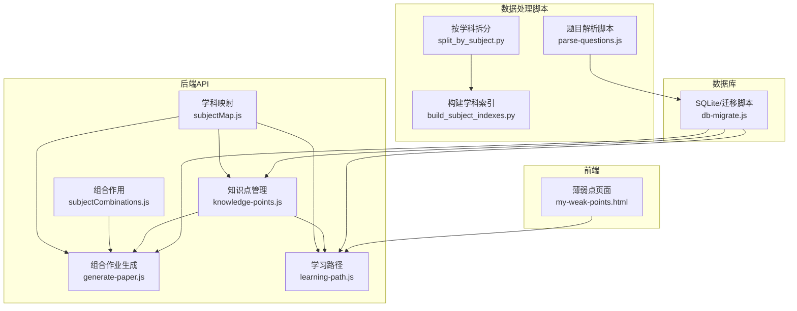
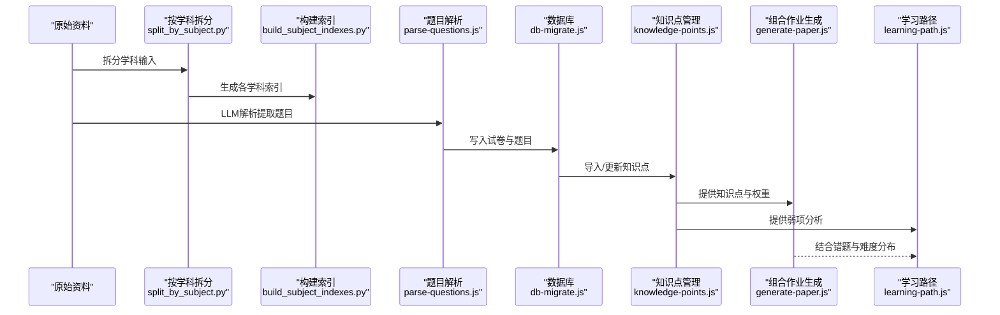
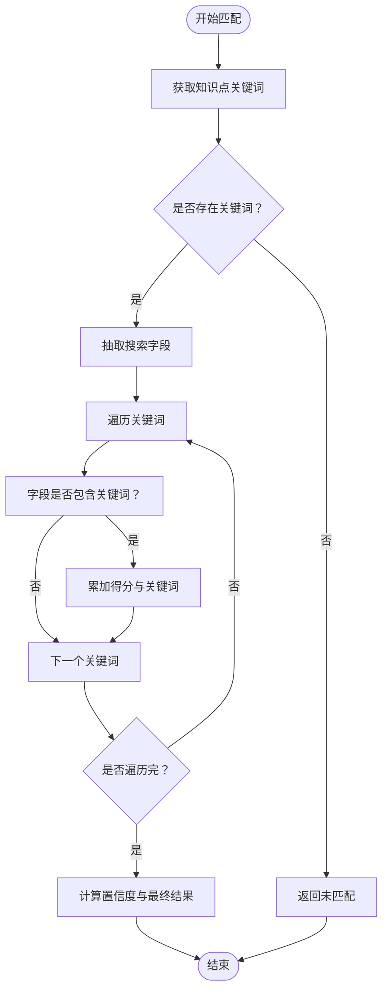
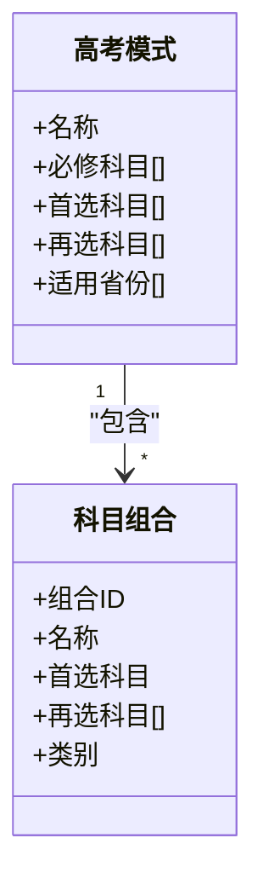
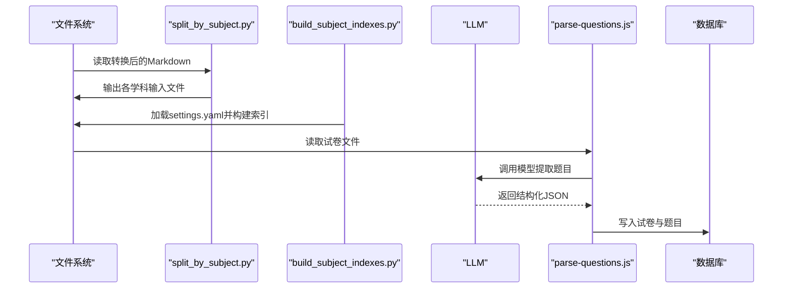
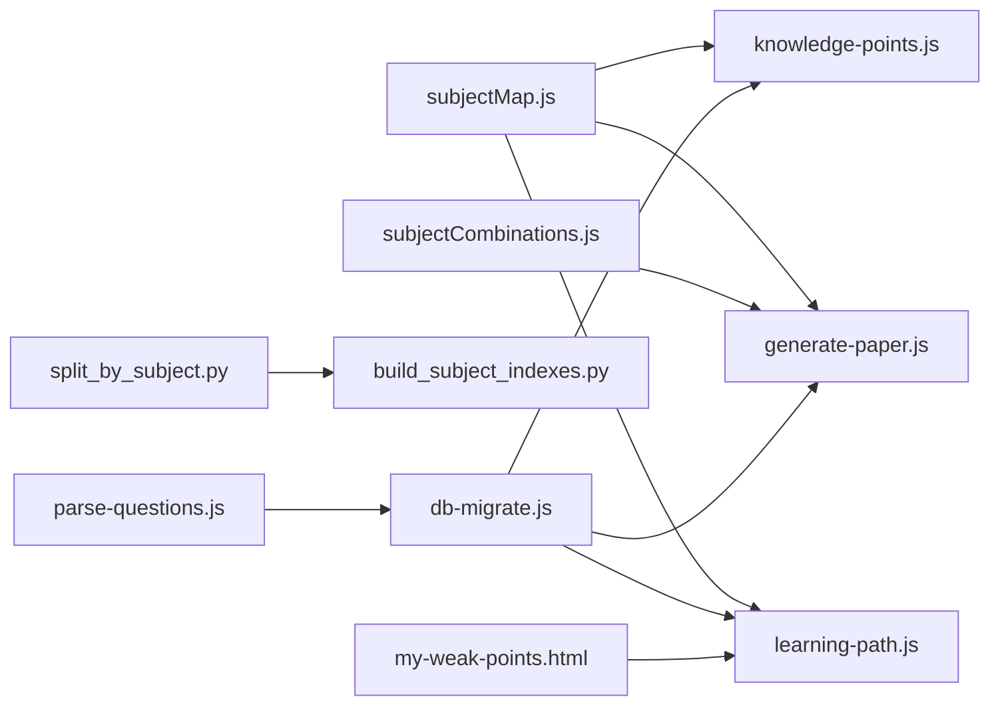

# 学科扩展开发

<cite>
**本文引用的文件**
- [subjectMap.js](file://api/utils/subjectMap.js)
- [subjectCombinations.js](file://api/utils/subjectCombinations.js)
- [build_subject_indexes.py](file://scripts/build_subject_indexes.py)
- [split_by_subject.py](file://scripts/split_by_subject.py)
- [parse-questions.js](file://scripts/parse-questions.js)
- [knowledge-points.js](file://api/knowledge-points.js)
- [generate-paper.js](file://api/generate-paper.js)
- [learning-path.js](file://api/learning-path.js)
- [db-migrate.js](file://scripts/db-migrate.js)
- [check-tables.cjs](file://check-tables.cjs)
</cite>

## 目录
1. [简介](#简介)
2. [项目结构](#项目结构)
3. [核心组件](#核心组件)
4. [架构总览](#架构总览)
5. [详细组件分析](#详细组件分析)
6. [依赖关系分析](#依赖关系分析)
7. [性能考虑](#性能考虑)
8. [故障排查指南](#故障排查指南)
9. [结论](#结论)
10. [附录](#附录)

## 简介
本指南面向AI家教项目的学科扩展开发者，目标是帮助你在现有系统基础上快速添加新学科支持，包括：
- 新学科在subjectMap.js中的映射与关键词体系
- subjectCombinations.js中的组合规则扩展
- 数据处理脚本的工作原理与扩展路径
- 知识点树与题目类型的建模
- 题目分类与难度分级标准
- 从数据准备、索引构建到系统集成的完整流程
- 学科关联关系、交叉知识点处理与个性化推荐算法扩展思路

## 项目结构
本项目采用前后端分离与脚本工具协同的架构：
- 后端API位于api/，包含学科映射、题目解析、知识点管理、组合作业生成、学习路径等模块
- 数据处理脚本位于scripts/，负责将原始资料拆分为学科输入、构建GraphRAG索引、解析题目等
- 前端位于frontend/，提供薄弱点展示与交互界面
- 图数据库与图RAG服务位于graphrag_service/与database/graphify-*目录

图表来源
- [subjectMap.js:1-378](file://api/utils/subjectMap.js#L1-L378)
- [subjectCombinations.js:1-95](file://api/utils/subjectCombinations.js#L1-L95)
- [split_by_subject.py:1-133](file://scripts/split_by_subject.py#L1-L133)
- [build_subject_indexes.py:1-94](file://scripts/build_subject_indexes.py#L1-L94)
- [parse-questions.js:1-256](file://scripts/parse-questions.js#L1-L256)
- [knowledge-points.js:52-145](file://api/knowledge-points.js#L52-L145)
- [generate-paper.js:38-190](file://api/generate-paper.js#L38-L190)
- [learning-path.js:53-143](file://api/learning-path.js#L53-L143)
- [db-migrate.js:427-542](file://scripts/db-migrate.js#L427-L542)

章节来源
- [subjectMap.js:1-378](file://api/utils/subjectMap.js#L1-L378)
- [subjectCombinations.js:1-95](file://api/utils/subjectCombinations.js#L1-L95)
- [split_by_subject.py:1-133](file://scripts/split_by_subject.py#L1-L133)
- [build_subject_indexes.py:1-94](file://scripts/build_subject_indexes.py#L1-L94)
- [parse-questions.js:1-256](file://scripts/parse-questions.js#L1-L256)
- [knowledge-points.js:52-145](file://api/knowledge-points.js#L52-L145)
- [generate-paper.js:38-190](file://api/generate-paper.js#L38-L190)
- [learning-path.js:53-143](file://api/learning-path.js#L53-L143)
- [db-migrate.js:427-542](file://scripts/db-migrate.js#L427-L542)

## 核心组件
- 学科映射与关键词匹配：通过subjectMap.js维护学科键值映射、关键词字典、弱项匹配与弱点排序逻辑
- 组合作业生成：通过subjectCombinations.js定义不同高考模式下的科目组合，结合知识点与错题生成个性化作业
- 知识点管理：提供知识点导入、清洗与查询接口，支撑弱项分析与学习路径生成
- 数据处理脚本：拆分文档、构建索引、解析题目，打通从原始资料到结构化数据的链路
- 学习路径与推荐：基于错题与知识点统计生成阶段化学习计划与推荐

章节来源
- [subjectMap.js:1-378](file://api/utils/subjectMap.js#L1-L378)
- [subjectCombinations.js:1-95](file://api/utils/subjectCombinations.js#L1-L95)
- [knowledge-points.js:52-145](file://api/knowledge-points.js#L52-L145)
- [generate-paper.js:38-190](file://api/generate-paper.js#L38-L190)
- [learning-path.js:53-143](file://api/learning-path.js#L53-L143)

## 架构总览
下图展示了从数据准备到个性化推荐的关键流程：

图表来源
- [split_by_subject.py:76-133](file://scripts/split_by_subject.py#L76-L133)
- [build_subject_indexes.py:69-94](file://scripts/build_subject_indexes.py#L69-L94)
- [parse-questions.js:97-256](file://scripts/parse-questions.js#L97-L256)
- [db-migrate.js:427-542](file://scripts/db-migrate.js#L427-L542)
- [knowledge-points.js:52-145](file://api/knowledge-points.js#L52-L145)
- [generate-paper.js:38-190](file://api/generate-paper.js#L38-L190)
- [learning-path.js:53-143](file://api/learning-path.js#L53-L143)

## 详细组件分析

### 学科映射与关键词匹配（subjectMap.js）
- SUBJECT_MAP与SUBJECT_MAP_REVERSE：提供学科英文键与中文名称的双向映射，便于API与前端显示统一
- KEYWORD_MAP：以知识点ID为键，存储关键词数组；用于将题目内容与知识点进行语义匹配
- 核心关键词CORE_KEYWORDS：对核心术语赋予更高匹配权重，提升弱项识别准确性
- 关键函数：
  - getKeywordsForKP：根据知识点ID获取关键词
  - matchWeakPoint：对单题数据进行关键词匹配，返回匹配结果、得分与置信度
  - findWeakKPIds：对一组错题遍历所有知识点，计算每个知识点的弱点指数并排序
  - extractSearchFields：优先从analysis、solution、clue、metadata、question、subject等字段抽取可检索文本
  - getFrequencyWeight：根据知识点出现频率设置权重

图表来源
- [subjectMap.js:264-295](file://api/utils/subjectMap.js#L264-L295)
- [subjectMap.js:297-322](file://api/utils/subjectMap.js#L297-L322)
- [subjectMap.js:324-377](file://api/utils/subjectMap.js#L324-L377)

章节来源
- [subjectMap.js:1-378](file://api/utils/subjectMap.js#L1-L378)

### 组合规则与科目组合（subjectCombinations.js）
- GAOKAO_MODELS：定义不同高考模式（3+1+2、3+3、传统），含必修科目、首选/再选/科学/文科等要求及适用省份
- SUBJECT_COMBINATIONS：按模式列举具体组合，包含组合ID、名称、首选科目、再选科目集合与类别（science/liberal/mixed）
- 关键函数：
  - getGaokaoModelForProvince：根据省份代码返回对应模式
  - getSubjectsForCombination：根据组合ID返回组成科目集合
  - getCombinationsForModel：按模式返回组合列表
  - isSubjectInCombination：判断某科目是否属于某组合

图表来源
- [subjectCombinations.js:1-95](file://api/utils/subjectCombinations.js#L1-L95)

章节来源
- [subjectCombinations.js:1-95](file://api/utils/subjectCombinations.js#L1-L95)

### 知识点管理与弱项分析（knowledge-points.js）
- 提供导入/替换知识点的接口，支持清理特定层级（如高考/中考）数据
- 与弱项分析流程配合，将错题与知识点进行匹配，输出薄弱点清单与学习建议

章节来源
- [knowledge-points.js:52-145](file://api/knowledge-points.js#L52-L145)

### 组合作业生成与难度分布（generate-paper.js）
- 基于错题与知识点匹配结果，筛选弱知识点并计算分布
- 根据目标难度与时间限制，动态分配易/中/难题目数量
- 生成不同题型（选择、填空、解答）的题目模板，并标注知识点与难度

章节来源
- [generate-paper.js:38-190](file://api/generate-paper.js#L38-L190)
- [generate-paper.js:192-246](file://api/generate-paper.js#L192-L246)

### 学习路径与阶段划分（learning-path.js）
- 基于错题与知识点统计，计算每个知识点的错误次数与难度
- 按错误次数与难度排序，生成阶段化学习计划（基础巩固、能力提升等）

章节来源
- [learning-path.js:53-143](file://api/learning-path.js#L53-L143)

### 数据处理脚本工作原理
- 按学科拆分（split_by_subject.py）：扫描已转换的Markdown文件，依据正则匹配将其归类到各学科，生成独立输入文件
- 构建学科索引（build_subject_indexes.py）：为每个学科加载GraphRAG配置并执行索引构建，支持单学科或全量构建
- 题目解析（parse-questions.js）：调用LLM从试卷内容中提取结构化题目数据，写入数据库并更新统计

图表来源
- [split_by_subject.py:76-133](file://scripts/split_by_subject.py#L76-L133)
- [build_subject_indexes.py:19-94](file://scripts/build_subject_indexes.py#L19-L94)
- [parse-questions.js:53-256](file://scripts/parse-questions.js#L53-L256)

章节来源
- [split_by_subject.py:1-133](file://scripts/split_by_subject.py#L1-L133)
- [build_subject_indexes.py:1-94](file://scripts/build_subject_indexes.py#L1-L94)
- [parse-questions.js:1-256](file://scripts/parse-questions.js#L1-L256)

## 依赖关系分析
- subjectMap.js被多个模块依赖：知识点管理、组合作业生成、学习路径等
- subjectCombinations.js主要被组合作业生成模块使用
- 数据处理脚本与数据库迁移脚本共同保证数据一致性与查询性能
- 前端薄弱点页面依赖学习路径与知识点分析结果

图表来源
- [subjectMap.js:1-378](file://api/utils/subjectMap.js#L1-L378)
- [subjectCombinations.js:1-95](file://api/utils/subjectCombinations.js#L1-L95)
- [knowledge-points.js:52-145](file://api/knowledge-points.js#L52-L145)
- [generate-paper.js:38-190](file://api/generate-paper.js#L38-L190)
- [learning-path.js:53-143](file://api/learning-path.js#L53-L143)
- [split_by_subject.py:1-133](file://scripts/split_by_subject.py#L1-L133)
- [build_subject_indexes.py:1-94](file://scripts/build_subject_indexes.py#L1-L94)
- [parse-questions.js:1-256](file://scripts/parse-questions.js#L1-L256)
- [db-migrate.js:427-542](file://scripts/db-migrate.js#L427-L542)

章节来源
- [subjectMap.js:1-378](file://api/utils/subjectMap.js#L1-L378)
- [subjectCombinations.js:1-95](file://api/utils/subjectCombinations.js#L1-L95)
- [knowledge-points.js:52-145](file://api/knowledge-points.js#L52-L145)
- [generate-paper.js:38-190](file://api/generate-paper.js#L38-L190)
- [learning-path.js:53-143](file://api/learning-path.js#L53-L143)
- [split_by_subject.py:1-133](file://scripts/split_by_subject.py#L1-L133)
- [build_subject_indexes.py:1-94](file://scripts/build_subject_indexes.py#L1-L94)
- [parse-questions.js:1-256](file://scripts/parse-questions.js#L1-L256)
- [db-migrate.js:427-542](file://scripts/db-migrate.js#L427-L542)

## 性能考虑
- 索引构建：GraphRAG索引构建耗时较长，建议按学科并行执行并在CI中缓存结果
- 数据库查询：为高频查询字段建立索引（如题目的难度、类型、科目、年份等），减少慢查询
- 弱项匹配：关键词匹配与JSON解析应避免重复解析，尽量在上游统一处理
- LLM调用：控制并发与重试策略，避免触发限流

## 故障排查指南
- 索引构建失败：确认settings.yaml存在且内容正确，检查输入文件是否存在
- 题目解析失败：检查LLM密钥与模型配置，确保返回JSON格式正确
- 知识点导入异常：关注JSON解析保护逻辑，避免因格式错误导致中断
- 数据库一致性：运行迁移脚本确保外键约束与索引生效

章节来源
- [build_subject_indexes.py:36-66](file://scripts/build_subject_indexes.py#L36-L66)
- [parse-questions.js:53-95](file://scripts/parse-questions.js#L53-L95)
- [knowledge-points.js:52-145](file://api/knowledge-points.js#L52-L145)
- [db-migrate.js:427-542](file://scripts/db-migrate.js#L427-L542)

## 结论
通过subjectMap.js与subjectCombinations.js的清晰职责划分，配合数据处理脚本与数据库迁移，AI家教项目实现了从原始资料到个性化教学的闭环。扩展新学科的关键在于：
- 在subjectMap.js中补充学科映射与关键词字典
- 在subjectCombinations.js中完善组合规则
- 使用split_by_subject.py与build_subject_indexes.py完成索引构建
- 通过parse-questions.js与数据库迁移脚本完成数据入库与索引优化
- 在knowledge-points.js、generate-paper.js与learning-path.js中完成知识点管理与个性化推荐

## 附录

### 新学科扩展流程（从数据准备到系统集成）
- 准备阶段
  - 设计学科数据结构：subject、level、name、subtopics、difficulty、frequency、description
  - 准备关键词字典：为每个知识点ID编写关键词数组
  - 定义组合规则：在subjectCombinations.js中新增模式与组合
- 数据处理
  - 使用split_by_subject.py将原始资料按学科拆分
  - 使用build_subject_indexes.py为新学科构建索引
  - 使用parse-questions.js解析题目并写入数据库
- 系统集成
  - 运行db-migrate.js确保索引与约束生效
  - 在knowledge-points.js中导入新学科知识点
  - 在generate-paper.js与learning-path.js中启用新学科支持

章节来源
- [subjectMap.js:1-378](file://api/utils/subjectMap.js#L1-L378)
- [subjectCombinations.js:1-95](file://api/utils/subjectCombinations.js#L1-L95)
- [split_by_subject.py:1-133](file://scripts/split_by_subject.py#L1-L133)
- [build_subject_indexes.py:1-94](file://scripts/build_subject_indexes.py#L1-L94)
- [parse-questions.js:1-256](file://scripts/parse-questions.js#L1-L256)
- [db-migrate.js:427-542](file://scripts/db-migrate.js#L427-L542)
- [knowledge-points.js:52-145](file://api/knowledge-points.js#L52-L145)
- [generate-paper.js:38-190](file://api/generate-paper.js#L38-L190)
- [learning-path.js:53-143](file://api/learning-path.js#L53-L143)