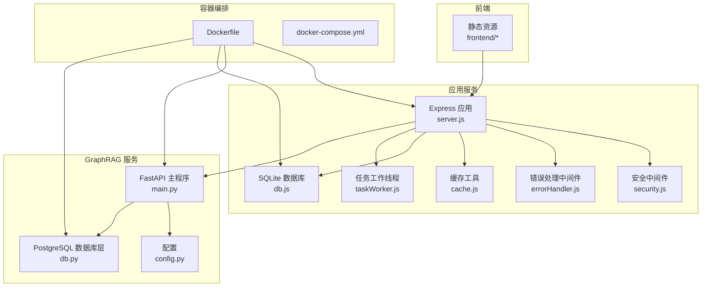
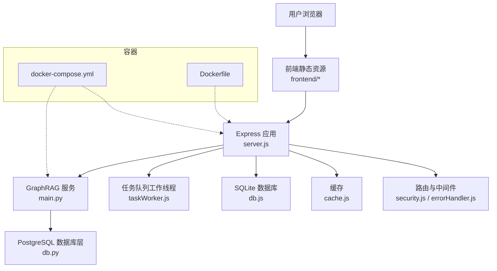
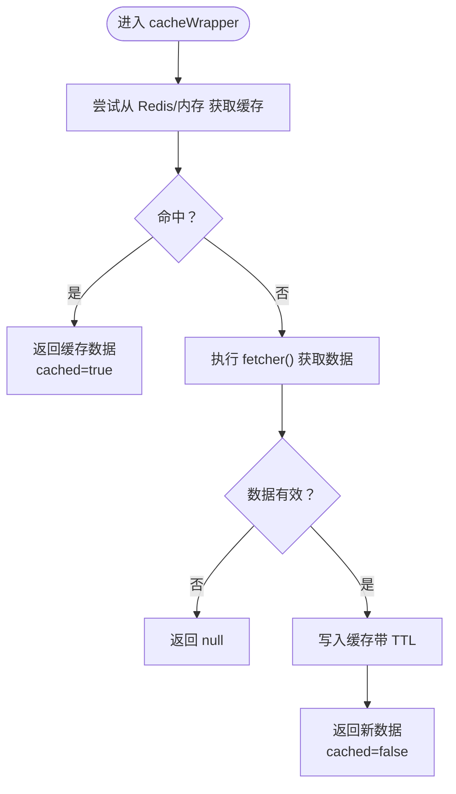
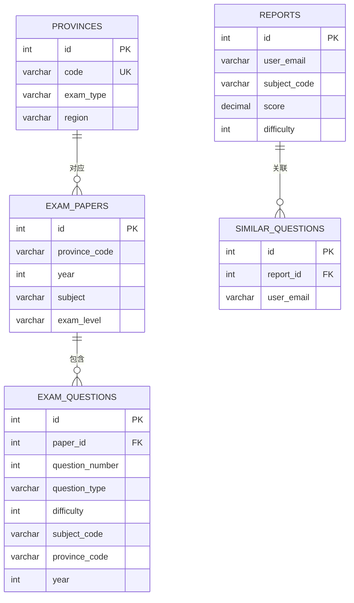
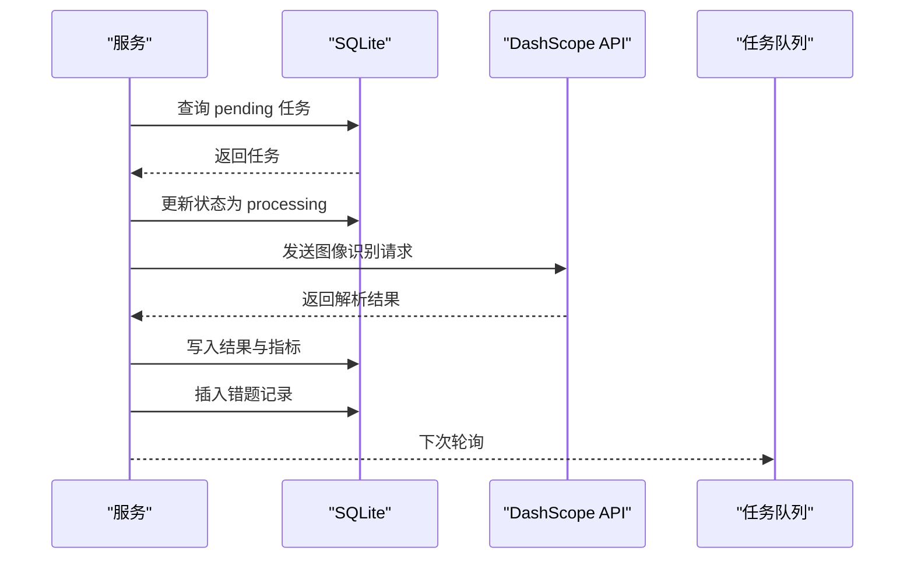
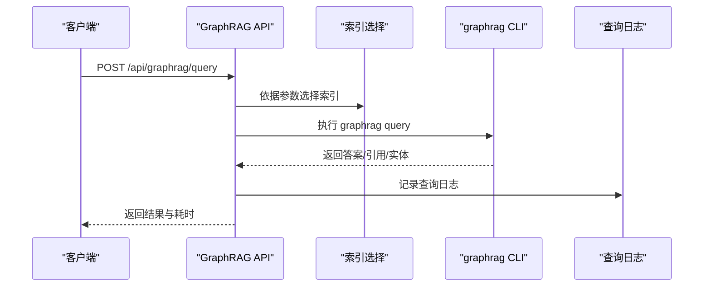
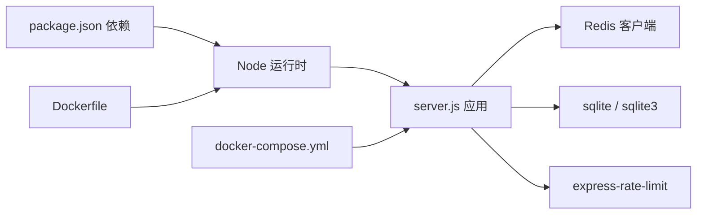
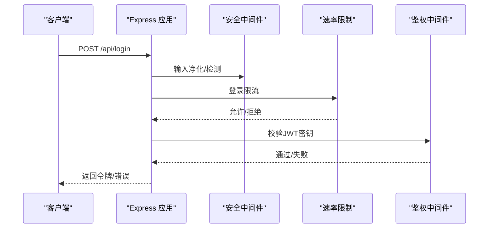

# 性能优化策略

<cite>
**本文引用的文件**
- [package.json](file://package.json)
- [server.js](file://server.js)
- [api/utils/cache.js](file://api/utils/cache.js)
- [api/db.js](file://api/db.js)
- [api/middleware/errorHandler.js](file://api/middleware/errorHandler.js)
- [api/middleware/security.js](file://api/middleware/security.js)
- [api/taskWorker.js](file://api/taskWorker.js)
- [graphrag_service/main.py](file://graphrag_service/main.py)
- [graphrag_service/config.py](file://graphrag_service/config.py)
- [graphrag_service/db.py](file://graphrag_service/db.py)
- [frontend/components.js](file://frontend/components.js)
- [tests/api/auth.test.js](file://tests/api/auth.test.js)
- [tests/api/db-and-json.test.js](file://tests/api/db-and-json.test.js)
- [docker-compose.yml](file://docker-compose.yml)
- [Dockerfile](file://Dockerfile)
</cite>

## 目录
1. [简介](#简介)
2. [项目结构](#项目结构)
3. [核心组件](#核心组件)
4. [架构总览](#架构总览)
5. [详细组件分析](#详细组件分析)
6. [依赖分析](#依赖分析)
7. [性能考量](#性能考量)
8. [故障排查指南](#故障排查指南)
9. [结论](#结论)
10. [附录](#附录)

## 简介
本指南面向AI家教项目，围绕系统性能瓶颈识别、缓存策略设计、数据库查询优化、前端性能优化、Python服务调优、并发与内存管理、监控与容量规划等方面，提供可落地的优化策略与实操建议，并结合仓库现有实现进行深入剖析。

## 项目结构
后端采用Express + SQLite为主的服务形态，辅以独立的GraphRAG Python服务；前端静态资源通过Express静态托管；Docker容器化部署，具备健康检查与只读数据卷挂载等生产级特性。

**图表来源**
- [server.js:1-221](file://server.js#L1-L221)
- [api/utils/cache.js:1-137](file://api/utils/cache.js#L1-L137)
- [api/db.js:1-487](file://api/db.js#L1-L487)
- [api/taskWorker.js:1-191](file://api/taskWorker.js#L1-L191)
- [graphrag_service/main.py:1-462](file://graphrag_service/main.py#L1-L462)
- [graphrag_service/config.py:1-59](file://graphrag_service/config.py#L1-L59)
- [graphrag_service/db.py:1-215](file://graphrag_service/db.py#L1-L215)
- [docker-compose.yml:1-26](file://docker-compose.yml#L1-L26)
- [Dockerfile:1-26](file://Dockerfile#L1-L26)

**章节来源**
- [server.js:1-221](file://server.js#L1-L221)
- [docker-compose.yml:1-26](file://docker-compose.yml#L1-L26)
- [Dockerfile:1-26](file://Dockerfile#L1-L26)

## 核心组件
- Express应用与路由：统一入口、静态资源托管、速率限制、CORS与安全头注入、健康检查、API文档。
- 缓存层：Redis优先、降级到内存Map，支持TTL与批量清理。
- 数据库层：SQLite WAL模式、外键开启、批量索引、参考数据自动补全与列迁移。
- 安全中间件：XSS净化、XSS检测、CSRF校验、安全响应头。
- 错误处理：结构化错误对象、分类处理与开发环境堆栈输出。
- 任务工作线程：队列轮询、重试退避、质量评分与指标记录。
- GraphRAG服务：FastAPI查询接口、索引选择策略、查询日志与统计、子进程调用LLM。
- 前端组件：导航、二维码弹窗、主题切换、本地存储登录态。
- 容器化：最小基础镜像、健康检查、只读文件系统、非root用户。

**章节来源**
- [server.js:1-221](file://server.js#L1-L221)
- [api/utils/cache.js:1-137](file://api/utils/cache.js#L1-L137)
- [api/db.js:1-487](file://api/db.js#L1-L487)
- [api/middleware/security.js:1-114](file://api/middleware/security.js#L1-L114)
- [api/middleware/errorHandler.js:1-75](file://api/middleware/errorHandler.js#L1-L75)
- [api/taskWorker.js:1-191](file://api/taskWorker.js#L1-L191)
- [graphrag_service/main.py:1-462](file://graphrag_service/main.py#L1-L462)
- [frontend/components.js:1-145](file://frontend/components.js#L1-L145)
- [docker-compose.yml:1-26](file://docker-compose.yml#L1-L26)
- [Dockerfile:1-26](file://Dockerfile#L1-L26)

## 架构总览
系统由三层构成：前端静态页面、后端API服务、GraphRAG检索服务。后端API服务负责认证、业务逻辑、任务队列与缓存；GraphRAG服务负责知识图谱检索与统计；两者通过HTTP通信。

**图表来源**
- [server.js:1-221](file://server.js#L1-L221)
- [api/utils/cache.js:1-137](file://api/utils/cache.js#L1-L137)
- [api/db.js:1-487](file://api/db.js#L1-L487)
- [api/taskWorker.js:1-191](file://api/taskWorker.js#L1-L191)
- [graphrag_service/main.py:1-462](file://graphrag_service/main.py#L1-L462)
- [graphrag_service/db.py:1-215](file://graphrag_service/db.py#L1-L215)
- [docker-compose.yml:1-26](file://docker-compose.yml#L1-L26)
- [Dockerfile:1-26](file://Dockerfile#L1-L26)

## 详细组件分析

### 缓存策略与实现原理
- 多级缓存：优先Redis，失败回退内存Map；支持默认、短、长TTL；提供批量清理。
- 使用模式：cacheWrapper(key, fetcher, ttl)先查缓存，命中则直接返回；未命中再执行fetcher并写入缓存。
- 降级策略：Redis不可用时自动切换内存缓存，避免影响主流程。

**图表来源**
- [api/utils/cache.js:122-134](file://api/utils/cache.js#L122-L134)

**章节来源**
- [api/utils/cache.js:1-137](file://api/utils/cache.js#L1-L137)

### 数据库查询优化与索引策略
- SQLite配置：WAL模式、busy_timeout、外键开启，提升并发与一致性。
- 自动索引：为高频查询字段建立复合与单列索引，覆盖常见过滤、排序与连接场景。
- 参考数据与列迁移：首次启动自动插入参考数据并补齐缺失列，保证查询稳定性。
- 查询封装：统一query(sql, params)接口，便于后续埋点与慢查询定位。

**图表来源**
- [api/db.js:159-204](file://api/db.js#L159-L204)
- [api/db.js:308-361](file://api/db.js#L308-L361)

**章节来源**
- [api/db.js:1-487](file://api/db.js#L1-L487)

### 任务队列与并发处理
- 轮询与去重：按创建时间升序取出待处理任务，避免重复处理。
- 重试与退避：最大重试次数与指数退避延迟，防止瞬时故障放大。
- 质量控制：解析结果质量评分阈值与回退标记，统计成功率与低质率。
- 指标记录：记录耗时、模型、token用量、质量分，便于成本与性能分析。

**图表来源**
- [api/taskWorker.js:44-171](file://api/taskWorker.js#L44-L171)

**章节来源**
- [api/taskWorker.js:1-191](file://api/taskWorker.js#L1-L191)

### GraphRAG服务与查询链路
- FastAPI接口：通用查询、题目讲解、相似真题、知识图谱、试卷溯源、管理端作业与统计。
- 索引选择：根据学科、省份、考试级别智能选择索引，减少无关扫描。
- 子进程调用：通过graphrag CLI执行查询，捕获超时与错误，记录查询日志与耗时。
- PostgreSQL统计：维护文档、块、索引作业与查询日志表，支持统计与审计。

**图表来源**
- [graphrag_service/main.py:191-224](file://graphrag_service/main.py#L191-L224)
- [graphrag_service/main.py:276-328](file://graphrag_service/main.py#L276-L328)
- [graphrag_service/db.py:85-106](file://graphrag_service/db.py#L85-L106)

**章节来源**
- [graphrag_service/main.py:1-462](file://graphrag_service/main.py#L1-L462)
- [graphrag_service/config.py:1-59](file://graphrag_service/config.py#L1-L59)
- [graphrag_service/db.py:1-215](file://graphrag_service/db.py#L1-L215)

### 前端性能优化与交互
- 统一导航与QR弹窗：减少重复DOM渲染，事件委托降低绑定开销。
- 本地存储登录态：避免每次请求携带大负载Cookie，减少网络开销。
- 静态资源缓存：Express静态中间件可配合CDN/浏览器缓存策略进一步优化。

**章节来源**
- [frontend/components.js:1-145](file://frontend/components.js#L1-L145)

### 安全与错误处理对性能的影响
- XSS净化与检测：在请求进入业务前进行输入净化与检测，避免后续昂贵的二次处理。
- CSRF保护：限定白名单来源，减少无效请求对后端的压力。
- 结构化错误处理：快速失败与明确错误码，避免深层异常栈造成的额外CPU消耗。

**章节来源**
- [api/middleware/security.js:1-114](file://api/middleware/security.js#L1-L114)
- [api/middleware/errorHandler.js:1-75](file://api/middleware/errorHandler.js#L1-L75)

## 依赖分析
- Node运行时与依赖：Express、CORS、速率限制、JWT、SQLite/SQLite3、Redis客户端等。
- 容器镜像：基于node:22-slim，安装python3与构建工具，最小化体积与攻击面。
- Compose编排：健康检查、只读数据库卷、环境变量注入、重启策略。

**图表来源**
- [package.json:17-41](file://package.json#L17-L41)
- [server.js:1-221](file://server.js#L1-L221)
- [docker-compose.yml:1-26](file://docker-compose.yml#L1-L26)
- [Dockerfile:1-26](file://Dockerfile#L1-L26)

**章节来源**
- [package.json:1-43](file://package.json#L1-L43)
- [docker-compose.yml:1-26](file://docker-compose.yml#L1-L26)
- [Dockerfile:1-26](file://Dockerfile#L1-L26)

## 性能考量

### 系统性能瓶颈识别
- I/O密集：任务队列与LLM调用、GraphRAG子进程调用、数据库读写。
- CPU热点：图像识别解析、Markdown渲染、正则匹配与XSS检测。
- 网络延迟：外部LLM服务、静态资源CDN、跨域请求。
- 内存压力：任务结果聚合、查询结果集、缓存条目增长。

### 缓存策略设计与优化
- 命中率优先：热点数据（地区/科目/报告/知识点）使用Redis，短TTL（分钟级）。
- 降级兜底：Redis失败自动回退内存Map，避免雪崩。
- 批量清理：按模式删除，定期清理过期键，防止内存泄漏。
- 写策略：异步写入，避免阻塞请求路径。

**章节来源**
- [api/utils/cache.js:1-137](file://api/utils/cache.js#L1-L137)

### 数据库查询优化技巧
- 索引覆盖：确保WHERE、JOIN、ORDER BY字段有合适索引，减少全表扫描。
- 复合索引：针对多条件组合查询建立复合索引，如“省+年+学科”。
- PRAGMA优化：WAL、busy_timeout、外键开启，提升并发与一致性。
- 列迁移与规范化：自动补齐缺失列，减少运行时DDL开销。

**章节来源**
- [api/db.js:308-361](file://api/db.js#L308-L361)
- [api/db.js:417-481](file://api/db.js#L417-L481)

### 前端性能优化
- 资源压缩与缓存：启用Gzip/Brotli，合理设置Cache-Control与ETag。
- 懒加载：图片与非首屏组件按需加载，减少初始渲染时间。
- 本地化：导航与弹窗组件复用，减少DOM节点数量。
- CDN：静态资源走CDN，缩短RTT。

**章节来源**
- [frontend/components.js:1-145](file://frontend/components.js#L1-L145)
- [server.js:106-112](file://server.js#L106-L112)

### Python服务性能调优
- 并发与限流：GraphRAG服务内部限速配置，避免LLM配额超限。
- 子进程健壮性：超时控制与异常捕获，防止阻塞主线程。
- 日志与指标：查询耗时、引用数量、实体数量，支撑容量规划。

**章节来源**
- [graphrag_service/main.py:117-131](file://graphrag_service/main.py#L117-L131)
- [graphrag_service/config.py:56-59](file://graphrag_service/config.py#L56-L59)

### 监控指标与容量规划
- 指标建议：请求QPS/延迟、错误率、缓存命中率、数据库慢查询数、队列积压、LLM调用耗时与费用。
- 容量规划：基于峰值QPS与SLA设定实例数，结合Redis/DB上限与LLM配额制定上限。

**章节来源**
- [api/taskWorker.js:30-42](file://api/taskWorker.js#L30-L42)
- [graphrag_service/db.py:85-106](file://graphrag_service/db.py#L85-L106)

### 性能测试与基准
- 接口压测：使用工具对登录、报告、GraphRAG查询等关键路径进行并发测试。
- 数据库基准：对高频查询加索引前后对比，观察QPS与P95/P99延迟变化。
- 任务队列吞吐：调整轮询间隔与重试策略，观察吞吐与失败率平衡。

**章节来源**
- [tests/api/db-and-json.test.js:1-45](file://tests/api/db-and-json.test.js#L1-L45)
- [tests/api/auth.test.js:1-117](file://tests/api/auth.test.js#L1-L117)

## 故障排查指南
- 认证密钥校验：JWT密钥缺失或默认值会直接退出，确保生产环境配置强密钥。
- JSON解析保护：对上游返回的JSON进行try-catch包裹，避免解析异常导致服务崩溃。
- 速率限制：登录/代理/通用API分别限流，注意突发流量与白名单配置。
- 缓存降级：Redis异常时自动切换内存缓存，关注内存使用与GC压力。
- 数据库健康：健康检查端点可快速发现DB连接问题。

**章节来源**
- [tests/api/auth.test.js:13-58](file://tests/api/auth.test.js#L13-L58)
- [tests/api/db-and-json.test.js:17-29](file://tests/api/db-and-json.test.js#L17-L29)
- [server.js:44-46](file://server.js#L44-L46)
- [server.js:126-136](file://server.js#L126-L136)

## 结论
通过多级缓存、索引优化、任务队列与并发控制、安全前置与结构化错误处理、以及容器化与健康检查，AI家教项目在功能完备的同时具备了良好的性能与可运维性。建议持续以监控指标驱动优化，逐步引入CDN、数据库读副本与Redis集群，以应对更大规模的并发与数据体量。

## 附录

### 关键流程图：登录鉴权与速率限制

**图表来源**
- [server.js:141-145](file://server.js#L141-L145)
- [api/middleware/security.js:23-71](file://api/middleware/security.js#L23-L71)
- [api/middleware/errorHandler.js:13-37](file://api/middleware/errorHandler.js#L13-L37)
- [tests/api/auth.test.js:50-58](file://tests/api/auth.test.js#L50-L58)