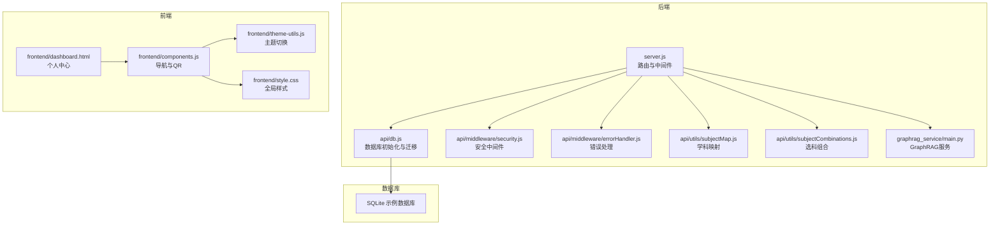
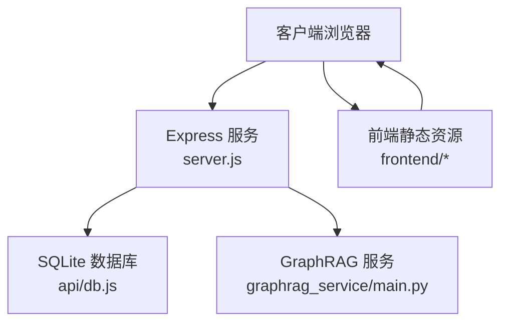
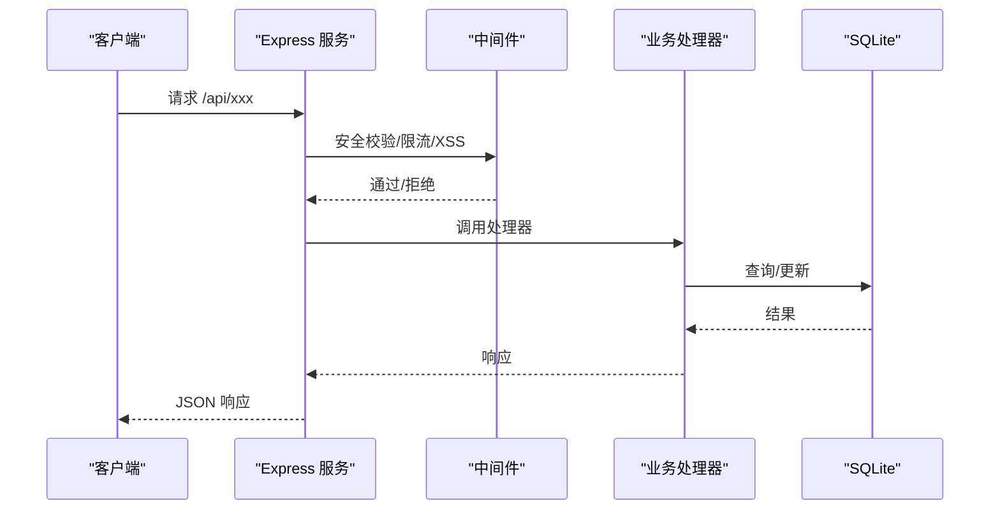
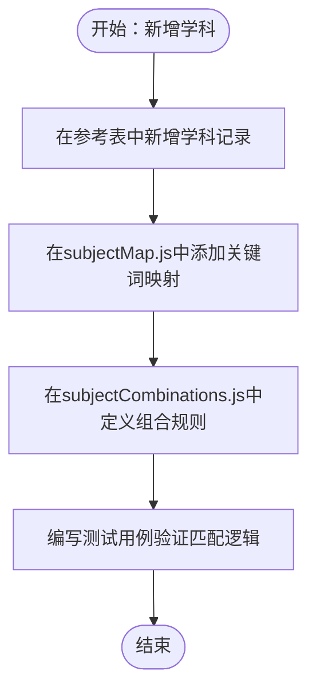
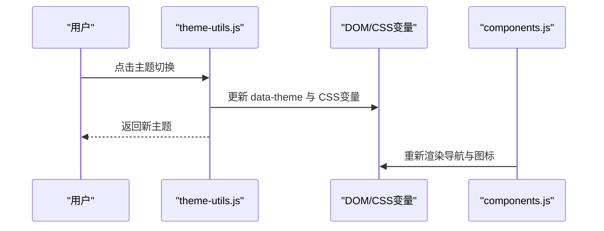
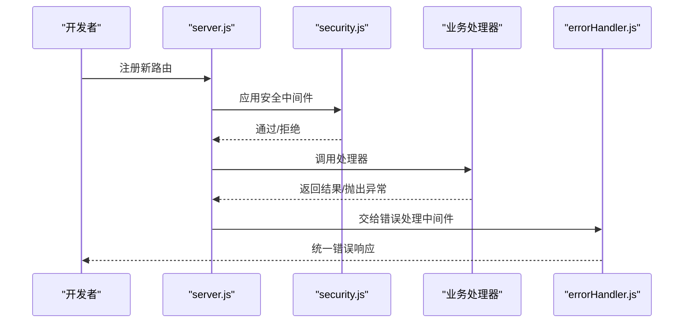
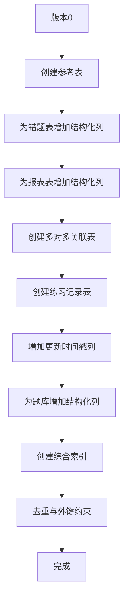
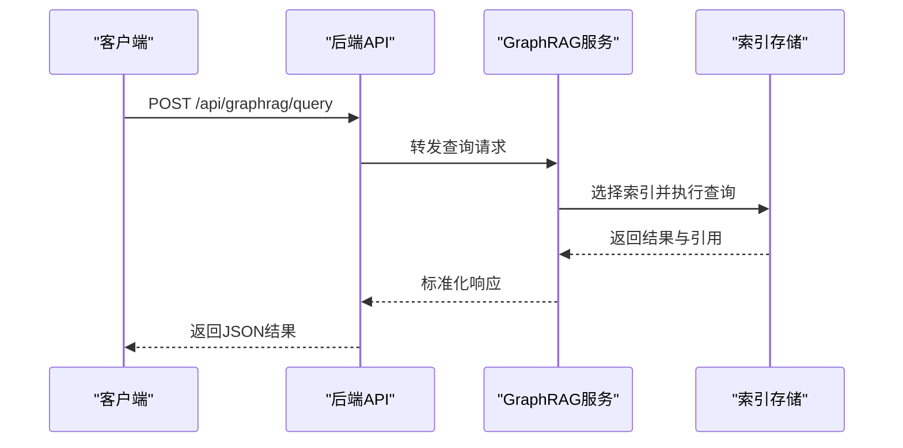
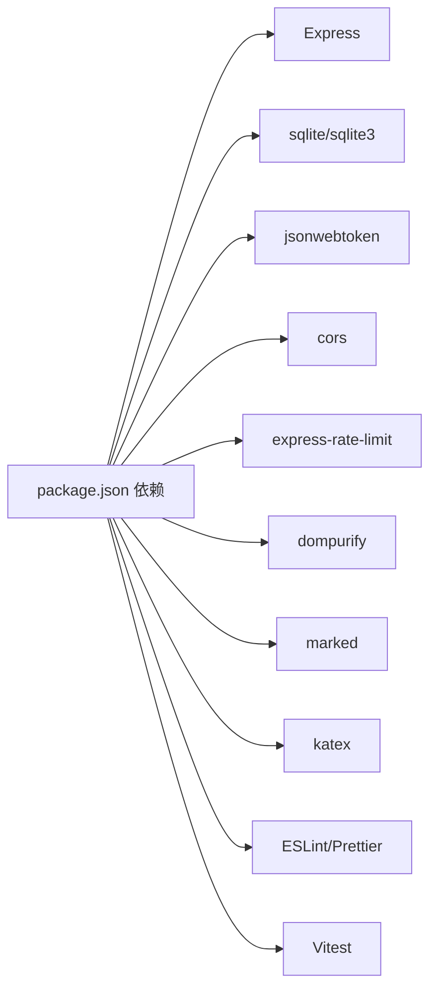

# 扩展开发指南

<cite>
**本文档引用的文件**
- [package.json](file://package.json)
- [server.js](file://server.js)
- [api/db.js](file://api/db.js)
- [api/utils/subjectMap.js](file://api/utils/subjectMap.js)
- [api/utils/subjectCombinations.js](file://api/utils/subjectCombinations.js)
- [frontend/components.js](file://frontend/components.js)
- [frontend/theme-utils.js](file://frontend/theme-utils.js)
- [frontend/style.css](file://frontend/style.css)
- [frontend/dashboard.html](file://frontend/dashboard.html)
- [scripts/db-migrate.js](file://scripts/db-migrate.js)
- [api/middleware/security.js](file://api/middleware/security.js)
- [api/middleware/errorHandler.js](file://api/middleware/errorHandler.js)
- [tests/api/auth.test.js](file://tests/api/auth.test.js)
- [eslint.config.js](file://eslint.config.js)
- [vitest.config.js](file://vitest.config.js)
- [graphrag_service/main.py](file://graphrag_service/main.py)
</cite>

## 目录
1. [简介](#简介)
2. [项目结构](#项目结构)
3. [核心组件](#核心组件)
4. [架构总览](#架构总览)
5. [详细组件分析](#详细组件分析)
6. [依赖分析](#依赖分析)
7. [性能考虑](#性能考虑)
8. [故障排除指南](#故障排除指南)
9. [结论](#结论)
10. [附录](#附录)

## 简介
本指南面向AI家教项目的扩展开发者，系统阐述如何在现有架构基础上添加新功能模块、扩展学科支持、集成第三方服务，以及实现插件化扩展、主题定制与配置管理。文档同时覆盖新API端点开发、数据库表扩展、前端组件开发的最佳实践，并提供学科扩展指南、知识点映射规则、题目类型支持方案，以及性能优化技巧、代码规范与测试策略、贡献代码指南、代码审查流程与发布管理策略。

## 项目结构
项目采用前后端同构的Express后端与静态前端资源组织方式，配合SQLite数据库与GraphRAG内部查询服务，形成“后端API + 前端SPA + 图谱检索”的整体架构。关键目录与职责如下：
- api：后端业务模块与中间件，包含认证、学科、题目、报表、任务队列、安全与错误处理等
- database：SQLite数据库脚本与图谱数据导入脚本
- frontend：静态前端页面与组件，包含主题切换、导航与样式
- scripts：数据库迁移、题目解析、图谱索引等运维脚本
- tests：Vitest测试套件
- graphrag_service：GraphRAG内部查询服务（Python FastAPI）

**图表来源**
- [server.js:1-221](file://server.js#L1-L221)
- [api/db.js:1-478](file://api/db.js#L1-L478)
- [api/middleware/security.js:1-114](file://api/middleware/security.js#L1-L114)
- [api/middleware/errorHandler.js:1-75](file://api/middleware/errorHandler.js#L1-L75)
- [api/utils/subjectMap.js:1-378](file://api/utils/subjectMap.js#L1-L378)
- [api/utils/subjectCombinations.js:1-95](file://api/utils/subjectCombinations.js#L1-L95)
- [frontend/components.js:1-145](file://frontend/components.js#L1-L145)
- [frontend/theme-utils.js:1-107](file://frontend/theme-utils.js#L1-L107)
- [frontend/style.css:1-609](file://frontend/style.css#L1-L609)
- [frontend/dashboard.html:1-508](file://frontend/dashboard.html#L1-L508)
- [graphrag_service/main.py:1-462](file://graphrag_service/main.py#L1-L462)

**章节来源**
- [server.js:1-221](file://server.js#L1-L221)
- [package.json:1-43](file://package.json#L1-L43)

## 核心组件
- 路由与中间件：统一处理CORS、安全头、CSRF、XSS防护、速率限制与错误处理；提供统一的包装器处理异步处理器异常
- 数据库层：集中初始化SQLite、创建参考表、索引与约束；提供迁移脚本与统计数据打印
- 学科与题目工具：提供学科映射、关键词匹配、弱项分析、选科组合等
- 安全中间件：DOMPurify净化、XSS检测、CSRF校验、安全响应头
- 错误处理：统一AppError封装、JWT错误处理、数据库错误与端口占用错误
- 前端组件：导航、主题切换、QR码弹窗、样式系统
- GraphRAG服务：内部FastAPI服务，提供查询、解释、相似题、知识图谱等接口

**章节来源**
- [server.js:115-205](file://server.js#L115-L205)
- [api/db.js:15-365](file://api/db.js#L15-L365)
- [api/utils/subjectMap.js:249-378](file://api/utils/subjectMap.js#L249-L378)
- [api/utils/subjectCombinations.js:24-95](file://api/utils/subjectCombinations.js#L24-L95)
- [api/middleware/security.js:1-114](file://api/middleware/security.js#L1-L114)
- [api/middleware/errorHandler.js:1-75](file://api/middleware/errorHandler.js#L1-L75)
- [frontend/components.js:1-145](file://frontend/components.js#L1-L145)
- [frontend/theme-utils.js:1-107](file://frontend/theme-utils.js#L1-L107)
- [graphrag_service/main.py:178-420](file://graphrag_service/main.py#L178-L420)

## 架构总览
系统采用“Express后端 + SQLite + GraphRAG服务 + 静态前端”的分层架构。后端通过中间件统一注入安全与防护，数据库层负责结构化数据与索引，前端提供主题切换与导航组件，GraphRAG服务提供内部查询能力并与后端API协作。

**图表来源**
- [server.js:1-221](file://server.js#L1-L221)
- [api/db.js:1-478](file://api/db.js#L1-L478)
- [graphrag_service/main.py:1-462](file://graphrag_service/main.py#L1-L462)
- [frontend/style.css:1-609](file://frontend/style.css#L1-L609)

## 详细组件分析

### 插件系统设计与扩展点
- 中间件扩展：通过中间件注册点（如安全中间件、速率限制）扩展新功能，保持与现有安全策略一致
- 路由扩展：在server.js中新增路由与处理器，遵循统一包装器与错误处理
- 数据库扩展：通过迁移脚本（scripts/db-migrate.js）新增表、索引与约束，确保版本化演进
- 前端扩展：通过components.js与theme-utils.js扩展导航与主题，保持样式一致性

**图表来源**
- [server.js:115-205](file://server.js#L115-L205)
- [api/middleware/security.js:1-114](file://api/middleware/security.js#L1-L114)
- [api/middleware/errorHandler.js:1-75](file://api/middleware/errorHandler.js#L1-L75)
- [api/db.js:474-478](file://api/db.js#L474-L478)

**章节来源**
- [server.js:141-205](file://server.js#L141-L205)
- [scripts/db-migrate.js:525-616](file://scripts/db-migrate.js#L525-L616)
- [frontend/components.js:1-145](file://frontend/components.js#L1-L145)
- [frontend/theme-utils.js:1-107](file://frontend/theme-utils.js#L1-L107)

### 学科扩展与知识点映射
- 新增学科：在数据库参考表subjects中插入新学科记录，或通过迁移脚本维护
- 关键词映射：在subjectMap.js中扩展KEYWORD_MAP，建立知识点ID到关键词列表的映射
- 弱项分析：利用matchWeakPoint与findWeakKPIds对错题数据进行关键词匹配与弱项评分
- 选科组合：在subjectCombinations.js中定义新模式下的学科组合与首选/可选科目

**图表来源**
- [api/db.js:367-415](file://api/db.js#L367-L415)
- [api/utils/subjectMap.js:25-247](file://api/utils/subjectMap.js#L25-L247)
- [api/utils/subjectCombinations.js:1-95](file://api/utils/subjectCombinations.js#L1-L95)

**章节来源**
- [api/db.js:367-415](file://api/db.js#L367-L415)
- [api/utils/subjectMap.js:249-378](file://api/utils/subjectMap.js#L249-L378)
- [api/utils/subjectCombinations.js:67-95](file://api/utils/subjectCombinations.js#L67-L95)

### 主题定制与配置管理
- 主题切换：通过theme-utils.js与CSS变量实现深色/浅色主题切换，前端组件自动适配
- 样式系统：style.css集中管理全局样式与主题变量，支持打印样式与响应式布局
- 导航组件：components.js统一渲染导航与QR弹窗，支持登录态与页面高亮

**图表来源**
- [frontend/theme-utils.js:1-107](file://frontend/theme-utils.js#L1-L107)
- [frontend/style.css:1-609](file://frontend/style.css#L1-L609)
- [frontend/components.js:1-145](file://frontend/components.js#L1-L145)

**章节来源**
- [frontend/theme-utils.js:1-107](file://frontend/theme-utils.js#L1-L107)
- [frontend/style.css:1-609](file://frontend/style.css#L1-L609)
- [frontend/components.js:1-145](file://frontend/components.js#L1-L145)

### 新API端点开发最佳实践
- 路由注册：在server.js中新增路由，绑定认证中间件（如需），使用统一包装器处理异常
- 参数校验：结合validator工具与安全中间件，确保输入安全与合规
- 响应格式：遵循统一响应结构，错误处理中间件自动规范化错误
- 速率限制：针对高频接口配置独立限流策略，避免滥用

**图表来源**
- [server.js:141-205](file://server.js#L141-L205)
- [api/middleware/security.js:1-114](file://api/middleware/security.js#L1-L114)
- [api/middleware/errorHandler.js:1-75](file://api/middleware/errorHandler.js#L1-L75)

**章节来源**
- [server.js:141-205](file://server.js#L141-L205)
- [api/middleware/security.js:1-114](file://api/middleware/security.js#L1-L114)
- [api/middleware/errorHandler.js:1-75](file://api/middleware/errorHandler.js#L1-L75)

### 数据库表扩展与迁移
- 迁移脚本：通过scripts/db-migrate.js定义版本化迁移，包括新增表、列、索引与数据回填
- 索引策略：为高频查询字段建立复合索引，提升查询性能
- 参考数据：在迁移中维护学科、题型、等级等参考表，保证数据一致性

**图表来源**
- [scripts/db-migrate.js:9-523](file://scripts/db-migrate.js#L9-L523)

**章节来源**
- [scripts/db-migrate.js:525-616](file://scripts/db-migrate.js#L525-L616)
- [api/db.js:417-472](file://api/db.js#L417-L472)

### 前端组件开发最佳实践
- 组件化：导航与主题切换组件化，便于复用与维护
- 主题适配：通过CSS变量与data-theme属性实现主题切换，兼容打印样式
- 交互体验：QR弹窗、拍照搜题等交互组件提供良好用户体验

**章节来源**
- [frontend/components.js:1-145](file://frontend/components.js#L1-L145)
- [frontend/theme-utils.js:1-107](file://frontend/theme-utils.js#L1-L107)
- [frontend/style.css:1-609](file://frontend/style.css#L1-L609)
- [frontend/dashboard.html:1-508](file://frontend/dashboard.html#L1-L508)

### 第三方服务集成（GraphRAG）
- 内部服务：graphrag_service/main.py提供GraphRAG查询、解释、相似题与知识图谱接口
- 索引选择：根据学科、省份、考试级别智能选择索引
- 查询日志：记录查询耗时、引用与用户信息，便于审计与优化

**图表来源**
- [graphrag_service/main.py:191-273](file://graphrag_service/main.py#L191-L273)
- [graphrag_service/main.py:331-360](file://graphrag_service/main.py#L331-L360)

**章节来源**
- [graphrag_service/main.py:1-462](file://graphrag_service/main.py#L1-L462)

## 依赖分析
- 后端依赖：Express、sqlite、sqlite3、jsonwebtoken、cors、rate-limit、dompurify、marked、katex等
- 开发依赖：ESLint、Prettier、Vitest等
- 前端依赖：QRCode、主题切换、导航组件等

**图表来源**
- [package.json:17-41](file://package.json#L17-L41)

**章节来源**
- [package.json:1-43](file://package.json#L1-43)

## 性能考虑
- 数据库性能：通过索引优化（复合索引、多表关联索引）与结构化列减少查询成本
- 缓存与限流：对高频接口启用速率限制，避免滥用；对静态资源启用缓存控制
- 前端性能：主题切换使用CSS变量，避免重绘；响应式布局减少移动端性能损耗
- 图谱检索：GraphRAG查询设置超时与方法选择，避免长时间阻塞

**章节来源**
- [api/db.js:308-361](file://api/db.js#L308-L361)
- [server.js:44-46](file://server.js#L44-L46)
- [frontend/style.css:1-609](file://frontend/style.css#L1-L609)
- [graphrag_service/main.py:126-131](file://graphrag_service/main.py#L126-L131)

## 故障排除指南
- 认证与安全：JWT密钥校验失败、令牌过期、CSRF来源不被允许、XSS检测拦截
- 数据库：SQLite错误、端口占用、索引缺失导致查询缓慢
- 前端：主题切换异常、导航不显示、QR弹窗不可用
- 测试：单元测试覆盖API中间件与错误处理

**章节来源**
- [tests/api/auth.test.js:1-117](file://tests/api/auth.test.js#L1-L117)
- [api/middleware/errorHandler.js:1-75](file://api/middleware/errorHandler.js#L1-L75)
- [api/middleware/security.js:89-113](file://api/middleware/security.js#L89-L113)

## 结论
本指南提供了在现有AI家教项目上进行扩展开发的完整路径：从插件化扩展点、学科与知识点映射、主题与配置管理，到新API端点、数据库迁移与前端组件开发，再到性能优化与测试策略。遵循这些最佳实践，可以高效、安全地扩展系统功能并保持架构一致性。

## 附录

### 贡献代码指南
- 提交前：运行ESLint与Prettier格式化，确保无语法错误
- 测试：补充或更新Vitest测试，覆盖新增功能与边界情况
- 文档：更新README或新增变更说明，标注影响范围

**章节来源**
- [eslint.config.js:1-61](file://eslint.config.js#L1-L61)
- [vitest.config.js:1-15](file://vitest.config.js#L1-L15)

### 代码审查流程
- 自检：本地运行lint与test，修复警告与失败用例
- 提交：创建Pull Request，描述变更动机、影响与测试结果
- 审查：至少一名维护者审查，关注安全性、性能与可维护性

**章节来源**
- [tests/api/auth.test.js:1-117](file://tests/api/auth.test.js#L1-L117)

### 发布管理策略
- 版本：遵循语义化版本，重大变更升级主版本
- 迁移：数据库变更通过迁移脚本执行，确保向后兼容
- 部署：Docker与compose用于容器化部署，CI流程自动化测试与构建

**章节来源**
- [scripts/db-migrate.js:525-616](file://scripts/db-migrate.js#L525-L616)
- [package.json:5-16](file://package.json#L5-L16)