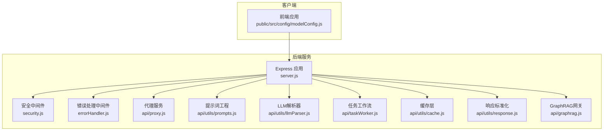
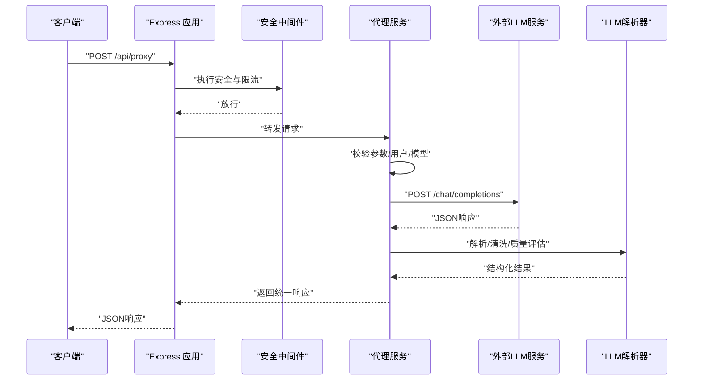
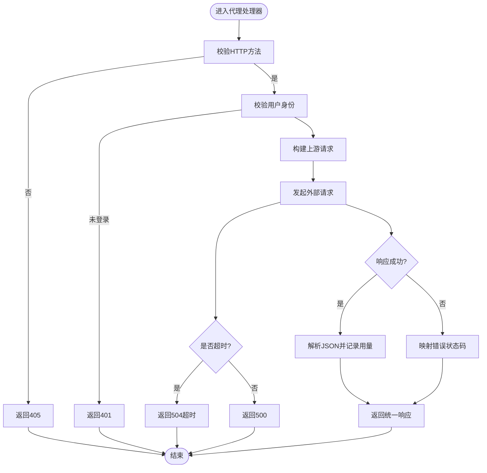
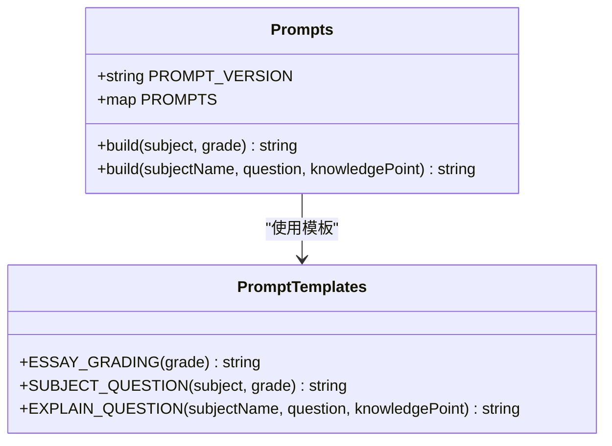
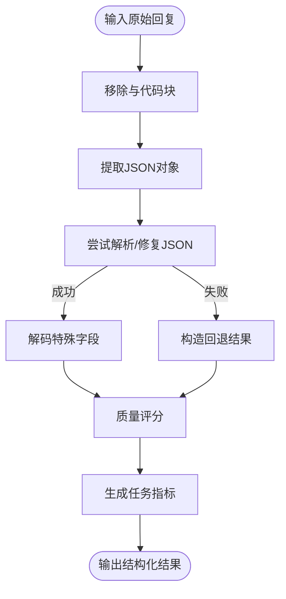
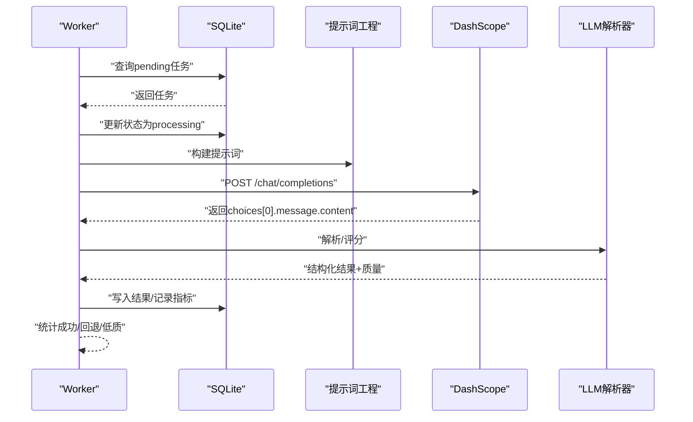
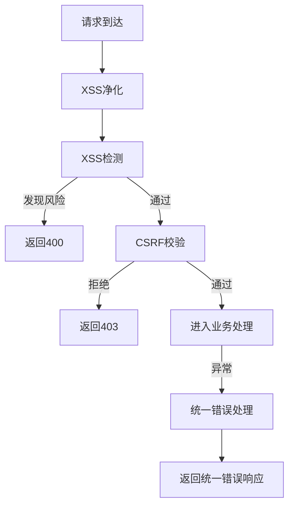
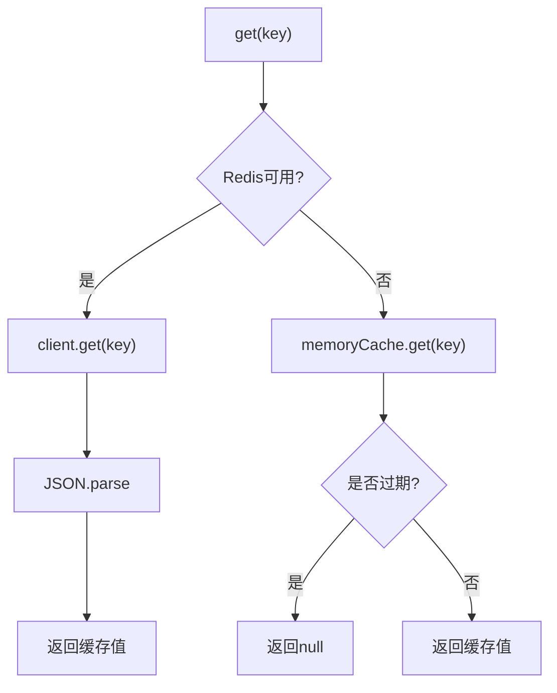
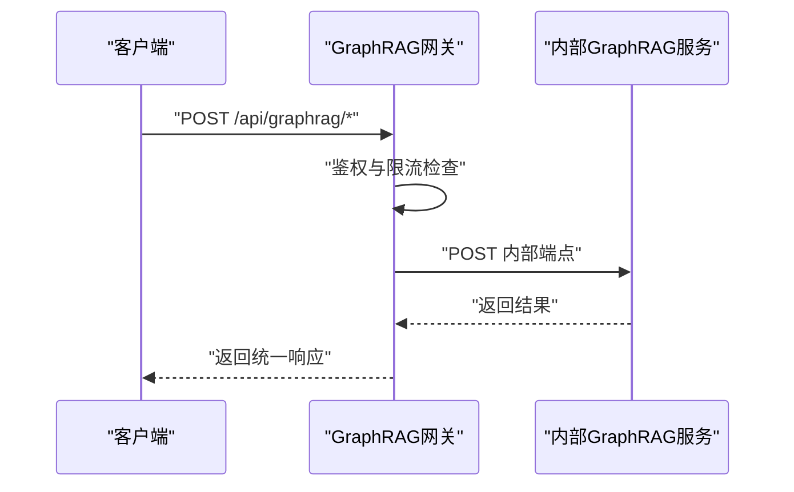
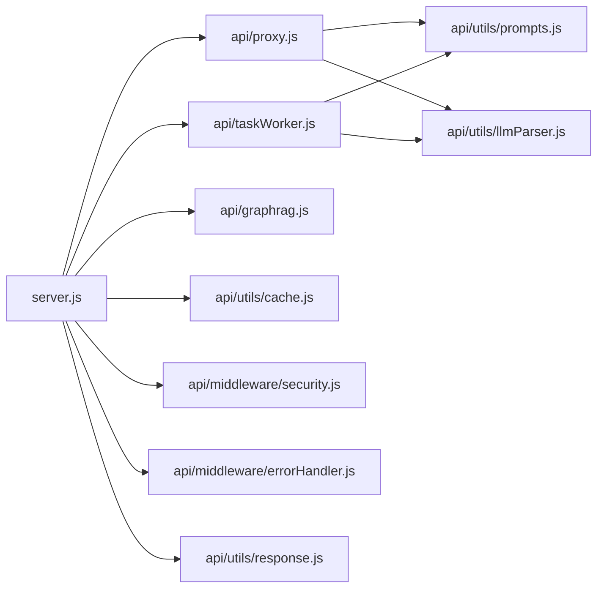

# 第三方服务集成

<cite>
**本文档引用的文件**
- [server.js](file://server.js)
- [proxy.js](file://api/proxy.js)
- [llmParser.js](file://api/utils/llmParser.js)
- [prompts.js](file://api/utils/prompts.js)
- [security.js](file://api/middleware/security.js)
- [errorHandler.js](file://api/middleware/errorHandler.js)
- [cache.js](file://api/utils/cache.js)
- [response.js](file://api/utils/response.js)
- [taskWorker.js](file://api/taskWorker.js)
- [graphrag.js](file://api/graphrag.js)
- [modelConfig.js](file://public/src/config/modelConfig.js)
- [package.json](file://package.json)
- [ci.yml](file://.github/workflows/ci.yml)
- [proxy.test.js](file://tests/api/proxy.test.js)
- [p2-ai-capability.test.js](file://tests/api/p2-ai-capability.test.js)
- [p1-business-logic.test.js](file://tests/api/p1-business-logic.test.js)
- [p5-engineering.test.js](file://tests/api/p5-engineering.test.js)
</cite>

## 目录
1. [简介](#简介)
2. [项目结构](#项目结构)
3. [核心组件](#核心组件)
4. [架构总览](#架构总览)
5. [详细组件分析](#详细组件分析)
6. [依赖关系分析](#依赖关系分析)
7. [性能考虑](#性能考虑)
8. [故障排查指南](#故障排查指南)
9. [结论](#结论)
10. [附录](#附录)

## 简介
本指南面向AI家教项目的后端与前端开发者，系统化说明如何集成第三方API服务、大语言模型（LLM）与AI工具，涵盖代理服务实现机制、提示词工程、LLM解析器使用方法、认证配置、请求转发、响应处理与错误恢复策略，并提供新增AI服务、图像识别API与支付接口的集成示例。同时阐述服务间通信协议、数据格式转换与性能优化技巧，以及服务可用性监控、降级策略与故障转移机制的设计与实现。

## 项目结构
后端基于Express框架，通过中间件统一处理安全、限流与错误；核心能力包括：
- 代理服务：统一转发外部LLM请求，集中管理API密钥与配额
- 提示词工程：模板化构建任务提示，确保输出结构化JSON
- LLM解析器：从非结构化回复中提取JSON，提供质量评估与回退策略
- 任务工作流：异步队列处理图像识别任务，带重试与指标记录
- 图RAG网关：鉴权与限流后转发至内部GraphRAG服务
- 缓存层：Redis优先，失败回退内存缓存
- 响应标准化：统一success/error结构，便于前端消费

**图表来源**
- [server.js:1-221](file://server.js#L1-L221)
- [security.js:1-114](file://api/middleware/security.js#L1-L114)
- [errorHandler.js:1-75](file://api/middleware/errorHandler.js#L1-L75)
- [proxy.js:1-106](file://api/proxy.js#L1-L106)
- [prompts.js:1-131](file://api/utils/prompts.js#L1-L131)
- [llmParser.js:1-204](file://api/utils/llmParser.js#L1-L204)
- [taskWorker.js:1-191](file://api/taskWorker.js#L1-L191)
- [cache.js:1-137](file://api/utils/cache.js#L1-L137)
- [response.js:1-69](file://api/utils/response.js#L1-L69)
- [graphrag.js:1-66](file://api/graphrag.js#L1-L66)
- [modelConfig.js:1-19](file://public/src/config/modelConfig.js#L1-L19)

**章节来源**
- [server.js:1-221](file://server.js#L1-L221)
- [package.json:1-43](file://package.json#L1-L43)

## 核心组件
- 代理服务（api/proxy.js）：统一接收前端请求，校验用户身份与参数，按模型路由到对应供应商端点，注入API Key，设置温度与最大token，超时控制，错误映射与日志记录。
- 提示词工程（api/utils/prompts.js）：定义任务类型（图像识别、题目讲解），提供版本化模板与构建函数，确保输出符合预期JSON结构。
- LLM解析器（api/utils/llmParser.js）：清理<think>标签与代码块，提取JSON，容错修复（逗号、转义），字段解码，质量评分与回退策略，生成任务指标。
- 任务工作流（api/taskWorker.js）：轮询待处理任务，构建提示词，调用DashScope，解析结果，记录指标，统计状态，指数退避重试，过期任务恢复。
- 安全中间件（api/middleware/security.js）：DOM净化、XSS检测、CSRF防护、CORS白名单、安全头设置。
- 错误处理中间件（api/middleware/errorHandler.js）：统一错误分类与响应，区分业务错误与系统错误。
- 缓存层（api/utils/cache.js）：Redis优先，异常回退内存缓存，支持TTL与批量清理。
- 响应标准化（api/utils/response.js）：统一success/error结构，支持分页响应。
- GraphRAG网关（api/graphrag.js）：鉴权与限流后转发到内部服务，错误映射与超时处理。
- 前端模型配置（public/src/config/modelConfig.js）：切换模型、指定代理基地址与参数。

**章节来源**
- [proxy.js:1-106](file://api/proxy.js#L1-L106)
- [prompts.js:1-131](file://api/utils/prompts.js#L1-L131)
- [llmParser.js:1-204](file://api/utils/llmParser.js#L1-L204)
- [taskWorker.js:1-191](file://api/taskWorker.js#L1-L191)
- [security.js:1-114](file://api/middleware/security.js#L1-L114)
- [errorHandler.js:1-75](file://api/middleware/errorHandler.js#L1-L75)
- [cache.js:1-137](file://api/utils/cache.js#L1-L137)
- [response.js:1-69](file://api/utils/response.js#L1-L69)
- [graphrag.js:1-66](file://api/graphrag.js#L1-L66)
- [modelConfig.js:1-19](file://public/src/config/modelConfig.js#L1-L19)

## 架构总览
后端通过Express路由聚合各功能模块，代理服务作为LLM接入统一入口，提示词工程保证输出稳定性，解析器提升鲁棒性，任务工作流异步处理高延迟任务，缓存层降低重复计算成本，安全中间件与错误处理保障线上稳定。

**图表来源**
- [server.js:168-168](file://server.js#L168)
- [proxy.js:33-105](file://api/proxy.js#L33-L105)
- [llmParser.js:85-133](file://api/utils/llmParser.js#L85-L133)

**章节来源**
- [server.js:141-205](file://server.js#L141-L205)
- [proxy.js:33-105](file://api/proxy.js#L33-L105)

## 详细组件分析

### 代理服务（统一LLM接入）
- 认证与参数校验：要求已登录用户，校验model与messages数组长度，限制最大消息数与token上限，安全温度范围。
- 供应商路由：根据模型名匹配供应商配置，读取环境变量中的API Key，缺失时返回服务不可用。
- 超时控制：AbortController配合固定超时时间，避免阻塞。
- 错误处理：捕获超时与网络异常，映射为统一错误响应。
- 日志与用量：记录token使用量，便于成本与性能追踪。

**图表来源**
- [proxy.js:33-105](file://api/proxy.js#L33-L105)

**章节来源**
- [proxy.js:1-106](file://api/proxy.js#L1-L106)
- [response.js:1-69](file://api/utils/response.js#L1-L69)

### 提示词工程（模板化与版本化）
- 任务类型：IMAGE_RECOGNITION（图像识别）、QUESTION_EXPLAIN（题目讲解）。
- 版本控制：PROMPT_VERSION统一管理提示词版本，便于灰度与回滚。
- 模板构建：针对不同学科与年级定制提示，强制要求JSON结构，字段约束与示例格式。
- 输出规范：明确JSON字段、评分维度、难度与关键词等，确保下游解析稳定。

**图表来源**
- [prompts.js:1-131](file://api/utils/prompts.js#L1-L131)

**章节来源**
- [prompts.js:1-131](file://api/utils/prompts.js#L1-L131)

### LLM解析器（JSON提取与质量评估）
- 清洗流程：移除<think>标签与代码块，提取第一个完整JSON对象，容错修复逗号与转义。
- 字段解码：对特定字段进行反斜杠转义还原，保证中文与数学公式正确显示。
- 质量评估：基于字段长度、完整性与元数据存在性打分，区分fallback与低质量场景。
- 指标生成：产出任务耗时、模型、prompt版本、token用量、质量分数与fallback标记。

**图表来源**
- [llmParser.js:85-133](file://api/utils/llmParser.js#L85-L133)
- [llmParser.js:183-204](file://api/utils/llmParser.js#L183-L204)

**章节来源**
- [llmParser.js:1-204](file://api/utils/llmParser.js#L1-L204)

### 任务工作流（异步队列与重试）
- 任务状态：pending/processing/completed/failed，过期任务自动恢复为pending。
- 重试机制：指数退避（5s、15s、45s），最多3次，失败后持久化错误信息。
- 指标记录：耗时、模型、prompt版本、token用量、质量分数、fallback标记。
- 数据落地：将结果写入wrong_questions表，便于后续学习分析。

**图表来源**
- [taskWorker.js:44-171](file://api/taskWorker.js#L44-L171)
- [prompts.js:1-25](file://api/utils/prompts.js#L1-L25)
- [llmParser.js:85-133](file://api/utils/llmParser.js#L85-L133)

**章节来源**
- [taskWorker.js:1-191](file://api/taskWorker.js#L1-L191)

### 安全中间件与错误处理
- 安全中间件：DOMPurify净化输入，正则检测XSS模式，设置安全响应头，CSRF防护与CORS白名单。
- 错误处理：自定义AppError，区分JWT错误、数据库错误与端口占用，统一响应结构，开发环境输出堆栈。

**图表来源**
- [security.js:23-113](file://api/middleware/security.js#L23-L113)
- [errorHandler.js:13-72](file://api/middleware/errorHandler.js#L13-L72)

**章节来源**
- [security.js:1-114](file://api/middleware/security.js#L1-L114)
- [errorHandler.js:1-75](file://api/middleware/errorHandler.js#L1-L75)

### 缓存层（Redis优先与回退）
- 客户端初始化：惰性连接，监听错误/连接/就绪事件，失败时回退内存缓存。
- 操作封装：get/set/del/clear，支持TTL与键模式匹配清理。
- 包装器：cacheWrapper用于热点数据复用，减少上游调用压力。

**图表来源**
- [cache.js:44-62](file://api/utils/cache.js#L44-L62)
- [cache.js:122-134](file://api/utils/cache.js#L122-L134)

**章节来源**
- [cache.js:1-137](file://api/utils/cache.js#L1-L137)

### GraphRAG网关（内部服务转发）
- 鉴权：基于JWT校验用户身份。
- 限流：按用户邮箱与时间窗口计数，防止滥用。
- 转发：使用axios向内部服务发送请求，设置超时，错误映射与统一响应。

**图表来源**
- [graphrag.js:37-59](file://api/graphrag.js#L37-L59)

**章节来源**
- [graphrag.js:1-66](file://api/graphrag.js#L1-L66)

### 响应标准化与前端模型配置
- 统一响应：success/error标志，message/status字段，分页响应与创建/删除响应变体。
- 前端模型配置：定义当前模型、可用模型列表、代理基地址与参数，便于切换与调试。

**章节来源**
- [response.js:1-69](file://api/utils/response.js#L1-L69)
- [modelConfig.js:1-19](file://public/src/config/modelConfig.js#L1-L19)

## 依赖关系分析
- 运行时依赖：Express、CORS、Rate Limit、JWT、Dompurify、Axios、SQLite/SQLite3、Redis等。
- 测试与CI：Vitest测试框架、ESLint与Prettier格式化、GitHub Actions流水线。
- 项目内模块耦合：server.js集中注册路由与中间件；代理服务与提示词/解析器强耦合；任务工作流依赖提示词与解析器；缓存层被多处复用。

**图表来源**
- [server.js:1-221](file://server.js#L1-L221)
- [proxy.js:1-106](file://api/proxy.js#L1-L106)
- [taskWorker.js:1-191](file://api/taskWorker.js#L1-L191)
- [graphrag.js:1-66](file://api/graphrag.js#L1-L66)
- [prompts.js:1-131](file://api/utils/prompts.js#L1-L131)
- [llmParser.js:1-204](file://api/utils/llmParser.js#L1-L204)
- [cache.js:1-137](file://api/utils/cache.js#L1-L137)
- [security.js:1-114](file://api/middleware/security.js#L1-L114)
- [errorHandler.js:1-75](file://api/middleware/errorHandler.js#L1-L75)
- [response.js:1-69](file://api/utils/response.js#L1-L69)

**章节来源**
- [package.json:17-41](file://package.json#L17-L41)
- [server.js:1-221](file://server.js#L1-L221)

## 性能考虑
- 限流策略：登录接口、代理接口与常规API分别设置限流，避免突发流量冲击上游服务。
- 超时控制：代理服务固定超时，防止长轮询阻塞；GraphRAG网关设置超时并返回503。
- 缓存优化：热点数据使用Redis缓存，失败回退内存缓存；cacheWrapper简化调用。
- 异步处理：图像识别等高延迟任务放入队列，指数退避重试，避免阻塞主线程。
- 响应体积：启用大JSON负载（50MB），合理拆分请求体，避免不必要的数据传输。
- 日志与指标：记录token用量、处理耗时与质量分数，支撑成本与效果评估。

**章节来源**
- [server.js:44-46](file://server.js#L44-L46)
- [proxy.js:5-70](file://api/proxy.js#L5-L70)
- [graphrag.js:49-58](file://api/graphrag.js#L49-L58)
- [cache.js:11-42](file://api/utils/cache.js#L11-L42)
- [taskWorker.js:7-9](file://api/taskWorker.js#L7-L9)

## 故障排查指南
- 代理服务常见问题
  - 方法不被允许：确认使用POST方法。
  - 用户未登录：检查JWT与auth中间件。
  - 模型不支持：核对模型名是否在配置中。
  - API Key缺失：检查环境变量是否配置。
  - 超时：检查上游服务健康与网络连通性。
- 解析器常见问题
  - JSON无法解析：检查提示词模板是否强制输出JSON，字段是否完整。
  - 低质量结果：调整提示词或提高温度/上下文长度。
  - 回退策略：解析器会返回默认结构，便于前端兜底显示。
- 任务工作流
  - 重试与失败：查看任务状态与重试次数，必要时人工干预。
  - 指标异常：关注token用量与耗时，定位慢查询或大图上传。
- 安全与错误
  - XSS检测失败：检查输入是否包含脚本片段。
  - CSRF拒绝：确认来源域名在白名单内。
  - 统一错误响应：遵循success=false时的message与status字段。

**章节来源**
- [proxy.test.js:1-43](file://tests/api/proxy.test.js#L1-L43)
- [p2-ai-capability.test.js:167-194](file://tests/api/p2-ai-capability.test.js#L167-L194)
- [p1-business-logic.test.js:1-60](file://tests/api/p1-business-logic.test.js#L1-L60)
- [p5-engineering.test.js:202-304](file://tests/api/p5-engineering.test.js#L202-L304)

## 结论
本项目通过代理服务统一接入LLM，结合模板化的提示词与健壮的解析器，实现了稳定的AI能力输出；异步任务工作流与缓存层提升了吞吐与可靠性；安全中间件与错误处理保障了线上安全与可维护性。建议在新增第三方服务时遵循现有模式：集中配置、统一代理、模板化提示、结构化解析、可观测与可降级。

## 附录

### 新增AI服务集成步骤（以图像识别为例）
- 在代理配置中新增供应商与模型列表
  - 参考路径：[proxy.js:7-18](file://api/proxy.js#L7-L18)
- 在提示词工程中新增任务类型与模板
  - 参考路径：[prompts.js:3-25](file://api/utils/prompts.js#L3-L25)
- 在LLM解析器中扩展解析与质量评估
  - 参考路径：[llmParser.js:85-133](file://api/utils/llmParser.js#L85-L133)
- 在前端模型配置中注册新模型
  - 参考路径：[modelConfig.js:4-19](file://public/src/config/modelConfig.js#L4-L19)
- 在代理服务中增加参数校验与超时控制
  - 参考路径：[proxy.js:42-68](file://api/proxy.js#L42-L68)
- 在任务工作流中选择合适提示词与模型
  - 参考路径：[taskWorker.js:73-94](file://api/taskWorker.js#L73-L94)

### 新增图像识别API集成步骤
- 在代理服务中新增端点与密钥环境变量
  - 参考路径：[proxy.js:7-18](file://api/proxy.js#L7-L18)
- 在提示词工程中定义图像识别模板
  - 参考路径：[prompts.js:27-95](file://api/utils/prompts.js#L27-L95)
- 在LLM解析器中实现JSON提取与质量评估
  - 参考路径：[llmParser.js:85-133](file://api/utils/llmParser.js#L85-L133)
- 在前端模型配置中启用新模型
  - 参考路径：[modelConfig.js:4-19](file://public/src/config/modelConfig.js#L4-L19)

### 新增支付接口集成步骤
- 在后端新增路由与中间件
  - 参考路径：[server.js:161-169](file://server.js#L161-L169)
- 在安全中间件中配置CORS与CSRF
  - 参考路径：[security.js:83-113](file://api/middleware/security.js#L83-L113)
- 在错误处理中统一响应格式
  - 参考路径：[errorHandler.js:56-72](file://api/middleware/errorHandler.js#L56-L72)
- 在前端调用支付接口并处理回调
  - 参考路径：[modelConfig.js:13-19](file://public/src/config/modelConfig.js#L13-L19)

### 服务可用性监控与降级策略
- 健康检查端点：/api/health，检查数据库连接状态
  - 参考路径：[server.js:126-136](file://server.js#L126-L136)
- 指标采集：任务工作流记录耗时、token用量与质量分数
  - 参考路径：[taskWorker.js:105-113](file://api/taskWorker.js#L105-L113)
- 降级策略：解析器回退、缓存层回退、代理超时返回504
  - 参考路径：[llmParser.js:98-132](file://api/utils/llmParser.js#L98-L132), [proxy.js:96-101](file://api/proxy.js#L96-L101)
- 故障转移：GraphRAG网关错误映射与503返回
  - 参考路径：[graphrag.js:53-58](file://api/graphrag.js#L53-L58)

### CI/CD与测试
- GitHub Actions工作流：包含测试、代码检查与格式化
  - 参考路径：[ci.yml](file://.github/workflows/ci.yml)
- 单元测试覆盖：代理服务、AI能力、业务逻辑与工程规范
  - 参考路径：[proxy.test.js:1-43](file://tests/api/proxy.test.js#L1-L43), [p2-ai-capability.test.js:167-194](file://tests/api/p2-ai-capability.test.js#L167-L194), [p1-business-logic.test.js:1-60](file://tests/api/p1-business-logic.test.js#L1-L60), [p5-engineering.test.js:202-304](file://tests/api/p5-engineering.test.js#L202-L304)