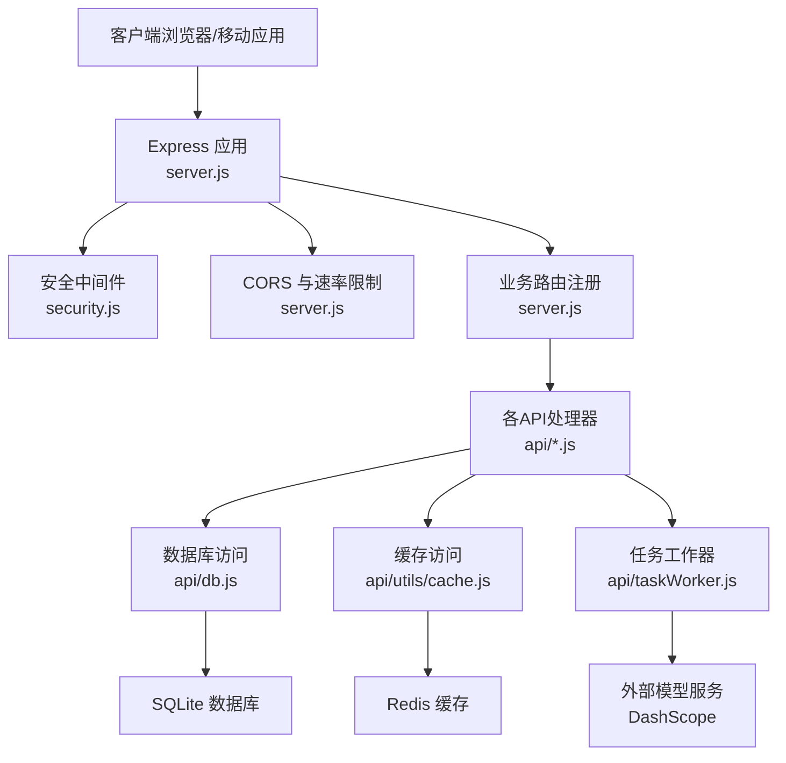
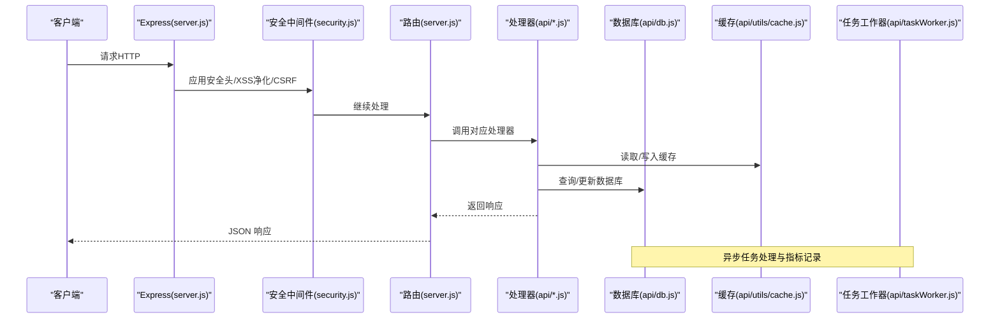
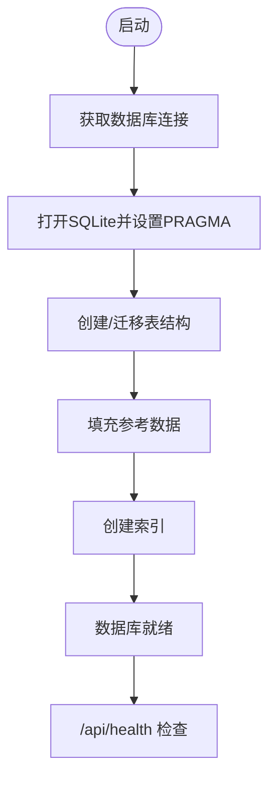
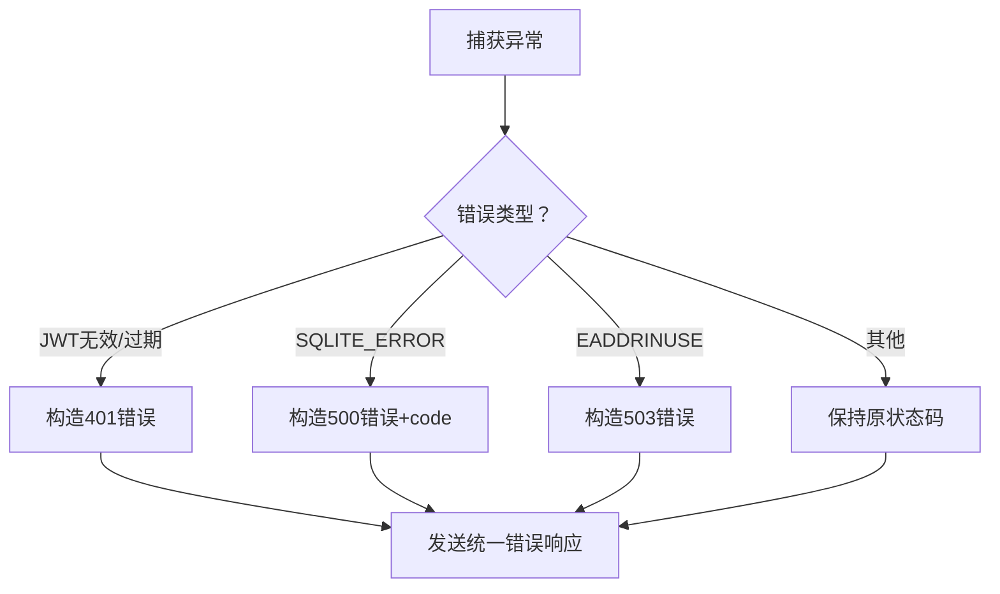
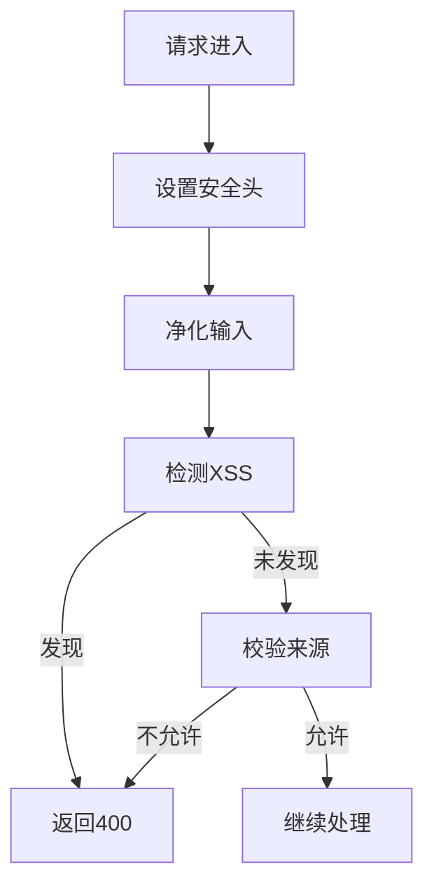
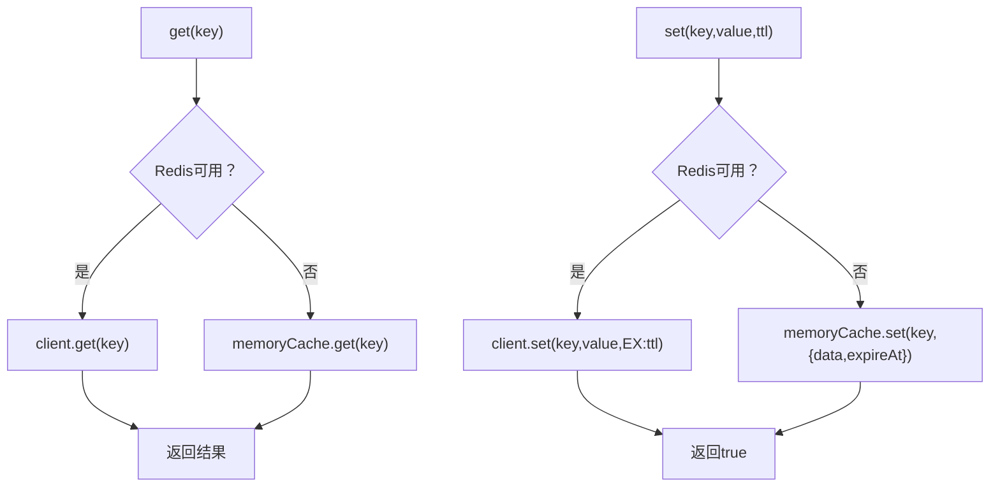
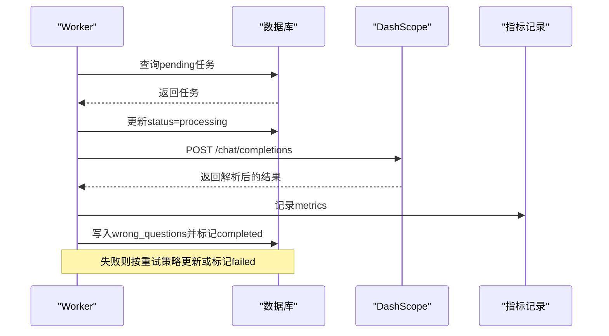
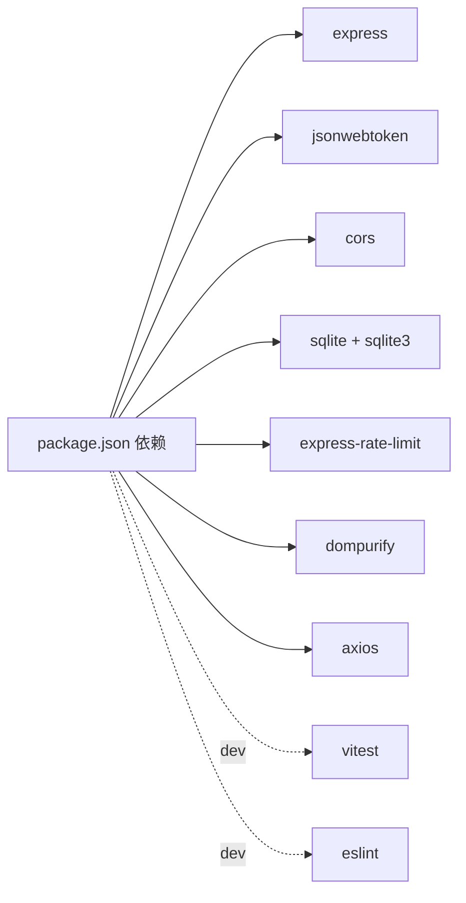

# 故障排除与FAQ

<cite>
**本文引用的文件**
- [package.json](file://package.json)
- [server.js](file://server.js)
- [api/db.js](file://api/db.js)
- [api/middleware/errorHandler.js](file://api/middleware/errorHandler.js)
- [api/middleware/security.js](file://api/middleware/security.js)
- [api/utils/cache.js](file://api/utils/cache.js)
- [api/taskWorker.js](file://api/taskWorker.js)
- [scripts/db-migrate.js](file://scripts/db-migrate.js)
- [tests/api/auth.test.js](file://tests/api/auth.test.js)
- [tests/api/db-and-json.test.js](file://tests/api/db-and-json.test.js)
- [api/auth.js](file://api/auth.js)
- [api/utils/response.js](file://api/utils/response.js)
- [api/questions.js](file://api/questions.js)
</cite>

## 目录
1. [简介](#简介)
2. [项目结构](#项目结构)
3. [核心组件](#核心组件)
4. [架构总览](#架构总览)
5. [详细组件分析](#详细组件分析)
6. [依赖关系分析](#依赖关系分析)
7. [性能考虑](#性能考虑)
8. [故障排除指南](#故障排除指南)
9. [结论](#结论)
10. [附录](#附录)

## 简介
本指南面向AI家教项目的运维与开发人员，聚焦于常见错误代码、错误原因与解决步骤，覆盖数据库连接问题、API调用失败、前端加载错误、性能问题的诊断方法；提供调试工具使用、日志分析技巧与问题定位方法；解释配置错误、依赖冲突与环境问题的解决方案；并包含性能瓶颈分析、内存泄漏检测与并发问题排查建议，以及社区支持渠道、问题反馈流程与升级修复指南。

## 项目结构
后端采用Express框架，路由集中在入口文件中注册，中间件负责安全与限流，数据库通过SQLite封装统一管理，任务队列由独立worker处理异步任务，缓存层优先使用Redis，不可用时回退到内存缓存。

图示来源
- [server.js:141-205](file://server.js#L141-L205)
- [api/middleware/security.js:73-81](file://api/middleware/security.js#L73-L81)
- [api/db.js:15-365](file://api/db.js#L15-L365)
- [api/utils/cache.js:11-42](file://api/utils/cache.js#L11-L42)
- [api/taskWorker.js:44-171](file://api/taskWorker.js#L44-L171)

章节来源
- [server.js:1-221](file://server.js#L1-L221)

## 核心组件
- 入口与路由：集中注册所有API端点、静态资源与健康检查，统一错误处理与安全头设置。
- 数据库模块：统一打开数据库、初始化表结构与索引、迁移脚本与参考数据填充。
- 错误处理中间件：对JWT、数据库、端口占用等错误进行分类处理与标准化响应。
- 安全中间件：XSS净化、XSS检测、CSP相关安全头、CSRF来源校验。
- 缓存模块：Redis优先，异常回退内存缓存；提供键值读写与清理。
- 任务工作器：从队列表拉取任务、调用外部模型、记录指标、重试与失败处理。
- 认证与响应：JWT密钥校验、认证中间件、统一响应格式校验。

章节来源
- [server.js:141-205](file://server.js#L141-L205)
- [api/db.js:15-365](file://api/db.js#L15-L365)
- [api/middleware/errorHandler.js:13-72](file://api/middleware/errorHandler.js#L13-L72)
- [api/middleware/security.js:23-113](file://api/middleware/security.js#L23-L113)
- [api/utils/cache.js:11-137](file://api/utils/cache.js#L11-L137)
- [api/taskWorker.js:44-171](file://api/taskWorker.js#L44-L171)
- [api/auth.js:12-46](file://api/auth.js#L12-L46)
- [api/utils/response.js:50-68](file://api/utils/response.js#L50-L68)

## 架构总览
系统采用“入口路由 -> 中间件 -> 业务处理器 -> 数据库/缓存/外部服务”的分层设计。安全中间件贯穿请求生命周期，错误处理中间件统一兜底。任务工作器独立运行，避免阻塞主请求线程。

图示来源
- [server.js:48-75](file://server.js#L48-L75)
- [api/middleware/security.js:73-113](file://api/middleware/security.js#L73-L113)
- [api/utils/cache.js:44-81](file://api/utils/cache.js#L44-L81)
- [api/db.js:474-477](file://api/db.js#L474-L477)
- [api/taskWorker.js:179-183](file://api/taskWorker.js#L179-L183)

## 详细组件分析

### 数据库连接与迁移
- 初始化流程：首次访问时打开数据库、启用WAL、设置busy_timeout与外键约束，并创建/迁移表与索引。
- 参考数据：自动注入学科、题型、考试层级、年级等基础字典。
- 结构演进：迁移脚本按版本顺序执行，记录已应用版本，支持事务回滚与统计输出。
- 健康检查：/api/health端点验证数据库可用性。

图示来源
- [api/db.js:15-365](file://api/db.js#L15-L365)
- [scripts/db-migrate.js:525-579](file://scripts/db-migrate.js#L525-L579)
- [server.js:126-136](file://server.js#L126-L136)

章节来源
- [api/db.js:15-365](file://api/db.js#L15-L365)
- [scripts/db-migrate.js:525-579](file://scripts/db-migrate.js#L525-L579)
- [server.js:126-136](file://server.js#L126-L136)

### 错误处理与统一响应
- 错误分类：JWT错误、数据库错误、端口占用等，分别映射到标准状态码与消息。
- 开发模式：可返回堆栈信息便于调试。
- 响应格式：统一success/message/status/data/pagination字段，便于前端解析。

图示来源
- [api/middleware/errorHandler.js:13-72](file://api/middleware/errorHandler.js#L13-L72)
- [api/utils/response.js:50-68](file://api/utils/response.js#L50-L68)

章节来源
- [api/middleware/errorHandler.js:13-72](file://api/middleware/errorHandler.js#L13-L72)
- [api/utils/response.js:50-68](file://api/utils/response.js#L50-L68)

### 安全中间件与CSRF/XSS防护
- 安全头：X-Content-Type-Options、X-Frame-Options、X-XSS-Protection、Referrer-Policy、Permissions-Policy等。
- 输入净化：DOMPurify移除标签，递归净化请求体/查询参数/路径参数。
- XSS检测：正则匹配常见XSS模式，命中即返回400。
- CSRF保护：仅对非GET/HEAD/OPTIONS方法校验来源，白名单来自ALLOWED_ORIGINS环境变量。

图示来源
- [api/middleware/security.js:23-113](file://api/middleware/security.js#L23-L113)

章节来源
- [api/middleware/security.js:23-113](file://api/middleware/security.js#L23-L113)

### 缓存模块（Redis/内存）
- 连接策略：优先使用REDIS_URL连接Redis，失败回退内存缓存并告警。
- 接口：get/set/del/clear/带TTL的缓存包装器。
- TTL策略：默认/短/长三档，便于热点与冷数据区分。

图示来源
- [api/utils/cache.js:11-137](file://api/utils/cache.js#L11-L137)

章节来源
- [api/utils/cache.js:11-137](file://api/utils/cache.js#L11-L137)

### 任务工作器（异步任务与外部模型）
- 任务恢复：超时未完成的任务标记为pending，避免僵尸任务。
- 重试机制：最多3次，延迟递增；失败记录错误与重试次数。
- 指标采集：耗时、模型、prompt版本、质量评分、token用量等。
- 外部调用：DashScope Chat Completions，需配置DASHSCOPE_API_KEY。

图示来源
- [api/taskWorker.js:44-171](file://api/taskWorker.js#L44-L171)

章节来源
- [api/taskWorker.js:44-171](file://api/taskWorker.js#L44-L171)

### 认证与响应格式
- JWT密钥校验：未设置或默认值直接退出；长度不足给出警告。
- 认证中间件：Bearer Token校验，过期与无效分别返回401。
- 响应格式校验：确保success字段存在且符合规范，便于前端统一处理。

章节来源
- [api/auth.js:12-46](file://api/auth.js#L12-L46)
- [tests/api/auth.test.js:13-58](file://tests/api/auth.test.js#L13-L58)
- [api/utils/response.js:50-68](file://api/utils/response.js#L50-L68)
- [tests/api/db-and-json.test.js:32-44](file://tests/api/db-and-json.test.js#L32-L44)

## 依赖关系分析
- 启动依赖：dotenv用于环境变量；express提供路由与中间件；rate-limit实现限流；sqlite/sqlite3提供数据库访问。
- 运行时依赖：jsonwebtoken用于JWT；cors允许跨域；dompurify用于XSS净化；axios用于代理转发（部分API）。
- 测试依赖：vitest用于单元测试；ESLint/Prettier保证代码质量。

图示来源
- [package.json:17-41](file://package.json#L17-L41)

章节来源
- [package.json:17-41](file://package.json#L17-L41)

## 性能考虑
- 数据库优化
  - WAL模式与busy_timeout提升并发写入稳定性。
  - 大量复合索引加速查询，如省市区/年份/学科组合索引。
  - 迁移脚本统一维护索引，避免遗漏。
- 缓存策略
  - Redis优先，失败回退内存缓存，减少数据库压力。
  - TTL策略区分热点与冷数据，降低过期抖动。
- 任务处理
  - 任务轮询间隔可调，避免CPU空转。
  - 质量评分与token用量记录，指导模型与prompt优化。
- 前端静态资源
  - /src目录设置no-cache避免缓存问题，开发阶段更易调试。

章节来源
- [api/db.js:23-25](file://api/db.js#L23-L25)
- [api/db.js:308-361](file://api/db.js#L308-L361)
- [api/utils/cache.js:11-42](file://api/utils/cache.js#L11-L42)
- [api/taskWorker.js:179-183](file://api/taskWorker.js#L179-L183)
- [server.js:106-112](file://server.js#L106-L112)

## 故障排除指南

### 一、数据库连接问题
- 症状
  - 启动时报数据库无法打开或表不存在。
  - /api/health返回dbReady=false。
- 常见原因
  - 数据库文件路径不正确或权限不足。
  - 初次启动未执行迁移或迁移中断。
  - PRAGMA设置失败（WAL/foreign_keys）。
- 解决步骤
  - 确认数据库路径与权限，确保example_db.sqlite存在。
  - 手动运行迁移脚本，观察“已应用/待应用”统计与逐条执行日志。
  - 检查PRAGMA设置是否生效，必要时重启服务。
  - 如需重建，删除数据库文件后重启，系统会自动重建并填充参考数据。
- 相关文件
  - [api/db.js:15-365](file://api/db.js#L15-L365)
  - [scripts/db-migrate.js:525-579](file://scripts/db-migrate.js#L525-L579)
  - [server.js:126-136](file://server.js#L126-L136)

章节来源
- [api/db.js:15-365](file://api/db.js#L15-L365)
- [scripts/db-migrate.js:525-579](file://scripts/db-migrate.js#L525-L579)
- [server.js:126-136](file://server.js#L126-L136)

### 二、API调用失败
- 症状
  - 返回统一错误响应，包含message/status/success。
  - 特定端点返回404（端点不存在）。
- 常见原因
  - JWT无效/过期导致401。
  - 数据库错误映射为500。
  - 端口被占用映射为503。
  - 请求体过大触发413。
- 解决步骤
  - 校验JWT_SECRET配置与强度，确保非默认值且≥32字符。
  - 查看错误响应details字段，结合后端日志定位具体SQL或外部服务错误。
  - 若端口占用，修改PORT或停止占用进程。
  - 对POST请求控制数据大小，避免超过1MB。
- 相关文件
  - [api/middleware/errorHandler.js:13-72](file://api/middleware/errorHandler.js#L13-L72)
  - [api/auth.js:12-46](file://api/auth.js#L12-L46)
  - [api/questions.js:82-84](file://api/questions.js#L82-L84)
  - [server.js:201-203](file://server.js#L201-L203)

章节来源
- [api/middleware/errorHandler.js:13-72](file://api/middleware/errorHandler.js#L13-L72)
- [api/auth.js:12-46](file://api/auth.js#L12-L46)
- [api/questions.js:82-84](file://api/questions.js#L82-L84)
- [server.js:201-203](file://server.js#L201-L203)

### 三、前端加载错误
- 症状
  - /index.html或移动端页面无法加载。
  - /src目录JS资源被缓存导致更新不生效。
- 常见原因
  - 静态资源目录未正确挂载或权限不足。
  - /src目录设置了no-cache但CDN仍缓存。
- 解决步骤
  - 确认/public与/frontend静态目录挂载正常。
  - /src目录设置no-cache，开发阶段建议禁用CDN或强制刷新。
  - 检查CORS与ALLOWED_ORIGINS配置，确保前端域名可访问。
- 相关文件
  - [server.js:101-113](file://server.js#L101-L113)
  - [api/middleware/security.js:83-87](file://api/middleware/security.js#L83-L87)

章节来源
- [server.js:101-113](file://server.js#L101-L113)
- [api/middleware/security.js:83-87](file://api/middleware/security.js#L83-L87)

### 四、性能问题
- 症状
  - 接口响应慢、数据库锁等待、任务积压。
- 常见原因
  - 缺少索引或索引失效。
  - 缓存未命中导致数据库压力大。
  - 任务轮询间隔过小造成CPU压力。
- 解决步骤
  - 使用迁移脚本确认索引已创建，关注统计输出。
  - 检查Redis连通性，确保缓存命中率。
  - 调整任务轮询间隔，观察任务统计与指标。
- 相关文件
  - [api/db.js:308-361](file://api/db.js#L308-L361)
  - [api/utils/cache.js:11-42](file://api/utils/cache.js#L11-L42)
  - [api/taskWorker.js:179-183](file://api/taskWorker.js#L179-L183)

章节来源
- [api/db.js:308-361](file://api/db.js#L308-L361)
- [api/utils/cache.js:11-42](file://api/utils/cache.js#L11-L42)
- [api/taskWorker.js:179-183](file://api/taskWorker.js#L179-L183)

### 五、调试工具与日志分析
- 日志位置
  - 启动日志：数据库连接成功、Redis连接成功、任务工作器启动。
  - 错误日志：错误处理中间件统一输出，开发模式可显示stack。
  - 任务日志：任务开始/完成/失败/重试/回收等关键事件。
- 调试建议
  - 在开发环境开启NODE_ENV，查看详细堆栈。
  - 使用/health端点快速判断数据库可用性。
  - 关注任务统计与指标，定位外部模型调用异常。
- 相关文件
  - [api/middleware/errorHandler.js:67-69](file://api/middleware/errorHandler.js#L67-L69)
  - [server.js:126-136](file://server.js#L126-L136)
  - [api/taskWorker.js:115-124](file://api/taskWorker.js#L115-L124)

章节来源
- [api/middleware/errorHandler.js:67-69](file://api/middleware/errorHandler.js#L67-L69)
- [server.js:126-136](file://server.js#L126-L136)
- [api/taskWorker.js:115-124](file://api/taskWorker.js#L115-L124)

### 六、配置错误与环境问题
- JWT_SECRET
  - 必须设置且非默认值；建议≥32字符。
  - 测试用例覆盖了默认值与长度不足场景。
- ALLOWED_ORIGINS
  - CSRF来源白名单，未设置时默认允许本地地址。
- REDIS_URL
  - Redis不可用时自动回退内存缓存，但会打印警告。
- DASHSCOPE_API_KEY
  - 任务工作器必需，未配置会导致任务失败。
- 相关文件
  - [api/auth.js:12-27](file://api/auth.js#L12-L27)
  - [tests/api/auth.test.js:13-58](file://tests/api/auth.test.js#L13-L58)
  - [api/middleware/security.js:83-87](file://api/middleware/security.js#L83-L87)
  - [api/utils/cache.js:17-41](file://api/utils/cache.js#L17-L41)
  - [api/taskWorker.js:65-68](file://api/taskWorker.js#L65-L68)

章节来源
- [api/auth.js:12-27](file://api/auth.js#L12-L27)
- [tests/api/auth.test.js:13-58](file://tests/api/auth.test.js#L13-L58)
- [api/middleware/security.js:83-87](file://api/middleware/security.js#L83-L87)
- [api/utils/cache.js:17-41](file://api/utils/cache.js#L17-L41)
- [api/taskWorker.js:65-68](file://api/taskWorker.js#L65-L68)

### 七、依赖冲突与版本问题
- SQLite驱动
  - 同时引入sqlite与sqlite3，确保版本兼容。
- Node运行时
  - 若出现底层运行时相关报错，检查Node版本与系统依赖。
- 建议
  - 使用package-lock锁定版本，避免意外升级。
  - CI中运行测试与覆盖率，提前发现兼容性问题。

章节来源
- [package.json:17-41](file://package.json#L17-L41)

### 八、并发与内存问题排查
- 并发写入
  - WAL模式与busy_timeout有助于缓解写入竞争。
- 内存缓存
  - Redis不可用时使用内存缓存，注意容量与过期策略。
- 任务并发
  - 任务处理有互斥标志，避免重复处理；超时任务自动恢复。
- 相关文件
  - [api/db.js:23-25](file://api/db.js#L23-L25)
  - [api/utils/cache.js:11-42](file://api/utils/cache.js#L11-L42)
  - [api/taskWorker.js:11-28](file://api/taskWorker.js#L11-L28)

章节来源
- [api/db.js:23-25](file://api/db.js#L23-L25)
- [api/utils/cache.js:11-42](file://api/utils/cache.js#L11-L42)
- [api/taskWorker.js:11-28](file://api/taskWorker.js#L11-L28)

### 九、社区支持与问题反馈
- 提交问题前建议
  - 提供环境信息（Node版本、操作系统）、依赖版本、最小复现步骤。
  - 附上/health输出、关键错误响应与相关日志片段。
- 反馈渠道
  - 通过仓库Issue模板提交，包含“错误描述、期望行为、复现步骤、日志与截图”。

## 结论
本指南围绕数据库、API、前端、性能与配置五大维度提供了系统化的故障排除方法。通过统一的错误处理、安全中间件与缓存策略，配合任务工作器与迁移脚本，可有效提升系统的稳定性与可观测性。建议在生产环境中严格配置JWT与Redis、启用索引与WAL、监控任务指标与数据库负载，并建立完善的CI与日志体系。

## 附录

### 常见错误代码与含义对照
- 400：请求包含不安全内容（XSS检测命中）或请求体过大。
- 401：认证失败/登录过期。
- 403：请求来源不在白名单。
- 404：API端点不存在。
- 413：POST数据超过1MB限制。
- 500：数据库操作失败或其他内部错误。
- 503：端口被占用。

章节来源
- [api/middleware/security.js:67-70](file://api/middleware/security.js#L67-L70)
- [api/questions.js:82-84](file://api/questions.js#L82-L84)
- [api/middleware/errorHandler.js:28-54](file://api/middleware/errorHandler.js#L28-L54)
- [server.js:201-203](file://server.js#L201-L203)