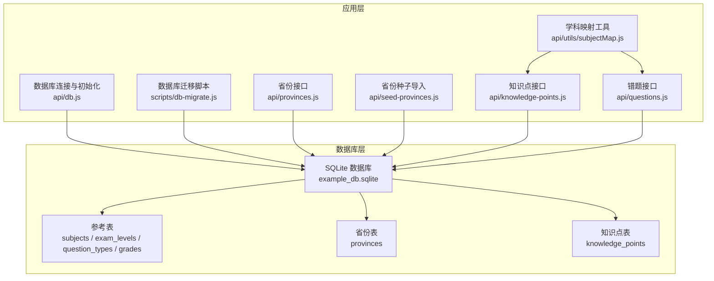
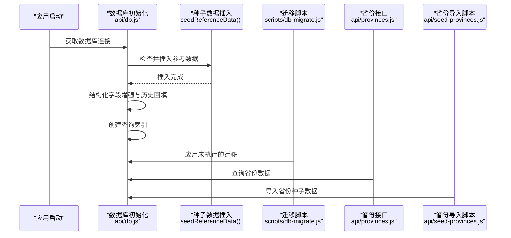
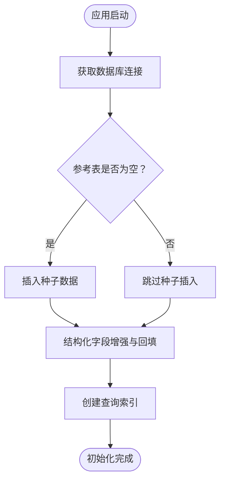
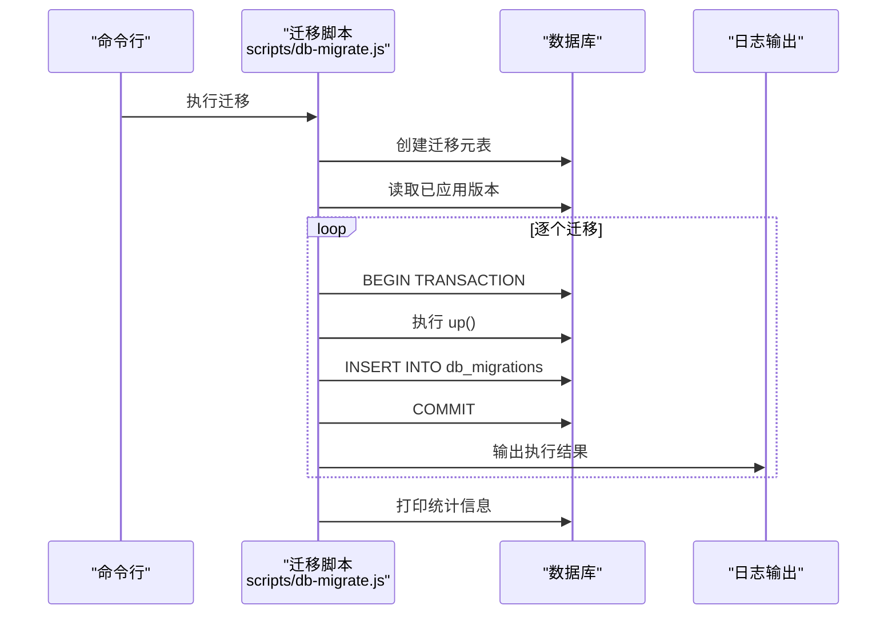
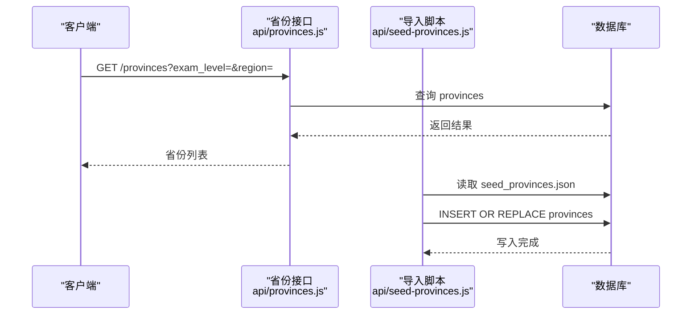
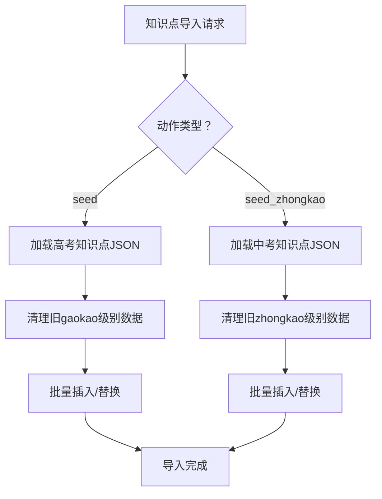
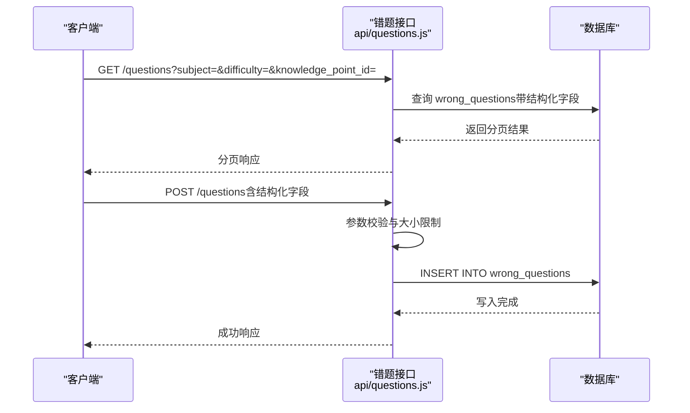
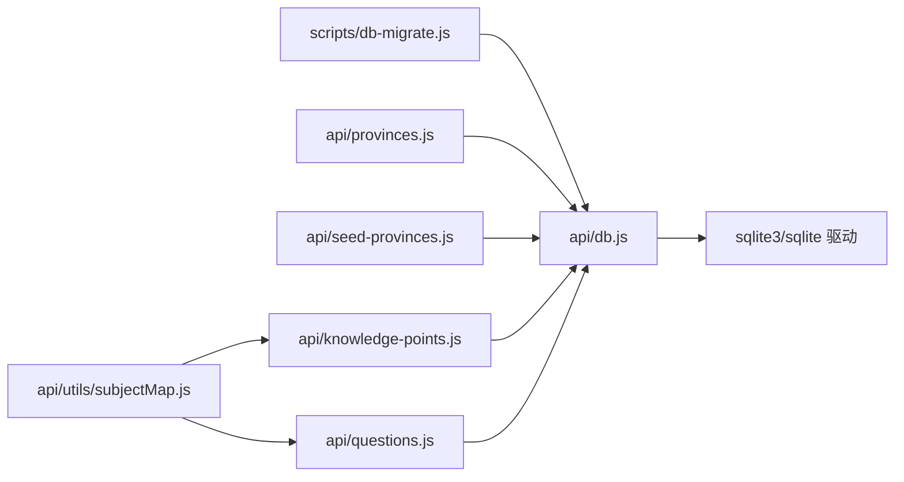

# 参考数据管理

<cite>
**本文引用的文件**
- [api/db.js](file://api/db.js)
- [scripts/db-migrate.js](file://scripts/db-migrate.js)
- [api/provinces.js](file://api/provinces.js)
- [api/seed-provinces.js](file://api/seed-provinces.js)
- [database/seed_provinces.json](file://database/seed_provinces.json)
- [api/knowledge-points.js](file://api/knowledge-points.js)
- [api/questions.js](file://api/questions.js)
- [api/utils/subjectMap.js](file://api/utils/subjectMap.js)
</cite>

## 目录
1. [简介](#简介)
2. [项目结构](#项目结构)
3. [核心组件](#核心组件)
4. [架构总览](#架构总览)
5. [详细组件分析](#详细组件分析)
6. [依赖分析](#依赖分析)
7. [性能考虑](#性能考虑)
8. [故障排查指南](#故障排查指南)
9. [结论](#结论)
10. [附录](#附录)

## 简介
本文件面向“AI家教”项目的参考数据管理，系统性阐述静态参考数据（学科信息、考试级别、题目类型、年级设置、省份信息、知识点等）的设计与管理策略，覆盖初始化流程、种子数据管理、数据同步机制、版本控制与变更管理、向后兼容性处理、增删改查操作规范、数据验证规则与业务约束，以及备份恢复与一致性保障机制。目标是帮助开发者与运维人员在不深入源码的情况下，快速理解并正确维护参考数据。

## 项目结构
参考数据相关的核心位置与职责如下：
- 数据库与初始化：通过统一的数据库连接模块创建核心参考表，并在首次启动时执行种子数据插入与结构增强。
- 迁移脚本：提供版本化的数据库迁移，确保表结构演进、索引完善、数据回填与一致性约束逐步落地。
- 省份数据：提供省份查询接口与专用的种子导入脚本，支持按考试类型与地区筛选。
- 知识点数据：提供知识点的种子导入接口，支持高考与中考两类知识点的批量导入与替换。
- 题目与错题：在错题记录中引入结构化字段，便于按学科、知识点、难度等维度高效查询。
- 关键映射：提供学科名称与编码的双向映射，支撑弱项识别与关键词匹配。

图表来源
- [api/db.js:15-365](file://api/db.js#L15-L365)
- [scripts/db-migrate.js:525-579](file://scripts/db-migrate.js#L525-L579)
- [api/provinces.js:4-40](file://api/provinces.js#L4-L40)
- [api/seed-provinces.js:9-33](file://api/seed-provinces.js#L9-L33)
- [api/knowledge-points.js:44-95](file://api/knowledge-points.js#L44-L95)
- [api/questions.js:16-74](file://api/questions.js#L16-L74)
- [api/utils/subjectMap.js:1-378](file://api/utils/subjectMap.js#L1-L378)

章节来源
- [api/db.js:15-365](file://api/db.js#L15-L365)
- [scripts/db-migrate.js:525-579](file://scripts/db-migrate.js#L525-L579)

## 核心组件
- 参考表定义与初始化
  - 学科信息：subjects（唯一编码、名称、分类、排序、状态）
  - 考试级别：exam_levels（唯一编码、名称、排序、状态）
  - 题目类型：question_types（唯一编码、名称、分类、是否含选项、排序、状态）
  - 年级设置：grades（唯一编码、名称、级别、排序、状态）
  - 省份信息：provinces（唯一编码、名称、考试类型、试卷类型、区域）
  - 知识点：knowledge_points（主键ID、学科、名称、子主题、难度、频率、描述、级别）
- 结构化字段增强
  - 在错题与报告表中增加结构化字段（学科编码、知识点ID、难度、题号、会话ID等），并进行历史数据回填。
  - 在题目表中增加学科、省份、年份等去规范化字段，提升查询效率。
- 索引与约束
  - 为高频查询字段建立复合索引，确保查询性能。
  - 引入外键约束与清理重复数据，保证数据一致性。

章节来源
- [api/db.js:39-157](file://api/db.js#L39-L157)
- [api/db.js:367-415](file://api/db.js#L367-L415)
- [api/db.js:417-481](file://api/db.js#L417-L481)
- [scripts/db-migrate.js:9-523](file://scripts/db-migrate.js#L9-L523)

## 架构总览
参考数据的生命周期由“初始化—迁移—查询—导入—校验—备份”构成，整体流程如下：

图表来源
- [api/db.js:15-365](file://api/db.js#L15-L365)
- [scripts/db-migrate.js:525-579](file://scripts/db-migrate.js#L525-L579)
- [api/provinces.js:4-40](file://api/provinces.js#L4-L40)
- [api/seed-provinces.js:9-33](file://api/seed-provinces.js#L9-L33)

## 详细组件分析

### 组件A：数据库初始化与参考数据种子
- 初始化流程
  - 首次连接时自动创建核心参考表与业务表。
  - 若参考表为空，则执行种子数据插入（学科、考试级别、题目类型、年级）。
  - 对历史表结构进行增强（新增字段、回填数据、去规范化字段）。
  - 创建大量复合索引，优化查询性能。
- 种子数据策略
  - 采用“插入忽略”策略，避免重复初始化导致的数据冲突。
  - 通过结构化字段与索引，确保后续查询与统计高效稳定。
- 向后兼容性
  - 通过结构化字段增强与历史回填，兼容旧版数据格式。
  - 迁移脚本按版本顺序执行，保证每次变更可追踪、可回滚。

图表来源
- [api/db.js:15-365](file://api/db.js#L15-L365)
- [api/db.js:367-415](file://api/db.js#L367-L415)
- [api/db.js:417-481](file://api/db.js#L417-L481)

章节来源
- [api/db.js:15-365](file://api/db.js#L15-L365)
- [api/db.js:367-415](file://api/db.js#L367-L415)
- [api/db.js:417-481](file://api/db.js#L417-L481)

### 组件B：数据库迁移与版本控制
- 版本化迁移
  - 以版本号为单位的迁移清单，涵盖参考表创建、结构增强、索引完善、数据清洗与外键约束。
  - 每次迁移在事务中执行，失败自动回滚，保证原子性。
- 变更管理
  - 记录已应用迁移版本，避免重复执行。
  - 提供统计输出，展示各表行数与索引数量，辅助运维监控。
- 向后兼容性
  - 通过历史数据回填与去规范化字段，兼容旧数据结构。
  - 清洗重复记录与外键约束清理，确保数据一致性。

图表来源
- [scripts/db-migrate.js:525-579](file://scripts/db-migrate.js#L525-L579)
- [scripts/db-migrate.js:9-523](file://scripts/db-migrate.js#L9-L523)

章节来源
- [scripts/db-migrate.js:9-523](file://scripts/db-migrate.js#L9-L523)
- [scripts/db-migrate.js:525-579](file://scripts/db-migrate.js#L525-L579)

### 组件C：省份数据管理（查询与导入）
- 查询接口
  - 支持按考试类型与地区过滤，返回省份列表及统计信息（如近X年的试卷数量、科目数量等）。
- 种子导入
  - 从JSON文件读取省份数据，使用“插入或替换”策略，确保数据幂等更新。
- 数据一致性
  - 导入前后的数据校验与错误处理，保证异常场景下的稳定性。

图表来源
- [api/provinces.js:4-40](file://api/provinces.js#L4-L40)
- [api/seed-provinces.js:9-33](file://api/seed-provinces.js#L9-L33)
- [database/seed_provinces.json:1-187](file://database/seed_provinces.json#L1-L187)

章节来源
- [api/provinces.js:4-40](file://api/provinces.js#L4-L40)
- [api/provinces.js:86-166](file://api/provinces.js#L86-L166)
- [api/seed-provinces.js:9-33](file://api/seed-provinces.js#L9-L33)
- [database/seed_provinces.json:1-187](file://database/seed_provinces.json#L1-L187)

### 组件D：知识点数据管理（种子导入与弱项识别）
- 种子导入
  - 提供高考与中考两类知识点的批量导入接口，支持“替换式”写入，确保数据一致性。
  - 导入前清理旧数据，避免级别混杂。
- 弱项识别
  - 基于关键词映射与错题数据，计算知识点的薄弱指数，辅助个性化学习路径生成。
- 数据验证
  - 对输入参数进行校验，防止非法数据进入数据库。

图表来源
- [api/knowledge-points.js:44-95](file://api/knowledge-points.js#L44-L95)

章节来源
- [api/knowledge-points.js:44-95](file://api/knowledge-points.js#L44-L95)
- [api/knowledge-points.js:97-146](file://api/knowledge-points.js#L97-L146)
- [api/utils/subjectMap.js:249-378](file://api/utils/subjectMap.js#L249-L378)

### 组件E：错题与结构化字段（查询与验证）
- 结构化字段
  - 错题表新增学科编码、知识点ID、难度、题号、会话ID等字段，并进行历史数据回填。
  - 报表表新增学科编码、分数、难度、知识点ID等字段，便于统计分析。
- 查询与验证
  - 接口支持按学科、难度、知识点等条件查询，同时对请求参数进行合法性校验。
  - 对单条记录大小进行限制，防止超大数据写入。

图表来源
- [api/questions.js:16-74](file://api/questions.js#L16-L74)
- [api/questions.js:76-135](file://api/questions.js#L76-L135)
- [api/db.js:417-481](file://api/db.js#L417-L481)

章节来源
- [api/questions.js:16-74](file://api/questions.js#L16-L74)
- [api/questions.js:76-135](file://api/questions.js#L76-L135)
- [api/db.js:417-481](file://api/db.js#L417-L481)

## 依赖分析
- 组件耦合
  - 数据库连接模块被所有业务接口依赖，承担初始化、种子插入、结构化增强与索引创建职责。
  - 迁移脚本独立运行，但与数据库连接模块共享迁移元表与版本控制逻辑。
  - 省份与知识点接口分别依赖各自的种子数据文件与数据库连接模块。
- 外部依赖
  - SQLite3与sqlite驱动用于数据库访问与事务控制。
  - JSON文件作为种子数据源，导入脚本负责解析与入库。

图表来源
- [api/db.js:15-365](file://api/db.js#L15-L365)
- [scripts/db-migrate.js:525-579](file://scripts/db-migrate.js#L525-L579)
- [api/provinces.js:4-40](file://api/provinces.js#L4-L40)
- [api/seed-provinces.js:9-33](file://api/seed-provinces.js#L9-L33)
- [api/knowledge-points.js:44-95](file://api/knowledge-points.js#L44-L95)
- [api/questions.js:16-74](file://api/questions.js#L16-L74)
- [api/utils/subjectMap.js:1-378](file://api/utils/subjectMap.js#L1-L378)

章节来源
- [api/db.js:15-365](file://api/db.js#L15-L365)
- [scripts/db-migrate.js:525-579](file://scripts/db-migrate.js#L525-L579)

## 性能考虑
- 索引优化
  - 为省份、题目、报表、错题、练习记录等高频查询字段建立复合索引，显著降低查询延迟。
- 去规范化字段
  - 在题目表中加入学科、省份、年份等字段，减少关联查询成本。
- 事务与并发
  - 迁移与导入均在事务中执行，失败回滚；SQLite WAL模式提升并发读写性能。
- 数据规模控制
  - 对单条记录大小进行限制，避免超大数据影响写入性能与存储空间。

章节来源
- [api/db.js:308-361](file://api/db.js#L308-L361)
- [scripts/db-migrate.js:418-477](file://scripts/db-migrate.js#L418-L477)
- [api/db.js:417-481](file://api/db.js#L417-L481)

## 故障排查指南
- 初始化失败
  - 检查数据库文件路径与权限，确认驱动可用。
  - 查看初始化日志，定位参考表创建或种子插入阶段的错误。
- 迁移失败
  - 查看迁移元表记录，确认失败版本与错误信息。
  - 优先修复失败迁移中的SQL语法或数据约束问题，再重新执行。
- 导入异常
  - 省份导入：检查JSON文件格式与字段完整性，确认编码唯一性。
  - 知识点导入：确认级别字段与JSON结构，避免跨级别数据混入。
- 查询性能问题
  - 确认相关索引是否存在，必要时重建索引。
  - 使用EXPLAIN QUERY PLAN分析慢查询，调整WHERE条件与排序字段。

章节来源
- [api/db.js:15-365](file://api/db.js#L15-L365)
- [scripts/db-migrate.js:525-579](file://scripts/db-migrate.js#L525-L579)
- [api/seed-provinces.js:29-32](file://api/seed-provinces.js#L29-L32)
- [api/knowledge-points.js:63-66](file://api/knowledge-points.js#L63-L66)

## 结论
本项目通过“初始化种子—迁移演进—结构化增强—索引优化”的策略，建立了稳定可靠的参考数据管理体系。版本化迁移与事务控制确保了变更的可控性与可追溯性；结构化字段与索引提升了查询性能；完善的导入与校验机制保障了数据质量。建议在日常运维中定期执行迁移、监控索引与统计信息，并对种子数据进行版本化管理与备份，以维持系统的长期稳定性与可维护性。

## 附录

### 参考数据表结构与字段说明
- 学科信息（subjects）
  - 字段：code（唯一）、name（唯一）、category、sort_order、is_active、created_at
- 考试级别（exam_levels）
  - 字段：code（唯一）、name、sort_order、is_active、created_at
- 题目类型（question_types）
  - 字段：code（唯一）、name、category、has_options、sort_order、is_active、created_at
- 年级设置（grades）
  - 字段：code（唯一）、name、level、sort_order、is_active、created_at
- 省份信息（provinces）
  - 字段：code（唯一）、name、exam_type、paper_type、region、created_at、updated_at
- 知识点（knowledge_points）
  - 字段：id（PK）、subject、name、subtopics、difficulty、frequency、description、level、updated_at

章节来源
- [api/db.js:39-157](file://api/db.js#L39-L157)

### 操作规范与数据验证规则
- 新增/修改
  - 通过迁移脚本或导入脚本进行，避免直接手工写库。
  - 导入时使用“插入或替换”策略，确保幂等性。
- 删除
  - 不建议直接删除参考数据；如需停用，使用状态字段（is_active）标记。
- 查询
  - 优先使用结构化字段与索引字段进行过滤，避免全表扫描。
- 验证
  - 字段唯一性（code/name）由数据库约束保证。
  - 单条记录大小限制（错题接口对JSON大小进行限制）。

章节来源
- [api/db.js:367-415](file://api/db.js#L367-L415)
- [api/questions.js:89-96](file://api/questions.js#L89-L96)
- [api/seed-provinces.js:18-25](file://api/seed-provinces.js#L18-L25)

### 备份与恢复策略
- 备份
  - 定期备份SQLite数据库文件与迁移元表，保留最近N个版本的快照。
  - 对种子数据JSON文件进行版本化管理，纳入版本控制系统。
- 恢复
  - 通过迁移脚本回滚至指定版本，或重新执行迁移以恢复结构。
  - 使用导入脚本恢复省份与知识点数据，确保级别与编码一致。

章节来源
- [scripts/db-migrate.js:525-579](file://scripts/db-migrate.js#L525-L579)
- [api/seed-provinces.js:9-33](file://api/seed-provinces.js#L9-L33)
- [api/knowledge-points.js:44-95](file://api/knowledge-points.js#L44-L95)