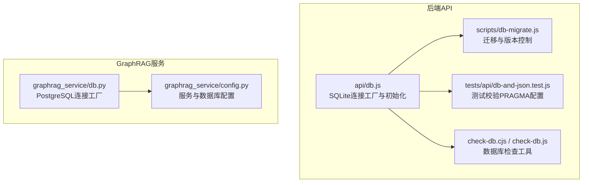
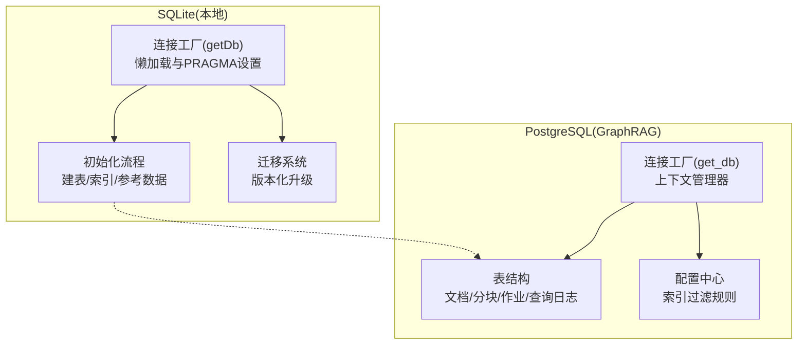
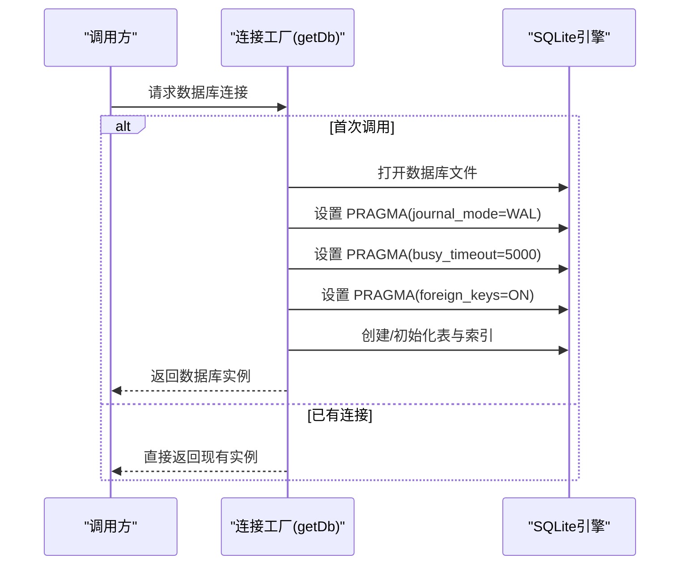
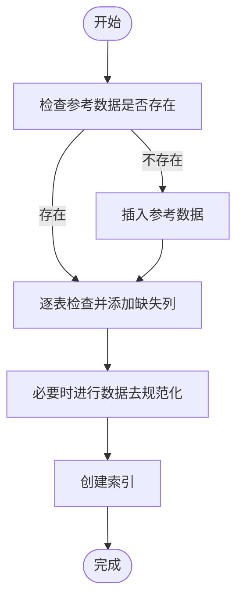
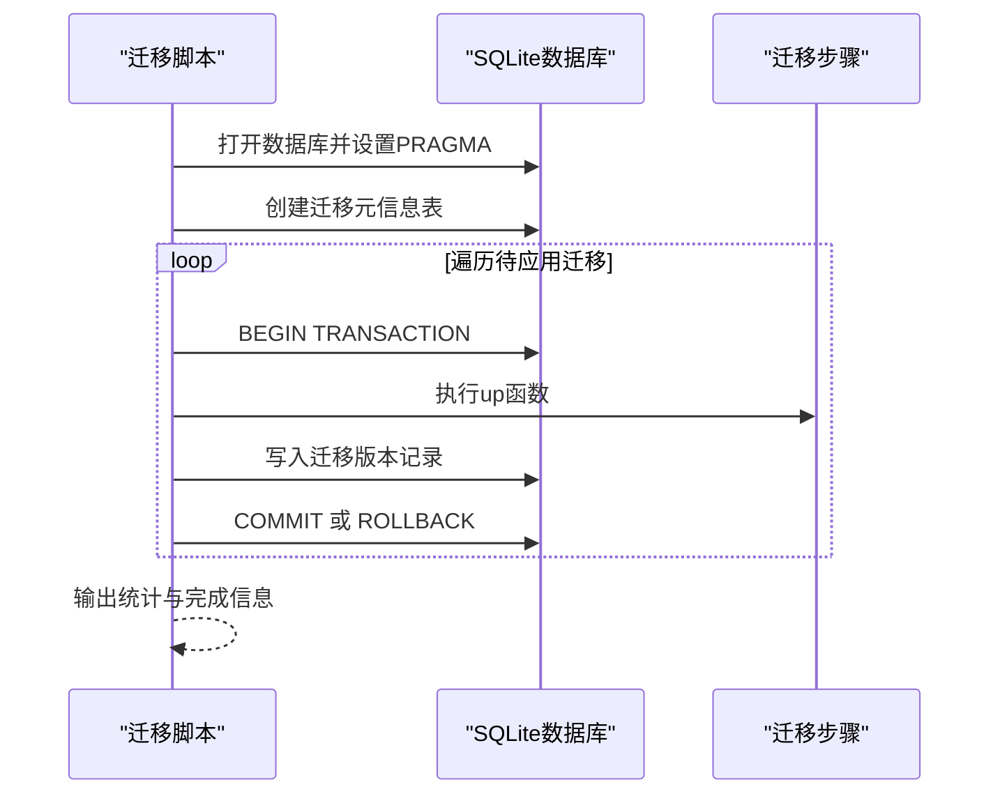
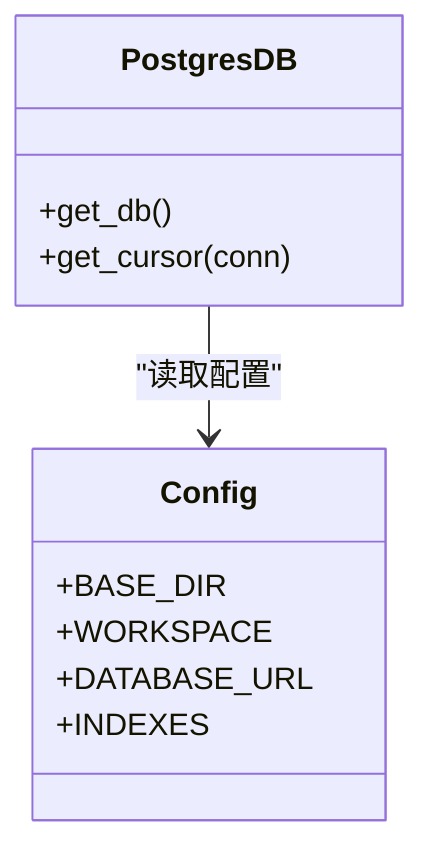
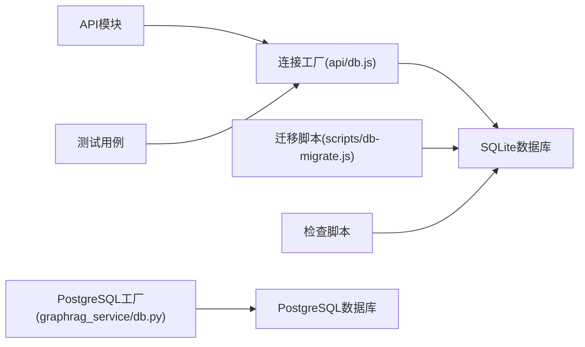

# 数据库架构概览

<cite>
**本文引用的文件**
- [api/db.js](file://api/db.js)
- [scripts/db-migrate.js](file://scripts/db-migrate.js)
- [tests/api/db-and-json.test.js](file://tests/api/db-and-json.test.js)
- [check-db.cjs](file://check-db.cjs)
- [check-db.js](file://check-db.js)
- [graphrag_service/db.py](file://graphrag_service/db.py)
- [graphrag_service/config.py](file://graphrag_service/config.py)
</cite>

## 目录
1. [简介](#简介)
2. [项目结构](#项目结构)
3. [核心组件](#核心组件)
4. [架构总览](#架构总览)
5. [详细组件分析](#详细组件分析)
6. [依赖关系分析](#依赖关系分析)
7. [性能考量](#性能考量)
8. [故障排查指南](#故障排查指南)
9. [结论](#结论)
10. [附录](#附录)

## 简介
本文件面向AI家教项目的数据库架构，聚焦于SQLite数据库的整体设计与实现细节，包括连接配置、初始化流程、PRAGMA参数设置、索引策略、迁移机制与错误处理。同时补充GraphRAG服务使用的PostgreSQL数据库作为对比参考，帮助读者全面理解项目中的多数据库协同工作方式。

## 项目结构
- 前端与后端API位于根目录，数据库相关逻辑主要集中在后端API层与脚本工具中。
- SQLite数据库通过统一的连接工厂模块对外提供服务；迁移脚本独立维护版本化升级。
- GraphRAG服务使用PostgreSQL，采用上下文管理器模式管理连接生命周期。

图表来源
- [api/db.js:1-478](file://api/db.js#L1-L478)
- [scripts/db-migrate.js:1-579](file://scripts/db-migrate.js#L1-L579)
- [tests/api/db-and-json.test.js:1-30](file://tests/api/db-and-json.test.js#L1-L30)
- [check-db.cjs:1-33](file://check-db.cjs#L1-L33)
- [check-db.js:1-33](file://check-db.js#L1-L33)
- [graphrag_service/db.py:1-215](file://graphrag_service/db.py#L1-L215)
- [graphrag_service/config.py:1-59](file://graphrag_service/config.py#L1-L59)

章节来源
- [api/db.js:1-478](file://api/db.js#L1-L478)
- [scripts/db-migrate.js:1-579](file://scripts/db-migrate.js#L1-L579)
- [tests/api/db-and-json.test.js:1-30](file://tests/api/db-and-json.test.js#L1-L30)
- [check-db.cjs:1-33](file://check-db.cjs#L1-L33)
- [check-db.js:1-33](file://check-db.js#L1-L33)
- [graphrag_service/db.py:1-215](file://graphrag_service/db.py#L1-L215)
- [graphrag_service/config.py:1-59](file://graphrag_service/config.py#L1-L59)

## 核心组件
- SQLite连接工厂与懒加载：统一入口提供数据库连接，首次访问时初始化并设置PRAGMA参数，随后复用单例连接。
- 初始化流程：创建业务表、插入参考数据、确保结构化列存在、建立复合索引。
- 迁移系统：版本化迁移脚本，记录已应用版本，支持回滚与幂等执行。
- PRAGMA参数：WAL日志模式、忙等待超时、外键约束，分别提升并发能力、减少锁冲突、保障参照完整性。
- 检查与测试：提供命令行检查工具与单元测试，验证PRAGMA配置与表结构。
- PostgreSQL对比：GraphRAG服务使用上下文管理器模式管理PostgreSQL连接，便于资源回收与事务控制。

章节来源
- [api/db.js:15-365](file://api/db.js#L15-L365)
- [scripts/db-migrate.js:525-579](file://scripts/db-migrate.js#L525-L579)
- [tests/api/db-and-json.test.js:4-14](file://tests/api/db-and-json.test.js#L4-L14)
- [check-db.cjs:1-33](file://check-db.cjs#L1-L33)
- [check-db.js:1-33](file://check-db.js#L1-L33)
- [graphrag_service/db.py:12-23](file://graphrag_service/db.py#L12-L23)

## 架构总览
下图展示SQLite与GraphRAG服务的数据库架构与交互关系：

图表来源
- [api/db.js:15-365](file://api/db.js#L15-L365)
- [scripts/db-migrate.js:525-579](file://scripts/db-migrate.js#L525-L579)
- [graphrag_service/db.py:12-110](file://graphrag_service/db.py#L12-L110)
- [graphrag_service/config.py:23-54](file://graphrag_service/config.py#L23-L54)

## 详细组件分析

### SQLite连接工厂与懒加载
- 单例模式：内部维护一个全局连接实例，首次调用时打开数据库并执行PRAGMA配置，后续调用直接返回该实例。
- 路径配置：数据库文件路径基于当前模块位置拼接，便于在不同部署环境下定位。
- PRAGMA设置：
  - journal_mode=WAL：启用写前日志模式，提高并发读写性能，降低锁竞争。
  - busy_timeout=5000：设置锁等待超时，避免因短暂锁冲突导致立即失败。
  - foreign_keys=ON：开启外键约束，保证参照完整性。
- 初始化与索引：创建业务表、插入参考数据、确保结构化列存在、建立大量复合索引以优化查询性能。

图表来源
- [api/db.js:15-365](file://api/db.js#L15-L365)

章节来源
- [api/db.js:15-365](file://api/db.js#L15-L365)

### 数据库初始化流程
- 参考数据注入：若subjects表为空，则批量插入学科、题型、考试层级、年级等基础数据。
- 结构化列保障：逐表检查并添加缺失列，避免因字段演进导致的兼容性问题。
- 数据去规范化：当发现某些字段为空时，依据关联表进行回填，保持查询效率。
- 索引策略：针对高频查询字段建立单列与复合索引，覆盖省份、年份、科目、难度、用户邮箱等维度。

图表来源
- [api/db.js:367-472](file://api/db.js#L367-L472)

章节来源
- [api/db.js:367-472](file://api/db.js#L367-L472)

### 迁移系统与版本控制
- 版本化迁移：定义一系列迁移步骤，按版本顺序执行，记录已应用版本到db_migrations表。
- 幂等与回滚：每个迁移包裹在事务中，失败时回滚，避免部分更新造成不一致。
- 外键约束清理：在特定版本中清理无效外键引用，确保参照完整性。

图表来源
- [scripts/db-migrate.js:525-579](file://scripts/db-migrate.js#L525-L579)

章节来源
- [scripts/db-migrate.js:9-523](file://scripts/db-migrate.js#L9-L523)
- [scripts/db-migrate.js:525-579](file://scripts/db-migrate.js#L525-L579)

### PRAGMA参数对性能与一致性的影响
- journal_mode=WAL：显著提升并发读写能力，减少写操作阻塞；适合高并发场景。
- busy_timeout=5000：在锁冲突时等待一段时间再重试，降低因短暂锁争用导致的失败率。
- foreign_keys=ON：强制参照完整性，避免悬挂引用，但会增加写入成本；建议在开发/生产环境开启。

章节来源
- [api/db.js:23-25](file://api/db.js#L23-L25)
- [scripts/db-migrate.js:531-533](file://scripts/db-migrate.js#L531-L533)
- [tests/api/db-and-json.test.js:4-14](file://tests/api/db-and-json.test.js#L4-L14)

### 数据库路径配置与连接池管理
- 路径配置：数据库文件路径通过模块路径拼接，便于在不同部署环境中定位。
- 连接池：当前实现为单连接单例，未使用连接池；适用于轻量级应用或单进程场景。
- 并发控制：通过WAL模式与busy_timeout缓解锁冲突；如需更高并发，可考虑引入连接池与事务隔离级别调整。

章节来源
- [api/db.js:8](file://api/db.js#L8)
- [api/db.js:15-365](file://api/db.js#L15-L365)

### 错误处理策略
- 测试校验：单元测试确保PRAGMA配置存在于源码中，防止遗漏。
- 迁移回滚：迁移失败自动回滚，避免半成品变更。
- 查询封装：提供统一查询接口，便于集中处理异常与日志。

章节来源
- [tests/api/db-and-json.test.js:4-14](file://tests/api/db-and-json.test.js#L4-L14)
- [scripts/db-migrate.js:567-571](file://scripts/db-migrate.js#L567-L571)
- [api/db.js:474-477](file://api/db.js#L474-L477)

### GraphRAG服务数据库（PostgreSQL）对比
- 连接工厂：使用上下文管理器模式，确保连接在使用后正确关闭。
- 表结构：包含文档、分块、索引作业、查询日志等表，支撑知识图谱检索。
- 配置中心：索引配置通过字典定义，支持按地区、科目、考试类型筛选文档。

图表来源
- [graphrag_service/db.py:12-23](file://graphrag_service/db.py#L12-L23)
- [graphrag_service/config.py:19-54](file://graphrag_service/config.py#L19-L54)

章节来源
- [graphrag_service/db.py:12-215](file://graphrag_service/db.py#L12-L215)
- [graphrag_service/config.py:19-54](file://graphrag_service/config.py#L19-L54)

## 依赖关系分析
- SQLite侧：所有API模块通过统一的连接工厂获取数据库实例，形成低耦合高内聚的数据访问层。
- 迁移脚本：独立于业务代码，仅依赖SQLite驱动与路径解析，便于离线执行与CI集成。
- 测试与检查：测试用例与检查脚本验证数据库状态，确保配置与结构符合预期。

图表来源
- [api/db.js:15-365](file://api/db.js#L15-L365)
- [scripts/db-migrate.js:525-579](file://scripts/db-migrate.js#L525-L579)
- [tests/api/db-and-json.test.js:4-14](file://tests/api/db-and-json.test.js#L4-L14)
- [check-db.cjs:1-33](file://check-db.cjs#L1-L33)
- [check-db.js:1-33](file://check-db.js#L1-L33)
- [graphrag_service/db.py:12-23](file://graphrag_service/db.py#L12-L23)

章节来源
- [api/db.js:15-365](file://api/db.js#L15-L365)
- [scripts/db-migrate.js:525-579](file://scripts/db-migrate.js#L525-L579)
- [tests/api/db-and-json.test.js:4-14](file://tests/api/db-and-json.test.js#L4-L14)
- [check-db.cjs:1-33](file://check-db.cjs#L1-L33)
- [check-db.js:1-33](file://check-db.js#L1-L33)
- [graphrag_service/db.py:12-23](file://graphrag_service/db.py#L12-L23)

## 性能考量
- WAL模式：提升并发读写吞吐，建议在高并发场景保持开启。
- 索引策略：针对高频查询字段建立复合索引，平衡查询性能与写入开销。
- busy_timeout：根据业务延迟容忍度调整，避免过短导致频繁失败，过长导致响应延迟。
- 外键约束：在保证数据一致性的同时增加写入成本，建议在开发/生产环境开启。
- 连接池：当前为单连接单例，如需更高并发，可引入连接池并配合事务隔离级别调优。

## 故障排查指南
- PRAGMA配置缺失：通过测试用例快速定位是否遗漏关键PRAGMA设置。
- 表结构异常：使用检查脚本列出表与示例行，确认核心表是否存在与数据是否正常。
- 迁移失败：查看迁移日志与回滚记录，确认具体失败步骤并修复后重新执行。
- 连接问题：确认数据库文件路径与权限，检查busy_timeout是否过短导致频繁超时。

章节来源
- [tests/api/db-and-json.test.js:4-14](file://tests/api/db-and-json.test.js#L4-L14)
- [check-db.cjs:1-33](file://check-db.cjs#L1-L33)
- [check-db.js:1-33](file://check-db.js#L1-L33)
- [scripts/db-migrate.js:567-571](file://scripts/db-migrate.js#L567-L571)

## 结论
本项目采用“连接工厂+懒加载+PRAGMA优化”的SQLite架构，结合迁移系统与测试校验，实现了稳定可靠的本地数据库方案。对于高并发场景，建议引入连接池与更细粒度的事务控制；同时可参考GraphRAG服务的PostgreSQL实践，构建多数据库协同的混合存储体系。

## 附录
- 数据库路径：通过模块路径拼接定位数据库文件，便于部署与迁移。
- 迁移元信息：db_migrations表记录已应用版本，便于审计与回溯。
- 索引清单：涵盖省份、年份、科目、难度、用户邮箱等高频查询字段，建议定期评估与优化。

章节来源
- [api/db.js:8](file://api/db.js#L8)
- [scripts/db-migrate.js:535-542](file://scripts/db-migrate.js#L535-L542)
- [api/db.js:308-361](file://api/db.js#L308-L361)