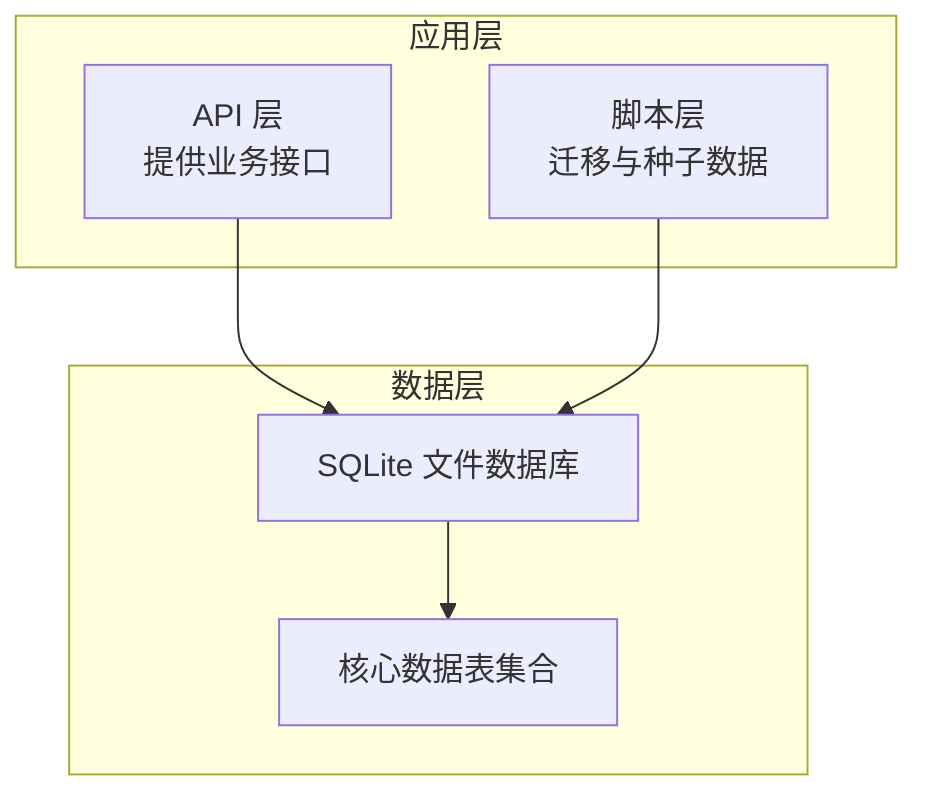
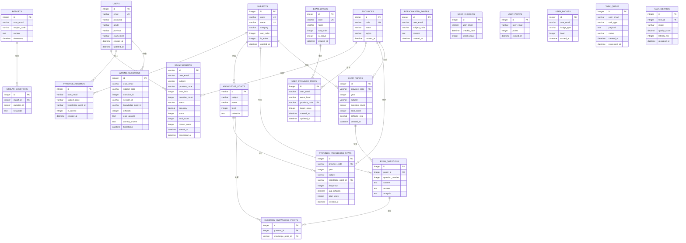
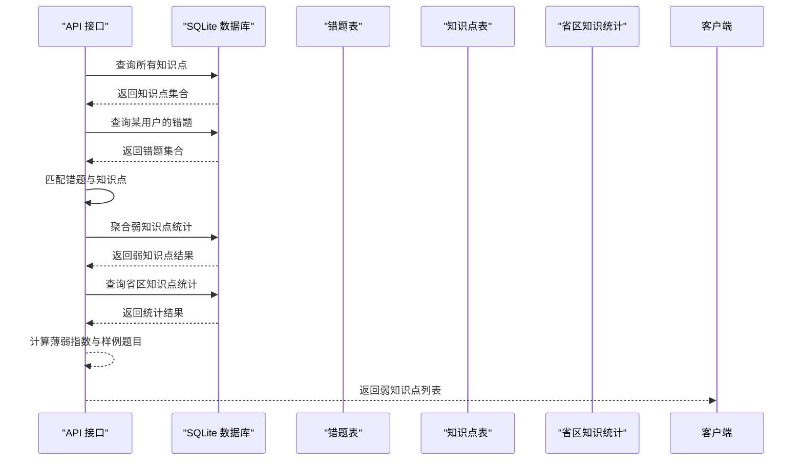
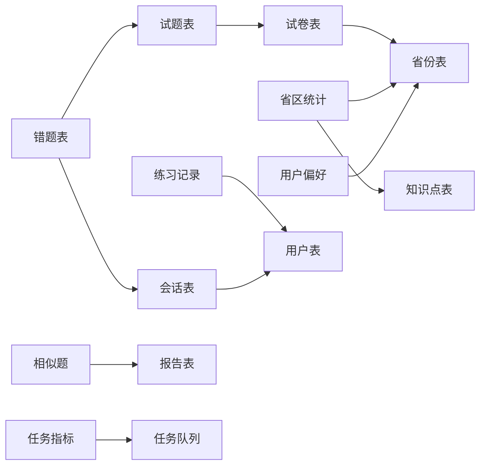

# 数据库设计

<cite>
**本文引用的文件**
- [api/db.js](file://api/db.js)
- [scripts/db-migrate.js](file://scripts/db-migrate.js)
- [api/knowledge-points.js](file://api/knowledge-points.js)
- [api/learning-dashboard.js](file://api/learning-dashboard.js)
- [api/province-trends.js](file://api/province-trends.js)
</cite>

## 目录
1. [简介](#简介)
2. [项目结构](#项目结构)
3. [核心组件](#核心组件)
4. [架构总览](#架构总览)
5. [详细组件分析](#详细组件分析)
6. [依赖分析](#依赖分析)
7. [性能考量](#性能考量)
8. [故障排查指南](#故障排查指南)
9. [结论](#结论)
10. [附录](#附录)

## 简介
本设计文档面向“AI家教”项目的SQLite数据库，系统化梳理整体架构、核心表结构与实体关系模型，覆盖用户、错题、报告、知识点、考试卷等关键数据模型的字段定义、数据类型与约束；明确主键/外键关系、索引策略与查询优化方案；给出数据验证与业务规则、数据完整性保障；提供数据库初始化脚本、迁移方案与版本管理策略；阐述数据访问模式、缓存策略与性能考虑，并给出备份、恢复与维护建议。

## 项目结构
- 数据库文件位置：SQLite数据库位于后端目录中，通过统一的数据库连接模块进行访问与初始化。
- 初始化与迁移：数据库初始化与迁移脚本分别在API层与独立脚本中实现，确保首次部署与后续版本演进的一致性。
- 查询与统计：多处业务接口对数据库进行复杂查询，涉及错题、知识点、练习记录、省区趋势等维度的数据聚合与分析。

**章节来源**
- [api/db.js:15-365](file://api/db.js#L15-L365)
- [scripts/db-migrate.js:525-542](file://scripts/db-migrate.js#L525-L542)

## 核心组件
- 数据库连接与初始化：集中于数据库连接模块，负责打开数据库、设置事务与一致性参数、创建核心表与索引，并在首次运行时注入参考数据。
- 迁移管理：独立脚本维护版本化的迁移流程，记录已执行版本并按序升级，确保数据库结构随版本演进保持一致。
- 业务查询：多个API接口围绕核心表进行复杂查询与聚合，包括错题分析、学习仪表盘、省区趋势等。

**章节来源**
- [api/db.js:15-365](file://api/db.js#L15-L365)
- [scripts/db-migrate.js:9-523](file://scripts/db-migrate.js#L9-L523)

## 架构总览
下图展示SQLite数据库的整体架构与核心表之间的关系，涵盖用户、科目、考试层级、省份、错题、报告、知识点、练习记录、省区知识统计、会话等实体。

**图表来源**
- [api/db.js:27-361](file://api/db.js#L27-L361)

**章节来源**
- [api/db.js:27-361](file://api/db.js#L27-L361)

## 详细组件分析

### 用户表（users）
- 字段与约束
  - 主键：自增整数id
  - 唯一：邮箱email
  - 非空：密码password、年级grade、是否包含省市区/考试层级字段
  - 时间戳：创建与更新时间
- 业务用途
  - 身份认证与个性化配置（如省市区、考试层级）
- 索引策略
  - 无显式索引，建议按常用查询维度建立复合索引（如邮箱+状态）

**章节来源**
- [api/db.js:27-37](file://api/db.js#L27-L37)

### 科目表（subjects）
- 字段与约束
  - 主键：自增整数id
  - 唯一：编码code、名称name
  - 默认值：分类category默认通用、排序sort_order默认0、激活状态is_active默认1
  - 时间戳：创建时间
- 业务用途
  - 维护可选学科及其分类与排序

**章节来源**
- [api/db.js:38-47](file://api/db.js#L38-L47)

### 考试层级表（exam_levels）
- 字段与约束
  - 主键：自增整数id
  - 唯一：编码code
  - 排序与激活状态同科目表
- 业务用途
  - 中考/高考等层级标识

**章节来源**
- [api/db.js:48-56](file://api/db.js#L48-L56)

### 错题表（wrong_questions）
- 字段与约束
  - 主键：自增整数id
  - 外键：question_id关联试题、session_id关联考试会话
  - 知识点关联：knowledge_point_id
  - 非空：用户邮箱、学科编码、难度、答案文本
  - 时间戳：记录时间
- 业务用途
  - 记录用户的错误题目、答案与知识点映射
- 索引策略
  - 按用户邮箱、学科编码、难度、知识点、时间戳、会话id建立索引，支持高频过滤与分组

**章节来源**
- [api/db.js:78-93](file://api/db.js#L78-L93)
- [api/db.js:324-331](file://api/db.js#L324-L331)

### 报告表（reports）
- 字段与约束
  - 主键：自增整数id
  - 非空：用户邮箱、学科编码、内容文本
  - 时间戳：生成时间
- 业务用途
  - 存放AI生成的学习/考试分析报告

**章节来源**
- [api/db.js:94-104](file://api/db.js#L94-L104)

### 相似题表（similar_questions）
- 字段与约束
  - 主键：自增整数id
  - 外键：report_id关联报告
  - 非空：问题id、关键词
- 业务用途
  - 记录报告中推荐的相似题目及关键词

**章节来源**
- [api/db.js:105-117](file://api/db.js#L105-L117)

### 知识点表（knowledge_points）
- 字段与约束
  - 主键：字符串id（非自增）
  - 非空：学科subject、名称name、层级level
  - 可空：子主题subtopics（JSON数组）
- 业务用途
  - 描述学科下的知识点树或层级结构

**章节来源**
- [api/db.js:127-138](file://api/db.js#L127-L138)

### 个性化试卷表（personalized_papers）
- 字段与约束
  - 主键：自增整数id
  - 非空：用户邮箱、学科编码、内容文本
  - 时间戳：创建时间
- 业务用途
  - 存放基于用户画像生成的个性化试卷

**章节来源**
- [api/db.js:139-146](file://api/db.js#L139-L146)

### 省份表（provinces）
- 字段与约束
  - 主键：自增整数id
  - 唯一：编码code
  - 非空：名称name、区域region
  - 时间戳：创建时间
- 业务用途
  - 维护省市区信息

**章节来源**
- [api/db.js:147-157](file://api/db.js#L147-L157)

### 试卷表（exam_papers）
- 字段与约束
  - 主键：自增整数id
  - 外键：province_code关联省份
  - 非空：年份year、学科subject、题目数量question_count、总分total_score、平均难度difficulty_avg
  - 时间戳：创建时间
- 业务用途
  - 存储历年真题试卷元数据

**章节来源**
- [api/db.js:158-172](file://api/db.js#L158-L172)

### 试题表（exam_questions）
- 字段与约束
  - 主键：自增整数id
  - 外键：paper_id关联试卷
  - 非空：题号question_number、内容content、答案answer、解析analysis
- 业务用途
  - 存储具体试题内容与标准答案

**章节来源**
- [api/db.js:173-193](file://api/db.js#L173-L193)

### 试题-知识点关联表（question_knowledge_points）
- 字段与约束
  - 主键：自增整数id
  - 外键：question_id关联试题、knowledge_point_id关联知识点
- 业务用途
  - 建立试题与知识点的多对多映射

**章节来源**
- [api/db.js:194-204](file://api/db.js#L194-L204)

### 练习记录表（practice_records）
- 字段与约束
  - 主键：自增整数id
  - 非空：用户邮箱、学科编码、正确与否is_correct
  - 可空：知识点id
  - 时间戳：记录时间
- 业务用途
  - 记录用户的日常练习行为与结果
- 索引策略
  - 按用户邮箱、学科编码、知识点、时间戳、正确与否建立索引，支撑统计与分析

**章节来源**
- [api/db.js:205-222](file://api/db.js#L205-L222)
- [api/db.js:342-347](file://api/db.js#L342-L347)

### 省区知识统计表（province_knowledge_stats）
- 字段与约束
  - 主键：自增整数id
  - 外键：province_code关联省份、knowledge_point_id关联知识点
  - 非空：年份year、学科subject、频次frequency、平均难度avg_difficulty、总分total_score
  - 时间戳：创建时间
- 业务用途
  - 存放按省区、年份、学科的知识点分布与难度统计
- 索引策略
  - 复合索引（省代码+年份+学科）、单独索引（知识点id），支撑聚合查询

**章节来源**
- [api/db.js:223-235](file://api/db.js#L223-L235)
- [api/db.js:338-339](file://api/db.js#L338-L339)

### 用户省区偏好表（user_province_prefs）
- 字段与约束
  - 主键：自增整数id
  - 外键：province_code关联省份
  - 非空：用户邮箱、考试层级、目标分数
  - 时间戳：创建与更新时间
- 业务用途
  - 记录用户的地区与目标偏好

**章节来源**
- [api/db.js:236-246](file://api/db.js#L236-L246)

### 考试会话表（exam_sessions）
- 字段与约束
  - 主键：字符串id
  - 非空：用户邮箱、学科、状态status
  - 可空：地区、时限、题目数、准确率、得分、完成时间
  - 时间戳：开始时间
- 业务用途
  - 记录一次考试过程的状态与结果
- 索引策略
  - 按用户邮箱、学科、状态、（用户邮箱+状态）建立索引，支撑会话检索与状态统计

**章节来源**
- [api/db.js:247-262](file://api/db.js#L247-L262)
- [api/db.js:349-352](file://api/db.js#L349-L352)

### 用户签到表（user_checkins）
- 字段与约束
  - 主键：自增整数id
  - 非空：用户邮箱、签到日期、连续天数streak_days
- 业务用途
  - 记录用户的每日签到与连击

**章节来源**
- [api/db.js:263-270](file://api/db.js#L263-L270)

### 用户积分表（user_points）
- 字段与约束
  - 主键：自增整数id
  - 非空：用户邮箱、积分points、获得时间earned_at
- 业务用途
  - 记录用户的积分变动

**章节来源**
- [api/db.js:271-278](file://api/db.js#L271-L278)

### 用户徽章表（user_badges）
- 字段与约束
  - 主键：自增整数id
  - 非空：用户邮箱、徽章类型badge_type、等级level、获得时间earned_at
- 业务用途
  - 记录用户的成就徽章

**章节来源**
- [api/db.js:279-286](file://api/db.js#L279-L286)

### 任务队列表（task_queue）
- 字段与约束
  - 主键：自增整数id
  - 非空：用户邮箱、任务类型task_type、状态status、载荷payload
  - 时间戳：创建与处理时间
- 业务用途
  - 异步任务调度与追踪

**章节来源**
- [api/db.js:287-304](file://api/db.js#L287-L304)

### 任务指标表（task_metrics）
- 字段与约束
  - 主键：自增整数id
  - 外键：task_id关联任务队列
  - 非空：模型model、质量评分quality_score、延迟latency_ms、记录时间recorded_at
- 业务用途
  - 记录任务执行的质量与性能指标

**章节来源**
- [api/db.js:305-323](file://api/db.js#L305-L323)

### 知识点弱项分析调用链
以下序列图展示从错题到知识点弱项的计算流程，体现多表关联与数据聚合：

**图表来源**
- [api/knowledge-points.js:106-145](file://api/knowledge-points.js#L106-L145)
- [api/db.js:78-93](file://api/db.js#L78-L93)
- [api/db.js:127-138](file://api/db.js#L127-L138)
- [api/db.js:223-235](file://api/db.js#L223-L235)

## 依赖分析
- 外键关系
  - 错题表依赖试题与会话；试题依赖试卷；试卷依赖省份；省区统计依赖省份与知识点；用户偏好依赖省份与考试层级；练习记录与会话依赖用户；相似题依赖报告；任务指标依赖任务队列。
- 索引依赖
  - 多处查询依赖复合索引与单列索引，以提升过滤、分组与连接效率。
- 迁移依赖
  - 迁移脚本确保表结构与索引随版本演进，同时清理无效外键引用，维持参照完整性。

**图表来源**
- [api/db.js:173-193](file://api/db.js#L173-L193)
- [api/db.js:223-235](file://api/db.js#L223-L235)
- [api/db.js:247-262](file://api/db.js#L247-L262)
- [api/db.js:305-323](file://api/db.js#L305-L323)

**章节来源**
- [api/db.js:173-193](file://api/db.js#L173-L193)
- [api/db.js:223-235](file://api/db.js#L223-L235)
- [api/db.js:247-262](file://api/db.js#L247-L262)
- [api/db.js:305-323](file://api/db.js#L305-L323)

## 性能考量
- 索引策略
  - 错题与练习记录：按用户邮箱、学科编码、知识点、时间戳、正确与否建立索引，支撑高频过滤与统计。
  - 省区统计：复合索引（省代码+年份+学科）与知识点id索引，加速聚合与筛选。
  - 会话与报告：按用户邮箱、学科、状态建立索引，提升状态查询与分页效率。
- 查询优化
  - 使用EXISTS/IN替代不必要的JOIN，减少中间结果集。
  - 对GROUP BY字段建立覆盖索引，避免回表。
  - 利用复合索引前缀匹配，避免全表扫描。
- 事务与并发
  - WAL模式提升并发写入能力；合理设置busy_timeout避免锁等待超时。
  - 批量插入使用事务包裹，减少日志开销。
- 缓存策略
  - 将热点查询结果（如省区趋势、学习仪表盘）缓存至内存或Redis，降低数据库压力。
  - 对静态参考表（科目、考试层级、省份）进行常驻缓存。
- I/O与存储
  - 定期VACUUM与ANALYZE，维护索引有效性与统计信息。
  - 控制JSON字段大小，避免过长文本影响索引与IO。

[本节为通用性能指导，不直接分析特定文件]

## 故障排查指南
- 常见问题
  - 外键约束失败：检查迁移脚本中的清理逻辑，确保删除无效外键引用后再添加约束。
  - 查询慢：确认是否命中复合索引；必要时调整WHERE/HAVING顺序，减少中间结果集。
  - 并发写入阻塞：检查WAL模式与busy_timeout设置；避免长时间事务。
- 数据校验
  - 使用唯一约束防止重复数据（如用户邮箱、科目编码、省份编码）。
  - 使用NOT NULL与默认值保证关键字段完整性。
- 日志与监控
  - 记录慢查询与错误日志，结合索引使用情况定位瓶颈。
  - 对关键指标（任务质量、延迟、会话状态）进行周期性监控。

**章节来源**
- [scripts/db-migrate.js:516-522](file://scripts/db-migrate.js#L516-L522)
- [api/db.js:23-25](file://api/db.js#L23-L25)

## 结论
本设计文档基于现有SQLite数据库结构与迁移脚本，给出了完整的实体关系模型、字段定义与约束、索引策略与查询优化方案，并提供了初始化、迁移、缓存与维护建议。通过严格的外键与索引设计，配合合理的查询优化与并发控制，可在中小规模场景下稳定支撑AI家教的核心业务。

[本节为总结性内容，不直接分析特定文件]

## 附录

### 数据库初始化脚本
- 初始化步骤
  - 打开数据库并启用WAL、设置busy_timeout、开启外键约束。
  - 创建核心表与索引。
  - 注入参考数据（科目、考试层级等）。
- 关键路径
  - [api/db.js:15-365](file://api/db.js#L15-L365)

**章节来源**
- [api/db.js:15-365](file://api/db.js#L15-L365)

### 数据迁移方案与版本管理
- 版本化迁移
  - 迁移脚本维护版本列表，逐版本up，记录已执行版本。
  - 在升级过程中清理无效外键引用，确保参照完整性。
- 关键路径
  - [scripts/db-migrate.js:9-523](file://scripts/db-migrate.js#L9-L523)
  - [scripts/db-migrate.js:525-542](file://scripts/db-migrate.js#L525-L542)

**章节来源**
- [scripts/db-migrate.js:9-523](file://scripts/db-migrate.js#L9-L523)
- [scripts/db-migrate.js:525-542](file://scripts/db-migrate.js#L525-L542)

### 数据访问模式与示例
- 错题到知识点弱项分析
  - 通过错题表聚合错误数量、平均置信度与样例题目，结合知识点表与省区统计进行综合评估。
  - 关键路径
    - [api/knowledge-points.js:106-145](file://api/knowledge-points.js#L106-L145)
- 学习仪表盘
  - 聚合错题与练习记录，按月统计练习次数与正确率。
  - 关键路径
    - [api/learning-dashboard.js:50-72](file://api/learning-dashboard.js#L50-L72)
- 省区趋势
  - 按年份与学科聚合试卷与知识点频率、难度与分数。
  - 关键路径
    - [api/province-trends.js:29-56](file://api/province-trends.js#L29-L56)

**章节来源**
- [api/knowledge-points.js:106-145](file://api/knowledge-points.js#L106-L145)
- [api/learning-dashboard.js:50-72](file://api/learning-dashboard.js#L50-L72)
- [api/province-trends.js:29-56](file://api/province-trends.js#L29-L56)

### 数据备份、恢复与维护
- 备份
  - 直接复制SQLite数据文件；或使用sqlite3工具导出SQL。
- 恢复
  - 停止服务后替换数据库文件，或导入SQL并重建索引。
- 维护
  - 定期执行VACUUM与ANALYZE，保持索引与统计信息有效。
  - 监控磁盘空间与WAL文件大小，必要时归档或清理。

[本节为通用运维指导，不直接分析特定文件]