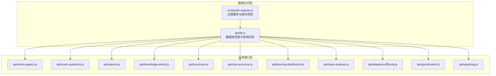
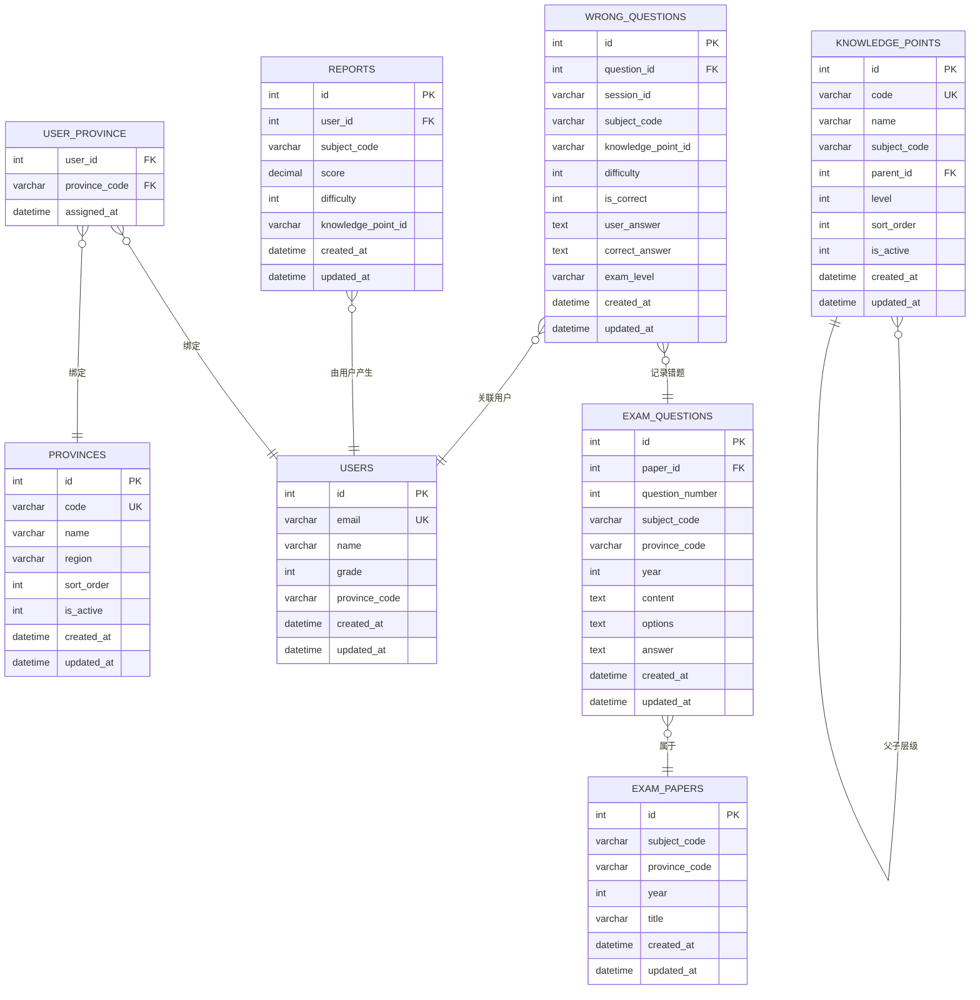
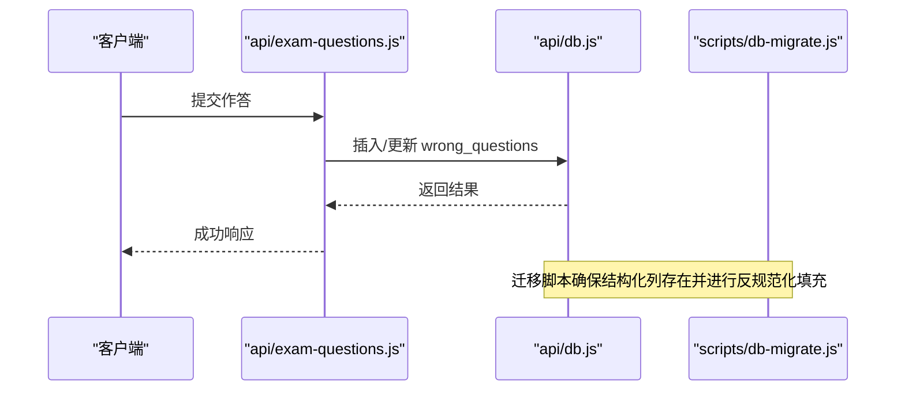
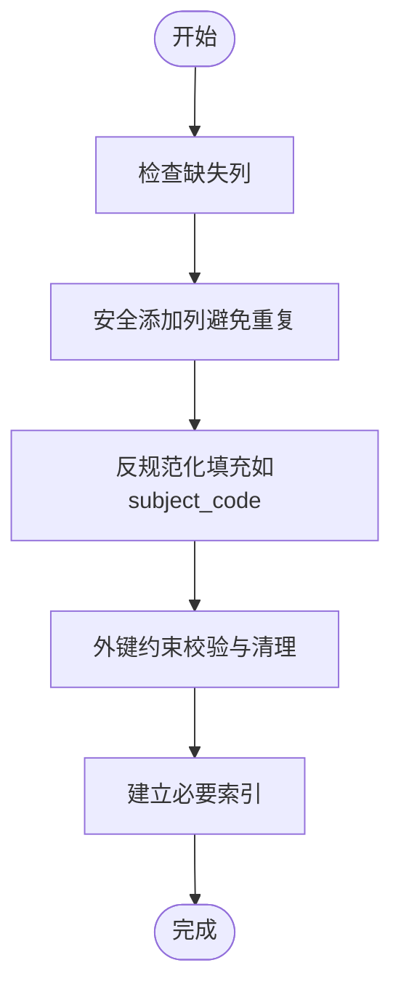

# 数据模型

<cite>
**本文引用的文件**
- [api/db.js](file://api/db.js)
- [scripts/db-migrate.js](file://scripts/db-migrate.js)
- [api/exam-papers.js](file://api/exam-papers.js)
- [api/exam-questions.js](file://api/exam-questions.js)
- [api/reports.js](file://api/reports.js)
- [api/knowledge-points.js](file://api/knowledge-points.js)
- [api/provinces.js](file://api/provinces.js)
- [api/user-province.js](file://api/user-province.js)
- [api/class-analysis.js](file://api/class-analysis.js)
- [api/learning-dashboard.js](file://api/learning-dashboard.js)
- [api/adaptive-difficulty.js](file://api/adaptive-difficulty.js)
- [api/gamification.js](file://api/gamification.js)
- [api/graphrag.js](file://api/graphrag.js)
- [database/graphify-zhongkao-beijing/structured_papers.json](file://database/graphify-zhongkao-beijing/structured_papers.json)
- [database/graphify-zhongkao-beijing/metadata.jsonl](file://database/graphify-zhongkao-beijing/metadata.jsonl)
</cite>

## 目录
1. [引言](#引言)
2. [项目结构](#项目结构)
3. [核心组件](#核心组件)
4. [架构总览](#架构总览)
5. [详细组件分析](#详细组件分析)
6. [依赖分析](#依赖分析)
7. [性能考虑](#性能考虑)
8. [故障排查指南](#故障排查指南)
9. [结论](#结论)
10. [附录](#附录)

## 引言
本文件面向AI家教项目的数据库与数据模型，系统化梳理核心业务实体（用户、错题、报告、知识点、试卷）的数据结构、关系与约束，解释规范化与反规范化策略及其性能权衡，并给出版本迁移、演进历史与向后兼容性保障方案。同时提供数据字典、字段含义与业务术语说明，以及在典型业务场景中的应用与使用示例。

## 项目结构
围绕数据模型的关键代码分布在以下模块：
- 数据库访问与动态列补全：api/db.js
- 数据库迁移与版本管理：scripts/db-migrate.js
- 业务接口层（按主题域划分）：
  - 试卷与题目：api/exam-papers.js、api/exam-questions.js
  - 报告与学习分析：api/reports.js、api/learning-dashboard.js、api/class-analysis.js
  - 知识点与区域：api/knowledge-points.js、api/provinces.js、api/user-province.js
  - 个性化与激励：api/adaptive-difficulty.js、api/gamification.js
  - 图谱检索增强：api/graphrag.js
- 结构化样例数据：database/graphify-zhongkao-beijing/*.json

**图示来源**
- [api/db.js:417-486](file://api/db.js#L417-L486)
- [scripts/db-migrate.js:1-542](file://scripts/db-migrate.js#L1-L542)

**章节来源**
- [api/db.js:417-486](file://api/db.js#L417-L486)
- [scripts/db-migrate.js:1-542](file://scripts/db-migrate.js#L1-L542)

## 核心组件
本节聚焦于核心业务实体与其关键属性、关系与约束。基于现有代码与迁移脚本，可归纳如下：

- 用户（users）
  - 关键属性：id、email、name、grade、province_code、created_at、updated_at
  - 约束：email唯一；新增updated_at列以支持审计与索引优化
  - 用途：登录认证、区域统计、个性化推荐

- 错题（wrong_questions）
  - 关键属性：question_id、session_id、subject_code、knowledge_point_id、difficulty、is_correct、user_answer、correct_answer、exam_level、created_at、updated_at
  - 约束：外键关联exam_questions与exam_sessions；新增结构化列便于聚合分析
  - 用途：错题本、知识点薄弱诊断、自适应难度调整

- 报告（reports）
  - 关键属性：user_id、subject_code、score、difficulty、knowledge_point_id、created_at、updated_at
  - 约束：结构化列便于按学科/难度/知识点维度统计
  - 用途：学习报告生成、班级/区域趋势分析

- 知识点（knowledge_points）
  - 关键属性：id、code、name、subject_code、parent_id、level、sort_order、is_active、created_at、updated_at
  - 约束：层级父子关系；新增updated_at列
  - 用途：知识树构建、题目标注、学习路径规划

- 试卷（exam_papers）
  - 关键属性：id、subject_code、province_code、year、title、created_at、updated_at
  - 约束：新增updated_at列
  - 用途：题目来源、组卷、区域政策与趋势分析

- 题目（exam_questions）
  - 关键属性：id、paper_id、question_number、subject_code、province_code、year、content、options、answer、created_at、updated_at
  - 约束：去重主键（paper_id+question_number）；新增subject_code、province_code、year等结构化列
  - 用途：题目解析、组卷、错题来源

- 区域（provinces）
  - 关键属性：id、code、name、region、sort_order、is_active、created_at、updated_at
  - 约束：新增updated_at列
  - 用途：区域画像、趋势分析、政策适配

- 用户-区域（user_province）
  - 关键属性：user_id、province_code、assigned_at
  - 约束：多对多映射，用于用户区域绑定与统计
  - 用途：区域趋势、班级分析

**章节来源**
- [api/db.js:417-486](file://api/db.js#L417-L486)
- [scripts/db-migrate.js:9-522](file://scripts/db-migrate.js#L9-L522)

## 架构总览
下图展示数据模型在系统中的位置与交互关系，体现规范化与反规范化的平衡：

**图示来源**
- [scripts/db-migrate.js:9-522](file://scripts/db-migrate.js#L9-L522)
- [api/db.js:417-486](file://api/db.js#L417-L486)

## 详细组件分析

### 用户模型（users）
- 设计要点
  - 主键自增id，email唯一，便于登录与去重
  - 新增updated_at列，支持审计与索引优化
- 业务规则
  - 用户必须归属一个省份（user_province），用于区域分析
  - 可能存在年级信息，用于分层教学与资源匹配
- 性能权衡
  - 唯一索引email提升登录效率
  - updated_at便于增量同步与缓存失效

**章节来源**
- [scripts/db-migrate.js:9-522](file://scripts/db-migrate.js#L9-L522)
- [api/user-province.js](file://api/user-province.js)

### 错题模型（wrong_questions）
- 设计要点
  - 关联exam_questions与exam_sessions，记录作答与正确答案
  - 新增subject_code、knowledge_point_id、exam_level等结构化列，便于聚合
  - is_correct标记答题正误，支持自适应难度与错题本
- 业务规则
  - 外键约束确保question_id与session_id有效
  - 按学科/难度/知识点维度统计错误率
- 性能权衡
  - 结构化列减少JOIN，提升报表与分析查询性能
  - 建议对subject_code、knowledge_point_id、is_correct建立索引

**图示来源**
- [api/exam-questions.js](file://api/exam-questions.js)
- [api/db.js:417-486](file://api/db.js#L417-L486)
- [scripts/db-migrate.js:386-522](file://scripts/db-migrate.js#L386-L522)

**章节来源**
- [api/db.js:417-486](file://api/db.js#L417-L486)
- [scripts/db-migrate.js:386-522](file://scripts/db-migrate.js#L386-L522)

### 报告模型（reports）
- 设计要点
  - 记录用户在某学科的得分、难度与知识点分布
  - 新增subject_code、knowledge_point_id等结构化列
- 业务规则
  - 每份报告对应一次学习或测评会话
  - 可用于生成个人报告、班级均分与知识点掌握度
- 性能权衡
  - 结构化列降低复杂查询成本，适合高频报表场景

**章节来源**
- [api/reports.js](file://api/reports.js)
- [scripts/db-migrate.js:371-385](file://scripts/db-migrate.js#L371-L385)

### 知识点模型（knowledge_points）
- 设计要点
  - 层级结构（parent_id）支持树形知识图谱
  - subject_code限定学科范围
  - 新增updated_at列
- 业务规则
  - 同一学科内code唯一，便于跨表引用
  - level与sort_order用于排序与导航
- 性能权衡
  - 父子关系适合递归查询与层级统计
  - 建议对parent_id与subject_code建立索引

**章节来源**
- [api/knowledge-points.js](file://api/knowledge-points.js)
- [scripts/db-migrate.js:9-522](file://scripts/db-migrate.js#L9-L522)

### 试卷与题目模型（exam_papers & exam_questions）
- 设计要点
  - 试卷与题目一对多关系，题目按序号定位
  - 新增subject_code、province_code、year等结构化列
  - 去重约束（paper_id+question_number）保证唯一性
- 业务规则
  - 题目内容、选项与答案需与来源一致
  - 年份与省份用于政策与趋势分析
- 性能权衡
  - 结构化列显著降低跨表查询成本
  - 建议对paper_id、question_number、subject_code建立复合索引

**章节来源**
- [api/exam-papers.js](file://api/exam-papers.js)
- [api/exam-questions.js](file://api/exam-questions.js)
- [scripts/db-migrate.js:386-522](file://scripts/db-migrate.js#L386-L522)

### 区域模型（provinces）与用户-区域（user_province）
- 设计要点
  - provinces提供区域元数据（code、name、region）
  - user_province建立用户与区域的多对多映射
- 业务规则
  - 用户默认绑定所在区域，用于区域趋势与政策适配
  - 区域画像支持班级/学校/区县对比分析
- 性能权衡
  - 区域维度常用于分组统计，建议对code与region建立索引

**章节来源**
- [api/provinces.js](file://api/provinces.js)
- [api/user-province.js](file://api/user-province.js)
- [scripts/db-migrate.js:9-522](file://scripts/db-migrate.js#L9-L522)

### 学习分析与个性化
- 学习仪表盘（learning-dashboard）与班级分析（class-analysis）
  - 基于reports与wrong_questions聚合用户/班级表现
- 自适应难度（adaptive-difficulty）
  - 基于错题与知识点掌握度动态调整题目难度
- 激励体系（gamification）
  - 基于学习行为与报告生成积分/徽章

**章节来源**
- [api/learning-dashboard.js](file://api/learning-dashboard.js)
- [api/class-analysis.js](file://api/class-analysis.js)
- [api/adaptive-difficulty.js](file://api/adaptive-difficulty.js)
- [api/gamification.js](file://api/gamification.js)

### 图谱检索增强（graphrag）
- 通过图谱与LLM结合，提供题目解析与知识点关联
- 输入样例来源于结构化数据文件，支撑图谱构建与检索

**章节来源**
- [api/graphrag.js](file://api/graphrag.js)
- [database/graphify-zhongkao-beijing/structured_papers.json](file://database/graphify-zhongkao-beijing/structured_papers.json)
- [database/graphify-zhongkao-beijing/metadata.jsonl](file://database/graphify-zhongkao-beijing/metadata.jsonl)

## 依赖分析
- 规范化与反规范化
  - 规范化：users、provinces、knowledge_points等保持原子性，避免冗余
  - 反规范化：在wrong_questions、reports、exam_questions中引入subject_code、knowledge_point_id、exam_level等列，减少JOIN，提升分析查询性能
- 外键与约束
  - 迁移脚本确保外键引用的有效性，清理无效数据
  - 对关键表启用外键检查，保证数据一致性
- 版本与兼容
  - 通过db_migrations表记录迁移版本，确保数据库结构演进可追踪
  - 新增列采用“安全添加”策略，避免破坏既有数据

**图示来源**
- [api/db.js:417-486](file://api/db.js#L417-L486)
- [scripts/db-migrate.js:371-522](file://scripts/db-migrate.js#L371-L522)

**章节来源**
- [api/db.js:417-486](file://api/db.js#L417-L486)
- [scripts/db-migrate.js:371-522](file://scripts/db-migrate.js#L371-L522)

## 性能考虑
- 索引策略
  - 在wrong_questions上对subject_code、knowledge_point_id、is_correct建立索引
  - 在exam_questions上对paper_id、question_number、subject_code建立复合索引
  - 在reports上对user_id、subject_code、knowledge_point_id建立索引
- 查询模式
  - 报表类查询优先利用反规范化列，减少JOIN
  - 分页与过滤结合updated_at进行增量拉取
- 缓存与异步
  - 使用缓存中间件（见api/utils/cache.js）缓存热点报表
  - 大量写入场景采用WAL模式与批量提交

[本节为通用性能指导，不直接分析具体文件]

## 故障排查指南
- 列缺失或重复
  - 现象：查询报错或数据异常
  - 排查：确认是否执行过ensureStructuredColumns与db_migrate
  - 处理：运行迁移脚本，确保列已添加且无重复
- 外键冲突
  - 现象：插入失败或数据被清理
  - 排查：检查wrong_questions、reports等表的外键引用
  - 处理：先补齐被引用记录，再执行插入
- 反规范化不一致
  - 现象：报表与明细不一致
  - 排查：核对subject_code、province_code、year等列是否已从试卷表回填
  - 处理：执行反规范化填充逻辑

**章节来源**
- [api/db.js:417-486](file://api/db.js#L417-L486)
- [scripts/db-migrate.js:371-522](file://scripts/db-migrate.js#L371-L522)

## 结论
本数据模型在规范化与反规范化之间取得平衡：以规范化保证数据一致性与扩展性，以反规范化提升分析查询性能。通过迁移脚本与版本控制，确保结构演进可控、可追溯，并提供向后兼容性保障。结合索引、缓存与异步处理，可在高并发场景下稳定支撑AI家教的日常业务。

## 附录

### 数据字典与字段说明
- users
  - id：用户标识
  - email：登录账号（唯一）
  - name：姓名
  - grade：年级
  - province_code：所属省份编码
  - created_at/updated_at：创建与更新时间
- wrong_questions
  - question_id：题目标识
  - session_id：会话标识
  - subject_code：学科编码
  - knowledge_point_id：知识点编码
  - difficulty：难度等级
  - is_correct：是否正确
  - user_answer/correct_answer：用户答案与标准答案
  - exam_level：考试级别
  - created_at/updated_at：创建与更新时间
- reports
  - user_id：用户标识
  - subject_code：学科编码
  - score：分数
  - difficulty：难度等级
  - knowledge_point_id：知识点编码
  - created_at/updated_at：创建与更新时间
- knowledge_points
  - id/code/name：知识点标识与名称
  - subject_code：学科编码
  - parent_id：父节点
  - level/sort_order：层级与排序
  - is_active：是否启用
  - created_at/updated_at：创建与更新时间
- exam_papers
  - id：试卷标识
  - subject_code/province_code/year：学科/省份/年份
  - title：标题
  - created_at/updated_at：创建与更新时间
- exam_questions
  - id：题目标识
  - paper_id/question_number：所属试卷与题号
  - subject_code/province_code/year：学科/省份/年份
  - content/options/answer：题目内容、选项与答案
  - created_at/updated_at：创建与更新时间
- provinces
  - id/code/name：区域标识与名称
  - region：区域类型
  - sort_order/is_active：排序与状态
  - created_at/updated_at：创建与更新时间
- user_province
  - user_id/province_code：用户与区域映射
  - assigned_at：分配时间

**章节来源**
- [scripts/db-migrate.js:9-522](file://scripts/db-migrate.js#L9-L522)
- [api/db.js:417-486](file://api/db.js#L417-L486)

### 业务术语解释
- 学科（subject）：如数学、语文、英语、物理、化学、生物、政治、历史、地理
- 考试级别（exam_level）：如高考、中考、模拟考等
- 知识点（knowledge_point）：学科内的具体知识点条目，具有层级关系
- 试卷（exam_paper）：按年份、地区、学科组织的题目集合
- 题目（exam_question）：试卷中的单个题目，含内容、选项与答案
- 区域（province）：省/市/自治区等行政区域
- 错题（wrong_question）：用户作答错误的题目记录

[本节为概念性说明，不直接分析具体文件]

### 数据模型演进与版本管理
- 版本化迁移
  - 通过db_migrations表记录版本与描述
  - 每次结构变更以迁移脚本形式执行，避免手工修改
- 向后兼容
  - 新增列采用“安全添加”，避免破坏既有数据
  - 反规范化填充逻辑仅在需要时执行
- 兼容性保障
  - 外键约束与数据清理确保引用完整性
  - 增量更新策略配合updated_at字段

**章节来源**
- [scripts/db-migrate.js:525-542](file://scripts/db-migrate.js#L525-L542)

### 实际业务场景应用示例
- 生成学生错题本
  - 依据wrong_questions按用户与知识点聚合，筛选is_correct=0的记录
- 生成班级报告
  - 依据reports按学科与知识点统计平均分与掌握度
- 个性化练习推送
  - 基于wrong_questions与knowledge_points，识别薄弱知识点并推荐题目
- 区域政策适配
  - 基于provinces与user_province，按省份与年份筛选试卷与题目

[本节为场景说明，不直接分析具体文件]