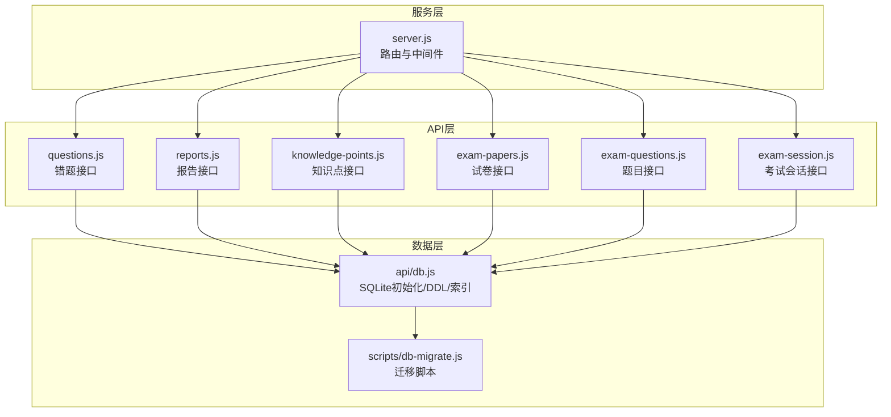
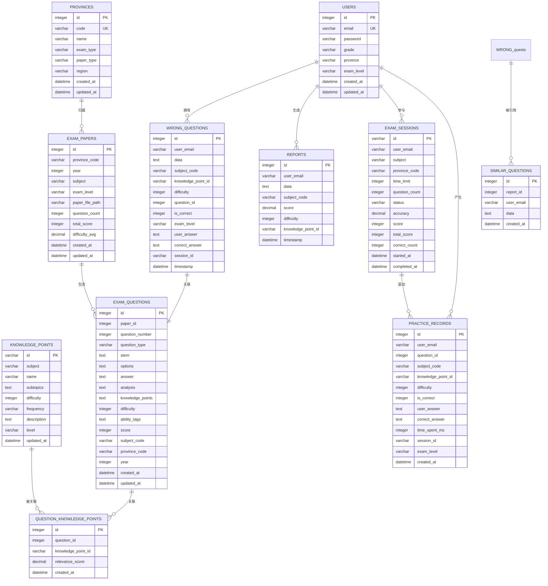
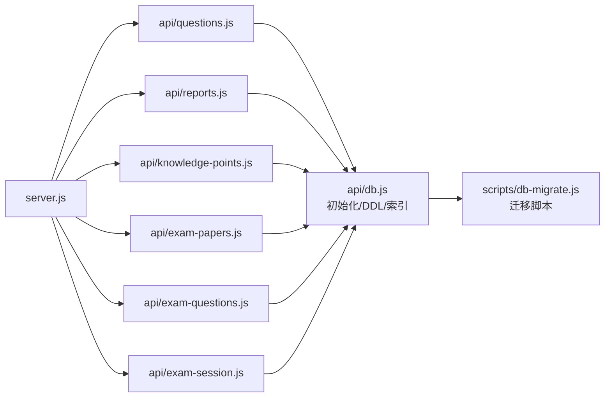

# 核心实体模型

<cite>
**本文档引用的文件**
- [api/db.js](file://api/db.js)
- [scripts/db-migrate.js](file://scripts/db-migrate.js)
- [api/questions.js](file://api/questions.js)
- [api/reports.js](file://api/reports.js)
- [api/knowledge-points.js](file://api/knowledge-points.js)
- [api/exam-papers.js](file://api/exam-papers.js)
- [api/exam-questions.js](file://api/exam-questions.js)
- [api/exam-session.js](file://api/exam-session.js)
- [server.js](file://server.js)
</cite>

## 目录
1. [简介](#简介)
2. [项目结构](#项目结构)
3. [核心组件](#核心组件)
4. [架构总览](#架构总览)
5. [详细组件分析](#详细组件分析)
6. [依赖分析](#依赖分析)
7. [性能考虑](#性能考虑)
8. [故障排除指南](#故障排除指南)
9. [结论](#结论)
10. [附录](#附录)

## 简介
本文件面向AI家教项目的后端数据层，聚焦于核心业务实体的模型设计与关系。重点覆盖以下实体：用户模型(users)、错题模型(wrong_questions)、报告模型(reports)、知识点模型(knowledge_points)、考试卷模型(exam_papers)、考试题模型(exam_questions)。文档从字段定义、数据类型、约束条件、业务规则出发，系统阐述实体间外键关系、引用完整性与级联策略，并提供实体关系图(ERD)与典型业务场景示例，帮助开发者与产品人员快速理解与使用。

## 项目结构
后端采用Express服务，数据库初始化与迁移逻辑集中在数据库模块中，API路由在server.js中统一挂载。核心实体的DDL、索引与迁移脚本均在数据库模块中实现，确保表结构与查询性能的可维护性。

图表来源
- [server.js:1-221](file://server.js#L1-L221)
- [api/db.js:1-478](file://api/db.js#L1-L478)
- [scripts/db-migrate.js:1-616](file://scripts/db-migrate.js#L1-L616)

章节来源
- [server.js:1-221](file://server.js#L1-L221)
- [api/db.js:1-478](file://api/db.js#L1-L478)

## 核心组件
本节概述六大核心实体的职责边界与关键字段，便于快速定位与理解。

- 用户模型(users)
  - 职责：存储学生/教师账户信息，支持登录、注册、等级与地区配置。
  - 关键字段：主键自增id；唯一邮箱email；密码password；年级grade；省份province；考试层级exam_level；时间戳created_at/updated_at。
  - 约束：邮箱唯一；默认时间戳。

- 错题模型(wrong_questions)
  - 职责：记录用户的错题与作答情况，支持按学科、难度、知识点、会话等维度检索。
  - 关键字段：主键自增id；用户邮箱user_email；原始错题数据data；学科代号subject_code；知识点idknowledge_point_id；难度difficulty；关联题目idquestion_id；正确标记is_correct；考试层级exam_level；用户答案user_answer；标准答案correct_answer；会话idsession_id；时间戳timestamp。
  - 约束：外键指向users(email)、exam_questions(id)、exam_sessions(id)；结构化列用于高效查询。

- 报告模型(reports)
  - 职责：保存学习/测评报告，支持与相似题目关联。
  - 关键字段：主键自增id；用户邮箱user_email；报告数据data；学科代号subject_code；得分score；难度difficulty；知识点idknowledge_point_id；时间戳timestamp。
  - 约束：外键指向users(email)；相似题目表similar_questions通过report_id关联。

- 知识点模型(knowledge_points)
  - 职责：存储学科知识点元数据，支持按学科与层级过滤。
  - 关键字段：主键id；学科subject；名称name；子主题subtopics；难度difficulty；频率frequency；描述description；层级level；更新时间updated_at。
  - 约束：主键唯一；层级默认高考gaokao。

- 考试卷模型(exam_papers)
  - 职责：存储各省份、年份、学科的真题卷信息。
  - 关键字段：主键自增id；省份代码province_code；年份year；学科subject；考试层级exam_level；文件路径paper_file_path；题目数量question_count；总分total_score；平均难度difficulty_avg；时间戳created_at/updated_at。
  - 约束：外键指向provinces(code)；复合索引优化查询。

- 考试题模型(exam_questions)
  - 职责：存储具体题目，含题干、选项、答案、解析、能力标签、分数等。
  - 关键字段：主键自增id；所属试卷paper_id；题号question_number；题型question_type；题干stem；选项options；答案answer；解析analysis；知识点knowledge_points；难度difficulty；能力标签ability_tags；分数score；学科代号subject_code；省份代码province_code；年份year；时间戳created_at/updated_at。
  - 约束：外键指向exam_papers(id)；多对多关联知识点通过question_knowledge_points；难度范围检查。

章节来源
- [api/db.js:28-193](file://api/db.js#L28-L193)
- [api/questions.js:12-114](file://api/questions.js#L12-L114)
- [api/reports.js:4-67](file://api/reports.js#L4-L67)
- [api/knowledge-points.js:7-146](file://api/knowledge-points.js#L7-L146)
- [api/exam-papers.js:4-143](file://api/exam-papers.js#L4-L143)
- [api/exam-questions.js:4-246](file://api/exam-questions.js#L4-L246)

## 架构总览
下图展示核心实体之间的关系与外键约束，体现“用户—错题—报告—知识点—试卷—题目—会话”的完整闭环。

图表来源
- [api/db.js:28-286](file://api/db.js#L28-L286)

章节来源
- [api/db.js:28-286](file://api/db.js#L28-L286)

## 详细组件分析

### 用户模型(users)
- 字段与约束
  - 主键id：自增整数
  - 唯一邮箱email：字符串，非空
  - 密码password：字符串，非空
  - 年级grade：字符串，非空
  - 省份province：字符串
  - 考试层级exam_level：字符串
  - 时间戳created_at/updated_at：默认当前时间
- 业务规则
  - 注册时校验邮箱格式与密码强度，避免重复注册
  - 登录后生成JWT令牌，作为后续接口鉴权凭证
- 典型用法
  - 注册/登录流程在注册与认证模块中使用users表进行身份验证
  - 考试会话与错题记录均以user_email关联到users

章节来源
- [api/db.js:28-37](file://api/db.js#L28-L37)
- [api/register.js:9-50](file://api/register.js#L9-L50)

### 错题模型(wrong_questions)
- 字段与约束
  - 主键id：自增整数
  - user_email：外键引用users(email)，非空
  - data：文本，存储错题原始数据
  - 结构化列：subject_code、knowledge_point_id、difficulty、question_id、is_correct、exam_level、user_answer、correct_answer、session_id
  - timestamp：默认当前时间
- 外键与级联
  - 外键指向users(email)、exam_questions(id)、exam_sessions(id)
  - 级联策略：question_id与session_id删除时设为NULL，保证错题记录不被强制删除
- 业务规则
  - 支持按学科、难度、知识点、会话、时间等多维检索
  - 提交答案后若错误则写入错题记录，避免重复
- 典型用法
  - 学生提交答案后，系统根据是否正确决定是否写入错题
  - 获取错题列表时，同时返回结构化字段便于前端展示

章节来源
- [api/db.js:79-93](file://api/db.js#L79-L93)
- [api/questions.js:12-114](file://api/questions.js#L12-L114)
- [api/exam-session.js:189-239](file://api/exam-session.js#L189-L239)

### 报告模型(reports)
- 字段与约束
  - 主键id：自增整数
  - user_email：外键引用users(email)，非空
  - data：文本，存储报告原始数据
  - 结构化列：subject_code、score、difficulty、knowledge_point_id
  - timestamp：默认当前时间
- 外键与级联
  - 外键指向users(email)
  - 相似题目表similar_questions通过report_id级联删除
- 业务规则
  - 报告与相似题目解耦存储，支持扩展相似题目推荐
  - 删除报告时，其相似题目也会级联清理
- 典型用法
  - 生成报告后，可附加相似题目集合
  - 查询报告列表时，合并相似题目数据返回

章节来源
- [api/db.js:95-104](file://api/db.js#L95-L104)
- [api/reports.js:4-67](file://api/reports.js#L4-L67)

### 知识点模型(knowledge_points)
- 字段与约束
  - 主键id：字符串，唯一
  - subject/name：学科与名称，非空
  - subtopics：JSON数组，存储子主题
  - difficulty/frequency/level：难度、频率、层级
  - updated_at：默认当前时间
- 业务规则
  - 支持按subject与level过滤
  - 提供导入脚本，支持高考与中考两类知识点
- 典型用法
  - 弱项分析时，结合wrong_questions匹配知识点
  - 题目筛选时，通过question_knowledge_points关联

章节来源
- [api/db.js:128-138](file://api/db.js#L128-L138)
- [api/knowledge-points.js:7-146](file://api/knowledge-points.js#L7-L146)

### 考试卷模型(exam_papers)
- 字段与约束
  - 主键id：自增整数
  - province_code：外键引用provinces(code)，非空
  - year/subject/exam_level：组合查询常用字段
  - question_count/total_score/difficulty_avg：统计字段
  - created_at/updated_at：默认当前时间
- 外键与索引
  - 外键指向provinces(code)
  - 复合索引：省市区+年份+学科、学科+年份+省
- 业务规则
  - 创建/更新时同步统计字段
  - 支持按省、年、学科、层级组合查询
- 典型用法
  - 列表查询时返回省份名称映射
  - 详情查询时统计题目数量

章节来源
- [api/db.js:159-172](file://api/db.js#L159-L172)
- [api/exam-papers.js:4-143](file://api/exam-papers.js#L4-L143)

### 考试题模型(exam_questions)
- 字段与约束
  - 主键id：自增整数
  - paper_id：外键引用exam_papers(id)，非空
  - question_number/stem/options/answer/analysis/knowledge_points/score
  - question_type/difficulty：题型与难度
  - subject_code/province_code/year：结构化列，便于查询
  - created_at/updated_at：默认当前时间
- 外键与级联
  - 外键指向exam_papers(id)：删除试卷时级联删除题目
  - question_knowledge_points：多对多关联知识点
- 业务规则
  - 难度取值范围检查(1~5)
  - 批量导入时同步更新试卷统计字段
- 典型用法
  - 按试卷查询题目，支持按题型、难度、知识点过滤
  - 创建题目时自动回填学科、省份、年份信息

章节来源
- [api/db.js:174-193](file://api/db.js#L174-L193)
- [api/exam-questions.js:4-246](file://api/exam-questions.js#L4-L246)

### 实体关系与级联策略
- users → wrong_questions：一对多，错题记录随用户存在
- users → reports：一对多，报告随用户存在
- users → exam_sessions：一对多，会话随用户存在
- exam_papers → exam_questions：一对多，删除试卷级联删除题目
- exam_questions ←→ knowledge_points：多对多，通过question_knowledge_points关联
- reports → similar_questions：一对多，删除报告级联删除相似题目
- wrong_questions → exam_questions / exam_sessions：外键引用，删除时设为NULL

章节来源
- [api/db.js:125](file://api/db.js#L125)
- [api/db.js:192](file://api/db.js#L192)
- [api/db.js:201-202](file://api/db.js#L201-L202)
- [api/db.js:220-221](file://api/db.js#L220-L221)

## 依赖分析
- 数据库初始化
  - 初始化时启用外键约束，创建所有核心表与索引
  - 迁移脚本负责结构化列补充、索引完善、去重与外键清理
- API依赖
  - 各API模块通过统一数据库访问层读写实体
  - 路由在server.js中集中挂载，便于统一鉴权与限流

图表来源
- [api/db.js:1-365](file://api/db.js#L1-L365)
- [scripts/db-migrate.js:525-579](file://scripts/db-migrate.js#L525-L579)
- [server.js:1-35](file://server.js#L1-L35)

章节来源
- [api/db.js:1-365](file://api/db.js#L1-L365)
- [scripts/db-migrate.js:525-579](file://scripts/db-migrate.js#L525-L579)
- [server.js:1-35](file://server.js#L1-L35)

## 性能考虑
- 索引策略
  - 对高频查询字段建立复合索引：如试卷的省+年+学科、题目按学科/难度/题型/省份/年份等
  - 对错题、报告、练习记录按用户+学科+时间等维度建立索引，提升分页与过滤性能
- 结构化列
  - 在wrong_questions与reports中增加subject_code、knowledge_point_id、difficulty等列，便于直接查询与聚合
  - 在exam_questions中补充subject_code、province_code、year，减少JOIN开销
- 迁移与去重
  - 迁移脚本执行去重与外键清理，保证数据一致性与查询效率

章节来源
- [api/db.js:308-361](file://api/db.js#L308-L361)
- [scripts/db-migrate.js:418-477](file://scripts/db-migrate.js#L418-L477)

## 故障排除指南
- 外键约束导致插入/删除失败
  - 确认被引用实体是否存在（如试卷、省份、用户）
  - 检查结构化列是否正确填充（subject_code、province_code、year等）
- 查询结果为空或异常
  - 核对查询条件与索引是否匹配
  - 检查迁移脚本是否完成，特别是结构化列与索引
- 数据重复或不一致
  - 运行迁移脚本的去重步骤，清理重复记录
  - 校验question_knowledge_points唯一性约束

章节来源
- [scripts/db-migrate.js:483-511](file://scripts/db-migrate.js#L483-L511)
- [api/db.js:517-522](file://api/db.js#L517-L522)

## 结论
本模型围绕“用户—错题—报告—知识点—试卷—题目—会话”构建了完整的教育数据闭环。通过结构化列与复合索引优化查询性能，借助迁移脚本保障数据一致性与演进能力。建议在新增实体或字段时，遵循现有索引与约束模式，确保整体架构的可维护性与扩展性。

## 附录

### 数据字典与字段说明
- users
  - id：自增主键
  - email：唯一邮箱
  - password：加密密码
  - grade：年级
  - province：省份
  - exam_level：考试层级(zhongkao/gaokao)
  - created_at/updated_at：创建与更新时间

- wrong_questions
  - id：自增主键
  - user_email：用户邮箱
  - data：错题原始数据
  - subject_code：学科代号
  - knowledge_point_id：知识点ID
  - difficulty：难度(1~5)
  - question_id：关联题目ID
  - is_correct：是否正确
  - exam_level：考试层级
  - user_answer/correct_answer：用户答案与标准答案
  - session_id：会话ID
  - timestamp：记录时间

- reports
  - id：自增主键
  - user_email：用户邮箱
  - data：报告原始数据
  - subject_code：学科代号
  - score：得分
  - difficulty：难度
  - knowledge_point_id：知识点ID
  - timestamp：记录时间

- knowledge_points
  - id：知识点ID
  - subject：学科
  - name：名称
  - subtopics：子主题数组
  - difficulty：难度
  - frequency：频率
  - description：描述
  - level：层级(gaokao/zhongkao)
  - updated_at：更新时间

- exam_papers
  - id：自增主键
  - province_code：省份代码
  - year：年份
  - subject：学科
  - exam_level：考试层级
  - paper_file_path：文件路径
  - question_count：题目数量
  - total_score：总分
  - difficulty_avg：平均难度
  - created_at/updated_at：创建与更新时间

- exam_questions
  - id：自增主键
  - paper_id：所属试卷
  - question_number：题号
  - question_type：题型
  - stem：题干
  - options：选项
  - answer：答案
  - analysis：解析
  - knowledge_points：知识点
  - difficulty：难度(1~5)
  - ability_tags：能力标签
  - score：分数
  - subject_code：学科代号
  - province_code：省份代码
  - year：年份
  - created_at/updated_at：创建与更新时间

- practice_records
  - id：自增主键
  - user_email：用户邮箱
  - question_id：题目ID
  - subject_code：学科代号
  - knowledge_point_id：知识点ID
  - difficulty：难度
  - is_correct：是否正确
  - user_answer：用户答案
  - correct_answer：标准答案
  - time_spent_ms：耗时(ms)
  - session_id：会话ID
  - exam_level：考试层级
  - created_at：记录时间

- provinces
  - id：自增主键
  - code：省份代码(唯一)
  - name：省份名称
  - exam_type：考试类型
  - paper_type：卷种
  - region：区域
  - created_at/updated_at：创建与更新时间

- exam_sessions
  - id：会话ID(主键)
  - user_email：用户邮箱
  - subject：学科
  - province_code：省份代码
  - time_limit：时限(min)
  - question_count：题目数量
  - status：状态(active/completed)
  - accuracy：准确率
  - score：得分
  - total_score：总分
  - correct_count：正确题数
  - started_at：开始时间
  - completed_at：完成时间

- question_knowledge_points
  - id：自增主键
  - question_id：题目ID
  - knowledge_point_id：知识点ID
  - relevance_score：关联度
  - created_at：创建时间

- similar_questions
  - id：自增主键
  - report_id：报告ID
  - user_email：用户邮箱
  - data：相似题目数据
  - created_at：创建时间

### 业务术语解释
- 学科代号(subject_code)：将中文学科映射为英文代码，便于跨模块统一处理
- 考试层级(exam_level)：区分中考(zhongkao)与高考(gaokao)
- 知识点(knowledge_point)：学科知识单元，支持层级与频率管理
- 会话(session)：一次在线练习或模拟考试的上下文
- 结构化列：为常见查询而冗余存储的派生字段，降低JOIN成本