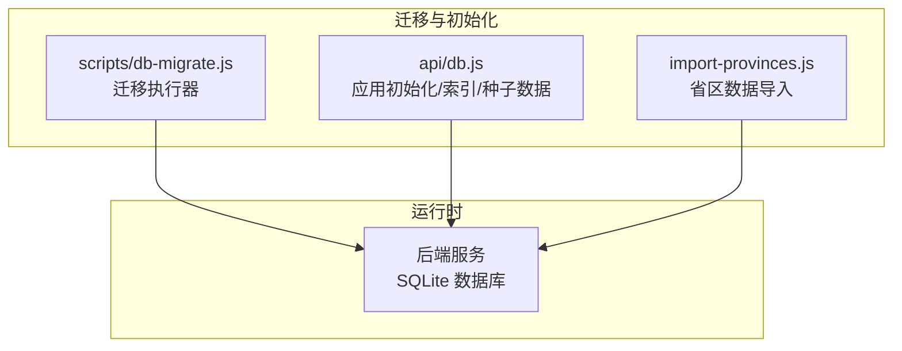
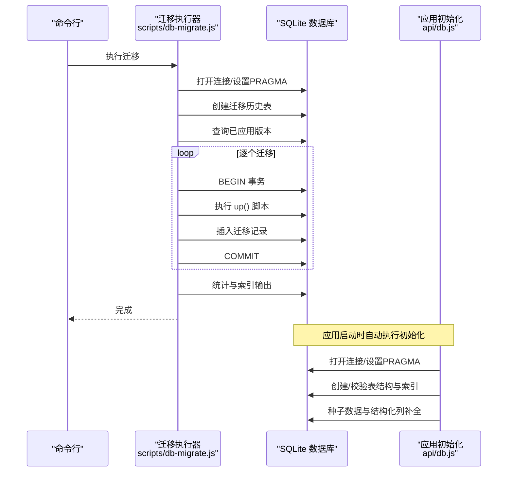
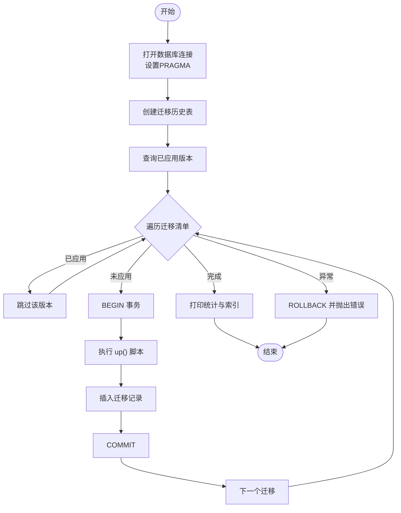
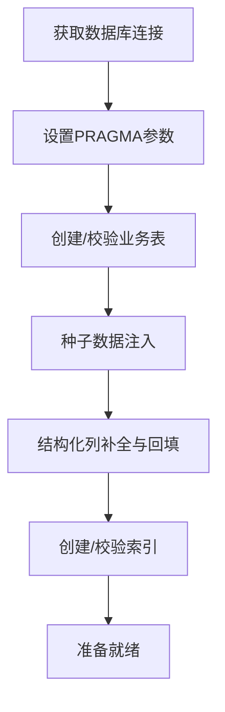
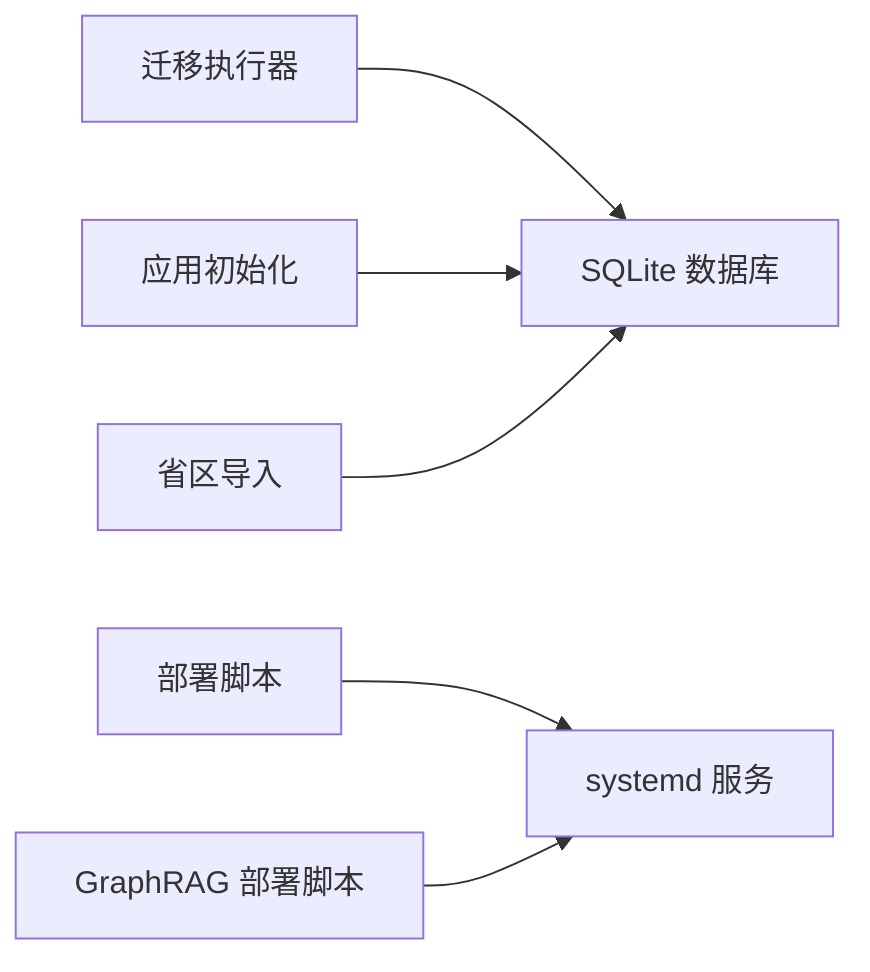

# 数据迁移管理

<cite>
**本文引用的文件**
- [scripts/db-migrate.js](file://scripts/db-migrate.js)
- [api/db.js](file://api/db.js)
- [import-provinces.js](file://import-provinces.js)
- [setup.sh](file://setup.sh)
- [scripts/setup_graphrag.sh](file://scripts/setup_graphrag.sh)
</cite>

## 目录
1. [简介](#简介)
2. [项目结构](#项目结构)
3. [核心组件](#核心组件)
4. [架构总览](#架构总览)
5. [详细组件分析](#详细组件分析)
6. [依赖关系分析](#依赖关系分析)
7. [性能考量](#性能考量)
8. [故障排查指南](#故障排查指南)
9. [结论](#结论)
10. [附录](#附录)

## 简介
本文件面向“AI家教”项目，系统化梳理数据库结构变更的管理流程、版本控制策略与迁移脚本设计，解释自动化迁移、回滚机制与错误处理策略，并阐述结构演进的历史记录、版本标记与兼容性检查方法。同时提供迁移脚本编写规范、测试策略与部署流程，涵盖生产环境迁移的最佳实践、风险控制与数据备份策略，并给出迁移过程中的监控指标、性能影响评估与优化建议。

## 项目结构
本项目采用前后端分离架构，数据库层通过 SQLite 提供本地开发与演示能力；迁移管理由独立的 Node 脚本负责，应用初始化时也进行基础表结构与索引的创建与校验。

图表来源
- [scripts/db-migrate.js:1-616](file://scripts/db-migrate.js#L1-L616)
- [api/db.js:1-478](file://api/db.js#L1-L478)
- [import-provinces.js:1-38](file://import-provinces.js#L1-L38)

章节来源
- [scripts/db-migrate.js:1-616](file://scripts/db-migrate.js#L1-L616)
- [api/db.js:1-478](file://api/db.js#L1-L478)
- [import-provinces.js:1-38](file://import-provinces.js#L1-L38)

## 核心组件
- 迁移执行器：集中定义迁移清单、事务化执行、版本记录与统计输出。
- 应用初始化：在首次连接数据库时创建表结构、索引、参考数据与结构化列，确保兼容性。
- 省区数据导入：批量导入省区维度数据，保证业务数据完整性。
- 部署脚本：系统级部署与服务管理，保障迁移与服务稳定上线。

章节来源
- [scripts/db-migrate.js:9-523](file://scripts/db-migrate.js#L9-L523)
- [api/db.js:15-365](file://api/db.js#L15-L365)
- [import-provinces.js:1-38](file://import-provinces.js#L1-L38)
- [setup.sh:1-36](file://setup.sh#L1-L36)

## 架构总览
迁移与初始化的总体流程如下：

图表来源
- [scripts/db-migrate.js:525-579](file://scripts/db-migrate.js#L525-L579)
- [api/db.js:15-365](file://api/db.js#L15-L365)

## 详细组件分析

### 迁移执行器（scripts/db-migrate.js）
- 版本化迁移清单：按顺序定义多个迁移版本，每个版本包含名称、描述与 up() 函数。
- 事务化执行：每个迁移包裹在单事务中，失败自动回滚，保证原子性。
- 历史记录：维护 db_migrations 表记录已应用版本，避免重复执行。
- 兼容性与幂等：up() 中对新增列使用条件添加，对索引使用 IF NOT EXISTS，确保重复执行安全。
- 性能与统计：执行完成后打印各表行数与索引列表，便于评估迁移效果。
- 错误处理：捕获异常并抛出，终止后续迁移，便于定位问题。

图表来源
- [scripts/db-migrate.js:525-579](file://scripts/db-migrate.js#L525-L579)
- [scripts/db-migrate.js:581-610](file://scripts/db-migrate.js#L581-L610)

章节来源
- [scripts/db-migrate.js:9-523](file://scripts/db-migrate.js#L9-L523)
- [scripts/db-migrate.js:525-579](file://scripts/db-migrate.js#L525-L579)
- [scripts/db-migrate.js:581-610](file://scripts/db-migrate.js#L581-L610)

### 应用初始化（api/db.js）
- 首次连接即创建所有业务表与索引，确保应用启动时具备完整结构。
- 参考数据种子：若 subjects 表为空则批量插入学科、题型、等级、年级等参考数据。
- 结构化列补全：检测并为多张表补充 denormalized 字段，随后进行数据回填或去重。
- PRAGMA 设置：统一开启 WAL 模式、超时与外键约束，提升并发与一致性。
- 索引维护：在初始化阶段创建常用查询索引，配合迁移阶段的索引迁移形成双重保障。

图表来源
- [api/db.js:15-365](file://api/db.js#L15-L365)
- [api/db.js:367-415](file://api/db.js#L367-L415)
- [api/db.js:417-472](file://api/db.js#L417-L472)

章节来源
- [api/db.js:15-365](file://api/db.js#L15-L365)
- [api/db.js:367-415](file://api/db.js#L367-L415)
- [api/db.js:417-472](file://api/db.js#L417-L472)

### 省区数据导入（import-provinces.js）
- 从 JSON 文件读取省区数据，批量写入 provinces 表，支持 REPLACE 语义避免冲突。
- 导入完成后统计数量，确认完整性。
- 作为数据准备的一部分，与迁移/初始化共同保障业务可用性。

章节来源
- [import-provinces.js:1-38](file://import-provinces.js#L1-L38)

### 部署与服务管理（setup.sh、scripts/setup_graphrag.sh）
- setup.sh：创建数据库、应用 Nginx 配置、安装并启动 systemd 服务，确保服务稳定运行。
- setup_graphrag.sh：安装 GraphRAG 服务、启用并重启，随后重启主服务以加载新路由，体现迁移与服务协同。

章节来源
- [setup.sh:1-36](file://setup.sh#L1-L36)
- [scripts/setup_graphrag.sh:60-93](file://scripts/setup_graphrag.sh#L60-L93)

## 依赖关系分析
- 迁移执行器依赖 SQLite 连接与事务控制，通过 db_migrations 记录版本。
- 应用初始化与迁移执行器共享同一数据库路径，二者在不同场景下创建/修改结构。
- 省区数据导入脚本独立于迁移，但同样作用于 provinces 表，需注意与迁移/初始化的时序。
- 部署脚本负责系统级服务管理，确保迁移与应用在生产环境稳定运行。

图表来源
- [scripts/db-migrate.js:1-616](file://scripts/db-migrate.js#L1-L616)
- [api/db.js:1-478](file://api/db.js#L1-L478)
- [import-provinces.js:1-38](file://import-provinces.js#L1-L38)
- [setup.sh:1-36](file://setup.sh#L1-L36)
- [scripts/setup_graphrag.sh:60-93](file://scripts/setup_graphrag.sh#L60-L93)

章节来源
- [scripts/db-migrate.js:1-616](file://scripts/db-migrate.js#L1-L616)
- [api/db.js:1-478](file://api/db.js#L1-L478)
- [import-provinces.js:1-38](file://import-provinces.js#L1-L38)
- [setup.sh:1-36](file://setup.sh#L1-L36)
- [scripts/setup_graphrag.sh:60-93](file://scripts/setup_graphrag.sh#L60-L93)

## 性能考量
- WAL 模式：迁移与初始化均启用 WAL，提升并发读写性能与崩溃恢复能力。
- 事务化迁移：单迁移包裹在事务中，减少碎片写入，提高整体吞吐。
- 索引策略：迁移阶段批量创建复合索引，初始化阶段补充常用查询索引，兼顾写入与查询性能。
- 统计输出：迁移完成后输出表行数与索引清单，便于评估性能与容量规划。
- 建议：对大表操作（如回填、去重）分批执行，结合事务与索引策略进行性能调优。

章节来源
- [scripts/db-migrate.js:531-533](file://scripts/db-migrate.js#L531-L533)
- [api/db.js:23-25](file://api/db.js#L23-L25)
- [scripts/db-migrate.js:418-477](file://scripts/db-migrate.js#L418-L477)
- [api/db.js:308-361](file://api/db.js#L308-L361)
- [scripts/db-migrate.js:581-610](file://scripts/db-migrate.js#L581-L610)

## 故障排查指南
- 迁移失败：迁移执行器在异常时会回滚并抛出错误，需根据日志定位具体版本与原因。
- 重复执行：由于版本记录与幂等设计，重复执行不会造成破坏，但会输出跳过提示。
- 数据不一致：初始化阶段会进行结构化列补全与去重清理，必要时可重新执行迁移以修复。
- 权限与路径：确保数据库文件路径正确且进程有读写权限；部署脚本需以管理员权限执行。
- 服务状态：通过 systemd 查看服务状态与日志，确认迁移与应用正常运行。

章节来源
- [scripts/db-migrate.js:567-571](file://scripts/db-migrate.js#L567-L571)
- [scripts/db-migrate.js:544-548](file://scripts/db-migrate.js#L544-L548)
- [api/db.js:417-472](file://api/db.js#L417-L472)
- [setup.sh:31-36](file://setup.sh#L31-L36)

## 结论
本项目通过“迁移执行器 + 应用初始化”的双轨机制，实现了数据库结构变更的版本化、事务化与幂等化管理。配合完善的错误处理、历史记录与统计输出，能够有效支撑开发与生产的演进需求。建议在生产环境中遵循“先迁移、后发布”的流程，并结合备份与回滚策略，确保变更安全可控。

## 附录

### 迁移脚本编写规范
- 版本编号：严格递增，避免跳跃；每个版本仅做一次结构性变更。
- up() 幂等：对新增列、索引与表使用条件判断，避免重复执行报错。
- 事务边界：单迁移包裹在事务中，失败自动回滚，确保原子性。
- 历史记录：迁移完成后写入 db_migrations，便于审计与追踪。
- 回填与去重：对历史数据进行结构化回填或去重，保持数据一致性。
- 性能优先：批量 DDL/DML，合理使用索引，避免长事务锁表。

章节来源
- [scripts/db-migrate.js:9-523](file://scripts/db-migrate.js#L9-L523)
- [scripts/db-migrate.js:525-579](file://scripts/db-migrate.js#L525-L579)

### 测试策略
- 单元测试：针对迁移脚本的 up() 逻辑进行单元测试，覆盖新增列、索引、回填与去重场景。
- 集成测试：在隔离数据库实例上执行完整迁移流程，验证版本顺序与依赖关系。
- 回滚演练：模拟部分迁移失败，验证 ROLLBACK 与后续修复流程。
- 性能压测：对大表回填与去重操作进行压力测试，评估事务与索引影响。

### 部署流程
- 开发/预发布：执行迁移脚本，确认无异常后合并到主分支。
- 生产发布：通过部署脚本安装/更新服务，重启应用以触发初始化。
- 监控与告警：关注迁移耗时、索引数量与表行数变化，建立阈值告警。

章节来源
- [scripts/db-migrate.js:525-579](file://scripts/db-migrate.js#L525-L579)
- [setup.sh:1-36](file://setup.sh#L1-L36)
- [scripts/setup_graphrag.sh:60-93](file://scripts/setup_graphrag.sh#L60-L93)

### 生产环境最佳实践
- 风险控制：变更窗口最小化，提前备份数据库；对大变更进行灰度发布。
- 数据备份：迁移前导出数据库快照，迁移后校验关键表行数与索引完整性。
- 监控指标：迁移耗时、事务等待时间、索引创建进度、表行数增长趋势。
- 回滚机制：保留上一个版本的迁移脚本与备份，必要时回退到上一版本。

### 兼容性检查
- 字段兼容：新增字段默认值与类型需向后兼容；避免删除关键字段。
- 索引兼容：新增索引不影响现有查询；删除索引需评估查询成本。
- 外键约束：迁移阶段清理无效外键引用，确保参照完整性。

章节来源
- [scripts/db-migrate.js:516-522](file://scripts/db-migrate.js#L516-L522)
- [api/db.js:417-472](file://api/db.js#L417-L472)