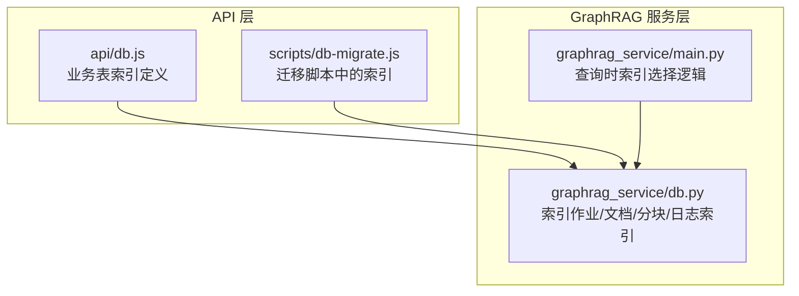
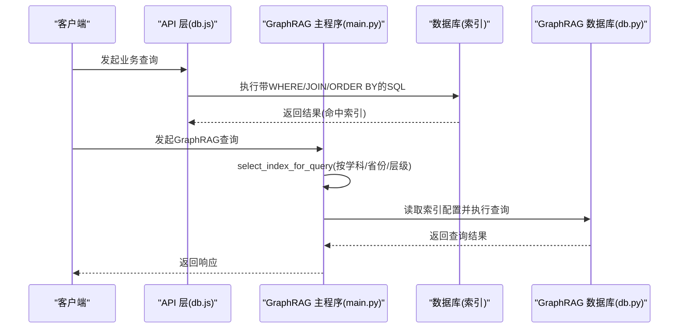
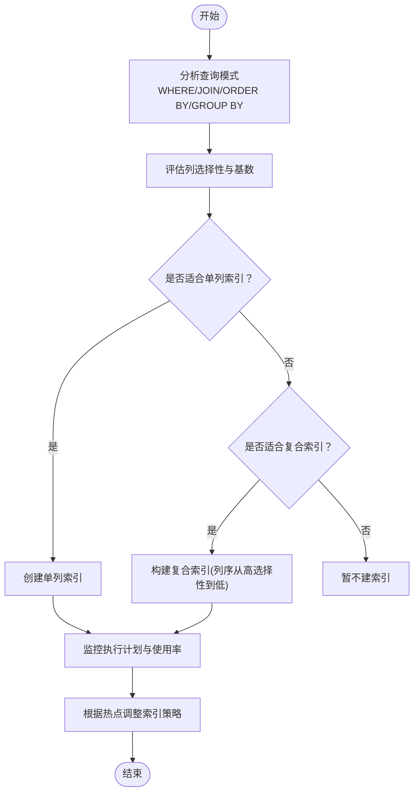
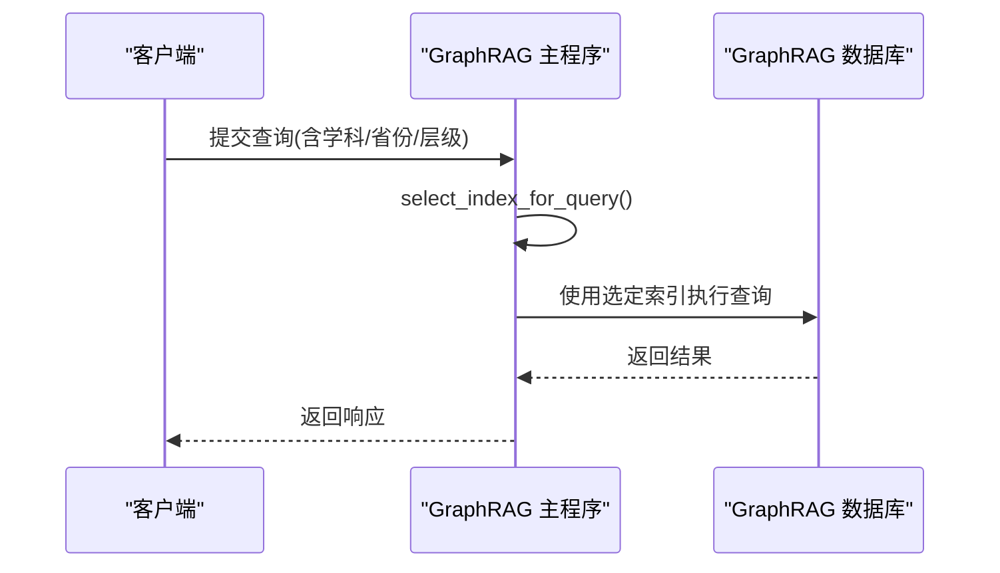
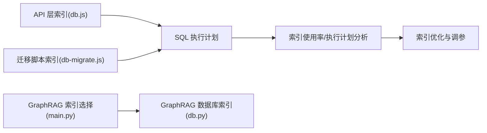

# 索引策略

<cite>
**本文引用的文件**
- [db.js](file://api/db.js)
- [db-migrate.js](file://scripts/db-migrate.js)
- [db.py](file://graphrag_service/db.py)
- [main.py](file://graphrag_service/main.py)
</cite>

## 目录
1. [简介](#简介)
2. [项目结构](#项目结构)
3. [核心组件](#核心组件)
4. [架构总览](#架构总览)
5. [详细组件分析](#详细组件分析)
6. [依赖分析](#依赖分析)
7. [性能考量](#性能考量)
8. [故障排查指南](#故障排查指南)
9. [结论](#结论)
10. [附录](#附录)

## 简介
本文件面向AI家教项目的数据库索引设计与优化，系统化梳理现有索引策略、查询模式对索引的影响、索引监控与维护方法，并给出针对写入性能的平衡策略与调优建议。内容基于后端API层与GraphRAG服务层的数据库访问与索引定义进行归纳总结。

## 项目结构
本项目数据库索引主要分布在以下位置：
- API层数据库脚本：负责业务表（如试卷、题目、练习记录、省份等）的索引创建与维护。
- GraphRAG服务数据库脚本：负责图谱索引作业、文档分块、查询日志等的索引管理。
- GraphRAG服务主程序：提供按查询条件智能选择索引的逻辑。

图表来源
- [db.js:308-338](file://api/db.js#L308-L338)
- [db-migrate.js:427-461](file://scripts/db-migrate.js#L427-L461)
- [db.py:48-117](file://graphrag_service/db.py#L48-L117)
- [main.py:160-173](file://graphrag_service/main.py#L160-L173)

章节来源
- [db.js:308-338](file://api/db.js#L308-L338)
- [db-migrate.js:427-461](file://scripts/db-migrate.js#L427-L461)
- [db.py:48-117](file://graphrag_service/db.py#L48-L117)
- [main.py:160-173](file://graphrag_service/main.py#L160-L173)

## 核心组件
- 业务表索引（API层）
  - 覆盖试卷、题目、练习记录、省份、错题、报告、知识点等核心表的单列与复合索引，服务于高频查询场景（过滤、排序、关联）。
- 图谱索引作业与日志（GraphRAG服务）
  - 针对索引作业状态、索引名称、文档状态/哈希/地区/学科/年份/考试类型、分块文档ID、查询日志时间等建立索引，保障索引调度与查询性能。
- 智能索引选择（GraphRAG服务）
  - 基于查询参数（学科、省份、考试层级）动态选择最优索引，减少全表扫描。

章节来源
- [db.js:308-338](file://api/db.js#L308-L338)
- [db-migrate.js:427-461](file://scripts/db-migrate.js#L427-L461)
- [db.py:48-117](file://graphrag_service/db.py#L48-L117)
- [main.py:160-173](file://graphrag_service/main.py#L160-L173)

## 架构总览
下图展示索引在查询路径中的作用：应用通过API层或GraphRAG服务发起查询，数据库利用已建索引加速WHERE、JOIN、ORDER BY、GROUP BY等操作；GraphRAG侧还根据查询条件选择合适的倒排索引以提升检索效率。

图表来源
- [db.js:308-338](file://api/db.js#L308-L338)
- [main.py:160-173](file://graphrag_service/main.py#L160-L173)
- [db.py:48-117](file://graphrag_service/db.py#L48-L117)

## 详细组件分析

### 组件A：业务表索引设计与查询模式匹配
- 设计原则
  - 单列索引优先用于高选择性列（如学科、省份、年份、难度等级），支撑WHERE过滤与ORDER BY排序。
  - 复合索引优先用于多列过滤/连接/排序组合，减少回表与临时排序成本。
- 典型场景
  - WHERE：按学科/省份/年份/难度过滤；按用户邮箱过滤练习记录与错题。
  - JOIN：练习记录与知识点、题目与试卷、省份信息等。
  - ORDER BY/GROUP BY：按时间戳排序、按学科/省份聚合统计。
- 现有索引示例
  - 试卷：按省份、年份、学科、考试层级的单列与复合索引。
  - 题目：按试卷ID+题号的复合索引，按难度、类型、学科、省份、年份的单列索引。
  - 练习记录：按用户邮箱、学科、知识点、时间戳、正确性等建立单列与复合索引。
  - 错题、报告、省份、知识点统计等均有相应索引覆盖。
- 选择性与基数
  - 高选择性列（如学科、难度）更适合单列索引；低选择性列（如性别、状态）需结合上下文评估是否建索引。
- 复合索引顺序
  - 将区分度高的列放在前面，有利于范围查询与等值查询的联合优化。

图表来源
- [db.js:308-338](file://api/db.js#L308-L338)
- [db-migrate.js:427-461](file://scripts/db-migrate.js#L427-L461)

章节来源
- [db.js:308-338](file://api/db.js#L308-L338)
- [db-migrate.js:427-461](file://scripts/db-migrate.js#L427-L461)

### 组件B：GraphRAG服务索引与查询路径
- 索引对象
  - 索引作业表：按状态、索引名建立索引，便于任务调度与状态查询。
  - 文档表：按状态、文件哈希、省份、学科、年份、考试类型建立索引，支持增量与筛选。
  - 分块表：按文档ID建立索引，支撑分块检索。
  - 查询日志表：按时间建立索引，便于查询性能审计与趋势分析。
- 查询索引选择
  - 根据学科、省份、考试层级动态选择索引，避免全表扫描，提高检索效率。

图表来源
- [main.py:160-173](file://graphrag_service/main.py#L160-L173)
- [db.py:48-117](file://graphrag_service/db.py#L48-L117)

章节来源
- [main.py:160-173](file://graphrag_service/main.py#L160-L173)
- [db.py:48-117](file://graphrag_service/db.py#L48-L117)

### 组件C：索引使用率与执行计划分析
- 建议指标
  - 索引使用率：统计各索引的命中次数与总查询数的比例。
  - 执行计划：关注是否存在全表扫描、临时排序、临时表等开销大的步骤。
  - 性能回归：对比索引前后QPS、P95/P99延迟变化。
- 监控手段
  - 业务侧：在关键接口埋点记录SQL执行耗时与是否命中索引。
  - GraphRAG侧：利用查询日志表的时间索引进行趋势分析与异常定位。
- 可视化
  - 将索引使用率与延迟、错误率关联，形成索引健康看板。

章节来源
- [db.py:95-117](file://graphrag_service/db.py#L95-L117)

## 依赖分析
- API层索引依赖于业务查询模式，需与SQL执行计划联动验证。
- GraphRAG服务索引依赖于查询参数分布，需配合智能索引选择逻辑。
- 两者共同依赖数据库的索引统计与执行计划工具，以持续优化。

图表来源
- [db.js:308-338](file://api/db.js#L308-L338)
- [db-migrate.js:427-461](file://scripts/db-migrate.js#L427-L461)
- [main.py:160-173](file://graphrag_service/main.py#L160-L173)
- [db.py:48-117](file://graphrag_service/db.py#L48-L117)

章节来源
- [db.js:308-338](file://api/db.js#L308-L338)
- [db-migrate.js:427-461](file://scripts/db-migrate.js#L427-L461)
- [main.py:160-173](file://graphrag_service/main.py#L160-L173)
- [db.py:48-117](file://graphrag_service/db.py#L48-L117)

## 性能考量
- 写入性能影响
  - 新增/更新/删除会触发索引维护，导致写入延迟上升。应优先保证高频写入路径的必要索引，避免冗余索引。
- 平衡策略
  - 对冷数据或低频查询的列，考虑延迟建索引或使用物化视图。
  - 合理拆分大表与分区，降低索引维护成本。
- 复合索引顺序
  - 将区分度高且常用于过滤/连接的列前置，有助于提升查询效率。
- 监控与回滚
  - 引入灰度发布与快速回滚机制，确保索引变更可逆。

## 故障排查指南
- 常见问题
  - 查询慢：检查执行计划是否存在全表扫描或临时排序。
  - 写入抖动：确认新增索引数量与列是否与热点写入冲突。
  - 索引失效：核对查询谓词是否能利用索引前缀（复合索引顺序不当）。
- 排查步骤
  - 采集执行计划与慢查询日志。
  - 对比索引使用率与延迟变化。
  - 回归测试关键路径，验证修复效果。
- 工具建议
  - 使用数据库自带的执行计划分析工具与索引使用统计功能。

章节来源
- [db.py:95-117](file://graphrag_service/db.py#L95-L117)

## 结论
本项目的索引策略围绕“查询模式驱动”与“写入性能平衡”展开：API层通过单列与复合索引覆盖高频过滤、连接与排序场景；GraphRAG服务通过智能索引选择与专用索引（作业、文档、分块、日志）保障检索效率。建议持续以执行计划与索引使用率为依据进行迭代优化，并在变更流程中引入监控与回滚机制，确保索引策略与业务增长同步演进。

## 附录
- 索引清单与建议
  - 业务表：按学科、省份、年份、难度、类型、用户邮箱等建立单列索引；对常用过滤/连接/排序组合建立复合索引。
  - GraphRAG：保持作业、文档、分块、日志等表的必要索引，配合查询参数选择逻辑提升检索效率。
- 维护建议
  - 定期清理未使用索引，合并碎片化索引。
  - 在低峰期批量重建索引，避免对在线业务造成影响。
  - 建立索引变更评审流程，纳入性能基线与回归测试。