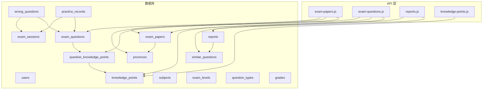
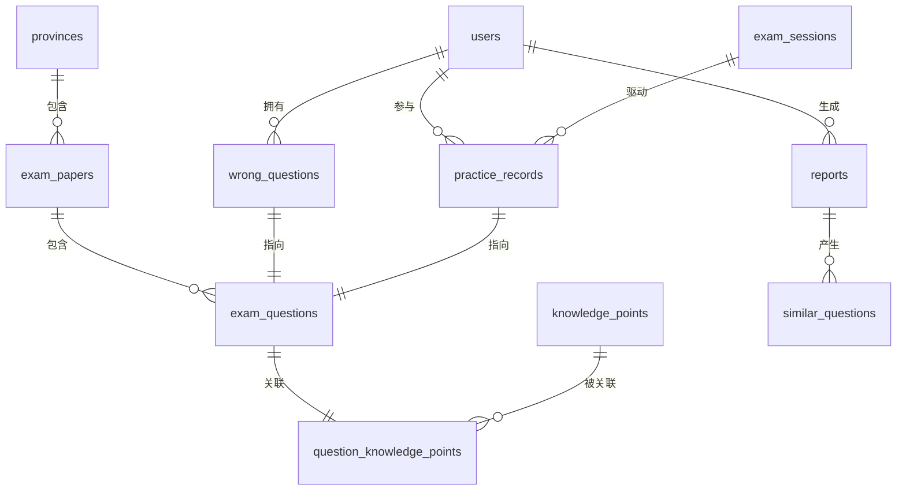
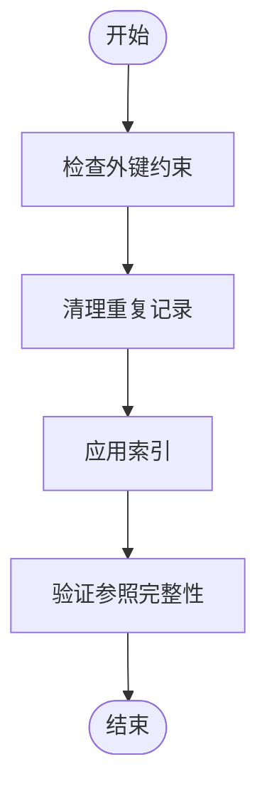

# 核心数据表

<cite>
**本文引用的文件**
- [api/db.js](file://api/db.js)
- [scripts/db-migrate.js](file://scripts/db-migrate.js)
- [api/exam-papers.js](file://api/exam-papers.js)
- [api/exam-questions.js](file://api/exam-questions.js)
- [api/reports.js](file://api/reports.js)
- [api/knowledge-points.js](file://api/knowledge-points.js)
- [api/utils/subjectMap.js](file://api/utils/subjectMap.js)
- [check-tables.cjs](file://check-tables.cjs)
</cite>

## 目录
1. [简介](#简介)
2. [项目结构](#项目结构)
3. [核心组件](#核心组件)
4. [架构总览](#架构总览)
5. [详细组件分析](#详细组件分析)
6. [依赖分析](#依赖分析)
7. [性能考虑](#性能考虑)
8. [故障排查指南](#故障排查指南)
9. [结论](#结论)
10. [附录](#附录)

## 简介
本文件聚焦AI家教项目的核心业务数据表，围绕用户表(users)、错题表(wrong_questions)、报告表(reports)、知识点表(knowledge_points)、试卷表(exam_papers)、试题表(exam_questions)等进行系统化梳理。内容涵盖字段定义、数据类型、约束条件、默认值、业务含义；表间外键关系与级联规则；数据完整性保障；典型查询场景与性能优化建议；以及表结构演进历史与版本兼容性说明。

## 项目结构
数据库初始化与迁移脚本集中于后端模块，核心DDL在数据库连接初始化时执行，同时配套索引与参考数据种子。API层通过统一的数据库连接池访问这些表，并提供查询、创建、删除等接口。

图表来源
- [api/db.js:38-324](file://api/db.js#L38-L324)
- [api/exam-papers.js:1-151](file://api/exam-papers.js#L1-L151)
- [api/exam-questions.js:1-243](file://api/exam-questions.js#L1-L243)
- [api/reports.js:1-67](file://api/reports.js#L1-L67)
- [api/knowledge-points.js:1-151](file://api/knowledge-points.js#L1-L151)

章节来源
- [api/db.js:38-324](file://api/db.js#L38-L324)
- [api/exam-papers.js:1-151](file://api/exam-papers.js#L1-L151)
- [api/exam-questions.js:1-243](file://api/exam-questions.js#L1-L243)
- [api/reports.js:1-67](file://api/reports.js#L1-L67)
- [api/knowledge-points.js:1-151](file://api/knowledge-points.js#L1-L151)

## 核心组件
本节按表维度给出字段定义、数据类型、约束与默认值、业务含义及典型用途。

- users
  - 字段与类型
    - id: 整型序列主键
    - email: 非空唯一字符串
    - password: 非空字符串
    - grade: 非空字符串
    - province: 可空字符串
    - exam_level: 可空字符串
    - created_at: 时间戳含时区，默认当前时间
    - updated_at: 时间戳含时区，默认当前时间
  - 约束与默认值
    - 主键: id
    - 唯一: email
    - 默认: created_at、updated_at
  - 业务含义
    - 学生或用户的账户信息，用于登录认证、学习路径与地区配置。

- wrong_questions
  - 字段与类型
    - id: 整型序列主键
    - user_email: 非空字符串
    - data: 文本，存储错题原始JSON
    - subject_code: 可空字符串（结构化补充）
    - knowledge_point_id: 可空字符串（结构化补充）
    - difficulty: 整型（结构化补充）
    - question_id: 整型（结构化补充）
    - is_correct: 整型，默认0（结构化补充）
    - exam_level: 可空字符串（结构化补充）
    - user_answer: 可空文本（结构化补充）
    - correct_answer: 可空文本（结构化补充）
    - session_id: 可空字符串（结构化补充）
    - timestamp: 时间戳含时区，默认当前时间
  - 约束与默认值
    - 主键: id
    - 默认: timestamp
  - 业务含义
    - 记录用户的错题数据，支持按学科、知识点、难度、会话等维度查询与分析。

- reports
  - 字段与类型
    - id: 整型序列主键
    - user_email: 非空字符串
    - data: 文本，存储报告原始JSON
    - subject_code: 可空字符串（结构化补充）
    - score: 数值(5,2)，可空（结构化补充）
    - difficulty: 整型（结构化补充）
    - knowledge_point_id: 可空字符串（结构化补充）
    - timestamp: 时间戳含时区，默认当前时间
  - 约束与默认值
    - 主键: id
    - 默认: timestamp
  - 业务含义
    - 记录用户的测评/练习报告，支持相似题推荐关联。

- knowledge_points
  - 字段与类型
    - id: 字符串主键
    - subject: 非空字符串
    - name: 非空字符串
    - subtopics: 文本，默认空数组字符串
    - difficulty: 整型，默认3
    - frequency: 字符串，默认'medium'
    - description: 可空文本
    - level: 字符串，默认'gaokao'
    - updated_at: 时间戳含时区，默认当前时间
  - 约束与默认值
    - 主键: id
    - 默认: subtopics、difficulty、frequency、level、updated_at
  - 业务含义
    - 知识点元数据，支持按学科、层级、难度、频率等维度管理。

- exam_papers
  - 字段与类型
    - id: 整型序列主键
    - province_code: 可空字符串（外键至provinces.code）
    - year: 非空整型
    - subject: 非空字符串
    - exam_level: 非空字符串
    - paper_file_path: 可空字符串
    - question_count: 可空整型
    - total_score: 可空整型
    - difficulty_avg: 数值(3,2)，可空
    - created_at: 时间戳含时区，默认当前时间
    - updated_at: 时间戳含时区，默认当前时间
  - 约束与默认值
    - 主键: id
    - 默认: created_at、updated_at
  - 业务含义
    - 试卷元数据，支持按省、年份、学科、层级筛选。

- exam_questions
  - 字段与类型
    - id: 整型序列主键
    - paper_id: 非空整型（外键至exam_papers.id，级联删除）
    - question_number: 非空整型
    - question_type: 非空字符串
    - stem: 非空文本
    - options: 可空文本（JSON）
    - answer: 可空文本（JSON）
    - analysis: 可空文本
    - knowledge_points: 可空文本（JSON，旧版）
    - difficulty: 整型，检查1-5
    - ability_tags: 可空文本（JSON）
    - score: 可空整型
    - subject_code: 可空字符串（结构化补充）
    - province_code: 可空字符串（结构化补充）
    - year: 可空整型（结构化补充）
    - created_at: 时间戳含时区，默认当前时间
    - updated_at: 时间戳含时区，默认当前时间
  - 约束与默认值
    - 主键: id
    - 外键: paper_id -> exam_papers.id (ON DELETE CASCADE)
    - 检查: difficulty ∈ [1,5]
    - 默认: created_at、updated_at
  - 业务含义
    - 试题明细，支持按试卷、题号、难度、类型、知识点等查询。

- question_knowledge_points（多对多关联）
  - 字段与类型
    - id: 整型序列主键
    - question_id: 非空整型（外键至exam_questions.id，级联删除）
    - knowledge_point_id: 非空字符串（外键至knowledge_points.id）
    - relevance_score: 数值(3,2)，默认1.00
    - created_at: 时间戳含时区，默认当前时间
  - 约束与默认值
    - 主键: id
    - 唯一: (question_id, knowledge_point_id)
    - 默认: relevance_score、created_at
  - 业务含义
    - 试题与知识点的关联表，支持按知识点检索题目。

- practice_records（练习记录）
  - 字段与类型
    - id: 整型序列主键
    - user_email: 非空字符串
    - question_id: 可空整型（外键至exam_questions.id，ON DELETE SET NULL）
    - subject_code: 可空字符串
    - knowledge_point_id: 可空字符串
    - difficulty: 可空整型
    - is_correct: 整型，默认0
    - user_answer: 可空文本
    - correct_answer: 可空文本
    - time_spent_ms: 可空整型
    - session_id: 可空字符串（外键至exam_sessions.id，ON DELETE SET NULL）
    - exam_level: 可空字符串
    - created_at: 时间戳含时区，默认当前时间
  - 约束与默认值
    - 主键: id
    - 默认: is_correct、created_at
  - 业务含义
    - 用户练习历史，便于统计正确率、耗时、知识点掌握情况。

- exam_sessions（考试会话）
  - 字段与类型
    - id: 字符串主键
    - user_email: 非空字符串
    - subject: 非空字符串
    - province_code: 可空字符串
    - time_limit: 整型，默认120
    - question_count: 整型，默认0
    - status: 字符串，默认'active'
    - accuracy: 数值(5,2)，可空
    - score: 整型，默认0
    - total_score: 整型，默认0
    - correct_count: 整型，默认0
    - started_at: 时间戳含时区，默认当前时间
    - completed_at: 可空时间戳
  - 约束与默认值
    - 主键: id
    - 默认: time_limit、question_count、status、score、total_score、correct_count、started_at
  - 业务含义
    - 练习/考试会话状态与统计，支持按用户、学科、状态查询。

- similar_questions（报告相似题）
  - 字段与类型
    - id: 整型序列主键
    - report_id: 非空整型（外键至reports.id，级联删除）
    - user_email: 非空字符串
    - data: 文本（JSON）
    - created_at: 时间戳含时区，默认当前时间
  - 约束与默认值
    - 主键: id
    - 默认: created_at
  - 业务含义
    - 报告对应的相似题集合，用于个性化推荐。

章节来源
- [api/db.js:42-246](file://api/db.js#L42-L246)

## 架构总览
下图展示核心表之间的关系与外键约束，体现数据流向与完整性控制策略。

图表来源
- [api/db.js:94-246](file://api/db.js#L94-L246)

## 详细组件分析

### 用户表 users
- 设计要点
  - 使用email唯一约束确保登录唯一性
  - created_at/updated_at统一采用TIMESTAMPTZ，便于跨时区一致性
- 典型查询
  - 登录校验: 按email查找
  - 地区/层次配置: 按province、exam_level过滤
- 性能建议
  - 对email建立唯一索引（由唯一约束自动维护）
  - 若频繁按grade/province查询，可考虑复合索引

章节来源
- [api/db.js:42-52](file://api/db.js#L42-L52)

### 错题表 wrong_questions
- 设计要点
  - data字段保存原始JSON，便于灵活扩展
  - 结构化补充字段(subject_code、knowledge_point_id、difficulty、question_id、is_correct、exam_level、user_answer、correct_answer、session_id)提升查询效率
  - timestamp默认当前时间，便于排序与统计
- 典型查询
  - 获取某用户某学科错题列表
  - 按知识点/难度/会话聚合统计
- 性能建议
  - 建议索引: user_email、subject_code、knowledge_point_id、difficulty、timestamp、session_id、question_id
  - 结构化字段已由迁移脚本补齐，查询时优先使用结构化字段

章节来源
- [api/db.js:94-108](file://api/db.js#L94-L108)
- [scripts/db-migrate.js:106-210](file://scripts/db-migrate.js#L106-L210)

### 报告表 reports 与相似题 similar_questions
- 设计要点
  - reports保存报告JSON，similar_questions按report_id关联相似题
  - reports与similar_questions通过外键实现级联删除，保证数据一致性
- 典型查询
  - 获取用户报告列表并合并相似题
  - 创建报告并批量插入相似题
- 性能建议
  - 建议索引: user_email、subject_code、timestamp
  - similar_questions按report_id建立索引，加速报告详情加载

章节来源
- [api/db.js:110-140](file://api/db.js#L110-L140)
- [api/reports.js:1-67](file://api/reports.js#L1-L67)

### 知识点表 knowledge_points
- 设计要点
  - id为主键，支持字符串型知识点编码
  - subtopics默认数组格式，便于前端渲染
  - level区分高考/中考，frequency支持高频/中频/低频权重
- 典型查询
  - 按学科/层级查询知识点
  - 导入/更新知识点（支持ON CONFLICT）
- 性能建议
  - 建议索引: subject、level、subject+level

章节来源
- [api/db.js:142-152](file://api/db.js#L142-L152)
- [api/knowledge-points.js:1-151](file://api/knowledge-points.js#L1-L151)

### 试卷表 exam_papers 与试题表 exam_questions
- 设计要点
  - exam_papers记录试卷元数据，question_count/total_score/difficulty_avg用于统计
  - exam_questions与paper_id建立一对多关系，删除试卷时级联删除题目
  - 新增结构化字段(subject_code、province_code、year)便于查询
- 典型查询
  - 获取试卷列表（支持省/年/学科/层级过滤）
  - 获取试卷详情并统计题目数量
  - 按试卷查询题目（支持类型/难度/知识点过滤）
- 性能建议
  - 建议索引: province_code/year/subject/exam_level、paper_id、paper_id+question_number、difficulty、question_type、subject_code、province_code、year

章节来源
- [api/db.js:173-205](file://api/db.js#L173-L205)
- [api/exam-papers.js:1-151](file://api/exam-papers.js#L1-L151)
- [api/exam-questions.js:1-243](file://api/exam-questions.js#L1-L243)

### 多对多关联 question_knowledge_points
- 设计要点
  - 关联题与知识点，支持relevance_score
  - 唯一约束防止重复关联
- 典型查询
  - 查询某知识点下的所有题目
  - 查询某题关联的知识点
- 性能建议
  - 建议索引: question_id、knowledge_point_id

章节来源
- [api/db.js:207-214](file://api/db.js#L207-L214)

### 练习记录 practice_records 与会话 exam_sessions
- 设计要点
  - practice_records记录用户做题历史，question_id与session_id可为空（未匹配到题或会话结束）
  - 与exam_questions、exam_sessions建立外键，删除行为设置为SET NULL，保留历史记录
- 典型查询
  - 用户练习历史、按学科/知识点/正确率统计
- 性能建议
  - 建议索引: user_email、subject_code、knowledge_point_id、is_correct、created_at

章节来源
- [api/db.js:232-246](file://api/db.js#L232-L246)

## 依赖分析
- 外键与级联
  - exam_questions.paper_id -> exam_papers.id (ON DELETE CASCADE)
  - question_knowledge_points.question_id -> exam_questions.id (ON DELETE CASCADE)
  - question_knowledge_points.knowledge_point_id -> knowledge_points.id
  - practice_records.question_id -> exam_questions.id (ON DELETE SET NULL)
  - practice_records.session_id -> exam_sessions.id (ON DELETE SET NULL)
  - similar_questions.report_id -> reports.id (ON DELETE CASCADE)
- 数据完整性
  - 迁移脚本清理重复记录，确保唯一性
  - 删除无效引用，维持参照完整性

图表来源
- [scripts/db-migrate.js:502-545](file://scripts/db-migrate.js#L502-L545)

章节来源
- [scripts/db-migrate.js:502-545](file://scripts/db-migrate.js#L502-L545)

## 性能考虑
- 索引策略
  - 已创建的复合索引覆盖常见查询条件：省/年/学科、学科/层级、用户/学科等
  - 建议新增：按user_email+subject_code的复合索引，提升弱项分析与练习记录查询效率
- 查询优化
  - 使用结构化字段替代对JSON字段的解析，减少运行时处理成本
  - 分页查询时优先使用LIMIT/OFFSET，配合合适索引
- 写入优化
  - 批量导入/更新时使用事务，减少锁竞争
  - 控制JSON字段大小，避免过大text影响IO

## 故障排查指南
- 常见问题
  - 无法查询到数据：确认查询条件是否命中索引，检查结构化字段是否已迁移填充
  - 外键约束报错：确认被引用记录是否存在，遵循级联删除/SET NULL策略
  - 重复记录：迁移脚本已清理重复，如仍出现需检查业务写入逻辑
- 排查步骤
  - 使用检查脚本查看表行数与示例数据
  - 核对迁移版本与已应用版本，确保索引与约束均已创建
  - 关注API层返回的错误响应，定位具体请求参数与SQL

章节来源
- [check-tables.cjs:1-44](file://check-tables.cjs#L1-L44)
- [scripts/db-migrate.js:548-646](file://scripts/db-migrate.js#L548-L646)

## 结论
本项目通过结构化的表设计与完善的索引策略，支撑了错题分析、报告生成、知识点管理、试卷与试题检索等核心业务。迁移脚本确保了历史数据的结构化与完整性，API层提供了清晰的查询与写入接口。建议持续关注查询热点字段的索引完善与写入流程的事务优化，以进一步提升系统性能与稳定性。

## 附录

### 表结构演进历史与版本兼容
- 版本1：创建参考表（subjects、question_types、exam_levels、grades），并注入种子数据
- 版本2：为wrong_questions增加结构化字段，回填历史JSON数据
- 版本3：为reports增加结构化字段，回填历史JSON数据
- 版本4：创建question_knowledge_points多对多关联表，迁移旧版knowledge_points字段
- 版本5：创建practice_records表，从已完成会话迁移练习记录
- 版本6：为多表添加updated_at字段
- 版本7：为exam_questions增加subject_code、province_code、year字段
- 版本8：创建全面索引，覆盖常见查询维度
- 版本9：清理重复记录（wrong_questions、reports、exam_questions）
- 版本10：删除无效引用，确保参照完整性

章节来源
- [scripts/db-migrate.js:8-546](file://scripts/db-migrate.js#L8-L546)